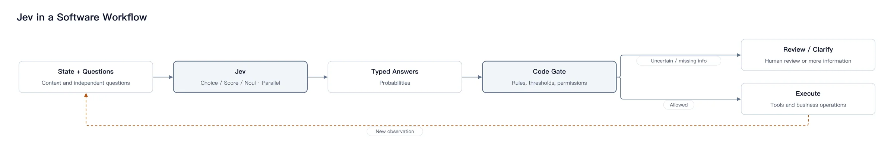

## Jev 是什么：不负责写回答，而是提供判断

假设一条客服工单进入系统，你可能并不需要 AI 写一篇分析，而只想知道：交给哪个部门？用户是否要求退款？是否需要优先处理？

**Jev 就是面向这类问题的决策模型：输入业务状态与明确的问题，输出软件可以直接使用的类型化判断和概率。**

TypeSafe AI 在 [2026 年 9 月 15 日的官方介绍](https://typesafe.ai/blog/introducing-system-one-models-and-jev)中，将 Jev 称为首个公开的 **System One Model（系统一模型）**，并宣布开放早期访问。这里介绍的是 Jev，不是名称相近的 JEPA。

“System One”借用了快速、直觉式判断的概念，但不意味着它复制了人脑。更实用的理解是：**给软件里的 `if` 判断补上理解自然语言的能力。**

| 你要完成的事情                         | 更合适的角色     |
| -------------------------------------- | ---------------- |
| 写一封有语气、有解释的客服回复         | 文本生成模型     |
| 判断工单属于账单、技术还是账户问题     | Jev 这类决策模型 |
| 检查订单金额、账户权限、退款是否已执行 | 确定性的业务代码 |

这不是说普通大语言模型不能分类或输出结构化数据。区别在于，Jev 的公开定位就是受约束的决策接口，而不是一个先生成自由文本、再从中提取答案的聊天接口。本文依据截至 **2026 年 9 月 28 日**可读的官方资料介绍其能力，不包含实际 API 调用或性能测试。

## 公开原理：限制输出空间，让不确定性可以被程序使用

### 1. 类型化决策：先规定“能回答什么”

使用 Jev 时，开发者先定义问题、候选项或评分标准。模型在这个范围内返回结果，而不是自行发明答案格式。

[官方 API 文档](https://docs.typesafe.ai/api)列出了三种核心问题类型：

| 类型       | 用来问什么                         | 返回结果的含义                                            |
| ---------- | ---------------------------------- | --------------------------------------------------------- |
| **Choice** | “从这些选项中选哪一个？”           | 最高概率选项、所有选项的概率分布，以及 `confidence`       |
| **Score**  | “按这些有序等级，应评到什么程度？” | 各等级的概率、按等级索引加权得到的分数，以及 `confidence` |
| **Noul**   | “某个判断是否成立？”               | 答案为“是”的概率，范围为 0 到 1                           |

例如，Choice 的候选项可以是“账单、技术、账户、其他”。Score 可以定义为“0＝平静、1＝不满、2＝非常愤怒”，因此结果可能落在等级之间。Noul 则可以询问“这条消息是否明确要求退款”。

有两个容易混淆的地方：

- **Score 不是置信度。** 情绪评分高，表示用户更愤怒，不表示模型更确定。
- **Noul 的概率不是另一个独立的 `confidence` 字段。** 官方文档中，Choice 和 Score 带有从概率分布派生的 `confidence`，Noul 不带该字段。也不应把 `confidence` 直接当成最高选项的概率。

### 2. 并行输出：独立问题可以一起问

官方发布说明将 Jev 的并行采样，与文本模型逐 token 自回归生成的方式作对比；[工作流设计文档](https://docs.typesafe.ai/concepts/how-to-build-with-system-one)进一步说明，独立问题可以并行评估，一个问题的结果不会成为另一个问题的隐藏上下文。

因此，“属于哪个部门”“是否要求退款”“情绪有多激烈”可以针对同一份工单一起判断。

但**并行不等于消除业务依赖**。如果第二个问题需要先查询订单数据库，就必须等查询结果返回，再在新状态上发起后续判断。不能指望同一批问题中的一个答案，自动成为另一个问题的输入。

### 3. RLCD：目标不只是答对，还要表达不确定性

TypeSafe 将其训练方法称为 **Reinforcement Learning for Calibrated Decisions（RLCD，面向校准决策的强化学习）**。按官方介绍，其目标是让决策概率更诚实地反映不确定性。

“校准”可以这样理解：假设一批可比较的判断都给出约 80% 的概率，理想情况下，对应事件在这批样本中应约有 80% 成立。这里的数字只用于解释概念，不是 Jev 的测试结果。

**校准是跨样本的统计性质，不是对某一次判断的正确性保证。** 换到新的行业、语言或异常输入后，仍要用自己的业务数据检查它是否可靠。

上述资料公开了接口、并行评估思路和训练目标，但不足以还原完整的网络结构、参数规模、训练数据配方或 RLCD 奖励实现。第三方使用开源模型做出的类似系统，也不能被当成 Jev 的官方内部架构。

## 目前怎么运行：模型判断，代码掌握执行权

从应用开发者的视角看，一次 Jev 工作流可以拆成五步：

1. **准备状态。** 将用户消息、相关记录、工具可用性等必要信息组织成 `state`。它可以是文本，也可以是对象或数组。
2. **定义窄问题。** 用 `questions` 指定问题、类型和判断标准；候选集合应提供“其他”“需澄清”等合理出口。
3. **取得类型化答案。** 同一请求可以包含多个独立问题，响应通过对应的问题键返回答案。
4. **由代码作门控。** 综合概率、业务规则、权限及风险，决定自动处理、请求补充信息或交给人工。
5. **执行并更新状态。** 数据库查询、工单分派、工具调用由外围系统执行；有后续依赖时，将真实执行结果用于下一轮判断。

图：Jev 提供受约束的判断，代码决定是否执行；有依赖的后续判断需在新状态上重新发起。虚线回路表示执行结果进入下一轮，而非同轮问题互相依赖。示意图，非官方架构图。

这里最重要的分工是：**Jev 提供判断，不自动获得行动权限。** “用户想退款”是语义判断，“订单是否符合退款规则”可能是确定性检查，“是否真的发起退款”则是受权限与审批控制的操作。

## 案例一：客服工单分类与优先级处理

以下为**教学模拟，未调用 Jev**。概率和规则均为人为设置，用于展示数据如何流动；表格不是 API 响应 schema，也不是效果实测。

### 输入：用户消息与必要上下文

用户留言：

> 我续费后被扣了两次钱，已经等了三天。请把多扣的一笔退给我，今天能处理吗？

系统附带的状态是：已登录、提供了订单编号，但尚未核验支付流水。开发者定义三个独立问题：主处理部门、是否明确要求退款、表达出的不满程度。

### 模拟判断输出

| 问题             | 类型与标准                        | 教学模拟结果                                 |
| ---------------- | --------------------------------- | -------------------------------------------- |
| 主处理部门       | Choice：账单、技术、账户、其他    | 概率分别为 0.92、0.03、0.02、0.03；选择账单  |
| 是否明确要求退款 | Noul                              | “是”的概率为 0.98                            |
| 不满程度         | Score：0 平静、1 不满、2 非常愤怒 | 等级概率为 0.10、0.75、0.15；加权分数为 1.05 |

Score 的计算是 `0×0.10 + 1×0.75 + 2×0.15 = 1.05`。它表达“更接近不满”，不等于“退款很紧急”或“模型有 105% 的把握”。紧急程度若很重要，应另设问题或由服务时限规则判断。

### 后续处理与预期效果

假设教学规则规定：主部门概率达到 0.90 才自动分派；退款请求概率达到 0.95 则进入退款核验流程。两项结果都达到示例门槛，因此系统：

1. 将工单分派给账单团队。
2. 标记“用户要求退款”，启动重复扣款核验。
3. 按等待时长与客服服务时限规则调整处理顺序。
4. 查询真实交易记录，符合规则后才进入退款审批或执行环节。

这套流程展示的效果是：**把一段自然语言变成可分派、可核验的处理事项，而不是让模型直接承诺退款。**“被扣两次”目前仍是用户陈述，必须用支付记录确认。

若账单和技术两个选项概率接近，就应进入复核，而不是强行自动归类。上述门槛只是教学设定，上线前必须根据误分成本和历史工单验证。

## 案例二：Agent 应该调用哪个工具

以下同样是**教学模拟，未调用 Jev 或任何工具**。它演示的是“Agent 中的受约束路由组件”，不是 Jev 自主规划并执行整个任务。

### 输入：请求、工具白名单与当前状态

用户说：

> 帮我查一下订单 A1024 到哪了，先别取消，也不要退款。

应用提供以下候选动作：

- `lookup_order`：查询订单与物流。
- `search_help`：查询帮助文档。
- `request_refund`：申请退款。
- `ask_user`：请求补充或澄清信息。

当前状态还包含：用户已登录、订单号已从消息中提取，但订单归属尚待业务系统验证。

### 模拟判断输出

| 问题                         | 类型   | 教学模拟结果                                                      |
| ---------------------------- | ------ | ----------------------------------------------------------------- |
| 下一步应路由到哪个候选动作？ | Choice | `lookup_order` 为 0.96，其余依次为 0.01、0.01、0.02；选择查询订单 |
| 用户是否明确请求退款？       | Noul   | “是”的概率为 0.01                                                 |

这不意味着 Jev 已经生成了完整工具调用，更不意味着订单查询已经发生。它只给出了候选动作中的选择与相关判断。

### 后续处理与预期效果

假设示例路由门槛为 0.90，外围程序接着做这些事：

1. 确认所选动作在工具白名单内。
2. 校验订单号格式、登录权限和订单归属；检查失败则拒绝查询或要求补充信息。
3. 按真实工具 schema 组装参数，调用只读的 `lookup_order`。
4. 将物流结果交给页面或文本生成模型展示；若查询超时，则走重试或人工处理分支，不编造物流状态。

假设工具实际返回“运输中，预计明日送达”，后续系统才能据此回答用户。这里的返回内容也是场景假设，而非真实查询记录。

这个例子展示的效果是：**将工具选择限制在已知集合内，再由代码检查权限、构造调用并处理结果。** 如果用户改口说“查不到就退款”，系统应先查询，再根据新状态和退款规则决定下一步；不能把两个有依赖的动作当作一次并行判断直接执行。

## 适用范围与边界：它不是“不会错的 AI”

Jev 比较适合候选范围清楚、判断频繁、结果可以交给代码继续处理的任务，例如工单分类、内容标签、线索评分、工具路由，以及工作流中的语义检查。

它不适合单独承担长文写作、开放式代码生成或多步骤自主规划；不应替代数据库事实核验，也不能仅凭一个概率值就批准转账、删除或高风险医疗决策。把它用于安全检测时，也应是多层防护的一环，而非唯一防线。

尤其要分清三个边界：

- **类型合法，不等于事实正确。** 官方强调 schema 匹配保证，并使用了“不会幻觉”的表述。工程上应把这与语义正确性分开：模型不输出候选集合之外的部门，仍可能在集合内选错部门。
- **概率可用，不等于默认门槛通用。** 业务应根据漏判与误判的成本选择阈值，保留复核出口，并监控数据变化后的表现。
- **单次推理快，不等于整个系统快。** 网络、数据库、工具调用和审批都可能主导总耗时。

本文不将官方宣传中的性能倍数当作通用结论。[发布说明](https://typesafe.ai/blog/introducing-system-one-models-and-jev)也交代了限制：速度评测通常从美国西海岸、接近服务所在地的环境发起；演示中的短输入对 Jev 有利；工作流评测以外部模型的平均预测作为参考，而非逐条人工事实真值；对照模型还需输出兼容的结构化概率。这些结果不能直接换算成你的业务收益。

如果准备尝试 Jev，最合适的起点不是替换整个 Agent，而是选一个**低风险、标签清晰、已有历史数据的判断环节**，先观察分类质量、自动处理覆盖率和人工复核量。

记住它的核心分工就够了：**Jev 把状态变成受约束的判断，代码把判断变成受控制的行动。**
