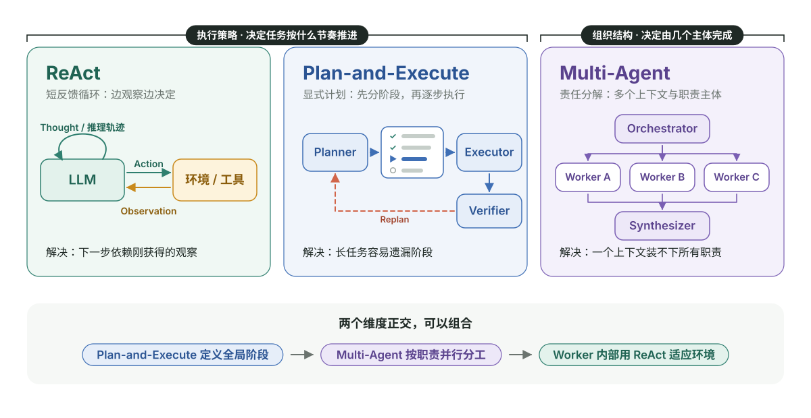
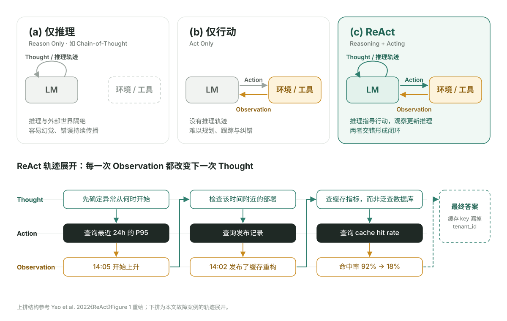
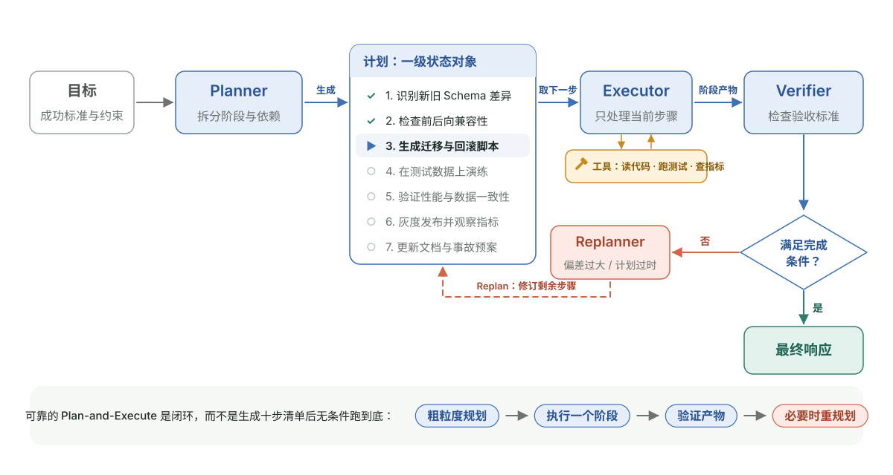
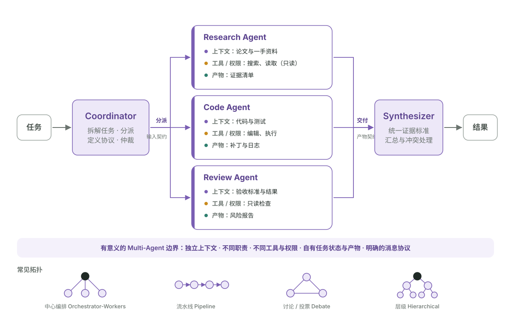
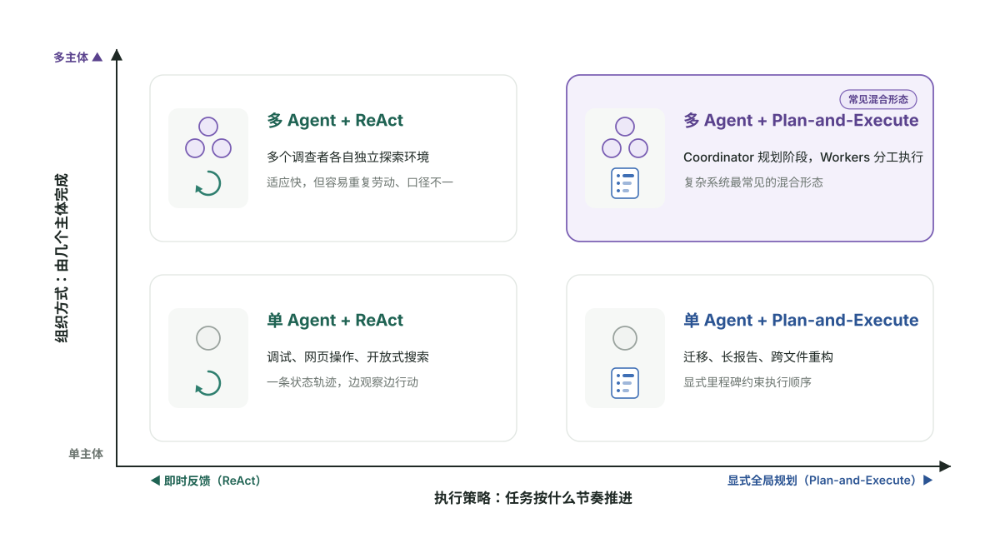
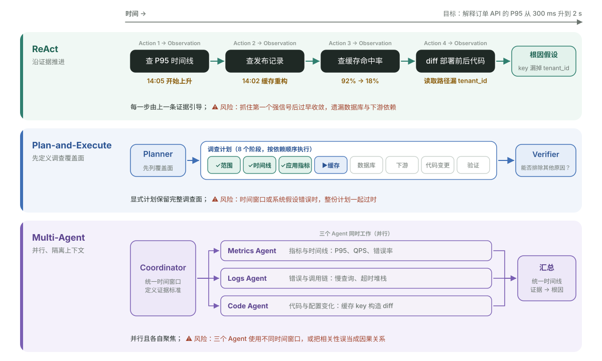
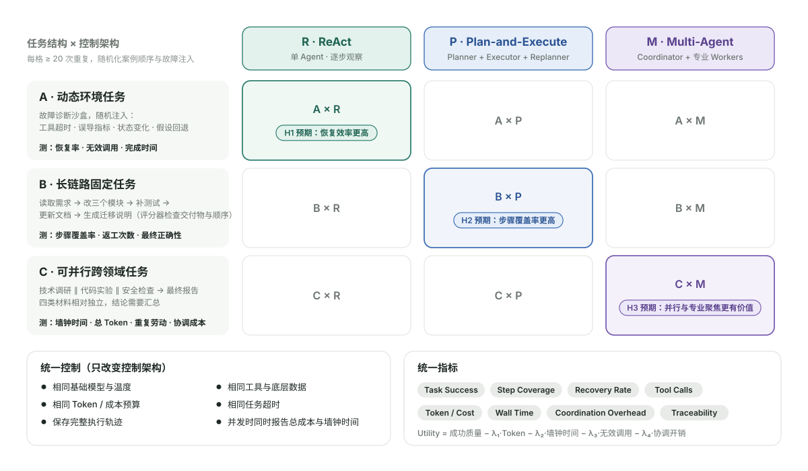
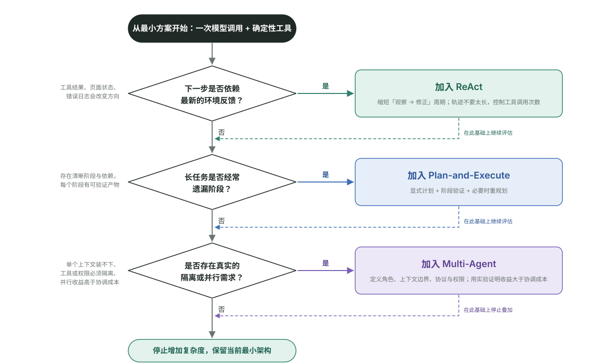

假设你要让 Agent 调查一次线上故障：订单 API 的 P95 延迟突然从 300 ms 升到了 2 s。

它应该一边看指标、一边决定下一步；还是先写出完整调查计划再执行；或者同时派出指标、日志和代码三个 Agent？

这正是 **ReAct、Plan-and-Execute 和 Multi-Agent** 经常被放在一起比较的原因。但这种“三选一”的提问方式，本身就隐藏了一个概念错误。

> [!IMPORTANT]
> **ReAct 与 Plan-and-Execute 主要决定任务按什么时间节奏推进；Multi-Agent 主要决定任务由几个拥有独立职责和上下文的主体完成。**
>
> 前两者是执行策略，后者是组织结构。它们可以组合，而不是只能三选一。



_图 1：ReAct 与 Plan-and-Execute 是执行策略，Multi-Agent 是组织结构；两者正交，可以组合。本文架构图为自绘，其中图 2、3、4 的结构分别参考 ReAct 论文 Figure 1、LangChain Plan-and-Execute 与 Anthropic Orchestrator-Workers 的经典画法。_

## Table of contents

## 一分钟建立正确直觉

三种架构分别在回答不同的核心问题：

| 架构                 | 它真正回答的问题                       | 最短定义         |
| -------------------- | -------------------------------------- | ---------------- |
| **ReAct**            | 根据刚得到的环境反馈，下一步做什么？   | 短反馈循环       |
| **Plan-and-Execute** | 完成目标需要哪些阶段，按什么依赖执行？ | 显式任务图       |
| **Multi-Agent**      | 谁负责什么，彼此如何交换信息和产物？   | 责任与上下文分解 |

可以把它们压缩成一句话：

> **ReAct 优化适应性，Plan-and-Execute 优化全局结构，Multi-Agent 优化职责与上下文的组织方式。**

### 第一张判断表

| 维度         | ReAct                      | Plan-and-Execute             | Multi-Agent                        |
| ------------ | -------------------------- | ---------------------------- | ---------------------------------- |
| 主要分解方式 | 按行动逐步分解             | 按阶段和依赖分解             | 按角色、能力或权限分解             |
| 计划形态     | 局部、动态                 | 全局或阶段性显式计划         | 可集中、可分布，也可以没有全局计划 |
| 状态中心     | 一条主要执行轨迹           | 计划状态 + 执行状态          | 多个局部状态 + 共享协议            |
| 纠错位置     | 每次 Observation 之后      | 阶段验证或 Replanner         | Worker 内部、交接处与汇总阶段      |
| 天然并行性   | 弱                         | 取决于任务依赖图             | 较强，但不是自动获得               |
| 主要收益     | 环境变化后快速调整         | 降低长任务的步骤遗漏         | 专业分工、上下文隔离、并行         |
| 主要代价     | 工具调用多、容易短视或循环 | 计划可能过时、规划本身有成本 | 通信、冲突、重复劳动和级联错误     |

接下来不从术语定义出发，而是从每种架构试图解决的**核心问题**出发。

## ReAct：环境不断变化，下一步无法提前确定

### 核心问题

ReAct 面对的是这样一类任务：

> **如果没有刚才那次工具调用的结果，我就无法可靠地决定下一步。**

例如：

- 调试时，新的错误日志决定下一条命令
- 搜索时，新证据会改变关键词
- 操作网页时，页面状态会随动作变化
- 工具可能失败，需要立刻切换策略
- 用户需求不完整，需要边执行边澄清

### 它怎么解决

ReAct 来自论文 _ReAct: Synergizing Reasoning and Acting in Language Models_。它将推理和行动交错组织成一个闭环：

```text
Thought → Action → Observation → 更新 Thought → 下一次 Action
```



_图 2：上排对照仅推理、仅行动与 ReAct 三种形态（参考 ReAct 论文 Figure 1 重绘）；下排把本文故障案例展开成 Thought → Action → Observation 轨迹。ReAct 的核心不是“能调用工具”，而是每一次 Observation 都会改变下一次 Thought。_

最小控制逻辑可以写成：

```python
state = initialize(goal)

while not finished(state):
    thought, action = model.decide(state)
    observation = environment.execute(action)
    state.append(thought, action, observation)

return model.answer(state)
```

这里真正关键的是 `observation`。没有真实环境反馈，ReAct 就退化成了模型在自己的推理中循环。

### 一个具体例子：缓存命中率下降

假设目标是找出 API 延迟升高的原因：

```text
Thought：先确定异常从什么时候开始。
Action：查询最近 24 小时的 P95。
Observation：14:05 开始上升。

Thought：检查这个时间附近的部署。
Action：查询发布记录。
Observation：14:02 发布了缓存重构。

Thought：检查缓存指标，而不是继续泛查数据库。
Action：查询 cache hit rate。
Observation：命中率从 92% 降至 18%。

Thought：比较新旧 key 构造逻辑。
Action：读取部署前后的代码差异。
Observation：读取路径漏掉了 tenant_id。
```

每一步都由上一条证据引导，这是 ReAct 最有价值的地方。

> [!TIP]
> **ReAct 的选择测试：**如果去掉最新一次 Observation，Agent 的下一步很容易做错，那么任务通常适合短反馈循环。

### ReAct 的能力边界

ReAct 擅长局部适应，但不天然保证全局完整性：

- 可能抓住第一个强信号后过早收敛
- 可能在两个工具之间反复循环
- 可能忘记检查其他必要分支
- 长轨迹会不断挤占上下文
- 每一步都重新咨询模型，调用次数可能较高

<mark>ReAct 可以在 Thought 中写计划，但“出现过计划文字”不等于 Plan-and-Execute。</mark>只有当计划成为独立、可检查、能约束后续执行的状态对象时，系统才真正具备分层规划。

### 原始研究给了什么证据

ReAct 论文在 HotpotQA、FEVER、ALFWorld 和 WebShop 等任务上进行了实验。论文报告，在其具体实验设置下，交错推理与行动缓解了纯推理中的幻觉和错误传播；在 ALFWorld 和 WebShop 上，相比论文采用的 imitation/RL 基线，成功率分别获得 34% 和 10% 的绝对提升。

这些结果支持“真实观察可以改善决策”，但不能直接外推成“ReAct 在所有 Agent 任务上都最好”。

## Plan-and-Execute：任务太长，局部正确仍可能全局失败

### 核心问题

Plan-and-Execute 要解决的问题不是环境完全未知，而是：

> **任务有较长依赖链，即使每一步看起来合理，也可能因为遗漏阶段而整体失败。**

典型例子包括：

- 跨多个模块完成一次系统迁移
- 编写需要研究、论证和审校的长报告
- 修改代码、补测试、更新文档并准备发布说明
- 完成包含前置条件和验收标准的项目任务

### 它怎么解决

它通常把系统分为 Planner、Executor、Verifier 和可选的 Replanner：



_图 3：计划是一级状态对象，Executor 每次只取一步，Verifier 判断是否满足完成条件，不满足时由 Replanner 修订剩余步骤——成熟的 Plan-and-Execute 是闭环，而不是一次规划跑到底。_

```python
plan = planner.create(goal)
state = initialize(goal, plan)

while plan.has_pending_steps():
    step = plan.next_step()
    result = executor.run(step, state)
    state.record(step, result)

    if verifier.should_replan(state):
        plan = planner.revise(plan, state)

return synthesize(state)
```

它把两类认知负担分开：

- **Planner** 关注整体结构、依赖、资源与完成条件
- **Executor** 关注当前步骤如何完成
- **Verifier** 判断产物是否满足验收标准
- **Replanner** 在现实偏离假设时修正后续计划

### 一个具体例子：发布一次数据库迁移

一个显式计划可能是：

```text
1. 识别新旧 Schema 差异
2. 检查向前、向后兼容性
3. 生成迁移和回滚脚本
4. 在测试数据上演练
5. 验证性能和数据一致性
6. 灰度发布
7. 观察指标后扩大流量
8. 更新文档与事故预案
```

纯 ReAct 可能把“当前报错修好了”误认为任务完成；显式计划则保留了灰度、回滚和文档等全局目标。

### 为什么“先计划”可能有效

Plan-and-Solve 研究主要讨论推理提示，并不是完整的工具型 Agent 架构，但它指出了一个相关失败模式：直接逐步求解容易出现步骤缺失，先规划再求解有助于降低这类错误。

工程上的 Plan-and-Execute 进一步把计划变成可执行状态。LangChain 对 Planning Agent 的总结还提出：Planner 可以使用能力更强的模型，而执行阶段使用更小或更专业的模型；某些子任务也不必在每个动作后重新调用全局 Planner。

> [!NOTE]
> 这些是架构提供的**机会**，不是自动保证。增加一个名叫 `planner` 的提示词，并不会自然获得低成本、高速度和高成功率。

### Plan-and-Execute 的能力边界

最危险的问题是**计划基于错误假设**：

1. Planner 先假设异常来自数据库
2. 后续五个步骤都围绕数据库展开
3. 实际原因却是缓存 key 变更
4. 如果没有阶段验证，错误会被批量放大

它的主要失败模式包括：

- 初始计划无法执行
- 环境变化后仍机械执行旧计划
- 计划粒度过细，规划成本超过收益
- Executor 偷偷重新做完整规划，职责名存实亡
- 验收标准含糊，步骤“完成”却没有解决目标

> [!WARNING]
> **开环的 Plan-and-Execute 很脆弱。**可靠实现应该是“粗粒度规划 → 执行一个阶段 → 验证 → 必要时重规划”，而不是生成十步清单后无条件跑到底。

## Multi-Agent：一个上下文和一套职责装不下整个问题

### 核心问题

Multi-Agent 真正需要回答的是：

> **为什么这个任务必须由多个相对独立的责任主体完成，而不是同一个 Agent 多调用几次模型？**

合理答案通常至少包含一个：

- 不同子任务需要大量互不相关的上下文
- 不同角色需要不同专业规则
- 权限必须隔离，例如研究者只读、发布者可写
- 子任务可以并行，且并行收益高于协调成本
- 需要独立评审，降低生成者的自我确认偏差
- 复杂工作需要稳定交接协议和中间产物

### 它怎么解决

Multi-Agent 没有唯一拓扑。可以是中心编排、角色流水线、讨论投票或去中心化协商。



_图 4：Orchestrator-Workers 拓扑。每个 Worker 拥有独立的上下文、工具/权限和产物，通过输入契约与产物契约交换信息；多 Agent 的价值来自这些真实边界，而不是角色名字。底部为其他常见拓扑。_

工程上可以用五个问题判断它是否是“有意义的 Multi-Agent”：

1. 是否拥有独立或受控的上下文？
2. 是否有不同职责或决策策略？
3. 是否有不同工具、数据或权限边界？
4. 是否维护自己的任务状态并交付产物？
5. 是否通过明确协议交换消息、任务和证据？

如果一个程序只是连续调用同一个模型三次，三次调用使用相同提示、上下文和权限，那么它更像 Prompt Chaining，而不一定构成有意义的 Multi-Agent。

### 一个具体例子：发布技术白皮书

可以拆成：

```text
Research Agent：查找论文和一手资料，输出证据清单
Experiment Agent：运行基准测试，输出原始数据和脚本
Writer Agent：根据证据和实验写作
Reviewer Agent：检查事实、论证与泄密风险
Publisher Agent：只在人工确认后执行发布
```

这里的角色分离不是为了模拟一个“热闹团队”，而是建立：

- 证据与写作之间的输入契约
- 实验结果与主观判断之间的边界
- 评审与生成之间的独立性
- 发布权限与普通编辑权限之间的安全闸门

### Multi-Agent 的能力边界

它引入的最大新问题是：**协调本身也需要计算和治理。**

常见代价包括：

- 多份上下文增加 Token 成本
- 消息传递产生信息压缩和损失
- Worker 使用不同假设和术语
- 多个 Agent 重复搜索或修改同一文件
- Coordinator 成为新的信息瓶颈
- 错误从一个角色级联到整条流水线
- 并发执行引起状态竞争和写冲突

> [!CAUTION]
> **更多 Agent 首先意味着更多状态和通信路径，不等于更多智能。**如果任务只需要一份上下文、一套工具和一条短执行链，Multi-Agent 通常是过度设计。

### 研究和工程资料如何描述它

- AutoGen 强调多个可对话、可配置的 Agent，以及灵活定义交互行为。
- CAMEL 使用角色扮演和 inception prompting 研究自主协作。
- MetaGPT 把软件工程的标准作业流程编码进多角色交付链。
- Anthropic 将“中央 LLM 动态拆解任务、分派给 Workers 并汇总”称为 Orchestrator-Workers workflow。

这里也暴露了术语的不统一：有些资料把 Orchestrator-Workers 直接称为 Multi-Agent，有些则区分预定义 Workflow 与自主 Agent。因此讨论系统时，<mark>描述真实控制流比贴一个 Multi-Agent 标签更重要</mark>。

## 内核差异：时间分解与组织分解

现在可以解释三者为什么不是互斥关系。



_图 5：横轴是执行策略，纵轴是组织方式；四个象限都是可实现的系统。_

### 差异一：分解对象不同

```text
ReAct              分解“下一次行动”
Plan-and-Execute   分解“完整任务与阶段”
Multi-Agent        分解“责任、上下文与权限”
```

Plan-and-Execute 即使有 Planner 和 Executor 两个组件，也不必然是 Multi-Agent。如果 Executor 只是受 Planner 控制的无状态函数，它仍然可以是单 Agent 系统中的两个模块。

### 差异二：状态所有权不同

- **ReAct**：一条主要轨迹拥有绝大多数状态
- **Plan-and-Execute**：计划是一级状态，步骤结果是另一级状态
- **Multi-Agent**：每个 Agent 有局部状态，系统还需要共享状态和消息协议

状态越集中，越容易回放，但上下文越容易膨胀；状态越分散，局部任务越聚焦，但全局一致性越难维护。

### 差异三：错误恢复位置不同

| 架构             | 主要恢复点                   | 典型代价                 |
| ---------------- | ---------------------------- | ------------------------ |
| ReAct            | 每次 Observation 后          | 调用频繁，可能局部震荡   |
| Plan-and-Execute | 阶段验证或 Replanner         | 发现偏差可能较晚         |
| Multi-Agent      | Worker、交接、汇总和仲裁阶段 | 定位责任与同步状态更复杂 |

### 差异四：扩展方向不同

- ReAct 通过增加工具、观察类型和终止条件扩展
- Plan-and-Execute 通过任务图、验证器和重规划策略扩展
- Multi-Agent 通过角色、协议、权限与拓扑扩展

## 同一个故障案例，三种处理方式

回到文章开头的问题：订单 API 的 P95 从 300 ms 上升到 2 s。



_图 6：同一故障、三条泳道。ReAct 沿证据链顺序推进，Plan-and-Execute 先列出完整调查面再逐项执行，Multi-Agent 让三个 Agent 并行调查后由 Coordinator 汇总；每条泳道末尾标出各自的典型风险。_

### ReAct：证据驱动的单条调查轨迹

它先查异常时间，再根据部署记录转向缓存，最后比较代码。优势是灵活；风险是看到缓存异常后过早停止，遗漏数据库或下游依赖。

### Plan-and-Execute：先定义调查覆盖面

Planner 先列出：影响范围、事件时间线、应用指标、缓存、数据库、下游依赖、代码变更和验证实验。优势是减少遗漏；风险是时间窗口或系统假设错误时，整份计划一起过时。

### Multi-Agent：多个调查者并行工作

Metrics、Logs 和 Code Agent 分别处理相关上下文，Coordinator 统一时间线与证据标准。优势是并行和聚焦；风险是三个 Agent 使用不同时间窗口，或者把相关性误当成因果关系。

### 更合理的组合

真实复杂任务往往使用混合结构：

```text
Plan-and-Execute 定义全局调查阶段
            ↓
多个专业 Agent 并行收集指标、日志和代码证据
            ↓
每个 Worker 内部用 ReAct 根据新观察继续调查
            ↓
Verifier 检查证据是否足以排除其他原因
            ↓
Replanner 决定补充实验或生成最终报告
```

这不是堆叠流行术语，而是在三个层次分别处理：全局完整性、专业分工和局部适应性。

## 如何通过实验判断差异

只选择一个任务进行比较，会天然偏向某种架构。动态网页任务偏向 ReAct，固定流水线偏向 Plan-and-Execute，可并行研究任务偏向 Multi-Agent。

因此实验必须覆盖三种不同任务结构。



_图 7：3 组任务结构 × 3 种控制架构的对照矩阵，对角线是 H1/H2/H3 各自预期占优的格子；底部为统一控制变量与统一指标。_

### 待验证假设

- **H1**：环境不确定性高、步骤强依赖时，ReAct 的恢复效率更高
- **H2**：步骤可预测、长链路且容易遗漏时，Plan-and-Execute 的覆盖率更高
- **H3**：子任务独立且上下文可隔离时，Multi-Agent 的并行和专业聚焦更有价值

> [!NOTE]
> 下面是实验设计与预期现象，还没有实际运行。没有真实数据之前，不能把假设写成结论。

### A 组：动态环境任务

构造一个会逐步返回新线索的故障诊断环境，并随机注入：

- 工具超时
- 误导性强相关指标
- 中途变化的环境状态
- 需要回退的错误假设

重点测量恢复率、无效调用和完成时间。

### B 组：长链路固定任务

要求读取需求、修改三个模块、补测试、更新文档并生成迁移说明。评分器检查必要交付物和依赖顺序。

重点测量步骤覆盖率、返工次数和最终正确性。

### C 组：可并行跨领域任务

要求同时完成技术调研、代码实验、安全检查和最终报告。四类材料相对独立，但结论需要汇总。

重点测量墙钟时间、总 Token、重复劳动和协调成本。

### 控制变量

三种实现分别为：

```text
R：单 Agent ReAct
P：Planner + Executor + 必要时 Replanner
M：Coordinator + 多个专业 Worker
```

实验应保持：

- 相同基础模型与温度
- 相同工具和底层数据
- 相同最大 Token 或成本预算
- 相同任务超时
- 每种条件至少重复 20 次
- 随机化案例顺序和故障注入
- 保存完整执行轨迹，而不只保存最终答案

如果 Multi-Agent 使用并发调用，必须同时报告**总成本**与**墙钟时间**。只比较速度，会掩盖并行带来的额外 Token 消耗。

### 评价指标

| 指标                  | 回答的问题                         |
| --------------------- | ---------------------------------- |
| Task Success          | 最终是否满足全部可验证目标？       |
| Step Coverage         | 必要步骤和交付物覆盖了多少？       |
| Recovery Rate         | 工具失败或错误假设后能否恢复？     |
| Tool Calls            | 工具调用中有多少是无效或重复的？   |
| Token / Cost          | 为完成一次任务付出了多少模型成本？ |
| Wall Time             | 用户实际等待了多久？               |
| Coordination Overhead | 多少成本只用于 Agent 之间通信？    |
| Traceability          | 最终结论能否追溯到真实证据？       |

可以使用带预算约束的综合效用：

```text
Utility
= 成功质量
- λ1 × Token 成本
- λ2 × 墙钟时间
- λ3 × 无效工具调用
- λ4 × 协调开销
```

不同业务的 λ 不同。高风险运维更重视正确性与可追溯性；批量低价值任务更重视吞吐量和成本。

### 关键消融实验

为了知道优势究竟来自哪里，还应逐项移除组件：

1. ReAct 去掉 Observation 后的动态修正
2. Plan-and-Execute 去掉 Replanner
3. Multi-Agent 改成所有 Worker 共享同一上下文
4. Multi-Agent 禁用并行，只保留角色分工
5. 把 Worker 替换成无状态函数
6. 给全部方案统一增加 Verifier

第 3、4 项尤其重要：它们可以区分 Multi-Agent 的收益来自**上下文隔离**、**专业分工**，还是仅仅来自**并行调用**。

### 预期现象，不是实验结果

基于机制，可以提出以下预期：

- A 组中 ReAct 可能恢复更快，但模型和工具调用偏多
- B 组中 Plan-and-Execute 可能减少遗漏；没有 Replanner 时明显退化
- C 组中 Multi-Agent 可能缩短墙钟时间，但提高总 Token 和协调成本
- 简单任务中，三者都可能输给一次模型调用加确定性工具

真正执行实验后，才能将“可能”替换成定量数据。

## 架构选择：从失败模式增加复杂度



_图 8：从最小方案出发，只在出现对应失败模式时才叠加一层复杂度；三个问题都回答“否”，就保留当前最小架构。_

### 什么时候选择 ReAct

满足以下多数条件时：

- 环境动态且不可预测
- 每一步强依赖刚获得的观察
- 很难提前写出可靠计划
- 任务轨迹不太长
- 工具调用次数可控

### 什么时候增加 Plan-and-Execute

满足以下多数条件时：

- 任务容易漏步骤
- 存在清晰阶段和依赖
- 每个阶段有可验证产物
- 需要估算成本、资源或执行顺序
- Planner 与 Executor 可以合理分工

### 什么时候再增加 Multi-Agent

至少存在一个强理由：

- 单个上下文无法有效容纳全部材料
- 子任务需要真正不同的工具或权限
- 并行收益明显高于协调成本
- 需要独立角色进行反证或安全审查
- 任务天然具有多方协作结构

如果只是希望模型“多想几遍”，先尝试多采样、Evaluator-Optimizer 或结构化自检，不必立刻建立多 Agent 团队。

## 五个最容易混淆的边界

### 有 Planner 和 Executor，就是 Multi-Agent？

**不一定。**组件数量不等于 Agent 数量。重点是有没有独立上下文、职责、状态、权限与交互协议。

### Multi-Agent 一定能够并行？

**不一定。**如果 Worker B 必须等待 Worker A，系统仍然是串行流水线。并行性来自任务依赖图，不是 Agent 数量。

### Plan-and-Execute 不需要观察环境？

**错误。**可靠系统仍然需要执行验证和重规划，否则就是脆弱的开环控制。

### ReAct 完全没有计划？

**不准确。**它可以维护局部计划，只是计划通常与行动交错，而不是先形成独立的全局任务图。

### 更多 Agent 等于更多智能？

**错误。**更多 Agent 首先意味着更多状态、消息、成本和故障路径。只有分工收益超过协调成本时，系统能力才真正提高。

## 总结

三种架构的核心可以归纳为：

- **ReAct 是反馈循环**：通过 Thought、Action、Observation 交错，在不确定环境中持续修正
- **Plan-and-Execute 是分层控制**：通过显式计划、执行器、验证器和重规划器管理长任务
- **Multi-Agent 是组织结构**：通过多个上下文与责任主体实现分工、隔离、并行和独立校验

选择时不要问“哪种架构最先进”，而要问当前系统为什么失败：

- 无法根据新信息调整，就缩短 ReAct 反馈环
- 长任务频繁遗漏，就引入显式计划和阶段验证
- 上下文拥挤、权限冲突或无法并行，再引入 Multi-Agent

> [!SUMMARY]
> **最终判断：ReAct 解决“边走边看”，Plan-and-Execute 解决“别漏掉全局步骤”，Multi-Agent 解决“一个主体装不下所有责任”。**
>
> 复杂系统可以组合三者，但每增加一层复杂度，都必须用实验数据证明收益大于成本。

## 参考资料

1. Yao, S. et al. [ReAct: Synergizing Reasoning and Acting in Language Models](https://arxiv.org/abs/2210.03629), 2022.
2. Wang, L. et al. [Plan-and-Solve Prompting: Improving Zero-Shot Chain-of-Thought Reasoning by Large Language Models](https://arxiv.org/abs/2305.04091), 2023.
3. LangChain. [Plan-and-Execute Agents](https://blog.langchain.com/planning-agents/), 2024.
4. Wu, Q. et al. [AutoGen: Enabling Next-Gen LLM Applications via Multi-Agent Conversation](https://arxiv.org/abs/2308.08155), 2023.
5. Li, G. et al. [CAMEL: Communicative Agents for “Mind” Exploration of Large Language Model Society](https://arxiv.org/abs/2303.17760), 2023.
6. Hong, S. et al. [MetaGPT: Meta Programming for A Multi-Agent Collaborative Framework](https://arxiv.org/abs/2308.00352), 2023.
7. Anthropic. [Building Effective AI Agents](https://www.anthropic.com/research/building-effective-agents), 2024.
