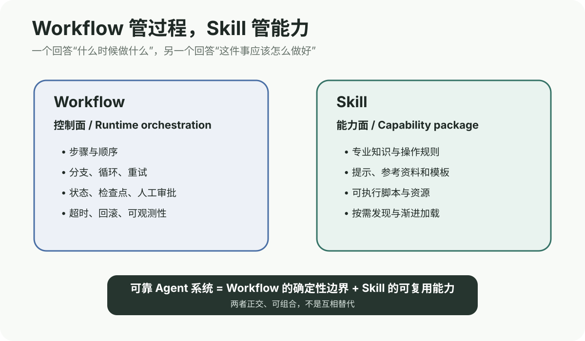
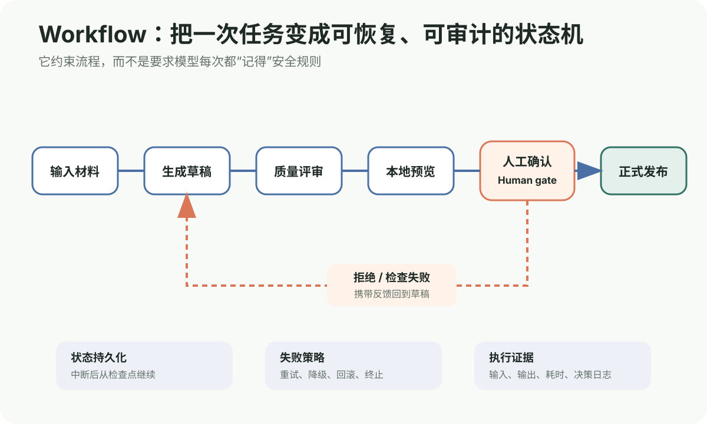
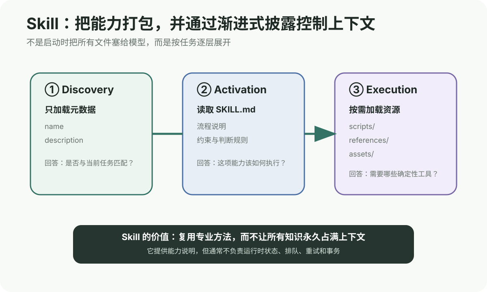
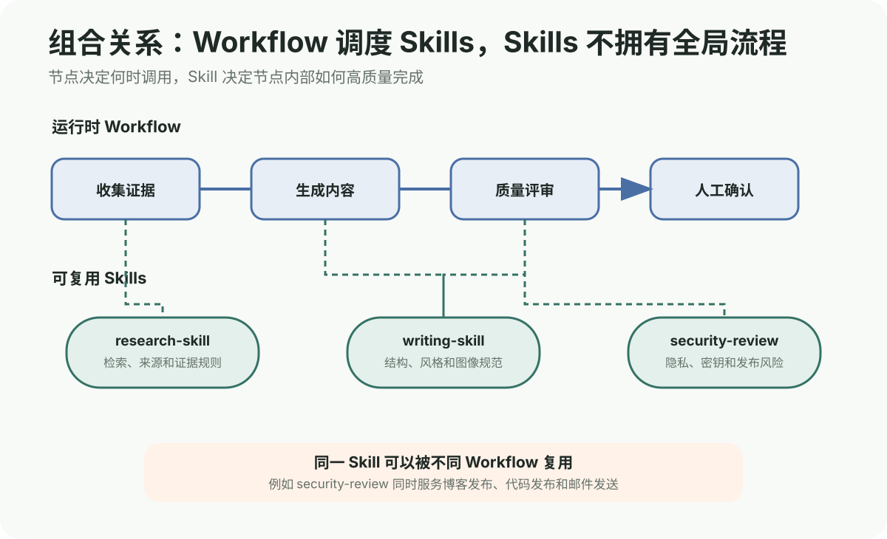
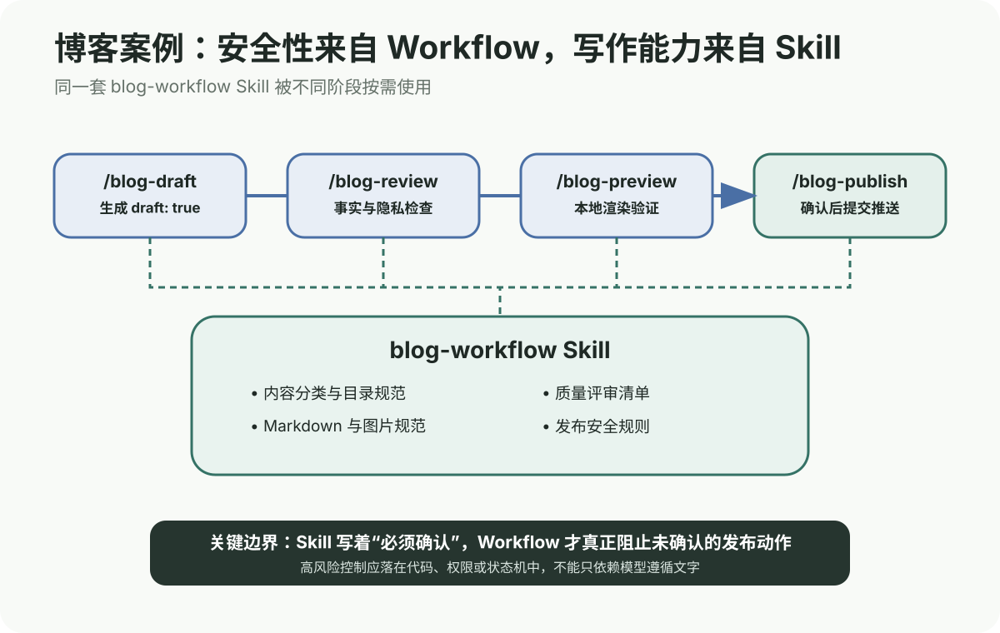
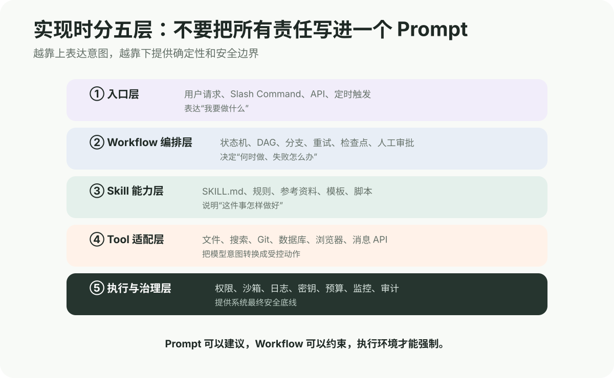
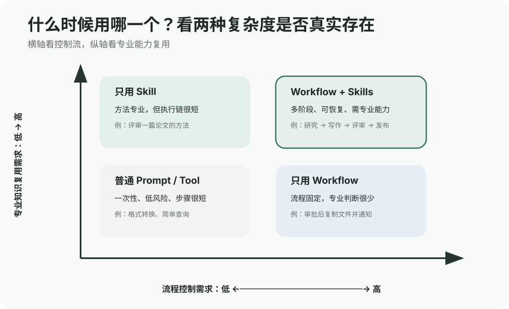

如果一个 Skill 已经写清楚“先生成草稿、再评审、最后发布”，为什么还需要 Workflow？把步骤写进 `SKILL.md`，不就是 Workflow 了吗？

这个问题非常关键，因为两者表面上都包含“做事步骤”，但承担的系统责任完全不同。

> [!IMPORTANT]
> **Workflow 管理任务在运行时如何流转，Skill 封装完成某类任务所需的知识与方法。**
>
> Workflow 回答“什么时候做什么、失败后去哪、谁能批准”；Skill 回答“这件事应该怎样做好、需要哪些资料和工具”。



_图 1：Workflow 属于控制面，Skill 属于能力面；两者正交而不是互相替代。_

## Table of contents

## 先区分三个容易混淆的概念

讨论之前，需要把 Prompt、Skill 和 Workflow 放在同一张表里：

| 概念                 | 核心作用                   | 典型内容                             | 是否天然管理状态 |
| -------------------- | -------------------------- | ------------------------------------ | ---------------- |
| **Prompt / Command** | 表达一次请求或提供快捷入口 | “评审这篇文章”                       | 否               |
| **Skill**            | 封装可复用的专业能力       | 规则、知识、模板、脚本、参考资料     | 通常不负责       |
| **Workflow**         | 编排一次任务的生命周期     | 顺序、分支、循环、重试、检查点、审批 | 是               |

例如博客系统中的：

```text
/blog-publish
```

只是一个入口。它可以触发 `blog-workflow` Skill，也可以启动一段发布 Workflow，但命令本身既不是完整能力，也不是完整流程。

## Workflow 是什么：运行时的控制结构

### 它解决的核心问题

单次模型调用只关心当前输入和输出。一旦任务变成多阶段，系统就会出现新的工程问题：

- 上一步成功后应该进入哪一步？
- 质量检查失败后是重试、回退还是终止？
- Agent 中断后如何继续，而不是从头执行？
- 哪些步骤可以并行，哪些存在依赖？
- 哪一步必须等待人工批准？
- 工具调用已经成功但响应丢失，能否安全重试？
- 谁记录每一步输入、输出、成本和错误？

<mark>Workflow 的存在，不是因为模型不会列步骤，而是因为生产系统不能把状态、安全和恢复全部寄托在模型“记得做”。</mark>

### Workflow 的最小模型

一个 Workflow 至少可以抽象为：

```text
Workflow = 状态 + 节点 + 转移条件 + 失败策略
```

例如内容发布：



_图 2：发布流程不是一段建议，而是一组可以暂停、回退和审计的状态。_

对应的伪代码可以写成：

```python
from enum import Enum

class Status(Enum):
    RECEIVED = "received"
    DRAFTED = "drafted"
    REVIEWED = "reviewed"
    PREVIEWED = "previewed"
    APPROVED = "approved"
    PUBLISHED = "published"
    FAILED = "failed"


def advance(job):
    if job.status == Status.RECEIVED:
        job.article = generate_draft(job.source)
        job.status = Status.DRAFTED

    elif job.status == Status.DRAFTED:
        job.review = review_article(job.article)
        job.status = (
            Status.REVIEWED
            if job.review.passed
            else Status.FAILED
        )

    elif job.status == Status.REVIEWED:
        job.preview_url = build_preview(job.article)
        job.status = Status.PREVIEWED

    elif job.status == Status.PREVIEWED:
        require_human_approval(job)

    elif job.status == Status.APPROVED:
        publish(job.article)
        job.status = Status.PUBLISHED

    persist(job)
```

真实系统还需要补充：

- 每个节点的输入与输出 Schema
- 最大重试次数与退避策略
- 超时和取消传播
- 幂等键与重复执行保护
- 状态持久化和检查点
- 权限与密钥边界
- 日志、Trace、指标和成本统计
- 人工介入和恢复入口

### 为什么 Workflow 比“任务清单”更强

下面两段文字看起来接近，但能力不同。

普通任务清单：

```text
1. 生成草稿
2. 检查草稿
3. 发布
```

运行时 Workflow：

```text
只有 review.passed == true 才能进入 preview
只有 human_approval 存在才允许 publish
发布失败最多重试两次
每次发布使用同一个 idempotency_key
任何失败都保存 checkpoint 和完整日志
```

第一段依赖执行者自觉遵守；第二段可以被程序检查和强制执行。

### Anthropic 为什么区分 Workflow 与 Agent

Anthropic 在 _Building Effective AI Agents_ 中使用了更严格的术语：

- **Workflows**：LLM 和工具通过预定义代码路径编排
- **Agents**：LLM 动态决定自己的过程与工具使用

在这个定义下，Prompt Chaining、Routing、Parallelization、Orchestrator-Workers 和 Evaluator-Optimizer 都可以成为 Workflow 模式。

> [!NOTE]
> 不同框架对 Workflow 的叫法并不完全一致。本文使用更一般的工程定义：只要系统显式管理任务节点、状态和转移，就可以讨论它的 Workflow；其中既可以包含固定节点，也可以包含由 Agent 动态决策的节点。

### Workflow 的优势

- **可预测**：关键路径和完成条件清楚
- **可恢复**：失败后从检查点继续
- **可审计**：知道哪一步使用了什么输入和工具
- **可治理**：可以设置预算、权限、审批和超时
- **可评估**：能够按节点统计成功率和延迟
- **可替换**：某个节点可以从模型 A 换成模型 B

### Workflow 的边界

Workflow 不是越详细越好。过度编排会产生：

- 为每个例外增加分支，状态图迅速膨胀
- 开放任务被僵硬步骤限制
- 修改流程必须同时迁移历史状态
- 节点过细，网络和序列化成本过高
- 开发者误以为画出 DAG 就解决了语义判断

> [!WARNING]
> 如果任务路径高度不可预测，Workflow 应该规定安全边界和检查点，而不是穷举模型的每一步思考。

## Skill 是什么：按需加载的能力包

### 它解决的核心问题

通用模型很强，但不知道你的特定工作方法：

- 公司如何评审合同
- 博客文章使用什么目录和元数据
- 某类实验必须记录哪些指标
- 操作内部 CLI 时有哪些安全约束
- 输出文件需要遵循什么模板

如果每次都重新解释，会造成提示重复、规则漂移和上下文浪费。Skill 将这些信息打包成一个可版本管理的能力模块。

根据 Agent Skills 开放规范，一个最小 Skill 是包含 `SKILL.md` 的目录，也可以附带脚本、参考资料和资源：

```text
blog-workflow/
├── SKILL.md
├── scripts/
│   └── validate-article.py
├── references/
│   └── editorial-policy.md
└── assets/
    └── article-template.md
```

`SKILL.md` 至少包含：

```yaml
---
name: blog-workflow
description: >
  Generate, review, preview, and publish blog articles.
  Use when working with Learn Everything blog content.
---
```

后面才是具体操作规则。

### Skill 如何被加载

Skill 的一个重要机制是 **Progressive Disclosure，渐进式披露**。



_图 3：系统先用少量元数据完成路由，只有匹配任务后才读取完整说明和资源。_

三个阶段分别是：

1. **Discovery**：启动时只加载 `name` 和 `description`
2. **Activation**：任务匹配后读取完整 `SKILL.md`
3. **Execution**：执行时按需读取 `scripts/`、`references/` 和 `assets/`

这解释了为什么一个 Agent 可以安装很多 Skills，而不需要把所有 Skill 的完整内容同时塞入上下文。

### Skill 中可以放什么

#### 规则和启发式方法

```text
先区分事实、用户经验和模型推断
没有证据时使用“待核实”，不得编造实验结果
```

#### 参考资料

例如 API 文档、Schema、编辑规范和业务政策。长资料放在 `references/`，只有需要时读取。

#### 确定性脚本

例如：

```text
校验 Frontmatter
检测 Markdown 断链
生成固定格式文件
检查图片是否存在
```

凡是重复、脆弱并且适合确定性执行的工作，都比每次让模型重新写代码更适合放进 `scripts/`。

#### 输出资源

例如文章模板、图标、字体、演示文稿模板或代码骨架，放进 `assets/`。

### Skill 的优势

- **可复用**：一次编写，多项目和多 Agent 使用
- **可移植**：遵循开放格式后可被多个客户端识别
- **节省上下文**：完整内容按需加载
- **可版本管理**：规则变化可以审查和回滚
- **能力一致**：减少不同会话之间的执行风格漂移
- **可组合**：Workflow 的不同节点可以调用不同 Skills

### Skill 的边界

Skill 本质上仍然是一组给 Agent 使用的能力说明和资源。单独依靠它，通常不能保证：

- 步骤一定按照顺序执行
- 中断后一定恢复到正确状态
- 重试不会造成重复副作用
- 未审批的动作绝对无法执行
- 多个并发任务不会发生写冲突
- 每次执行都有完整审计记录

Skill 可以写着“发布前必须确认”，但如果底层工具仍允许 Agent 直接推送生产环境，这是一条**软约束**，不是权限系统。

> [!CAUTION]
> 高风险动作不能只依靠 Skill 里的自然语言规则。应同时使用分支保护、最小权限、审批状态和确定性检查进行硬约束。

## 两者最深层的区别

### 区别一：一个是控制面，一个是能力面



_图 4：Workflow 的节点可以调用 Skill；同一个 Skill 也可以被多个 Workflow 复用。_

Workflow 关心：

```text
何时开始 → 当前状态 → 下一节点 → 失败策略 → 何时结束
```

Skill 关心：

```text
如何判断 → 遵循什么规则 → 读取什么资料 → 使用什么脚本
```

### 区别二：生命周期不同

Workflow 实例通常有生命周期：

```text
created → running → waiting_approval → completed / failed
```

Skill 本身没有“运行到第几步”的状态。它像一本按需加载的操作手册或能力插件，可以参与很多不同 Workflow 实例。

### 区别三：复用粒度不同

- Workflow 复用的是**过程结构**
- Skill 复用的是**任务能力**

“研究 → 写作 → 评审 → 发布”可以是过程模板；“如何核对论文来源”则是多个流程都能调用的能力。

### 区别四：约束强度不同

可以把约束分成三层：

```text
Skill / Prompt：告诉模型应该怎么做
Workflow：用状态和条件限制何时能做
权限与执行环境：从系统层决定是否允许做
```

因此：

> **Prompt 可以建议，Workflow 可以约束，执行环境才能强制。**

### 区别五：失败的形态不同

| 失败类型   | Workflow 问题           | Skill 问题                   |
| ---------- | ----------------------- | ---------------------------- |
| 步骤遗漏   | 转移或节点定义不完整    | 操作说明可能不完整           |
| 输出质量差 | 节点选择错误            | 专业规则、模板或资料不足     |
| 重复副作用 | 缺少幂等和检查点        | 通常不是 Skill 的职责        |
| 误触发     | 路由条件或事件错误      | `description` 太模糊         |
| 无法恢复   | 状态没有持久化          | Skill 不保存运行实例         |
| 越权操作   | Workflow 与权限设计失败 | Skill 只能提醒，不能强制阻止 |

## 为什么 Skill 里也经常写 Workflow

Agent Skills 官方定义指出，Skill 可以封装专业知识和可重复工作流。因此 `SKILL.md` 中当然可以写：

```text
1. 读取材料
2. 生成草稿
3. 检查事实
4. 等待确认
5. 发布
```

但这里需要区分：

- **作为知识描述的 Workflow**：告诉 Agent 推荐怎么执行
- **作为运行时系统的 Workflow**：真正记录状态并控制转移

前者轻量、灵活，适合个人工具和低风险任务；后者可靠、可审计，适合生产系统和有副作用的动作。

这就像菜谱和厨房流水线：

- Skill 像菜谱，说明材料、方法和判断标准
- Workflow 像出餐系统，决定订单状态、工序、返工和交付
- Tool 像厨具
- 权限与运行环境像消防和食品安全制度

菜谱可以包含做菜步骤，但不会自动管理十张订单的并发、超时和责任追踪。

## 博客案例：两者如何一起工作

当前博客使用四个入口：

```text
/blog-draft
/blog-review
/blog-preview
/blog-publish
```

它们形成一个从草稿到发布的工作过程，而 `blog-workflow` Skill 提供分类、写作、图片、评审与安全规则。



_图 5：入口表达意图，Workflow 管理阶段，Skill 为每个阶段提供方法。_

### 草稿阶段

Workflow 要求状态保持：

```yaml
draft: true
```

Skill 负责说明：

- 文章应该放在哪个目录
- 如何组织核心问题、机制和边界
- 图片应使用什么格式与相对路径
- 不确定信息如何标记

### 评审阶段

Workflow 决定检查失败后返回草稿，而不是继续发布。

Skill 提供检查标准：

- 事实是否有来源
- 是否混淆事实、经验与观点
- 是否存在隐私或密钥
- 图片、链接和代码是否有效

### 发布阶段

Workflow 负责：

- 等待明确的人类确认
- 执行构建检查
- 控制提交和推送
- 记录 commit 与部署结果

Skill 负责告诉 Agent 应该检查哪些内容以及如何形成发布报告。

### 当前实现到底有多“硬”

需要诚实说明：目前博客主要通过 Slash Commands、Skill 规则、Git 和 CI 形成一套**轻量软 Workflow**，还不是具有独立数据库和强制状态转移的 Workflow Engine。

如果未来提高安全等级，可以增加：

1. 草稿分支和 Pull Request
2. GitHub Branch Protection
3. 必须通过的 CI 检查
4. 必须由人点击批准的 GitHub Environment
5. 只能发布指定路径的确定性脚本
6. 发布记录和部署状态持久化

这会把“模型应该等待确认”升级成“没有确认记录，系统技术上无法发布”。

## 如何实现 Workflow 与 Skill 的组合系统

不要把全部责任写进一个超级 Prompt。推荐分成五层：



_图 6：上层表达意图，中层编排与提供能力，下层负责确定性执行和治理。_

### 第一层：入口

入口可以是：

- 用户自然语言
- Slash Command
- HTTP API
- 定时任务
- 文件变化或 Webhook

入口只负责创建任务，不应该包含全部业务逻辑。

### 第二层：Workflow 编排

可以用普通代码、状态机、DAG 或框架实现。关键不是选哪个框架，而是明确：

```python
class JobState(TypedDict):
    job_id: str
    status: str
    source_path: str
    article_path: str | None
    review_passed: bool
    approval_id: str | None
    attempts: dict[str, int]
```

每个节点应尽量满足：

- 输入和输出结构化
- 可以独立重试
- 副作用具备幂等性
- 失败原因可以观察
- 完成条件可以验证

### 第三层：Skill 能力包

Workflow 节点在需要专业判断时加载 Skill：

```python
skill = skill_registry.load("blog-workflow")
result = agent.run(
    task="评审文章",
    skill=skill,
    context={"article": article},
)
```

Skill 不应保存某一次任务的全局运行状态；它应该保持可复用。

### 第四层：Tool 适配

Tool 将模型意图转换成受控动作：

```text
read_file
write_file
run_tests
create_commit
push_branch
request_approval
```

工具应该有明确输入 Schema、错误类型和权限范围。

### 第五层：执行与治理

生产系统最终还需要：

- 沙箱
- 最小权限凭证
- Secret 管理
- 日志与 Trace
- Token 和费用预算
- 并发控制
- 审计和告警

这部分不能由 Skill 替代。

## 什么时候只用 Workflow，什么时候只用 Skill



_图 7：看流程控制需求和专业能力复用需求，不要看到多步骤就机械地同时引入两者。_

### 只使用普通 Prompt 或 Tool

适合：

- 一次性任务
- 步骤很短
- 风险低
- 不需要复用专业方法

例如将一段 JSON 格式化。

### 只使用 Skill

适合：

- 操作方法专业且会反复使用
- 执行链很短
- 没有长期状态
- 失败不会造成严重副作用

例如按照固定方法评审一篇论文，或生成符合团队风格的图表。

### 只使用 Workflow

适合：

- 流程和状态非常重要
- 每个步骤本身较确定
- 不需要模型掌握大量领域知识

例如审批通过后复制文件、写入记录并发送通知。

### 同时使用 Workflow 与 Skills

适合：

- 任务包含多个阶段和审批点
- 每个阶段又需要专业判断
- 过程需要恢复、审计和评估
- 动作会产生外部副作用

例如：

```text
研究 → 写作 → 事实检查 → 本地预览 → 人工审批 → 正式发布
```

## 一套可直接使用的判断清单

### 你可能需要 Workflow，如果

- [ ] 任务会持续较长时间
- [ ] 中途可能暂停和恢复
- [ ] 存在分支、循环、重试或并行
- [ ] 需要人工审批
- [ ] 工具调用有外部副作用
- [ ] 必须记录每一步状态和证据
- [ ] 不同失败类型需要不同处理策略

### 你可能需要 Skill，如果

- [ ] 同一类专业任务会重复出现
- [ ] 每次都需要重复解释规则
- [ ] 有固定模板、资料或脚本
- [ ] 希望多个 Agent 使用一致方法
- [ ] 希望能力可以独立版本管理
- [ ] 完整资料不适合永久放入上下文

### 你需要两者结合，如果

上面两组条件同时大量成立。

## 常见误区

### “Skill 里写了五个步骤，所以已经有 Workflow”

它有了流程说明，但不一定有运行时状态、转移控制、重试、幂等和审计。

### “Workflow 节点调用了 LLM，所以它就是 Agent”

不一定。按照 Anthropic 的定义，如果所有路径由代码预先规定，它仍然更接近 Workflow；Agent 强调模型动态决定过程和工具。

### “Skill 能阻止危险操作”

Skill 可以要求 Agent 不要做，但强安全需要权限、审批和执行环境共同保证。

### “Workflow 越详细越可靠”

过度编排会让开放任务变得僵硬。应该固定安全边界和验收点，把语义探索留给 Agent。

### “有了 Skill，就不需要 Prompt”

Skill 提供能力，Prompt 或命令仍然负责表达当前任务、输入和目标。

## 总结

Workflow 与 Skill 的区别，不在于是否都写了步骤，而在于它们承担的系统责任：

- **Workflow 是运行时控制结构**：管理状态、顺序、分支、重试、检查点、审批和恢复
- **Skill 是可复用能力包**：管理专业知识、操作规则、参考资料、模板、脚本和资源
- **Prompt / Command 是入口**：表达这一次具体要做什么
- **Tool 是动作接口**：把模型决定转换成真实操作
- **权限与执行环境是安全底线**：决定动作是否真的被允许

最重要的边界是：

> [!IMPORTANT]
> **Skill 可以告诉 Agent“发布前必须审批”，Workflow 可以检查“审批状态是否存在”，权限系统则可以保证“没有审批就绝对无法发布”。**

因此，低风险、短任务可以只用 Skill；固定流程可以只用 Workflow；涉及专业判断、多阶段状态和外部副作用的任务，应该组合二者。

## 参考资料

1. Agent Skills. [Agent Skills Overview](https://agentskills.io/home).
2. Agent Skills. [Agent Skills Specification](https://agentskills.io/specification).
3. Anthropic. [Building Effective AI Agents](https://www.anthropic.com/research/building-effective-agents), 2024.
4. LangChain. [Workflows and Agents](https://docs.langchain.com/oss/python/langgraph/workflows-agents).
5. Vercel Labs. [skills: The CLI for the open agent skills ecosystem](https://github.com/vercel-labs/skills).
