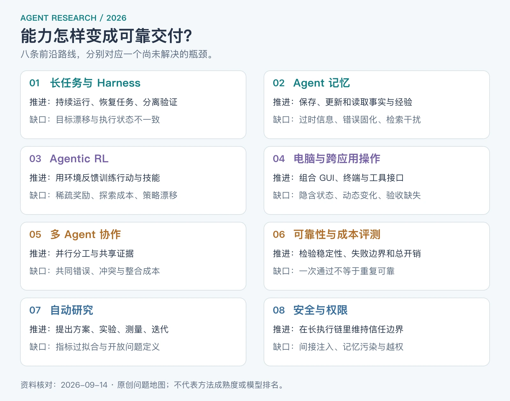
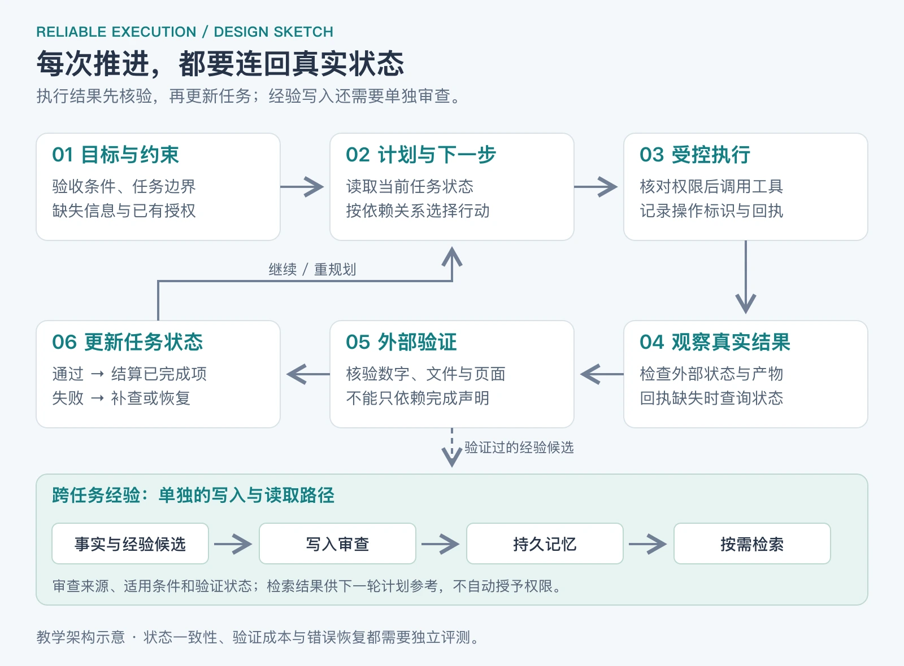

如果你已经知道 ReAct、工具调用和多 Agent，接下来值得问的是：**为什么 Agent 明明能解决越来越难的问题，交给它一项完整工作时，却仍然会漏要求、忘状态、重复操作，甚至在没有完成时宣布完成**？

这是本文组织 2026 年研究的主线：能力增长怎样转化为稳定交付，又卡在什么地方。

**资料核对截至 2026-09-14**。本文选取 2026 年首次公开的论文和机构技术文章，最新条目发表于 9 月 1 日；辅助引用的 METR 时间跨度指标起源于 2025 年，单独注明。范围是基于大模型的软件 Agent，包括编码、浏览器、电脑操作和研究助手，不展开机器人控制。这里是一份问题导向的阅读地图，不是覆盖全部论文的系统综述，也不是实时模型排行榜。

文中会区分三种证据：已标明接收的学术论文、尚需进一步验证的预印本，以及研究机构自己的工程实验。后两类很有参考价值，但不能自动代表独立复现后的行业共识。文中的实验方案为本文建议，并非已运行的结果。

## Table of contents

## 1 先看地图：2026 年究竟在向哪里推进

我对这些资料的综合判断是：**前沿正在同时推进“更强的决策能力”和“更可靠的执行系统”**。模型训练、记忆、工具环境、验证与组织方式都在参与决定最终效果，单独升级其中一项未必解决整个任务。

_图 1：原创研究地图。按所解决的问题分组，不表示方法出现的先后或成熟度排名。具体证据与限制见下文对应章节。_

| 前沿方向         | 正在推进什么                             | 目前的核心缺口                           |
| ---------------- | ---------------------------------------- | ---------------------------------------- |
| 长任务与 Harness | 跨上下文、跨进程持续工作；执行与验证分离 | 目标漂移、状态丢失、重复副作用、错误终止 |
| Agent 记忆       | 从保存聊天扩展到更新知识、保留执行经验   | 过时事实、错误记忆、检索干扰、成本转移   |
| Agentic RL       | 通过环境反馈训练行动策略、内化技能       | 稀疏奖励、探索不足、策略漂移、跨环境迁移 |
| 电脑与跨应用操作 | GUI、终端、代码和工具接口共同完成工作    | 隐含状态、动态变化、约束跟踪、最终验收   |
| 多 Agent 协作    | 管理并行任务、共享资源与分散证据         | 同质错误、冲突、重复劳动、协调成本       |
| 可靠性与成本评测 | 从一次成功转向重复稳定、失败可控         | 基准与部署脱节、评分偏差、预算不可比     |
| 自动研究         | 在固定目标下循环提出方案、实验、测量     | 指标投机、测试集过拟合、开放问题定义     |
| 安全与权限       | 在长执行链中维持信任边界                 | 间接注入、记忆污染、越权与监控盲区       |

这里的 Harness 指模型外部的运行系统：它接收目标、安排工具执行、管理状态、处理失败，并决定何时继续或结束。若还不熟悉执行策略，可以先读本站的[ReAct、Plan-and-Execute 与 Multi-Agent](https://bailixisu.com/posts/knowledge/agents/architecture/react-plan-execute-multi-agent/)。

## 2 长任务：真正难的是持续保持正确的工作状态

### 2026 年的进展

Anthropic 在 3 月的工程实验中，将规划、生成和评估分别安排给不同角色，用可检查的产物推动多小时应用开发；随着模型升级，又通过逐项移除组件，检查哪些辅助结构仍然必要。值得学习的是这种“观察缺陷—增加结构—再做消融”的方法。案例之间的运行时长和费用不同，因此它并没有证明复杂 Harness 在相同预算下总能取胜。[Harness design，2026-03-24](https://www.anthropic.com/engineering/harness-design-long-running-apps)

4 月的 Managed Agents 技术文章进一步区分持久会话日志、调度模型与工具的 Harness，以及实际执行代码的沙箱。它说明一个重要的系统设计选择：历史数据如何可靠保存，可以与模型此刻需要怎样组织上下文分开演进。这是厂商架构经验，不是所有 Agent 必须照搬的标准。[Managed Agents，2026-04-08](https://www.anthropic.com/engineering/managed-agents)

### 现在还缺什么

考虑一个教学场景：Agent 要分析一份销售数据、修改报表、检查图表，再发布报告。它在发布请求成功后、记录结果之前崩溃。重新启动时，聊天记录里只有“准备发布”，却没有成功回执。

这时“再试一次”可能制造重复发布；直接跳过又可能漏交付。解决问题需要识别**外部真实状态**，例如通过操作编号查询结果，而不是让模型猜测自己上次做到哪里。

同样，状态摘要如果只保留“报表基本完成”，却丢掉“还没检查币种”，恢复后就会沿着一个错误前提继续。长任务至少要保留目标约束、已验证结果、尚未验证的假设，以及下一步的依赖。以上是从执行语义出发的分析，也与本站[Pi AgentHarness 的崩溃恢复讨论](https://bailixisu.com/posts/knowledge/agents/pi-agent/12-agent-harness/)相衔接。

**适合研究的问题**：怎样让 Agent 根据真实任务状态选择继续、回滚、补查或停止？更强的模型能减少多少辅助结构？哪些结构保障的是操作语义，因此即使模型变强也不能省略？

## 3 记忆：关键不只是记得多，而是记得对、用得上

### 先区分三件不同的事

| 层次         | 保存什么                           | 发生改变的是谁     |
| ------------ | ---------------------------------- | ------------------ |
| 工作上下文   | 当前任务的材料、最近观察、压缩摘要 | 本次模型输入       |
| 外部持久记忆 | 可跨任务读取的事实、偏好、操作经验 | 外部存储及检索策略 |
| 参数学习     | 经训练内化的行为倾向或技能         | 模型权重           |

因此，保存一个经验文件，不代表模型权重已经更新；把所有历史放进长上下文，也不代表系统会主动维护事实的新旧关系。

### 2026 年的证据

EvoMemBench 把记忆按“单次任务内／跨任务”和“知识／执行经验”两个轴组织，比较了 15 种记忆方法与长上下文基线。其结果没有支持一个通吃方案：长上下文仍有竞争力；外部记忆的帮助取决于信息是否超出当前上下文、任务难度，以及经验是否匹配执行结构。不能看到某方法在对话回忆上有效，就推断它会同样改善编码 Agent。[EvoMemBench，2026-05-18，v2](https://arxiv.org/abs/2605.18421v2)

### 为什么记忆仍然很难

下面是本文构造的例子：旧记录写着“测试环境用 A 数据库”，新的迁移记录改为 B。一个只按语义相似度召回的系统，可能把两者一起交给模型；一个只保留最新文字的系统，又可能误把“计划迁移到 B”当成“迁移已经完成”。

难点包括写入时区分事实和猜测、更新时识别条件变化、读取时避免过期信息，以及删除时处理多个派生副本。把内容总结得更短，不一定保留了行动所需的证据。

**适合研究的问题**：记忆条目能否同时记录来源、适用条件和验证状态？任务迁移后，哪些经验该继续使用，哪些该降权？一份错误总结会不会在多次调用中逐渐变成系统“确信”的事实？

比较记忆方案时，我建议至少保留无记忆、全历史上下文、检索记忆三个基线，并把写入和整理成本一起计入。否则很容易把“额外花了更多推理预算”误判为“记忆机制本身更好”。

## 4 Agentic RL：把与环境交互的能力训练进模型

Agentic RL 可以理解为：模型采取行动，环境返回结果，训练再依据反馈调整行动策略。它与在推理时增加一段提示词是不同的干预位置。

### 两条值得追踪的 2026 路线

**SIRI：先发现和验证技能，再内化**。它从成功执行轨迹中提炼候选技能，通过有技能／无技能的成对运行筛选，再把有帮助的行动信号蒸馏回策略。论文在 Qwen2.5-7B-Instruct、ALFWorld 和 WebShop 上报告改进；推理时无需持续检索技能库。这里讨论的是一套训练流程，不能理解成线上 Agent 写下一条心得，就自动学会了新能力。[SIRI，2026-06-01，预印本](https://arxiv.org/abs/2606.02355)

**CANOPY：检验只靠最终结果的奖励能走多远**。9 月的这篇预印本把困难聚焦在探索信号不足和策略漂移：同一任务的一组尝试如果全部失败，就难以从组内比较获得有用的奖励差异。其方案增加探索覆盖，并以 on-policy、KL 约束及行动 Token 的更新控制训练。作者报告了 AppWorld 和编码任务上的效果，但这不等于所有长任务都不再需要过程反馈；论文中的榜单时间也不能直接当作今天的排名。[Explore More, Drift Less，2026-09-01](https://arxiv.org/abs/2609.01245)

### 未解问题：奖励是否代表真正完成

想象一个修复程序的 Agent，只因“本地测试全绿”获得奖励。如果测试覆盖不足，它可能学到只满足已知测试的修改方式。增加探索能帮助找到成功轨迹，却不能自动修好一个偏离真实目标的奖励函数。

这个例子引出三个不同问题：

- **信用分配**：一百步之后失败，应该调整哪一步？
- **泛化**：训练时熟悉的 API、应用或任务模板变了，策略还能工作吗？
- **训练成本**：环境启动、工具调用、并行采样与失败重试，是否比参数更新本身更昂贵？

研究 Agentic RL 时，应把训练环境、可用工具、奖励定义和测试隔离方式一起读。单独比较模型参数量，很难解释结果。

## 5 电脑操作：已经从点击按钮走向完整跨应用工作

### 一个很有代表性的 2026 结果

OSWorld 2.0 包含 108 个较长的电脑工作流。在论文 v2 的 500 步预算、Claude Opus 4.8 最大思考强度和批量工具调用设置下，完整完成率为 **20.6%**，部分完成得分为 **54.8%**。两者衡量不同东西，不能把后一项当作交付成功率。这些也是特定测试设置的数字，不代表全部现实电脑任务，更不是 9 月所有新模型的实时水平。[OSWorld 2.0，2026-06-28，v2](https://arxiv.org/abs/2606.29537v2)

WeaveBench 则把 GUI、终端与代码操作放在同一条轨迹中，设计了 114 项任务，并同时检查产物和执行过程。它发现只检查最终结果可能高估表现，提醒我们核对“结果是怎样得到的”，例如图表中的数字是否来自实际计算。[WeaveBench，2026-06-08，v3](https://arxiv.org/abs/2606.09426v3)

### 为什么看得到页面，仍然可能做错

在本文的报表示例里，下载数据、计算指标、编辑图表、检查页面分别都能成功，但组合起来仍可能失败：下载的是旧版本，表格中的时区不同，图表引用了另一个工作表，发布页面尚未刷新。

因此，电脑 Agent 的难点还包括跨应用对象对应、隐含状态推断、执行过程中新增要求的处理，以及选择 GUI、API 或代码操作后的结果核验。截图是一次观察，不能永久代表环境状态。

**适合研究的问题**：怎样在界面变化或任务中途更新时刷新计划？什么时候应重新读取环境，什么时候可以复用观察？如何验证产物的语义，而不仅是文件存在或按钮被点击？

## 6 多 Agent：前沿已经涉及组织规则和相关错误

### 2026 年的新观察

Anthropic 8 月的多 Agent 实验观察到共享代码协作不畅、行为同质化，以及分散证据难以被团队正确利用等现象。其中一个早期游戏开发实验里，30 个同时启动的 Agent 中有 18 个选择了同一个分支名。这是一个受控案例，不能外推成普遍发生率，但很直观地说明：多个实例不一定意味着独立探索。[Patterns and problems in emerging multiagent systems，2026-08-13](https://www.anthropic.com/research/multiagent-systems)

### 为什么“多几个审稿人”不一定可靠

设想三个 Agent 读取了同一份有误的产品说明，它们可能一致通过错误实现。增加投票数量没有引入新证据，只是重复同一个前提。

另一方面，多个执行者修改同一处文件时，如果缺少任务归属和交接规则，也会出现重复劳动、覆盖修改或一直等待别人完成。这里要解决的是协作协议，而不只是让模型“更愿意合作”。

我的设计建议是把分工写成可检查的输入、产物和责任范围；共享修改由明确的整合步骤处理；审核者尽量获得可独立核验的证据。多 Agent 的收益，应在相同总预算下与强单 Agent 比较，并计入整合、返工和等待时间。

**适合研究的问题**：怎样测量错误之间的相关性？怎样保留少数 Agent 提供的关键证据？怎样让任务路由和组织结构随依赖关系变化，而不是预先堆出一组固定角色？

## 7 评测：从“成功过”走向“重复可靠且成本可接受”

### 可靠性不应压成一个总分

《Towards a Science of AI Agent Reliability》在 v3 中评估 15 个模型，提出一致性、鲁棒性、可预测性和安全性四个维度、12 项指标。作者观察到，能力增长只带来有限的可靠性改善。这项已注明 ICML 2026 接收的研究，支持把失败方式和重复表现单独观察，而不是只看平均任务成功率。[Agent Reliability，2026-02-18，v3](https://arxiv.org/abs/2602.16666v3)

Anthropic 的评测文章也区分了完整执行轨迹和环境最终状态：Agent 宣称操作完成，不代表外部系统中真的产生了正确结果。它还说明两种重复试验指标：`pass@k` 关注 k 次中至少成功一次，`pass^k` 关注 k 次全部成功。[Demystifying evals，2026-01-09](https://www.anthropic.com/engineering/demystifying-evals-for-ai-agents)

用一个**独立同分布的教学假设**说明：单次成功概率 p=0.8，重复五次，则

$$
P(\text{至少一次成功})=1-(1-p)^5=99.968\%
$$

$$
P(\text{五次全部成功})=p^5=32.768\%
$$

同一个系统可以同时拥有很好看的“多试几次总能成功”和并不理想的重复稳定性。这两个数字是公式计算，不是某个真实 Agent 的测量；现实中的任务难度与尝试之间也可能相关，不能直接用平均 p 替代逐任务评估。

### 三种“时间”不要混在一起

| 时间口径           | 实际回答的问题                               |
| ------------------ | -------------------------------------------- |
| Agent 墙钟运行时间 | 这次调用运行了多久？                         |
| 人工监督时间       | 人要花多久提供信息、纠偏和验收？             |
| 人类等效任务跨度   | Agent 能完成多难的任务，以专家所需时长校准？ |

METR 的 50% 时间跨度指：在其任务分布和拟合方法下，Agent 约有一半概率成功完成的那种任务，专家需要多久完成。它不是 Agent 能不间断运行的时长，也不是对所有工作的统一承诺。这个指标起源于 2025 年；本文参考的是 2026 年更新的说明。[METR 时间跨度定义](https://metr.org/time-horizons/)

7 月 METR 又讨论了 expenditure horizon：在质量—成本曲线上比较人和 Agent，考虑推理、实验计算及人工投入，而不只问是否通过某条固定分数线。它对 NanoGPT 优化的分析仍是特定场景，不能代替其他任务的实际核算。[METR Expenditure Horizon，2026-07-21](https://metr.org/blog/2026-07-21-expenditure-horizon/)

**适合研究的问题**：怎样校准自动评分器？怎样保留基础设施失败和人工介入的完整账目？怎样用未见任务和扰动任务，识别“只适应了这套测试”的改进？

## 8 自动研究：实验闭环在进步，开放式问题定义仍很难

### 2026 年 9 月的新评测在测什么

Autoresearch Bench 让 Agent 在固定目标和预算下，反复修改方案、执行实验并使用反馈。其主结果使用 4 小时运行，部分任务用 Agent 看不到的私有得分评估泛化。需要注意，评分可取过程中最好的私有分数，部分基础设施失败不计入均值；它衡量受控实验中的优化表现，不能直接解读为现实科研端到端成功率。[Autoresearch Bench，2026-09-01](https://www.autoresearch-bench.com/)

SciAgentArena 在约 200 个科学任务中得到另一组互补观察：Agent 对结构清楚、验收明确的数据分析更有帮助，但在新洞见、自主探索和开放问题上表现不均。这不意味着 Agent 不能参与科研，而是说“给定指标下改进方案”与“决定值得研究什么”仍需分开评估。[SciAgentArena，2026-06-10](https://arxiv.org/abs/2606.12736)

### 真正值得问的下一步

以下是我的分析：自动实验系统需要同时判断测量是否可信、改动是否产生真实收益，以及下一次实验是否值得其成本。如果训练集和验证集泄漏、指标选错，或只挑最好的一次随机结果，执行得越勤快，可能越快得到一个不稳健的结论。

**适合研究的问题**：Agent 能否主动提出能区分多个假设的实验？何时应该复测而不是继续调参？能否在看不到测试集的条件下选择可泛化的最终方案？最终报告能否连回原始配置、日志和失败结果？

对学习者而言，可以从固定预算的性能优化或数据分析任务入手，保留一个真正不参与迭代的测试集，比直接追求“自动写一篇论文”更容易判断是否取得了进展。

## 9 安全：长任务把输入污染变成持续的行为风险

AgentLAB 将安全评估扩展到多轮、长执行链，覆盖 28 个环境、644 个测试案例及多种攻击类型，包括目标偏移和记忆污染。作者发现，面向单轮交互的防御不足以可靠覆盖这些长程威胁。该结论来自其测试环境，不能据此断言任何具体部署必然失守。[AgentLAB，2026-02-18](https://arxiv.org/abs/2602.16901)

关键机制可以用一个防御性例子解释：Agent 为完成正常任务读取网页；网页中出现与任务无关的指令；如果系统把这些文字当成可授权的要求，后续行动就偏离了用户目标。若错误要求又被写进记忆，影响还可能延续到下一次任务。

因此，本文建议把“观察到的内容”“已经验证的事实”和“用户授权的动作”分别记录。工具返回内容不应自行扩大权限；长期记忆也不应成为绕过信任检查的入口。对于会改变外部状态的操作，应保留可核验回执，并对结果未知的情况查询状态，而非无条件重试。

这里并不是主张每一步都让人确认。值得研究的是：**如何在减少无效打断的同时，识别真正需要额外授权或人工判断的边界**？还需要测量监控器漏报、错误拦截与攻击防御对正常任务成功率的影响，而不是只报一个拦截率。

## 10 把八条路线放进同一个任务闭环

下面是一张本文提出的设计草图，帮助把前面的论文问题映射到系统位置；它不是某家产品的实现图，也不是已验证的最优架构。

_图 2：原创教学架构。结果验收与执行分开；本次状态更新与跨任务经验写入也分开。来源、有效条件和验证状态用于降低错误长期传播的机会，不构成零风险保证。_

用一个“更新并发布报表”的任务具体展开：

| 环节     | 应当留下什么可检查的东西           | 对应的研究问题           |
| -------- | ---------------------------------- | ------------------------ |
| 目标进入 | 数据范围、单位、截止日期、交付位置 | 约束是否被持续保留？     |
| 计划推进 | 依赖关系、下一步、尚缺信息         | 变化发生后是否重规划？   |
| 工具执行 | 输入、返回值、操作标识和实际产物   | 中断恢复是否重复副作用？ |
| 验证交付 | 数字核算、图表检查、线上真实状态   | 自评与外部证据是否一致？ |
| 保存经验 | 来源、适用条件、验证依据           | 错误是否被固化到记忆？   |
| 复盘成本 | 失败重试、人工介入、工具与推理开销 | 收益是否覆盖全部成本？   |

好的研究切口往往就在环节之间。例如，生成模块正确、验证模块也正确，但两者检查的不是同一个文件版本，整个任务仍然失败。接口和状态的一致性本身就值得测试。

## 11 如果要继续学习或选题，我建议怎么排优先级

下面是基于本文问题地图的个人建议，不是论文给出的统一排名。

### 想做可落地的 Agent 项目

先做**任务状态、外部验证与失败恢复**。你可以直接观察问题、构造可重复场景，也容易判断改动是否有效。在此基础上，再加入记忆或多 Agent，检查它们是否确实降低漏项、返工或时间成本。

### 想做研究型课题

优先考虑能提出明确反例和测量协议的方向：

| 切口          | 一个具体研究问题                                         | 最小对照实验                                         |
| ------------- | -------------------------------------------------------- | ---------------------------------------------------- |
| 记忆更新      | 带来源与适用条件的记忆，能否减少过期事实导致的行动错误？ | 相同任务下比较长上下文、普通检索、带版本信息的记忆   |
| 失败恢复      | 环境超时后先查询真实状态，能否减少重复操作？             | 在操作前、操作后、回执前分别注入中断                 |
| 验证器        | 独立证据校验能否减少“未完成却报告完成”？                 | 模型自评、规则检查、独立评估三组对照                 |
| 多 Agent 组织 | 独立证据和明确任务归属，是否比增加人数更有帮助？         | 固定总预算，比较单 Agent、直接并行、带交接规则的并行 |
| Agentic RL    | 稀疏结果奖励下，探索预算与约束强度怎样影响迁移？         | 固定模型与训练任务，将变化的 API 或任务结构留到测试  |
| 自动实验      | Agent 何时会对可见指标过拟合？                           | 公开反馈集与隔离测试集，固定实验预算并报告所有尝试   |

### 一套可以起步的评测办法

选取一小批可重置的任务，事先写明正确状态、禁止的副作用和可接受预算。对每种方案重复运行，并加入工具超时、过时记忆、任务中途修订等扰动。小样本适合发现机制性错误，不适合据此宣布普遍的性能领先。

至少记录完整成功率、重复稳定性、错误完成声明、人工介入、违规副作用，以及包含失败的总成本。保留每次失败属于推理、状态、工具、环境还是评分器问题的分类；不要为了一个更漂亮的分数把它们悄悄删除。

如果目前只想精读三份材料，我建议从 **Agent Reliability → EvoMemBench → OSWorld 2.0** 开始：先理解“什么叫可靠”，再理解“历史怎样影响行动”，最后看这些问题如何在完整任务里叠加。做训练再读 SIRI/CANOPY，做多 Agent 再读 8 月的协作实验。

## 12 一手资料与阅读定位

日期为首次公开或机构文章发布日期；版本栏注明本文引用的修订版。没有标注会议接收信息的 arXiv 条目在本文按预印本处理，不将其视为已经独立复现。

| 首次日期   | 资料                                                                                                                              | 本文版本 / 类型                    | 建议重点                       |
| ---------- | --------------------------------------------------------------------------------------------------------------------------------- | ---------------------------------- | ------------------------------ |
| 2026-01-09 | [Demystifying evals for AI agents](https://www.anthropic.com/engineering/demystifying-evals-for-ai-agents)                        | Anthropic 工程文章                 | 轨迹、最终状态与重复试验       |
| 2026-02-18 | [Towards a Science of AI Agent Reliability](https://arxiv.org/abs/2602.16666v3)                                                   | v3：06-02；页面注明 ICML 2026 接收 | 可靠性的四个维度               |
| 2026-02-18 | [AgentLAB](https://arxiv.org/abs/2602.16901)                                                                                      | v1，预印本                         | 长执行链的安全评测             |
| 2026-03-24 | [Harness design for long-running application development](https://www.anthropic.com/engineering/harness-design-long-running-apps) | Anthropic 工程实验                 | 生成—评估分工与组件消融        |
| 2026-04-08 | [Scaling Managed Agents](https://www.anthropic.com/engineering/managed-agents)                                                    | Anthropic 架构文章                 | 会话、Harness、执行环境的边界  |
| 2026-05-18 | [EvoMemBench](https://arxiv.org/abs/2605.18421v2)                                                                                 | v2：06-15，预印本                  | 不同记忆形态与长上下文基线     |
| 2026-06-01 | [SIRI](https://arxiv.org/abs/2606.02355)                                                                                          | v1，预印本                         | 技能发现、验证和内化           |
| 2026-06-08 | [WeaveBench](https://arxiv.org/abs/2606.09426v3)                                                                                  | v3：07-06，预印本                  | 跨界面任务与轨迹验收           |
| 2026-06-10 | [SciAgentArena](https://arxiv.org/abs/2606.12736)                                                                                 | v1，预印本                         | 结构化科研任务与开放问题的差别 |
| 2026-06-28 | [OSWorld 2.0](https://arxiv.org/abs/2606.29537v2)                                                                                 | v2：07-13，预印本                  | 完整完成与部分得分的区别       |
| 2026-07-21 | [Expenditure Horizon](https://metr.org/blog/2026-07-21-expenditure-horizon/)                                                      | METR 方法与案例分析                | 质量与总成本的联合比较         |
| 2026-08-13 | [Patterns and problems in emerging multiagent systems](https://www.anthropic.com/research/multiagent-systems)                     | Anthropic 研究文章                 | 同质错误、共享资源与证据协作   |
| 2026-09-01 | [Explore More, Drift Less / CANOPY](https://arxiv.org/abs/2609.01245)                                                             | v1，预印本                         | 探索覆盖与策略漂移             |
| 2026-09-01 | [Autoresearch Bench](https://www.autoresearch-bench.com/)                                                                         | Emulated 基准报告                  | 固定预算实验闭环与隐藏评分     |

补充指标定义：[METR Task-Completion Time Horizons](https://metr.org/time-horizons/)，页面标明更新于 2026-05-08，方法始于 2025 年。本文没有复现上述论文实验；两个机制图、报表案例、概率算例和选题建议均为解释用途。
