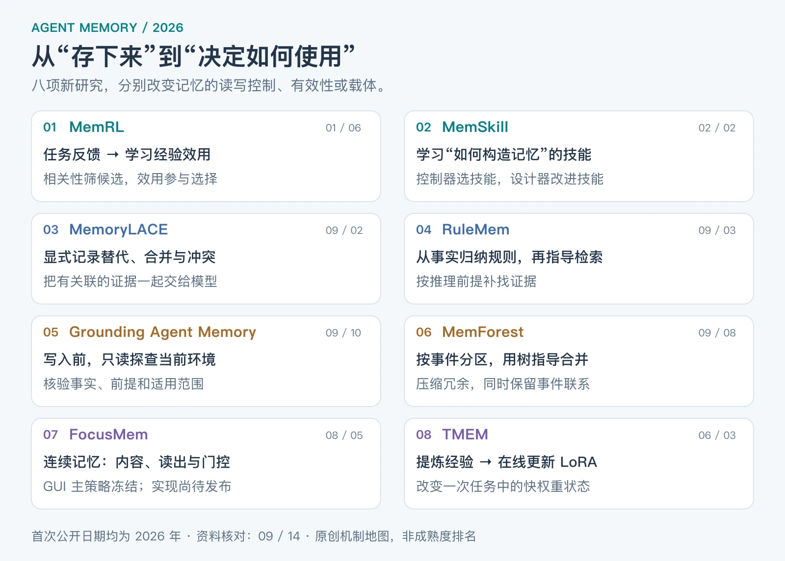
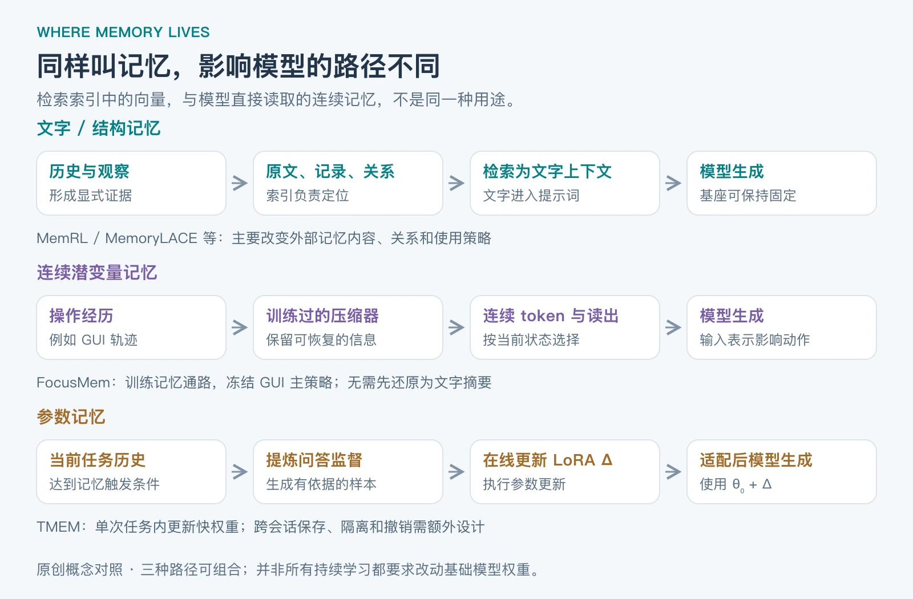

如果你已经了解“短期记忆保留上下文、长期记忆检索历史对话、用户画像通过持续总结形成”，接下来值得研究的是：**记忆能否自己判断该记什么、什么已经失效、哪些经验真正有用，以及什么时候应该重新核验**？更进一步，经验是否必须以文字形式重新进入提示词，还是可以成为模型直接读取的连续表示，甚至写入参数？

这篇文章就从这些问题出发。**资料核对截至 2026-09-14**，选取八项 2026 年首次公开的研究，最新一项首发于 9 月 10 日。主要参考论文原文和作者仓库；文中的架构建议、场景与小程序是原创教学内容，不是论文实验复现。未单独核实会议接收情况的论文统一按预印本介绍。

## Table of contents

## 1 先纠正分类：短期、长期、画像不在同一条轴上

“短期 / 长期”说的是保存跨度；“用户画像”说的是内容；“检索 / 总结”说的是读写方法。它们可以组合，而不是三种互斥的技术。

为了理解新研究，可以把记忆系统拆成四个问题：

| 维度   | 要问什么                 | 可能的选择                                             |
| ------ | ------------------------ | ------------------------------------------------------ |
| 内容   | 记住什么？               | 用户事实、项目状态、过去事件、成功与失败经验、操作规则 |
| 载体   | 存在哪里，以什么形式存？ | 原文、结构化记录、图、连续记忆 token、LoRA 参数        |
| 控制   | 谁决定读写和淘汰？       | 固定规则、LLM、可训练控制器、结果反馈                  |
| 有效性 | 为什么现在还能相信它？   | 来源、作用范围、有效时间、冲突关系、环境核验           |

例如，“用户喜欢简短回答”和“项目 A 自 9 月起使用 pnpm”都可以放在长期记忆里，但后者需要项目范围、时间和可检查的配置依据。简单把两者一起不断压缩，可能丢掉这些区别。



_图 1：原创阅读地图。分组依据是新增机制，不表示某种方法全面取代另一种。对应论文与首次日期见下表。_

| 2026 首次日期 | 研究                                                         | 相比普通对话检索，新增了什么？                   |
| ------------- | ------------------------------------------------------------ | ------------------------------------------------ |
| 01-06         | [MemRL](https://arxiv.org/abs/2601.03192v2)                  | 从任务反馈学习每条经验的效用，影响后续选择       |
| 02-02         | [MemSkill](https://arxiv.org/abs/2602.02474v2)               | 学习选择与改进“如何写记忆”的技能                 |
| 06-03         | [TMEM](https://arxiv.org/abs/2606.04536v1)                   | 在一次任务内把提炼的经验写入快 LoRA 权重         |
| 08-05         | [FocusMem](https://arxiv.org/abs/2608.04530v1)               | 将经历压缩为连续记忆，并分离内容、读出与可信门控 |
| 09-02         | [MemoryLACE](https://arxiv.org/abs/2609.03201v1)             | 显式保存合并、替代、冲突关系，检索关联证据组     |
| 09-03         | [RuleMem](https://arxiv.org/abs/2609.03915v1)                | 从事实归纳规则，让规则反过来指导找证据           |
| 09-08         | [MemForest](https://arxiv.org/abs/2609.08273v1)              | 按事件组织记忆，使用树结构指导渐进合并           |
| 09-10         | [Grounding Agent Memory](https://arxiv.org/abs/2609.11060v1) | 写入前主动只读探查环境，检查和限定记忆           |

这些工作中的检索、规则、图和 LoRA 都有更早的研究基础。这里介绍的是它们在这些 2026 方法中的具体组合与贡献，不声称概念本身今年才出现。

## 2 MemRL：相关的记忆，不一定是有帮助的记忆

### 新机制：让任务反馈改变检索决策

MemRL 把经验组织成“意图—经验—效用”三元组。检索分两阶段：先用语义相关性筛出候选，再结合归一化的相似度与效用 Q 值选择实际注入的记忆。任务结束后，用环境反馈更新被使用记忆的效用；基础 LLM 权重保持不变。[MemRL，§4，本文参考 2026-02-12 的 v2](https://arxiv.org/html/2601.03192v2)

论文采用的 Monte Carlo 风格更新可以写成：

$$
Q_i \leftarrow Q_i + \alpha(r-Q_i)
$$

其中，r 是这次任务提供的反馈，α 控制新反馈的影响。第二阶段的分数同时考虑相似度与 Q，而不是直接在整个记忆库里取最高 Q。这里的 Q 是使用经验的效用估计，**不是这段话为真的概率**。

### 一个教学例子

编码助手处理一个缺少依赖的项目，检索到两条经验：

- A：上次类似报错，重启进程后继续。
- B：先检查 lockfile，再使用项目对应的包管理器安装依赖。

A 的错误文本可能更相似，但执行后没有解决问题。系统把这次结果记到 A 的效用上；下一次同类任务，B 就可能获得更高选择优先级。改变的是跨任务经验的使用策略，而不只是用户画像的文本。

**实现时最难的是反馈归因**：如果同时注入十条记忆后成功了，不能据此证明十条都有效。偶然成功、工具故障和任务难度也会影响 Q。可落地的起点是在相近任务组内统计，并保留使用记录；不要把某个项目里的高分经验无条件推广到所有项目。

## 3 MemSkill：连“怎么整理记忆”也可以学习

### 新机制：训练记忆操作的选择器

普通方案经常固定使用一条提示：“总结这轮对话并更新用户画像。”MemSkill 将提取、整合、裁剪等操作写成可复用技能，由 **controller** 选择技能，**executor** 执行记忆更新，**designer** 根据困难案例修改或增加技能。控制器使用 PPO 训练，学习信号来自下游任务；技能库也在训练循环中演化。[MemSkill，§3，本文参考 2026-05-24 的 v2](https://arxiv.org/html/2602.02474v2)

这是两个不同层次的学习：一是学会在什么场景使用哪些技能，二是改进技能内容。这里的“技能”主要控制**如何构造记忆**，不等同于让任务 Agent 学会一个新的外部工具，也不等同于放几份静态 `SKILL.md` 后就自动获得同样能力。

### 如何迁移到你熟悉的系统

可以先人工定义三个教学技能：

| 遇到的信息                     | 记忆技能     | 应保留的结果                       |
| ------------------------------ | ------------ | ---------------------------------- |
| “刚才说错了，这个项目用 pnpm”  | 处理显式纠正 | 新结论、旧结论、纠正来源、项目范围 |
| “这次失败是因为测试用了旧配置” | 提取失败经验 | 失败前提、诊断证据、验证过的修复   |
| “临时只在本次演示关闭动画”     | 保留临时条件 | 会话范围，不升级为永久偏好         |

先用规则选择这些技能，可以验证数据结构是否有帮助；以后积累了带正确答案或可验收结果的任务，再考虑训练选择器。前一步是借鉴思路，不能称为完整复现 MemSkill。

这个方向的研究难点是：训练问题能否代表未来需求？一种写法在训练问答上得分更高，却可能删掉未来任务才需要的信息。因此，技能演化必须在独立验证集上检查，不能以“摘要看起来更精炼”作为唯一目标。

## 4 MemoryLACE：把更新和冲突作为记忆的一部分

### 新机制：检索一组有关系的证据

MemoryLACE 保留带来源与时间信息的原子记忆，并显式建立三类稀疏关系：合并、替代与冲突。被替代的旧状态退出普通 active 召回，但仍可从关系中找回；未解决的矛盾双方继续保留。默认的 linked merge 保留原文与来源，不是把所有重复证据都改写成一段摘要。检索先找 active 锚点，再扩展关联历史和冲突，组织成证据单元后重排。[MemoryLACE，§III–IV](https://arxiv.org/html/2609.03201v1)

### 用“项目使用什么包管理器”说明

下面都是教学场景：

```text
m1：8 月，项目 A 使用 npm。来源：旧 README。
m2：9 月，项目 A 已迁移 pnpm。来源：迁移说明。
关系：m2 supersedes m1。

m3：项目 A 当前应使用 yarn。来源：另一份尚未核验的说明。
关系：m3 contradicts m2；不能只因 m3 入库更晚就覆盖 m2。
```

问“8 月用什么”，应恢复 m1；问“当前用什么”，要看到 m2 与 m3 的冲突，并依据当前配置补查。**写入时间更晚，不等于事实时间更晚，也不等于更可信**。

你不必一开始就搭完整知识图谱。作为工程起点，可以用两张表存记录和边：

```text
memory(id, text, scope, event_time, observed_at, source, status)
relation(from_id, type, to_id)
```

这是本文建议的简化 schema，不是论文的逐字段实现。关系判断仍需要证据：同一对象在不同时间的明确变更可以形成替代；同一时间、同一范围里的不一致证词通常应标为冲突；对象或范围不同则可能根本不冲突。

这个方向对持续更新的用户事实、团队约定和项目状态尤其有启发。评测时要专门加入“历史正确但现在失效”及“新记录没有解决旧矛盾”的问题，否则普通问答总分可能看不出区别。

## 5 RuleMem：记住关系，让它指导下一次找什么

### 新机制：从事实归纳规则，再由规则驱动检索

RuleMem 同时维护事实记忆和规则记忆。它从对话事实中的推理路径归纳自然语言 Horn 子句，可理解为“若 A、B 等前提成立，则得到 C”这一类结构；新问题先激活相关规则，再寻找满足前提的事实。RPC 校验结合模型内部一致性与外部事实对条件困惑度的影响，筛选候选规则。[RuleMem，方法部分](https://arxiv.org/html/2609.03915v1)

普通相似度检索容易漏掉“字面不相似，但构成推理前提”的片段。规则给检索器一个需要补齐的证据结构，而不只是一个与问题相似的句子。

### 用户画像与规则记忆有什么区别

“用户喜欢简洁回答”是一条事实性偏好。下面则是一条**人为编写的教学规则**：

```text
若：本次任务是学习笔记，且用户明确要求保留可执行例子
则：整理交付要求时，必须找回例子形式、运行条件和交付位置。
```

规则告诉系统接下来要找哪些信息。它仍要核对前提，不能把某次任务的要求概括成用户永久偏好。

RPC 也不是逻辑证明器。论文自己的失败案例中，归纳出的面试相关规则干扰了对话明确给出的“无需面试”事实。这个反例说明：**高层归纳需要让位于当前、具体、可核实的证据**。在实现中应保存规则的支持样本、适用范围和反例，并测试例外，而不是只测试规则成功触发的情况。

## 6 Grounding Agent Memory：写入前回到环境里查一下

### 新机制：propose → probe → commit

9 月 10 日的这篇研究，为原有异步记忆整理器增加最小权限的只读环境工具。它先提出候选记忆，再有针对性地查表结构、文件、工作簿或其他当前状态，最后决定写入、修订、缩小适用范围、删除或跳过。主任务 Agent、检索器及记忆表示保持一致，核心变化在整理阶段获得了独立核验依据。[Grounding Agent Memory，§3.3](https://arxiv.org/html/2609.11060v1)

### 为什么比“再反思一次”更进一步

假设 Agent 从一段失败日志里总结出：“查询返回空，说明这个表里没有数据。”再次让同一个模型阅读同一段日志，并没有增加证据。

教学中的只读核验则会检查：查询条件是否过窄、连接键是否正确、字段是否迁移。得到的记忆可能变成：“在当前 schema 版本中，应连接新字段；旧查询无法证明表为空。”这既纠正结论，也保留适用条件。

实现时，可以让整理器输出下面这样的候选，而不是直接写一段永久事实：

```json
{
  "claim": "项目 A 使用 pnpm",
  "scope": "project:A",
  "source": "本次任务观察",
  "probe": "只读检查 packageManager、lockfile 和构建配置",
  "verification": "pending"
}
```

这个结构是教学设计，核验工具的结果应另外保留。文件一致可以提高对当前项目配置的确信，却不能证明其他分支或下个月仍然相同。

**读论文结果时要看完整账目**：它报告的 task-agent cost 不包含另行跟踪的提炼与整理阶段。不能把主执行者省下的费用直接解释成整个系统费用降低同样比例。现实实现应把 probe 的延迟与费用一起计入，优先核验会影响后续行动且容易失效的记忆。

## 7 MemForest：遗忘可以是按结构合并，而不是删最旧的

### 新机制：事件分区、树结构与渐进合并

MemForest 先结合全局语义相似性与局部时间连续性，把记忆划到事件单元；事件内部构建最大生成树，再逐步选择相关节点合并。检索时可以从相关锚点沿时间邻近关系传播，补足上下文。[MemForest，方法部分](https://arxiv.org/html/2609.08273v1)

“相邻”与“相似”各有盲点：同一时间讨论的可能是两个项目；同样包含“发布”的两条记录，也可能相隔半年、对应不同事件。结构化分区让压缩先尊重事件边界，再处理冗余。

例如，一个任务先后经历“构建失败 → 调整配置 → 构建通过 → 发布完成”。如果逐条按年龄删除，容易丢掉配置变更的原因；如果只保留最后一句，又可能丢掉下次复用需要的条件。教学实现可以先合并同一事件里反复出现的日志，同时单独保留关键转折、错误原因与证据链接。

作者在 Mem0 设置下报告：压缩 50% 历史记忆时，在三个基准上的性能保留约 97.1%。这里是**特定任务分数相对于未压缩设置的比例**，不是“97.1% 的所有信息无损保留”，也不是端到端成本的保证。对必须逐字追溯的原始记录，建议另外保留不可变来源；压缩表示用于加速读取。

## 8 FocusMem 与 TMEM：记忆还可以不以文字返回

前面六项主要改变外部记忆的管理和使用。下面两项改变的是经验影响模型的路径。



_图 2：原创概念对照。省略了各方法的具体编码器与训练损失；三条路径可以组合，不是互斥产品类别。_

### 8.1 FocusMem：连续潜变量记忆

FocusMem 面向 GUI Agent，将多模态操作经历压缩为少量连续记忆 token。它区分三个职责：让哪些内容可恢复、根据当前状态读出哪些信息、这份证据是否应该影响本次决策。压缩与读出等模块接受训练，GUI 主策略冻结；连续记忆通过输入表示进入策略模型。[FocusMem，§3](https://arxiv.org/html/2608.04530v1)

**它与向量库 embedding 的区别在于用途**：普通 RAG 的向量通常用于寻找文本，找到后把文本喂回模型；这里的连续表示本身就是被学习和读取的记忆，参与后续决策，而不要求先还原成自然语言段落。

用教学场景理解：浏览器任务经历了多张页面截图、表单输入和页面切换。记忆需要保留可复用操作经验，也要保留“当前表单已经填到哪里”。当前状态不同，即使读取同一段历史，也应暴露不同信息；内容不相关时，门控可压低它的影响。

这种门控主要针对论文中的证据使用问题，不能据此声称解决了恶意提示注入。它也不是通用用户画像 API：需要访问模型的表示与训练流程。**截至核对日，作者仓库只有 README，代码与模型标为尚待发布**，所以目前更适合研究方法，不能当作现成组件安装。[FocusMem 官方仓库](https://github.com/stanley-ju/FocusMem)

### 8.2 TMEM：把当前经验写入快 LoRA 权重

TMEM 在工作上下文达到触发条件后，将经验提炼为有依据的问答式监督，用轻量在线 SFT 更新 LoRA 增量。随后同一任务里的动作由适配后的模型产生。基座参数在单次 rollout 内固定，快权重在其中变化；外层 RL 则优化基座，使它更会行动，也更会生成适合在线适配的监督数据。[TMEM，§3–4](https://arxiv.org/html/2606.04536v1)

可用以下示意区分：

```text
外部记忆：历史 → 保存记录 → 检索文字 → 固定权重模型
参数记忆：历史 → 提炼监督 → 更新 Δ → 使用 θ₀ + Δ 的模型
```

这不意味着外部记忆“不能学习”。MemRL 已经展示了在不改基座权重时改变经验使用策略的路线。二者区别在于**更新发生在哪里**。

参数路线也不能直接解释成“模型永久记住了每位用户”：论文关注一次任务内的快权重适配，跨会话如何保存、隔离、合并和撤销还需要额外设计。删除一条数据库记录通常有明确对象；从分布式参数里精确撤回某条知识则更难界定。只调用普通文本 API 的应用，也通常无法自行执行这类底层更新。

## 9 到底有哪些代码值得看

下表是 **2026-09-14 的只读核验结果**。前三项检查了实际代码入口；本文没有安装依赖或复现它们的训练与基准结果。固定提交链接用于避免以后仓库变化使说明失去对应关系。

| 方法                                    | 实现现状                                                 | 建议先看哪里                                                                                                                                                                                 |
| --------------------------------------- | -------------------------------------------------------- | -------------------------------------------------------------------------------------------------------------------------------------------------------------------------------------------- |
| MemRL                                   | 官方仓库有实现、配置和四类基准入口，MIT                  | [service 目录，c1b322c](https://github.com/MemTensor/MemRL/tree/c1b322ca43de36ddf64c6712f89d0095bfc35ce0/memrl/service)；对照论文理解检索、效用及更新的分工                                  |
| MemSkill                                | 有 PPO 控制器、技能设计器及训练流程，Apache-2.0          | [controller.py，9907c35](https://github.com/ViktorAxelsen/MemSkill/blob/9907c35f8cc71684d06a1f00e0b9c5c4a7b12c4c/src/controller.py)；可从 `PPOController` 跟踪技能选择                       |
| MemForest                               | 有 Mem0 与 M3-Agent 适配代码，MIT                        | [Mem0/evaluation/MemForest.py，93aa6a0](https://github.com/Celina-love-sweet/MemForest/blob/93aa6a044224430f11fbd26e853a4ed2dc01142f/Mem0/evaluation/MemForest.py)；看分区、树选合并对与压缩 |
| FocusMem                                | 作者仓库存在，但当前只有占位 README                      | [6e63cce 的仓库快照](https://github.com/stanley-ju/FocusMem/tree/6e63ccec099d2ad638747dd06dbeb7288c45d24e)；等待实际代码和模型                                                               |
| MemoryLACE / RuleMem / Grounding / TMEM | 在本次检查的论文摘要与正文中，未发现对应完整官方实现入口 | 先依据前文论文的方法、附录构造小规模原型；“未发现”不等于断言没有公开代码                                                                                                                     |

MemSkill 的仓库还提供控制器权重的发布入口，但可用权重不代表直接适合你的数据。其文档也提醒应根据环境与设置调整。三种有代码的方法都更接近研究工程，接入真实服务仍需要数据准备、评测协议和运行资源。[MemSkill README](https://github.com/ViktorAxelsen/MemSkill)

## 10 一个能运行的小例子：让失败反馈改变记忆选择

下面用 Python 标准库演示 MemRL 的两个关键思想：**相关性门槛与效用反馈**。只选一条记忆，相似度由教学数据给定，省略真实 embedding、LLM、持久化和探索策略；作用范围过滤是本文添加的工程约束。因此，这不是论文的完整实现或效果复现。

复制后用 Python 3.9 或更新版本运行，无需 API key：

```python
from dataclasses import dataclass
from statistics import mean, pstdev


@dataclass
class Memory:
    name: str
    scope: str
    relevance: float  # 本例人为给定，并非实际 embedding 得分
    utility: float = 0.5


def zscores(values):
    center, scale = mean(values), pstdev(values)
    return [(v - center) / scale if scale else 0.0 for v in values]


def retrieve(memories, scope, threshold=0.8, weight=0.7):
    candidates = [
        m for m in memories
        if m.scope == scope and m.relevance >= threshold
    ]
    if not candidates:
        return None  # 没有合适记忆时，不强行塞入无关经验
    similarities = zscores([m.relevance for m in candidates])
    utilities = zscores([m.utility for m in candidates])
    scores = [
        (1 - weight) * s + weight * q
        for s, q in zip(similarities, utilities)
    ]
    return candidates[max(range(len(scores)), key=scores.__getitem__)]


memories = [
    Memory("A：重启进程", "project:A", 0.95),
    Memory("B：检查 lockfile 并安装依赖", "project:A", 0.85),
    Memory("C：调整图表颜色", "project:A", 0.30, 1.0),
    Memory("D：其他项目的方案", "project:B", 0.99, 1.0),
]
first = retrieve(memories, "project:A")
assert first is memories[0]
print("反馈前：", first.name)

reward, alpha = 0.0, 0.5  # 教学设定：执行 A 后外部检查失败
first.utility += alpha * (reward - first.utility)

second = retrieve(memories, "project:A")
assert second is memories[1]
assert retrieve(memories, "project:unknown") is None
print("反馈后：", second.name)
print("A 的效用：", first.utility)
```

运行结果：

```text
反馈前： A：重启进程
反馈后： B：检查 lockfile 并安装依赖
A 的效用： 0.25
```

A 的文字内容完全没变，但系统对它的使用发生变化。C 的效用很高，却因为不相关而不参与选择；D 属于另一个项目，也不会挤进来。

这个例子只说明反馈能够改变排序，**没有证明 B 下一次必然成功**。单次失败也可能只是工具暂时故障。实际实现需要积累多次结果、识别环境版本变化，并避免一旦降低某条经验的分数就永远不再检验它。

## 11 如果现在做一个项目，应该先用什么

下面是基于这些机制的实现建议，不是论文之间的统一性能排名。

### 只有模型 API，也可以先做三件事

第一，给记忆补上**来源、范围、时间与状态**，让过期信息和未解决冲突可见。第二，对会影响行动的候选记忆进行有针对性的**只读核验**，并记录何时、在什么环境核验过。第三，为可重复的任务保存**使用过哪些经验以及最终结果**，建立相关性之外的效用信号。

这三件事分别接近 MemoryLACE、Grounding 和 MemRL 的核心问题，而且能够逐步加到现有数据库与 RAG 系统中。它们组合后的实际收益需要你自己评测，不能把三篇论文的提升直接相加。

### 其他方向按实际瓶颈选择

| 你希望解决的问题                     | 更匹配的研究方向 | 新增投入                                   |
| ------------------------------------ | ---------------- | ------------------------------------------ |
| 固定总结提示在不同对话类型下表现不稳 | MemSkill         | 带任务反馈的数据、选择器训练与验证         |
| 证据往往需要跨片段逻辑关联           | RuleMem          | 规则归纳、支持与反例检查、规则驱动检索     |
| 记忆条目持续膨胀，事件冗余很多       | MemForest        | 事件组织、合并预算、压缩后的信息保留评测   |
| GUI 多模态历史难以用少量文字表达     | FocusMem         | 模型表示访问、压缩与读出训练；代码仍待发布 |
| 希望经验在任务中直接改变模型参数     | TMEM             | 在线反向传播、适配资源、参数状态隔离与恢复 |

## 12 这些新技术仍然没有解决什么

我的判断是，下一步最值得研究的不是继续增加“记忆类型”名称，而是下面这些可以构造反例、也可以测量的缺口。

| 问题                 | 一个能暴露它的测试                                                         |
| -------------------- | -------------------------------------------------------------------------- |
| 更新与冲突判断错误   | 同一事实跨时间变更，同时加入时间不明的反对证据，看是否误覆盖               |
| 摘要或规则过度概括   | 先给一般模式，再给明确例外，看系统是否服从例外                             |
| 记忆奖励归因不清     | 同时放入有用、无用和有害经验，检查是否全部被错误奖励                       |
| 使用反馈与真实性混淆 | 放入偶然帮助任务成功但事实错误的经验，看是否升级为确定事实                 |
| 压缩丢失未来线索     | 压缩时隐藏将来问题，之后询问当时不显眼但关键的细节                         |
| 环境漂移             | 更改配置、字段或流程，检查旧记忆能否触发刷新                               |
| 撤销与隔离困难       | 删除某条记忆或切换项目后，检查摘要、索引、规则、缓存及适配状态是否仍传播它 |
| 效果与成本口径不一致 | 同时统计写入、检索、核验、训练、失败重试及人工纠偏                         |

做实验至少保留四个基线：无额外记忆、预算允许的长上下文、普通摘要与检索、你的新方案。固定模型与任务集，报告上下文和总计算预算；将未来测试问题与用于生成记忆、调整规则或训练控制器的数据隔离。对于采用不同预算的方案，也应把差异列出来。

既要问“能否回答过去说过什么”，也要问“能否因为记忆而更准确地完成下一次任务”。两者相关，却不等价。如果关心更广泛的 Agent 可靠性和评测，可继续阅读本站的 [2026 Agent 前沿与未解问题](/posts/knowledge/agents/frontiers/2026-agent-frontiers-and-open-problems/)。

建议的精读顺序是 **MemoryLACE → MemRL → MemSkill → FocusMem / TMEM**：先理解记忆的有效性，再看反馈如何改变读写，最后研究经验如何进入模型内部。做企业工具型 Agent 时，把 Grounding 提到前两篇；处理大量事件历史时，再重点读 MemForest。
