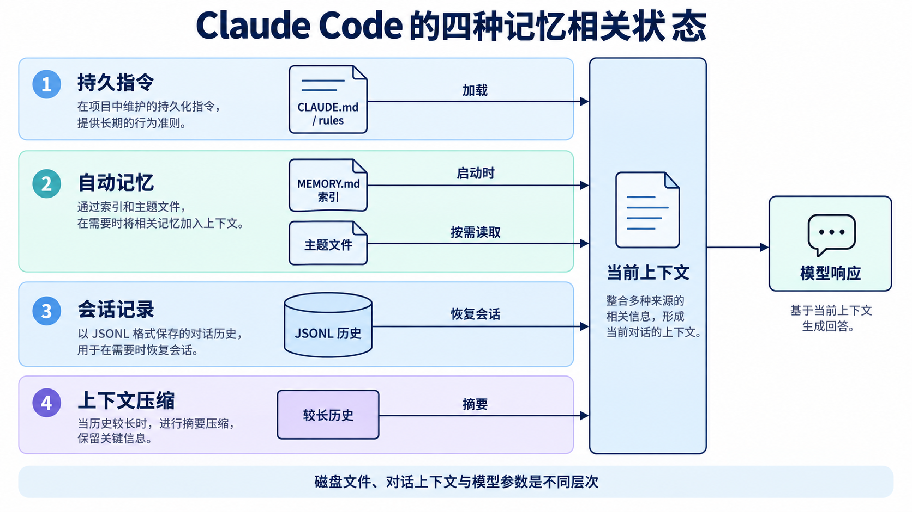
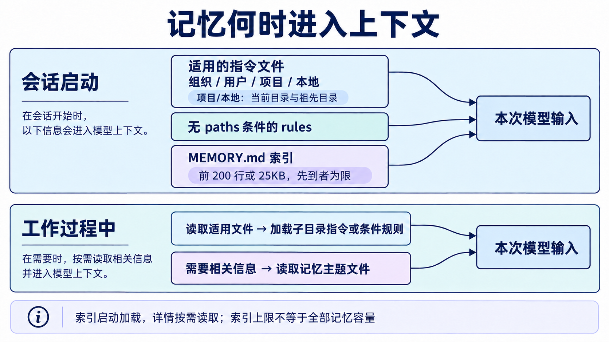
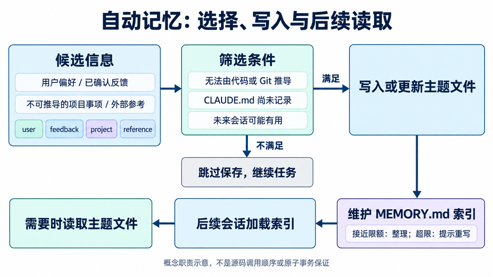
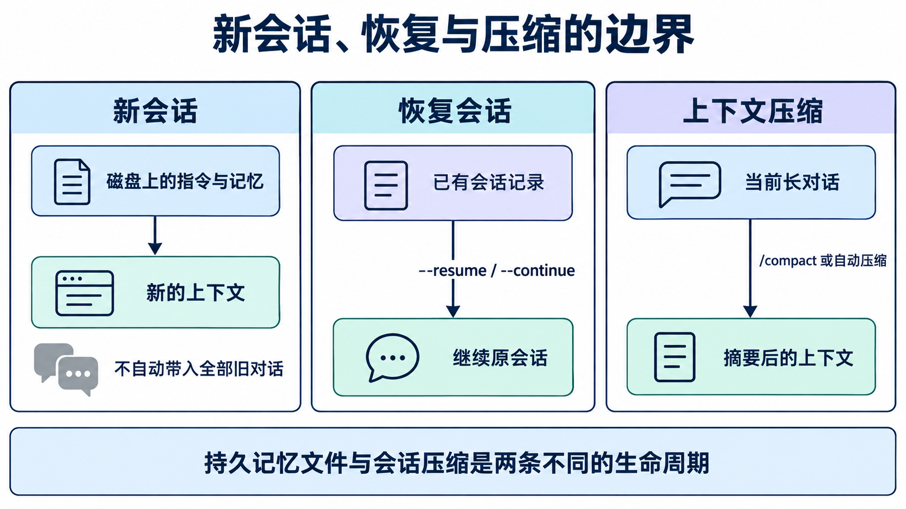
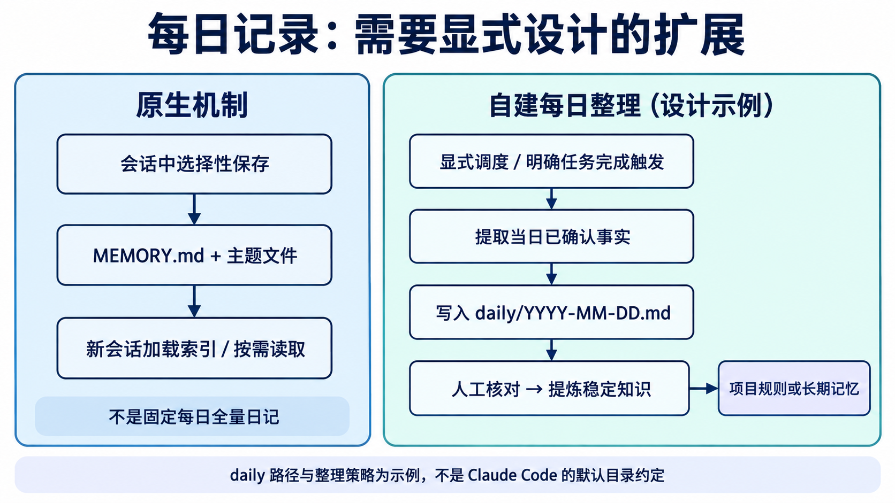

## 先把“记住”拆成四件事

为什么关闭 Claude Code 后重新打开，它有时仍知道你的偏好；而另一些刚谈过的细节，新会话却完全不知道？原因是“记忆”并不是一个单一存储，而是几种生命周期不同的状态共同造成的表象。

本文面向已了解 **LLM 上下文窗口与 Agent 基本概念**的工程师。读完后，你应该能判断一条信息由谁写入、存在哪里、何时重新加载，并能区分新会话、恢复会话与上下文压缩。

本文讨论的是**截至 2026-09-17（Asia/Shanghai）可由公开文档核对的行为，以及建立在这些行为上的工程解释**，不是对 Claude Code 闭源源码的还原。下文区分三类内容：官方文档明确描述的事实；为了理解机制而建立的解释模型；不属于默认行为的工程设计建议。功能、路径和版本条件以后可能变化，应以使用时的官方文档为准。

理解跨会话行为，至少要区分四层：

| 状态                    | 主要写入者                     | 保存什么                                                  | 何时进入上下文                              | 持续性                                    |
| ----------------------- | ------------------------------ | --------------------------------------------------------- | ------------------------------------------- | ----------------------------------------- |
| `CLAUDE.md` 与 rules    | 用户、团队或管理员             | 规则、约定、项目说明                                      | 启动时或匹配路径后加载                      | 文件存在就可跨会话；项目文件可随 Git 共享 |
| 自动记忆（auto memory） | Claude 在会话中选择性写入      | 偏好、纠正、不可从代码或 Git 推导的项目事项、外部参考位置 | 启动加载 `MEMORY.md` 索引，主题文件按需读取 | 默认保存在本机，独立于普通会话清理        |
| JSONL 会话记录          | Claude Code 自动记录           | 消息、工具调用、工具结果                                  | `--resume` 或 `--continue` 恢复会话时使用   | 受会话保留策略影响                        |
| 上下文压缩              | Claude Code 在当前长会话中处理 | 对旧对话的摘要                                            | 压缩后替代部分旧上下文                      | 服务于当前会话预算，不等于长期记忆        |



图中最重要的分界在底部：**磁盘文件、一次请求的上下文和模型参数不是同一层**。把偏好写进 Markdown，并不意味着模型参数被更新；新会话之所以“记得”，是因为相关文件又被读取，其文本重新出现在模型可见的上下文中。

从 Agent 设计角度看，这是一条通用链路：持久化介质负责跨进程保存，加载策略决定哪些内容进入当前上下文，模型再基于当前上下文生成响应。所谓“记忆效果”，同时取决于写入质量、检索时机、上下文预算和指令遵循程度。

## 指令型记忆：CLAUDE.md 与 rules 怎样进入上下文

`CLAUDE.md` 适合保存每次会话都应知道的约定，例如构建命令、编码规范和项目工作流。根据[官方 memory 文档](https://code.claude.com/docs/en/memory)，常见作用域包括：

- 管理员维护的组织级策略；
- `~/.claude/CLAUDE.md` 中的用户级偏好；
- 仓库根目录 `./CLAUDE.md` 或 `./.claude/CLAUDE.md` 中的项目约定；
- 通常应被 Git 忽略的 `./CLAUDE.local.md`，用于个人的项目内偏好。

启动位置很关键。Claude Code 会从当前工作目录向上寻找 `CLAUDE.md` 和 `CLAUDE.local.md`，把发现的内容按目录层级加入上下文；当前目录之下的文件不会在启动时全部塞入，而是在 Claude 读取相应子目录文件时加载。这使单仓库中的不同包可以携带各自约定，而不必让每次会话承担整个仓库的说明文本。

`.claude/rules/` 提供更细的拆分。没有 `paths` frontmatter 的规则会在启动时加载；带 `paths` 的规则则在 Claude 读取匹配文件时触发。例如只为 API TypeScript 文件准备规则：

```markdown
---
paths:
  - "src/api/**/*.ts"
---

- 所有入口都要验证输入。
- 错误响应使用项目统一结构。
```

这里的触发条件是读取匹配文件，不应理解成“每次工具调用都重新注入”。同理，子目录 `CLAUDE.md` 也属于工作过程中按位置加载的信息。

`@path/to/file` import 能把大型指令按文件组织，默认最多递归四层；但导入内容仍会随引用它的 `CLAUDE.md` 在启动时进入上下文。因此，**import 改善可维护性，却不降低启动上下文成本**。若目标是减少常驻内容，应使用 path-scoped rules 或按需加载的 skill，而不是仅仅拆文件。



图中的指令来源包含组织、用户、项目和本地作用域；其中项目目录层级按当前目录及祖先目录发现，子目录指令在工作过程中按需加载。

还有两个容易混淆的“优先级”问题。

第一，[官方排障说明](https://code.claude.com/docs/en/memory#claude-isnt-following-my-claudemd)指出，`CLAUDE.md` 内容是在系统提示词之后，以 **user message** 交给模型，而不是注入 system prompt。多份 `CLAUDE.md` 会累加到上下文中，不像配置键那样由高层值覆盖低层值。若文本互相冲突，模型只能尝试协调，无法保证严格执行。

第二，[settings precedence](https://code.claude.com/docs/en/settings#settings-precedence)处理的是 `settings.json` 中同名配置键：通常依次考虑 managed、命令行、project local、shared project、user 等来源；某些列表键还有合并规则。它与“多份自然语言规则怎样拼接”是两套机制，不能把配置覆盖关系套到 `CLAUDE.md` 上。

因此，“审稿时尽量先检查引用”可以写成提示；“禁止读取密钥文件”或“每次编辑后必须运行检查”若是硬约束，则应使用 permissions 或固定生命周期的 hooks。自然语言指令是模型需要解释的上下文，`PreToolUse` 一类 hook 才适合阻断必须禁止的动作：**把建议交给提示，把强制约束交给可执行控制面。**

## 自动记忆：从一句纠正到可复用文件

自动记忆解决的是另一类问题：用户没有主动维护规则文件，但会话里出现了未来可能有用的信息。当前[官方自动记忆文档](https://code.claude.com/docs/en/memory#auto-memory)列出四种类型：

- `user`：用户角色、专业背景或工作偏好。例如：“这位作者偏好先给结论，再解释机制。”
- `feedback`：用户的纠正，或用户确认有效的方法。例如：“审稿时不要把示意数字写成实测结果。”
- `project`：代码或 Git 历史无法推导的进行中事项、期限或决策。例如：“文章需在周五前完成技术复核。”
- `reference`：项目外部信息的位置。例如：“公开术语表维护在团队知识库的某页面。”

假设一位博客编辑在会话中纠正 Claude：“图注必须说明概念图不是源码调用顺序。”这可能成为 `feedback`，因为未来审稿仍可能受益。相反，文章位于哪个目录、项目使用什么框架、刚修复了哪个函数等，如果能从代码库或 Git 推导，自动记忆会跳过；`CLAUDE.md` 已经明确写过的内容也会跳过。

自动记忆不是逐轮日志。Claude 会判断候选信息未来是否有用，因而**不保证每轮写入，也不保证每个会话都保存**。用户说“记住以后图注要标明概念图”，通常是在请求写入自动记忆；说“把这条加入 `CLAUDE.md`”，则是在要求修改显式指令文件。对稳定且必须让所有协作者看到的约定，后者通常更合适。

### 保存在哪里

默认情况下，每个项目的主会话自动记忆位于：

```text
~/.claude/projects/<project>/memory/
```

`<project>` 由 Git 仓库推导，所以同一仓库的不同 worktree 和子目录共享同一个自动记忆目录；不在 Git 仓库中时，则使用项目根目录。该存储是 **machine-local**：默认不会因为登录同一账号就同步到另一台机器或云环境。

目录采用“短索引 + 主题详情”的结构。除 `MEMORY.md` 外，主题文件名由 Claude 选择：

```text
memory/
├── MEMORY.md
├── concise_review_feedback.md
├── audience_context.md
└── external_references.md
```

`MEMORY.md` 可保持为一行一个入口：

```markdown
# Memory index

- [图注与证据表达偏好](concise_review_feedback.md)
- [博客目标读者](audience_context.md)
- [项目外部参考位置](external_references.md)
```

主题文件可以写成：

```markdown
---
type: feedback
modified: 2026-09-17T10:30:00+08:00
---

图注需要区分概念职责与源码调用顺序；示意数字不能写成实测结果。
```

Claude Code v2.1.214 及以上在写入一个已经带 YAML frontmatter 的记忆文件时，会记录 ISO 8601 格式的 `modified` 时间；没有 frontmatter 的文件不会被系统自动补上 frontmatter。

### 200 行或 25KB 限制到底限制什么

会话启动时，Claude Code 只加载 `MEMORY.md` 的前 200 行或前 25KB，以先到者为准。主题文件不会全部启动加载，而是在需要时通过普通文件工具读取。这是**索引的启动加载上限，不是整个记忆目录的容量上限**。

写入 `MEMORY.md` 后，Claude Code 会检查该索引。接近限制时，它会提醒 Claude 压缩索引、把细节移到主题文件、合并或删除过时条目；超过限制时，写入仍会成功，但工具会返回错误并要求重写索引，因为超出部分在下一次启动时不会被加载。工程含义很直接：索引负责可发现性，详情负责容量。

### 写入与读取的行为模型

下面的伪代码将公开可观察的行为串起来；函数名只用于解释：

```text
on_session_start(project):
    instructions = load_applicable_instructions(project)
    index = read_prefix(memory_dir(project) / "MEMORY.md", 200_lines_or_25KB)
    context.add(instructions, index)

on_conversation_fact(candidate):
    if derivable_from_code_or_git(candidate): return
    if already_in_CLAUDE_md(candidate): return
    if model_judges_future_value(candidate):
        topic = choose_or_create_topic(candidate.type)
        tool_write_or_edit(topic, candidate)
        tool_update_index("MEMORY.md", topic)

when_future_task_needs_detail(index_entry):
    detail = tool_read(index_entry.topic_file)
    context.add(detail)
```



这个解释模型突出三项条件：无法由代码或 Git 推导、`CLAUDE.md` 尚未记录、未来会话可能有用。图与伪代码表示概念职责，不代表内部必须按固定顺序执行，也不意味着主题文件与索引更新是原子事务。排障时应查看实际 Markdown 与当前加载结果。

## 会话边界：新会话、恢复与压缩不是一回事

根据[工作原理文档](https://code.claude.com/docs/en/how-claude-code-works#work-with-sessions)，Claude Code 会把消息、工具调用和工具结果写入 `~/.claude/projects/` 下的纯文本 JSONL 转录。它支持恢复、回退和分叉，但它和自动记忆目录是两类数据。

### 新会话

新会话获得新的上下文窗口，不会自动带入旧会话的完整对话。它之所以可能知道“图注要说明不是源码顺序”，是因为这条信息位于新会话重新加载的 `CLAUDE.md` 或 `MEMORY.md` 索引中，或者之后按需读到了主题文件。若纠正只存在于旧聊天，且没有进入持久文件，新会话不应被期待自动知道。

### `--resume` 与 `--continue`

`claude --resume` 或 `claude --continue` 会重新打开已有会话，沿用同一个 session ID，并把新消息追加到原对话。这里看见旧细节，主要是恢复 JSONL 会话状态的效果，而不是证明自动记忆写入了内容。分叉则会复制历史到新的 session ID，保留原会话不变。

### `/compact` 与自动压缩

压缩是当前上下文窗口的预算管理：先清理较旧工具输出，必要时再把长对话总结成更短的上下文。摘要可能保留目标和关键代码，也可能遗漏早期的细粒度要求。因此，压缩不是无损归档，也不等同于“把聊天写进长期记忆”。

[官方 memory 排障说明](https://code.claude.com/docs/en/memory#instructions-seem-lost-after-compact)指出，项目根 `CLAUDE.md` 在压缩后会从磁盘重读并重新注入。子目录 `CLAUDE.md` 和带 `paths` 的条件规则，则要等 Claude 再次读取适用文件后重新加载。只在对话里说过、没有持久化的要求，仍可能在摘要过程中丢失。



### 两套保留策略

[`~/.claude` 目录文档](https://code.claude.com/docs/en/claude-directory#application-data)说明，普通项目会话 JSONL 默认受 `cleanupPeriodDays` 控制，本文核对文档时默认值为 30 天；自动记忆文件不参加这次会话保留清扫，会持续存在，直到用户或 Claude 编辑、删除它们。空的 memory 目录另有清理条件，旧版本对目录内子文件的处理也有过差异。

因此，“删除聊天必然删除长期记忆”和“保留记忆就能恢复完整聊天”都不成立。设计自己的 Agent 时，也应把审计日志、可恢复会话、提炼后的知识分别设置生命周期，而不是共用一张表和一个 TTL。

还要注意安全边界：官方文档说明转录与历史不是静态加密存储，操作系统文件权限是其主要保护。如果工具读过密钥或命令输出过凭据，内容可能进入 JSONL。减少保留期不替代秘密管理；测试记忆机制时应使用独立项目和虚构数据。

## 配置和可复查方法

自动记忆默认开启。可以在 `/memory` 中切换，结果写入用户设置的 `autoMemoryEnabled`；也可在项目设置中关闭：

```json
{
  "autoMemoryEnabled": false
}
```

环境变量 `CLAUDE_CODE_DISABLE_AUTO_MEMORY=1` 也能关闭它。配置来源可能来自用户、共享项目、项目本地、managed 或 `--settings`，实际值要结合[设置作用域与优先级](https://code.claude.com/docs/en/settings)判断，不要只检查一份文件。

要更改存储位置，可设置：

```json
{
  "autoMemoryDirectory": "~/agent-data/blog-memory"
}
```

该值必须是绝对路径或以 `~/` 开头，可从任一 settings scope 读取；若来自项目设置，还受工作区信任规则约束。如果多个项目显式指向同一目录，它们会接触同一组物理文件，因此应先评估项目隔离风险。

两个命令承担不同职责：

- `/memory`：浏览或编辑 `CLAUDE.md`、local 文件和自动记忆目录，也可切换自动记忆；
- `/context`：检查当前会话实际加载了哪些 memory files，以及上下文空间被什么占用。

可以用不含敏感信息的独立 Git 仓库复查关键边界：

1. 写入最小 `CLAUDE.md`，启动后运行 `/context`，确认它出现在 Memory files 中。
2. 分别创建无 `paths` 规则和仅匹配 `posts/**/*.md` 的条件规则；重启后查看 `/context`，再让 Claude 读取匹配文件，比较两者的加载时机。
3. 用虚构偏好请求“请记住：图注要说明这是概念图”，再用 `/memory` 查看自动记忆目录。若 Claude 判断值得保存，可看到 Markdown 变化，但不应预设固定文件名，也不应预设必定写入。
4. 新开会话并运行 `/context`：旧聊天不会作为完整历史自动出现，`MEMORY.md` 索引前缀会加载，详情可在任务需要时按需读取。
5. 在原会话使用 `/compact`，检查项目根指令是否重读，并在重新读取匹配文件后检查条件规则。
6. 用 `/resume` 或 `--continue` 恢复测试会话，与全新会话比较：前者沿用已有会话记录，后者主要依赖重新加载的持久文件。
7. 关闭自动记忆后，在测试子 Agent 上配置 `memory`，确认该字段不再提供专属记忆注入和相关工具访问。

这些是复现步骤与预期现象，不是本文声称已经完成的实验。版本升级后，应优先看 `/context` 与实际 Markdown，而不是凭一次回答是否“像记得”来判断系统行为。

## 进阶：每个子 Agent 可以拥有独立记忆

普通非 fork 子 Agent 从独立上下文启动。它会收到委派任务和适用的 `CLAUDE.md` 等信息，但**主会话的自动记忆不会自动加载给它**。fork 是例外：它继承父对话上下文和 system prompt。

这里还有两项重要例外：[子 Agent 文档](https://code.claude.com/docs/en/sub-agents#what-loads-at-startup)说明，内置 Explore 和 Plan Agent 默认跳过这些 `CLAUDE.md` 文件；自定义子 Agent 可设置 `omitClaudeMd: true`，此时只保留 managed policy，若定义本身来自 managed settings，则可以不加载任何此类文件。不要把“普通非 fork 子 Agent 会收到适用指令”理解成所有子 Agent 都加载完整层级。

自定义子 Agent 可通过 `memory` 字段拥有独立持久目录：

| `memory` 值 | 目录                                       | 适用范围                           |
| ----------- | ------------------------------------------ | ---------------------------------- |
| `user`      | `~/.claude/agent-memory/<agent-name>/`     | 跨项目、仅当前用户机器             |
| `project`   | `.claude/agent-memory/<agent-name>/`       | 当前项目，可提交版本控制供团队共享 |
| `local`     | `.claude/agent-memory-local/<agent-name>/` | 当前项目个人使用，不宜提交         |

下面是一份 Claude Code 子 Agent 定义示例：顶部是 YAML 元数据，后面是 Markdown 提示词。

```markdown
---
name: article-reviewer
description: 检查技术文章中的证据边界与术语一致性
memory: project
---

审阅技术文章。记录反复出现、经确认仍适用于本项目的审稿模式；
不要把一次性意见或未经确认的推测写入记忆。
```

开启记忆后，该子 Agent 的 system prompt 会包含读写其记忆目录的说明，以及它自己的 `MEMORY.md` 前 200 行或 25KB；Read、Write、Edit 工具也会自动开放。这里与主会话 `CLAUDE.md` 的注入位置不同：不能把“子 Agent 自身记忆说明进入 system prompt”反推成“所有 `CLAUDE.md` 都是 system prompt”。

如果通过 `autoMemoryEnabled` 或 `CLAUDE_CODE_DISABLE_AUTO_MEMORY` 关闭自动记忆，子 Agent 的 `memory` 字段不生效，也不会获得上述记忆说明和工具访问。

主会话与子 Agent 的写入范围也不应混为一谈。主会话自动记忆文档强调跳过可从代码库推导的架构、路径和调试事实；子 Agent 持久记忆文档则把代码模式、调试洞见和架构决策列为专业 Agent 可积累的知识。两者面向不同记忆空间和角色。

## 进阶：“每日记忆”不是默认自动记忆

在本文核对的官方文档中，“每天定时把全部会话写入 `daily/YYYY-MM-DD.md`”不是 Claude Code 自动记忆的默认机制。原生机制是在会话中选择性保存未来有价值的信息，并维护 `MEMORY.md` 与主题文件，而不是固定频率的全量日记。

[Hooks 文档](https://code.claude.com/docs/en/hooks)中的 `SessionStart`、`PreCompact`、`PostCompact` 由会话启动或恢复、压缩前、压缩后等生命周期事件触发，不是每日时钟。[`/loop` 与 scheduled tasks](https://code.claude.com/docs/en/scheduled-tasks)默认也是会话级任务：只在 Claude Code 运行且空闲时触发；新会话会清除会话级任务，恢复会话时也只有满足条件的任务可以恢复。



如果确实需要每日归档，应把它当作独立数据管道，并至少处理以下问题：

1. **调度**：需要本机文件时使用 Desktop scheduled task 或操作系统调度器；独立运行的云端 routine、CI 等有不同文件可见性。
2. **提取与审核**：只提取用户确认的决策、纠正和未完成事项，先进入待审层，再把稳定规则提炼到 `CLAUDE.md` 或记忆主题文件。
3. **幂等与并发**：用稳定键去重，对同一日期文件加锁，避免重试或并发任务相互覆盖。
4. **项目、时区与日期**：把仓库标识、目标时区和归档日期作为显式输入；例如“项目 + 来源会话 + 事实内容哈希”可作为示意去重键，避免重试或跨午夜运行重复归档。
5. **过期与更正**：记录事实来源和确认日期；决策变化时保留替代关系，并从长期索引移除失效条目。每日记录供追溯，长期记忆只保留仍适用的信息。
6. **同步与秘密边界**：云任务通常拿到 fresh clone，并不会天然拥有本机 `~/.claude/projects/<project>/memory/`；如需同步，应单独设计授权、过期与秘密隔离。

图中的 `daily/` 路径只是设计示例，不是 Claude Code 的默认目录约定。

## 给 Agent 设计者的简短选型

- 每次都应看到、允许模型解释执行的约定：放 `CLAUDE.md`；局部约定用 path-scoped rules。
- 用户纠正和不可由代码推导、未来仍有价值的事实：交给自动记忆，但保留人工查看和删除能力。
- 要继续完整工作现场：恢复 JSONL 会话，不要指望主题记忆重建全部聊天。
- 只想释放当前上下文预算：使用压缩，但接受摘要可能丢细节。
- 必须阻断或固定触发的动作：使用 permissions/hooks，不依赖自然语言规则。
- 需要每日归档：把它当作独立数据管道，显式设计调度、审核、幂等与同步边界。

## 官方资料

- [Memory：CLAUDE.md、rules 与自动记忆](https://code.claude.com/docs/en/memory)
- [How Claude Code works：会话、恢复与上下文](https://code.claude.com/docs/en/how-claude-code-works)
- [Subagents：启动上下文与持久记忆](https://code.claude.com/docs/en/sub-agents)
- [Hooks：SessionStart、PreCompact 与 PostCompact](https://code.claude.com/docs/en/hooks)
- [Claude directory：应用数据、保留与明文存储](https://code.claude.com/docs/en/claude-directory)
- [Scheduled tasks：会话级调度及其限制](https://code.claude.com/docs/en/scheduled-tasks)
- [Settings：作用域与优先级](https://code.claude.com/docs/en/settings)
- [Features overview：扩展机制与上下文成本](https://code.claude.com/docs/en/features-overview)
