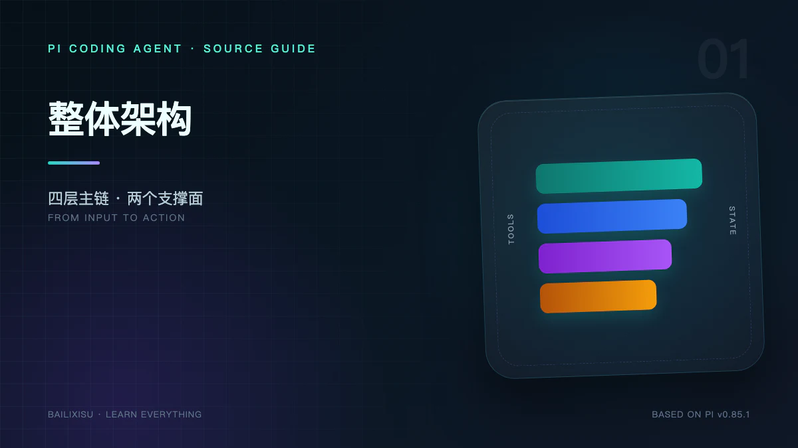
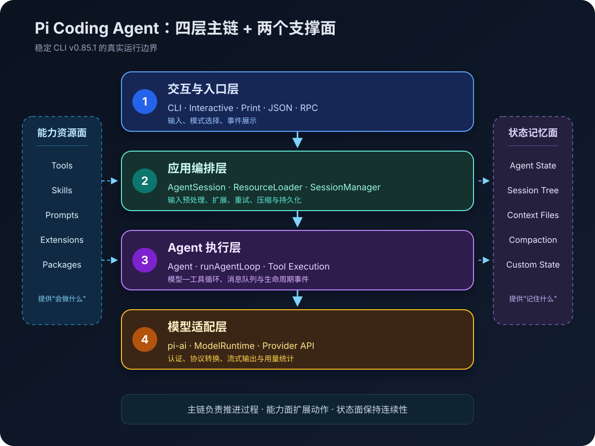
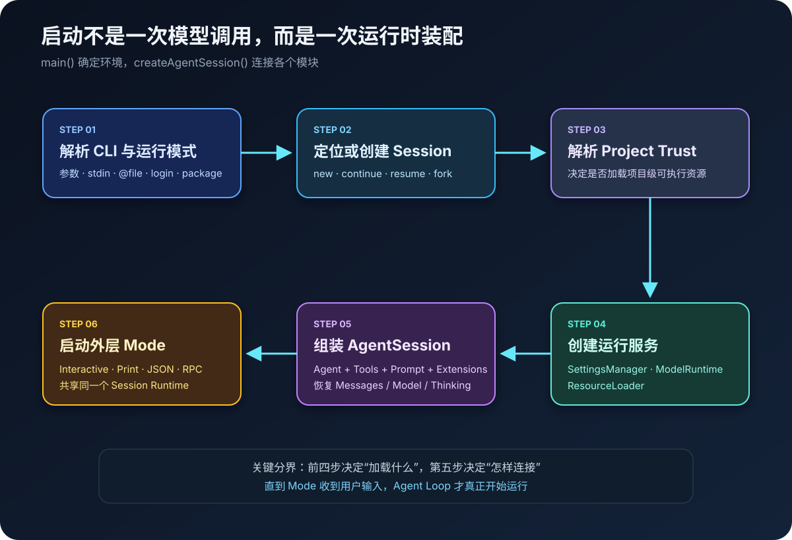
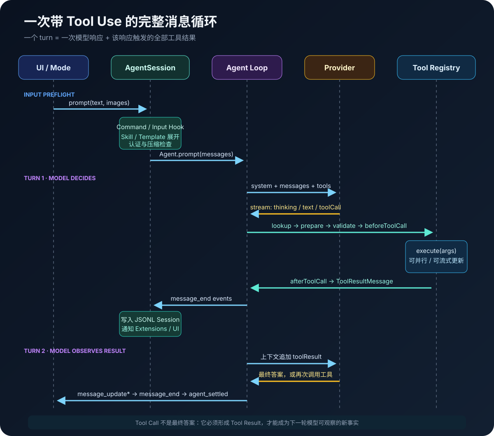

> **版本说明**：本文研究对象是 `@earendil-works/pi-coding-agent@0.85.1`，对应 Git tag `v0.85.1`、commit `d981de1`。Pi 仍在快速迭代，后续版本的命名和调用链可能变化。



当我们在终端里输入一句“帮我修复这个测试”时，表面上只是一次问答，实际经过了配置加载、上下文拼装、模型调用、工具执行、结果回灌、会话持久化和界面渲染等多个阶段。

Pi 的特别之处在于：它没有把所有能力塞进一个庞大的 `Agent` 类，而是把系统拆成多个边界清晰的软件包。理解这些边界，比记住某个函数名更重要。

本文先回答三个问题：

1. Pi 的整体架构分成哪些层？
2. 一条用户输入怎样穿过这些层，最终变成文件修改？
3. Tool Use、Memory、Skills、Extensions 分别处在流程的什么位置？



## 一、结论先行：Pi 不是一个循环，而是一组分层协作的运行时

从当前稳定 CLI 的实际调用链看，可以把 Pi 分成四个核心软件层，以及两个横向支撑面。

| 层级         | 核心包或模块                                          | 主要职责                                                         | 不负责什么                   |
| ------------ | ----------------------------------------------------- | ---------------------------------------------------------------- | ---------------------------- |
| 交互与入口层 | `pi-coding-agent/main.ts`、Interactive/Print/JSON/RPC | 解析参数、确定运行模式、收集用户输入、展示事件                   | 不直接实现模型协议           |
| 应用编排层   | `AgentSession`、`ResourceLoader`、`SessionManager`    | Prompt 预处理、资源装配、扩展 Hook、重试、压缩、持久化           | 不直接实现底层 Agent 循环    |
| Agent 执行层 | `Agent`、`agentLoop`                                  | 维护运行状态，循环调用模型和工具，处理消息队列，发出生命周期事件 | 不关心 TUI 长什么样          |
| 模型适配层   | `pi-ai`、`ModelRuntime`                               | 模型目录、认证、Provider 路由、协议转换、流式响应、用量统计      | 不执行本地文件工具           |
| 横向能力面   | Tools、Skills、Prompt Templates、Extensions           | 给模型增加动作、知识与运行时扩展能力                             | 不天然决定完整业务流程       |
| 横向状态面   | Agent State、JSONL Session、Context Files、Compaction | 保存当前上下文、历史分支、项目规则和压缩摘要                     | 不等同于向量数据库式长期记忆 |

最短的主调用链可以写成：

```text
用户输入
  ↓
InteractiveMode / PrintMode / RpcMode
  ↓
AgentSession.prompt()
  ↓
Agent.prompt()
  ↓
runAgentLoop()
  ↓
ModelRuntime.streamSimple()
  ↓
具体 Provider API
  ↓
AssistantMessage / ToolCall
  ↓
AgentTool.execute()
  ↓
ToolResultMessage 回到下一轮模型上下文
```

这个链条揭示了 Pi 的核心设计：

> `AgentSession` 管“产品级编排”，`Agent` 管“运行状态”，`agentLoop` 管“模型—工具循环”，`pi-ai` 管“如何与不同模型通信”。

## 二、先划清一个容易混淆的版本边界

在 `v0.85.1` 源码中可以同时看到两套相关架构：

### 1. 当前日常 CLI 的稳定主路径

日常运行 `pi`、`pi -p`、`pi --mode json` 和 `pi --mode rpc` 时，核心路径仍然使用：

```text
AgentSession
  └─ Agent
      └─ runAgentLoop / runAgentLoopContinue
          └─ pi-ai Models / Provider
```

会话由 `coding-agent/src/core/session-manager.ts` 中的 `SessionManager` 保存为 JSONL v3 树结构。

### 2. experimental 路径中的 AgentHarness

`pi-agent-core` 同时包含一套更偏持久化服务端运行的 `AgentHarness`：它引入 Session、Branch、AgentLane、durable operation、事务状态和崩溃恢复机制。目前在 `coding-agent/src/experimental/` 的 server/client 与 mini 示例中使用。

这套 Harness 很重要，但它不是当前交互式 CLI 每次请求所走的主路径。如果把两者混在一起，就会错误地认为日常 Pi CLI 已经在每一个工具调用前后持久化完整 operation state。

本系列前十一篇以当前稳定 CLI 为主，第十二篇再单独分析 AgentHarness。

## 三、启动阶段：Pi 如何组装出一个可运行的 Agent

运行 `pi` 后，入口函数并不是立即调用模型，而是先构造运行环境。



### 步骤 1：CLI 解析与模式判断

`coding-agent/src/main.ts` 中的 `main()` 首先处理：

- CLI 参数和诊断信息；
- `interactive`、`print`、`json` 或 `rpc` 模式；
- stdin、`@file`、初始消息和图片；
- 离线模式、更新、登录和包管理命令；
- session 的新建、继续、恢复或 fork。

这一步回答的是“Pi 要以什么方式运行”，而不是“Agent 要怎样推理”。

### 步骤 2：项目可信度判断

Pi 会检查项目目录中是否存在 `.pi/settings.json`、项目 Extensions、Skills、Prompt、Theme 或 `.agents/skills`。如果这些资源尚未被信任，交互模式会依据 `defaultProjectTrust` 请求确认。

需要注意：**Project Trust 只是启动时的资源加载闸门，不是 Sandbox**。一旦 Agent 开始工作，内置工具仍以当前操作系统用户权限读写文件和执行命令。

### 步骤 3：创建三类运行服务

`createAgentSessionServices()` 和 `DefaultResourceLoader` 会准备：

1. `SettingsManager`：合并全局与项目配置；
2. `ModelRuntime`：管理模型目录、认证和 Provider；
3. `ResourceLoader`：发现 Extensions、Skills、Prompt Templates、Themes、Context Files 和 System Prompt。

这些资源都有全局、项目、Package 和 CLI 临时输入等不同来源。`ResourceLoader` 的作用，是把分散的文件和配置规整成后续可以消费的对象。

### 步骤 4：创建 SessionManager

`SessionManager` 负责：

- 创建或打开 JSONL session；
- 恢复当前分支的消息；
- 恢复模型和 thinking level；
- 保存后续 `message_end` 事件；
- 支持 `/tree`、fork、clone、label 和 compaction entry。

它保存的是一棵 append-only 的会话树。分支不是复制整段历史，而是通过每条 entry 的 `id` 和 `parentId` 连接。

### 步骤 5：`createAgentSession()` 组装 Agent

这个工厂函数是稳定 CLI 与 SDK 共用的关键装配点。它会：

1. 从 Session 或 Settings 选择初始模型；
2. 恢复或限制 thinking level；
3. 决定启用哪些内置、扩展和自定义工具；
4. 创建 `Agent`，注入 `convertToLlm`、`streamFn`、Hook、消息队列和 Provider 参数；
5. 创建 `AgentSession`，连接 Agent、SessionManager、Extensions 与 ResourceLoader；
6. 重建 System Prompt 和工具注册表。

### 步骤 6：选择外层运行模式

最后，同一个 `AgentSessionRuntime` 被交给不同外壳：

- `InteractiveMode`：完整 TUI；
- `runPrintMode`：执行后输出文本并退出；
- JSON mode：输出结构化事件流；
- `runRpcMode`：通过 stdin/stdout JSONL 接受外部控制。

这也是 Pi 能同时作为终端应用、脚本工具和嵌入式 SDK 的原因：**交互模式不同，但底层 Session 和 Agent Loop 可以复用。**

## 四、请求阶段：一句 Prompt 的标准执行流程

假设用户输入：

```text
读取 package.json，找出构建命令并运行它。
```

这条指令并不会直接交给模型。它首先进入 `AgentSession.prompt()`。

### 阶段 1：输入预处理

`AgentSession` 按顺序处理：

1. 判断是否为 Extension Command；
2. 触发 Extension 的 `input` 事件，允许处理或改写输入；
3. 展开 `/skill:name`；
4. 展开文件型 Prompt Template；
5. 如果 Agent 正在运行，则按 `steer` 或 `followUp` 入队；
6. 刷新等待写入的 Bash 或 Custom Message；
7. 检查模型与认证；
8. 必要时在发送新消息前执行 compaction；
9. 触发 `before_agent_start`，允许扩展追加消息或临时修改 System Prompt。

这里可以看出，Skills、Prompt Templates 和 Extension Commands 虽然都能通过 `/...` 触发，但实现完全不同：

- Prompt Template 是文本展开；
- Skill 是读取 `SKILL.md` 后，把完整说明包装进当前用户消息；
- Extension Command 是执行 TypeScript handler，甚至可以不调用模型。

### 阶段 2：进入 Agent 状态机

`AgentSession._runAgentPrompt()` 调用 `Agent.prompt()`。`Agent` 会：

- 创建本轮 `AbortController`；
- 标记 `isStreaming = true`；
- 复制当前 system prompt、messages 和 tools，形成一次运行快照；
- 调用 `runAgentLoop()`；
- 顺序处理并等待所有事件监听器；
- 在结束后清理 streaming 状态。

`Agent` 是有状态包装器；真正的循环逻辑位于 `agent-loop.ts`。

### 阶段 3：构造模型上下文

每次调用模型前，`streamAssistantResponse()` 会执行：

```text
AgentMessage[]
  → transformContext()
  → convertToLlm()
  → pi-ai Context
  → streamFunction()
```

其中：

- `transformContext()` 让 Extensions 在请求级别调整上下文；
- `convertToLlm()` 把 Pi 自己的消息类型转换成模型认识的 `user`、`assistant` 和 `toolResult`；
- `CompactionSummary`、`BranchSummary`、Bash Execution 和 Custom Message 会在这里转换或过滤；
- System Prompt 与当前 Tools 一起构成最终 `pi-ai Context`。

### 阶段 4：Provider 流式生成

`ModelRuntime.streamSimple()` 根据 `model.provider` 和 `model.api` 找到对应 Provider 与协议实现，完成：

- API Key 或 OAuth 解析；
- Provider 请求格式转换；
- thinking level 映射；
- Tool Schema 转换；
- SSE 或 WebSocket 流处理；
- token、cache 与 cost 统计；
- 统一输出 `text_delta`、`thinking_delta`、`toolcall_delta`、`done` 或 `error`。

因此，上层 Agent Loop 不需要分别理解 Anthropic Messages、OpenAI Responses 或 Gemini API。

## 五、Tool Use：模型如何真正修改本地环境



如果模型返回一个 Tool Call，例如：

```json
{
  "name": "read",
  "arguments": { "path": "package.json" }
}
```

Agent Loop 会执行以下步骤。

### 1. 查找工具

从本轮 `AgentContext.tools` 中按名称查找。如果不存在，则生成 `isError: true` 的 Tool Result，让模型自行修正，而不是直接让整个进程崩溃。

### 2. 参数预处理与校验

工具可以先通过 `prepareArguments()` 修正参数，然后使用 TypeBox Schema 校验。参数不合法时同样生成错误 Tool Result。

### 3. 扩展拦截

`AgentSession` 把 Agent 的 `beforeToolCall` 与 `afterToolCall` 接到了 Extension Runner：

- `tool_call` 可以阻止危险操作；
- `tool_result` 可以修改结果、错误状态和 usage；
- 图片类结果会在 Hook 后统一规范化。

### 4. 执行工具

工具的 `execute()` 接收：

- `toolCallId`；
- 已校验参数；
- `AbortSignal`；
- 可选的流式更新回调。

当前默认内置工具为 `read`、`bash`、`edit` 和 `write`；还提供 `grep`、`find`、`ls` 与 Windows 的 `powershell`。

### 5. 并行或串行

默认全局模式是 `parallel`。如果一次模型响应包含多个 Tool Call，Pi 会并发执行；但只要其中任一工具声明 `executionMode: "sequential"`，整个批次就按顺序执行。

即使并行完成，最终生成的 Tool Result Message 仍按模型原始 Tool Call 顺序回灌，避免上下文顺序随机变化。

### 6. 结果回灌

每个结果被转换为：

```ts
{
  role: ("toolResult",
    toolCallId,
    toolName,
    content,
    details,
    usage,
    isError,
    timestamp);
}
```

随后追加到 `currentContext.messages`。只要工具批次没有要求终止，Agent Loop 就开始下一个 turn，把工具结果发回模型。

因此，Agent 的核心闭环是：

```text
模型观察上下文
  → 选择工具
  → Pi 执行工具
  → 结果写回上下文
  → 模型观察新结果
  → 继续调用工具或给出最终答案
```

## 六、Memory：Pi 到底“记住”了什么

Pi 没有一个名为 `MemoryModule` 的统一组件。它的记忆能力分散在不同层次中。

| 记忆层次     | 载体                               | 生命周期               | 用途                               |
| ------------ | ---------------------------------- | ---------------------- | ---------------------------------- |
| 当前工作记忆 | `Agent.state.messages`             | 当前进程与当前 Session | 直接参与下一次模型请求             |
| 会话记忆     | JSONL Session Tree                 | 跨进程、可恢复         | 保存消息、模型切换、分支与压缩记录 |
| 项目指令记忆 | `AGENTS.md` / `CLAUDE.md`          | 启动或 reload 后持续   | 注入项目规则和约定                 |
| 程序性记忆   | Skills / Prompt Templates          | 被发现后按需展开       | 告诉 Agent 某类任务怎样完成        |
| 压缩记忆     | Compaction Summary                 | 上下文过长后           | 用有损摘要替代较老消息             |
| 扩展状态     | Custom Entry / Tool Result details | 由扩展定义             | 保存 Todo、检查点等自定义状态      |

这里最重要的结论是：

> Pi 的内置 Memory 主要是“会话树 + 上下文投影 + 摘要”，不是自动检索个人知识库的向量记忆系统。

如果需要 embedding、向量数据库、跨项目用户画像或自动召回，应该通过 Extension、自定义 Tool 或外部 CLI 增加，而不是误以为 SessionManager 已经提供这些能力。

## 七、System Prompt、Context Files 与 Skills 如何汇合

`buildSystemPrompt()` 会把以下内容组合起来：

1. Pi 的默认角色说明；
2. 当前真正启用的工具和工具说明；
3. 与工具相关的操作 guideline；
4. `.pi/SYSTEM.md` 或自定义 System Prompt；
5. `APPEND_SYSTEM.md`；
6. 从全局、父目录到当前目录加载的 Context Files；
7. Skills 的名称、描述和文件位置；
8. 当前工作目录。

Skill 使用“渐进式披露”：启动时通常只把名称和 description 放进 System Prompt；当任务匹配时，模型再使用 `read` 读取完整 `SKILL.md`。如果用户明确执行 `/skill:name`，`AgentSession` 会直接读取文件并将正文包装进当前消息。

这解释了为什么 Skill 不是 Tool：

- Tool 给模型一个可调用函数；
- Skill 给模型一套完成任务的方法、约束和参考资料；
- Extension 则能修改 Pi 运行时本身。

## 八、事件流：为什么 TUI、JSON 和持久化可以同时工作

Agent Core 不直接操作 UI，而是发出事件：

```text
agent_start
turn_start
message_start
message_update*
message_end
tool_execution_start
tool_execution_update*
tool_execution_end
turn_end
agent_end
```

`AgentSession` 订阅这些事件，并按顺序完成三件事：

1. 先交给 Extensions；
2. 再通知 TUI、Print 或 JSON mode 等外部监听器；
3. 在 `message_end` 时写入 SessionManager。

这是一种典型的事件驱动解耦：

- Agent Loop 只负责产生事实；
- TUI 负责把事实渲染成界面；
- JSON mode 负责把事实编码成 JSONL；
- SessionManager 负责把已完成消息保存到磁盘；
- Extensions 可以在生命周期中观察或拦截。

## 九、一次完整执行的停止条件

Agent Loop 不会无限调用模型。它会在以下情况结束当前 run：

- 模型正常返回，不再请求工具；
- 模型返回 `error` 或 `aborted`；
- 工具批次全部返回 `terminate: true`；
- `shouldStopAfterTurn` 请求在当前 turn 后停止；
- 没有待处理 Tool Call、Steering Message 或 Follow-up Message。

Agent Core 结束后，`AgentSession` 还会执行产品级收尾：

1. 判断错误是否需要自动重试；
2. 检查是否发生 context overflow；
3. 检查是否达到主动 compaction 阈值；
4. 处理由 `agent_end` 扩展新加入的队列消息；
5. 必要时调用 `agent.continue()`。

所以 `agent_end` 不一定代表整个 `AgentSession.prompt()` 已经结束。真正对外稳定的收尾事件是 `agent_settled`。

## 十、为什么 Pi 选择这种架构

### 1. 模型协议与 Agent 逻辑解耦

Agent Loop 只消费统一 Message 和 Stream Event，新增 Provider 时不用改工具循环。

### 2. Agent Core 与 Coding 产品解耦

`pi-agent-core` 可以用于其他 Agent 应用；重试、会话树、项目规则和 TUI 则留在 `pi-coding-agent`。

### 3. 机制与工作流解耦

Pi 内核提供 Tool、Event、Session 和 Extension 机制，却刻意不内置唯一的 Plan Mode、Sub-Agent 或 Todo 流程。用户可以通过 Extensions 和 Packages 选择自己的实现。

### 4. 所有外壳共享同一事件模型

Interactive、Print、JSON、RPC 和 SDK 不必各写一套推理循环。

### 5. Memory 不被包装成神秘黑盒

Session、Context File、Skill 和 Compaction 的作用边界清晰，使用者可以知道哪些信息会进入模型、哪些只是界面或扩展状态。

## 十一、阅读源码时应该抓住的主线

如果你准备自己阅读 Pi 源码，推荐按照以下顺序：

```text
packages/coding-agent/src/main.ts
  ↓
packages/coding-agent/src/core/sdk.ts
  ↓
packages/coding-agent/src/core/agent-session.ts
  ↓
packages/agent/src/agent.ts
  ↓
packages/agent/src/agent-loop.ts
  ↓
packages/ai/src/models.ts
  ↓
packages/ai/src/api/<具体协议>.ts
```

需要理解旁路能力时，再分别阅读：

```text
resource-loader.ts    → Skills / Prompts / Extensions / Context Files
system-prompt.ts      → System Prompt 拼装
session-manager.ts    → JSONL 会话树与上下文恢复
core/tools/*          → 内置工具
modes/interactive/*  → TUI 交互
```

## 十二、本篇建立的架构坐标

现在可以把 Pi 的整体流程压缩成一句话：

> Pi 先由 CLI 和 ResourceLoader 组装一个 AgentSession；AgentSession 将输入、资源、扩展、重试、压缩和持久化接到 Agent 上；Agent 再通过 agentLoop 驱动“模型生成—工具执行—结果回灌”的循环；pi-ai 负责把这个统一循环翻译成不同 Provider 的真实 API 请求。

后续文章会沿着这条主线逐层展开。下一篇先分析启动阶段：Settings、Project Trust、ResourceLoader、System Prompt 和工具注册表究竟以什么顺序组装。

## 参考资料与源码索引

- [Pi Coding Agent README](https://github.com/earendil-works/pi/blob/v0.85.1/packages/coding-agent/README.md)
- [Pi Agent Core README](https://github.com/earendil-works/pi/blob/v0.85.1/packages/agent/README.md)
- [Pi AI README](https://github.com/earendil-works/pi/blob/v0.85.1/packages/ai/README.md)
- [`coding-agent/src/main.ts`](https://github.com/earendil-works/pi/blob/v0.85.1/packages/coding-agent/src/main.ts)
- [`coding-agent/src/core/sdk.ts`](https://github.com/earendil-works/pi/blob/v0.85.1/packages/coding-agent/src/core/sdk.ts)
- [`coding-agent/src/core/agent-session.ts`](https://github.com/earendil-works/pi/blob/v0.85.1/packages/coding-agent/src/core/agent-session.ts)
- [`agent/src/agent.ts`](https://github.com/earendil-works/pi/blob/v0.85.1/packages/agent/src/agent.ts)
- [`agent/src/agent-loop.ts`](https://github.com/earendil-works/pi/blob/v0.85.1/packages/agent/src/agent-loop.ts)
- [`coding-agent/src/core/session-manager.ts`](https://github.com/earendil-works/pi/blob/v0.85.1/packages/coding-agent/src/core/session-manager.ts)
- [Session Format](https://github.com/earendil-works/pi/blob/v0.85.1/packages/coding-agent/docs/session-format.md)
- [Compaction](https://github.com/earendil-works/pi/blob/v0.85.1/packages/coding-agent/docs/compaction.md)
- [SDK](https://github.com/earendil-works/pi/blob/v0.85.1/packages/coding-agent/docs/sdk.md)
