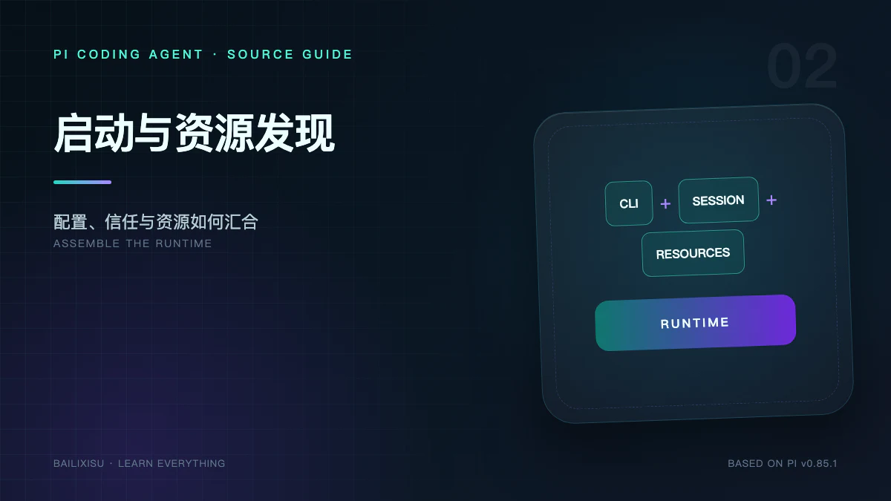

> 本文基于 Pi `v0.85.1`。上一篇建立了整体架构坐标，这一篇只研究一个问题：在第一条 Prompt 到来前，Pi 做了什么？



很多 Agent 教程从“调用模型”开始，但对 Coding Agent 来说，真正决定行为的往往是模型调用之前的装配：当前目录是否可信、加载了哪些项目规则、哪些工具被启用、恢复哪段会话、使用哪个模型。

Pi 的启动不是一个构造函数，而是一条分阶段管线：

```text
main()
  → 解析 CLI 与输入
  → 读取启动设置
  → 预扫描项目资源
  → 解析 Project Trust
  → createAgentSessionServices()
  → ResourceLoader.reload()
  → createAgentSessionFromServices()
  → Interactive / Print / JSON / RPC
```

## 一、三个结论

1. **配置不等于资源**：Settings 决定“去哪里找、启用什么”，ResourceLoader 才真正发现 Extensions、Skills、Prompts、Themes 与 Context Files。
2. **Project Trust 是加载闸门**：它决定项目级配置和可执行资源能否进入运行时，但不为工具执行提供 Sandbox。
3. **`createAgentSession()` 是稳定 CLI 和 SDK 的共同装配点**：不同运行模式复用同一个 `AgentSessionRuntime`。

## 二、`main()` 先决定“怎样运行”

入口 `packages/coding-agent/src/main.ts` 的职责比一般 CLI 更重，但它仍然不实现 Agent Loop。可以把它分成四组工作。

### 1. 进程级准备

包括运行时初始化、诊断输出、离线模式、代理、版本检查和部分命令的短路处理。`pi update`、`pi login`、`pi config` 等命令可能在创建 Agent 前就结束。

### 2. 输入归一化

初始输入可能来自：

- 位置参数；
- stdin 管道；
- `@path` 文件引用；
- 图片附件；
- Interactive Editor。

入口层把这些来源转换成后续 Mode 能使用的初始消息，而不是让每个 Mode 分别解析。

### 3. Session 选择

Pi 需要确定：

- 新建 Session；
- `--continue` 最近一次 Session；
- 从选择器恢复；
- 打开指定 `--session` 文件；
- fork 或 clone 既有历史；
- `--no-session` 完全不持久化。

Session 的 `cwd` 很重要，因为它同时参与默认会话目录、项目资源发现和 System Prompt。

### 4. Mode 选择

最终外壳有四种：

| Mode        | 主要输入输出            | 使用场景                    |
| ----------- | ----------------------- | --------------------------- |
| Interactive | 全屏或常规终端 UI       | 人机协作式编码              |
| Print       | 一次输入、普通文本输出  | Shell 脚本                  |
| JSON        | 只输出 Agent 事件 JSONL | 日志、流处理                |
| RPC         | 双向 JSONL 命令与事件   | IDE、桌面客户端、外部编排器 |

Mode 的差异发生在 `AgentSession` 外部。因此修复 Agent Loop 后，四种模式通常一起受益。

## 三、Settings 如何合并

Pi 使用两级 Settings：

```text
~/.pi/agent/settings.json   全局
<project>/.pi/settings.json 项目
```

项目配置覆盖全局配置；嵌套对象按字段合并，数组通常由项目值整体替换。

例如：

```json
// 全局
{
  "theme": "dark",
  "compaction": {
    "enabled": true,
    "reserveTokens": 16384
  }
}
```

```json
// 项目
{
  "compaction": {
    "reserveTokens": 8192
  }
}
```

结果保留 `enabled: true`，只覆盖 `reserveTokens`。

### 配置优先级不是一条统一直线

不同配置有不同来源。例如 Session 目录的优先级是：

```text
--session-dir
  > PI_CODING_AGENT_SESSION_DIR
  > settings.json sessionDir
  > 默认 ~/.pi/agent/sessions/<cwd编码>/
```

模型选择还会考虑：

1. CLI 显式 `--provider` / `--model`；
2. 恢复 Session 保存的模型；
3. Settings 默认模型；
4. 当前唯一可用或可认证的模型；
5. 交互选择或报错。

因此不要用一句“CLI 永远覆盖一切”解释所有配置。应查看对应 Resolver。

## 四、Project Trust：防止项目在启动时静默执行代码

一个仓库可能携带：

- `.pi/settings.json`；
- 项目 Extensions；
- 项目 Packages；
- Skills、Prompt Templates 和 Themes；
- `.agents/skills`。

其中 Extension 是可执行 TypeScript，Package 还可能触发依赖安装。仅仅 `cd` 到陌生仓库，不应该让这些内容自动运行。

### 交互模式

如果当前目录或父目录没有保存的信任决策，Pi 会显示确认界面。信任结果保存在：

```text
~/.pi/agent/trust.json
```

`/trust` 可以写入当前项目或父目录的决定，但当前 Session 不会自动重新加载，需要重启。

### 非交互模式

Print、JSON 和 RPC 不能弹出确认框，使用全局 `defaultProjectTrust`：

- `ask`：没有已有决定时忽略项目资源；
- `never`：忽略；
- `always`：加载。

单次运行可用 `--approve` 或 `--no-approve` 覆盖。

### Trust 的边界

> Trust 解决的是“是否加载仓库携带的 Pi 配置和程序”，不是“模型能否删除文件”。

内置 `bash`、`edit`、`write` 仍以 Pi 进程的操作系统权限运行。真正的隔离要靠容器、受限用户、虚拟机或外部 Extension policy。

## 五、为什么 ResourceLoader 要先预扫描再正式加载

`DefaultResourceLoader.reload()` 支持一个重要顺序：

```text
预扫描 Extensions
  → 收集项目资源存在性
  → resolveProjectTrust()
  → 按信任结果重建 Settings
  → 安装或解析 Packages
  → 正式加载 Extensions
  → 发现 Skills / Prompts / Themes / Context
```

如果先完整执行项目 Extension，再询问信任，安全闸门就失去意义。因此预信任阶段只为决策收集信息，正式加载必须发生在决策之后。

## 六、ResourceLoader 统一了哪些来源

资源可能来自四类位置：

| 来源              | 例子                                           | 特点                  |
| ----------------- | ---------------------------------------------- | --------------------- |
| 用户级            | `~/.pi/agent/skills`、`~/.pi/agent/extensions` | 所有项目共享          |
| 项目级            | `.pi/skills`、`.pi/extensions`                 | 受 Project Trust 控制 |
| Settings 显式路径 | `skills`、`extensions`、`prompts`、`themes`    | 支持路径、glob 与排除 |
| Package           | npm 或 Git Package 的 `pi` manifest            | 可同时分发多类资源    |

Skills 还支持通用 Agent Skills 位置，例如用户级和项目父链中的 `.agents/skills`。这使同一份 Skill 能被 Pi 与其他 Coding Agent 共用。

`DefaultResourceLoader` 的价值不只是 `find files`。它还负责：

- 标记资源来源和作用域；
- 去重、冲突与诊断；
- 处理 `+path` 强制包含和 `-path` 强制排除；
- 合并 Package 过滤规则；
- 允许 Extension 通过 `resources_discover` 再贡献路径；
- 为 `/reload` 提供统一刷新入口。

## 七、Context Files 是沿目录链累积的

项目规则不只来自当前目录。Pi 会沿目录层级发现 `AGENTS.md` 或兼容的 `CLAUDE.md`，再按从宽到窄的顺序注入。

可以把它理解为 CSS 层叠：

```text
仓库根目录 AGENTS.md       通用约定
  ↓
packages/AGENTS.md         子系统约定
  ↓
packages/api/AGENTS.md     当前工作目录的具体约定
```

这些文件不是历史聊天消息，而是每次构建 System Prompt 时使用的项目指令。

风险同样明显：如果规则文本过长，它会持续占用上下文。因此项目规则应该稳定、简洁、可执行，不要把整本知识库塞进 `AGENTS.md`。

## 八、`createAgentSessionServices()` 创建共享服务

服务层主要形成三个长生命周期对象：

### SettingsManager

提供合并后的配置和运行期修改能力，例如主题、默认模型、Compaction、Retry、工具白名单和资源路径。

### ModelRuntime

拥有 Provider、模型目录、认证状态和流式调用入口。它可能从内置目录、缓存、`models.json` 和 Extensions 合成最终模型集合。

### ResourceLoader

拥有当前已发现资源及其诊断信息。`AgentSession` 不需要知道资源来自 npm、Git 还是本地目录。

这种拆分对 SDK 很重要：调用者可以注入只读凭据存储、自定义资源加载器或预构造的 ModelRuntime，而不必启动完整 CLI。

## 九、`createAgentSessionFromServices()` 的装配顺序

正式创建 Session 时，Pi 需要解决多个相互依赖的问题：

1. 创建或使用传入的 `SessionManager`；
2. 从 Session 恢复消息、模型与 thinking level；
3. 解析最终模型和认证可用性；
4. 根据 Settings、CLI 与 SDK 参数选择内置工具；
5. 载入 Extension Tool 和 SDK Custom Tool；
6. 构建 Tool Registry；
7. 构建 System Prompt；
8. 创建低层 `Agent`；
9. 创建 `AgentSession` 并绑定 Event、Hook 和持久化；
10. 发出 Session 生命周期事件。

其中工具列表与 System Prompt 必须一致。若 Prompt 告诉模型存在 `grep`，但请求里的 Tool Schema 没有它，模型会不断产生无效调用。

## 十、System Prompt 为什么要在资源加载后构建

默认 System Prompt 依赖：

- 实际启用工具的名称与简述；
- 工具组合对应的 guideline；
- `SYSTEM.md` 和 `APPEND_SYSTEM.md`；
- Context Files；
- Skills 元数据；
- 当前工作目录。

因此它不是静态字符串。工具开关、Extension 注册、Skill 变化或 `/reload` 后都可能需要重建。

## 十一、`/reload` 能刷新什么，不能刷新什么

`/reload` 重新发现资源并重建相关运行时绑定，适合开发 Extension、Skill、Prompt 或 Theme。

但它不等于重启进程：

- Node/Bun 层面的全局副作用未必能完全撤销；
- 已经写入 Session 的消息不会消失；
- Project Trust 的新决定需要重启才应用；
- 外部进程和 Extension 自己创建的资源需要 Extension 正确清理。

Extension 应把 `session_shutdown` 和资源释放当成正式生命周期，而不是依赖进程退出兜底。

## 十二、可复现的启动诊断实验

### 实验 1：只看模型和工具，不进入 TUI

```bash
pi --list-models
pi --help
```

### 实验 2：验证项目 Trust

在临时目录创建项目资源：

```bash
mkdir -p /tmp/pi-trust-demo/.pi/skills/demo
printf '{"theme":"light"}\n' > /tmp/pi-trust-demo/.pi/settings.json
printf '%s\n' '---' 'name: demo' 'description: demo skill' '---' > /tmp/pi-trust-demo/.pi/skills/demo/SKILL.md
cd /tmp/pi-trust-demo
pi -p --no-approve "列出可用 skill"
```

再使用 `--approve` 对比。不要在陌生仓库直接使用 `--approve`。

### 实验 3：检查最终 System Prompt

最可靠的方式是写一个 Extension，在 `before_agent_start` 中记录 `event.systemPrompt` 的长度和关键分段；不要把凭据或完整私有规则写入公开日志。

## 十三、常见误解

### “Skill 文件存在，所以全文已经进上下文”

不一定。通常启动时只注入 Skill 元数据，模型需要时再读取全文。

### “项目 Settings 只是主题配置，没有安全风险”

Settings 可以引用 Packages 和 Extensions，因此受 Trust 控制。

### “Print Mode 是另一套 Agent”

不是。它只是另一个外壳。

### “ResourceLoader 只扫描 `.pi`”

不是。它还合并用户目录、通用 Agent Skills、Settings 路径、Package 和 Extension 动态发现结果。

## 十四、小结

Pi 启动阶段可以归纳为三个决定：

```text
Trust      决定项目内容能否进入
Resources  决定运行时拥有哪些能力和规则
Assembly   决定这些对象怎样连接到 AgentSession
```

下一篇进入真正的执行内核：`Agent` 如何保存状态，`runAgentLoop()` 如何把一次 Prompt 展开成多个模型 turn 和工具批次。

## 源码索引

- [`packages/coding-agent/src/main.ts`](https://github.com/earendil-works/pi/blob/v0.85.1/packages/coding-agent/src/main.ts)
- [`core/agent-session-services.ts`](https://github.com/earendil-works/pi/blob/v0.85.1/packages/coding-agent/src/core/agent-session-services.ts)
- [`core/sdk.ts`](https://github.com/earendil-works/pi/blob/v0.85.1/packages/coding-agent/src/core/sdk.ts)
- [`core/resource-loader.ts`](https://github.com/earendil-works/pi/blob/v0.85.1/packages/coding-agent/src/core/resource-loader.ts)
- [`core/settings-manager.ts`](https://github.com/earendil-works/pi/blob/v0.85.1/packages/coding-agent/src/core/settings-manager.ts)
- [Settings 文档](https://github.com/earendil-works/pi/blob/v0.85.1/packages/coding-agent/docs/settings.md)
