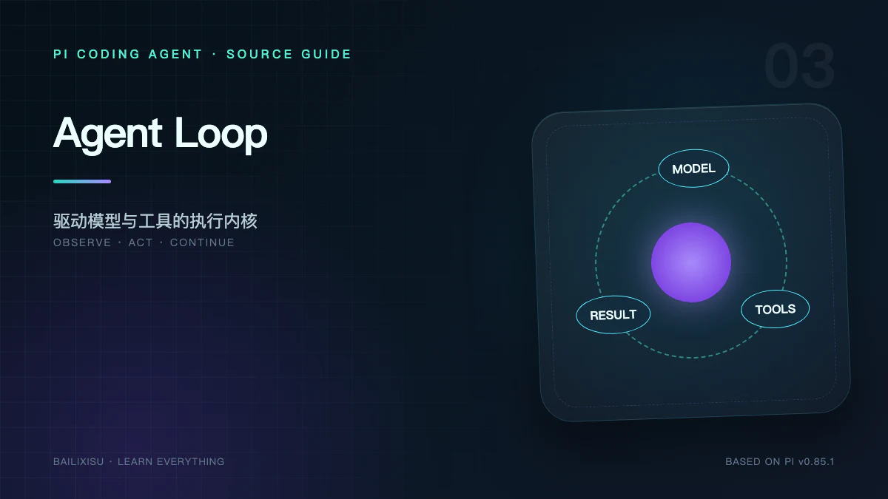

> 本文讨论当前稳定 CLI 使用的 `Agent + agent-loop.ts`，不是 experimental `AgentHarness`。



Agent Loop 经常被简化成：

```text
while (模型要调用工具) {
  调模型
  执行工具
}
```

这能表达大方向，却遗漏了真正决定运行质量的细节：消息何时进入状态、一个 turn 何时结束、并行工具如何排序、用户如何在运行中改变方向、事件监听器是否被等待、错误消息怎样留给上层恢复。

Pi 把这些细节集中在 `packages/agent`：

```text
Agent            有状态、对外 API、队列与订阅
agent-loop.ts    无 UI 的模型—工具执行算法
pi-ai            统一模型消息与流事件
```

## 一、核心数据模型

### `AgentContext`

一次 run 使用的上下文快照只有三部分：

```ts
interface AgentContext {
  systemPrompt: string;
  messages: AgentMessage[];
  tools?: AgentTool[];
}
```

它没有 Session 文件路径、主题或 TUI。Agent Core 不知道自己是否运行在终端。

### `AgentState`

`Agent` 还维护运行态：

- 当前 System Prompt；
- 当前 Model；
- thinking level；
- Tools；
- Messages；
- 是否流式运行；
- 当前 partial assistant message；
- 正在执行的 Tool Call ID；
- 最近错误。

这就是 Pi 的即时工作记忆。`SessionManager` 是外层持久化投影，不属于 Agent Core。

### `AgentMessage`

它比 Provider Message 更宽：除了用户、助手和工具结果，还可以包含 Coding Agent 定义的 Bash Execution、Compaction Summary、Branch Summary 和 Custom Message。

因此每次调用模型前都需要 `convertToLlm()`，而不能直接把 Session JSONL 发给 Provider。

## 二、`prompt()` 与 `continue()` 的区别

### `Agent.prompt()`

用于开始包含新用户消息的 run：

1. 拒绝与当前 run 并发开始；
2. 创建 AbortController；
3. 标记 streaming；
4. 复制当前 Context；
5. 调用 `runAgentLoop()`；
6. 消费事件流并更新 Agent State；
7. 等待订阅者；
8. 清理运行态。

### `Agent.continue()`

不创建新用户消息，而是在现有消息末尾继续。

它用于：

- transient error 后重试；
- context overflow 压缩后续跑；
- Extension 或 `agent_end` 新增队列消息；
- 恢复一个以 Tool Result 或可继续 Assistant Message 结束的上下文。

低层对应 `runAgentLoopContinue()`。

### 为什么需要两个入口

如果 Retry 伪造一条“请继续”的用户消息，它会污染对话语义。`continue()` 允许上层恢复同一个任务，不改变用户历史。

## 三、Loop 中有两层循环

理解 `runLoop()` 的关键，是区分 inner turn continuation 与 outer follow-up continuation。

```text
外层：仍有 follow-up 吗？
  └─ 内层：模型是否调用工具，或收到 steering？
       ├─ 调模型
       ├─ 执行整个 Tool Batch
       ├─ 追加 Tool Results
       └─ 决定是否进入下一次模型调用
```

### 内层循环

以下任一条件成立，就继续当前任务：

- Assistant Message 含 Tool Call；
- Tool Result 已加入 Context；
- 当前 turn 后有 Steering Message；
- 上层没有请求停止。

### 外层循环

当 Agent 本来已经结束，如果 Follow-up 队列非空，则提取下一批消息，开始一个新的 run continuation。

Steering 与 Follow-up 的语义不同：

| 队列      | 注入时机                                          | 典型用途               |
| --------- | ------------------------------------------------- | ---------------------- |
| Steering  | 当前 Assistant 的工具批次完成后、下一次模型调用前 | “别改这个文件，换方案” |
| Follow-up | 当前 Agent 已无 Tool Call 和 Steering、准备结束时 | “做完后再总结测试结果” |

## 四、一个 turn 到底是什么

Pi 的定义是：

> 一次 Assistant Response，加上它触发的全部 Tool Results。

事件顺序通常是：

```text
turn_start
  message_start(assistant)
  message_update*
  message_end(assistant)
  tool_execution_start*
  tool_execution_update*
  tool_execution_end*
  message_start(toolResult)*
  message_end(toolResult)*
turn_end
```

如果 Assistant 没有 Tool Call，`toolResults` 为空，turn 仍然成立。

这个定义让 UI、日志和 Extension 可以按完整因果单元处理，而不是把模型输出和工具输出拆成互不相关的消息。

## 五、调用模型前的上下文转换

`streamAssistantResponse()` 不直接使用原始 `AgentContext.messages`：

```text
原始 AgentMessage[]
  → transformContext(messages, signal)
  → convertToLlm(messages)
  → pi-ai Context
  → streamFunction(model, context, options)
```

### `transformContext`

给应用层一个请求前变换点。Coding Agent 在这里接入 Extension 的 `context` Hook。

它可以做过滤、插入或重排，但必须维护 Provider 要求的消息合法性，例如 Tool Call 与 Tool Result 配对。

### `convertToLlm`

处理不同消息域之间的边界：

- Bash Execution 转为用户可读文本；
- Compaction Summary 转为摘要消息；
- Branch Summary 转为分支摘要；
- Custom Message 根据定义转换；
- 不应进入模型的 Session 元数据被排除。

### 运行快照

一次 run 开始时复制 System Prompt、Messages 和 Tools 的顶层数组。运行中修改 Agent 配置，不应让正在执行的 Provider 请求突然看到半套新配置。

## 六、流式 Assistant Message 如何形成

Provider 返回的是 `AssistantMessageEventStream`，不是一次性字符串。

典型事件：

```text
start
thinking_start / thinking_delta* / thinking_end
text_start / text_delta* / text_end
toolcall_start / toolcall_delta* / toolcall_end
done | error
```

Agent Loop 将这些事件转发成 `message_update`，同时维护 partial Assistant Message。

### 为什么 `contentIndex` 很重要

一个 Assistant Message 可以交错包含：

```text
ThinkingBlock
TextBlock
ToolCallBlock
TextBlock
ToolCallBlock
```

只靠字符串拼接无法知道 delta 属于哪个块。`contentIndex` 让 TUI 和 JSON 客户端精确更新相应位置。

### 权威结果

流式 partial 只是展示状态，最终 `message_end.message` 才是权威消息。客户端应以它纠正本地累计结果。

## 七、模型返回 Tool Call 后发生什么

Agent Loop 收集 Assistant Message 中全部 Tool Call，形成一个 batch。

```text
AssistantMessage.content
  → filter(type === "toolCall")
  → executeToolCalls()
  → ToolResultMessage[]
  → append to currentContext.messages
```

执行器保证：

- 未知 Tool 也生成对应错误结果；
- 参数错误也生成结果；
- 每个 Tool Call 最终都有 Tool Result；
- 结果按原 Tool Call 顺序回灌；
- `AbortSignal` 贯穿准备、Hook 和执行。

这些约束避免 Provider 下一轮收到悬空 Tool Call。

## 八、并行工具的确定性

默认模式是 `parallel`。多个只读工具并发可以显著降低延迟。

但如果 batch 中任意工具声明：

```ts
executionMode: "sequential";
```

整个 batch 切换为串行。

为什么不是“只串行那个工具”？因为它可能与其他调用共享文件系统副作用。统一串行更容易保持可推断顺序。

并行完成顺序可能是 `B、A、C`，回灌顺序仍是 `A、B、C`。并发改善速度，source order 保持上下文确定性。

## 九、Steering 怎样改变正在运行的 Agent

用户按 Enter 发送 Steering 时，Pi 不会在 Provider 正在输出半个 Tool Call JSON 时强行插入消息。

安全边界是：

```text
当前 Assistant 完成
  → 当前 Tool Batch 完成
  → 提取 Steering Queue
  → 作为用户消息加入 Context
  → 下一次模型调用
```

这既允许中途转向，又保持 Tool Call / Tool Result 协议完整。

`steeringMode` 控制一次取一条还是全部取出：

- `one-at-a-time`：每个 turn 一条；
- `all`：一次合并当前全部 Steering。

## 十、事件监听器为什么会影响“是否空闲”

`Agent.subscribe()` 的监听器按顺序等待。`agent_end` 发出后，如果异步监听器还没完成，`Agent.isStreaming` 仍保持 true。

这是一个重要语义：

> “模型不再输出”不等于“这一轮已经稳定完成”。

Coding Agent 依赖这个特性，在事件处理中完成 Extension 通知和 Session 持久化后，才对外宣布稳定状态。

## 十一、`agent_end` 与 `agent_settled`

`agent_end` 属于低层 Agent Core。它表示一次 `runAgentLoop` 完成。

但外层 `AgentSession` 可能随后：

- 自动 Retry；
- 因 overflow 执行 Compaction 再 Retry；
- 处理新的 Follow-up；
- 执行 Extension 追加的 continuation。

所以产品或 RPC 客户端如果要判断“不会自动继续”，应监听：

```text
agent_settled
```

而不是只监听 `agent_end`。

## 十二、错误不是一律 throw

Provider 请求失败通常被归一化成一个 Assistant Message：

```ts
{
  role: "assistant",
  stopReason: "error",
  errorMessage: "..."
}
```

这样错误可以：

- 显示在 TUI；
- 写入事件流；
- 由 `AgentSession` 判断是否 Retry；
- 由 Extension 的 `message_end` 规范化；
- 在 Session 中留下可解释记录。

真正的编程错误或状态不变量破坏仍可 throw。区分“模型请求失败”和“运行时自身坏掉”有助于恢复。

## 十三、停止条件

当前低层 run 在以下情况下停止：

1. Assistant 不再请求工具；
2. 没有 Steering；
3. 没有 Follow-up；
4. Assistant 为 error 或 aborted；
5. `shouldStopAfterTurn` 返回 true；
6. 整个 Tool Batch 的最终结果都请求 terminate。

最后一条故意要求“全部结果都 terminate”，防止并行 batch 中单个工具意外截断其他必要结果。

## 十四、最小心智模型

可以把 Agent Loop 看成一个事件驱动状态机：

```text
IDLE
  → ACCEPT INPUT
  → STREAM ASSISTANT
  → [NO TOOLS] CHECK QUEUES
  → [HAS TOOLS] EXECUTE BATCH
  → APPEND RESULTS
  → CHECK STEERING
  → STREAM ASSISTANT
  → CHECK FOLLOW-UP
  → END
```

而 `AgentSession` 是它外面的 Supervisor：负责身份认证、持久化、Retry、Compaction 和扩展。

## 十五、源码阅读实验

写一个最小 `pi-agent-core` 程序时，先使用假的 `streamFn`：

1. 第一次返回一个 `read` Tool Call；
2. Tool 返回固定文本；
3. 第二次返回最终答案；
4. 记录全部 AgentEvent。

预期验证：

- 两个 `turn_start`；
- 一个 Tool Execution 生命周期；
- Tool Result 位于第二次 Provider 调用的 Context；
- 最后只有一个 `agent_end`。

这比直接连接收费模型更适合调试循环语义。

## 十六、小结

Pi 的 Agent Loop 并不负责“聪明”，它负责让不稳定、流式、可能出错的模型输出遵守一套确定协议：

```text
每个消息有生命周期
每个 Tool Call 有结果
每个 turn 有边界
并发结果保持原顺序
用户只能在安全边界插入 Steering
上层可以观察并恢复
```

下一篇沿着 Tool Call 继续下钻：Tool Schema、参数兼容、扩展拦截、文件写入队列、输出截断和错误回灌具体怎样实现。

## 源码索引

- [`packages/agent/src/agent.ts`](https://github.com/earendil-works/pi/blob/v0.85.1/packages/agent/src/agent.ts)
- [`packages/agent/src/agent-loop.ts`](https://github.com/earendil-works/pi/blob/v0.85.1/packages/agent/src/agent-loop.ts)
- [`packages/agent/src/types.ts`](https://github.com/earendil-works/pi/blob/v0.85.1/packages/agent/src/types.ts)
- [`packages/coding-agent/src/core/agent-session.ts`](https://github.com/earendil-works/pi/blob/v0.85.1/packages/coding-agent/src/core/agent-session.ts)
- [JSON / Event 文档](https://github.com/earendil-works/pi/blob/v0.85.1/packages/coding-agent/docs/json.md)
