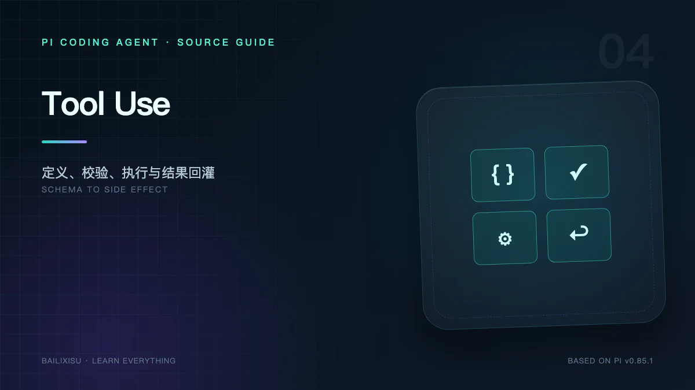

模型不会直接读取文件或执行 Shell。它只生成一段结构化意图：

```json
{
  "id": "call_123",
  "name": "read",
  "arguments": { "path": "package.json" }
}
```

真正把意图变成副作用的是 Pi。这个边界必须同时解决五件事：

1. 告诉模型有哪些动作；
2. 验证模型生成的参数；
3. 在正确目录和权限下执行；
4. 把大输出压缩为可消费结果；
5. 无论成功失败，都形成协议完整的 Tool Result。

## 一、`AgentTool` 的完整契约

工具不是一个普通函数。核心接口可以概括为：

```ts
interface AgentTool<TParameters, TDetails> {
  name: string;
  label: string;
  description: string;
  parameters: TParameters;
  prepareArguments?: (args: unknown) => Static<TParameters>;
  execute(
    toolCallId: string,
    params: Static<TParameters>,
    signal?: AbortSignal,
    onUpdate?: (partial: AgentToolResult<TDetails>) => void
  ): Promise<AgentToolResult<TDetails>>;
  replay?: "never" | "safe";
  executionMode?: "parallel" | "sequential";
}
```

其中三部分面向不同消费者：

| 字段                                | 消费者          | 作用                 |
| ----------------------------------- | --------------- | -------------------- |
| `name`、`description`、`parameters` | 模型与 Provider | 决定模型如何发起调用 |
| `label`、`details`、流式 update     | UI 与 Extension | 决定怎样展示和追踪   |
| `execute`、`signal`、执行模式       | Runtime         | 决定真实副作用       |

`content` 会进入模型上下文；`details` 通常只给 UI、日志或扩展。不要把巨大 AST 同时塞进 `content`。

## 二、Pi 的内置工具

标准默认集合是：

```text
read · bash · edit · write
```

可选内置工具还有：

```text
grep · find · ls · powershell
```

### `read`

读取文本或图片，支持 offset/limit。文本默认保留头部，因为阅读源码通常从定义和 import 开始。

### `bash`

执行命令并流式更新，最终结果偏向保留尾部，因为错误、退出状态和测试摘要通常出现在末尾。

### `edit`

做精确字符串替换。要求 `oldText` 唯一匹配，避免模型在模糊位置静默改错。

### `write`

创建或整体覆盖文件。适合新文件，不适合小范围修改。

### `grep`、`find`、`ls`

把常见探索动作做成结构化工具，在没有合适 Shell 或希望限制命令能力时很有价值。

## 三、工具列表有三个版本

阅读 Tool Use 时容易把三个集合混为一谈：

1. **Registry**：Pi 当前知道的全部内置、Extension 和 SDK 工具；
2. **Enabled Tools**：经过 Settings 与 CLI allowlist 后真正启用的工具；
3. **Provider Tool Schema**：本次模型请求中序列化后的函数定义。

`--tools` 是严格 allowlist，`--no-tools` 关闭全部工具，`--no-builtin-tools` 只关闭内置工具，`--exclude-tools` 再过滤结果。

System Prompt 的可用工具说明也必须使用最终集合，否则 Prompt 与 API Schema 会不一致。

## 四、一次调用的八个阶段

```text
模型生成 ToolCall
  → 按名称查 Registry
  → prepareArguments
  → TypeBox Schema 校验
  → beforeToolCall
  → execute + streaming updates
  → afterToolCall
  → normalize image/result
  → ToolResultMessage
```

### 阶段 1：名称查找

找不到工具时，Pi 不直接中止 Agent，而是生成错误 Tool Result：

```text
Tool "foo" not found
```

模型下一轮可以改用真实工具。

### 阶段 2：`prepareArguments()`

它是 Schema 校验前的兼容层。典型用途是修复某些模型常见的参数外形，或把旧参数名映射到新参数名。

它不应该成为绕过校验的万能入口。

### 阶段 3：TypeBox 校验

`parameters` 同时是 TypeScript 类型来源和运行时 JSON Schema。非法参数不会进入 `execute()`。

这解决的是结构安全，例如：

- 缺少 `path`；
- `offset` 传成对象；
- 使用未声明字段；
- 枚举值非法。

它不解决语义安全。`{"path":"/etc/passwd"}` 可能完全符合 Schema，但不一定符合策略。

### 阶段 4：`beforeToolCall`

Coding Agent 把它桥接到 Extension `tool_call` 事件。Extension 可以：

- 记录审计日志；
- 修改参数；
- 拒绝调用；
- 弹出确认；
- 根据当前模型或路径应用策略。

一个关键源码语义是：多个 handler 按顺序看到前一个 handler 的参数修改，**修改后不会再次执行原始 Schema 校验**。安全 Extension 必须自己验证它产生的新参数。

### 阶段 5：执行

`execute()` 收到共享 AbortSignal。工具应：

- 尽早响应取消；
- 失败时 throw；
- 不把失败伪装成普通成功文本；
- 对长任务使用 `onUpdate`；
- 不在 Promise 完成后继续发送 update。

Agent Loop 会把异常转换成 `isError: true` 的 Tool Result。

### 阶段 6：流式更新

例如 Bash 每获得新输出就可以生成 partial result：

```text
tool_execution_start
  tool_execution_update
  tool_execution_update
  ...
tool_execution_end
```

更新用于 UI，不会每次都追加一条模型消息。最终结果才进入上下文。

### 阶段 7：`afterToolCall`

Extension 可以修改：

- `content`；
- `details`；
- `isError`；
- `usage`；
- `terminate` 等结果属性。

适合脱敏、补充诊断、审计和自定义展示。

### 阶段 8：Tool Result 回灌

最终形成：

```ts
{
  role: ("toolResult",
    toolCallId,
    toolName,
    content,
    details,
    usage,
    isError,
    timestamp);
}
```

`toolCallId` 是因果关联，不可省略。Provider 依靠它把结果对应到具体调用。

## 五、并行策略不是简单的 `Promise.all`

默认 Tool Batch 可以并行执行：

```text
read package.json ─┐
read tsconfig.json ├─ 同时执行
read README.md ────┘
```

但只要 batch 中有一个工具声明 `sequential`，整个 batch 串行。

此外 Pi 还保证：

- 事件包含各自 Tool Call ID；
- 并发完成顺序不影响最终回灌顺序；
- Steering 要等整个 batch 完成才注入；
- Abort 能传播到所有活跃调用。

### 同文件写入队列

即使全局 batch 并行，`edit` 和 `write` 还通过 `withFileMutationQueue()` 对同一真实路径串行化。

```text
写 a.ts ─────┐
再写 a.ts ───┴─ 必须排队
写 b.ts ──────── 可以并行
```

队列使用解析后的路径；文件不存在时使用绝对解析路径作为 key。这避免两个并发修改读取同一旧版本后互相覆盖。

## 六、输出截断是上下文工程，不只是 UI 工程

默认文本工具限制是两条独立边界，先达到哪条就用哪条：

```text
最多 2000 行
最多 50 KiB
```

### Head Truncation

`read` 类工具保留开头，并尽量不返回半行。如果第一行本身超过字节限制，可以返回空内容和明确诊断。

### Tail Truncation

`bash` 类工具保留末尾，因为测试失败和 stack trace 往往在最后。极端超长单行可能只保留尾部片段。

### 完整输出

当工具生成很大输出时，Pi 可以把完整内容保存到临时文件，并在结果中告诉模型路径。模型随后用 `read` 分段读取。

这是一种重要模式：

> Tool Result 给模型“足够判断的摘要 + 可继续读取的句柄”，而不是无限制灌入上下文。

## 七、`content`、`details` 与 `usage`

### `content`

文本和图片块，真正发给模型。

### `details`

任意结构化数据，用于 Renderer、Extension 或日志，不默认进入 LLM。

例如 `edit` 可以把 diff 结构放入 details，模型只看到简洁结果，TUI 则渲染彩色 diff。

### `usage`

工具内部如果又调用了 LLM，可以报告嵌套 usage。它进入 Session 统计，但不应混入主模型当前上下文估算。

## 八、图片结果的特殊处理

Tool Result 可以包含 `ImageContent`。Coding Agent 会依据 Settings：

- 自动缩放过大图片；
- 在终端能力允许时展示；
- 在模型不支持图片时处理兼容；
- `images.blockImages` 开启时阻止发送给模型。

图片的二进制表示不应该被当成普通长文本截断。

## 九、错误回灌为什么优于立即退出

这些错误都可以成为模型可观察结果：

- 工具不存在；
- 参数校验失败；
- 文件未找到；
- Shell 非零退出；
- 精确替换匹配零次或多次；
- Extension 拒绝执行。

模型看到错误后可以：

1. 重新读取文件；
2. 修正参数；
3. 选择另一工具；
4. 向用户解释无法继续。

如果每个工具错误都让 Agent 进程退出，Coding Agent 会非常脆弱。

## 十、Tool Use 的安全边界

### Schema 不是权限系统

Schema 只验证数据形状。

### Project Trust 不是 Tool Approval

Trust 只控制项目资源加载。

### System Prompt 不是强制策略

“不要执行危险命令”是模型指令，不能替代运行时拦截。

### 默认工具没有内置沙箱

`bash`、`write` 和 `edit` 使用当前进程权限。高风险环境应增加：

- 容器或虚拟机；
- 只读工作区；
- 低权限用户；
- `tool_call` allow/deny policy；
- 人工审批；
- 网络与凭据隔离。

## 十一、一个最小自定义工具

```ts
import { Type } from "typebox";

const inspectPackage = {
  name: "inspect_package",
  label: "Inspect package",
  description: "Read selected package metadata",
  parameters: Type.Object({
    field: Type.Union([Type.Literal("name"), Type.Literal("scripts")]),
  }),
  async execute(_id, { field }, signal) {
    if (signal?.aborted) throw new Error("aborted");
    const pkg = JSON.parse(await fs.readFile("package.json", "utf8"));
    return {
      content: [{ type: "text", text: JSON.stringify(pkg[field]) }],
      details: { field },
    };
  },
};
```

设计检查：

- 参数是否足够窄；
- 结果是否有大小上限；
- 是否支持 Abort；
- 是否可能产生副作用；
- 是否需要 sequential；
- 是否需要 Extension 审批；
- 是否把敏感数据放进了 content。

## 十二、小结

Pi 的 Tool Use 可以概括为三层保护：

```text
协议层：每个 Tool Call 都得到结构完整的 Result
执行层：校验、Abort、并行策略、同文件队列、截断
产品层：Extension Hook、UI Renderer、审计与安全策略
```

下一篇讨论这些消息如何被记住：Agent State、JSONL Session Tree、Context Files、Skills 和 Compaction 为什么都是 Memory，却不是同一种 Memory。

## 源码索引

- [`packages/agent/src/types.ts`](https://github.com/earendil-works/pi/blob/v0.85.1/packages/agent/src/types.ts)
- [`packages/agent/src/agent-loop.ts`](https://github.com/earendil-works/pi/blob/v0.85.1/packages/agent/src/agent-loop.ts)
- [`core/tools`](https://github.com/earendil-works/pi/tree/v0.85.1/packages/coding-agent/src/core/tools)
- [`file-mutation-queue.ts`](https://github.com/earendil-works/pi/blob/v0.85.1/packages/coding-agent/src/core/tools/file-mutation-queue.ts)
- [`truncate.ts`](https://github.com/earendil-works/pi/blob/v0.85.1/packages/coding-agent/src/core/tools/truncate.ts)
- [Extensions 文档](https://github.com/earendil-works/pi/blob/v0.85.1/packages/coding-agent/docs/extensions.md)
