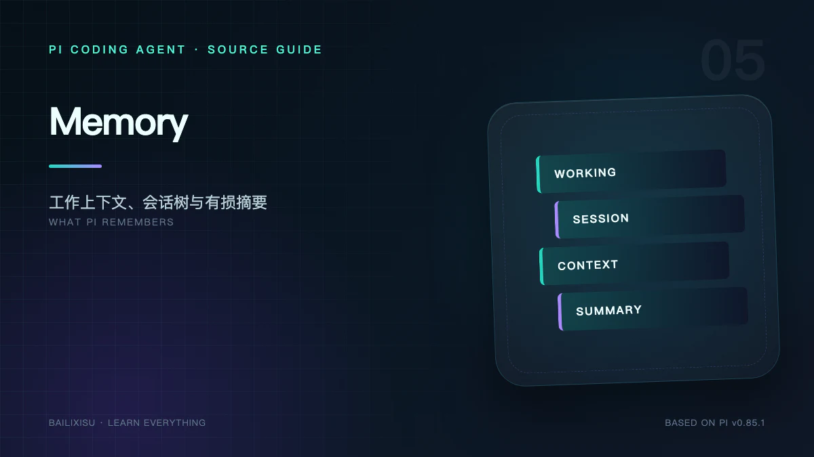

“Pi 有没有 Memory？”这个问题无法用有或没有回答。

Pi 没有一个统一的 `MemoryModule`，也没有内置向量数据库，却同时拥有多种不同生命周期的记忆：当前 Agent Messages、磁盘 Session、项目 Context Files、Skills、Compaction Summary 和 Extension 自定义状态。

把它们混成一个“长期记忆”概念，会误判系统能力。

## 一、六层记忆模型

| 层次       | 载体                          |         是否进 LLM | 生命周期                  |   是否有损 |
| ---------- | ----------------------------- | -----------------: | ------------------------- | ---------: |
| 工作记忆   | `Agent.state.messages`        |                 是 | 当前进程与当前活动分支    |         否 |
| 情节记忆   | JSONL Session entries         | 当前分支投影后进入 | 跨进程                    | 原记录无损 |
| 规则记忆   | `AGENTS.md` / `CLAUDE.md`     |                 是 | 文件存在期间              |         否 |
| 程序性记忆 | Skills / Prompt Templates     |   元数据或按需正文 | 文件存在期间              |         否 |
| 压缩记忆   | Compaction / Branch Summary   |                 是 | 作为 Session Entry 持久化 |         是 |
| 扩展记忆   | Custom Entry / Custom Message |         取决于类型 | 由 Extension 定义         | 取决于实现 |

此外还有一种不应叫记忆的东西：`details`、UI cache、当前 spinner 等进程状态。它们可能帮助展示，但不一定参与下一次模型推理。

## 二、工作记忆：`Agent.state.messages`

每次 Provider 请求看到的历史，首先来自 Agent 当前 Messages。

它的特点是：

- 已经恢复并转换成 AgentMessage；
- 只代表当前活动分支；
- 已应用 Compaction；
- 新的 Assistant 和 Tool Result 在事件处理中持续追加；
- 下次模型调用前还可以被 `transformContext()` 修改。

### 工作记忆不是完整 Session

Session 文件可能包含：

- 被放弃的分支；
- 压缩前的旧消息；
- Label；
- Model Change；
- Thinking Level Change；
- 不进模型的 Custom Entry。

Agent Messages 只是一种面向推理的投影。

## 三、Session v3：Append-only JSONL 树

默认 Session 位于：

```text
~/.pi/agent/sessions/<cwd编码>/<timestamp>_<session-id>.jsonl
```

首行是 Header：

```json
{
  "type": "session",
  "version": 3,
  "id": "...",
  "timestamp": "...",
  "cwd": "/project",
  "parentSession": "..."
}
```

后续每行是一个 Entry。所有 Entry 都有：

```ts
{
  type: string;
  id: string;
  parentId: string | null;
  timestamp: string;
}
```

`id + parentId` 形成树，文件物理顺序保持 append-only。

## 四、Session 中保存哪些 Entry

### `message`

保存 User、Assistant、Tool Result，以及 Coding Agent 可持久化的消息。

### `thinking_level_change`

记录某个节点以后使用的 thinking level。

### `model_change`

记录 Provider 与 Model ID，使恢复分支时能恢复当时模型。

### `compaction`

保存摘要、从哪个 Entry 开始保留原文、压缩前 token 数及可选 usage/details。

### `branch_summary`

当用户离开当前分支时，可把被放弃路径概括为摘要，带到新分支。

### `custom`

Extension 的持久状态，不进入 LLM Context。

### `custom_message`

Extension 注入、需要进入 LLM Context 的内容，可选择是否在 TUI 展示。

### `label` 与 `session_info`

分别保存节点标签和 Session 名称。它们是控制面元数据，不是普通聊天消息。

## 五、为什么用树而不是消息数组

线性数组做分支通常只能：

1. 删除后半段；或
2. 复制整段历史到新文件。

Pi v3 选择：

```text
A ─ B ─ C ─ D
        └─ E ─ F   ← 当前 leaf
```

当用户从 `B` 重新开始，只需把 leaf 移到 `B`，下一条 Entry 的 `parentId = B.id`。旧的 `C、D` 仍在文件中。

优点：

- 历史不被覆盖；
- 分支创建接近 O(1)；
- `/tree` 可以展示所有路径；
- Label 和 Summary 可以引用稳定 Entry ID；
- 调试时能还原“模型当时看到哪条路径”。

## 六、`SessionManager` 如何恢复活动上下文

核心步骤：

```text
读取 JSONL
  → 建立 byId 索引
  → 最后一条 Entry 成为当前 leaf
  → 从 leaf 沿 parentId 回到 root
  → 反转为当前 branch path
  → 应用最新 Compaction
  → 转换 Entry 为 AgentMessage
  → 恢复 Model 与 Thinking Level
```

### `getBranch()`

返回从 root 到指定 Entry 或当前 leaf 的完整 Entry 路径。

### `buildContextEntries()`

在路径上处理最新 Compaction：旧消息不再全部进入活动上下文，摘要和保留尾部取代它们。

### `buildSessionContext()`

最终返回：

```ts
{
  messages: AgentMessage[];
  thinkingLevel: string;
  model: { provider: string; modelId: string } | null;
}
```

这正是装配 Agent 所需的最小恢复结果。

## 七、Append-only 不代表启动时重放 Agent

Pi 读取 JSONL 是为了重建数据结构，不是重新调用模型或工具。

Session Entry 是已结算历史。恢复时：

- 不重复执行 Bash；
- 不重做 Edit；
- 不重新消费旧 Provider Stream；
- 只把选定路径投影为 Context。

这与 experimental AgentHarness 的“恢复未完成 operation”是不同能力。

## 八、何时真正创建 Session 文件

`SessionManager` 有一个减少垃圾 Session 的细节：在出现 Assistant Message 前，不一定立即把只含用户输入的 Session 完整落盘。

一旦已有 Assistant，后续 Entry 采用追加写入。这样用户打开 Pi 后立刻退出，不会产生大量无意义空会话。

需要强调：稳定 CLI v3 的 append 是进程级持久化机制，不承诺数据库事务式的 crash consistency，也不提供未结算副作用恢复。

## 九、规则记忆：Context Files

`AGENTS.md` 和兼容的 `CLAUDE.md` 表达“在这个项目里应该怎么工作”。它们在 System Prompt 中以项目指令形式出现。

适合保存：

- 构建和测试命令；
- 目录约定；
- 代码风格；
- 禁止操作；
- PR 和发布流程。

不适合保存：

- 持续增长的聊天历史；
- 大量原始日志；
- 需要语义检索的全部公司文档；
- 明文 Secret。

Context File 是每次都加载的显式规则，不是自动召回记忆。

## 十、程序性记忆：Skills 与 Prompt Templates

Skill 描述“遇到某类任务时，采用什么方法、工具和约束”。

默认渐进披露流程：

```text
启动：只注入 name + description + path
  → 模型判断任务匹配
  → 使用 read/bash 打开 SKILL.md
  → 按说明读取引用文件并行动
```

这减少了不相关 Skill 对上下文的占用。

Prompt Template 更轻：输入 `/name args` 时直接展开模板文本。它没有完整 Skill 的目录、引用资料和渐进加载语义。

## 十一、压缩记忆：Compaction

当 Context 接近模型窗口时，Pi 选择一段较老历史交给模型总结，并保留较新的消息原文。

Compaction Entry 包含：

```ts
{
  summary: string;
  firstKeptEntryId: string;
  tokensBefore: number;
  usage?: Usage;
  details?: unknown;
}
```

活动上下文变成：

```text
Compaction Summary
  + firstKeptEntryId 起的近期原始消息
  + Compaction 后新增消息
```

### 它是有损的

摘要可能遗漏：

- 精确错误文本；
- 某次尝试的细节；
- 未完成假设；
- 很早出现的文件路径。

所以 Compaction Prompt 会特别要求保留目标、约束、文件变化、测试状态和后续步骤。

### 原始历史没有从 Session 文件删除

Compaction 改变的是“发给模型的上下文投影”，不是擦除旧 Entry。完整历史仍可用于树浏览、导出和调试。

## 十二、Branch Summary 与 Compaction 不同

| 机制           | 触发场景           | 总结对象             | 目的                   |
| -------------- | ------------------ | -------------------- | ---------------------- |
| Compaction     | Context 接近上限   | 当前活动分支较老部分 | 降低 token             |
| Branch Summary | 从旧节点转向新分支 | 即将离开的分支内容   | 把有价值结果带到新路径 |

Branch Summary 是导航语义，Compaction 是容量管理。两者都使用 LLM 摘要，但不能互换。

## 十三、Extension 的两种持久记忆

### Custom Entry

```ts
sessionManager.appendCustomEntry("todo-state", data);
```

用于恢复 Extension 状态，不进入 LLM。

### Custom Message

```ts
sessionManager.appendCustomMessageEntry(
  "policy",
  "Deployment is frozen",
  false,
  details
);
```

用于影响模型 Context。`display: false` 可以不在 TUI 显示，但内容仍会进入模型。

隐藏不等于安全。不要把 Secret 作为隐藏 Custom Message 注入。

## 十四、Pi 没有内置哪些长期记忆

稳定 CLI 默认没有：

- Embedding Pipeline；
- Vector Database；
- 自动语义检索；
- 跨 Session 的用户画像；
- 事实置信度和过期机制；
- 自动从所有历史会话召回相关片段。

可以通过 Extension 和 Tool 增加：

```text
用户问题
  → Extension/Tool 生成 query
  → 外部检索系统召回文档
  → 作为 Custom Message 或 Tool Result 注入
```

但这属于应用层能力，不是 `SessionManager` 本身。

## 十五、Memory 设计检查表

给 Pi 增加记忆前，先回答：

1. 信息应该每次都出现，还是按需检索？
2. 是模型需要，还是 UI/Extension 需要？
3. 作用域是当前 turn、当前 Session、项目还是用户？
4. 是否包含隐私或 Secret？
5. 是否会过期？
6. 是否需要引用来源？
7. Compaction 后必须保留哪些字段？
8. 分支切换时应该继承还是隔离？

不同答案对应不同载体，不能一律写进 System Prompt。

## 十六、观察真实 Session 的实验

创建隔离目录并关闭敏感信息：

```bash
mkdir -p /tmp/pi-memory-demo
cd /tmp/pi-memory-demo
pi --session-dir .sessions
```

完成一次包含 `read` 的对话后：

```bash
head -n 5 .sessions/*.jsonl | jq .
```

然后在 Pi 中使用 `/tree` 从旧消息分支，再观察文件：

- 旧 Entry 仍存在；
- 新 Entry 的 `parentId` 指向旧节点；
- 文件物理末尾是新分支；
- 当前 Context 只沿 leaf 的父链恢复。

不要把真实项目 Session 上传到公共仓库，其中可能包含源码、命令输出和模型思考内容。

## 十七、小结

Pi 的 Memory 不是一个黑盒，而是多个清晰机制：

```text
Agent Messages       当前要思考什么
Session Tree         过去发生过什么
Context Files        项目要求什么
Skills               某类任务怎样做
Compaction            上下文太长时保留什么
Custom Entry/Message 扩展还要保存什么
```

下一篇继续回答“这些记忆怎样进入模型”：System Prompt 如何拼装，Skill 为什么只先暴露元数据，Slash Command 又怎样在输入阶段展开。

## 源码索引

- [`core/session-manager.ts`](https://github.com/earendil-works/pi/blob/v0.85.1/packages/coding-agent/src/core/session-manager.ts)
- [`core/messages.ts`](https://github.com/earendil-works/pi/blob/v0.85.1/packages/coding-agent/src/core/messages.ts)
- [`core/compaction`](https://github.com/earendil-works/pi/tree/v0.85.1/packages/coding-agent/src/core/compaction)
- [Session Format](https://github.com/earendil-works/pi/blob/v0.85.1/packages/coding-agent/docs/session-format.md)
- [Compaction](https://github.com/earendil-works/pi/blob/v0.85.1/packages/coding-agent/docs/compaction.md)
- [Skills](https://github.com/earendil-works/pi/blob/v0.85.1/packages/coding-agent/docs/skills.md)
