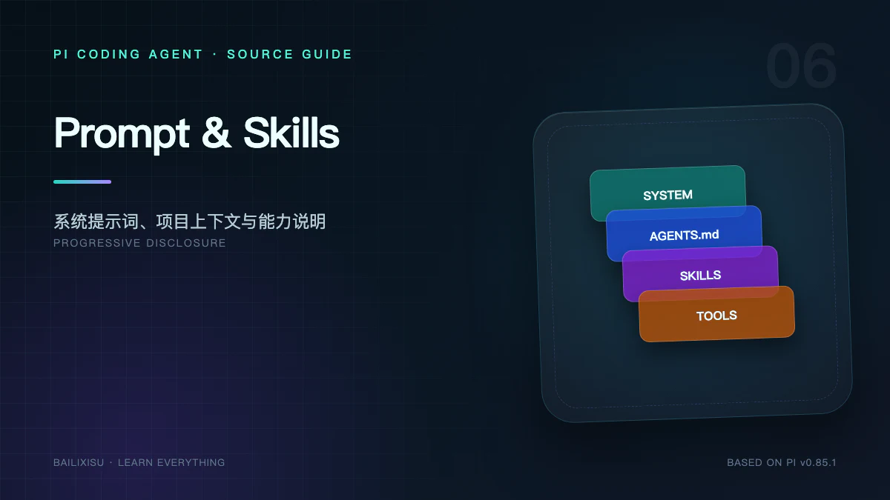

Pi 的上下文不是一个巨大的 Prompt 文件，而是多个来源在不同时间汇合的结果。

最容易混淆的四个概念是：

- System Prompt：每次 Provider 请求携带的全局指令；
- Context Files：项目规则，最终成为 System Prompt 的一部分；
- Skill：可发现、按需读取的程序性知识；
- Prompt Template：用户输入阶段的文本宏。

## 一、最终请求包含什么

模型每次看到的请求可以抽象为：

```text
System Prompt
  + Provider 可用 Tool Schemas
  + 当前活动 Messages
  + 本轮模型与 thinking 参数
```

其中 System Prompt 自身又由多段拼成：

```text
默认 Pi 角色与 Guidelines
  + 实际启用的工具说明
  + APPEND_SYSTEM / SDK append prompt
  + Context Files
  + Skills 元数据
  + Current working directory
```

如果配置了 Custom System Prompt，它替换默认角色主体，但项目 Context、Skills 和 cwd 仍可继续附加。

## 二、默认 System Prompt 是代码生成的

`buildSystemPrompt()` 接收：

```ts
{
  (customPrompt,
    selectedTools,
    toolSnippets,
    promptGuidelines,
    appendSystemPrompt,
    cwd,
    contextFiles,
    skills);
}
```

它根据真实工具集合动态生成说明。例如只有 Bash、没有结构化 `grep/find/ls` 时，才加入“Use bash for file operations”一类 guideline。

这避免 Prompt 告诉模型使用一个实际未注册的工具。

## 三、Tools 有两种存在方式

Tool 同时出现在：

1. System Prompt 的人类可读列表；
2. Provider 请求的结构化 Tool Schema。

前者帮助模型理解选择策略，后者约束可调用函数和参数。

只修改 Prompt 不会创造工具；只注册 Schema 而不写清 description，则模型很难稳定选择。

## 四、Context Files 怎样注入

ResourceLoader 预加载 `AGENTS.md` / `CLAUDE.md` 后，System Prompt 使用带路径的标签包装：

```xml
<project_context>
  <project_instructions path="/repo/AGENTS.md">
    ...
  </project_instructions>
</project_context>
```

路径信息很重要：同名规则来自仓库根目录还是子目录，会影响模型解释作用域。

### 写 Context File 的原则

应该写：

- 必须执行的测试；
- 目录和 API 约束；
- 安全红线；
- 项目特有命令；
- 可验证的完成标准。

避免写：

- 空泛人格描述；
- 大段容易过期的架构介绍；
- 每次都不相关的教程；
- Secret；
- 与代码事实冲突的说明。

Context File 每轮都占 token，应把“偶尔需要的长说明”移入 Skill 引用资料。

## 五、Skill 是渐进披露的程序性知识

一个 Skill 目录至少包含：

```text
my-skill/
  SKILL.md
  scripts/
  references/
  assets/
```

`SKILL.md` 的 frontmatter 提供 `name` 和 `description`。启动时 Pi 通常只把元数据及文件路径放进 System Prompt，而不是注入全文。

```text
任务到来
  → 模型阅读 Skill 列表
  → description 与任务匹配
  → 使用 read/bash 打开 SKILL.md
  → 按 SKILL.md 再读取 references 或运行 scripts
```

这是一种多级上下文预算：

| 层级 | 注入内容                      | 成本 |
| ---- | ----------------------------- | ---: |
| 发现 | name + description + path     |   低 |
| 激活 | 完整 SKILL.md                 |   中 |
| 深入 | references / scripts / assets | 按需 |

## 六、为什么 Skill 需要 `read` 或 `bash`

`buildSystemPrompt()` 只有在当前工具集合包含 `read` 或 `bash` 时，才附加可按需读取的 Skill 列表。

原因很直接：如果模型无法打开 Skill 文件，只告诉它路径没有意义。

当 `--no-tools` 关闭读取能力时，不应假设模型仍能自动获得所有 Skill 正文。

## 七、显式 `/skill:name` 与自动选择不同

### 自动选择

模型先看到元数据，自己判断是否读取文件。

### 显式命令

用户输入：

```text
/skill:blog-workflow 为 Tool Use 写草稿
```

`AgentSession` 在输入阶段读取对应 `SKILL.md`，将正文和用户参数包装进本轮消息。它绕过模型“是否应该加载”的判断，但仍不是直接执行脚本。

`enableSkillCommands: false` 可以关闭命令注册，不影响模型按路径读取已发现的 Skill。

## 八、Prompt Template 是输入宏

Prompt Template 是 Markdown 文件。文件名通常成为 Slash Command，frontmatter 可提供 description。

用户输入：

```text
/review src/core/agent.ts
```

在进入 Agent Loop 前展开成模板正文和参数。

适合：

- 固定审查清单；
- 常用提问框架；
- 简短工作说明；
- 团队统一输出格式。

不适合：

- 需要多个脚本和资料的复杂能力；
- 需要运行时状态或 UI 的操作；
- 需要拦截 Tool Call 的策略。

## 九、Extension Command 是程序入口

同样以 `/name` 开头，Extension Command 却是 TypeScript handler：

```ts
pi.registerCommand("deploy", {
  description: "Run controlled deployment",
  handler: async (args, ctx) => {
    /* ... */
  },
});
```

它可以：

- 完全不调用模型；
- 打开 TUI；
- 修改 Session；
- 发送 Custom Message；
- 自己调用 LLM；
- 注册或切换工具。

因此 Slash Command 只是用户界面命名空间，背后可能是三种不同机制。

## 十、输入展开顺序

普通 Prompt 的关键顺序是：

```text
识别 Extension Command
  → Extension input event
  → 展开 /skill:name
  → 展开 Prompt Template
  → 根据 streaming 状态直接发送或入队
  → before_agent_start
  → Agent.prompt()
```

Extension Command 优先识别，避免其参数被同名模板抢先展开。

`input` Hook 可以返回：

- continue：继续并可改写文本；
- handled：Extension 已处理，不进入 Agent；
- block：拒绝输入。

## 十一、`before_agent_start` 的特殊位置

它发生在输入已解析、模型调用尚未开始时，可以：

- 注入额外消息；
- 临时追加 System Prompt；
- 基于当前任务提供动态上下文。

与 Context Hook 的区别：

| Hook                  | 时机                  | 适合用途          |
| --------------------- | --------------------- | ----------------- |
| `before_agent_start`  | 一次高层 Agent run 前 | 任务级规则和消息  |
| `context` / transform | 每次 Provider 请求前  | turn 级过滤和转换 |

如果一个 run 内有多次 Tool Loop，Context Hook 会运行多次。

## 十二、Prompt 重建与 `/reload`

以下变化会使 System Prompt 需要重建：

- 工具启用状态变化；
- Extension 注册或注销 Tool；
- Context File 变化；
- Skills 列表变化；
- Custom/Append System Prompt 变化；
- cwd 或 Session 切换。

`AgentSession` 是重建中心，因为它同时知道 Agent、ResourceLoader 和 Extension Registry。

## 十三、上下文冲突怎样处理

模型可能同时看到：

```text
默认 Pi guideline
全局 AGENTS.md
仓库 AGENTS.md
子目录 AGENTS.md
Skill 正文
用户 Prompt
Tool Result
```

Pi 提供来源和顺序，但不能数学保证自然语言冲突一定按期望解决。

实践中应：

1. 减少重复；
2. 在窄作用域规则中显式说明覆盖关系；
3. 重要限制放到运行时 Hook，而不只写 Prompt；
4. 用测试验证，不依赖模型声称“已遵守”。

## 十四、Context Engineering 检查表

| 内容               | 推荐载体                 |
| ------------------ | ------------------------ |
| 永久角色与工具原则 | System Prompt            |
| 项目稳定规则       | AGENTS.md                |
| 复杂任务方法       | Skill                    |
| 常用短指令         | Prompt Template          |
| 动态任务信息       | before_agent_start       |
| 每轮过滤           | context Hook             |
| 强制禁止操作       | tool_call Hook / Sandbox |
| 工具执行事实       | Tool Result              |

## 十五、最小实验

创建：

```text
.pi/prompts/review.md
.pi/skills/demo/SKILL.md
AGENTS.md
```

让三者分别包含唯一标记，再通过 Extension 在 `before_agent_start` 输出 System Prompt 中出现的标记。

预期：

- `AGENTS.md` 标记常驻 System Prompt；
- Skill description 常驻，正文只在显式命令或按需读取后进入消息；
- Prompt Template 只在 `/review` 输入时展开到 User Message。

## 十六、小结

Pi 把知识放在不同注入时机：

```text
永远需要的规则 → System Prompt / Context Files
可能需要的方法 → Skill 元数据，按需读正文
本次输入的宏 → Prompt Template
动态运行信息 → Extension Hook
强制执行边界 → Tool Hook / 系统隔离
```

下一篇研究最下层的模型适配：同一个 Agent Loop 为什么能在 Anthropic、OpenAI、Google、Bedrock 与本地 OpenAI-compatible 模型之间切换。

## 源码索引

- [`core/system-prompt.ts`](https://github.com/earendil-works/pi/blob/v0.85.1/packages/coding-agent/src/core/system-prompt.ts)
- [`core/skills.ts`](https://github.com/earendil-works/pi/blob/v0.85.1/packages/coding-agent/src/core/skills.ts)
- [`core/prompt-templates.ts`](https://github.com/earendil-works/pi/blob/v0.85.1/packages/coding-agent/src/core/prompt-templates.ts)
- [`core/resource-loader.ts`](https://github.com/earendil-works/pi/blob/v0.85.1/packages/coding-agent/src/core/resource-loader.ts)
- [Skills 文档](https://github.com/earendil-works/pi/blob/v0.85.1/packages/coding-agent/docs/skills.md)
- [Prompt Templates 文档](https://github.com/earendil-works/pi/blob/v0.85.1/packages/coding-agent/docs/prompt-templates.md)
