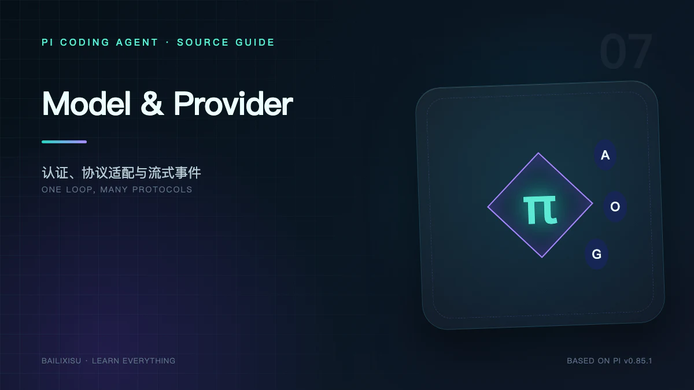

Pi 的 Agent Loop 只调用一个统一入口：

```ts
streamSimple(model, context, options);
```

但下方可能是 Anthropic Messages、OpenAI Responses、Chat Completions、Google Generative AI、Vertex、Bedrock 或自定义协议。统一并不意味着抹平差异，而是把差异隔离在正确层次。

## 一、四个核心对象

| 对象                      | 回答的问题                                     |
| ------------------------- | ---------------------------------------------- |
| `Model`                   | 这个模型叫什么、能接收什么、窗口和价格是多少？ |
| `Provider`                | 模型从哪里来、怎样认证、怎样发送请求？         |
| `Models` / `ModelRuntime` | 当前有哪些 Provider 和模型可用？               |
| API Adapter               | 统一 Context 怎样翻译成具体协议？              |

Coding Agent 的 `ModelRuntime` 在 `pi-ai Models` 之上增加配置文件、缓存、Extension override 和运行期诊断。

## 二、Model 不只是 ID

一个模型条目至少表达：

```ts
{
  (id,
    name,
    provider,
    api,
    baseUrl,
    reasoning,
    thinkingLevelMap,
    input,
    contextWindow,
    maxTokens,
    cost,
    compat);
}
```

AgentSession 依赖这些字段完成：

- 图片能力判断；
- thinking level 限制；
- Compaction 阈值；
- Token/Cost 统计；
- API 路由；
- Provider 兼容参数。

只保存字符串 `gpt-x` 无法支撑这些行为。

## 三、模型目录从哪里来

最终目录由多层组成：

```text
pi-ai 内置 Provider 与生成的模型元数据
  + 可刷新远程目录及 models-store.json 缓存
  + ~/.pi/agent/models.json
  + Extension registerProvider()
  + modelOverrides
```

`models-store.json` 为可刷新的 Provider 保存离线目录；它与保存用户自定义模型的 `models.json` 不同。

打开 `/model` 时，Pi 还会重新读取 `models.json`，允许会话中修改配置后立即查看。

## 四、模型解析为什么会失败

用户可能只写：

```bash
pi --model claude-sonnet
```

Resolver 需要处理：

- 模糊 pattern；
- `provider/modelId`；
- 同 ID 出现在多个 Provider；
- 模型存在但未认证；
- 恢复 Session 的旧模型已被删除；
- 默认模型与 CLI 冲突。

如果同一个裸 model ID 在多个 Provider 中匹配，Pi 优先考虑唯一已认证匹配；仍然歧义则要求显式 `--provider`。

“模型不存在”和“模型存在但无凭据”是不同错误，不应合并成一个 Not Found。

## 五、认证解析链

内置 Provider 的凭据优先级：

```text
CLI --api-key
  > auth.json
  > 环境变量
  > models.json provider apiKey
```

`auth.json` 位于：

```text
~/.pi/agent/auth.json
```

文件按 `0600` 创建。凭据可以是：

- API Key；
- OAuth access/refresh token；
- 引用环境变量；
- `!command` 动态读取密码管理器。

### API Key 与 OAuth

API Key Resolver 返回请求所需 key、headers、baseUrl 等。

OAuth Provider 还负责：

- 登录交互；
- token 刷新；
- access token 转换；
- 将更新后的凭据写回 Credential Store。

Agent Loop 不需要知道 token 是否刚刚刷新。

## 六、`ModelRuntime.prepare()` 的边界

发送请求前，Runtime 大致完成：

```text
根据 model.provider 找 Provider
  → 解析当前 Credential
  → 合并 Provider / Model / 请求 headers
  → 应用 baseUrl override
  → 组装 Provider-specific options
  → 调用 provider.streamSimple()
```

这一步应每次请求执行，因为 OAuth 可能过期，动态命令 key 也可能变化。

## 七、统一 Context

`pi-ai` 面向 Provider 的 Context 主要包含：

```ts
{
  systemPrompt: string;
  messages: Message[];
  tools?: Tool[];
}
```

Message 使用统一角色和内容块：

- User Message；
- Assistant Message；
- Tool Result Message；
- Text、Image、Thinking、Tool Call block。

API Adapter 再把它转换成各 Provider 的角色、字段名、Tool Schema 和缓存标记。

## 八、跨 Provider 历史不是原样转发

一次 Session 可能先用 Anthropic，再切换 OpenAI。旧 Assistant Message 仍带原 Provider 的 thinking block、signature 和 Tool Call 细节。

Adapter 必须处理：

- 不支持的 thinking block；
- Tool Result 角色差异；
- assistant/tool 顺序约束；
- 图片格式；
- Provider 特有签名；
- system 与 developer role；
- 空消息和中断 Tool Call。

因此 Pi 保存的是统一消息加必要 Provider 元数据，而不是某家 API 的原始 JSON。

## 九、Thinking Level 是语义层，不是固定 token 数

Pi 暴露：

```text
off · minimal · low · medium · high · xhigh · max
```

模型通过 `thinkingLevelMap` 声明支持情况和 Provider 值。`null` 表示不支持，缺省时扩展级别 `xhigh/max` 不自动出现。

不同协议可能映射为：

- Anthropic thinking budget 或 adaptive effort；
- OpenAI `reasoning_effort`；
- OpenRouter `reasoning: { effort }`；
- Qwen `enable_thinking`；
- 本地服务器的 thinking token budget。

同一个 `high` 是用户意图层级，不保证不同模型使用相同 token。

## 十、统一流事件

每个 Provider 最终必须输出：

```text
start
text_start / delta / end
thinking_start / delta / end
toolcall_start / delta / end
done | error
```

Provider Adapter 负责：

- 解析 SSE/WebSocket；
- 累积 Tool Call JSON；
- 更新 partial Assistant Message；
- 设置最终 stopReason；
- 读取 usage；
- 计算 cost；
- 把异常归一化。

如果流结束时仍是 `pending`，这是 Provider 实现错误，不能假装成功。

## 十一、Usage 与 Cost

统一 Usage 包含：

```text
input · output · cacheRead · cacheWrite · totalTokens · cost
```

Cost 使用 Model 元数据中的每百万 token 价格计算，还可支持长上下文价格 tier。

注意：

- 某些 Provider 只在流结束时报告 usage；
- Tool 内部 LLM usage 通过 Tool Result 单独累计；
- Compaction 与 Branch Summary 也可能产生 usage；
- Context 估算与 Provider 最终计费值不一定完全相同。

## 十二、Transport 与 Retry 分层

Settings 可以选择 `sse`、`websocket`、`websocket-cached` 或 `auto`。

Retry 也分两层：

| 层             | 处理者            | 用途                            |
| -------------- | ----------------- | ------------------------------- |
| Provider Retry | SDK / API Adapter | 网络请求级重试                  |
| Agent Retry    | AgentSession      | 看到完整错误消息后重新 continue |

官方默认建议 Provider `maxRetries: 0`，让 AgentSession 处理 transient error，避免底层 SDK 在额度耗尽时长时间静默等待。

## 十三、自定义 OpenAI-compatible 模型

`~/.pi/agent/models.json` 的最小例子：

```json
{
  "providers": {
    "ollama": {
      "baseUrl": "http://localhost:11434/v1",
      "api": "openai-completions",
      "apiKey": "ollama",
      "compat": {
        "supportsDeveloperRole": false,
        "supportsReasoningEffort": false
      },
      "models": [{ "id": "qwen2.5-coder:7b" }]
    }
  }
}
```

本地服务器不需要 key 时仍常配置占位值，因为 Pi 用“是否有认证配置”判断模型是否可选。

## 十四、什么时候必须写 Custom Provider Extension

`models.json` 适合已经兼容以下协议的服务：

- OpenAI Completions；
- OpenAI Responses；
- Anthropic Messages；
- Google Generative AI。

如果需要自定义：

- 非标准流协议；
- 企业 OAuth/SSO；
- 动态模型发现；
- 特殊请求签名；
- Provider 级 UI；

应通过 `pi.registerProvider()` 提供完整 Provider 或自定义 `streamSimple`。

## 十五、Context Overflow 的协作恢复

Provider 把窗口溢出归一化成可识别 `errorMessage`，AgentSession 才能：

```text
识别 overflow
  → 从 live context 移除失败消息
  → 执行 Compaction
  → Agent.continue() 重试一次
```

自定义 Provider 若使用特殊错误文本，可以通过 `message_end` Extension 将其规范化为 `context_length_exceeded`，但必须严格限定 Provider，不能把 rate limit 误判成 overflow。

## 十六、小结

Pi 的模型层不是一张静态模型表，而是一套运行时：

```text
Catalog 说明“有什么”
Resolver 决定“选哪个”
Auth 决定“是否能用”
Provider 决定“怎样调用”
Adapter 决定“怎样翻译”
Stream Event 决定“上层怎样统一消费”
```

下一篇进入 Pi 最强的可编程边界：Extensions 如何监听事件、拦截输入和工具、注册命令、替换 UI，甚至加入新的 Provider。

## 源码索引

- [`packages/ai/src/models.ts`](https://github.com/earendil-works/pi/blob/v0.85.1/packages/ai/src/models.ts)
- [`packages/ai/src/api`](https://github.com/earendil-works/pi/tree/v0.85.1/packages/ai/src/api)
- [`core/model-runtime.ts`](https://github.com/earendil-works/pi/blob/v0.85.1/packages/coding-agent/src/core/model-runtime.ts)
- [`core/model-resolver.ts`](https://github.com/earendil-works/pi/blob/v0.85.1/packages/coding-agent/src/core/model-resolver.ts)
- [Providers](https://github.com/earendil-works/pi/blob/v0.85.1/packages/coding-agent/docs/providers.md)
- [Custom Models](https://github.com/earendil-works/pi/blob/v0.85.1/packages/coding-agent/docs/models.md)
- [Custom Providers](https://github.com/earendil-works/pi/blob/v0.85.1/packages/coding-agent/docs/custom-provider.md)
