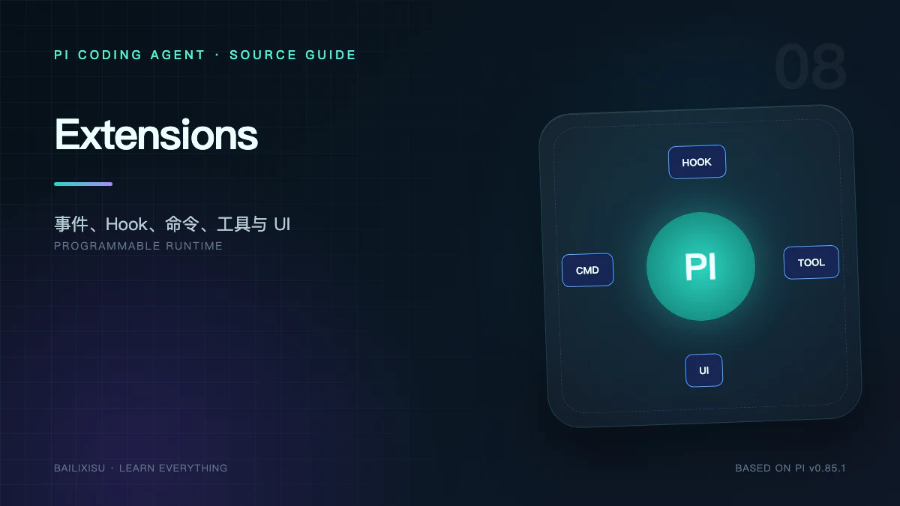

Tool 扩展“模型能做什么”，Skill 扩展“模型知道怎样做”，Extension 则可以改变 Pi 本身怎样运行。

它能介入：

```text
资源发现 → Session 启动 → 输入 → Agent 开始 → Context
→ 模型消息 → Tool Call → Tool Result → Agent 结束
→ Compaction / Tree / Fork → Session 关闭
```

这使 Extension 成为 Pi 最强、也最需要信任的能力。

## 一、Extension 是什么

Extension 是导出工厂函数的 TypeScript/JavaScript 模块：

```ts
import type { ExtensionAPI } from "@earendil-works/pi-coding-agent";

export default function (pi: ExtensionAPI) {
  pi.on("session_start", (_event, ctx) => {
    ctx.ui.notify("extension loaded", "info");
  });
}
```

工厂在加载阶段执行，用 `ExtensionAPI` 注册资源和事件处理器。

它不是受限 DSL：Extension 与 Pi 进程拥有相同的 Node/Bun 权限，可以访问文件、网络、环境变量和子进程。

## 二、发现与加载

来源包括：

- 用户扩展目录；
- 项目 `.pi/extensions`；
- Settings 显式路径；
- npm/Git Package；
- CLI `--extension`；
- SDK 注入。

项目 Extension 受 Project Trust 控制。Package manifest 可以同时声明 Extensions、Skills、Prompts 和 Themes。

加载器负责：

1. 解析路径和目录入口；
2. 使用运行时加载 TypeScript；
3. 执行工厂函数；
4. 收集注册的 handler、tool、command、provider；
5. 标记 source info；
6. 将错误转换为诊断，不让一个插件悄悄污染其他插件。

## 三、Extension Runner 是统一调度器

`ExtensionRunner` 保存已加载扩展及 handler，并将 AgentSession 生命周期转换成 Extension Event。

事件大致分五组。

### Session 与资源

```text
project_trust
resources_discover
session_start
session_info_changed
session_before_switch
session_before_fork
session_shutdown
```

### 输入与 Agent

```text
input
before_agent_start
agent_start
agent_end
agent_settled
```

### Turn、Message 与 Context

```text
context
turn_start
turn_end
message_start
message_update
message_end
```

### Tool

```text
tool_call
tool_result
tool_execution_start
tool_execution_update
tool_execution_end
```

### Session 结构操作

```text
session_before_compact
session_compact
session_compact_failed
session_before_tree
session_tree
```

不同事件的返回值语义不同：有的是被动通知，有的可以修改输入，有的可以取消操作。不能假设所有 `pi.on()` 都只是 observer。

## 四、输入 Hook

`input` 发生在 Skill 和 Prompt Template 展开前。Handler 可以返回：

- 继续，可替换文本和图片；
- 已处理，不再进入 Agent；
- 阻止并给出原因。

适合实现：

- 自定义输入语法；
- 敏感信息扫描；
- 自动补充 Issue 上下文；
- 输入审计；
- 特定前缀路由。

不要用它解析 Extension Command；命令在此前已经被分发。

## 五、`before_agent_start`

它是一次高层 run 的最后准备点。Extension 可以返回：

```ts
{
  message?: AgentMessage;
  systemPrompt?: string;
}
```

适合注入当前任务才需要的信息，例如：

- 当前 Git 状态；
- 工单摘要；
- 临时冻结策略；
- 外部服务健康状态。

如果每个模型 turn 都要重新计算，应使用 `context` Hook，而不是这里只运行一次。

## 六、Context Hook

每次模型请求前，Agent Core 把当前 Messages 交给 `transformContext()`，Coding Agent 再调用 Extension Context Handler。

这允许：

- 删除 UI-only 消息；
- 注入动态检索结果；
- 脱敏；
- 限制历史范围；
- 实现自定义 Memory 投影。

风险是破坏消息协议。删除 Tool Result 或重排 Tool Call 后，Provider 可能拒绝请求。Context Hook 应保持因果配对。

## 七、Tool Hook 是运行时策略点

### `tool_call`

发生在参数 Schema 校验之后、真实执行之前。可修改参数或返回 block。

```ts
pi.on("tool_call", async (event, ctx) => {
  if (event.toolName === "bash" && /rm\s+-rf/.test(event.input.command)) {
    const ok = await ctx.ui.confirm("危险命令", event.input.command);
    if (!ok) return { block: true, reason: "User rejected" };
  }
});
```

多个 Handler 串行运行，后一个看到前一个修改后的参数。修改后不会自动重新 Schema 校验。

### `tool_result`

发生在执行完成后，可修改 content、details、错误和 usage。适合：

- Secret 脱敏；
- 结果压缩；
- 添加审计信息；
- 将企业错误格式转换为模型可理解文本。

强制策略应尽量放在 `tool_call`，因为 `tool_result` 时副作用已经发生。

## 八、注册自定义 Tool

```ts
import { Type } from "typebox";

pi.registerTool({
  name: "ticket_lookup",
  label: "Ticket",
  description: "Get one ticket by ID",
  parameters: Type.Object({ id: Type.String() }),
  async execute(callId, params, signal, onUpdate, ctx) {
    // ...
  },
  renderCall(args, theme, context) {
    /* TUI */
  },
  renderResult(result, options, theme, context) {
    /* TUI */
  },
});
```

Extension Tool 比 Agent Core Tool 多出 Coding Agent Context 和 Renderer，能够显示自定义 UI。

设计时仍需遵守：参数窄、输出有界、支持 Abort、副作用明确。

## 九、注册 Command

```ts
pi.registerCommand("session-name", {
  description: "Set session name",
  handler: async (args, ctx) => {
    ctx.sessionManager.appendSessionInfo(args.trim());
  },
});
```

Command 适合确定性操作，不需要让模型猜测是否调用。

它在 Agent streaming 时也可以立即执行，因此 handler 必须考虑并发状态。若要向正在运行的 Agent 发送内容，应使用 API 提供的 queue 语义。

## 十、发送消息与保存状态

Extension 有三种常见状态方式：

### 进程内变量

最快，但 `/reload`、重启或 Session 切换后丢失。

### Custom Entry

持久化结构数据，不进入模型：

```ts
pi.appendEntry("todo-state", { items });
```

恢复时扫描对应 `customType`。

### Custom Message

进入 Agent Context，可控制 TUI 是否显示。适合把外部事件变成模型可观察事实。

不要把纯 UI 状态写成 Custom Message，否则浪费 token。

## 十一、UI 扩展

Extension Context 提供：

- `select`、`confirm`、`input`、`editor`；
- notify；
- status；
- editor 上下 Widget；
- Header / Footer；
- Working Indicator；
- Custom Editor；
- 自定义 Component 和 Overlay；
- Theme 访问。

`ctx.ui.custom()` 可构建完整交互界面。组件遵循 `render(width): string[]`，每行不得超过 width，并在状态变化后请求重绘。

RPC Mode 通过 `extension_ui_request/response` 映射一部分 UI；依赖真实终端的 Custom Component 在 RPC 中会降级。

## 十二、注册 Provider

Extension 还能：

- 覆盖现有 Provider baseUrl/headers；
- 注册新模型；
- 提供 OAuth；
- 实现自定义 `streamSimple`；
- 动态刷新模型目录。

工厂可以是 async。Pi 会等待它完成后再进入启动模型选择，因此动态 Provider 对 `--list-models` 也可见。

运行中注册或注销 Provider 会立即应用，不一定需要 `/reload`。

## 十三、错误隔离

Extension 抛错会产生 `extension_error`，包含：

```text
extensionPath · event · error
```

但错误隔离不是权限隔离。一个 Extension 仍可能在抛错前产生任意系统副作用。

Handler 应：

- 捕获可预期外部错误；
- 尊重 AbortSignal；
- 给用户可行动提示；
- 避免无限等待 UI；
- 在 shutdown 时释放 watcher、timer 和 child process。

## 十四、Extension、Skill、Tool 的选择

| 需求                 | 首选               |
| -------------------- | ------------------ |
| 告诉模型一套方法     | Skill              |
| 给模型一个动作       | Tool               |
| 用户显式触发确定流程 | Command            |
| 拦截或改写工具       | Extension Hook     |
| 改变界面             | Extension UI       |
| 保存插件状态         | Custom Entry       |
| 增加模型协议         | Provider Extension |
| 简单文本复用         | Prompt Template    |

一个 Package 可以把它们组合分发，但概念边界仍应保持。

## 十五、最小审计扩展

```ts
export default function (pi) {
  pi.on("tool_call", event => {
    process.stderr.write(
      JSON.stringify({
        at: Date.now(),
        tool: event.toolName,
        input: event.input,
      }) + "\n"
    );
  });

  pi.on("tool_result", event => {
    process.stderr.write(
      JSON.stringify({
        at: Date.now(),
        tool: event.toolName,
        isError: event.isError,
      }) + "\n"
    );
  });
}
```

真实使用时要先脱敏，避免把文件内容、Token 或命令中的 Secret 写进日志。

## 十六、安全检查表

安装 Extension 前检查：

1. 来源和版本是否固定；
2. 是否读取环境变量或凭据；
3. 是否启动子进程或网络监听；
4. 是否注册 `tool_call` 修改参数；
5. 是否把隐藏消息送入模型；
6. 是否保存日志到外部；
7. `/reload` 和 shutdown 是否正确清理；
8. 项目级 Extension 是否真的需要信任。

## 十七、小结

Extension API 把 Pi 从固定 Coding Agent 变成可编程 Harness：

```text
注册：Tool · Command · Provider
观察：Session · Agent · Turn · Message
干预：Input · Context · Tool · Compaction · Tree
展示：Dialog · Widget · Overlay · Editor · Footer
持久化：Custom Entry · Custom Message
```

下一篇研究这些能力如何呈现在不同外壳中：Interactive TUI、Print、JSON、RPC 和直接 SDK 使用各自适合什么集成方式。

## 源码索引

- [`core/extensions/loader.ts`](https://github.com/earendil-works/pi/blob/v0.85.1/packages/coding-agent/src/core/extensions/loader.ts)
- [`core/extensions/runner.ts`](https://github.com/earendil-works/pi/blob/v0.85.1/packages/coding-agent/src/core/extensions/runner.ts)
- [`core/extensions/types.ts`](https://github.com/earendil-works/pi/blob/v0.85.1/packages/coding-agent/src/core/extensions/types.ts)
- [Extensions 文档](https://github.com/earendil-works/pi/blob/v0.85.1/packages/coding-agent/docs/extensions.md)
- [TUI Components](https://github.com/earendil-works/pi/blob/v0.85.1/packages/coding-agent/docs/tui.md)
- [Extension Examples](https://github.com/earendil-works/pi/tree/v0.85.1/packages/coding-agent/examples/extensions)
