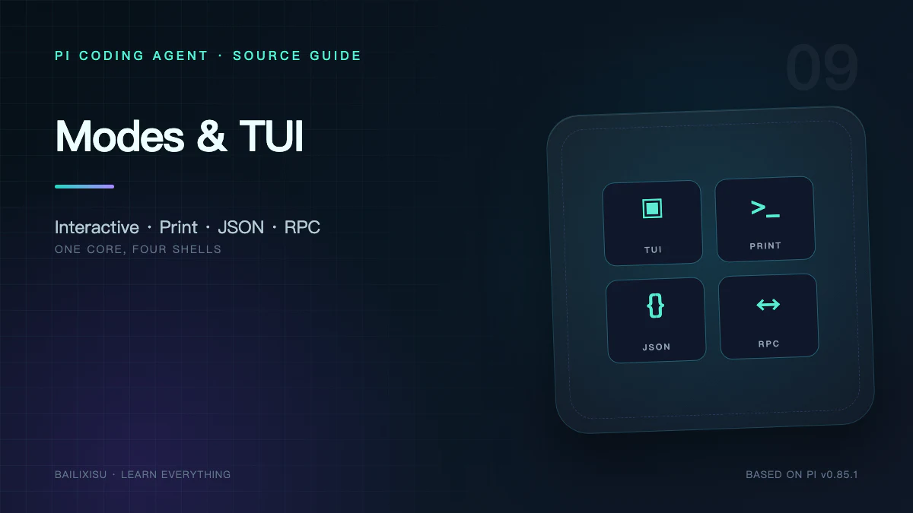

Pi 不是只有一个终端聊天界面。相同的 `AgentSessionRuntime` 可以被四种 CLI Mode 和一个进程内 SDK 使用。

```text
                    ┌─ Interactive TUI
AgentSessionRuntime ├─ Print
                    ├─ JSON Events
                    ├─ RPC JSONL
                    └─ TypeScript SDK
```

正确选择外壳，比解析终端 ANSI 输出可靠得多。

## 一、共享内核与不同外壳

所有模式复用：

- ModelRuntime；
- SessionManager；
- AgentSession；
- Tools；
- Extensions；
- Agent Loop；
- Retry 与 Compaction。

差异集中在：

- 输入从哪里来；
- 事件怎样呈现；
- 是否支持交互式 UI；
- 外部程序如何控制 Session。

## 二、Interactive Mode

直接运行：

```bash
pi
```

`InteractiveMode` 负责完整人机协作：

- 多行编辑器和历史；
- Markdown 与代码高亮；
- Assistant 流式内容；
- Tool Call / Result 折叠展示；
- Model 与 thinking 切换；
- `/tree`、`/settings`、`/model` 等内建界面；
- Extension Dialog、Widget、Overlay；
- 图片协议；
- Session 恢复。

它订阅 AgentSession Event，不直接调用 Provider。

## 三、Regular 与 Fullscreen TUI

### Regular

使用终端原生 scrollback，Pi 增量重绘当前区域。优点是行为接近普通 CLI，鼠标滚动由终端负责。

### Fullscreen

使用 alternate screen 维护完整视口，Pi 自己处理：

- transcript 滚动；
- mouse click、drag、wheel；
- selection；
- scrollbar；
- Overlay；
- 退出时输出 transcript 或 resume hint。

Settings：

```json
{
  "tuiMode": "fullscreen",
  "fullscreenScrollbar": "auto",
  "fullscreenCopyOnSelect": true
}
```

Fullscreen 更像桌面应用，Regular 更像传统终端命令。

## 四、`pi-tui` 的组件协议

所有组件实现：

```ts
interface Component {
  render(width: number): string[];
  handleInput?(data: string): void;
  handleMouse?(event: TuiMouseEvent): TuiMouseEventResult;
  invalidate(): void;
}
```

关键不变量：`render()` 返回的每一行可见宽度不能超过 width。

### 为什么不是虚拟 DOM

终端 UI 的基本单位是带 ANSI escape 的字符串行。Renderer 需要处理：

- ANSI 不占可见宽度；
- 中文宽字符；
- Emoji；
- OSC 8 超链接；
- Kitty Keyboard；
- 图片协议；
- 局部重绘。

`visibleWidth()`、`truncateToWidth()` 和 `wrapTextWithAnsi()` 比字符串 `length` 更可靠。

## 五、IME 与硬件光标

中文输入法候选框依赖终端光标位置。Focusable Component 在假光标前插入 `CURSOR_MARKER`，Renderer 扫描后把硬件光标移动到该位置。

容器若包含 Input/Editor，需要把自己的 `focused` 状态传给子组件，否则中文候选框可能出现在错误位置。

这类细节说明 TUI 不是简单的 `console.log()`。

## 六、事件怎样变成界面

Assistant Streaming 时：

```text
message_start       创建显示块
message_update      按 contentIndex 更新 thinking/text/toolCall
message_end         以最终消息校正
```

Tool 执行时：

```text
tool_execution_start   显示 pending
update*                替换 partial result
end                    使用 Tool Renderer 输出最终状态
```

UI 不应把 partial 当成持久真相。最终 Message 和 Result 才是权威数据。

## 七、Print Mode

```bash
pi -p "解释这个仓库"
```

适合：

- 一次性 Shell 调用；
- CI 中生成说明；
- 将结果重定向到文件；
- 人类只关心最终文本。

它仍可执行 Tool 和多轮 Agent Loop，只是不会打开 TUI。

缺点：外部程序难以可靠区分 thinking、文本、工具事件和最终状态。需要结构化消费时应使用 JSON 或 RPC。

## 八、JSON Mode

```bash
pi --mode json "检查测试"
```

stdout 输出 AgentSession Event JSONL，例如：

```json
{"type":"agent_start"}
{"type":"message_start","message":{"role":"assistant"}}
{"type":"message_update","assistantMessageEvent":{"type":"text_delta","delta":"..."}}
{"type":"message_end","message":{"role":"assistant"}}
{"type":"agent_settled"}
```

适合：

- 将一次运行接入流处理；
- 保存可机器分析的 trace；
- CLI 管道；
- 测试事件顺序。

JSON Mode 主要是单向事件输出，不是持续双向控制协议。

## 九、RPC Mode

```bash
pi --mode rpc --no-session
```

RPC 使用 stdin/stdout 严格 JSONL：

- stdin：Command；
- stdout：Response 与异步 Event；
- 每条记录以 LF `\n` 分隔；
- Command 可带 `id` 做 Response 关联；
- Agent Event 通常没有该请求 ID。

### 为什么强调严格 LF

Node `readline` 还会把 Unicode `U+2028/U+2029` 当分隔符，但它们在 JSON 字符串中合法。RPC Client 应只扫描 `\n`，并兼容输入行末的 `\r`。

## 十、RPC 的命令面

主要类别：

| 类别         | 命令示例                                               |
| ------------ | ------------------------------------------------------ |
| Prompt       | `prompt`、`steer`、`follow_up`、`abort`                |
| State        | `get_state`、`get_messages`、`get_entries`、`get_tree` |
| Model        | `set_model`、`cycle_model`、`set_thinking_level`       |
| Queue        | `set_steering_mode`、`clear_queue`                     |
| Compaction   | `compact`、`set_auto_compaction`                       |
| Retry        | `set_auto_retry`、`abort_retry`                        |
| Session      | `new_session`、`switch_session`、`fork`、`clone`       |
| Export       | `export_html`、`get_session_stats`                     |
| Direct Shell | `bash`、`abort_bash`                                   |

`prompt` Response 的 `success: true` 只表示输入已接受、排队或被处理。后续模型失败通过 Event 报告，不会再发第二个同 ID Response。

## 十一、RPC Streaming 中的并发语义

Agent 正在运行时，新的 `prompt` 必须声明：

```json
{ "type": "prompt", "message": "换一个方案", "streamingBehavior": "steer" }
```

或者：

```json
{ "type": "prompt", "message": "完成后总结", "streamingBehavior": "followUp" }
```

未指定会返回错误。Extension Command 例外，可以立即执行并自行管理与 Agent 的交互。

### 正确实现 Esc

RPC 客户端想模拟 Interactive Esc，应先：

```text
clear_queue
  → 取回未处理文本并放回编辑器
  → abort
```

只发 abort 时，仍留在队列里的消息可能继续触发 Agent。

## 十二、RPC Extension UI

Extension 的 `select/confirm/input/editor` 在 RPC 中变成：

```text
stdout: extension_ui_request { id, method, ... }
stdin:  extension_ui_response { id, value/confirmed/cancelled }
```

notify、status、widget 和 title 是 fire-and-forget。

依赖真实 TUI 的 Custom Component、Theme 或 Footer 在 RPC 中不完整，因此 Extension 应使用：

```ts
if (ctx.mode === "tui") {
  /* terminal-specific UI */
}
```

而不是只检查 `hasUI`。

## 十三、直接 SDK

Node/TypeScript 应优先直接使用：

```ts
import {
  createAgentSession,
  SessionManager,
} from "@earendil-works/pi-coding-agent";

const { session } = await createAgentSession({
  sessionManager: SessionManager.inMemory(process.cwd()),
});

session.subscribe(event => {
  /* render */
});
await session.prompt("分析 package.json");
```

优势：

- 完整类型；
- 无子进程协议；
- 可注入 ResourceLoader、ModelRuntime、Tools；
- 可直接等待 `prompt()`；
- 更容易写单元测试。

代价是应用与 Pi 包版本、Node Runtime 和进程内错误域耦合更紧。

## 十四、选择矩阵

| 需求                      | 推荐         |
| ------------------------- | ------------ |
| 人在终端协作              | Interactive  |
| Shell 中只取最终答案      | Print        |
| 单次运行的结构化事件      | JSON         |
| 跨语言、长期子进程、IDE   | RPC          |
| TypeScript 深度嵌入与测试 | SDK          |
| 自定义终端应用            | SDK + pi-tui |

不要抓取 Interactive ANSI 输出来控制 Agent；这是展示协议，不是稳定 API。

## 十五、一个 RPC 客户端必须实现的状态

最小可靠客户端至少追踪：

- Command ID → pending Response；
- `message_start` 后按 contentIndex 累积 delta；
- Tool Call ID → 工具状态；
- Queue Update；
- Extension UI Request；
- `agent_end.willRetry`；
- `agent_settled`；
- 进程退出与 malformed JSONL。

只等待 `agent_end` 会在自动 Retry 或 Compaction 时过早宣布完成。

## 十六、小结

Pi 用 Event 把执行内核和呈现层解耦：

```text
Interactive 把事件画成终端 UI
Print 把最终内容写成文本
JSON 把事件变成单向 JSONL
RPC 再加双向命令与 UI 子协议
SDK 直接暴露进程内对象
```

下一篇回到 Session：为什么 JSONL 是一棵树，Compaction 怎样只改变上下文而不删除历史，Branch Summary 又如何连接两条路径。

## 源码索引

- [`modes/interactive/interactive-mode.ts`](https://github.com/earendil-works/pi/blob/v0.85.1/packages/coding-agent/src/modes/interactive/interactive-mode.ts)
- [`modes/rpc/rpc-mode.ts`](https://github.com/earendil-works/pi/blob/v0.85.1/packages/coding-agent/src/modes/rpc/rpc-mode.ts)
- [`packages/tui`](https://github.com/earendil-works/pi/tree/v0.85.1/packages/tui)
- [RPC 文档](https://github.com/earendil-works/pi/blob/v0.85.1/packages/coding-agent/docs/rpc.md)
- [SDK 文档](https://github.com/earendil-works/pi/blob/v0.85.1/packages/coding-agent/docs/sdk.md)
- [TUI 文档](https://github.com/earendil-works/pi/blob/v0.85.1/packages/coding-agent/docs/tui.md)
