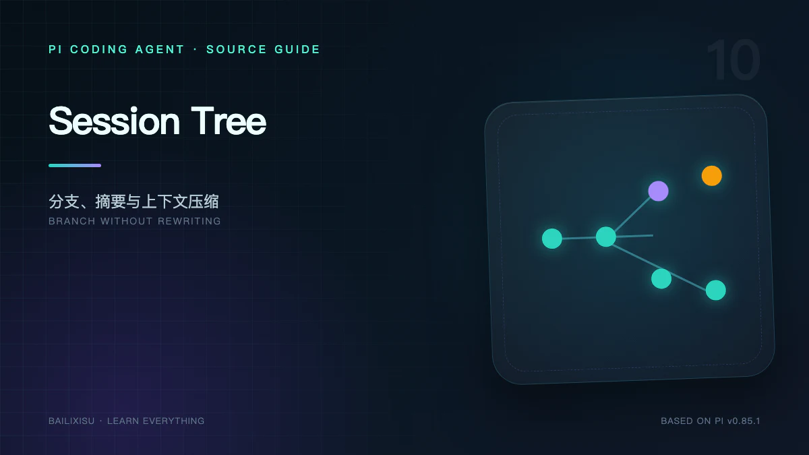

Pi 的 Session 文件按行追加，逻辑上却不是一条直线，而是一棵树。

这个设计同时支撑：

- 回到旧消息重新提问；
- 保留被放弃的尝试；
- 给节点加标签；
- 把旧分支总结到新路径；
- 压缩上下文但不删除历史；
- 从任意叶子恢复模型与 thinking level。

## 一、物理日志与逻辑树

JSONL 物理顺序：

```text
header
entry A
entry B
entry C
entry D
entry E
```

逻辑关系由 `parentId` 决定：

```text
A ─ B ─ C
    └─ D ─ E  ← leaf
```

最后追加的 Entry 通常成为当前 leaf，但它可以把 parent 指向任意已有节点。

## 二、为什么 Entry 不可修改

稳定 CLI v3 的 SessionManager 提供 `appendXXX()`，不提供原地修改历史 Entry。

优势：

- Entry ID 稳定；
- 分支不会覆盖旧历史；
- 调试可以还原完整路径；
- 写入简单；
- Label、Summary 和外部客户端可持有 durable cursor。

Label 更新也不是修改目标 Entry，而是追加新的 `label` Entry。最新记录决定当前标签。

## 三、`getBranch()` 怎样工作

算法非常直接：

```text
current = leaf
while current exists:
  path.push(current)
  current = byId[current.parentId]
reverse(path)
```

时间与当前分支长度成正比，而不是与整个 Session Entry 数量成正比。

`byId` 在打开 Session 时一次建立，避免每走一步扫描整个 JSONL。

## 四、branch、fork 与 clone

这些词容易混淆。

### Tree Navigation / Branch

在同一个 Session 文件内移动 leaf 到旧 Entry，再从那里追加。历史共用同一棵树。

### Fork

选择旧 User Message，创建新的后续路径。交互上常用于修改早期问题。

### Clone

把当前活动分支复制到一个新 Session，形成独立文件，并保留 parent session 关联。

选择原则：

- 想保留同一问题的多条尝试：同 Session branch；
- 想把当前状态变成独立任务：clone/new session with parent；
- 想改写旧用户输入：fork。

## 五、分支切换的上下文损失

假设：

```text
A ─ B ─ C ─ D 旧叶子
    └─ E ─ F   目标分支
```

从 D 切到 F 后，新的活动路径只有 `A-B-E-F`。C、D 中完成的实验不会自动出现。

有时这正是目的；有时用户希望保留“旧分支已经尝试过什么”。Branch Summary 解决后者。

## 六、Branch Summary

流程：

```text
寻找旧 leaf 与目标的最深公共祖先
  → 收集旧分支独有 Entry
  → 在 token 预算内准备消息
  → LLM 生成结构化摘要
  → 把 BranchSummaryEntry 追加到目标路径
```

结果：

```text
A ─ B ─ C ─ D
    └─ E ─ F ─ [Summary of C,D] ← 新 leaf
```

Entry 记录 `fromId`，说明摘要来自哪个旧位置。

### 是否总要总结

不需要。如果旧分支只是错误尝试或包含不希望带入的假设，选择不总结更干净。

`branchSummary.skipPrompt` 可以跳过交互确认，默认不生成摘要。

## 七、Compaction 的触发阈值

自动条件：

```text
contextTokens > contextWindow - reserveTokens
```

默认：

```text
reserveTokens    16384
keepRecentTokens 20000
enabled          true
```

Pi 会在三个重要边界检查：

- 新用户 Prompt 前；
- 多轮 Agent 中工具结果追加后、下一次模型调用前；
- 低层 Agent run 结束后。

如果工具 batch 已终止且没有后续消息，不会为了一个不会发生的下一次模型调用做无意义压缩。

## 八、Compaction 的切分算法

1. 从最新消息向前累计 token；
2. 尽量保留 `keepRecentTokens`；
3. 在合法边界选择 `firstKeptEntryId`；
4. 把更老内容序列化给摘要模型；
5. 追加 Compaction Entry；
6. 重建活动 Context。

压缩前：

```text
[old messages................][recent messages]
```

压缩后模型看到：

```text
[structured summary][recent messages]
```

Session 文件仍保存原始 old messages 和新 Compaction Entry。

## 九、为什么不能从 Tool Result 中间切

合法切点包括：

- User Message；
- Assistant Message；
- Bash Execution；
- Custom Message / Branch Summary。

不会从 Tool Result 开始保留，因为 Provider 要求 Tool Result 与前面的 Assistant Tool Call 配对。

错误切分会产生：

```text
toolResult(call_123)
```

但上下文中没有 `toolCall(call_123)`，请求可能直接被拒绝。

## 十、Split Turn

一个 User Turn 可能包含几十次 Assistant/Tool 循环，本身就超过 `keepRecentTokens`。

此时切点只能落在 turn 中间：

```text
user → assistant → tool → assistant → tool → assistant → tool
                                  ↑ cut
```

Pi 将其识别为 split turn，分别总结：

1. 更早完整历史；
2. 当前 turn 被切掉的前缀。

再合并摘要，使保留尾部仍知道这个超长任务从何开始。

## 十一、重复 Compaction

第二次压缩不能只总结第一次 Compaction Entry 之后的新消息，否则第一次保留下来的近期消息在下次可能无解释地消失。

Pi 从上一次 `firstKeptEntryId` 开始形成新的待总结跨度，并把 previous summary 作为迭代上下文。

这形成滚动摘要：

```text
S1 + recent1
  → S2(S1 + 被移出的 recent1) + recent2
  → S3(...)
```

摘要误差也可能累积，因此关键事实最好落在代码、测试或显式项目文档中。

## 十二、结构化摘要格式

默认格式要求：

```markdown
## Goal

## Constraints & Preferences

## Progress

### Done

### In Progress

### Blocked

## Key Decisions

## Next Steps

## Critical Context

<read-files>...</read-files>
<modified-files>...</modified-files>
```

它不是为了阅读美观，而是为了下一模型快速恢复任务状态。

## 十三、文件操作追踪

Compaction 和 Branch Summary 会从 Tool Call、旧 Summary details 中累计：

- read files；
- modified files。

这样多次压缩后，摘要仍能保留关键文件集合。

Tool Result 在送入摘要前会截断到约 2000 字符，防止一段日志占满整个摘要请求。

## 十四、Summary 本身也有成本

生成摘要是独立 LLM 请求，因此有：

- 模型输入与输出 token；
- usage 与 cost；
- transient error；
- Abort；
- Retry；
- Provider 路由。

Pi 为一次性摘要请求使用新的 routing session ID，并在支持时关闭不太可能复用的 cache write。

Session 统计应计入 Summary usage，而不是只统计 Assistant 回答。

## 十五、Extension 可以接管摘要

`session_before_compact` 可：

- cancel；
- 提供自定义 summary；
- 使用另一模型；
- 保存自定义 details 与 usage。

`session_before_tree` 可以取消导航或提供 Branch Summary。

无论自定义与否，都必须保持 `firstKeptEntryId` 等结构不变量，否则 Context 恢复会断裂。

## 十六、Overflow 恢复

如果 Provider 已返回 context overflow：

```text
识别 overflow error
  → 移除失败 Assistant Message 的 live 影响
  → reason = overflow 执行 Compaction
  → 成功后 Agent.continue()
```

Pi 只自动执行一次 overflow recovery，防止错误分类导致无限“压缩—重试”。

## 十七、Session v3 的可靠性边界

它适合本地交互历史，但不是事务数据库：

- Entry 按行追加；
- malformed line 可跳过；
- 末行缺换行可修复；
- 不恢复中途未结算 Tool Effect；
- 不提供多写者事务；
- 不承诺 exactly-once。

需要持久 operation 和 crash recovery 的服务，应关注 experimental AgentHarness，而不是继续加补丁假装 v3 已具备这些语义。

## 十八、调试 Session 的方法

```bash
jq -c 'select(.type != "session") | {type,id,parentId}' session.jsonl
```

查当前 leaf：最后一个合法 Entry ID。

沿父链分析时，不能只看文件相邻行；相邻行可能属于不同分支。

RPC 的 `get_entries` 返回完整 append 顺序，`get_tree` 返回树，`leafId` 表示当前位置。Entry ID 可作为 `since` cursor。

## 十九、小结

Pi 的会话机制把三件事分开：

```text
Session Tree       保存完整发生历史
Active Branch      决定当前模型沿哪条路径思考
Summary Entry      在容量或导航边界提供有损桥梁
```

下一篇讨论可靠性与安全：Retry 和 Abort 能保证什么，Project Trust 为什么不是 Sandbox，以及怎样给拥有 Bash 权限的 Agent 建立真正边界。

## 源码索引

- [`core/session-manager.ts`](https://github.com/earendil-works/pi/blob/v0.85.1/packages/coding-agent/src/core/session-manager.ts)
- [`core/compaction/compaction.ts`](https://github.com/earendil-works/pi/blob/v0.85.1/packages/coding-agent/src/core/compaction/compaction.ts)
- [`core/compaction/branch-summarization.ts`](https://github.com/earendil-works/pi/blob/v0.85.1/packages/coding-agent/src/core/compaction/branch-summarization.ts)
- [Compaction 文档](https://github.com/earendil-works/pi/blob/v0.85.1/packages/coding-agent/docs/compaction.md)
- [Session Format](https://github.com/earendil-works/pi/blob/v0.85.1/packages/coding-agent/docs/session-format.md)
- [Sessions](https://github.com/earendil-works/pi/blob/v0.85.1/packages/coding-agent/docs/sessions.md)
