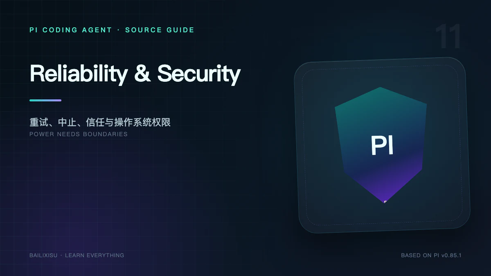

Coding Agent 同时面对两类不确定性：

- 模型和网络可能失败、超时、限流或溢出；
- 模型生成的命令可能修改真实系统。

可靠性机制负责“失败后怎样继续”，安全机制负责“哪些动作根本不应发生”。二者不能互相替代。

## 一、先给出边界结论

1. Pi 有 Agent-level Retry，但不保证外部副作用 exactly-once。
2. AbortSignal 是协作式取消，不是对所有代码的强制终止。
3. Project Trust 控制项目资源加载，不限制内置 Bash/Edit/Write。
4. 默认 Pi 不提供 Sandbox；工具继承当前用户权限。
5. Prompt 规则不是强制安全策略，真正限制必须在运行时或操作系统层。

## 二、错误分层

| 层级               | 例子                                     | 主要处理者                            |
| ------------------ | ---------------------------------------- | ------------------------------------- |
| Provider Transport | timeout、连接断开、SSE 错误              | API Adapter / Provider Retry          |
| Model Response     | rate limit、overloaded、context overflow | AgentSession Retry/Compaction         |
| Tool               | 参数错误、文件不存在、命令失败           | Agent Loop，生成 Tool Result          |
| Extension          | handler throw、UI timeout                | ExtensionRunner，发出 extension_error |
| Runtime Invariant  | Session 损坏、内部状态不一致             | 抛错、停止或重启                      |

稳定系统的关键是不要把所有错误都 catch 成一段普通文本。

## 三、Agent-level Retry

默认配置：

```json
{
  "retry": {
    "enabled": true,
    "maxRetries": 3,
    "baseDelayMs": 2000,
    "provider": {
      "maxRetries": 0,
      "maxRetryDelayMs": 60000
    }
  }
}
```

延迟按指数增长：

```text
2s → 4s → 8s
```

适合重试 transient error，例如 overloaded、rate limit 和部分 5xx。

### 为什么默认关闭 Provider Retry

如果 SDK 在内部长时间重试，AgentSession 看不到每次失败，也无法及时让用户 Abort、切换模型或触发统一事件。

官方建议通常让 Agent-level Retry 作为主要策略。

### Retry 使用 `continue()`

它不会添加伪造 User Message，而是从现有 Context 继续。成功 Assistant Message 会重置 retry counter，避免不同 turn 的偶发错误累计成一次失败。

## 四、Retry 与副作用

假设 Provider 已生成 `bash deploy.sh`，工具执行成功，但下一次模型请求失败。Agent Retry 会重试模型请求，不会主动回滚部署。

更危险的情况是外部调用结果未知：请求可能到达远端，但响应在网络中丢失。

稳定 CLI v3 没有通用 exactly-once effect protocol。具有非幂等副作用的 Tool 应：

- 使用 idempotency key；
- 先查询再执行；
- 返回可恢复 operation ID；
- 对未知结果请求人工确认；
- 将 `executionMode` 设为 sequential；
- 在 Extension 中审计。

## 五、Context Overflow Recovery

Overflow 不是普通网络错误。Pi 的恢复路径是：

```text
识别 Assistant errorMessage
  → 丢弃失败响应的 live context 影响
  → 执行 Compaction(reason = overflow)
  → 成功后 continue
```

只尝试一次，避免 Provider 错误识别或窗口元数据错误导致无限循环。

自定义 Provider 必须将溢出错误规范化，但不能把 rate limit 改写成 overflow。

## 六、Abort 的传播

一次 run 创建 AbortController，Signal 传给：

- Provider stream；
- Context transform；
- before/after Tool Hook；
- Tool execute；
- Compaction / Summary；
- 部分 Extension 操作。

用户按 Esc 或 RPC `abort` 后，这些组件应尽快停止。

### 协作式取消的限制

JavaScript 代码若执行 CPU 死循环或忽略 Signal，AbortController 不能强制终止它。

Bash Tool 可以向子进程发送终止信号，但子进程树、远程请求和已经提交的外部事务仍可能继续。

需要硬隔离时必须使用独立进程、容器和超时回收。

## 七、事件结算边界

可靠客户端需要区分：

- `message_end`：一条消息完成；
- `turn_end`：Assistant 与其工具批次完成；
- `agent_end`：一次低层 Loop 完成；
- `agent_settled`：Retry、Compaction 和队列 continuation 都已结束。

在 `agent_settled` 前关闭应用，可能丢失上层仍准备自动执行的工作。

## 八、Session 持久化能保证什么

稳定 v3 Session 保存已完成 Message 和结构 Entry，可在重启后恢复对话。

它不保证：

- Provider 流中途恢复；
- Tool 执行中途恢复；
- 外部副作用 exactly-once；
- 多进程同时写一个 Session；
- 所有 Entry 原子事务提交。

这些限制是 experimental AgentHarness 要解决的问题。

## 九、Project Trust 的真实作用

Trust 决定是否加载：

- 项目 Settings；
- Extensions；
- Packages；
- Skills、Prompts、Themes；
- 项目 `.agents/skills`。

其中最危险的是可执行 Extension 和依赖安装。

### 它不控制

- 模型调用 `bash`；
- `edit` 修改仓库；
- `read` 读取工作目录外文件；
- Shell 访问网络；
- 当前环境变量可见性。

所以：

```text
Project Trust ≠ Tool Approval ≠ Sandbox
```

## 十、默认工具权限

Pi 官方安全文档明确：没有内置 Sandbox，工具以当前用户权限运行。

这意味着模型可能：

- 修改或删除文件；
- 执行项目脚本；
- 访问用户可读凭据；
- 使用当前网络；
- 调用已登录 CLI；
- 改变 Git 工作区。

日常本地使用依赖人工观察和版本控制，生产自动化必须增加隔离。

## 十一、三层防护模型

### 第一层：Prompt 与 Skill

说明预期行为和禁区。优点是低成本，缺点是不能强制。

### 第二层：Extension Tool Policy

在 `tool_call` 阻止：

- 高危命令；
- 工作区外路径；
- Secret 文件；
- 未授权网络目标；
- 生产部署。

可以要求用户确认。比 Prompt 更强，但 Extension 与主进程同权限，代码自身仍须可信。

### 第三层：操作系统隔离

真正安全边界：

- Container；
- VM；
- 低权限账户；
- 只读挂载；
- 临时工作区；
- 网络 allowlist；
- 最小凭据；
- CPU、内存、时间限制。

## 十二、容器化建议

最小原则：

```text
只挂载当前仓库
默认非 root
不挂载 ~/.ssh 与云凭据
需要时才开放网络
使用临时 HOME
限制 CPU / memory / pids
输出通过 Git diff 或 artifact 带出
```

即使容器内运行，也要防止：

- 挂载 Docker Socket；
- `--privileged`；
- 把整个宿主 HOME 挂进去；
- 把生产 Token 注入所有工具；
- 允许任意出站网络。

容器不是配置不当时的魔法护盾。

## 十三、凭据安全

`auth.json` 使用用户读写权限，但模型和 Tool 运行在同一用户进程边界。

建议：

- 不在 Prompt、Context File 或 Session 中复制 API Key；
- 使用环境变量、Credential Store 或密码管理器命令；
- 给自动化任务使用短期、最小权限 Token；
- 对 Tool Result 做脱敏；
- 不公开 Session JSONL；
- 调试 Provider 时清除 Authorization Header。

`!command` 动态读取 Secret 时，命令本身和 stdout 也应避免被日志记录。

## 十四、Extension 供应链

Package/Extension 是代码依赖。应固定：

- npm 精确版本或 lockfile；
- Git commit，而不是漂移 branch；
- 来源仓库；
- 依赖审计；
- 更新评审。

项目 Trust 只表示“用户同意加载”，不表示代码自动安全。

## 十五、并发可靠性

Tool Batch 默认并行可能引入竞态。Pi 已对同文件 mutation 排队，但无法理解所有外部资源。

自定义 Tool 操作以下资源时应考虑 sequential：

- 同一数据库迁移；
- 同一部署环境；
- Git index；
- Package manager lock；
- 共享远程工单状态。

工具作者比 Agent Loop 更了解副作用域。

## 十六、生产自动化检查表

运行无人值守 Pi 前检查：

1. 是否使用 `--approve` 加载了不受控项目代码？
2. Tools 是否最小化？
3. Bash 是否必要？
4. 工作区是否临时副本？
5. Git diff 是否在提交前人工或规则审查？
6. 凭据是否短期且最小权限？
7. 网络是否受限？
8. 非幂等 Tool 是否有 idempotency key？
9. 是否等待 `agent_settled`？
10. Session 和日志是否包含敏感内容？
11. Timeout 后子进程是否真的被回收？
12. 失败后是否需要人工 reconciliation？

## 十七、小结

Pi 稳定 CLI 提供的是“可恢复对话”，不是“可恢复事务”。

```text
Retry          处理暂时模型失败
Compaction     处理上下文容量
Abort          请求协作式停止
Session v3     保存已完成历史
Project Trust  控制项目资源加载
Sandbox        必须由外部环境提供
```

下一篇单独研究 experimental AgentHarness：它怎样把 operation state、事务提交、effect intent、tool replay policy 和 recovery 引入 Agent Runtime。

## 源码与文档

- [Security](https://github.com/earendil-works/pi/blob/v0.85.1/packages/coding-agent/docs/security.md)
- [Containerization](https://github.com/earendil-works/pi/blob/v0.85.1/packages/coding-agent/docs/containerization.md)
- [Settings / Retry](https://github.com/earendil-works/pi/blob/v0.85.1/packages/coding-agent/docs/settings.md)
- [`core/agent-session.ts`](https://github.com/earendil-works/pi/blob/v0.85.1/packages/coding-agent/src/core/agent-session.ts)
- [`packages/agent/src/agent.ts`](https://github.com/earendil-works/pi/blob/v0.85.1/packages/agent/src/agent.ts)
