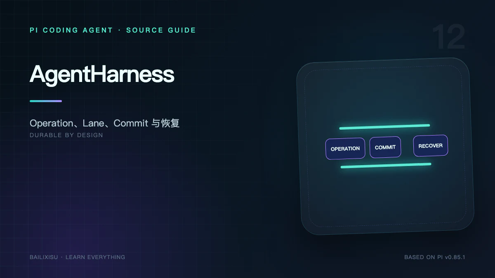

> **重要边界**：本文讨论 `packages/agent/src/harness` 和 Coding Agent `experimental/` 路径。Pi v0.85.1 的日常 `pi` CLI 主流程仍是 `AgentSession + Agent + agentLoop + SessionManager v3`。



稳定 CLI 能恢复聊天历史，却不能回答一个服务端问题：进程在 Tool 已经删除文件、但 Tool Result 尚未落盘时崩溃，重启后应该重做、跳过，还是报告结果未知？

AgentHarness 的目标是：

> 持久化 Conversation 和 Operation State，使中断任务在不重复已结算副作用的前提下继续。

## 一、为什么需要第二套架构

本地交互 CLI 可以依赖人类观察。长期服务则可能遇到：

- Worker 随时被回收；
- 客户端断线后继续运行；
- 同一 Session 有多条并行任务；
- Provider 请求已经计费但响应丢失；
- Tool 副作用发生但进程没来得及记录；
- 需要跨进程查询当前 operation；
- 使用 SQLite 或远程服务保存状态。

把更多字段塞进 v3 JSONL 消息树无法自动解决这些问题，因为“对话历史”和“未完成执行状态”是不同数据。

## 二、Session 的四个组成部分

AgentHarness 规范中的 Session 包含：

1. **Immutable Entry Tree**：Message、Compaction、Branch Summary、Custom Entry；
2. **Mutable Values / Lists**：Session name、Label、Operation State 等当前值；
3. **Branch 与 AgentLane**：逻辑数据路径，以及带模型配置和任务队列的执行通道；
4. **Append-only Usage Ledger**：独立保存每次 Provider 尝试的成本。

稳定 v3 把大部分信息编码为 Entry；Harness 明确区分不可变历史、可变运行态和计费账本。

## 三、三种存储形态

规范归纳为三个 Store：

```text
entries       写一次、只追加的对话树
values/lists  可替换的当前状态与只追加列表
usage ledger  只追加的成本记录
```

所有持久 payload 必须属于其中一种，不能藏在只能由某个进程内对象知道的第四处。

### Entry

完整记录 payload、parent、seq 和 timestamp，提交后不可修改删除。

### Value

同一 typed address 只保留当前值，适合 `operationState`。

### ValueList

元素追加，生命周期结束时可整表删除。适合流式 Assistant Frame。

### Usage Row

即使 Operation 最后 Abort，已经发生的 Provider 计费仍然保留。

## 四、事务是唯一写原语

Harness Storage 使用原子 commit：

```text
TX[write A, write B, write C]
```

要么全部可见，要么都不可见。每个写入获得 Session 全局递增 `seq`。

一个 Tool Result 的结算可以在同一事务中完成：

```text
insert result entry
+ delete pending result
+ advance branch tip
+ write next operation state
```

因此不会出现“结果已进树，但 Operation 仍认为工具未完成”的中间状态。

## 五、Branch 与 AgentLane

### Branch

一条有名字、tip 可移动的数据路径。它负责在哪里追加 Entry。

### AgentLane

在 Branch 能力上增加：

- 完整 Model Configuration；
- Steering / Follow-up Inbox；
- 当前至多一个 Operation；
- 最近 Operation ID。

一个 Session 可以有多个 Lane，共享 Entry Tree，但各自推进任务。

`main` 只是普通显式名称，不是存储层硬编码的唯一分支。

## 六、Operation 是恢复单位

Operation 是一次被接受的 Lane 工作，类型包括：

- run；
- compaction；
- navigation。

它有不可变 Meta 和完整 Current State。

四个核心原语：

```text
accept          持久创建 operation
Drive           推进指定 operation
requestAbort    持久请求取消
inspectExecution 原子查看当前与最近终态
```

`prompt()`、`resume()` 和 `abort()` 是这些原语加进程内等待策略的便利封装。

## 七、接受与执行所有权分离

`accept` 只把任务持久接受，不承诺立即启动后台任务。

Serving Layer 可以选择：

- 当前进程调用 drive；
- 放入 Job Queue；
- 设置 Alarm；
- 让另一个 Worker 接管。

AgentHarness 刻意不负责调度，这使它能适配 Serverless、Queue Worker 和本地进程。

## 八、完整 restart point

每次 durable transition 后，`pi.op.state` 都被整体替换为完整状态，而不是追加一条需要重放的“状态变化事件”。

恢复过程是：

```text
读取 operation meta
+ 读取最新完整 operation state
+ 进入该 state 对应 procedure
```

而不是：

```text
从第一条日志开始 fold 所有事件，猜测当前在哪
```

这降低恢复逻辑对旧写历史的依赖。

## 九、Effect 的不确定窗口

所有外部 Effect 都可能出现：

```text
副作用已发生
但 settlement 尚未持久化
```

Harness 使用两次提交包围 Effect：

```text
TX[intent: 即将执行 X，预留输出 ID]
  → uncertain external effect
TX[settlement: 完整输出 + 下一状态]
```

Intent 不能消除不确定窗口，但让恢复代码知道：这里发生过一次未结算尝试。

## 十、Assistant 请求的恢复

Provider Stream 前先提交：

- 请求 intent；
- 预留 response Entry ID；
- 预留 usage ID；
- 有效 Model 配置快照。

流式 frame 可追加到 pending list，供断线重连显示和崩溃后的 synthetic settlement。

但 Harness 不尝试重新连接 Provider Stream。请求可能已经计费、可能生成了更多未收到内容，这是明确 non-goal。

## 十一、Tool Replay Policy

工具声明：

```ts
replay: "safe" | "never";
```

### `safe`

如只读查询，崩溃后可以用持久参数重新执行。

### `never`

如删除、付款、发布。若崩溃发生在 effect pending，不能盲目重做。

Harness 使用最近 durable checkpoint 生成带中断警告的 synthetic error result，然后继续完成协议配对。

这保证“每个 Tool Call 有 Result”，但不声称知道外部副作用是否成功。

## 十二、为什么 exactly-once 仍是 non-goal

Intent + Settlement 能防止已结算 Effect 被重复执行，却无法从根本上判断：

```text
远端服务已完成请求
响应在网络中丢失
进程崩溃
```

真正 exactly-once 需要外部系统配合 idempotency key、transaction ID 或查询接口。

Harness 提供的是显式不确定性和恢复策略，不是分布式事务魔法。

## 十三、Mutation Line 与 Effect Gate

### Mutation Line

同一 Harness 中的 durable transition 按受控顺序进入提交，避免并发状态推进互相覆盖。

### Effect Gate

在关闭、故障或 Abort 边界阻止新的 Effect 开始，并跟踪在途 Effect。

两者把“修改 durable state”和“执行不确定副作用”分开治理。

## 十四、终态清理

Operation 完成时，一个 Terminal Transaction：

```text
删除 operation-owned values/lists
写 immutable operation result
更新 lane currentOperationId = null
记录 lastOperationId
```

恢复不依赖 Result 反推状态；Result 用于外部观察和历史查询。

## 十五、Usage Ledger 为什么独立

Provider Attempt 即使：

- 返回 error；
- 被 Retry；
- Operation 后来 Abort；
- 结果使用 synthetic settlement；

已经产生的成本都不能随 Operation State 清理而消失。

Ledger 与 Entry/State 分离，使账单历史不依赖对话是否被压缩或导航。

## 十六、三种 Backend

### Memory

用于测试和短生命周期嵌入。Map 保存当前逻辑状态。

### JSONL format 4

每个 `commit()` 编码为一行或一个数组行，重放得到内存状态。torn final line 整行丢弃，避免看到半个事务。

当前 Snapshot Compaction 尚未实现，旧 Value revision 虽逻辑删除，物理字节仍增长。

### SQLite

使用数据库事务、WAL 和索引，支持同一容器中的多个 Session。每个写事务需要正确锁定，避免读后升级写锁的 stale snapshot 问题。

三种 Backend 应通过同一 conformance suite。

## 十七、与稳定 CLI v3 对照

| 能力                     | SessionManager v3 | AgentHarness         |
| ------------------------ | ----------------- | -------------------- |
| 对话树                   | 有                | 有                   |
| 本地恢复历史             | 有                | 有                   |
| 当前 Operation 持久状态  | 无                | 有                   |
| 原子多写提交             | 无                | 有                   |
| Effect Intent/Settlement | 无                | 有                   |
| Tool Replay Policy       | 无                | 有                   |
| 多 Lane                  | 无                | 有                   |
| Usage Ledger             | 消息/摘要累计     | 独立账本             |
| Backend                  | JSONL             | Memory/JSONL4/SQLite |
| 当前默认 CLI             | 是                | 否，experimental     |

## 十八、实现状态不能忽略

v0.85.1 规范明确列出尚未完成或仍有债务的部分，例如：

- JSONL Snapshot Compaction；
- Raw RemoteSession 方向待决；
- `watchSession` stub；
- 完整 Telemetry；
- Search；
- Schema Migration 激活；
- 部分 Fork 能力；
- 若干 Contract/Test closure。

Format 4 仍处于预稳定阶段。不能因为设计文档完整，就宣传所有切片已经生产可用。

## 十九、怎样判断是否需要 Harness

适合关注 Harness：

- Agent 作为长期服务；
- Worker 会被抢占；
- 需要后台队列推进；
- Tool 副作用风险高；
- 需要多个 Lane；
- 需要 SQLite 和 operation inspection。

普通本地交互仍优先使用稳定 AgentSession：成熟、简单，且现有 TUI 与 Extension 生态都围绕它。

## 二十、小结

AgentHarness 把 Agent 从“会话驱动循环”推进到“持久 Operation Runtime”：

```text
对话事实写入 Entry Tree
当前执行写入 total Operation State
每次外部 Effect 由 Intent/Settlement 包围
Tool 用 replay policy 面对未知结果
所有状态变化通过原子事务
Serving Layer 决定何时 drive
```

最后一篇会回到实践：用 `pi-ai + pi-agent-core` 构造最小可运行 Agent，亲手验证两轮模型调用、一次工具执行和完整事件序列。

## 源码索引

- [AgentHarness Specification](https://github.com/earendil-works/pi/blob/v0.85.1/packages/agent/docs/harness.md)
- [`packages/agent/src/harness/agent-harness.ts`](https://github.com/earendil-works/pi/blob/v0.85.1/packages/agent/src/harness/agent-harness.ts)
- [`packages/agent/src/harness/runtime`](https://github.com/earendil-works/pi/tree/v0.85.1/packages/agent/src/harness/runtime)
- [`packages/agent/src/harness/session`](https://github.com/earendil-works/pi/tree/v0.85.1/packages/agent/src/harness/session)
- [`coding-agent/src/experimental`](https://github.com/earendil-works/pi/tree/v0.85.1/packages/coding-agent/src/experimental)
