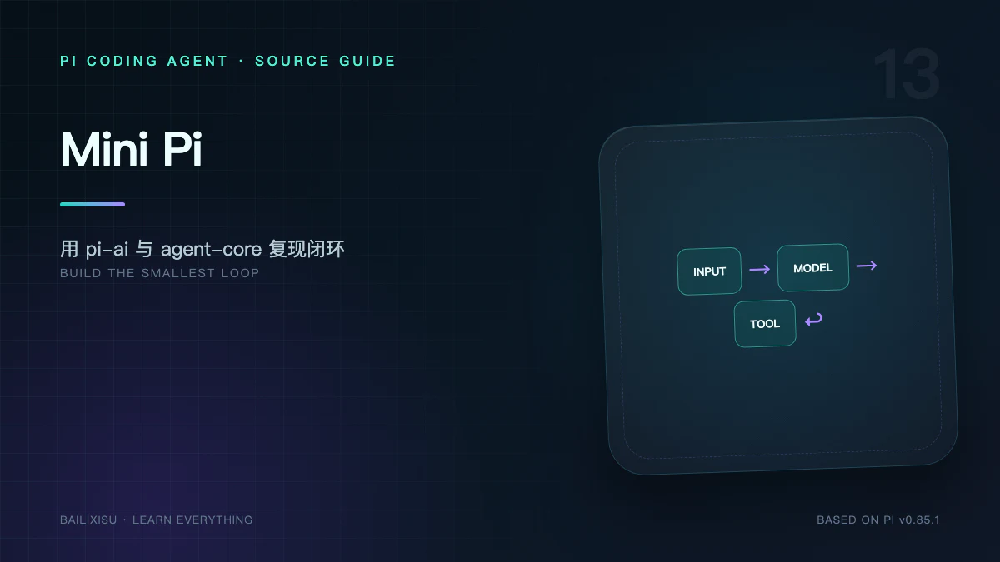
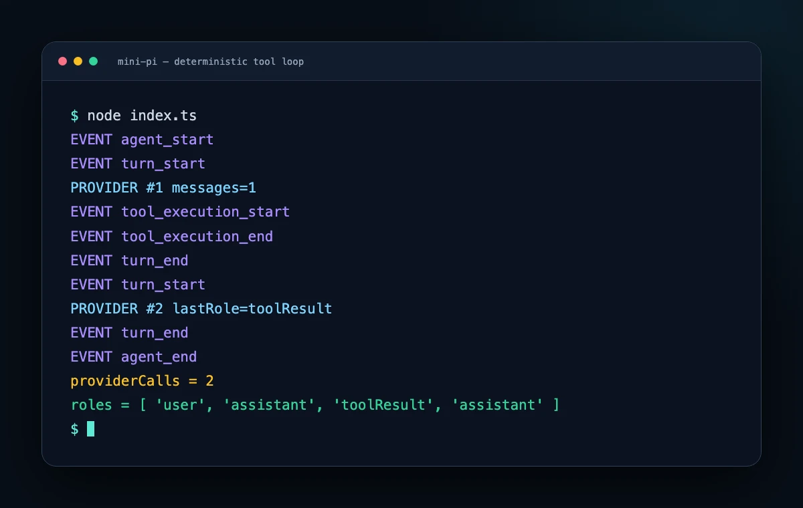

读完架构后，最有效的验证方式不是继续画图，而是亲手搭一个最小闭环：

```text
User Prompt
  → Fake Provider 返回 Tool Call
  → Agent 执行 Tool
  → Tool Result 进入 Context
  → Fake Provider 返回最终答案
```

本实验不使用真实 API Key，不产生模型费用，结果完全确定。

## 一、实验目标

验证六个事实：

1. `Agent.prompt()` 自动创建 User Message；
2. Provider 第一次看到一条 User Message；
3. Assistant Tool Call 会触发 Tool；
4. Tool Result 自动写回 Context；
5. Provider 被第二次调用；
6. 一次 Prompt 产生两个 turn、一个 agent run。

## 二、创建项目

```bash
mkdir mini-pi
cd mini-pi
npm init -y
npm install \
  @earendil-works/pi-agent-core@0.85.1 \
  @earendil-works/pi-ai@0.85.1 \
  typebox
npm install -D tsx typescript
```

在 `package.json` 加：

```json
{
  "type": "module",
  "scripts": {
    "start": "tsx index.ts"
  }
}
```

## 三、完整代码

创建 `index.ts`：

```ts
import { Agent } from "@earendil-works/pi-agent-core";
import {
  createAssistantMessageEventStream,
  type AssistantMessage,
  type Model,
  type TextContent,
  type ToolCall,
} from "@earendil-works/pi-ai";
import { Type } from "typebox";

const model: Model<any> = {
  id: "fake-model",
  name: "Deterministic Fake Model",
  api: "openai-completions",
  provider: "fake",
  baseUrl: "http://unused.local",
  reasoning: false,
  input: ["text"],
  contextWindow: 128_000,
  maxTokens: 4_096,
  cost: {
    input: 0,
    output: 0,
    cacheRead: 0,
    cacheWrite: 0,
  },
};

const zeroUsage = () => ({
  input: 0,
  output: 0,
  cacheRead: 0,
  cacheWrite: 0,
  totalTokens: 0,
  cost: {
    input: 0,
    output: 0,
    cacheRead: 0,
    cacheWrite: 0,
    total: 0,
  },
});

function assistant(
  content: Array<TextContent | ToolCall>,
  stopReason: "stop" | "toolUse"
): AssistantMessage {
  return {
    role: "assistant",
    content,
    api: model.api,
    provider: model.provider,
    model: model.id,
    usage: zeroUsage(),
    stopReason,
    timestamp: Date.now(),
  };
}

let providerCalls = 0;

const streamFn = (_model: Model<any>, context: any) => {
  providerCalls++;
  const stream = createAssistantMessageEventStream();

  queueMicrotask(() => {
    const pending = assistant([], "stop");
    pending.stopReason = "pending";
    stream.push({ type: "start", partial: pending });

    if (providerCalls === 1) {
      console.log(`PROVIDER #1 messages=${context.messages.length}`);

      const message = assistant(
        [
          {
            type: "toolCall",
            id: "call_add",
            name: "add",
            arguments: { a: 20, b: 22 },
          },
        ],
        "toolUse"
      );

      stream.push({
        type: "done",
        reason: "toolUse",
        message,
      });
    } else {
      const toolResult = context.messages.at(-1);
      console.log(`PROVIDER #2 lastRole=${toolResult.role}`);

      const message = assistant(
        [{ type: "text", text: "20 + 22 = 42" }],
        "stop"
      );

      stream.push({
        type: "done",
        reason: "stop",
        message,
      });
    }
  });

  return stream;
};

const addTool = {
  name: "add",
  label: "Add",
  description: "Add two numbers",
  parameters: Type.Object({
    a: Type.Number(),
    b: Type.Number(),
  }),
  async execute(_toolCallId: string, { a, b }: { a: number; b: number }) {
    return {
      content: [
        {
          type: "text" as const,
          text: String(a + b),
        },
      ],
      details: { a, b },
    };
  },
};

const agent = new Agent({
  initialState: {
    systemPrompt: "Use the add tool for arithmetic.",
    model,
    thinkingLevel: "off",
    tools: [addTool],
    messages: [],
  },
  streamFn,
});

agent.subscribe(event => {
  switch (event.type) {
    case "turn_start":
    case "turn_end":
    case "tool_execution_start":
    case "tool_execution_end":
    case "agent_start":
    case "agent_end":
      console.log("EVENT", event.type);
  }
});

await agent.prompt("请计算 20 + 22");

console.log("providerCalls =", providerCalls);
console.log(
  "roles =",
  agent.state.messages.map(message => message.role)
);
```

> `pending.stopReason` 的赋值只是为了构造最小 fake stream。正式 Provider 应从一开始创建 `stopReason: "pending"` 的 partial message，并在 terminal event 中提供已结算消息。

## 四、预期输出

省略部分对象细节后：

```text
EVENT agent_start
EVENT turn_start
PROVIDER #1 messages=1
EVENT tool_execution_start
EVENT tool_execution_end
EVENT turn_end
EVENT turn_start
PROVIDER #2 lastRole=toolResult
EVENT turn_end
EVENT agent_end
providerCalls = 2
roles = [ 'user', 'assistant', 'toolResult', 'assistant' ]
```



这四个 role 就是最小 ReAct-like 轨迹：

```text
user
assistant(toolCall)
toolResult
assistant(final text)
```

## 五、逐步解释

### 1. `Agent.prompt()`

字符串被转换为 User Message，先发出 message start/end，再进入 Provider 调用。

### 2. Fake Provider 第一次调用

返回含 `ToolCall` 的 Assistant Message，`stopReason = toolUse`。

我们省略 delta，只发送 `start + done`，所以没有文本流式更新，但最终消息完全合法。

### 3. Agent Loop 找到 `add`

按名称匹配 Tool，使用 TypeBox 验证 `{a,b}`，然后调用 execute。

### 4. Tool Result

返回文本 `42` 和结构化 details。Agent Loop 创建带 `call_add` 关联的 ToolResultMessage。

### 5. 第二轮 Provider

Context 最后一条消息已是 `toolResult`，说明结果确实完成了回灌。

### 6. 最终响应

Provider 返回普通文本且无 Tool Call，内层 Loop 结束。没有 Follow-up，最终发出 `agent_end`。

## 六、给 Fake Stream 加真实 Delta

要测试 UI streaming，可以在 `done` 前发送：

```ts
stream.push({
  type: "text_start",
  contentIndex: 0,
  partial,
});

stream.push({
  type: "text_delta",
  contentIndex: 0,
  delta: "20 + 22",
  partial,
});

stream.push({
  type: "text_end",
  contentIndex: 0,
  content: "20 + 22 = 42",
  partial,
});
```

真实 Adapter 必须同步更新 `partial.content`。Event 的 partial、delta 与最终 message 不一致会让 UI 抖动或显示错误。

## 七、验证参数错误

把第一次调用改为：

```ts
arguments: { a: "twenty", b: 22 }
```

预期：

- `addTool.execute()` 不运行；
- Agent Loop 生成 `isError: true` Tool Result；
- 第二次 Provider 仍被调用；
- 模型有机会修正参数。

这验证 Schema 校验位于真实副作用之前。

## 八、验证未知工具

把 name 改成 `subtract`，但不注册该工具。

预期同样不是进程崩溃，而是错误 Tool Result。每个 Tool Call 仍有配对结果。

## 九、验证并行执行

让第一次 Assistant 同时返回三个 Tool Call，并在工具中设置不同延迟：

```text
call A: 300ms
call B: 50ms
call C: 150ms
```

观察：

- `tool_execution_end` 可能按 B、C、A；
- Tool Result Message 仍按 A、B、C 进入 Agent State。

再给 Tool 增加：

```ts
executionMode: "sequential";
```

整个 batch 应按 source order 执行。

## 十、连接真实 Provider

把 Fake Stream 替换为 `pi-ai Models`：

```ts
import { createModels } from "@earendil-works/pi-ai";
import { anthropicProvider } from "@earendil-works/pi-ai/providers/anthropic";

const models = createModels();
models.setProvider(anthropicProvider());

const model = models.getModel("anthropic", "claude-sonnet-4-6");
if (!model) throw new Error("Model not found");

const agent = new Agent({
  initialState: {
    systemPrompt: "You are a concise assistant.",
    model,
    thinkingLevel: "off",
    tools: [addTool],
    messages: [],
  },
  streamFn: models.streamSimple.bind(models),
});
```

认证可以通过 Provider Credential Store 或对应环境变量。不要把 Key 写进代码和 Git。

## 十一、这个 Mini Pi 缺少什么

它已经有：

- Agent State；
- 模型流；
- Tool Use；
- Event；
- Steering/Follow-up 基础能力；
- Abort。

它没有 Coding Agent 产品层：

- CLI 与 TUI；
- ResourceLoader；
- AGENTS.md；
- Skills 和 Prompt Templates；
- Extensions；
- SessionManager；
- Retry；
- Compaction；
- Project Trust；
- 内置文件工具和输出截断。

这正好证明包边界：`pi-agent-core` 是循环内核，`pi-coding-agent` 才是完整 Coding Agent。

## 十二、从 Mini Pi 到自己的 Agent

推荐按这个顺序增加：

1. 先用 Fake Provider 测状态机；
2. 接一个真实 Provider；
3. 加只读 Tool；
4. 加 Session 持久化；
5. 加输出上限和 Abort；
6. 再加写操作与审批；
7. 最后做 UI 和 Extensions。

先做 Bash、再补安全和状态，往往会得到一个难以验证的危险原型。

## 十三、系列总结

整个 Pi 稳定架构现在可以还原为：

```text
main / Mode
  → Settings + Trust + Resources
  → createAgentSession
  → AgentSession Supervisor
  → Agent State
  → agentLoop
  → pi-ai ModelRuntime / Provider
  → Tool Registry
  → Session Tree / Compaction
  → Event 回到 TUI、JSON、RPC 或 SDK
```

而 experimental AgentHarness 进一步将“一次 Agent 工作”建模为可持久恢复的 Operation。

最值得借鉴的不是某个类名，而是这些设计原则：

- 模型协议与执行循环分离；
- 产品编排与 Agent Core 分离；
- Tool Call 必须有配对 Result；
- 完整历史与活动 Context 分离；
- Prompt 规则与强制安全边界分离；
- Durable Runtime 必须显式面对未知副作用。

## 源码索引

- [pi-agent-core README](https://github.com/earendil-works/pi/blob/v0.85.1/packages/agent/README.md)
- [pi-ai README](https://github.com/earendil-works/pi/blob/v0.85.1/packages/ai/README.md)
- [`packages/agent/src/agent.ts`](https://github.com/earendil-works/pi/blob/v0.85.1/packages/agent/src/agent.ts)
- [`packages/agent/src/agent-loop.ts`](https://github.com/earendil-works/pi/blob/v0.85.1/packages/agent/src/agent-loop.ts)
- [`packages/ai/src/types.ts`](https://github.com/earendil-works/pi/blob/v0.85.1/packages/ai/src/types.ts)
