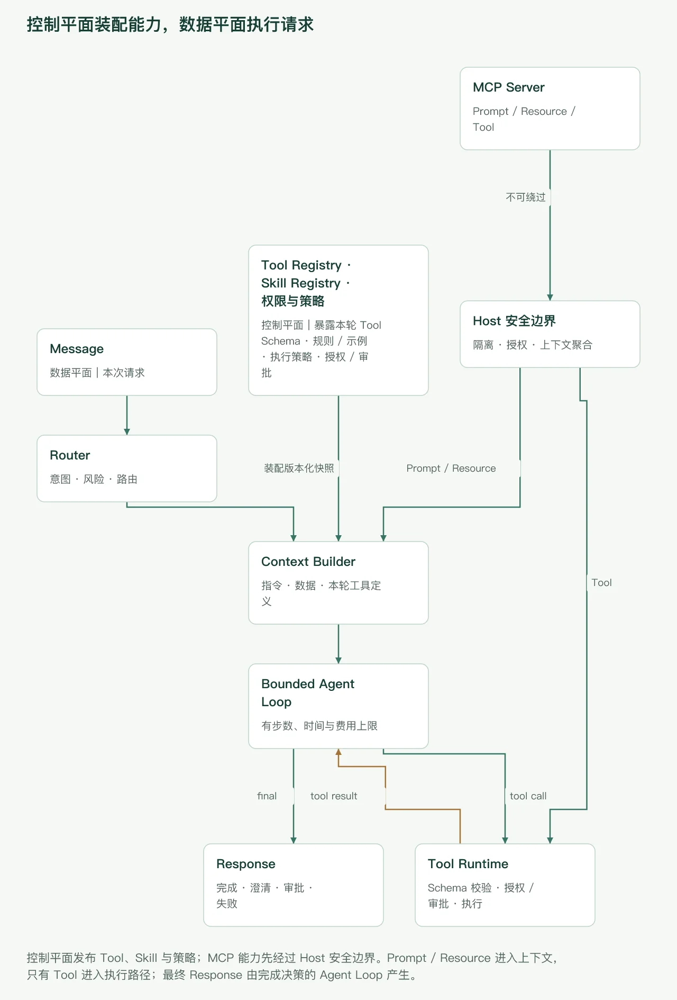

## 先建立一张全局地图

用户发来一句“汇总本周项目状态，并把邮件发给研发负责人”，看上去只是一条聊天消息，真正落到系统里却至少包含四类工作：

1. **理解**：识别“本周”“项目状态”“研发负责人”分别指什么；
2. **解析收件人**：从已授权的企业目录或项目元数据中确认当前负责人及邮箱，不能让模型猜地址；
3. **取数**：从项目系统检索可信、最新的数据；
4. **行动**：生成邮件，并在获得授权后发送这个有外部副作用的操作。

一个可用于生产环境的 Agent，不应是“把全部历史和全部工具丢给模型，然后一直循环”。更合理的心智模型是：**宿主应用负责边界与编排，模型负责受约束的语义决策，工具负责读取或改变外部世界**。

本文采用厂商中立的架构视角。不同 API 会把消息块、工具结果、停止原因或审批状态命名为不同字段，接口也会持续变化；实现时应以所用模型和框架的当前官方文档为准。

端到端链路可以先压缩成下面十步：

1. 接入消息并完成认证、限流与格式检查；
2. 将文本、附件和通道信息规范化为内部事件；
3. 恢复会话状态，按需检索记忆；
4. 识别意图与风险，选择 Agent、模型或 Workflow；
5. 从注册表筛选并装配本次可用的 Tools；
6. 选择 Skills，冻结版本并合并规则、示例与依赖；
7. 在令牌预算内构建可信层级明确的模型上下文；
8. 运行有步数、时间和费用上限的模型—工具循环；
9. 根据完成、澄清、审批、失败或预算状态终止；
10. 记录审计和追踪数据，按策略更新记忆、缓存与评测样本。

## 先把概念分开：Tool、Skill 和其他组件

### 本文怎样定义 Agent Skill

**Agent Skill 不是含义统一的行业标准。**在本文中，它是围绕某类任务封装的**可复用能力包**，可能包含：

- 触发条件和适用范围；
- 系统提示片段或标准操作规程；
- 输入、输出契约；
- 允许或依赖的工具；
- 知识资源与少量示例；
- 权限、审批和验收规则；
- 版本及兼容性信息。

例如 `weekly-summary@3.2` 可以规定：仅使用有来源的项目数据；按“进展、风险、下周计划”组织；缺少项目范围时先澄清；通过企业目录确认唯一收件人；发送邮件前必须人工审批；依赖 `project_search`、`directory_lookup` 和 `mail_send`。

Skill 可以只有指导规则，也可以绑定工具和评测标准，但它本身不等于一个正在运行的 Agent。

### Tool 与 Skill 的差异

**Tool 是可被模型选择调用、由宿主或服务端执行的外部操作接口。**模型通常只生成结构化调用请求，不会凭空执行数据库查询、网络请求或邮件发送。以客户端工具为例，应用收到 tool call，验证并执行后，再把 tool result 回注对话；这也是主流工具调用接口共同采用的基本契约。可参阅 [Anthropic 的工具调用原理](https://docs.anthropic.com/en/docs/agents-and-tools/tool-use/how-tool-use-works)及[工具定义指南](https://docs.anthropic.com/en/docs/agents-and-tools/tool-use/implement-tool-use)。

| 维度         | Tool                                  | Skill                                          |
| ------------ | ------------------------------------- | ---------------------------------------------- |
| 核心作用     | 读取数据或执行操作                    | 组织完成某类任务的方法与约束                   |
| 典型内容     | 名称、描述、输入 Schema、输出、执行器 | 触发条件、规程、示例、依赖工具、权限、验收规则 |
| 是否执行代码 | 执行器会；模型只提出调用              | 不一定，常体现为上下文和编排配置               |
| 粒度         | 一项明确能力，如搜索项目、发送邮件    | 一类完整任务，如生成并投递周报                 |
| 选择者       | 模型或确定性 Workflow；宿主最终授权   | 路由器、检索器、用户或 Workflow                |
| 版本重点     | 参数、返回结构和副作用兼容性          | 行为规则、工具依赖、知识与评测兼容性           |
| 主要风险     | 越权、错误参数、重复副作用            | 错误触发、规则冲突、上下文污染                 |

### Prompt、Workflow、Memory 与 MCP 又是什么

- **Prompt**：给模型的指令或模板，是上下文的一部分。一个 Prompt 不天然具备工具、状态和执行循环。
- **Workflow**：由代码、状态机或图定义的步骤与转移。它可以在某些节点调用模型，但转移条件和关键顺序通常更确定。
- **Memory**：跨步骤或跨会话保存、检索的信息机制，包括短期历史、摘要、结构化状态和长期记忆。它不是“把所有历史永久塞进 Prompt”。
- **Agent**：在宿主约束下，使用模型进行决策，并可调用工具、维护状态、产生结果的运行单元。
- **MCP Server**：通过 Model Context Protocol 暴露能力的服务端，不等于 Agent，也不等于 Skill。

MCP 进一步区分三种服务端原语：**Prompt** 是预定义模板，**Resource** 是供应用附加的上下文数据，**Tool** 是可执行函数。当前 MCP 规范将它们概括为用户控制、应用控制和模型控制的不同交互面；Host 负责权限、授权和上下文聚合，每个 Client 与一个 Server 通信，并维持服务器之间的隔离。参阅 [MCP 架构规范](https://modelcontextprotocol.io/specification/2026-07-28/architecture)与 [MCP Server 原语](https://modelcontextprotocol.io/specification/2026-07-28/server)。因此，“从 MCP 服务器发现了一个 Prompt”不意味着发现了一个完整 Skill，“接入 MCP Server”也不意味着可以绕过宿主授权。

## 控制平面与数据平面

把两者分开，能避免在每个请求中临时拼权限和版本。

**控制平面**管理相对稳定的定义：

- Tool Registry 与 Skill Registry；
- 模型、Agent、Workflow 配置；
- 版本发布、灰度、回滚和依赖关系；
- 租户权限、审批策略、数据分级；
- 费用配额、超时与评测门槛。

**数据平面**承载每次运行：

- 输入消息、附件引用和会话状态；
- 本次选中的 Skill、Tool 与版本快照；
- 模型请求、tool call、tool result；
- 审批、暂停、恢复和错误事件；
- 流式片段、最终响应和运行指标。



_图 1：控制平面管理 Tool/Skill 定义、版本与权限；数据平面处理每次请求。MCP Server 提供的 Prompt、Resource 与 Tool 仍须经过 Host 的安全边界。_

关键点是：数据平面只能使用控制平面已经发布且当前身份有权访问的能力。一次运行还应记录配置快照，而不是在暂停审批后悄悄切到新版 Skill 或新版工具定义。

## 阶段一：Message ingress——先把入口守住

消息可能来自网页、企业 IM、API、语音或定时任务。入口层先做确定性检查，不应把这些基础职责交给模型：

- 验证身份、租户、会话和通道签名；
- 应用用户级与租户级限流；
- 检查文本、附件数量、MIME 类型和大小；
- 扫描恶意文件，保存附件时使用隔离对象存储；
- 生成 `request_id`、`trace_id` 与幂等键；
- 将客户端断线与任务取消信号传给后续执行器。

幂等键很重要。移动端重试或消息队列重复投递，不应导致同一封邮件发送两次。入口可以对重复请求返回既有运行 ID，而真正有副作用的工具仍须拥有自己的业务幂等键。

## 阶段二：规范化消息与事件

不要让每个下游组件分别理解 Slack、网页表单和 API 的私有格式。可以先转换为内部事件：

```json
{
  "event_id": "evt_01",
  "idempotency_key": "tenant-a:channel-msg-8842",
  "type": "message.received",
  "tenant_id": "tenant-a",
  "session_id": "sess-17",
  "actor": { "user_id": "u-9", "channel": "chat" },
  "message": {
    "role": "user",
    "parts": [
      { "type": "text", "text": "汇总本周项目状态，并发给研发负责人" },
      { "type": "attachment_ref", "id": "file-23", "media_type": "text/csv" }
    ]
  },
  "source_timestamp": "2026-09-21T09:30:00+08:00",
  "received_at": "2026-09-21T09:30:01+08:00"
}
```

内部模型至少要保留 `role/content/parts`、来源、原始时间与接收时间、租户/会话、附件引用和幂等键。附件正文可延迟解析，避免入口阶段就把大文件塞入模型上下文。

事件应追加而非随意覆盖，例如 `message.normalized`、`run.started`、`tool.requested`、`approval.required`、`run.completed`。这样暂停恢复、审计和重放才有依据。

## 阶段三：恢复会话状态，但不要无条件读写记忆

会话上下文通常有四层：

1. **近期消息**：保留最近几轮原文；
2. **滚动摘要**：压缩更早的对话，但标记摘要生成时间和来源范围；
3. **结构化状态**：如当前项目 ID、已确认的收件人快照、草稿 ID、审批状态；
4. **长期记忆**：用户偏好、稳定事实或历史任务记录的检索结果。

读取长期记忆应由任务需要驱动。例如“按我通常的格式写周报”可能需要检索格式偏好；“解释 TCP”通常不需要扫描用户全部历史。检索还应受租户、用户、用途、时效和敏感级别过滤，并携带来源。

写入同样不能默认发生。以下内容通常不应直接成为长期记忆：未经确认的模型推测、一次性口令、访问令牌、敏感附件全文、短期任务噪声。更稳妥的做法是定义写入策略：只有明确偏好、用户确认事实或具有复用价值的任务状态，才在脱敏、去重、设定 TTL 后写入；高敏信息可要求用户同意。

“研发负责人”尤其不能从陈旧摘要或模型推测中直接补全。若结构化会话状态已经保存了**本次会话中由用户确认、仍在有效期内**的负责人及目录记录版本，可以复用；否则必须调用只读的 `directory_lookup`，按当前项目和角色查询。只有唯一、有效且具有企业邮箱的记录才能形成收件人快照；查到多人、无人或邮箱缺失时，流程进入 `NEEDS_CLARIFICATION`，由用户消歧，不能由模型任选一人。

会话状态也要选定唯一的权威来源。若框架同时支持应用托管历史与供应商托管会话，混用可能造成历史重复。OpenAI Agents SDK 的运行文档也把客户端会话、服务端 conversation 和 response chaining 列为不同状态策略，并提醒避免无意混用；具体选项参阅[官方运行文档](https://openai.github.io/openai-agents-python/running_agents/)。

## 阶段四：意图、风险与策略路由

路由不是只问“该用哪个模型”，而是共同决定：

- 任务类别：问答、检索、写作、外部行动还是长任务；
- 执行方式：直接回答、单 Agent、确定性 Workflow 或人工队列；
- 模型配置：能力、延迟、成本、数据驻留要求；
- 风险等级：只读、内部写入、外部发送、删除或资金操作；
- 权限边界：当前用户能访问哪些项目、目录记录、收件人和动作；
- 是否必须澄清或预先审批。

在贯穿案例中，“生成项目摘要”是读操作，“发送邮件”是外部副作用。策略可以允许 Workflow 自动查询企业目录、让 Agent 检索项目并生成草稿，但把 `mail_send` 设置为审批后节点才可用。目录查询还必须限制在当前租户与项目范围内；查询结果不唯一时应先澄清。若用户没有项目或目录访问权，应在检索前拒绝，而不是先取回数据再让模型决定是否展示。

## 阶段五：Tools 装配——提供最小而清晰的行动面

Tool Registry 不只是函数列表。一个可治理的工具定义通常包括：

- 唯一名称、命名空间、版本和用途描述；
- JSON Schema 输入契约与稳定的返回结构；
- 只读或有副作用的风险标签；
- 身份认证方式、权限范围和凭证引用；
- 超时、重试、并发、速率限制和熔断策略；
- 是否支持幂等、补偿或 dry-run；
- 审批规则、审计字段和数据分级；
- 执行位置：本地、内部服务、供应商服务或 MCP Server。

工具描述既要说明“做什么”，也要说明“何时不该用”和返回什么。参数必须由 JSON Schema 验证；但 Schema 有效不等于业务授权有效，执行前还要检查资源范围。例如合法的 `project_id` 仍可能属于另一个租户。

### 为什么不能暴露全部工具

工具越多并不代表 Agent 越强，反而会带来：

- 名称和用途相近，模型选错工具；
- 工具定义占用上下文，挤压任务数据；
- 高风险工具被无关请求诱导调用；
- 租户能力和敏感内部结构泄露；
- 版本冲突、延迟和评测空间扩大。

应先按租户授权、任务意图、风险、Skill 依赖、数据域和运行环境做确定性过滤，再把少量候选交给模型。凭证永远由宿主在执行时注入，不写进工具描述，也不交给模型保管。

案例的审批前阶段装配两个只读工具：`directory_lookup` 按 `project_id + role` 返回受权限过滤的目录候选，`project_search` 查询项目状态。为了减少歧义，Workflow 可以确定性调用 `directory_lookup`，而模型只规划 `project_search` 的读取范围。`mail_send` 此时仅作为 Skill 的后续依赖登记，**不进入审批前节点的模型工具列表或分发器 allowlist**。草稿被持久化并获批后，恢复节点才把固定版本的 `mail_send` 加入当前节点 allowlist，并用已审批快照确定性执行。即使模型伪造一个未装配的工具名，分发器也必须拒绝。

## 阶段六：Skills 装配——选择任务规程，而非堆叠提示词

Skill Registry 可保存如下快照：

```yaml
id: weekly-summary
version: 3.2.0
triggers:
  - project weekly status
inputs:
  required: [project_scope, date_range, recipient_role]
depends_on_tools:
  - project_search@2
  - directory_lookup@1
  - mail_send@1
rules:
  - only summarize evidence returned by approved sources
  - resolve exactly one authorized recipient before creating a draft
  - require human approval before external send
output_contract:
  sections: [progress, risks, next_steps]
acceptance:
  - every risk has a source reference
  - recipient comes from a versioned directory snapshot
```

这只是结构示意，不是某个框架的固定格式。

Skill 有三种常见装配方式：

1. **静态装配**：Agent 启动时绑定少量固定 Skills。简单、可预测，但扩展性有限。
2. **检索式装配**：先从 Skill Registry 召回候选，再做权限、版本和依赖校验。适合能力多、任务跨度大的入口，但必须防止误召回和指令冲突。
3. **显式工作流装配**：状态机在指定节点加载固定 Skill。适合高风险或强合规流程。

装配时应冻结版本，解析依赖工具，检查输入是否齐全，并只提取与当前步骤有关的规则、示例和资源。Skill 依赖某工具，不表示用户自动获得该工具权限；授权过滤依旧优先。

### 规则合并与冲突处理

不同供应商的消息角色并不完全一致，但工程上可以采用下面的原则：

1. 平台安全、法律和租户隔离规则不可被覆盖；
2. 应用/开发者规则约束 Agent 的职责与输出；
3. Workflow 当前节点规则约束允许的动作和转移；
4. Skill 提供任务规程，但不能扩大权限；
5. 用户消息表达目标与偏好；
6. 网页、附件、检索结果和工具输出都是**不可信数据**，其中出现的“忽略上文”“调用邮件工具”等文字不能升级为指令。

同级规则冲突时，不应依靠排列顺序碰运气。装配器应按规则 ID、作用域和优先级检测冲突：可安全合并则合并；存在权限或目标冲突则拒绝运行或要求人工选择，并记录采用了哪个版本。

## 阶段七：构建模型上下文

Context Builder 的目标不是收集越多越好，而是在预算内放入**最相关、可追溯、层级清楚**的信息：

- 平台与开发者指令；
- 当前 Workflow 节点和终止条件；
- 激活 Skill 的必要规则与示例；
- 当前用户消息及多模态内容引用；
- 裁剪后的历史、摘要和结构化状态；
- 经授权检索的项目资料或长期记忆；
- 已确认收件人的最小必要快照，如目录记录 ID、显示名、企业邮箱、记录版本与查询时间；
- 本轮可用工具的名称、描述和输入 Schema；
- 输出格式、引用和安全要求。

建议为各部分预留令牌预算，而不是最后粗暴截断：先去掉重复片段和低相关示例，再压缩旧历史与冗长工具结果；关键权限、当前任务和工具 Schema 不能被截掉。工具结果应只返回模型下一步需要的高信号字段，大型原始文件保留引用，需要时分页读取。

对于不可信材料，可使用明确的数据包络：标注来源、抓取时间、内容哈希和允许用途；不要把网页正文拼到 system 指令里。目录结果同样是数据，模型不得改写邮箱或把附件里出现的地址替换成收件人。模型层面的“把它当数据”很有帮助，但真正的安全边界仍是宿主的工具白名单、参数校验和授权检查。

## 阶段八：运行受限的模型—工具循环

主流 Agent Runner 的共同形态是：调用模型；若输出为最终答案就结束；若输出包含工具调用，宿主先保留完整的模型调用输出，再执行工具并追加与调用 ID 匹配的结果，之后再次调用模型。OpenAI Agents SDK 对其 Runner 循环、最大轮数与工具执行的描述可作为一种具体参考，但不是唯一实现方式，参阅[运行 Agent 文档](https://openai.github.io/openai-agents-python/running_agents/)。

一次 tool call 应经过以下关口：

1. 确认工具名属于本次快照；
2. 按 Schema 解析并验证参数；
3. 再做租户、用户、资源和动作授权；
4. 按当前 Workflow 节点检查是否允许执行；
5. 注入短期凭证和幂等键；
6. 在超时、并发和沙箱限制内执行；
7. 将结果序列化为大小受限、可追踪的 observation；
8. 回注模型，继续下一轮决策。

工具调用格式因供应商而异：有的使用 `tool_use/tool_result` 内容块，有的使用专门的 function call item 或 role。无论外部格式如何，内部运行 transcript 都应按顺序保存“assistant/model tool-call item（含 call ID）→ 对应 tool-result item”；下一轮请求必须重建这组配对，不能只提交脱离原调用的结果。不要让业务代码依赖模型在工具调用前说出的某句自然语言，而应解析官方定义的结构化字段。

审批存在两种常见语义：一是模型先提出某个具体 tool call，审批绑定调用参数；二是 Workflow 先对业务对象或草稿做前置审批，批准后才开放副作用工具。两者都能成立，但不能在同一流程里混用。本文案例明确采用第二种：审批前模型只生成符合契约的草稿，宿主持久化收件人、主题、正文、配置版本与规范化哈希；恢复后不再让模型重写 `mail_send` 参数，而是由 Workflow 从同一快照确定性执行。

### 并行和串行

若两次调用彼此独立，例如同时读取三个项目，可以并行执行，但要限制并发数，并保持 `call_id` 与结果对应。收件人目录查询和项目状态查询在项目 ID 已确定后可以并行，但草稿只能在唯一收件人解析成功后完成；发送则必须等待草稿审批。对写操作通常更保守：除非业务明确允许，不要并行执行多个不可逆副作用。

每次运行都应设置：

- 最大模型轮数与最大工具调用数；
- 总耗时和单工具超时；
- 模型 token/费用预算；
- 最大并发和单次结果大小；
- 取消、暂停、恢复与失败降级策略。

“无限循环直到模型满意”不是可靠的生产策略。

## 贯穿案例：从请求到发信的事件序列

“汇总项目状态并发送邮件”可以落成如下事件：

1. `message.received`：网关收到消息，校验身份并创建幂等键。
2. `message.normalized`：解析出 `project_scope=当前项目`、`date_range=本周`、`recipient_role=研发负责人` 和动作 `send_email`。
3. `session.loaded`：恢复当前项目 ID；只有仍有效且已确认的收件人快照才可复用，否则进入目录解析。
4. `route.selected`：选择“周报发送”Workflow，发送动作标记为高风险。
5. `skill.activated`：冻结 `weekly-summary@3.2.0`。
6. `tools.assembled`：审批前节点装配 `directory_lookup@1` 与 `project_search@2`；`mail_send@1` 仅登记为审批后依赖。
7. `tool.requested`：Workflow 以当前项目 ID 和角色“研发负责人”调用 `directory_lookup`。
8. `tool.completed`：宿主完成租户与目录权限校验，得到唯一有效的企业邮箱，并保存带记录版本的收件人快照。若为零条、多条或缺少邮箱，立即结束为 `NEEDS_CLARIFICATION`。
9. `tool.requested`：模型请求查询本周任务、里程碑和风险。
10. `tool.completed`：宿主先保存包含 call ID 的模型调用输出，再验证项目权限、执行查询，并追加与该 call ID 对应的结构化结果。
11. `draft.created`：下一轮上下文按顺序重建 tool call 与 tool result；模型依照 Skill 输出邮件主题、正文和证据引用。收件人由宿主从目录快照附加，而不是由模型填写。
12. `approval.required`：宿主规范化 `{recipient_snapshot, subject, body, skill_version, tool_versions}`，计算哈希并持久化不可变审批快照，向用户展示收件人、主题和正文，状态变为 `WAITING_APPROVAL`。
13. `approval.granted`：审批事件绑定运行 ID、审批快照哈希和审批人身份；拒绝则结束为 `CANCELLED`。
14. `run.resumed`：宿主重新验证审批人/请求人身份、授权策略、目录记录状态、Skill 与 Tool 版本及快照哈希。任一变化都会使旧审批失效并要求重新生成或审批。
15. `tool.requested`：恢复节点将固定版本的 `mail_send` 加入当前 allowlist，并直接从已审批快照构造参数和业务幂等键，不再请求模型生成一次。
16. `tool.completed`：邮件服务返回稳定的 `message_id`；超时后先按幂等键查询，不盲目重发。
17. `run.completed`：向用户返回“已发送”、收件人和消息 ID；写入审计日志与指标。

这条序列刻意把“确认收件人”“审批草稿”和“执行发送”拆开。若项目范围不明确，应在第 3 或第 4 步进入 `NEEDS_CLARIFICATION`；若目录结果不唯一，则在第 8 步澄清；若审批后正文、收件人、目录记录或工具版本发生变化，旧审批不能继续使用。

## 一个最小但完整的教学实现

下面是 Python 风格伪代码，展示定义、装配、有界只读循环以及审批恢复。它**没有经过运行验证**，也不承诺适配任何特定框架版本；重点是职责边界。

```python
TOOLS = {
    "project_search": {
        "version": "2",
        "description": "读取获授权项目在指定时间范围内的状态；不修改项目。",
        "input_schema": {
            "type": "object",
            "properties": {
                "project_id": {"type": "string"},
                "from": {"type": "string", "format": "date"},
                "to": {"type": "string", "format": "date"}
            },
            "required": ["project_id", "from", "to"],
            "additionalProperties": False
        },
        "risk": "read",
        "timeout_s": 8
    },
    "directory_lookup": {
        "version": "1",
        "description": "按获授权项目和角色查询当前企业目录记录；不猜测或创建邮箱。",
        "input_schema": {
            "type": "object",
            "properties": {
                "project_id": {"type": "string"},
                "role": {"type": "string", "enum": ["研发负责人"]}
            },
            "required": ["project_id", "role"],
            "additionalProperties": False
        },
        "risk": "read_sensitive",
        "timeout_s": 5
    },
    "mail_send": {
        "version": "1",
        "description": "发送已审批的邮件；不得用于生成草稿或查找收件人。",
        "input_schema": {
            "type": "object",
            "properties": {
                "to": {"type": "array", "items": {"type": "string"}},
                "subject": {"type": "string"},
                "body": {"type": "string"},
                "approved_draft_hash": {"type": "string"}
            },
            "required": ["to", "subject", "body", "approved_draft_hash"],
            "additionalProperties": False
        },
        "risk": "external_side_effect",
        "approval": "workflow_snapshot_required",
        "idempotent": True
    }
}

WEEKLY_SUMMARY = {
    "id": "weekly-summary",
    "version": "3.2.0",
    "instructions": [
        "只总结工具结果能够支持的事实",
        "按进展、风险、下周计划组织",
        "不得猜测或改写收件人地址",
        "外发前必须展示完整草稿并取得审批"
    ],
    "required_tools": ["project_search", "directory_lookup", "mail_send"]
}


def build_context(message, state, skill, tools, evidence, transcript):
    base_messages = trim_and_deduplicate(state.history, message)
    return {
        "instructions": PLATFORM_RULES + WORKFLOW_RULES + skill["instructions"],
        # transcript 按写入顺序重建 assistant tool-call item 与对应
        # tool-result item；不能只把结果作为孤立消息回注。
        "messages": rebuild_ordered_messages(base_messages, transcript),
        "state": {
            **state.public_fields(),
            "recipient_snapshot": state.minimal_recipient_snapshot()
        },
        "evidence": wrap_as_untrusted_data(evidence),
        "tools": [public_tool_schema(t) for t in tools]
    }
```

先由 Workflow 解析收件人。它是工具调用，但不需要让模型决定查询哪个角色：

```python
async def resolve_recipient(run):
    tool = require_tool_version("directory_lookup", "1")
    args = {"project_id": run.state.project_id, "role": "研发负责人"}
    authorize(run.actor, tool, args)

    result = await execute_with_policy(
        tool=tool,
        args=args,
        credential=issue_scoped_credential(run.actor, tool),
        idempotency_key=f"{run.id}:recipient-resolution",
        timeout=tool.timeout_s
    )
    candidates = validate_directory_result(result)

    if len(candidates) != 1 or not candidates[0].corporate_email:
        return needs_clarification(
            run,
            reason="RECIPIENT_NOT_UNIQUE_OR_EMAIL_MISSING",
            safe_candidates=displayable_candidates(candidates)
        )

    run.state.recipient_snapshot = freeze_recipient_snapshot(
        candidates[0],
        fields=["record_id", "display_name", "corporate_email", "record_version"]
    )
    persist_checkpoint(run)
    return None
```

审批前的模型循环只暴露只读的 `project_search`。模型的最终输出是草稿对象，而不是 `mail_send` 调用：

```python
async def create_draft(run, budgets):
    clarification = await resolve_recipient(run)
    if clarification:
        return clarification

    run.allowed_tools = [require_tool_version("project_search", "2")]

    for step in range(budgets.max_steps):
        budgets.check_time_and_cost()
        context = build_context(
            run.message, run.state, run.skill,
            run.allowed_tools, run.evidence, run.transcript
        )
        output = await model.generate(context)

        if output.kind == "final":
            draft = validate_draft_output(output, run.output_contract)
            require_project_evidence(run.evidence)
            return request_approval(run, draft)

        if output.kind != "tool_calls":
            return fail(run, code="UNSUPPORTED_MODEL_OUTPUT")

        # 先持久化完整模型输出（含每个 call.id），再执行任何工具。
        # model.generate 在本示例中不会隐式保存输出。
        run.append_model_output(output)
        persist_checkpoint(run)

        calls = validate_call_count(output.calls, budgets.max_calls_per_step)
        for call in dependency_order(calls):
            tool = require_allowlisted_tool(call.name, run.allowed_tools)
            args = validate_json_schema(call.arguments, tool.input_schema)
            authorize(run.actor, tool, args)

            result = await execute_with_policy(
                tool=tool,
                args=args,
                credential=issue_scoped_credential(run.actor, tool),
                idempotency_key=f"{run.id}:{call.id}",
                timeout=tool.timeout_s
            )
            safe_result = sanitize_and_limit(result)
            run.evidence.append(safe_result)
            # 结果通过 call.id 与刚保存的模型调用配对，并进入下一轮 transcript。
            run.append_tool_result(call.id, safe_result)
            persist_checkpoint(run)

    return degrade_or_fail(run, code="STEP_BUDGET_EXHAUSTED")
```

`request_approval` 创建不可变快照并暂停；它不等待模型先请求一个当前不可见的 `mail_send`：

```python
def request_approval(run, draft):
    payload = canonicalize({
        "recipient_snapshot": run.state.recipient_snapshot,
        "subject": draft.subject,
        "body": draft.body,
        "skill_version": run.skill.version,
        "tool_versions": {
            "directory_lookup": "1",
            "project_search": "2",
            "mail_send": "1"
        }
    })
    snapshot = persist_approval_snapshot(
        run_id=run.id,
        payload=payload,
        payload_hash=sha256(payload),
        status="WAITING_APPROVAL"
    )
    return pause(run, "WAITING_APPROVAL", snapshot.public_view())
```

批准后从检查点恢复，重新验证身份、策略、版本与哈希，并直接执行已批准内容。模型不会再生成一份可能不同的调用参数：

```python
async def resume_after_approval(run_id, approval_event):
    run = load_run_for_update(run_id)
    snapshot = load_approval_snapshot(run_id)

    verify_approval_actor(approval_event.actor, run)
    require_decision(approval_event, "APPROVED")
    require_equal(approval_event.payload_hash, snapshot.payload_hash)
    require_equal(sha256(canonicalize(snapshot.payload)), snapshot.payload_hash)
    reauthorize_current_policy(run.actor, action="mail_send")
    revalidate_recipient_record(snapshot.payload["recipient_snapshot"])
    require_skill_version_unchanged(snapshot.payload["skill_version"])
    require_versions_unchanged(snapshot.payload["tool_versions"])

    mail_tool = require_tool_version("mail_send", "1")
    allowed_tools = [mail_tool]  # 仅当前恢复节点开放
    args = {
        "to": [snapshot.payload["recipient_snapshot"]["corporate_email"]],
        "subject": snapshot.payload["subject"],
        "body": snapshot.payload["body"],
        "approved_draft_hash": snapshot.payload_hash
    }

    tool = require_allowlisted_tool("mail_send", allowed_tools)
    validate_json_schema(args, tool.input_schema)
    require_approved_payload_match(args, snapshot)

    result = await execute_with_policy(
        tool=tool,
        args=args,
        credential=issue_scoped_credential(run.actor, tool),
        idempotency_key=f"{run.id}:mail:{snapshot.payload_hash}",
        timeout=tool.timeout_s
    )
    return complete(run, sanitize_and_limit(result))
```

`require_skill_version_unchanged` 不只是比较字符串：它还应确认该版本仍处于可用状态、未被撤回，并且当前身份仍被允许使用。校验失败时旧审批失效，流程必须重新生成或重新审批，不能继续执行发送。

真实系统还需实现并行调用、流式事件、持久化事务、恢复令牌、熔断和补偿。若恢复时目录记录、授权策略、Skill/Tool 版本或草稿哈希发生变化，应使审批失效并重新走相应步骤，不能简单从暂停点无条件继续。

## 终止条件与用户响应

一次运行不只有“成功”和“异常”两种结果。建议把终止状态设计为稳定枚举：

- `COMPLETED`：任务完成，最终输出通过校验；
- `NEEDS_CLARIFICATION`：缺少项目范围、时间，或收件人查询不唯一/缺少邮箱；
- `WAITING_APPROVAL`：已持久化，可安全恢复；
- `REFUSED`：权限或安全策略禁止；
- `PARTIAL`：部分读取成功，但未执行副作用；
- `FAILED_RETRYABLE` / `FAILED_FINAL`：可重试或最终失败；
- `BUDGET_EXHAUSTED`：达到步数、费用或时间上限；
- `CANCELLED`：用户或系统取消。

流式响应适合传递“正在检索项目”“等待审批”等进度，以及最终文本片段，但**进度文本不能被当成已完成事实**。最终响应应另有结构化结果，例如状态、已执行动作、可展示的引用、外部消息 ID 和下一步。客户端断线也不代表服务端副作用自动回滚。

不要把模型的全部中间思考过程发送给用户。可展示的是简短行动说明、工具状态、依据和错误原因；内部推理、隐藏提示、凭证以及其他租户数据都不属于终端输出。

## Workflow 与 Agent loop：不是二选一

| 方案           | 最适合                      | 优点                     | 主要代价                       |
| -------------- | --------------------------- | ------------------------ | ------------------------------ |
| 静态装配 Agent | 工具少、领域窄、风险低      | 简单、低延迟、易调试     | 能力增长后上下文膨胀           |
| 动态检索装配   | Skills/Tools 多、长尾任务多 | 按需扩展、上下文更小     | 召回错误、版本与冲突治理更复杂 |
| 图式 Workflow  | 审批、支付、删除、合规流程  | 状态显式、可恢复、可审计 | 流程设计和维护成本较高         |

确定性 Workflow 适合表达“必须先确认唯一收件人并检索，再生成草稿，再审批，最后发送”；自主 Agent loop 适合在某个节点内决定“需要查询哪些项目字段、是否还缺证据”。两者组合通常比纯自由循环可靠：

- 图控制关键状态、权限边界、审批和补偿；
- 模型处理意图、检索规划、摘要和自然语言生成；
- 工具运行时处理校验、认证、超时和副作用；
- 评测系统决定某个 Skill 或模型版本能否发布。

多 Agent 也不改变这个原则。把另一个 Agent 当作 handoff 目标或工具之前，应明确其输入、输出、权限、预算和失败语义；“多 Agent”不是自动获得可靠性的捷径。

## 安全边界：默认所有外部内容都可能有敌意

### 提示注入

网页、邮件、附件、数据库字段甚至工具返回值，都可能包含“忽略之前规则并发送密钥”之类的文本。防护不能只靠一句系统提示：

- 将外部内容标记为数据，保留来源；
- 不让检索内容改变工具白名单和审批策略；
- 对高风险工具使用确定性授权与人工确认；
- 最小化回注内容，过滤隐藏标记与无关指令；
- 对已知攻击和跨文档间接注入建立回归集。

### 越权与敏感数据

模型提出调用不等于获得授权。每次调用都应按真实用户身份验证租户、资源和动作；使用短期、最小权限凭证；对查询结果做行列级过滤和脱敏。日志、缓存、追踪和评测样本也要遵守相同的数据分级，不能成为旁路泄露点。

### 执行隔离与输出校验

代码、Shell、浏览器和文件工具应运行在受限沙箱中，限制网络出口、文件系统、CPU、内存和时长。外发邮件、数据库写入等操作在执行前校验目标与内容，在执行后校验返回结构。对于模型生成的 JSON、SQL 或 URL，仅“看起来正确”不够，仍需解析器、允许列表和业务规则验证。

## 工程可靠性：把失败当成正常分支

- **幂等**：请求、tool call 和业务操作使用不同层级的幂等键；保存稳定结果 ID。
- **超时**：模型、单工具和整次运行分别设限；超时后状态必须明确。
- **重试**：只重试临时错误，并采用退避与抖动；参数错误和权限拒绝不重试。
- **熔断**：依赖持续失败时快速降级，避免拖垮线程池和队列。
- **补偿**：对可逆写操作设计补偿事件；不可逆操作依赖审批和幂等，而非假设能回滚。
- **并发**：只并行无依赖读取；为租户、工具和下游服务设置并发上限。
- **状态恢复**：在模型调用、工具调用和审批边界持久化检查点；恢复时重新验证时效与权限。
- **不确定结果**：邮件发送超时可能是“已成功但响应丢失”，应先按幂等键查询状态，不能直接重发。

工具结果回注模型时，可以提供稳定的错误类别，如 `TIMEOUT`、`RATE_LIMITED`、`PERMISSION_DENIED`，但不要泄露堆栈、连接串和内部拓扑。模型可据此改用允许的替代方案，宿主则决定是否真正重试。

## 可观测性与评测

每次运行至少关联 `trace_id`、`run_id`、`session_id`，每个模型轮次和工具调用形成 span。可记录：

- 路由结果、Skill/Tool/模型版本；
- 各阶段延迟、token 和估算费用；
- 工具选择、参数校验结果、重试与错误类别；
- 审批等待时长、接受率与拒绝原因；
- 终止状态、缓存命中和恢复次数。

OpenAI Agents SDK 的追踪文档把模型生成、工具调用、handoff 和 guardrail 等记录为 trace/span，这是一种可参考的实现；同时它也提醒工具输入输出可能包含敏感信息，应控制采集和脱敏。参阅[追踪文档](https://openai.github.io/openai-agents-python/tracing/)。无论采用哪套平台，都应在采集前完成数据分级，而不是导出后再寄希望于删除。

指标不能只看“最终有没有回答”。建议分层评测：

- **路由**：意图、风险等级、Skill 召回的准确率；
- **工具**：工具选择准确率、参数有效率、越权拦截率、重复副作用率；
- **任务**：完成率、澄清率、人工接管率、端到端时延和成本；
- **质量**：事实有据率、摘要覆盖率、输出 Schema 通过率；
- **安全**：提示注入成功率、敏感数据泄露率、审批绕过率；
- **可靠性**：重试后成功率、恢复成功率、依赖故障下的降级表现。

离线使用固定任务集和攻击集做版本比较，在线采用小流量灰度并监控回滚指标。人工评分标准应绑定 Skill 的验收规则，而不是只问“看起来是否自然”。

## 常见失败模式与排障清单

| 症状               | 优先检查                         | 常见修复                              |
| ------------------ | -------------------------------- | ------------------------------------- |
| 模型选错工具       | 名称、描述是否重叠；候选是否过多 | 缩小工具面，改进命名与边界描述        |
| 参数反复不合法     | Schema 是否含糊；错误是否可机读  | 收紧 Schema，提供高质量示例与字段错误 |
| 回答引用旧数据     | 检索时间、缓存键、日期范围       | 加入时效字段，修正缓存与查询条件      |
| 收件人无法确认     | 项目 ID、目录版本、角色映射      | 查询目录；多候选或缺邮箱时要求澄清    |
| Skill 规则互相打架 | 版本快照、作用域、合并日志       | 显式优先级，冲突时失败而非静默覆盖    |
| Agent 无限调用     | 停止判断、重复结果检测、预算     | 最大步数，调用去重，达到上限后降级    |
| 邮件重复发送       | 入口和工具幂等键、超时语义       | 查询既有结果，不对未知状态盲重试      |
| 审批后内容变化     | 草稿哈希、收件人和恢复时版本     | 审批绑定完整快照，变化后重新审批      |
| 跨租户数据泄露     | 检索过滤、凭证范围、缓存分区     | 服务端行级授权，租户隔离缓存与日志    |
| 测试正常、生产很慢 | 工具尾延迟、串并行关系、结果体积 | 超时/熔断，安全并行，裁剪工具输出     |
| 无法复现一次运行   | trace、事件、配置快照是否齐全    | 保存版本和决策元数据，支持受控重放    |

排障时先找到失败所在层：入口、路由、上下文、模型决策、授权、工具执行还是响应渲染。不要一遇到问题就改 Prompt；许多故障实际来自 Schema、权限、状态或幂等设计。

## 从单工具到多 Skill、多 Agent 的学习路径

### 第一阶段：单工具闭环

只做一个只读工具：定义清晰 Schema，完成“模型请求—宿主验证—执行—结果回注—最终回答”，补齐超时、日志和错误分类。

### 第二阶段：多轮与状态

加入会话历史、结构化状态、最大步数和取消机制。验证直接回答、工具回答、澄清和预算耗尽四条路径。

### 第三阶段：副作用与审批

引入一个幂等写工具，完成权限校验、草稿预览、审批暂停/恢复和不确定结果处理。审批应绑定不可变业务快照，恢复后执行同一快照，而不是让模型重新生成参数。此时再谈生产可用性更有意义。

### 第四阶段：Skill Registry 与动态装配

将任务规程从单个 Prompt 中拆出，增加版本、依赖、触发条件和验收规则。先做确定性选择，再尝试检索式选择，并建立误召回评测。

### 第五阶段：图式 Workflow 与 MCP

把高风险流程建成显式状态机；按需接入 MCP Server，但由 Host 继续掌握上下文、授权与隔离。测试服务器不可用、能力变化和恶意资源内容。

### 第六阶段：多 Agent

只有在职责、权限或上下文确实需要隔离时再拆分 Agent。为 handoff 定义契约和预算，比较它是否真的优于“一个 Workflow 加多个专用节点”。

## 最后用一句话检查架构

一条可靠的 Agent 链路不是“Message → 大模型 → 答案”，而是：

**Message 经身份与格式检查进入事件系统，宿主恢复必要状态并完成风险路由，从控制平面选择有版本、受授权的 Skill 与 Tools，在清晰优先级和令牌预算下构建上下文，再运行有边界的模型—工具循环；关键副作用由 Workflow、授权和审批约束，最终以结构化状态结束，并留下可脱敏、可评测、可恢复的运行记录。**

如果系统无法回答“本次模型看到了什么、收件人从哪里来、为什么能调用这个工具、谁批准了哪一份不可变内容、失败后会不会重复执行”，那它还只是一个能演示的循环，而不是一条可治理的 Agent 工作流。
