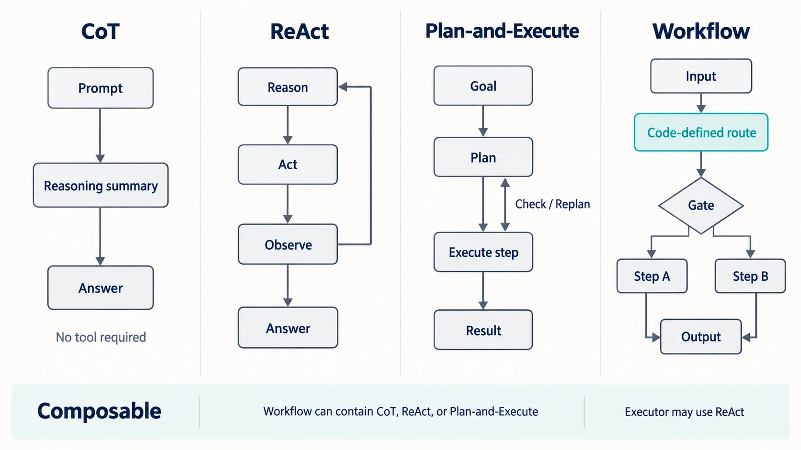

## 一句话先说清

**Chain-of-Thought（CoT）是推理/提示策略，ReAct 是“推理—行动—观察”交错的 agent 循环，Plan-and-Execute 是“先全局规划、再执行并按需重规划”的控制模式，而 Workflow 是由代码预定义控制路径的系统编排范式。**

所以，它们不是同一层级上的四个互斥框架。合理的问题不是“哪个最好”，而是：**当前任务需要哪一层能力，它们应当如何组合？**

比较时，可以统一看六个维度：

1. **谁控制下一步**：模型，还是程序；
2. **路径何时形成**：开发时预定义，还是运行时动态决定；
3. **是否接触环境**：只生成文本，还是调用搜索、数据库、浏览器等工具；
4. **规划范围**：只决定下一步，还是先构造全局计划；
5. **如何利用反馈**：不反馈、逐步观察，或检查后重规划；
6. **工程代价**：调用次数、延迟、可控性、容错和状态管理成本。

| 模式             | 所在层级       | 下一步主要由谁决定             | 工具/环境反馈 | 全局计划         | 典型特征                     |
| ---------------- | -------------- | ------------------------------ | ------------- | ---------------- | ---------------------------- |
| CoT              | 推理与提示策略 | 模型在单次或少量调用中完成推理 | 非必需        | 不要求           | 把复杂推理拆成中间步骤       |
| ReAct            | Agent 行动循环 | 模型依据最新观察动态决定       | 核心组成      | 通常较弱或局部   | Reason → Act → Observe 循环  |
| Plan-and-Execute | Agent 控制模式 | Planner 定计划，Executor 执行  | 通常需要      | 核心组成         | 规划与执行分离，可按需重规划 |
| Workflow         | 系统编排范式   | 代码定义路径、路由和门禁       | 可有可无      | 由开发者预先设计 | 稳定、可审计、便于权限控制   |

## 一张图看懂四种控制流



_图 1：四种模式的关键差异在于谁决定下一步、路径何时形成，以及是否依据环境反馈动态调整。底部关系也很重要：Workflow 可以容纳另外三种模式，而 Plan-and-Execute 的 Executor 可以采用 ReAct。_

图中的 `Reasoning summary` 指可输出、可审计的步骤摘要，并不代表系统能够或应该读取模型的私密内部思维链。生产系统更适合保存计划、工具参数、观察结果、决策标签和简短理由，而不是依赖冗长的自由文本推理。

## CoT：让模型处理多步推理，但它不是 agent

[CoT 原始论文](https://arxiv.org/abs/2201.11903)把它描述为生成一系列中间推理步骤，并通过带有推理示例的提示改善算术、常识和符号推理任务。其本质发生在**模型推理层**：输入问题，组织中间步骤，给出答案。

典型流程可以抽象为：

```text
问题 → 分解/推导 → 校验关键约束 → 答案
```

这里不需要工具，也没有持续运行的环境循环。即使应用让模型输出“步骤 1、步骤 2”，它也不因此成为 agent。

**优势**

- 适合算术、逻辑、约束满足、文本分析等纯多步推理；
- 架构最简单，通常只需一次或少量模型调用；
- 相比多轮 agent，延迟、状态和失败面更小。

**局限**

- 无法自行获得训练上下文之外的实时事实；
- 中间步骤可能把早期错误继续传递下去；
- 对需要真实执行、验证或修改外部状态的任务无能为力；
- 要求模型展示完整思维过程并不等于结果更可靠，也不应把隐藏推理当作可观测接口。

**成本画像**：调用少、延迟低；程序控制较强，但面对新环境的适应性低。适合“需要想清楚，但不需要出去做事”的问题。

## ReAct：每行动一步，就根据观察决定下一步

[ReAct 论文](https://arxiv.org/abs/2210.03629)的核心不是“模型会调用工具”，而是让推理、行动与环境观察**交错进行**。环境返回的新证据会进入下一轮判断：

```text
任务
  → 选择下一项行动
  → 调用工具
  → 读取观察结果
  → 更新当前判断
  → 继续行动或结束
```

例如，搜索没有返回目标页面，agent 可以改写查询；机票超过预算，则转而检查相邻日期。这种局部反馈循环让 ReAct 很适合步数不多、路径事先难以确定的交互任务。

**优势**

- 能利用实时搜索、数据库、代码执行等环境反馈；
- 遇到异常时可在下一轮调整行动；
- 每轮工具调用和观察都可以形成较直观的审计轨迹。

**局限**

- 偏局部决策，长任务中容易“走一步看一步”，偏离最终目标；
- 历史持续增长，会增加 token、延迟和上下文干扰；
- 错误行动会改变环境，高风险工具不能只靠提示约束；
- 若没有最大轮数、失败预算或完成判定，可能循环不止。

**成本画像**：每一轮至少包含模型决策和工具等待，调用数与延迟通常高于 CoT；适应性较高，可控性取决于工具边界、停止条件和权限设计。

## Plan-and-Execute：把“想全局”和“做局部”分开

Plan-and-Execute 先由 Planner 根据目标生成任务计划，再让 Executor 逐项完成。执行结果可以触发检查、修改剩余步骤或重新规划：

```text
目标 → 全局计划 → 执行步骤 1 → 检查
                         ↓
                   执行步骤 2 → …… → 汇总
                         ↑
                      必要时重规划
```

[LangChain 对该模式的早期说明](https://www.langchain.com/blog/plan-and-execute-agents)明确区分了 Planner 与 Executor，也指出它更适合复杂、长期规划，代价是更多模型调用。该页面介绍的是当时的实验实现；本文讨论的是更一般的控制模式，而非绑定某个库或版本。

**优势**

- 全局计划让系统更容易维持目标、依赖关系与完成标准；
- 规划与执行职责分离，可使用不同模型、提示和权限；
- 能在执行前展示计划，便于估算成本、插入审批和并行化；
- 单个步骤失败时，可以局部重试或调整后续计划。

**局限**

- 初始计划可能基于错误假设，执行后必须允许更新；
- 规划、执行、检查和重规划会增加调用与端到端延迟；
- 计划粒度太粗，Executor 无从下手；太细，又会产生编排开销；
- 需要维护计划版本、步骤依赖、中间产物和完成状态。

**成本画像**：四者中往往调用最多、状态最复杂，但对长程目标比纯 ReAct 更有结构。可让较强模型负责规划、较小模型或确定性函数负责部分执行，从而控制成本。

Plan-and-Execute 并不规定 Executor 的内部实现。一个步骤可以由普通函数、一次 LLM 调用、固定 Workflow 完成，也可以交给一个短程 ReAct 循环。

## Workflow：路径由代码预定义，不等于“完全不用 LLM”

本文采用 [Anthropic 对 workflow 与 agent 的架构区分](https://www.anthropic.com/engineering/building-effective-agents)：Workflow 通过预定义代码路径编排 LLM 与工具；agent 则由模型动态决定过程和工具使用。

Workflow 可以是顺序链、条件路由、并行分支、审批门禁或带上限的优化循环。例如：

```text
接收申请
→ 代码校验字段
→ 查询政策
→ LLM 生成方案
→ 预算规则检查
→ 人工审批
→ 调用预订 API
```

其中仍然可以使用 LLM，甚至可在某个受限节点内运行 ReAct。决定它是 Workflow 的关键，不是“有没有模型”，而是**顶层路径和边界主要由代码预先确定**。

**优势**

- 行为稳定，容易测试、回放、审计和满足合规要求；
- 重试、超时、幂等键、审批及权限边界容易明确落位；
- 对高频、固定流程，成本与延迟更容易预测。

**局限**

- 对长尾输入和未知分支适应性较弱；
- 分支不断增加时，流程会变得僵硬且难维护；
- 如果任务本身无法预先枚举步骤，强行编码会产生大量脆弱规则。

**成本画像**：不一定调用最少，但最可预测；可控性通常最高，开放环境中的适应性通常低于 agent。

## 用同一个差旅任务看执行轨迹

假设任务是：

> 为员工安排下周三出发的三日上海差旅；总预算不超过 5000 元；避开红眼航班；酒店离会场 3 公里内；确认库存后，必须经经理批准才能预订。

下面只展示可审计的计划、结构化理由和行动摘要，不声称访问模型隐藏思维。

### 1. CoT：解决“静态方案推理”

给模型一份已经提供好的航班、酒店、距离与价格清单，让它比较组合：

```text
输入：候选清单 + 预算与时间约束
步骤摘要：过滤红眼航班 → 过滤超距酒店 → 计算组合总价 → 排序
输出：推荐组合及约束检查表
```

它能完成组合推理，但不会自己查实时库存，更不应直接预订。若输入价格过期，推理再严密也无济于事。

### 2. ReAct：边查边调整

```text
行动：查询周三航班
观察：白天直飞最低 1800 元
行动：查询会场 3 公里内酒店
观察：首选酒店满房，次选三晚 2100 元
行动：计算预算并查询返程库存
观察：总价 4700 元，符合预算
结果：提交待审批方案；尚未预订
```

每一步依赖上一轮真实结果，适合库存变化和短程搜索。但如果选择很多、约束复杂，agent 可能反复搜索，缺少全局覆盖意识。

### 3. Plan-and-Execute：先建立全局任务图

```text
计划 v1：
1. 确认政策与审批人
2. 搜索去程、返程候选
3. 搜索满足距离约束的酒店
4. 组合并检查 5000 元预算
5. 生成两套备选并请求经理审批
6. 获批后重新校验库存并预订
```

执行到第 3 步发现目标区域大面积满房，Planner 生成计划 v2：扩大到地铁两站范围，但把“3 公里内”标记为需要用户授权的约束变更，而不是悄悄放宽。这里全局计划帮助系统识别依赖：审批必须发生在预订前，预订前还应再次确认库存。

### 4. Workflow：把业务规则固化为门禁

程序固定执行“字段校验 → 政策查询 → 候选生成 → 预算检查 → 经理审批 → 库存复核 → 预订”。若预算超限，代码路由到财务审批；若经理拒绝，则终止，绝不进入预订节点。

这种方式最适合真实企业差旅：规则、权限和副作用边界清楚。LLM 可以负责解释政策和生成候选，CoT 可用于候选比较；某个“搜索替代方案”节点可以运行受限 ReAct；若行程复杂，还可以先由 Plan-and-Execute 产出计划。但最终付款和预订仍由确定性门禁控制。

## 它们如何组合：别把层级关系误当成竞争关系

一个生产系统完全可能采用如下结构：

```text
顶层 Workflow
├─ 收集信息与权限校验
├─ Plan-and-Execute：规划复杂差旅
│  ├─ Planner：输出结构化计划
│  └─ Executor：对搜索步骤运行 ReAct
│     └─ 单次判断中使用多步推理策略
├─ 人工审批门禁
└─ 确定性预订与审计
```

这也解释了几个常见误区：

- **“CoT 就是 agent”——错。** CoT 本身没有持续状态、环境反馈和行动循环。
- **“调用一次工具就是 ReAct”——错。** ReAct 的标志是判断、行动、观察再判断的交错闭环，而非孤立的函数调用。
- **“Plan-and-Execute 与 ReAct 二选一”——错。** 前者管全局分解，后者可负责单个步骤的动态执行。
- **“Workflow 一定不灵活”——不准确。** 固定的是顶层控制边界；节点内部仍可包含动态模型能力。
- **“只要任务复杂就应该上 agent”——错。** 如果路径可枚举、风险高或监管严格，复杂 Workflow 往往更合适。

## 选型表：先问任务，再选控制模式

| 场景                                   | 优先选择              | 原因                           | 需要升级的信号                   |
| -------------------------------------- | --------------------- | ------------------------------ | -------------------------------- |
| 已有完整信息，只需算术、逻辑或文本分析 | 单次调用 / CoT        | 无需环境交互，架构最轻         | 需要实时信息或执行动作           |
| 固定的合同审核、报销、审批、内容流水线 | Workflow              | 路径明确，审计和门禁重要       | 长尾分支无法稳定编码             |
| 查资料、排障、网页操作等短程动态任务   | ReAct                 | 下一步依赖刚获得的观察         | 步骤很多，频繁遗忘总目标         |
| 跨多个系统的研究、迁移、复杂项目任务   | Plan-and-Execute      | 需要全局分解、依赖和重规划     | 步骤其实固定，可下沉为 Workflow  |
| 付款、发信、删除、发布等有副作用操作   | Workflow + 人工审批   | 不能把最终权限完全交给开放循环 | 在无副作用的准备阶段可嵌入 agent |
| 大批量、重复且输入稳定的任务           | 确定性代码 / Workflow | 成本、延迟与结果最可预测       | 输入变化大且规则维护成本过高     |

可以把决策压缩成一棵文字树：

1. **一次模型调用加检索或示例能解决吗？** 能，就不要堆架构。
2. **是否只需多步推理，不需操作外部世界？** 是，选 CoT 或结构化步骤摘要。
3. **业务路径能否预先定义？** 能，优先 Workflow。
4. **路径未知，但通常是短程、每步依赖新观察？** 选 ReAct。
5. **目标长程、存在多项依赖，且执行后可能改变计划？** 选 Plan-and-Execute；其 Executor 可按需使用 ReAct。
6. **动作是否不可逆或高风险？** 无论采用哪种模型模式，都把执行放进权限受限的 Workflow，并设置人工审批。

## 从演示到生产：七个必须补上的控制面

### 1. 状态不是聊天记录

应显式存储任务 ID、计划版本、步骤状态、工具请求与结果、产物引用、预算消耗和审批状态。不要只把全部历史塞回提示词；长任务可以按步骤摘要，并从状态库恢复。

### 2. 重试必须考虑幂等性

查询可以安全重试，付款、发信和预订则未必。为有副作用的调用设置幂等键、执行前检查和执行后回执；区分网络超时、业务拒绝、参数错误，不要对所有失败盲目重试。

### 3. 停止条件要由系统保证

至少设置最大迭代数、最大工具调用数、token 或金额预算、总超时、连续失败上限与明确的完成判定。无法继续时应返回“已完成、未完成、需要人工处理”的结构化状态，而不是假装成功。

### 4. 权限要按工具和步骤最小化

搜索工具不应拥有付款权限；草稿生成器不应直接发布。高风险工具采用短期凭证、参数白名单、沙箱和审批门禁。模型建议与真实执行要在接口上分开。

### 5. 可观测性要覆盖控制决策

记录输入输出摘要、模型与提示版本、计划变更、工具名称和参数、延迟、错误分类、token/费用，以及人工覆盖。避免记录密码、个人敏感信息和不必要的自由文本推理。

### 6. 人工审批应是协议，不是弹窗

明确什么条件触发审批、审批人看到哪些证据、批准后允许执行什么、批准多久有效，以及库存或价格变化多少就必须重新审批。

### 7. 用任务级指标评估架构

不要只看模型回答是否流畅。更有用的指标包括任务成功率、约束违反率、平均工具调用数、人工介入率、端到端延迟、单次成功成本和副作用事故率。只有当复杂模式在这些指标上带来可测改进时，升级才值得。

## 最后记住五条原则

- **能用单次调用解决，就不先造 agent。**
- **固定路径优先 Workflow。**
- **短程、动态、依赖环境反馈的交互倾向 ReAct。**
- **长程、复杂、需要全局分解和重规划的目标倾向 Plan-and-Execute。**
- **纯多步推理可用 CoT，但不要把推理文本误当成事实验证。**

真正可靠的设计通常不是给四个名词排座次，而是让它们各司其职：用 CoT 处理局部推理，用 ReAct 消化环境反馈，用 Plan-and-Execute 维持长程目标，再用 Workflow 固化权限、门禁和可恢复的业务边界。
