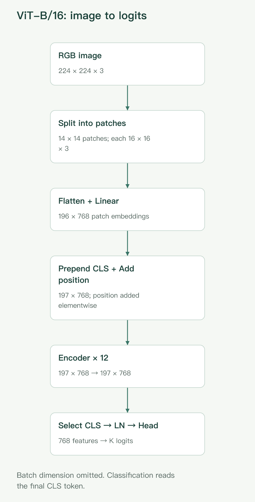
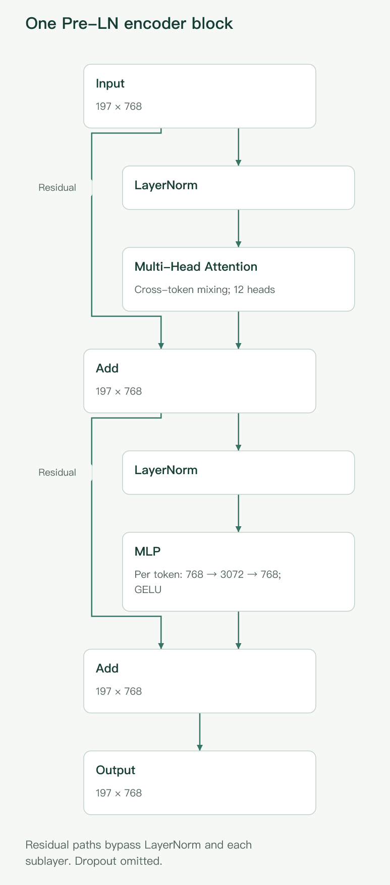

## ViT 的核心：把图像变成一组可以相互交流的 token

卷积神经网络（CNN）通常从局部邻域提取特征，再逐层扩大感受野。Vision Transformer（ViT）换了一条路线：**把图像切成小块，将每块映射为向量，再用 Transformer Encoder 建模这些向量之间的关系。**

它不是把图像“翻译成文字”，也不是先识别每个小块的类别。这里的 token 只是一个可学习的向量表示：最初描述一块像素，经过多层处理后，可以包含来自整幅图像的上下文。

本文以[原始 ViT 论文](https://arxiv.org/html/2010.11929v2)的经典分类架构为主线，使用同一个例子贯穿说明：

| 项目           | 本文设置       |
| -------------- | -------------- |
| 输入图像       | RGB，224×224×3 |
| patch 大小     | 16×16          |
| patch 数量     | 14×14＝196     |
| 模型           | ViT-B/16       |
| 隐藏维度 D     | 768            |
| Encoder 层数 L | 12             |
| 注意力头数 h   | 12             |
| MLP 隐藏维度   | 3072           |

其中 B 表示 Base 配置，`/16` 表示 patch 的边长，不是网络层数。模型参数配置来自原论文表 1，224×224 则是本文用于推导形状的输入尺寸。除特别注明外，公式先省略 batch 维度。

图 1：从图像到分类 logits，省略 batch 维。196 个 patch 加入 CLS 后成为 197 个 token；位置编码逐元素相加，不增加通道宽度。最终只读取 CLS，经 LayerNorm 与分类头得到 K 个类别分数。

## 第一步：切分图像，构造 patch embedding

### 划分 patch：先控制序列长度

设图像高、宽、通道数分别为 H、W、C，每个 patch 大小为 P×P。假设高宽能被 P 整除，使用不重叠划分，则 patch 数量为：

$$
N=\frac{H}{P}\frac{W}{P}.
$$

本例中：

$$
N=\frac{224}{16}\times\frac{224}{16}=196.
$$

如果每个像素都是一个 token，224×224 图像会产生 50,176 个 token，全局自注意力需要处理极大的两两关系矩阵。使用 patch 把序列缩短到 196，是经典 ViT 能够实用的重要设计。

不过，patch 不等于物体。一块 16×16 区域可能包含猫耳朵的一部分，也可能同时包含轮廓与背景。

### 展平：改变排列，不是求平均

每个 patch 含有：

$$
P^2C=16\times16\times3=768
$$

个数值。按固定顺序将其展开为向量：

$$
x_p^i\in\mathbb{R}^{768},\qquad i=1,\ldots,196.
$$

**展平本身不丢弃像素值，也不是把整块压成一个平均颜色。** 块内每个像素的位置仍对应向量中的固定坐标，只是不再以二维数组的形式显式呈现。

### 线性投影：从像素坐标到特征空间

随后，所有 patch 使用同一组可训练参数完成投影：

$$
e_i=x_p^iE+b,\qquad E\in\mathbb{R}^{(P^2C)\times D}.
$$

因此，196 个 patch 形成：

$$
X_{\mathrm{patch}}\in\mathbb{R}^{196\times768}.
$$

本例中输入长度与 D 恰好都是 768，但这只是配置巧合。投影仍会学习新的线性组合，不是原样复制；换用其他 patch 大小或隐藏维度，两者就可能不同。

直观上，投影可以学习块内颜色、边缘、纹理等模式的线性响应，但不能保证某个维度必然对应人类可命名的特征。

实现上，这一步也可写成核大小为 P、步长为 P、输出通道为 D 的卷积，然后整理空间维度。二者在相同参数约定下等价。因此，“纯 Transformer”指的是没有依赖一个 CNN 特征提取主干，不代表代码中绝不能出现卷积算子。

## 第二步：加入 CLS token 与位置信息

### CLS token：一个可学习的全图读取位置

经典 ViT 在 patch 序列最前面加入一个可学习向量：

$$
x_{\mathrm{cls}}\in\mathbb{R}^{1\times D}.
$$

它的初始参数由所有图像共享，不是由某幅图像的像素直接算出来的。进入 Encoder 后，它通过自注意力与图像 token 交互，逐渐形成与当前图像有关的表示。

于是序列长度从 N 变为：

$$
S=N+1=197.
$$

CLS 可以理解为一个“用于分类的读取位置”，但它不是一开始就包含全图信息，也不是机械地对所有 patch 求平均。分类损失会训练整个网络，让最终 CLS 表示保留有助于预测类别的信息。

### 位置编码：告诉模型每个 token 来自哪里

标准自注意力本身不自带“左上角”和“右下角”的概念。若没有位置相关信息，重排 patch token 会使其输出按相同方式重排；对固定 CLS 而言，单纯改变其余 token 的排列不会提供新的空间结构信息。

图像分类却经常需要区分部件的相对布局。因此，经典 ViT 使用可学习的绝对位置编码：

$$
Z_0=[x_{\mathrm{cls}};e_1;e_2;\ldots;e_N]+E_{\mathrm{pos}},
\qquad E_{\mathrm{pos}}\in\mathbb{R}^{(N+1)\times D}.
$$

这里分号表示沿序列维拼接，位置编码则是逐元素相加。最终形状仍为 197×768，不会变成 197×1536。

原论文采用一维可学习位置编码：按照固定的图像扫描顺序，为各个序列位置分配向量。虽然编号是一维的，但每个编号都对应确定的二维网格位置，模型可以通过训练学习其空间关系。它并没有在初始化时就硬编码好二维距离。

这要与块内顺序区分开：**展平的固定坐标保留块内像素排列；位置编码标识不同 patch 在整幅图像中的位置。**

## 第三步：Transformer Encoder 如何更新表示

经典 ViT 使用 Pre-LN 结构，也就是在每个子层之前做 LayerNorm。第 ℓ 层可写为：

$$
U_\ell=Z_{\ell-1}+\operatorname{MSA}(\operatorname{LN}(Z_{\ell-1})),
$$

$$
Z_\ell=U_\ell+\operatorname{MLP}(\operatorname{LN}(U_\ell)).
$$

MSA 是多头自注意力。两次加法分别是注意力子层和 MLP 子层的残差连接。每一层都保持 197×768 的主干形状，但向量的内容不断变化。

图 2：两条残差分别从块输入和第一个 Add 的输出出发，不经过 LayerNorm。注意力负责跨 token 交互，MLP 对每个 token 独立做 768→3072→768 的通道变换；子层输出及残差主干均保持 197×768，图中省略 dropout。

### 自注意力：根据当前内容决定从哪里读取信息

令某个注意力子层的归一化输入为：

$$
X=\operatorname{LN}(Z_{\ell-1})\in\mathbb{R}^{S\times D}.
$$

对第 r 个注意力头，分别做三次线性映射，以下省略偏置：

$$
Q_r=XW_Q^{(r)},\qquad K_r=XW_K^{(r)},\qquad V_r=XW_V^{(r)}.
$$

其中：

$$
W_Q^{(r)},W_K^{(r)},W_V^{(r)}\in\mathbb{R}^{D\times d_h},
\qquad d_h=D/h=64.
$$

Q、K、V 分别称为 query、key、value，可以直观理解为：

- **Query：** 当前 token 想匹配什么信息。
- **Key：** 各个 token 提供什么匹配线索。
- **Value：** 被关注后，实际传递什么内容。

它们来自同一组输入，却使用不同的投影参数，因此并不相同。“想匹配”只是方便理解的拟人化说法，实际发生的是向量运算。

一个头的完整计算为：

$$
A_r=\operatorname{softmax}\left(\frac{Q_rK_r^\top}{\sqrt{d_h}}\right),
\qquad O_r=A_rV_r.
$$

其中 softmax 沿每一行的 key 维度进行。本例各矩阵的形状是：

$$
Q_r,K_r,V_r:\ 197\times64,
\qquad A_r:\ 197\times197,
\qquad O_r:\ 197\times64.
$$

更具体地看，第 i 个输出为：

$$
o_i=\sum_{j=0}^{N}a_{ij}v_j,
\qquad
 a_{ij}=\frac{\exp(q_i\cdot k_j/\sqrt{d_h})}
 {\sum_{t=0}^{N}\exp(q_i\cdot k_t/\sqrt{d_h})}.
$$

索引 0 对应 CLS。每一行权重非负且和为 1，表示当前 token 如何混合所有 token 的 value。注意，权重由 query 与 key 的匹配决定，不只是“两个原始 patch 看起来是否相像”。

除以平方根项，是为了在常见尺度假设下控制点积随维度增大而增长的幅度，避免 softmax 过早变得极端尖锐。

经典图像分类 ViT 不使用自回归因果遮罩，所以每个 token 都可以关注自己、其他 patch 以及 CLS。第一层就具有全局交互通路，但这不等于第一层已经理解了整幅图像。

举一个机制示意：描述猫耳朵区域的 token 可以从较远的脸部区域读取信息，以修正自己的表示。这是架构允许发生的计算，不是对某个实际注意力头行为的实测结论。

### 多头：并行学习不同的关系空间

ViT-B/16 有 12 个注意力头，每个头输出 64 维。将它们拼接后再投影：

$$
\operatorname{MSA}(X)
=\operatorname{Concat}(O_1,\ldots,O_h)W_O,
\qquad W_O\in\mathbb{R}^{D\times D}.
$$

于是 12×64＝768，输出回到 197×768，可以与残差分支相加。

多头的价值在于：不同投影可以学习不同的匹配规则和信息组合。一些头可能更偏向局部关系，另一些可能覆盖较远区域；但不能预先认定某个头一定负责颜色、另一个一定负责形状，更不能保证所有头都学到互不重复的功能。

### MLP：逐 token 的非线性特征加工

注意力之后，模型使用一个两层 MLP：

$$
\operatorname{MLP}(x)
=\operatorname{GELU}(xW_1+b_1)W_2+b_2,
$$

其中：

$$
W_1\in\mathbb{R}^{768\times3072},
\qquad W_2\in\mathbb{R}^{3072\times768}.
$$

MLP 对每个 token 独立应用相同的参数，沿特征维先扩展再压回。它不直接在不同 token 之间传递信息。

两者的分工可以概括为：

- 自注意力负责**跨 token 的信息交换**。
- MLP 负责**每个 token 内部的非线性特征组合**。

因为进入 MLP 的 token 已包含注意力聚合来的上下文，所以“逐 token 处理”不等于“只知道自己的原始 patch”。多层交替后，模型能够反复完成“读取上下文—加工特征—再次读取”的过程。

### LayerNorm 与残差：让深层更新更容易训练

LayerNorm 对每个 token 的 D 个特征计算均值和方差，再使用可学习的缩放与偏置：

$$
\operatorname{LN}(x)
=\gamma\odot\frac{x-\mu(x)}{\sqrt{\sigma^2(x)+\epsilon}}+\beta.
$$

它不是跨 batch 计算统计量，也不是把不同 patch 混在一起求均值。其作用是调节送入子层的特征尺度，改善优化条件。

残差连接则保留输入，让子层学习在原表示上应增加什么变化，同时提供更直接的梯度传播路径。它不保证训练永远稳定，但与 Pre-LN 组合，是深层 Transformer 常用的训练结构。

为突出主干，上述公式省略了 dropout 等正则化细节；LN、注意力、MLP 和两条残差的顺序与经典 ViT 一致。

## 第四步：从 CLS 表示得到分类结果

经过 12 层 Encoder，输出仍为 197×768。经典分类架构读取第 0 个位置的 CLS，并进行最终 LayerNorm：

$$
y=\operatorname{LN}(Z_L[0])\in\mathbb{R}^{768}.
$$

假设下游任务有 K 个类别，使用线性分类头：

$$
s=yW_{\mathrm{head}}+b_{\mathrm{head}},
\qquad W_{\mathrm{head}}\in\mathbb{R}^{768\times K}.
$$

这里 s 是 K 维 logits，应用 softmax 后可得到类别概率。训练时，分类损失沿整个计算图反向传播，更新投影、位置编码、CLS、Encoder 和分类头。

原论文的描述更具体：预训练分类头使用带一个隐藏层的 MLP，下游微调时使用单个线性层。因此，“ViT 分类头必然只有一层”不是准确概括。原论文的主要结果来自监督式分类预训练，并不意味着 ViT 天生只能或必须使用某种自监督目标。

把 batch 大小 B 加回来，完整形状如下：

| 阶段                     | 张量形状         |
| ------------------------ | ---------------- |
| 输入图像，按通道在前表示 | B×3×224×224      |
| patch 展平               | B×196×768        |
| patch 线性投影           | B×196×768        |
| 拼接 CLS，再加位置编码   | B×197×768        |
| 拆成多头后的 Q、K、V     | 各为 B×12×197×64 |
| 注意力权重               | B×12×197×197     |
| 多头合并并投影           | B×197×768        |
| MLP 中间隐藏表示         | B×197×3072       |
| 每层 Encoder 输出        | B×197×768        |
| 最终 CLS 表示            | B×768            |
| 分类 logits              | B×K              |

经典 ViT 在 Encoder 内不会逐层减少 token 数，也不会像典型 CNN 那样形成逐级降采样的特征金字塔。

## ViT 为什么有效：机制解释与实验证据要分开

### 全局交互让远距离信息更容易相遇

局部卷积通常需要通过多层传播，才能让相隔较远的位置发生信息交互。全局自注意力在一个子层中就允许任意两个 token 直接建立联系。

这为物体部件组合、前景与背景关系、相距较远的线索整合提供了便利。但“存在全局连接”只是计算通路上的优势，不能推导出模型一定会关注正确区域，也不能说明 CNN 无法学习全局关系。

### 注意力是一种内容自适应的信息路由

普通卷积层在推理时，用学到的固定卷积核扫描不同位置；输入变化会改变激活，但卷积核参数不会针对每幅图像重新生成。

自注意力中的投影参数同样固定，但混合权重 A 由当前输入的 Q、K 计算而来。因此，同一位置在不同图像里可以从不同区域读取信息。更深层中，Q、K 已经包含上下文，路由也可以基于更抽象的表示。

这使模型不必始终按照固定邻域聚合。不过，自适应也可能带来错误路由，例如过度依赖与标签相关但不稳定的背景线索。

### 表示能力来自多个组件，而非注意力单独完成一切

只做一次加权平均不足以解释 ViT 的能力。线性投影提供初始特征，多头注意力以不同方式交换信息，MLP 做非线性变换，位置编码保留布局线索，多层堆叠不断更新表示，最后由任务损失选择有用的特征。

因此，更完整的理解是：**ViT 将跨区域交互与非线性特征加工组合起来，形成可端到端训练的深层表示系统。** 全局注意力并不是替代其余组件的万能模块。

### 大规模预训练补上较弱视觉先验带来的学习负担

归纳偏置是模型在看见数据之前，就通过结构作出的偏好。CNN 把局部性和空间权重共享写进结构：相邻像素值得一起处理，同一种局部模式可能出现在不同位置。

经典 ViT 的视觉归纳偏置较弱。它仍有 patch 划分、共享投影和位置编码等结构约束，但没有在每一层强制使用二维局部邻域。许多空间规律需要更多地从数据中学得。

这种灵活性在数据不足时可能成为负担；当预训练数据充分时，又可能让模型学到更适合任务的关系。下游任务使用预训练模型，便不必从少量样本中重新学习全部视觉规律。**少样本微调有效，不等于少样本从零训练同样有效。**

### 原论文实际提供了哪些证据？

[原论文第 4.2–4.3 节](https://arxiv.org/html/2010.11929v2)比较了不同预训练数据规模、模型规模与迁移结果：

- 在仅使用 ImageNet、没有强正则化的原始训练设置下，ViT 的表现落后于可比的 ResNet。
- 扩大到 ImageNet-21k、JFT-300M 等预训练数据后，ViT 的迁移性能明显改善，大模型的优势也更容易体现。
- 表 2 中，经 JFT-300M 预训练并以更高分辨率微调的 ViT-H/14，在 ImageNet 上达到约 88.55% 的准确率。这是特定大模型与训练设置的结果，不是本文 224×224、ViT-B/16 示例的性能。

这些实验支持的是：**简单的 patch 序列加 Transformer，在足够规模的训练条件下能够成为有竞争力的视觉模型。** 它们没有单独证明“全局注意力”就是全部收益来源，也没有证明 ViT 在任意数据量、预算和任务上都优于 CNN。

论文报告的预训练计算优势同样应放在对应配置中理解，不能直接转换成“任何 ViT 都比任何 CNN 更省算力”或“部署延迟一定更低”。

## 与 CNN 相比，ViT 付出了什么代价？

### 局部先验与学习自由度的取舍

| 维度         | 典型 CNN                     | 经典 ViT                             |
| ------------ | ---------------------------- | ------------------------------------ |
| 基本空间交互 | 局部卷积，逐层扩大感受野     | 每层允许全局 token 交互              |
| 空间聚合规则 | 普通卷积使用训练后的固定核   | 注意力权重随输入变化                 |
| 二维结构先验 | 强，局部邻域与共享卷积核内置 | 较弱，主要通过 patch 和位置编码引入  |
| 平移性质     | 理想条件下具有平移等变性     | patch 边界与绝对位置编码不保证该性质 |
| 特征尺度     | 通常逐层降采样、增加通道     | 经典主干保持序列长度与隐藏维度       |
| 数据较少时   | 结构先验通常有助于学习       | 更依赖预训练或合适的训练策略         |

“平移等变”指输入平移后，特征相应平移；它不同于分类结果完全不变的“平移不变”。实际 CNN 的边界填充、步长和下采样也会影响严格等变性。这张表比较的是典型结构，并非所有 CNN 和所有视觉 Transformer 的统一结论。

### 全局注意力的代价随 token 数平方增长

令序列长度为 S＝N＋1，隐藏宽度为 D。对一个 Encoder 层，忽略 batch 和常数项：

- Q、K、V 与输出投影的计算量为 O(SD²)。
- 两两注意力和 value 聚合的计算量为 O(S²D)。
- 若 MLP 中间宽度为 rD，其计算量为 O(rSD²)。

因此，单层总体可概括为：

$$
O(S^2D+SD^2)
$$

其中把固定的 MLP 扩展比例并入了常数。**注意力矩阵对序列长度是平方关系，不代表整个模型在所有尺寸下都由这一项主导。** 在中等序列长度、较宽隐藏维度下，投影和 MLP 同样可能占据大量计算。

标准显式实现还需要存储每个头的 S×S 注意力矩阵，相关存储量为 O(hS²)。具体峰值显存取决于实现与训练方式，优化实现可以避免完整保存部分中间矩阵。

对于本例，可以直接推导两种变化：

| 设置           | patch 数 N | 含 CLS 的 S | 单头注意力矩阵元素数 |
| -------------- | ---------- | ----------- | -------------------- |
| 224×224，P＝16 | 196        | 197         | 38,809               |
| 224×224，P＝8  | 784        | 785         | 616,225              |
| 448×448，P＝16 | 784        | 785         | 616,225              |

patch 边长减半，或图像高宽各翻倍，都会让 patch 数变成 4 倍，注意力矩阵规模接近 16 倍。这里是形状推导，不是实际延迟或显存测量。

较小 patch 可以提供更细的空间粒度，却更昂贵；较大 patch 降低成本，但将更多局部细节装进同一个 token。虽然展平不丢像素，它也不会让后续注意力逐像素建立关系；若投影维度低于 patch 展平维度，还可能形成信息压缩瓶颈。

### 输入分辨率变化时，位置编码也要处理

从 224×224 改为 448×448，并保持 P＝16，patch 网格就由 14×14 变为 28×28。原来的可学习位置向量数量不再匹配。

原论文的方法是将 patch 位置编码恢复为二维网格，按目标网格做二维插值，再展平回序列；CLS 的位置编码单独保留。通常还需在目标分辨率下微调。不能因为注意力支持不同序列长度，就直接认为整套已训练模型无需调整。

### 注意力图不是可靠解释的同义词

注意力热图展示的是某层、某头的信息混合权重，而非某个区域对最终类别的完整贡献。

高权重究竟传递了什么，还取决于 value 的内容、输出投影、其他头、残差分支和后续网络。因此，不能只凭 CLS 高度关注某块区域，就断言该区域是预测的唯一依据或因果原因。

注意力可视化适合辅助观察。若要验证模型是否依赖某个区域，需要结合遮挡、扰动或其他归因方法，并考虑这些分析方法本身的局限。

## 如何把整套结构记住

理解经典 ViT，可以沿着四个问题追踪信息：

1. **看到了什么？** patch 展平与线性投影把局部像素变成特征向量。
2. **这些内容在哪里？** 位置编码为 token 提供空间身份。
3. **哪些信息需要互相结合？** 多头注意力跨 token 交流，MLP 加工每个 token 的特征，残差与 LayerNorm 帮助深层训练。
4. **最后如何作出判断？** 最终 CLS 表示经分类头映射为类别分数。

ViT 的有效性不是“把图片切块就会变强”，而是这种简洁结构提供了灵活的全局信息交互方式，并能在合适的数据规模与训练条件下学到有用的视觉表示。它与 CNN 的差别，本质上是结构先验、学习自由度和计算代价之间的不同取舍。

## 参考资料

- Dosovitskiy 等：[An Image is Worth 16×16 Words: Transformers for Image Recognition at Scale](https://arxiv.org/abs/2010.11929)，ICLR 2021。架构见第 3 节，配置见表 1，性能与数据规模分析见第 4 节；[可阅读的 HTML 全文](https://arxiv.org/html/2010.11929v2)。
- [Google Research 官方 ViT 仓库](https://github.com/google-research/vision_transformer)：原论文配套实现与预训练模型入口，供进一步阅读。
