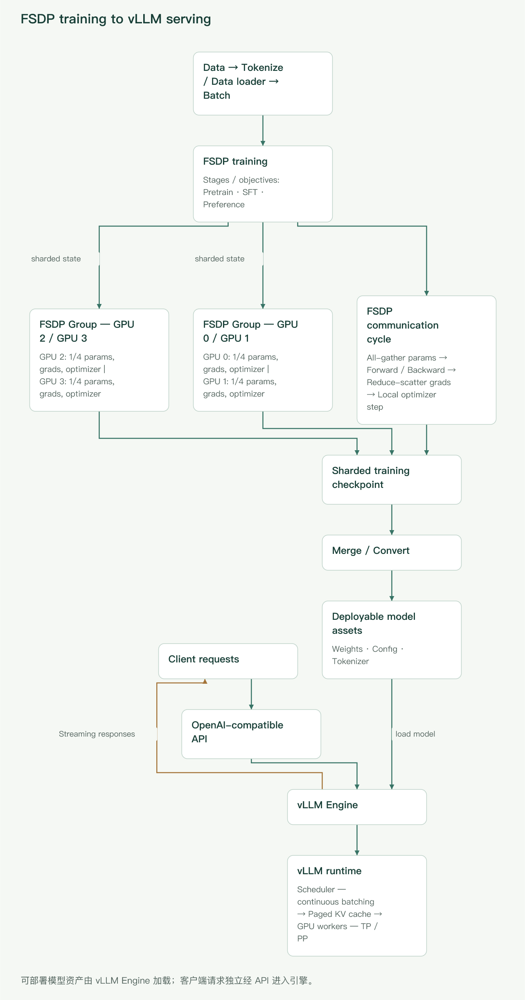

## 先把两类工具放到正确位置

你问题中的“fdsp”，下文按业界常用术语 **FSDP（Fully Sharded Data Parallel，全分片数据并行）**理解。

先记住最重要的边界：

- **FSDP/FSDP2 主要解决训练问题**：让模型参数、梯度和优化器状态不必在每张 GPU 上各存一份。
- **vLLM 主要解决推理与在线服务问题**：更高效地管理 KV Cache，把长度和到达时间不同的请求持续装入 GPU，并提供服务接口。
- 二者通常不在同一个进程里协作。训练结束后，需将训练检查点整理成推理引擎可读取的模型目录，再启动 vLLM。



_图 1：左侧主流程是 Data → Tokenize/Data loader → Batch → FSDP training；预训练、SFT 和偏好对齐是训练容器内的阶段或目标。各 GPU 常驻模型状态分片，按层临时 all-gather 参数，并在反向后 reduce-scatter 梯度。中间由分片训练检查点经 Merge/Convert 形成权重、配置与 tokenizer 等可部署资产，并交给服务侧的 vLLM Engine 加载；客户端请求经 OpenAI 兼容 API 进入引擎，调度器执行连续批处理并分页管理 KV Cache。图中通信时间线经过简化，反向前是否再次 all-gather 取决于重分片策略。_

一条典型链路是：

```text
语料/指令/偏好数据
  -> 预训练或后训练
  -> FSDP 分布式训练
  -> 分片训练检查点
  -> 合并或转换为可部署权重
  -> vLLM 加载
  -> OpenAI-compatible API
```

这也解释了一个常见误区：**FSDP 训练能跑起来，不代表检查点能直接交给 vLLM；vLLM 能加载模型，也不代表它负责常规的预训练或 SFT。**

## 大模型训练究竟在做什么

### 预训练、SFT 与偏好对齐

这些阶段通常沿用同一个“前向—反向—更新”骨架，但数据与目标不同。

| 阶段            | 输入数据                   | 主要目标                             | 典型结果            |
| --------------- | -------------------------- | ------------------------------------ | ------------------- |
| 预训练          | 大规模通用或领域文本       | 预测下一个 token，学习语言与知识表示 | Base model          |
| SFT（监督微调） | 指令—回答、对话、任务样本  | 学习按指令生成期望答案               | Instruct/Chat model |
| 偏好对齐        | 成对偏好、评分或可验证反馈 | 让输出更符合人类偏好或任务奖励       | Aligned model       |

“偏好对齐”是总称。DPO 等方法可直接从偏好对优化；经典 RLHF 通常还包括奖励模型与强化学习阶段。它们会改变数据组织和损失计算，但分布式训练仍绕不开参数、激活、梯度和优化器状态。

### 一个训练 step 的数据流

1. **取 batch**：文本经 tokenizer 变成 token IDs、attention mask 和标签。
2. **forward**：逐层计算 logits 与 loss，同时保存反向传播所需的激活。
3. **backward**：从 loss 反向计算各参数梯度；使用梯度累积时，对若干 micro-batch 重复前向和反向。
4. **optimizer step**：AdamW 等优化器根据梯度和历史状态更新参数。
5. **清梯度与调度学习率**：进入下一 step；按策略评估并保存检查点。

有效全局 batch 大致为：

```text
每卡 micro-batch × 数据并行进程数 × 梯度累积步数
```

若使用序列并行、样本打包或动态长度 batch，比较实验时应优先核对**实际处理 token 数**，不要只看名为 `batch_size` 的配置项。

### 显存花在哪里

训练显存大体由以下部分构成：

- **模型参数**；
- **梯度**；
- **优化器状态**，例如 Adam 的一阶、二阶动量；
- **激活**，受 batch、序列长度、层数和隐藏维度影响很大；
- CUDA kernel workspace、通信缓冲区与内存碎片等临时开销。

例如，70 亿参数仅以 BF16 保存权重，理论裸权重约为 `7e9 × 2 bytes ≈ 14 GB`；训练还要加梯度、优化器状态和激活。实际字节数会因优化器、主权重精度、扁平化和实现而变，不能把某个固定的“每参数多少字节”套到所有配置上。

| 手段                     | 主要减少什么                   | 代价或边界                            |
| ------------------------ | ------------------------------ | ------------------------------------- |
| BF16/FP16 混合精度       | 参数计算相关内存与带宽         | FP16 更容易溢出；部分归约宜用较高精度 |
| FSDP/ZeRO 分片           | 参数、梯度、优化器状态的副本   | 增加集合通信和配置复杂度              |
| Activation checkpointing | 激活                           | 反向时重算 forward，增加计算量        |
| CPU offload              | GPU 上的参数、梯度或优化器状态 | PCIe、CPU 内存和带宽可能成为瓶颈      |
| 梯度累积                 | 单次 micro-batch 的激活        | step 延迟变长，不直接减少模型状态     |
| FlashAttention 等内核    | 注意力中间量和访存             | 有硬件、dtype、形状或版本限制         |
| LoRA/QLoRA               | 可训练参数及其优化器状态       | 属于参数高效微调，不等于全参数训练    |

## 四种并行方式：切样本、切状态、切算子还是切层

### DDP：每卡完整模型，切分 batch

DistributedDataParallel（DDP）在每个数据并行 rank 上放一份完整模型，各卡处理不同样本，反向时通过 all-reduce 同步梯度。它简单、成熟、常常也很快，但模型状态会重复 `N` 份。单卡放不下模型及训练状态时，DDP 本身无能为力。

### FSDP：仍是数据并行，但把状态也切开

FSDP 保留“各 rank 处理不同样本”的数据并行语义，同时把参数、梯度和优化器状态分片。计算某个包裹单元时临时取得所需参数，计算后再释放或重分片。

### Tensor Parallel：切分一次矩阵运算

张量并行（TP）把线性层的权重或激活沿某一维切到多卡，一次 forward 就需要多卡协作。它既可用于训练，也常用于 vLLM 推理。TP 通信频繁，通常优先放在 NVLink/NVSwitch 等高速互连域内。

### Pipeline Parallel：按层切模型

流水线并行（PP）把连续层放在不同设备，用 micro-batch 填充流水线。它能跨节点扩展超大模型，但要处理流水线气泡、阶段负载不均和调度问题。

数据并行、FSDP、TP 和 PP 并非永远四选一。大规模训练常形成 2D/3D 并行：节点内 TP，节点间 FSDP/数据并行，必要时再加 PP。

## FSDP 如何工作

PyTorch 提供经典 `FullyShardedDataParallel`（常称 FSDP1），也提供基于组合式 API 的 FSDP2。接口仍在演进，实际使用应核对 [PyTorch FSDP1 文档](https://docs.pytorch.org/docs/stable/fsdp.html) 与 [`fully_shard`（FSDP2）文档](https://docs.pytorch.org/docs/stable/distributed.fsdp.fully_shard.html)。

### 参数、梯度、优化器状态如何分片

假设数据并行组有 4 个 rank，理想化地看：

- 每个 rank 常驻约四分之一参数；
- 每个 rank 最终只保留约四分之一梯度；
- 每个 rank 只更新并保存自己负责的优化器状态分片。

计算某个 Transformer block 时，典型通信为：

1. **all-gather 参数**：各 rank 交换参数分片，临时重建该单元计算所需的完整参数。
2. **forward**：各 rank 用自己的数据分片计算。
3. 若 forward 后重分片，则释放完整参数；反向计算该单元前再次 all-gather。
4. **backward**：计算参数梯度。
5. **reduce-scatter 梯度**：先归约各 rank 的梯度贡献，再让每个 rank 只留下对应分片。
6. **optimizer step**：每个 rank 更新自己的参数分片和优化器状态。

因此，FSDP 的收益不是“通信消失”，而是**用通信换常驻显存**。网络慢、包裹粒度不合适或 batch 太小时，通信可能压过计算。

### FSDP、ZeRO 与 DDP 的关系

DeepSpeed ZeRO 的经典分级有助于理解分片程度：

- ZeRO Stage 1：分片优化器状态；
- Stage 2：再分片梯度；
- Stage 3：再分片参数。

FSDP 的 full-shard 思路与 ZeRO-3 接近，但二者的运行时、配置、检查点和生态集成不同，不能因“都分三种状态”就认为实现完全相同。DDP 则让参数、梯度和优化器状态在每个数据并行 rank 上完整保留。DeepSpeed 的分级定义可参考其 [ZeRO 教程](https://www.deepspeed.ai/tutorials/zero/)。

### FSDP1 与 FSDP2

可以用下面的心智模型区分：

- **FSDP1**：用 `FullyShardedDataParallel` 包装模块，主要以扁平参数机制管理分片；历史配置和生态集成较多。
- **FSDP2**：对模块组合式调用 `fully_shard`，以 DTensor 表示逐参数分片，保留原参数的 fully qualified name，并将包裹边界直接作为通信分组边界。

FSDP2 不是“分片数量翻倍”，而是 API、参数表示与状态管理方式的演进。PyTorch 当前文档建议按 Transformer 层自底向上调用 `fully_shard`；只对最外层模型调用会形成巨大的阻塞式 all-gather/reduce-scatter，通常无法很好地与计算重叠。FSDP2 也不直接提供 FSDP1 式的 full state dict 开关，完整权重一般通过 DTensor 或 PyTorch Distributed Checkpoint 的高层接口整理。

### 自动包裹策略为什么重要

若把整个模型当成一个巨大 FSDP 单元，all-gather 峰值可能很高，也难以让通信与计算重叠；若把每个微小模块都独立包裹，集合通信次数又会过多。

Transformer 通常按“一个 decoder block”为基本单元。自动包裹策略常见两类：

- 按模块类名包裹，例如 `LlamaDecoderLayer`；
- 按参数数量阈值包裹。

选择后应查看实际模块树和 FSDP 单元，而不是只相信字符串配置。类名写错却未报错时，可能退化成没有按预期分层包裹。

### 混合精度、offload 与 activation checkpointing

- **Mixed precision** 可分别控制参数计算、梯度归约和缓冲区 dtype。BF16 在支持它的硬件上通常比 FP16 更稳，但并非所有 GPU 都支持高效 BF16。
- **CPU offload** 可进一步腾出 GPU 显存，却会引入主机—设备传输。它更像“能否运行”的最后手段，不应默认认为会提高吞吐。
- **Activation checkpointing** 与 FSDP 互补：FSDP 缩减模型状态，checkpointing 缩减激活。二者叠加时应一起评估重算、通信和 step time。

### 检查点：分片保存不等于可直接部署

训练恢复与推理部署是两个目的：

- **恢复训练**需要模型、优化器、学习率调度器、随机数状态和训练进度；分片检查点通常保存更快、峰值更低。
- **部署推理**通常只需整理后的模型权重、`config.json`、tokenizer 文件和必要的自定义代码信息。

不要在每个 rank 上都聚合并保存完整状态，否则可能造成 CPU OOM 或多个进程同时写一个文件。大型任务宜使用 PyTorch Distributed Checkpoint 或框架提供的分布式保存路径，在独立转换任务中合并或转换。恢复时还要核对 world size、分片布局、模型结构和优化器是否兼容。

## 一个 Hugging Face FSDP 配置骨架

下面是**教学示例，未在本文环境中实测**。为了让后文的检查点交接路径一致，这条最小主路径限定为 **Transformers/Accelerate 集成的 PyTorch FSDP、`SHARDED_STATE_DICT` 输出**；它不等同于原生 FSDP2/DTensor 的所有保存方式。Transformers、Accelerate 与 PyTorch 的字段和目录布局会变化，执行前请按已安装版本核对 [Transformers FSDP 文档](https://huggingface.co/docs/transformers/main/en/fsdp) 和 [Accelerate FSDP 文档](https://huggingface.co/docs/accelerate/en/usage_guides/fsdp)。

下面的骨架重点表达配置意图，并统一把训练根目录设为 `./outputs/run-01`：

```python
from transformers import TrainingArguments

fsdp_config = {
    # Example only: verify field names against your installed version.
    "auto_wrap_policy": "TRANSFORMER_BASED_WRAP",
    "transformer_layer_cls_to_wrap": "LlamaDecoderLayer",
    "reshard_after_forward": True,
    "activation_checkpointing": True,
    "cpu_offload": False,
    "state_dict_type": "SHARDED_STATE_DICT",
}

args = TrainingArguments(
    output_dir="./outputs/run-01",
    bf16=True,
    per_device_train_batch_size=1,
    gradient_accumulation_steps=16,
    fsdp=True,
    fsdp_config=fsdp_config,
    save_strategy="steps",
    save_steps=500,
    logging_steps=10,
)
```

示意启动方式：

```bash
torchrun --standalone --nproc_per_node=4 train.py
```

如果使用 `accelerate config` 生成配置，则通常改用：

```bash
accelerate launch train.py
```

不要同时在多个入口重复声明互相冲突的 FSDP 选项。多机还需正确设置节点数量、rank、主节点地址和端口，并确保代码、数据与模型文件在所有节点一致。先用小模型、短序列、少量 step 验证 forward、backward、保存和恢复，再扩大规模。

生产任务还需明确：

- 使用 FSDP1 还是 FSDP2；
- 精确的包裹类名和实际包裹结果；
- 完整还是分片 state dict；
- 是否 offload；
- 通信后端、超时和网络接口；
- checkpoint 的保存频率与保留策略。

本文后续假定第 500 步产生可恢复目录 `./outputs/run-01/checkpoint-500/`，其中模型分片实际位于 `pytorch_model_fsdp_0/`。有些版本可能命名为 `pytorch_model_0/`，也可能由 Trainer 采用不同布局；**必须先查看真实目录，不能只把示例名字复制到命令中**。后文的 `merge-weights` 输入就是这个 checkpoint 内的模型分片子目录，而不是来源不明的独立目录。

## vLLM 解决了普通推理的哪些瓶颈

### 普通 Transformers 推理为何容易浪费 GPU

最简单的 Transformers 推理脚本通常是：加载模型，给一个 batch 调用 `generate()`，结束后再接下一批。这适合实验，却不天然适合多租户在线服务：

- 请求到达时间、prompt 长度和生成长度不同；
- 静态 batch 会等待最慢序列，其余计算槽位闲置；
- KV Cache 随序列增长，预留连续大块空间容易造成浪费或碎片；
- 请求结束后若不能立即补位，GPU 利用率会下降；
- 服务还要处理排队、取消、流式输出、限流和可观测性。

vLLM 是面向 LLM 推理与服务的引擎。它的核心价值不是改变模型的数学定义，而是更高效地组织 KV Cache、调度请求和执行 GPU kernel。支持的模型和硬件后端应查看 [vLLM 官方文档](https://docs.vllm.ai/)。

### KV Cache 与 PagedAttention

自回归生成第 `t` 个 token 时，模型无需重新计算前面所有 token 的 Key/Value，而是复用 **KV Cache**。代价是：并发请求越多、上下文越长、层数越多，KV Cache 越占显存。

PagedAttention 借鉴虚拟内存分页思想：

- 将 KV Cache 切成固定大小的逻辑块；
- 逻辑上连续的 token 可映射到物理上不连续的显存块；
- 序列增长时按需分配块，结束后回收；
- 某些共享前缀或候选分支场景还能复用块。

它减少的是 KV Cache 管理中的浪费和碎片，并不意味着 KV Cache 不占空间。块大小、模型结构、KV dtype、上下文长度和并发量仍共同决定容量。还要注意，vLLM 官方将早期 PagedAttention 内核说明标为历史文档：**分页 KV Cache 的核心思想仍适合作为心智模型，但当前内核实现已经演进，不能把旧论文中的每个实现细节当作现行代码。**

### Continuous batching

连续批处理也叫 iteration-level batching。调度器不必等整个静态 batch 都生成结束；在解码迭代边界，它可以移除已完成请求并加入新请求。

与离线静态 batch 相比，它通常能提高在线吞吐和 GPU 利用率，但调度目标需要取舍：

- 追求吞吐时可装入更多 token；
- 追求首 token 延迟（TTFT）时要避免长队列和大规模 prefill 阻塞；
- 追求 token 间延迟（ITL）时要控制 decode 调度抖动；
- 显存压力过大时，抢占或重计算会恶化尾延迟。

因此“最大并发”不等于“最佳并发”，应使用真实的 prompt/输出长度分布压测。

### Prefill、decode 与调度

推理可粗分为：

- **prefill**：一次处理 prompt，计算量较大、并行度较高，并建立 KV Cache；
- **decode**：每轮通常为每条序列生成一个 token，受内存带宽和调度影响明显。

长 prompt 的 prefill 可能阻塞短请求。现代服务引擎会用分块 prefill、优先级或 token budget 等方式协调两类工作，但具体默认值随 vLLM 版本和硬件变化。判断服务质量时至少同时看吞吐、TTFT、ITL 与 P95/P99 延迟。

### vLLM 中的 TP、PP 与量化

当一张卡放不下模型或吞吐不足时，可以：

- 用 **tensor parallel** 将每层算子分到多卡，通常适合节点内高速互连；
- 用 **pipeline parallel** 将不同层放到不同卡，在跨节点、无高速卡间互连或模型无法均匀 TP 切分时可能更合适；
- 部署多个副本横向扩容，由路由层分发请求。

经验上先选择最小且能放下模型的 TP 数。TP 过大可能让通信抵消收益；PP 也会带来阶段不均和气泡。vLLM 的当前建议见其 [并行与扩展文档](https://docs.vllm.ai/en/latest/serving/parallelism_scaling/)。

量化通过较低位宽存放或计算权重，部分方案还量化 KV Cache。它可降低显存并扩大可部署模型规模，有时提高吞吐，但需同时核对：

- 模型架构、GPU 和 vLLM 后端是否支持该量化格式；
- 权重是离线量化还是运行时量化；
- 精度、吞吐和首 token 延迟是否真的改善；
- TP、LoRA、推测解码等功能能否组合。

不要仅凭“4-bit”推断一定比 BF16 快；解量化 kernel 和硬件支持会改变结果。兼容矩阵以 [vLLM 量化文档](https://docs.vllm.ai/en/latest/features/quantization/) 为准。

## 先用公开模型做 vLLM 安装冒烟测试

以下是**独立的安装冒烟测试，而不是自训模型交接步骤**。它只用于确认 vLLM、GPU、网络下载和 OpenAI 兼容接口基本可用。命令未在本文环境中实测；模型名称、参数和 API 行为可能随版本变化，请先运行 `vllm serve --help` 并核对 [OpenAI-compatible server 文档](https://docs.vllm.ai/en/latest/serving/openai_compatible_server/)。

```bash
vllm serve Qwen/Qwen2.5-7B-Instruct \
  --tensor-parallel-size 2 \
  --dtype auto \
  --max-model-len 8192 \
  --api-key demo-key
```

请求示例：

```bash
curl http://localhost:8000/v1/chat/completions \
  -H "Content-Type: application/json" \
  -H "Authorization: Bearer demo-key" \
  -d '{
    "model": "Qwen/Qwen2.5-7B-Instruct",
    "messages": [
      {"role": "user", "content": "用三点解释 KV Cache。"}
    ],
    "temperature": 0.2,
    "max_tokens": 256
  }'
```

OpenAI 兼容表示请求/响应接口尽量兼容常见 OpenAI API 形态，不表示所有参数、模型行为和扩展端点都完全相同。Chat Completions 还要求模型具备合适的 chat template；若 tokenizer 配置未提供，需要按官方文档显式指定。

## 从 `checkpoint-500` 到首个 vLLM 响应

下面把同一个训练产物串成一条最小主路径。它延续前文的版本边界：**Transformers/Accelerate 集成的 PyTorch FSDP 分片检查点**，示例路径固定为：

```text
./outputs/run-01/checkpoint-500/                 # 恢复训练用的完整 checkpoint
./outputs/run-01/checkpoint-500/pytorch_model_fsdp_0/  # merge-weights 的模型分片输入
./deployable_model/                              # 合并并补齐资产后的部署目录
```

如果实际目录不是这个名字，应替换下列命令中的路径，而不是重命名或猜测分片格式。原生 FSDP2/DTensor、PyTorch Distributed Checkpoint 或其他 Trainer 版本可能需要相应导出 API，不能机械套用此命令。

### 1. 先验证整个 checkpoint 能恢复训练

恢复训练要读取整个 `checkpoint-500`，而不是只读取权重分片子目录。以 Transformers Trainer 为例，训练脚本应把这个值传给 `resume_from_checkpoint`：

```python
trainer.train(resume_from_checkpoint="./outputs/run-01/checkpoint-500")
```

至少演练继续若干 step，并确认 optimizer、scheduler、随机状态和 global step 均按预期恢复。选择上线 checkpoint 时还应依据验证指标，而不是默认最后一步最好。

### 2. 将该 checkpoint 的模型分片合并到部署目录

Accelerate 当前文档为 FSDP 分片权重提供 `merge-weights`。这里的输入明确是上一步 checkpoint 内的模型分片目录：

```bash
rm -rf ./deployable_model
accelerate merge-weights \
  ./outputs/run-01/checkpoint-500/pytorch_model_fsdp_0/ \
  ./deployable_model/ \
  --safe-serialization
```

若安装版本不接受 `--safe-serialization`，先查看 `accelerate merge-weights --help`；不要静默改用手工拼接。合并完成后应出现 `model.safetensors`，或出现多文件 safetensors 及其索引。这个命令处理的是模型权重，不保证自动复制配置和 tokenizer。

### 3. 补齐 config、tokenizer 与 chat template

对于未改变词表和模型结构的 SFT，可从训练时记录的基础模型读取配置与 tokenizer，再保存到同一目录。下面把 `BASE_MODEL` 替换为本次 run 实际使用的基础模型 ID 或本地快照；不能随便换成“相似模型”。

```python
from transformers import AutoConfig, AutoTokenizer

BASE_MODEL = "Qwen/Qwen2.5-7B-Instruct"  # 必须与 run-01 的训练基座一致
DEPLOY_DIR = "./deployable_model"

config = AutoConfig.from_pretrained(BASE_MODEL, trust_remote_code=False)
config.save_pretrained(DEPLOY_DIR)

tokenizer = AutoTokenizer.from_pretrained(BASE_MODEL, trust_remote_code=False)
tokenizer.save_pretrained(DEPLOY_DIR)

if tokenizer.chat_template is None:
    raise RuntimeError(
        "该 tokenizer 没有 chat template；请从训练时使用的模板显式补齐，"
        "不要为通过检查而临时编造模板。"
    )
```

如果训练修改过词表、特殊 token、RoPE/上下文配置或模型结构，应保存**训练后的对应对象**，不能从基础模型覆盖回来。完成后至少核对：

```text
deployable_model/
├── config.json
├── model.safetensors                 # 或 model-*.safetensors + index
├── tokenizer.json / tokenizer.model
├── tokenizer_config.json            # chat_template 常位于此处
└── special_tokens_map.json           # 视 tokenizer 而定
```

### 4. 用固定输入做 Transformers 离线检查

这一步的目的，是在引入 vLLM 之前先确认“权重 + 配置 + tokenizer”可独立加载。以下仍是未实测教学示例：

```python
import torch
from transformers import AutoModelForCausalLM, AutoTokenizer

MODEL_DIR = "./deployable_model"
PROMPT = "用三点解释 KV Cache。"

tokenizer = AutoTokenizer.from_pretrained(MODEL_DIR)
model = AutoModelForCausalLM.from_pretrained(
    MODEL_DIR,
    torch_dtype=torch.bfloat16,
    device_map="auto",
).eval()

messages = [{"role": "user", "content": PROMPT}]
text = tokenizer.apply_chat_template(
    messages,
    tokenize=False,
    add_generation_prompt=True,
)
inputs = tokenizer(text, return_tensors="pt").to(model.device)

with torch.inference_mode():
    output = model.generate(
        **inputs,
        do_sample=False,
        max_new_tokens=64,
    )

new_tokens = output[0, inputs["input_ids"].shape[1]:]
print(tokenizer.decode(new_tokens, skip_special_tokens=True))
```

把固定输入、依赖版本、生成参数和输出摘要记录下来。若要比较导出前后结果，优先比较固定输入下的 logits/top-k 或贪心生成；BF16、不同 kernel 或后续量化可能产生小差异，不应拿随机采样文本要求逐字一致。

### 5. 让 vLLM 加载同一个 `deployable_model`

离线检查通过后，vLLM 的模型参数应指向这个本地目录，而不是重新换回 Hub 模型：

```bash
vllm serve ./deployable_model \
  --served-model-name run-01-sft \
  --tensor-parallel-size 2 \
  --dtype auto \
  --max-model-len 8192 \
  --api-key demo-key
```

`--tensor-parallel-size 2` 和 `--max-model-len 8192` 只是示意值，必须按 GPU 数量、模型配置和 KV Cache 容量调整。如果 chat template 没有写入 tokenizer 配置，可在确认模板与训练一致后用 `--chat-template` 显式指定文件；缺少模板时，vLLM 的 Chat Completions 请求会报错。

### 6. 用匹配的服务名取得首个响应

因为启动命令把 API 中的模型名设为 `run-01-sft`，请求也必须使用同一个名字：

```bash
curl http://localhost:8000/v1/chat/completions \
  -H "Content-Type: application/json" \
  -H "Authorization: Bearer demo-key" \
  -d '{
    "model": "run-01-sft",
    "messages": [
      {"role": "user", "content": "用三点解释 KV Cache。"}
    ],
    "temperature": 0,
    "max_tokens": 64
  }'
```

拿到首个响应只证明最小链路打通。随后应限制上下文和并发做小流量检查，再用接近生产的输入/输出长度分布测量 requests/s、tokens/s、TTFT、ITL、P95/P99、KV Cache 使用率、排队、抢占、OOM 和失败数。

## DDP、FSDP、DeepSpeed ZeRO 与 TP 怎么选

| 方案            | 主要切分对象                    |         单卡是否保留完整参数 | 通信特征                             | 优点                           | 适合场景                                 |
| --------------- | ------------------------------- | ---------------------------: | ------------------------------------ | ------------------------------ | ---------------------------------------- |
| DDP             | batch/样本                      |                           是 | 反向梯度 all-reduce                  | 简单、成熟、常有高吞吐         | 模型及训练状态单卡放得下                 |
| FSDP full shard | 参数、梯度、优化器状态 + batch  | 通常否，计算时按单元临时聚合 | 参数 all-gather、梯度 reduce-scatter | PyTorch 原生，显著降低状态副本 | 全参数训练或微调，状态单卡放不下         |
| DeepSpeed ZeRO  | 按 stage 分片优化器、梯度、参数 |               Stage 3 通常否 | 随 stage 与 offload 策略变化         | 配置与优化生态丰富             | 已采用 DeepSpeed，需要 ZeRO/offload 组合 |
| Tensor Parallel | 层内权重、激活与矩阵运算        |                           否 | forward/backward 内频繁集合通信      | 单次计算即可跨卡容纳大层       | 高速互连内训练或推理；vLLM 多卡加载      |

两点需要特别注意：

1. TP 不是 FSDP 的同类替代品。前者切单个算子，后者主要在数据并行维度切模型状态。
2. 框架标签不能代替基准测试。模型结构、序列长度、网络拓扑、包裹粒度和实现版本都可能改变结果。

## 单机多卡与多机的基本选型

可以按以下顺序判断：

1. **单卡能放下完整训练状态吗？** 能则先用单卡或 DDP 建立正确性基线。
2. **模型参数能放下，但 Adam 状态放不下？** 可考虑 FSDP/ZeRO，或参数高效微调。
3. **一个层或完整权重单卡都放不下？** 训练可能需要 TP/PP 与 FSDP 组合；推理可先尝试 vLLM TP。
4. **是否跨节点？** 通常让高频 TP 通信留在高速节点内，让 FSDP/数据并行跨节点，但仍须按实际网络拓扑测试。
5. **显存够但速度慢？** 不要继续盲目增加分片；检查 GPU 利用率、通信占比、数据加载和 kernel 效率。

多机训练的可靠性和可观测性比“能启动”更重要。应确认 NCCL 使用了正确网卡，节点环境一致，容器能看到预期的 RDMA/NVLink 拓扑，并设置合理的超时与失败重试策略。

## 常见坑与排障清单

### FSDP 训练 OOM

按发生阶段定位：

- **模型初始化时 OOM**：检查是否每个 rank 都先在 GPU 上构造完整模型；考虑 meta device、rank 0 加载与同步参数。
- **第一次 forward OOM**：检查包裹粒度、all-gather 峰值、micro-batch 和序列长度。
- **backward OOM**：激活或梯度峰值可能过大；启用 activation checkpointing、减小 micro-batch。
- **optimizer step OOM**：核对优化器状态是否确实分片，以及混合精度下是否保留额外主权重。
- **保存时 CPU/GPU OOM**：可能在所有 rank 同时构造完整 state dict；改用分片保存或离线合并。

同时查看 `allocated` 与 `reserved`，因为缓存分配器和碎片也可能造成“明明还有显存却分配失败”的现象。

### 训练卡住或 NCCL 超时

- 检查每个 rank 是否执行相同数量、相同顺序的集合通信；
- 数据过滤是否导致某些 rank 提前结束；
- 梯度累积、条件分支和未使用参数是否让计算图不一致；
- `MASTER_ADDR`、端口、网卡、DNS、防火墙和 RDMA 配置是否正确；
- 从单机两卡最小复现开始，再扩至多机；
- 打开适量的 distributed/NCCL 调试日志，但避免日志本身淹没问题。

### 吞吐反而比 DDP 低

这不一定是 bug。FSDP 本就增加通信。检查：

- 包裹是否过细，产生大量小 all-gather；
- micro-batch 是否太小，计算无法掩盖通信；
- 是否不必要地启用了 CPU offload；
- 跨节点带宽是否不足；
- prefetch 策略是否适合实际模型；
- 基准是否比较了相同 token 数和有效全局 batch。

### vLLM 启动或服务 OOM

- 权重能加载，不代表目标上下文与并发下 KV Cache 也能放下；
- 降低最大模型长度、并发序列或批次 token 上限，分别观察哪个维度触发 OOM；
- 核对 TP 数与可见 GPU 数，避免多个进程误占同一卡；
- 检查量化格式和硬件支持，不能只改一个 `--quantization` 参数就假设兼容；
- 确认没有其他进程占用显存，并查看启动日志中实际加载的 dtype。

### 服务吞吐高但用户感觉慢

平均 tokens/s 可能掩盖排队和尾延迟。分开查看：

- TTFT 是否因长 prompt prefill 增大；
- ITL 是否因过度批处理或抢占抖动；
- P99 是否由极长请求拖累；
- 流式响应是否被网关缓冲；
- 客户端连接池、反向代理和序列化是否成为瓶颈。

### 输出异常但没有报错

依次核对 tokenizer、special tokens、EOS/PAD、聊天模板、RoPE/context 配置、权重转换与量化误差。最有效的方法通常不是肉眼比较长答案，而是用短输入逐步缩小范围，并比较首个 token 的 logits 或 top-k。

## 一条更稳妥的学习路径

1. **单卡小模型**：手写一次 forward、backward、optimizer step，记录显存组成。
2. **DDP**：理解 rank、world size、sampler 和梯度 all-reduce。
3. **FSDP 小模型**：观察包裹单元、all-gather/reduce-scatter、分片检查点与恢复。
4. **加入混合精度和 activation checkpointing**：每次只改一个变量，比较显存与 step time。
5. **导出模型**：验证训练检查点到 Hugging Face 风格部署目录的转换。
6. **vLLM 单卡服务**：测 TTFT、ITL、吞吐和 KV Cache 使用。
7. **vLLM TP、多机训练与量化**：最后再引入拓扑和兼容性变量。

每一步保留一个可重复的小基线，会比一开始堆满所有优化开关更快找到问题。

## 术语速查

- **Rank**：分布式作业中的进程编号，通常一个进程控制一张 GPU。
- **World size**：参与某个通信组的 rank 总数。
- **All-reduce**：聚合各 rank 的值，并把聚合结果发回每个 rank。
- **All-gather**：收集各 rank 的分片，使每个 rank 得到完整集合。
- **Reduce-scatter**：先归约，再把结果分片分发给各 rank。
- **FSDP**：在数据并行语义下分片模型训练状态的 PyTorch 方案。
- **ZeRO**：DeepSpeed 的冗余状态消除方案，按 stage 增加分片范围。
- **TP**：把同一层中的张量运算切到多设备。
- **PP**：把不同层或阶段放到不同设备。
- **Activation checkpointing**：少存激活、反向时重算，以计算换显存。
- **KV Cache**：自回归推理中缓存历史 token 的 Key/Value，避免重复计算。
- **PagedAttention**：以分页块管理 KV Cache 的注意力内存设计。
- **Continuous batching**：在解码迭代边界动态加入和移除请求。
- **TTFT**：Time To First Token，从请求到首 token 的延迟。
- **ITL**：Inter-Token Latency，生成阶段相邻 token 间延迟。

最终可以用一句话串起全文：**训练侧用 FSDP 等技术让模型状态装得下、训练扩得开；交接侧把 `checkpoint-500` 中的分片权重可靠地整理为 `deployable_model`，完成离线检查；服务侧再由 vLLM 加载同一目录，管理 KV Cache、调度与多卡执行。**
