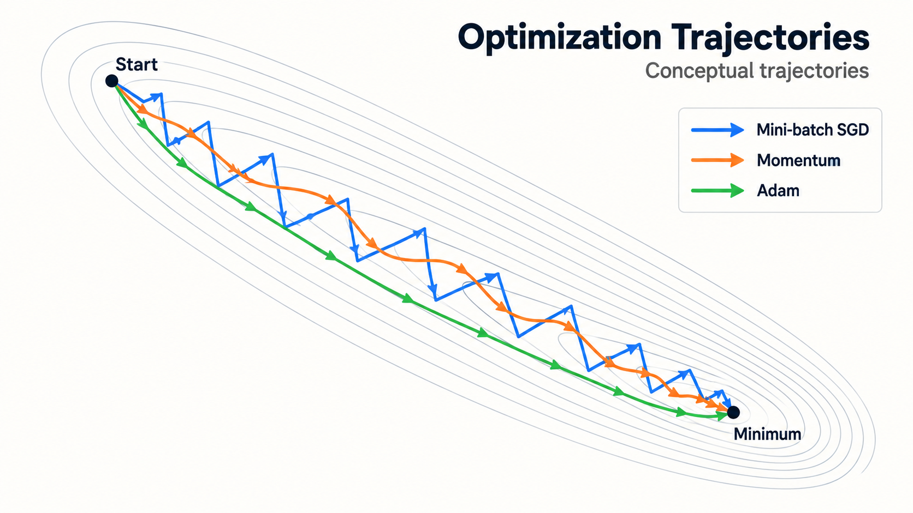
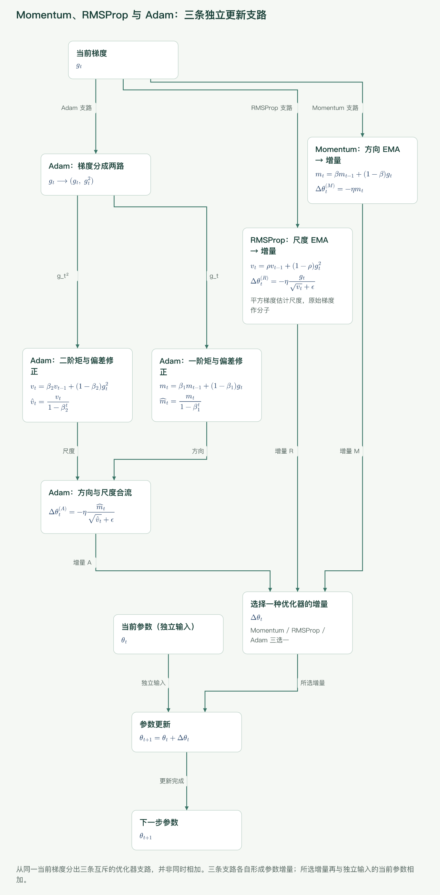
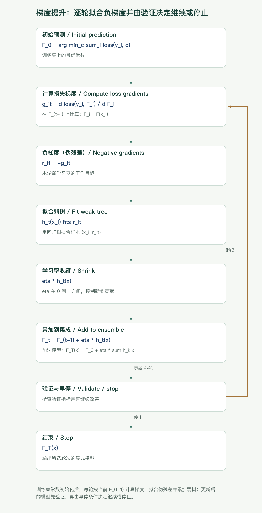
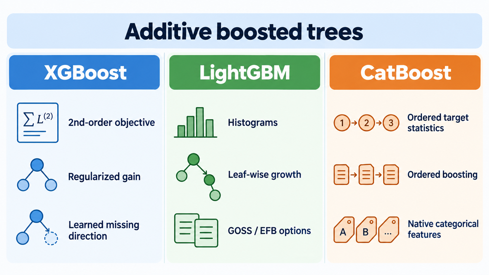

## 先拆掉一个最容易混淆的词：“梯度”

“梯度下降”和“梯度提升”都使用损失函数的梯度，但它们不是同一层面的替代方案。

| 问题           | 梯度下降优化器                   | 梯度提升树                                  |
| -------------- | -------------------------------- | ------------------------------------------- |
| 更新空间       | **参数空间**                     | **函数空间**                                |
| 每一步更新什么 | 一个模型的参数向量 $\theta$      | 新增一个弱学习器 $h_t(x)$，通常是一棵回归树 |
| 梯度对谁求导   | $\nabla_\theta L(\theta)$        | $\partial L(y_i,F(x_i))/\partial F(x_i)$    |
| 一步的结果     | 同一个神经网络得到一组新权重     | 集成中多一棵树                              |
| 典型任务       | 神经网络、线性模型的连续参数训练 | 结构化表格数据的回归、分类、排序            |

优化器做的是：在模型结构固定时，沿参数梯度移动同一组参数。

$$
\theta_{t+1}=\theta_t-\eta g_t,
\qquad g_t\approx\nabla_\theta L(\theta_t)
$$

梯度提升做的是：保持已有函数不动，逐轮寻找一个新函数去逼近当前损失的负梯度。

$$
F_t(x)=F_{t-1}(x)+\eta h_t(x)
$$

因此，AdamW 不能“换成 XGBoost 来训练同一个神经网络”，LightGBM 也不是一种神经网络优化器。提升树在确定叶值、搜索分裂时当然也执行数值优化，但那是树学习算法的内部步骤，不等于向它传入一个 `torch.optim` 优化器。

下面先讲参数空间中的优化器，再讲函数空间中的提升树。

## 一、梯度下降：先理解批量、噪声和学习率

设训练集有 $N$ 个样本，单样本损失为 $\ell_i(\theta)$，经验风险为

$$
L(\theta)=\frac{1}{N}\sum_{i=1}^{N}\ell_i(\theta).
$$

其中 $\theta$ 是全部可学习参数，$g_t$ 是第 $t$ 步使用的梯度估计，$\eta>0$ 是学习率。学习率决定步长尺度：太大可能越过谷底甚至发散，太小则进展缓慢。实际轨迹还受曲率、批量噪声、归一化和数值精度影响。

### Batch GD、SGD 与 mini-batch SGD

**批量梯度下降（Batch GD）**每步使用全部样本：

$$
g_t=\frac1N\sum_{i=1}^{N}\nabla_\theta\ell_i(\theta_t).
$$

方向稳定、在光滑凸问题上容易分析，但每一步都要扫完整数据，深度学习中通常太慢且无法充分利用随机性。

**严格意义的 SGD** 每步只抽一个样本 $i_t$：

$$
g_t=\nabla_\theta\ell_{i_t}(\theta_t).
$$

单步便宜，却有很大方差，会在最优点附近持续抖动。若学习率满足适当的递减条件，在常见凸优化假设下可以收敛；固定学习率通常只能进入最优点附近的噪声区域。

**Mini-batch SGD** 使用大小为 $B$ 的小批量 $\mathcal B_t$：

$$
g_t=\frac1B\sum_{i\in\mathcal B_t}\nabla_\theta\ell_i(\theta_t).
$$

它在梯度方差和硬件吞吐之间折中。深度学习实践里人们说“SGD”，通常就是 mini-batch SGD，而不是一次一个样本。增大批量一般会降低梯度噪声并提高并行度，但也增加显存占用；学习率、训练步数和泛化行为往往需要一起重调。



_图 1：统一二维损失地形上的概念示意，不是性能实测。SGD 的批量噪声带来锯齿；Momentum 累积一致方向并抑制横向摆动；Adam 还会按坐标缩放步长。真实结果并不保证 Adam 的路径总是最短。_

狭长谷地说明了一个关键困难：不同方向曲率差别很大。统一学习率要么让陡峭方向来回震荡，要么让平坦方向前进太慢。后续优化器的演进，基本围绕“平滑方向”和“按坐标调步长”展开。

## 二、从惯性到自适应步长

以下公式均按元素计算；$\odot$ 表示逐元素乘法，$g_t^2$ 表示逐元素平方，$\epsilon$ 是防止除零的极小正数。不同论文与库对动量缓冲区的缩放、$\epsilon$ 的位置等有细微差异，比较实现时应以所用库为准。

### 1. Momentum：给方向加惯性

采用指数移动平均（EMA）写法：

$$
m_t=\beta m_{t-1}+(1-\beta)g_t,
\qquad
\theta_{t+1}=\theta_t-\eta m_t.
$$

$\beta$ 是动量系数，常取接近 1 的值。EMA 给较近梯度更高权重，历史权重按 $\beta^k$ 衰减。若连续多步方向一致，$m_t$ 会稳定累积；若梯度在狭谷两侧交替变号，横向分量会相互抵消。

底层逻辑不是“让所有步都变大”，而是做低通滤波：保留持续信号，削弱高频摆动。它通常比裸 SGD 更快穿过狭长谷，也可能因惯性越过最低点。主要调节 $\eta$、$\beta$，状态内存为每个参数一个动量量，即额外 $O(P)$；$P$ 是参数个数。每步梯度计算仍是主要成本，附加逐元素运算为 $O(P)$。

### 2. Nesterov Accelerated Gradient：先看前方再修正

经典 NAG 在“前瞻位置”求梯度：

$$
\tilde\theta_t=\theta_t-\eta\beta v_{t-1},
$$

$$
v_t=\beta v_{t-1}+\nabla L(\tilde\theta_t),
\qquad
\theta_{t+1}=\theta_t-\eta v_t.
$$

普通 Momentum 先依据当前位置的坡度加速；NAG 先按惯性走到预计位置，再用那里的梯度纠偏。它在光滑凸问题上有更好的理论加速性质，在神经网络里也常作为 SGD 的可选增强。缺点是仍依赖全局学习率，并不解决各坐标尺度不同的问题；框架实现的等价重排可能看起来与上式不同。

### 3. AdaGrad：历史大梯度坐标自动减速

$$
s_t=s_{t-1}+g_t^2,
\qquad
\theta_{t+1}=\theta_t-\eta\frac{g_t}{\sqrt{s_t}+\epsilon}.
$$

$s_t$ 累加每个坐标的历史平方梯度。频繁出现大梯度的坐标分母变大、有效步长变小；稀疏且少更新的坐标还能保留较大步长。这使 AdaGrad 很适合稀疏特征和稀疏梯度。

问题在于 $s_t$ 单调增加：训练很久后有效学习率可能小到几乎停止。状态为每个参数一个累加器，额外内存 $O(P)$。关键超参数是 $\eta$ 和 $\epsilon$。

### 4. RMSProp：让二阶矩忘掉久远历史

RMSProp 将累加和改为平方梯度的 EMA：

$$
v_t=\rho v_{t-1}+(1-\rho)g_t^2,
$$

$$
\theta_{t+1}=\theta_t-\eta\frac{g_t}{\sqrt{v_t}+\epsilon}.
$$

$v_t$ 是未中心化二阶矩估计，可理解为近期梯度尺度。由于旧信息会衰减，分母不会像 AdaGrad 那样只增不减。它对非平稳目标、循环网络以及不同参数尺度差异明显的任务常较实用。代价仍是一个 $O(P)$ 状态；$\eta$、$\rho$ 和 $\epsilon$ 是主要超参数。

### 5. Adam：一阶方向与二阶尺度合流

Adam 同时维护梯度 EMA 和平方梯度 EMA：

$$
m_t=\beta_1m_{t-1}+(1-\beta_1)g_t,
$$

$$
v_t=\beta_2v_{t-1}+(1-\beta_2)g_t^2.
$$

由于 $m_0=v_0=0$，训练初期两者会偏向零，因此做偏差修正：

$$
\hat m_t=\frac{m_t}{1-\beta_1^t},
\qquad
\hat v_t=\frac{v_t}{1-\beta_2^t}.
$$

最终更新为

$$
\theta_{t+1}=\theta_t-\eta\frac{\hat m_t}{\sqrt{\hat v_t}+\epsilon}.
$$

$m_t$ 回答“近期总体朝哪走”，$v_t$ 回答“这个坐标近期波动多大”。Adam 往往能快速得到可用结果，对梯度尺度和稀疏性较稳健，是 Transformer 等模型常见的起点。但它并非在所有任务上都比带动量 SGD 泛化更好，也仍会因学习率不当、异常梯度或低精度数值问题而失败。

Adam 为每个参数保存 $m_t$、$v_t$ 两份状态，额外内存约 $2P$ 个状态元素；实际峰值还取决于框架实现。PyTorch 文档也提醒，`foreach` 实现可能因中间 tensor list 使用更多峰值内存。主要超参数是 $\eta,\beta_1,\beta_2,\epsilon$。



_图 2：Momentum 平滑梯度方向，RMSProp 用近期平方梯度缩放坐标；Adam 合并两条数据流并修正零初始化偏差。图中的 moment 是梯度统计量，不是损失函数的高阶导数。_

### 6. AdamW：权重衰减与梯度更新解耦

先看 L2 正则。若目标变为

$$
L_{\text{reg}}(\theta)=L(\theta)+\frac{\lambda}{2}\|\theta\|_2^2,
$$

传给优化器的梯度就是 $g_t+\lambda\theta_t$。对普通 SGD，这与按适当尺度直接收缩权重可以等价：

$$
\theta_{t+1}=(1-\eta\lambda)\theta_t-\eta g_t.
$$

但在 Adam 中，把 $\lambda\theta$ 加进梯度会让正则项也进入 $m_t$、$v_t$，再受到逐坐标自适应缩放；它不再等价于统一收缩参数。AdamW 的做法是把衰减独立出来：

$$
\theta_t'=(1-\eta\lambda)\theta_t,
$$

$$
\theta_{t+1}=\theta_t'-\eta\frac{\hat m_t}{\sqrt{\hat v_t}+\epsilon}.
$$

所以 **AdamW 不是“Adam 加 L2”的简称**，而是解耦权重衰减。原论文明确指出，L2 与 weight decay 对标准 SGD 可等价，对 Adam 等自适应方法却不等价；[PyTorch 的 AdamW 文档](https://docs.pytorch.org/docs/stable/generated/torch.optim.AdamW.html)也明确说明衰减不会累积进动量和方差。

实践中通常不给 bias、归一化层的缩放或偏移参数做衰减，但这不是数学定律，需要结合模型配参数组。AdamW 的状态与 Adam 相同，另有衰减系数 $\lambda$。

## 三、优化器总表：更新依据、代价与适用场景

下表把一次梯度计算之外的状态与逐元素开销列出；所有方法都还要保存参数和梯度。

| 方法           | 更新依据            | 每参数状态 | 附加计算 | 收敛行为与优势                 | 局限                           | 常见场景                     |
| -------------- | ------------------- | ---------: | -------: | ------------------------------ | ------------------------------ | ---------------------------- |
| Batch GD       | 全数据精确梯度      |          0 |   $O(P)$ | 轨迹稳定，便于凸优化分析       | 单步昂贵，不适合大数据         | 小型光滑问题                 |
| SGD            | 单样本梯度          |          0 |   $O(P)$ | 单步快，噪声可帮助探索         | 方差大、吞吐低                 | 在线学习、教学分析           |
| Mini-batch SGD | 小批量平均梯度      |          0 |   $O(P)$ | 吞吐、噪声与显存折中           | 对学习率和批量大小敏感         | 深度学习基线                 |
| Momentum       | 梯度一阶 EMA        |        $P$ |   $O(P)$ | 抑制震荡、沿持续方向加速       | 可能越过谷底                   | 视觉模型、重视泛化的成熟配方 |
| NAG            | 前瞻位置梯度 + 动量 |        $P$ |   $O(P)$ | 更早纠偏，光滑凸问题有加速理论 | 实现约定不一，仍需调全局学习率 | SGD 动量的替代配置           |
| AdaGrad        | 累积平方梯度        |        $P$ |   $O(P)$ | 稀疏坐标保留较大步长           | 有效学习率可能过早衰减         | 稀疏特征、线性模型           |
| RMSProp        | 平方梯度 EMA        |        $P$ |   $O(P)$ | 适应近期尺度，不会永久累加     | 仍需调衰减率与学习率           | 非平稳目标、RNN 等           |
| Adam           | 一阶 EMA + 二阶 EMA |       $2P$ |   $O(P)$ | 前期进展快、尺度自适应         | 状态内存较高，泛化不总占优     | 大多数深度网络的稳妥起点     |
| AdamW          | Adam + 解耦衰减     |       $2P$ |   $O(P)$ | 正则含义更清晰，便于独立调衰减 | 仍需排除不应衰减的参数         | Transformer、预训练与微调    |

这里的“收敛”不能只看训练损失：优化速度、最终验证指标和理论渐近收敛是三个问题。非凸深度网络通常没有“必达全局最优”的承诺。

## 四、手算两步：同一梯度为何产生不同轨迹

取一维目标

$$
f(\theta)=\frac12\theta^2,\qquad g=\theta,
$$

从 $\theta_0=2$ 开始，学习率 $\eta=0.1$。以下忽略 $\epsilon$；Momentum 使用前述 EMA 约定，Adam 使用 $\beta_1=0.9,\beta_2=0.999$。

### 裸 SGD

- 第 1 步：$g_1=2$，$\theta_1=2-0.1\times2=1.8$。
- 第 2 步：$g_2=1.8$，$\theta_2=1.8-0.1\times1.8=1.62$。

### Momentum

- 第 1 步：$m_1=0.9\times0+0.1\times2=0.2$，$\theta_1=1.98$。
- 第 2 步：$m_2=0.9\times0.2+0.1\times1.98=0.378$，$\theta_2=1.9422$。

这个 EMA 写法前期较慢，因为 $m_0=0$。有些库采用 $v_t=\beta v_{t-1}+g_t$ 的约定，数值不能直接与这里混用；其核心仍是历史方向累积。

### Adam

第 1 步：

$$
m_1=0.2,\quad v_1=0.001\times 2^2=0.004,
$$

$$
\hat m_1=2,\quad \hat v_1=4,\quad \theta_1=2-0.1\times\frac2{\sqrt4}=1.9.
$$

第 2 步的梯度为 $1.9$：

$$
m_2=0.9(0.2)+0.1(1.9)=0.37,
$$

$$
v_2=0.999(0.004)+0.001(1.9^2)=0.007606,
$$

$$
\hat m_2=0.37/(1-0.9^2)\approx1.9474,
$$

$$
\hat v_2=0.007606/(1-0.999^2)\approx3.805,
$$

所以 $\theta_2\approx1.9-0.1\times1.9474/\sqrt{3.805}\approx1.8002$。这个简单例子中，偏差修正让初始矩估计回到合理尺度；它不表示 Adam 在所有目标上都会走得更快。

## 五、一个未实测的 PyTorch 教学骨架

下面代码展示接口和正确的调用顺序，**未在当前环境执行，也不构成性能实测承诺**。PyTorch 的优化器对象持有状态，并在 `backward()` 产生梯度后调用 `step()` 更新参数；官方用法见 [`torch.optim`](https://docs.pytorch.org/docs/stable/optim.html)。

```python
import torch
from torch import nn

model = nn.Sequential(nn.Linear(20, 64), nn.ReLU(), nn.Linear(64, 1))
loss_fn = nn.MSELoss()

# 三选一；深度学习中的 SGD 通常配 mini-batch DataLoader
optimizer = torch.optim.SGD(model.parameters(), lr=1e-2, momentum=0.9,
                            nesterov=True)
# optimizer = torch.optim.RMSprop(model.parameters(), lr=1e-3, alpha=0.99)
# optimizer = torch.optim.AdamW(model.parameters(), lr=3e-4,
#                               betas=(0.9, 0.999), weight_decay=1e-2)

for x_batch, y_batch in train_loader:
    optimizer.zero_grad(set_to_none=True)
    prediction = model(x_batch)
    loss = loss_fn(prediction, y_batch)
    loss.backward()
    torch.nn.utils.clip_grad_norm_(model.parameters(), max_norm=1.0)  # 按需
    optimizer.step()
```

若加学习率调度器，应确认框架规定的调用顺序；当前 PyTorch 文档要求通常先 `optimizer.step()`，再 `scheduler.step()`。

## 六、梯度提升：在函数空间做前向分步优化

梯度提升构造加法模型：

$$
F_M(x)=F_0(x)+\eta\sum_{t=1}^{M}h_t(x),
$$

其中 $F_0$ 是常数初始预测，$h_t$ 是第 $t$ 个弱学习器，$M$ 是轮数或树数，$\eta$ 是收缩学习率。这里的学习率控制**新树对集成预测的贡献**，不是 Adam 那种参数更新步长。

在第 $t$ 轮，对每个样本计算伪残差（负梯度）：

$$
r_{it}=-\left[\frac{\partial \ell(y_i,F(x_i))}{\partial F(x_i)}\right]_{F=F_{t-1}}.
$$

然后拟合 $h_t(x)\approx r_{it}$，再把它加回已有模型。之所以叫“伪残差”，是因为只有平方误差下它才与普通残差成比例：若 $\ell=\frac12(y-F)^2$，则 $r=y-F$。二分类常用对数损失，此时负梯度与“真实标签减当前概率”相关，而不是原始标签本身。



_图 3：每棵新树拟合当前模型仍未解释的负梯度/残差，再乘学习率加入集成。训练标签没有改变，改变的是每轮树要逼近的工作目标。_

### 标准 GBDT 过程

1. 选择可微或可用次梯度处理的损失 $\ell$；回归可用平方、绝对或 Huber 类损失，分类常用对数损失。绝对误差在预测等于标签处不可微，实际实现需规定次梯度，并采用与该损失相匹配的叶值更新。
2. 初始化 $F_0=\arg\min_c\sum_i\ell(y_i,c)$。平方误差下即标签均值。
3. 第 $t$ 轮计算所有样本的伪残差 $r_{it}$。
4. 用一棵浅回归树拟合 $(x_i,r_{it})$。
5. 对每个叶区域求最合适的叶值，更新 $F_t=F_{t-1}+\eta h_t$。
6. 重复到 $M$ 轮，或验证指标不再改善时早停。

树越多，函数容量越大；树越深，单棵树能表达的高阶特征交互越多，也越容易过拟合。小学习率通常需要更多树，但常能得到更平滑的前向拟合过程。`learning_rate`、树数、叶数/深度、叶最小样本数、行列采样和正则化必须联合调节。scikit-learn 的[梯度提升文档](https://scikit-learn.org/stable/modules/ensemble.html#gradient-boosting)也把树数与学习率列为最重要的耦合参数。

### 一个表格数据的两轮小例子

假设按“区域”预测客单价，训练数据为：

| 样本 | 区域 | 访问次数 | 真实客单价 $y$ |
| ---- | ---- | -------: | -------------: |
| 1    | A    |        1 |             10 |
| 2    | A    |        3 |             12 |
| 3    | B    |        2 |             20 |
| 4    | B    |        4 |             22 |

使用平方误差，初始预测为均值 $F_0=16$，第一轮残差为 $[-6,-4,4,6]$。一棵只按区域切分的树会在 A 叶输出 $-5$，B 叶输出 $+5$。若 $\eta=0.5$，更新后 A、B 的预测分别为 $13.5$ 和 $18.5$。

此时残差变成 $[-3.5,-1.5,1.5,3.5]$。第二棵同样的树可输出 A 的 $-2.5$、B 的 $+2.5$；乘 $0.5$ 后，预测变为 A 的 $12.25$、B 的 $19.75$。后续树还可以利用访问次数解释同一区域内部的差异。

这个例子揭示了三件事：每轮目标依赖当前集成；学习率只加入部分修正；新树是在补洞，而不是独立重学完整标签。

## 七、从 GBDT 到 XGBoost、LightGBM 与 CatBoost

### XGBoost：二阶近似、显式正则与分裂增益

XGBoost 在第 $t$ 轮加入树 $f_t$，对损失做二阶泰勒近似。令

$$
g_i=\partial_{\hat y^{(t-1)}}\ell(y_i,\hat y_i^{(t-1)}),
\qquad
h_i=\partial^2_{\hat y^{(t-1)}}\ell(y_i,\hat y_i^{(t-1)}),
$$

近似目标为

$$
\sum_i\left[g_if_t(x_i)+\frac12h_if_t(x_i)^2\right]+\Omega(f_t).
$$

若树有 $T$ 个叶，叶分数为 $w_j$，常见复杂度项是

$$
\Omega(f)=\gamma T+\frac12\lambda\sum_{j=1}^{T}w_j^2.
$$

对叶 $j$ 定义 $G_j=\sum_{i\in I_j}g_i$、$H_j=\sum_{i\in I_j}h_i$，最优叶值为

$$
w_j^*=-\frac{G_j}{H_j+\lambda}.
$$

候选分裂的增益为

$$
\text{Gain}=\frac12\left[
\frac{G_L^2}{H_L+\lambda}+
\frac{G_R^2}{H_R+\lambda}-
\frac{(G_L+G_R)^2}{H_L+H_R+\lambda}
\right]-\gamma.
$$

这把梯度、曲率和树复杂度放进统一评分中。XGBoost 的[官方推导](https://xgboost.readthedocs.io/en/stable/tutorials/model.html)还说明了加法训练、叶值与增益的来源。

对稀疏或缺失值，建树时可为每个候选分裂学习默认方向：比较缺失样本走左、走右时的增益，再记录更优方向。工程层面还有列块、直方图/近似分裂、缓存友好访问、并行与分布式实现等；具体可用能力会随版本和 tree method 改变，不应把某个版本的速度结论当成普遍事实。

### LightGBM：直方图与 leaf-wise 生长

LightGBM 先把连续特征离散到有限 bins，以梯度和 Hessian 的直方图评估分裂。这样候选阈值由样本数级别缩到 bin 数级别，并可用父节点直方图减去一个子节点的直方图，得到另一个子节点。其[官方特性说明](https://lightgbm.readthedocs.io/en/stable/Features.html)强调了训练时间、内存和通信方面的这种工程取舍。

它默认采用 **leaf-wise（best-first）** 生长：每次扩展当前增益最大的叶，而不是让同一深度的所有节点一起扩展。固定叶数时，这往往更快降低训练损失；但小数据上也更容易长出很深的不平衡分支，因此 `num_leaves`、`min_data_in_leaf` 和必要时的 `max_depth` 很重要。

两项常被误解为“LightGBM 的全部定义”的技术其实是可选优化：

- **GOSS**（Gradient-based One-Side Sampling）保留大梯度样本，并抽样小梯度样本后校正权重，减少参与分裂统计的样本；它适合大样本场景，但抽样也可能增加近似误差。
- **EFB**（Exclusive Feature Bundling）把很少同时非零的稀疏特征打包，以减少有效特征数；它依赖近似互斥的稀疏结构，稠密且经常冲突的特征获益有限。

直方图、GOSS、EFB 与 leaf-wise 是不同维度的设计，不能混成一个概念；当前版本的默认值和设备支持应查参数文档。

### CatBoost：把类别特征泄漏问题放在核心位置

直接用全训练集标签均值编码类别，会让某个样本的标签进入它自己的特征，产生目标泄漏。CatBoost 的有序目标统计先构造随机排列；对排列位置 $i$ 的样本，只使用它之前同类别样本的标签统计，并结合先验平滑。直觉上，当前标签看不到自己。

类似地，普通 boosting 若用同一批样本生成当前预测再计算梯度，可能产生与有限样本有关的 **prediction shift（预测偏移）**。Ordered boosting 使用排列中“过去”的样本为当前位置构造中间模型/梯度估计，以降低这种偏移。CatBoost 还原生组合和处理类别特征，并常使用对称树结构；其[官方训练阶段说明](https://catboost.ai/en/docs/concepts/algorithm-main-stages)列出了类别特征变换、树结构选择与叶值计算等阶段，ordered boosting 的理论背景可参见 [CatBoost 论文](https://arxiv.org/abs/1706.09516)。

代价是这些有序统计和排列会增加实现复杂度与一定计算开销。它尤其适合类别列多、基数高且不希望手工 target encoding 的任务，但仍需正确声明类别列，并严格划分训练、验证和时间窗口。



_图 4：三者都属于加法提升树，差异主要在目标近似、分裂与建树工程、类别特征处理等侧重点；图中不是性能排名。_

### AdaBoost：必要的机制对照

AdaBoost 也逐轮加入弱学习器，但经典分类版本重点是**提高错分样本的权重**，并按弱学习器误差决定其投票权重。Gradient Boosting 则把任意可微损失的负梯度当作下一轮拟合目标。二者都属于 boosting，也都“让后续学习器关注当前错误”，但数学接口分别是样本重加权与函数空间梯度，不能把 AdaBoost 简化成 GBDT 的旧名字。

## 八、提升树家族对比

| 算法      | 目标近似                   | 建树/分裂侧重点                  | 类别特征                                 | 缺失值                                   | 速度与内存倾向                                             | 常见场景                       |
| --------- | -------------------------- | -------------------------------- | ---------------------------------------- | ---------------------------------------- | ---------------------------------------------------------- | ------------------------------ |
| 经典 GBDT | 通常一阶负梯度，叶内再优化 | 浅树逐轮拟合伪残差               | 通常先编码；依库而定                     | 通常先插补；直方图实现可能原生支持       | 小中型数据直观；精确分裂随数据增大变慢                     | 教学、稳定基线、小中型表格     |
| XGBoost   | 二阶 Taylor + 显式树正则   | 正则化分裂增益，多种 tree method | 当前版本可提供特定类别支持，需查参数约束 | 学习默认方向                             | 工程成熟，CPU/GPU/分布式选择多；资源取决于方法             | 通用表格、竞赛、排序与可控正则 |
| LightGBM  | 梯度 + Hessian             | 直方图、leaf-wise；可选 GOSS/EFB | 原生类别分裂                             | 原生处理                                 | 偏向大样本、高维与较低内存直方图训练；leaf-wise 需防过拟合 | 大型结构化数据、稀疏特征       |
| CatBoost  | 梯度方法 + ordered 机制    | 有序统计/提升、常用对称树        | 原生且强调防目标泄漏                     | 原生处理数值缺失；类别缺失语义需预先规范 | 类别处理省预处理，但有序机制可能增加训练开销               | 类别列多、高基数表格           |
| AdaBoost  | 指数损失视角下的样本重加权 | 关注错分样本、弱学习器加权投票   | 依基学习器与预处理                       | 依基学习器                               | 模型简单，但对噪声和离群点可能敏感                         | 小数据、机制对照、简单弱学习器 |

表中的实现能力会变化。例如 scikit-learn 当前把传统 `GradientBoosting*` 与直方图 `HistGradientBoosting*` 分开；后者原生支持缺失值和类别数据。具体项目应锁定库版本后查官方文档，而不是仅凭算法名推断功能。

## 九、两条决策路径

### 神经网络训练：怎么选优化器

1. **需要先得到稳定基线？** 从 AdamW 开始，配合验证集、学习率调度和合理 weight decay。
2. **已有成熟视觉/卷积训练配方，或 AdamW 验证泛化较差？** 试 Momentum SGD/NAG，并预留更充分的学习率搜索和训练轮数。
3. **梯度很稀疏？** 比较 AdaGrad、稀疏优化器或 Adam 系；先确认框架对稀疏张量的支持。
4. **显存卡在优化器状态？** 裸 SGD 为零额外矩状态，Momentum 一份，Adam/AdamW 两份；同时检查混合精度主权重、分布式分片和框架实现带来的额外内存。
5. **损失震荡或发散？** 先降学习率并检查数据、损失尺度和梯度，再考虑动量、裁剪或 warmup；不要用不停换优化器掩盖错误标签和数值溢出。

### 结构化表格任务：怎么选提升树

1. **先做可信基线**：小中型数据可用传统 GBDT 或直方图 GBDT，并设置验证早停。
2. **数据大、连续/稀疏特征多，重视直方图效率**：优先比较 LightGBM 与 XGBoost 的合适 tree method。
3. **类别特征多或基数高**：优先测试 CatBoost；若使用其他库，设计无泄漏编码并在交叉验证折内拟合编码器。
4. **缺失本身可能携带信息**：考虑原生缺失方向，但要验证训练与线上缺失机制一致。
5. **时间序列或群组数据**：先按时间/实体正确切分，再谈算法；随机切分造成的泄漏远大于库之间的差异。
6. **最终选择**：在相同数据切分、指标和预算下比较交叉验证均值、波动、训练/推理资源及可维护性，而不是照搬“某库最快”的营销结论。

## 十、常见误区与排障清单

### 概念误区

- **“Gradient Boosting 就是对树参数做 gradient descent。”** 不准确。它逐轮在函数空间添加树；树结构搜索还是离散的贪心过程。
- **“SGD 就是一次一个样本。”** 论文定义常如此，深度学习工程语境通常指 mini-batch SGD。
- **“二阶矩就是 Hessian。”** Adam/RMSProp 的 $v_t$ 是平方梯度 EMA，不是损失 Hessian；XGBoost 的 $h_i$ 才是对预测分数的二阶导。
- **“AdamW = Adam + L2。”** 错。AdamW 将权重衰减与自适应梯度更新解耦。
- **“残差永远是 $y-\hat y$。”** 只在平方误差等特定损失下成立；一般应说负梯度或伪残差。
- **“leaf-wise 一定更准，Adam 一定更快。”** 都是依赖数据、预算、正则和评价目标的经验倾向，不是保证。

### 神经网络排障

- 损失立即变成 NaN：降低学习率；检查除零、`log(0)`、混合精度溢出；打印梯度范数。
- 损失下降极慢：确认参数确实传给优化器、梯度没有被意外 `detach`、学习率调度没有提前降到零。
- 训练好而验证差：加强数据与正则策略，调整 weight decay；不要自动假定换 AdamW 就能解决。
- 恢复训练后曲线突变：同时恢复模型、优化器和调度器状态，并核对参数组顺序。
- 显存异常：估算参数、梯度、主权重和优化器状态；Adam 的两份矩状态往往不可忽略。

### 提升树排障

- 训练分数近乎完美、验证很差：减小叶数/深度，增大叶最小样本数，降低学习率并早停。
- 验证异常地好：检查 target encoding、时间穿越、同一实体跨折和训练前全量预处理。
- 加树后验证持续恶化：树数过多或学习率过大；以验证集早停，不用训练损失选轮数。
- 类别列效果差：确认类型声明、未知类别和缺失类别处理一致；不要无意中把类别 ID 当连续数值。
- 线上漂移：对比缺失率、类别集合、分箱范围与训练分布；原生缺失处理不能消除数据管道漂移。
- 结果不可复现：固定数据切分和随机种子，并记录库版本、线程数、设备和采样参数。

## 十一、分阶段学习路径

1. **第一阶段：统一梯度直觉。** 手算二次函数的 GD、Momentum、Adam；能解释学习率、EMA 和偏差修正。
2. **第二阶段：做一个二维可视化。** 固定同一损失地形，比较 mini-batch 噪声、动量和坐标缩放；区分示意与基准测试。
3. **第三阶段：理解函数空间。** 从平方误差推导“负梯度等于残差”，再换成对数损失，观察伪残差变化。
4. **第四阶段：手写简化 GBDT。** 用浅回归树拟合残差，只实现回归、学习率和树数，先吃透加法模型。
5. **第五阶段：读工程化目标。** 推导 XGBoost 的叶值和分裂增益，再理解直方图、leaf-wise 与 ordered statistics 分别解决什么问题。
6. **第六阶段：公平实验。** 固定切分与预算，比较优化器或提升库；报告验证指标、波动和资源，而不是只报最好一次。

## 最终选型速查表

| 你面对的问题                | 首选起点                       | 下一步比较                    | 最先监控什么                         |
| --------------------------- | ------------------------------ | ----------------------------- | ------------------------------------ |
| 通用神经网络训练            | AdamW                          | Momentum SGD                  | 验证指标、学习率、梯度范数、状态内存 |
| 成熟 CNN 配方、重视验证泛化 | Momentum SGD/NAG               | AdamW                         | 学习率日程、训练轮数                 |
| 稀疏梯度/特征               | AdaGrad 或合适的稀疏 Adam      | RMSProp/AdamW                 | 有效学习率、稀疏算子支持             |
| 小中型表格基线              | GBDT/HistGBDT                  | XGBoost                       | 切分正确性、早停轮数                 |
| 大型数值或稀疏表格          | LightGBM 或 XGBoost            | 另一实现交叉验证              | 内存、训练时间、叶复杂度             |
| 类别特征多且高基数          | CatBoost                       | 无泄漏编码 + LightGBM/XGBoost | 编码泄漏、未知类别、训练时间         |
| 需要解释两类“梯度”          | 参数梯度更新 vs 预测负梯度拟合 | 对照本文开篇表                | 更新对象究竟是参数还是新函数         |

一句话收束：**优化器决定一个参数化模型怎样走；梯度提升决定一个加法函数怎样长。** 先确认自己在更新什么，再讨论哪种“梯度”算法更合适。
