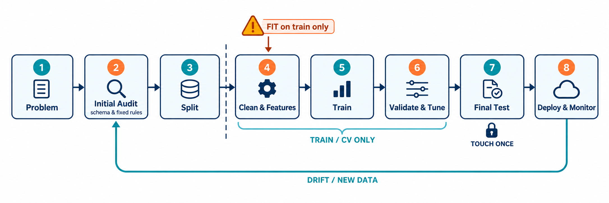

## 先建立正确的全局观

传统机器学习项目并不是“把 CSV 丢给一个算法”。更可靠的顺序是：

1. 把业务问题改写成可验证的预测问题；
2. 明确样本、预测时点、特征窗口和标签窗口；
3. 切分前只核验 schema、来源和预先确定的业务规则；
4. 按真实使用方式留出测试集；
5. 只在训练数据上探索分布，并学习插补值、缩放参数、编码词表和特征选择规则；
6. 从简单基线开始，用验证集或交叉验证选择方案；
7. 锁定方案后只评估一次测试集；
8. 将原始数据到预测结果的处理链一起保存，并监控上线后的数据和效果。



_图 1：虚线是关键边界。切分前的 Initial Audit 只检查 schema 与固定规则；缺失率、分布、标签关联、离群阈值等探索应在留出测试集后，只对训练数据进行。任何需要从数据中学习的步骤都只能在训练折内 `fit`，最终测试集只使用一次。对延迟标签，还必须保证训练样本的标签在每次拟合时已经成熟。_

scikit-learn 的[常见陷阱指南](https://scikit-learn.org/stable/common_pitfalls.html)建议先切分，再对训练集调用 `fit`/`fit_transform`，对验证集和测试集只调用 `transform`。这条边界通常比“选哪个模型”更重要。

## 第一步：先定义任务，而不是先选算法

开始建模前，至少写下一页“问题合同”：

- **样本是谁？** 一名客户、一笔订单、一套房，还是客户在某个月的一次快照？
- **预测时点是什么？** 模型何时判断，此时真正可获得哪些字段？
- **目标是什么？** 例如“未来 30 天是否流失”，而不是含糊的“客户流失”。
- **预测如何使用？** 客服只能联系风险最高的 5%，还是联系所有超过阈值的人？
- **错误代价是什么？** 漏掉流失客户与误打扰稳定客户，哪个代价更高？

### 二分类、多分类、多标签与回归

| 任务       | 一个样本的目标       | 例子                          | 常见输出             |
| ---------- | -------------------- | ----------------------------- | -------------------- |
| 二分类     | 两种互斥结果之一     | 30 天内流失/不流失            | 正类概率与 0/1 决策  |
| 多分类     | 三种以上互斥类别之一 | 流失原因：价格/服务/搬迁/其他 | 各类别概率           |
| 多标签分类 | 可同时具有多个标签   | 工单同时属于“计费”和“网络”    | 每个标签的概率或判断 |
| 回归       | 连续数值             | 房价、销售额、交付时长        | 一个数值或分位数     |

**多分类不等于多标签。** “猫、狗、鸟三选一”是多分类；“文章可同时属于科技、教育、商业”是多标签。二者的标签表示、损失函数和指标平均方式不同。

贯穿本文的任务是：每月形成客户快照，预测客户在接下来 30 天是否主动流失。若目标改为互斥的“流失原因”，它成为多分类；若改为未来 30 天消费金额，则成为回归。

## 贯穿案例：客户月度快照

下表是教学用结构，数值仅为示意：

| customer_id | snapshot_date | tenure_months | monthly_charges | support_calls_90d | contract_type | payment_method | last_login_date | churn_30d |
| ----------- | ------------- | ------------: | --------------: | ----------------: | ------------- | -------------- | --------------- | --------: |
| C001        | 2026-06-30    |            18 |            89.0 |                 0 | annual        | card           | 2026-06-28      |         0 |
| C002        | 2026-06-30    |             2 |           129.0 |                 5 | monthly       | e_wallet       | 2026-06-02      |         1 |
| C003        | 2026-06-30    |            37 |            缺失 |                 1 | annual        | card           | 2026-06-29      |         0 |

这里已经确定：`snapshot_date` 是预测时点；特征只能来自该日及以前；`churn_30d` 来自之后 30 天；`customer_id` 用于追踪和切分，通常不直接作为特征。“取消日期”“退款结果”“挽回工单结果”等预测后字段不能进入模型。

30 天标签还有一个容易遗漏的时间：**标签可用时间**。快照日后的 30 天没有走完时，标签尚未成熟；实际仓库可能还会晚一天或数天落库。应优先记录真实的 `label_available_at`，而不是仅凭快照月份推断。它只用于构造训练集和回测，绝不能作为模型特征。

同一客户可以有多个月份的记录，因此行与行并不独立。本文的主要上线目标是：用过去月份预测未来月份中的现有或新客户，所以主示例采用时间回测，而不是随机分层切分。

## 切分前初审：只检查元数据与固定规则

测试集尚未留出时，可以核验：

- 字段名、类型契约、来源系统和负责人；
- 主键应为 `customer_id + snapshot_date`，以及重复处理的预定规则；
- 预测时点、标签生成 SQL、标签成熟所需的 30 天等待期及真实落库时间；
- 时间键、客户分组键、单位、时区和允许类别；
- 数据字典已明确的硬规则，如月费不能为负、登录日不能晚于快照日；
- 字段写入时间是否晚于预测时点。

此时**不要**根据全表的缺失率、分位数、类别频数、正类比例或字段与标签的关系决定删列、阈值和特征。那些结论会把未来测试期的信息带回开发过程。

```python
# 教学示例：未在你的数据和环境中运行验证
import pandas as pd

raw = pd.read_csv("customer_churn.csv")
required = {
    "customer_id", "snapshot_date", "tenure_months", "monthly_charges",
    "support_calls_90d", "contract_type", "payment_method",
    "last_login_date", "churn_30d",
}
missing_columns = required - set(raw.columns)
if missing_columns:
    raise ValueError(f"缺少字段: {sorted(missing_columns)}")

# 这是 schema 校验，不是根据总体分布学习日期边界
snapshot = pd.to_datetime(raw["snapshot_date"], errors="raise")
if raw[["customer_id", "snapshot_date"]].isna().any().any():
    raise ValueError("主键字段不可为空")
```

## 先切分：模拟模型真正面对的未来

### 三种常见切法

- **近似独立同分布的普通分类**：训练/测试分层切分，使类别比例大致一致；训练集内部再做分层交叉验证。
- **时间问题**：训练使用过去，验证和测试使用更晚的数据，不能把未来随机打乱到过去。
- **同一实体有多行**：若目标是泛化到未见客户、患者或设备，应按实体分组，避免同一实体跨集合。

scikit-learn 的[交叉验证指南](https://scikit-learn.org/stable/modules/cross_validation.html)也强调：时间相关数据应采用时间感知切分，有组结构时应采用组间隔离切分。

本例预先用业务日历确定边界：2026 年 6 月为阈值验证期，2026 年 8 月起为最终测试期。7 月作为等待期，使 6 月快照的 30 天标签在 8 月定阈值和开始测试评分前成熟。开发模型模拟在 6 月 1 日拟合，因此训练行不仅要早于 6 月，其标签也必须在 6 月 1 日前可用。

```python
# 教学示例：未运行验证；日期边界和标签落库规则需按项目替换
TARGET = "churn_30d"
work = raw.loc[raw[TARGET].isin([0, 1])].copy()
work["snapshot_date"] = pd.to_datetime(work["snapshot_date"], errors="raise")

# 生产项目应优先读取标签仓库记录的真实可用时间。
# 这里只用 snapshot + 30 天演示最简标签成熟规则。
work["label_available_at"] = work["snapshot_date"] + pd.Timedelta(days=30)
work = work.sort_values("snapshot_date").reset_index(drop=True)

FIT_CUTOFF = pd.Timestamp("2026-06-01")
THRESHOLD_START = pd.Timestamp("2026-06-01")
THRESHOLD_END = pd.Timestamp("2026-07-01")
THRESHOLD_LOCK_AT = pd.Timestamp("2026-08-01")
TEST_START = pd.Timestamp("2026-08-01")

dev_raw = work.loc[
    (work["snapshot_date"] < THRESHOLD_START)
    & (work["label_available_at"] <= FIT_CUTOFF)
].copy()
threshold_raw = work.loc[
    (work["snapshot_date"] >= THRESHOLD_START)
    & (work["snapshot_date"] < THRESHOLD_END)
].copy()
test_raw = work.loc[work["snapshot_date"] >= TEST_START].copy()

# 断言的是模拟时点真正能看到标签，而不只是月份先后。
assert (dev_raw["label_available_at"] <= FIT_CUTOFF).all()
assert (threshold_raw["label_available_at"] <= THRESHOLD_LOCK_AT).all()
assert dev_raw["snapshot_date"].max() < threshold_raw["snapshot_date"].min()
assert threshold_raw["snapshot_date"].max() < test_raw["snapshot_date"].min()
```

这里的 7 月记录不进入训练、阈值选择或测试，是显式的 **purge/embargo 间隔**。30 天只是本例标签窗口；若真实落库更慢，就应使用真实 `label_available_at` 并延长间隔。测试集的指标也只能在其标签成熟后离线计算，但线上预测仍发生在各自快照时点。

如果部署目标明确是“只预测从未见过的新客户”，时间边界之外还要隔离客户：例如从未来测试期取出客户集合，再从过去训练期排除这些客户；每个验证折也做同样处理。这回答的是比“预测未来月份”更严格、也不同的问题，会丢掉测试客户的历史记录。不要为了形式同时套用时间与分组切分，先明确要估计哪种泛化能力。

训练集用于拟合模型和所有预处理统计量；阈值验证期只选行动阈值；测试期在方案锁定后估计一次泛化表现。若反复依据测试结果调整，测试集实际上已经变成验证集。

## 切分后审计：只在开发训练集探索

现在才对 `dev_raw` 做探索性数据分析（EDA）：

```python
# 教学示例：未运行验证；不要把 threshold_raw/test_raw 拼回来做这些统计
print(dev_raw.shape)
print(dev_raw.dtypes)
print(dev_raw.isna().mean().sort_values(ascending=False).head(20))
print(dev_raw.nunique(dropna=False).sort_values().head(20))
print(dev_raw.duplicated().sum())
print(dev_raw[TARGET].value_counts(dropna=False, normalize=True))
print(dev_raw.describe(include="all").T)
```

重点检查：

- 主键与业务重复；
- 缺失率、唯一值数量、数值分位数和极值；
- 类别拼写、空白、频数和罕见类别；
- 日期范围、时区和先后关系；
- 开发期标签比例，以及标签随月份、地区、渠道的变化；
- 候选字段与标签的异常强关联。

由这些结果提出的缺失率删列阈值、截断边界、类别合并和特征假设，都只能在开发期形成，并在交叉验证的训练折内拟合。最终测试期可以在一次正式评估时描述，以解释适用范围，但不能再反向改方案。

数据库整数未必是数值特征。邮政编码、门店编号和产品编号虽然由数字组成，本质上通常是类别或 ID。`describe` 也只能发现表象；还要询问字段何时写入、缺失代表系统故障还是业务不适用。

## 异常数据如何清洗

“异常”取决于业务规则和数据生成过程。极端值可能是录入错误，也可能是最有价值的高风险客户。**异常值不等于错误数据。**

| 问题            | 先确认什么               | 可选策略                                       | 主要边界                        |
| --------------- | ------------------------ | ---------------------------------------------- | ------------------------------- |
| 缺失值          | 缺失机制与业务含义       | 删除、常量/中位数/众数插补、模型插补、缺失指示 | 插补器只在训练数据拟合          |
| 重复值          | 技术重复还是多次合法事件 | 删除技术重复、聚合事件、按时间保留有效版本     | 不要误删复购或多次测量          |
| 格式/单位不一致 | 原始单位、时区、币种     | 统一格式、单位和时区，记录转换                 | 规则应来自数据字典              |
| 非法值          | 明确业务约束             | 回源修正、置缺失、删除                         | 年龄 999 可判非法，103 未必非法 |
| 离群点          | 是否真实、是否影响模型   | 保留、截断、变换、稳健缩放、分箱               | 阈值只能从训练折学习            |
| 标签错误        | 标签定义和生成延迟       | 回源复核、修正、排除不确定样本                 | 不能因模型猜错就改标签          |
| 数据泄漏        | 预测时是否可得           | 删除字段、重建窗口、重做切分                   | 异常高分首先查泄漏              |

### 缺失值

缺失极少且近似随机时可删除少量行，但要检查是否系统性排除某类人群。数值变量可用训练集的中位数作为稳健基线；类别变量可填入 `"missing"`；若“没有填写”本身有含义，可增加缺失指示变量。复杂插补不天然更好，应通过交叉验证比较并考虑维护成本。

scikit-learn 的[缺失值插补指南](https://scikit-learn.org/stable/modules/impute.html)介绍了 `SimpleImputer`、KNN 和迭代插补，也支持 `add_indicator=True`。`IterativeImputer` 的 API 状态可能随版本变化，请以项目安装版本文档为准。

### 离群点

可按三层判断：硬规则负责识别明确非法值；IQR、MAD、分位数和箱线图只负责提示；Isolation Forest、Local Outlier Factor 等可发现多变量异常，但仍需业务解释。scikit-learn 区分[离群点检测与新颖点检测](https://scikit-learn.org/stable/modules/outlier_detection.html)，不要直接把无监督检测器的输出当成删除名单。

明确录入错误应优先回源；合法长尾可保留并尝试 `log1p`、稳健缩放或分箱；传感器饱和时按设备上限截断可能合理；若代表另一业务群体，可增加群体特征或分群建模。

## 特征工程：把业务信息变成可学习表示

特征工程不是无止境制造列，而是在**预测时可获得**的前提下，让输入更稳定、更贴近问题。

### 数值特征

- **标准化**：变为近似零均值、单位方差，对逻辑回归、SVM、KNN 和正则化线性模型常有帮助；树模型通常不依赖它。
- **归一化**：映射到固定区间，适合确有边界的量，但对极端值敏感。
- **稳健缩放**：基于中位数和分位数，适合长尾变量。
- **对数/幂变换**：缓解正偏长尾；零和负数需单独处理。
- **分箱**：可增强非线性表达和解释性，但会损失细节。
- **交互与比率**：例如工单数/账户月数，应有业务假设并处理零分母。

### 类别、日期与文本

One-hot 适合无序、基数不高的类别；序数编码只用于确有顺序的类别。高基数特征可考虑频数、哈希或目标编码，但目标编码必须在训练折内计算。客户 ID 通常只用于连接、分组和追踪。

日期可转为距上次登录天数、星期、月份，以及过去 7/30/90 天的次数与趋势。滚动统计必须在快照时点截断。短文本可从 TF-IDF 加线性模型开始；若文本是在问题解决后填写，它很可能泄漏结果。

领域特征常比复杂模型更值钱，例如“近 30 天使用量相对过去 6 个月均值的下降率”。必须明确观察窗口、最小分母和缺失含义。

### 特征选择与降维

过滤法、递归特征消除、L1 正则和树模型可用于选择特征。PCA 适合大量相关数值变量，但牺牲可解释性，且要先处理缺失与尺度。选择、降维、分箱和截断都要放进交叉验证 Pipeline；先在全数据上选特征再验证会产生乐观偏差。

## 用 Pipeline 固化规则：完整时间切分示例

下面代码是**教学示例，未在你的数据、Python 或 scikit-learn 版本中运行验证**。列名、日期边界和参数需按项目修改；易变 API 请以[当前官方文档](https://scikit-learn.org/stable/)与本地版本为准。

### 1. 把确定性特征生成放进可序列化 Transformer

在实际项目中将下面类放在可导入模块 `churn_features.py`，而不是只定义在 Notebook 或 `__main__`。这样 joblib 加载时能找到同一类；模块版本也应随制品锁定。

```python
# churn_features.py；教学示例，未运行验证
import numpy as np
import pandas as pd
from sklearn.base import BaseEstimator, TransformerMixin

class ChurnFeatureBuilder(BaseEstimator, TransformerMixin):
    REQUIRED = {
        "customer_id", "snapshot_date", "tenure_months", "monthly_charges",
        "support_calls_90d", "contract_type", "payment_method", "last_login_date",
    }

    def fit(self, X, y=None):
        return self  # 不从总体分布学习参数

    def transform(self, X):
        missing = self.REQUIRED - set(X.columns)
        if missing:
            raise ValueError(f"缺少原始字段: {sorted(missing)}")
        out = X.copy()
        for col in ["contract_type", "payment_method"]:
            out[col] = out[col].astype("string").str.strip().str.lower()
        snapshot = pd.to_datetime(out["snapshot_date"], errors="coerce")
        last_login = pd.to_datetime(out["last_login_date"], errors="coerce")
        out["days_since_last_login"] = (snapshot - last_login).dt.days

        out.loc[out["tenure_months"] < 0, "tenure_months"] = np.nan
        out.loc[out["monthly_charges"] < 0, "monthly_charges"] = np.nan
        out.loc[out["days_since_last_login"] < 0, "days_since_last_login"] = np.nan
        out["calls_per_tenure_month"] = (
            out["support_calls_90d"] / (out["tenure_months"] + 1)
        )
        return out
```

Transformer 不负责删行，因为 `transform` 改变样本数会让 `X` 与 `y` 错位。技术重复应由上游按预先登记的主键和来源规则处理；是否属于业务重复，只在开发数据上调查。

### 2. 从原始字段构建完整 Pipeline

```python
# train.py；教学示例，未运行验证
from churn_features import ChurnFeatureBuilder
from sklearn.compose import ColumnTransformer
from sklearn.impute import SimpleImputer
from sklearn.linear_model import LogisticRegression
from sklearn.pipeline import Pipeline
from sklearn.preprocessing import OneHotEncoder, StandardScaler

num_cols = [
    "tenure_months", "monthly_charges", "support_calls_90d",
    "days_since_last_login", "calls_per_tenure_month",
]
cat_cols = ["contract_type", "payment_method"]

numeric_pipe = Pipeline([
    ("imputer", SimpleImputer(strategy="median", add_indicator=True)),
    ("scaler", StandardScaler()),
])
categorical_pipe = Pipeline([
    ("imputer", SimpleImputer(strategy="most_frequent")),
    ("onehot", OneHotEncoder(handle_unknown="ignore")),
])
preprocess = ColumnTransformer([
    ("num", numeric_pipe, num_cols),
    ("cat", categorical_pipe, cat_cols),
])
model = Pipeline([
    ("features", ChurnFeatureBuilder()),
    ("preprocess", preprocess),
    ("classifier", LogisticRegression(max_iter=1000, random_state=42)),
])

# 标签可用时间只控制样本资格，不进入模型。
DROP_FROM_X = [TARGET, "label_available_at"]
X_dev = dev_raw.drop(columns=DROP_FROM_X).reset_index(drop=True)
y_dev = dev_raw[TARGET].astype(int).reset_index(drop=True)
dev_label_available = dev_raw["label_available_at"].reset_index(drop=True)

X_threshold = threshold_raw.drop(columns=DROP_FROM_X).reset_index(drop=True)
y_threshold = threshold_raw[TARGET].astype(int).reset_index(drop=True)
X_test = test_raw.drop(columns=DROP_FROM_X).reset_index(drop=True)
y_test = test_raw[TARGET].astype(int).reset_index(drop=True)
```

`ColumnTransformer` 可对不同列应用不同转换，再与特征构建器和分类器装进一条 Pipeline。[组合估计器指南](https://scikit-learn.org/stable/modules/compose.html)说明，这可统一 `fit`/`predict`、联合搜索参数，并减少交叉验证中的泄漏。

### 3. 按月份扩展窗口验证和调参

每一折都把验证月月初视作该折的拟合时点。训练样本必须同时满足“快照更早”和“标签在拟合时点前已经可用”。这会自然清除紧邻验证月、但 30 天标签尚未成熟的记录。

```python
# 教学示例：未运行验证
import numpy as np
import pandas as pd
from sklearn.dummy import DummyClassifier
from sklearn.model_selection import GridSearchCV, cross_validate

# 用一个月份验证；训练行还必须在该折拟合时点前标签已成熟。
def expanding_month_splits(dates, label_available_at, min_train_months=6):
    dates = pd.to_datetime(dates).reset_index(drop=True)
    available = pd.to_datetime(label_available_at).reset_index(drop=True)
    months = pd.PeriodIndex(dates, freq="M")
    unique_months = sorted(months.unique())

    for i in range(min_train_months, len(unique_months)):
        valid_month = unique_months[i]
        fit_cutoff = valid_month.start_time
        train_mask = (months < valid_month) & (available <= fit_cutoff)
        valid_mask = months == valid_month
        train_idx = np.flatnonzero(train_mask)
        valid_idx = np.flatnonzero(valid_mask)
        if len(train_idx) and len(valid_idx):
            assert (available.iloc[train_idx] <= fit_cutoff).all()
            yield train_idx, valid_idx

cv = list(expanding_month_splits(
    X_dev["snapshot_date"], dev_label_available, min_train_months=6
))
if not cv:
    raise ValueError("开发期月份不足，无法进行带标签成熟约束的扩展窗口验证")

scoring = {
    "roc_auc": "roc_auc",
    "average_precision": "average_precision",
    "f1": "f1",
    "neg_log_loss": "neg_log_loss",
}
dummy = Pipeline([
    ("features", ChurnFeatureBuilder()),
    ("preprocess", preprocess),
    ("classifier", DummyClassifier(strategy="prior")),
])
print(cross_validate(dummy, X_dev, y_dev, cv=cv, scoring=scoring))

param_grid = {
    "classifier__C": [0.1, 1.0, 10.0],
    "classifier__class_weight": [None, "balanced"],
}
search = GridSearchCV(
    model, param_grid=param_grid, scoring=scoring,
    refit="average_precision", cv=cv, n_jobs=-1,
)
search.fit(X_dev, y_dev)
print(search.best_params_, search.best_score_)
```

每个验证月应同时含有所需类别，否则 ROC-AUC 等指标可能无定义；真实项目应在建折时检查样本量和正类数。这里不使用 `StratifiedKFold`，因为月度快照不是可随意打乱的独立样本。

### 4. 用同一个锁定模型选阈值，再测试一次

超参数只用较早开发期选择。`GridSearchCV(refit=...)` 会用选出的超参数在完整 `X_dev` 上重新拟合；而 `X_dev` 已明确限制为截至 6 月 1 日标签成熟的数据。下面克隆并拟合一次只是让“最终锁定模型”更直观。

关键点是：**6 月概率、行动阈值和 8 月测试概率全部来自同一个已拟合模型。** 定阈值后不再把 6 月阈值集并入训练，否则插补值、缩放参数、类别词表和模型系数都会变化，旧阈值不再对应新的概率尺度。

```python
# 教学示例：未运行验证
from sklearn.base import clone
from sklearn.metrics import (
    average_precision_score, classification_report, confusion_matrix,
    f1_score, log_loss, precision_score, recall_score, roc_auc_score,
)

assert (dev_label_available <= FIT_CUTOFF).all()
assert (threshold_raw["label_available_at"] <= THRESHOLD_LOCK_AT).all()

# 该模型只使用在 2026-06-01 已成熟的开发标签拟合。
selected_model = clone(search.best_estimator_).fit(X_dev, y_dev)
threshold_prob = selected_model.predict_proba(X_threshold)[:, 1]

candidates = []
for t in np.linspace(0.05, 0.95, 91):
    pred = (threshold_prob >= t).astype(int)
    candidates.append({
        "threshold": t,
        "precision": precision_score(y_threshold, pred, zero_division=0),
        "recall": recall_score(y_threshold, pred, zero_division=0),
        "f1": f1_score(y_threshold, pred, zero_division=0),
    })
feasible = [row for row in candidates if row["recall"] >= 0.80]
chosen = max(feasible, key=lambda r: r["precision"]) if feasible else max(
    candidates, key=lambda r: r["f1"]
)
threshold = float(chosen["threshold"])

# 不重新拟合：阈值必须对应实际用于评分的同一模型。
final_model = selected_model

test_prob = final_model.predict_proba(X_test)[:, 1]
test_pred = (test_prob >= threshold).astype(int)
print("threshold:", threshold)
print(confusion_matrix(y_test, test_pred))
print(classification_report(y_test, test_pred, digits=3, zero_division=0))
print("ROC-AUC:", roc_auc_score(y_test, test_prob))
print("Average precision:", average_precision_score(y_test, test_prob))
print("Log loss:", log_loss(y_test, test_prob))
```

6 月标签要等到 8 月 1 日前全部成熟，才能锁定阈值；8 月样本可从该日起按快照评分，其测试指标则要等 8 月标签陆续成熟后再计算。测试输出是一次最终报告，不是新一轮调参依据。

若必须利用阈值期数据重训，就要再留出一个更晚、标签已成熟的阈值/校准集：先拟合真正要上线的模型，再在该独立集合上为这个模型定阈值。数据很少时，也可设计严格的时间嵌套 OOF 流程，但实现和计算成本更高。

### 5. 保存后直接预测原始记录

```python
# 教学示例：未运行验证；只加载可信来源的 joblib/pickle
import joblib
import pandas as pd

artifact = {
    "model": final_model,          # 内含原始 schema 校验、特征、预处理和分类器
    "threshold": threshold,
    "feature_code_version": "churn-features==1.0.0",
    "label_definition": "snapshot 后 30 天内是否主动流失",
}
joblib.dump(artifact, "churn_pipeline.joblib")

loaded = joblib.load("churn_pipeline.joblib")
new_raw = pd.DataFrame([{
    "customer_id": "C9001",
    "snapshot_date": "2026-09-01",
    "tenure_months": 3,
    "monthly_charges": 118.0,
    "support_calls_90d": 4,
    "contract_type": "monthly",
    "payment_method": "card",
    "last_login_date": "2026-08-12",
}])
probability = loaded["model"].predict_proba(new_raw)[:, 1]
prediction = (probability >= loaded["threshold"]).astype(int)
print({"churn_probability": float(probability[0]), "action": int(prediction[0])})
```

加载环境仍需安装相同的 `churn_features` 模块及兼容依赖。生产制品还应记录代码提交、依赖锁文件、训练时间范围、标签可用截止时间、schema、模型参数、阈值、验证报告和负责人。

## 分类模型如何选择

表格分类可先建立三层短名单：

1. `DummyClassifier`，确认是否超过先验规则；
2. 正则化逻辑回归，速度快、适合稀疏 one-hot、较易解释；
3. 一个树模型基线，如随机森林或梯度提升，用于表达非线性与交互。

SVM 可在数据量和尺度合适时作为有理由的候选，但概率输出和计算成本要单独考虑。选择模型还要看方差、延迟、内存、可解释性和维护成本，而不是只看一项分数。

多分类模型可能采用 One-vs-Rest、One-vs-One 或原生多分类目标。具体估计器的默认策略与参数可能随版本变化，应查看对应版本文档，并报告每个类别的混淆情况。

## 分类指标：匹配真正的决策

设流失为正类：TP 是预测流失且确实流失；FP 是误报；FN 是漏报；TN 是正确识别未流失。混淆矩阵是许多指标的起点。

- **Precision**：被干预者中真正会流失的比例，联系成本高时重要；
- **Recall**：真正流失者中被找出的比例，漏失代价高时重要；
- **F1**：precision 与 recall 的调和平均，但不表达真实金额成本；
- **ROC-AUC**：跨阈值的排序能力，极不平衡时可能显得乐观；
- **PR-AUC / Average Precision**：更聚焦正类，报告时应写明具体定义；
- **Log loss**：评价整组概率，过度自信的错误惩罚更大；
- **Accuracy**：总体正确率，类别极不平衡时可能没有意义。

scikit-learn 的[模型评估指南](https://scikit-learn.org/stable/modules/model_evaluation.html)强调，指标应与预测对象和业务决策对齐，而非机械使用默认 `score`。

### 多分类的平均方式

- **macro**：逐类计算后等权平均，重视少数类；
- **weighted**：按各类真实样本数加权，可能掩盖少数类失败；
- **micro**：先汇总各类 TP/FP/FN，更受高频类别影响；
- **samples**：按样本计算，只用于多标签场景。

最好同时报告每类指标、support、macro 与 weighted，而不是只给一个总分。

## 类别不平衡、阈值与概率校准

先判断不平衡是现实基率还是采样偏差，再考虑：选择 PR 指标、召回率、precision@k 或成本；确保各验证期有正样本；尝试 `class_weight`；仅在训练折内重采样；最后按成本或容量调阈值。

阈值可采用约束式（召回至少 80% 时最大化 precision）、成本式或容量式（只联系 top-k）。如果下游需要“0.8 就约等于 80% 风险”，还要检查校准曲线和 Brier score，并在独立验证数据或交叉验证内拟合校准器。排序好不等于概率准。阈值或校准器必须对应最终评分模型；模型重新拟合后应重新验证它们。

## 回归：从房价案例理解模型与指标

将任务改为房价回归时，样本是一套在估价日可观察的房屋，标签是之后的实际成交价。面积、房龄、区域和估价日前市场统计可以作为特征；成交后的议价记录不能使用。

代表性基线包括 `DummyRegressor(strategy="median")`、Ridge/Elastic Net 和一个树集成模型。

- **MAE**：与目标同单位，对极端误差相对不敏感；
- **MSE**：大误差惩罚更重，但单位变成平方；
- **RMSE**：恢复原单位，仍强调大误差；
- **R²**：相对预测均值解释的方差比例，测试集上可为负；
- **MAPE**：真实值为零时无定义，接近零时会爆炸，对高估与低估也不对称。

豪宅大额错误特别昂贵时可重视 RMSE；强调典型金额误差时可优先 MAE。长尾目标可比较对数变换，并用 `TransformedTargetRegressor` 封装逆变换。还应按价格带、区域和时间报告误差。

## 调参、误差分析与可解释性

交叉验证策略就是对上线场景的假设。普通独立样本可使用分层 k 折；时间数据使用扩展或滚动窗口；目标是未见实体时使用分组验证。延迟标签还要求每折训练标签在该折拟合时点已经可用。报告均值时也应报告折间波动。

推荐顺序是：固定切分与主指标，建立 Dummy 和简单模型，修正流程问题，只搜索少数关键参数，比较验证均值、波动和成本，锁定特征、模型与阈值后再碰测试集。大量尝试会使普通验证分数产生选择偏差；要求严格无偏时可使用嵌套交叉验证。

误差分析应检查 FP/FN、新老客户、渠道、地区、缺失多的样本、罕见类别、边界值和最新月份。每轮只形成可验证假设，而不是盲目增加几十列。

逻辑回归系数、树重要性、置换重要性、PDP、ICE 和 SHAP 都是在解释模型，不自动代表因果。共线性、相关特征和高基数会影响解释；泄漏模型也能生成漂亮的解释图。

## 最终测试、部署和监控

最终报告至少包含数据时间范围、标签成熟截止时间、样本量、正类比例、主辅指标、固定阈值下的混淆矩阵、业务切片、基线比较、延迟、资源与已知限制。

部署时保存从原始 schema 到预测的完整 Pipeline，并校验字段名称、类型、范围、必填项和未知类别。上线监控分三层：

1. **系统监控**：请求量、延迟、错误率、空值和 schema 变化；
2. **数据漂移**：输入分布或类别比例变化；
3. **概念漂移**：`P(y|X)` 改变，同样行为对应的风险不同。

数据漂移不必然导致性能下降。若标签延迟 30 天，可先监控输入和预测分布，标签到齐后再计算 precision、recall、校准与业务收益。重训还需要触发条件、审批、回滚和重新验证。

## 常见错误与排障清单

| 症状                    | 常见原因                     | 优先检查                                 |
| ----------------------- | ---------------------------- | ---------------------------------------- |
| 验证分数接近 1          | 标签泄漏、重复样本、未来字段 | 字段可用时间、主键、标签逻辑             |
| 时间回测异常乐观        | 训练用了尚未成熟的延迟标签   | `label_available_at`、拟合时点与 embargo |
| 验证好、线上差          | 随机切分不符合时间/分组结构  | 改做时间或分组回测                       |
| 训练正常、预测缺列      | 推理链未包含特征生成         | 保存并加载原始 schema 到模型的 Pipeline  |
| 新类别报错              | 编码器不接受未知类别         | `handle_unknown="ignore"` 与监控         |
| accuracy 高但抓不到正类 | 类别不平衡、阈值不合适       | 混淆矩阵、PR 指标、阈值                  |
| 换模型后约束失效        | 沿用了旧模型选择的阈值       | 用最终评分模型重新选阈值                 |
| 结果波动大              | 样本少、月份差异、随机性     | 固定切分并报告多折波动                   |
| 系数巨大或不收敛        | 尺度差异、共线性、迭代不足   | 缩放、正则化、范围和警告                 |
| MAPE 离谱               | 真实值为零或接近零           | 改看 MAE/RMSE                            |
| 重要性违反常识          | 泄漏、代理变量、相关特征     | 逐列审计与切片分析                       |
| 测试分数不断变好        | 反复依据测试结果改方案       | 重建真正未见的留出集                     |

## 分阶段学习路径

### 阶段一：完成可靠基线

学习 pandas 类型、缺失和分组统计；任务定义；基本切分；插补、编码、缩放；逻辑回归、线性回归、树；混淆矩阵与 MAE/RMSE。练习：完成 Dummy 与逻辑回归 Pipeline，并写一页审计报告。

### 阶段二：掌握防泄漏实验

学习 `ColumnTransformer`、`Pipeline`、分层/分组/时间验证、标签成熟边界、超参数搜索、PR-AUC、log loss、R²、阈值和误差切片。练习：故意加入“取消日期”，比较错误流程与正确流程。

### 阶段三：把特征工程变成假设检验

学习时间窗口、比率、趋势、交互、长尾变换、特征选择、PCA、多分类平均、概率校准和置换重要性。练习：将流失改成原因多分类，并完成房价回归项目。

### 阶段四：完成可交付项目

学习数据与模型版本、schema 校验、批量/在线推理、漂移、延迟标签、回滚和重训。成果应包括问题合同、数据字典、审计报告、训练脚本、验证与测试报告、模型制品、推理示例和监控方案，而不只是 Notebook。

## 最终流程检查表

### 问题、审计与切分

- [ ] 样本、预测时点、特征窗口、标签窗口明确
- [ ] 延迟标签有明确的真实可用时间，每次拟合只使用当时已成熟的标签
- [ ] 已区分二分类、多分类、多标签或回归
- [ ] 切分前只核验 schema、来源、主键、预测时点、标签逻辑、时间/分组键和固定规则
- [ ] 先按上线场景留出测试集，再只用训练数据研究缺失率、分布、标签比例与关联
- [ ] 切分方式符合随机、时间或分组结构；需要时设置 purge/embargo
- [ ] 测试集未参与删列、离群阈值、特征假设、调参和阈值选择

### 特征与模型

- [ ] 每个候选字段在预测时可得
- [ ] 插补、缩放、编码、选择、降维均在训练折内拟合
- [ ] 异常值先查原因，没有把“罕见”直接当“错误”
- [ ] 原始 schema 校验、确定性特征、预处理与模型在同一可加载推理链中
- [ ] 有 Dummy 和简单模型基线
- [ ] 主指标提前确定，多分类平均方式和回归指标边界已说明
- [ ] 超参数、阈值、校准分别使用合适的训练/验证边界
- [ ] 阈值与校准器对应实际评分模型，模型改变后不沿用旧阈值
- [ ] 锁定方案后只使用一次最终测试集

### 交付与监控

- [ ] 保存完整 Pipeline、阈值、特征代码与依赖版本
- [ ] 单条和批量预测都经过 schema 校验
- [ ] 有系统、数据漂移、预测分布和延迟效果监控
- [ ] 明确告警、重训、审批、回滚和负责人

成熟的传统机器学习流程，不是模型越来越复杂，而是每一步都能回答：**为什么做、只从哪里学习、此刻哪些标签真正可用、上线后如何保持一致**。守住预测时点、标签成熟时间和训练/测试边界，再用 Pipeline 固化原始数据到预测的整条处理链，分类与回归就能共享同一套可靠方法论。
