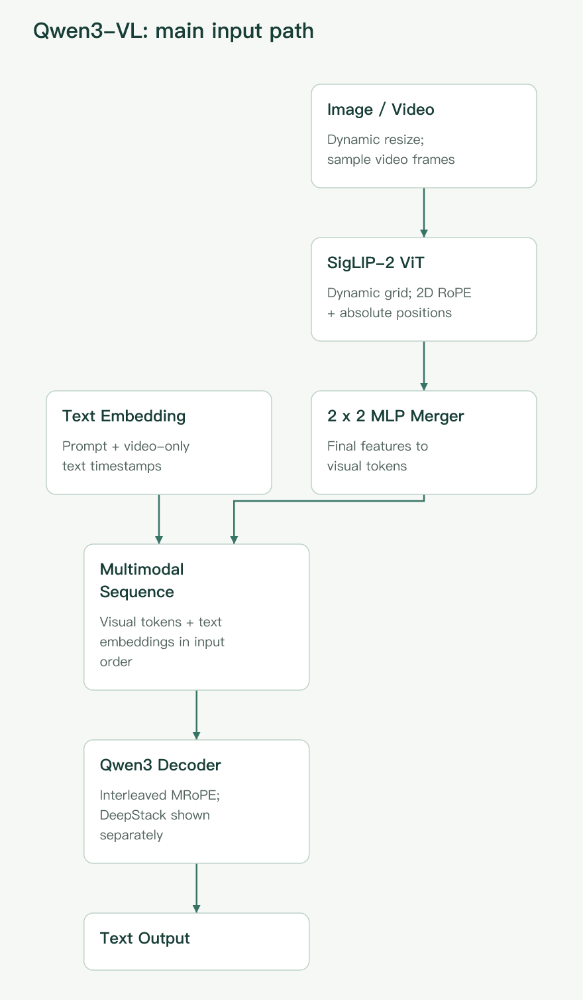
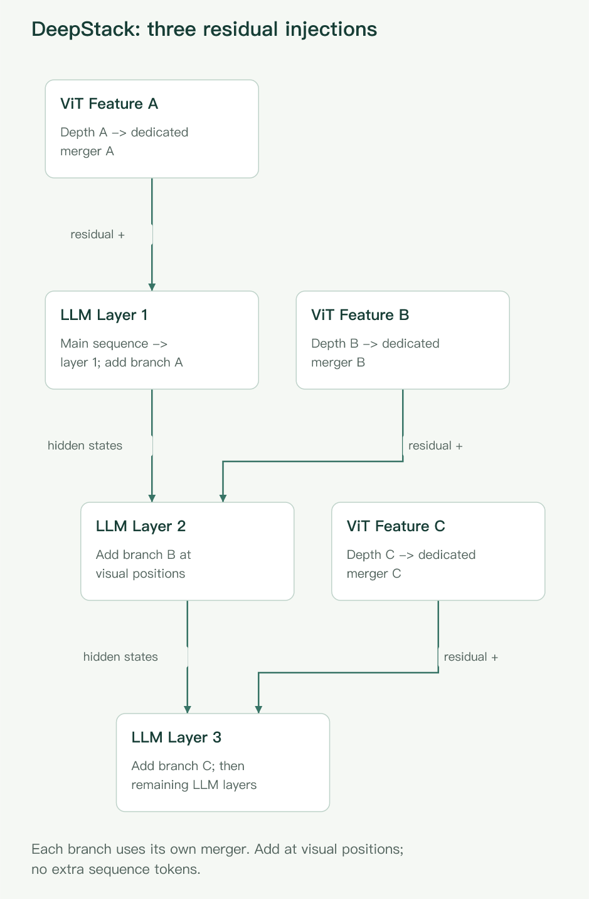

## 先说清楚：现在读 Qwen-VL，应该读哪一代？

理解 Qwen-VL，最重要的不是记住模型排行榜，而是回答三个问题：**图片怎样变成语言模型能使用的表示？细节、空间和时间信息怎样保留下来？训练又怎样让这些表示真正参与推理？**

本文检索截至 **2026-09-26** 的官方论文、技术报告和项目资料。首先需要纠正一个容易过时的说法：**Qwen3-VL 并不是此时整个 Qwen 家族最新的多模态模型。**

| 阅读对象                               | 本文中的位置         | 为什么要读                                                    |
| -------------------------------------- | -------------------- | ------------------------------------------------------------- |
| 原始 Qwen-VL，2023                     | 起点                 | 理解视觉编码器、位置感知适配器与语言模型的分工                |
| Qwen2-VL、Qwen2.5-VL，2024—2025        | 关键演进             | 理解动态分辨率、图像与视频统一处理、空间与时间编码            |
| Qwen3-VL，报告于 2025-11 发布          | **VL 架构深读主线**  | 本次检索中，仍以 Qwen-VL 系列命名且具备完整技术报告的最新一代 |
| Qwen3.5、Qwen3.8，2026                 | 更新的统一多模态主线 | 不能因名称不带 VL，就忽略其视觉能力与架构变化                 |
| Qwen3.8-Next、Qwen3.8-Omni，2026-08—09 | 最新报告补充         | 分别解释高效混合骨干，以及音视频统一理解和智能体工作流        |

这一划分依据 [Qwen3-VL 报告](https://arxiv.org/abs/2511.21631)、[Qwen 官方模型项目](https://github.com/QwenLM/Qwen3.8)、[Qwen3.8-Next 报告](https://arxiv.org/abs/2608.30320)与 [Qwen3.8-Omni 报告](https://arxiv.org/abs/2609.25611)。下文先把视觉语言模型的数据流讲透，再说明最新研究怎样继续改变这条链路，不把不同代的零件拼成一套不存在的架构。

## 一、原始 Qwen-VL：不是先做 OCR，再把文字交给 LLM

原始 Qwen-VL 的主干可以概括为：

**图片 → 视觉编码器 → 位置感知视觉语言适配器 → Qwen 语言模型 → 文本或坐标输出。**

这是一条端到端的视觉语言路径，不要求先调用外部 OCR，把图片完全转换成文字。OCR 是模型学习的一类任务，而不是所有图像理解都必须经过的独立前置模块。

### 视觉编码器：先把像素变成特征

原版使用由 OpenCLIP ViT-bigG 初始化的 Vision Transformer，图像 patch 的步长为 14。输入会被缩放到规定的分辨率：第一阶段使用 224×224，第二阶段提高到 448×448，以减少缩小图片带来的细节损失。

ViT 输出的不是“已经识别出来的汉字列表”，而是一组包含纹理、形状、布局等信息的连续向量。

### 连接器：用 256 个查询压缩视觉信息

原版连接器是一个单层 cross-attention 模块：可训练的查询向量去读取视觉特征，把输入压缩成固定长度的 **256 个视觉 token**。查询与键中加入二维绝对位置编码，帮助压缩后的表示保留空间关系。

这些视觉表示与文本一起交给以 Qwen-7B 初始化的语言模型。定位任务中的边界框也按指定格式转换成文本 token，因此模型可以通过生成序列表达位置，不必把每项任务都改造成独立分类头。

原版的贡献不只是“给 LLM 接上眼睛”，还包括把图像描述、文字识别、区域定位和多图对话放入同一训练接口。但固定分辨率、固定视觉 token 数也带来明显取舍：一张简单照片和一张密集报表获得的表示预算不够灵活。

以上结构与训练分辨率见[原始论文 §2—3](https://arxiv.org/html/2308.12966)。注意：**固定 256 token 的 cross-attention 适配器属于原始版本，不是 Qwen3-VL 的连接方式。**

## 二、两次关键演进：从固定预算到动态空间与时间

### Qwen2-VL：图片大小开始影响 token 数量

[Qwen2-VL](https://arxiv.org/abs/2409.12191)引入 Naive Dynamic Resolution：不同尺寸、宽高比的图片可以产生不同长度的视觉序列，而不必全部挤进同一固定方形表示。

视觉编码器使用二维 RoPE；编码后，空间相邻的 2×2 特征经 MLP 合并为一个视觉 token。这与原版的固定查询压缩不同：**它按局部空间关系压缩，但整体序列长度仍可随输入变化。**

与此同时，语言模型侧采用 MRoPE，把位置分解为时间、高度和宽度三个分量。图像和视频不再仅仅是一串没有空间解释的一维序号。

### Qwen2.5-VL：控制视觉计算成本，并让时间有真实含义

[Qwen2.5-VL 报告 §2.1](https://arxiv.org/html/2502.13923v1)进一步改变视觉编码器：大部分层使用窗口注意力，少数层保留全局注意力，并采用 RMSNorm、SwiGLU 等组件。这样既能进行局部细节处理，也保留跨区域信息交流，缓解高分辨率输入的计算压力。

视频方面，它结合动态 FPS 采样，把 MRoPE 的时间位置与绝对时间对齐。原因很直观：两个采样帧相邻，不代表现实中只过去了相同的时间。

不过，“动态”不等于无限。实际输入仍需缩放、尺寸对齐和 token 预算控制；长视频也必须在采样密度、单帧细节与总长度之间取舍。

## 三、Qwen3-VL 的详细架构：主路径加一组视觉旁路

[Qwen3-VL 报告 §2 与 Figure 1](https://arxiv.org/html/2511.21631v2)仍采用三个主体：**视觉编码器、基于 MLP 的视觉语言 merger、Qwen3 语言模型**。变化在于视觉特征怎样编码、怎样注入，以及位置与时间怎样表示。

图 1：作者依据 [Qwen3-VL 报告 §2、Figure 1](https://arxiv.org/html/2511.21631v2)绘制的辅助示意，非论文原图。文本不经过视觉编码器；视频时间戳作为文本嵌入，在序列中放到对应视频时间 patch 前。Interleaved MRoPE 是解码器的位置机制，不是额外推理阶段。为避免线路拥挤，DeepStack 旁路单独见图 2。

### 1. 视觉编码器：SigLIP-2 初始化与动态分辨率适配

这一代使用 SigLIP-2 架构，由官方预训练权重初始化，再进行动态分辨率持续训练。默认采用约 400M 参数的 SO-400M 变体；面向 2B、4B 小语言模型则采用约 300M 参数的 Large 变体。

为适应不同尺寸，视觉编码器结合：

- **二维 RoPE**：表达 patch 在图像平面中的相对空间关系；
- **按输入大小插值的绝对位置嵌入**：使预训练的位置表示适应变化后的网格。

因此，不能直接把 Qwen2.5-VL 的“从头训练窗口注意力 ViT”描述复制到 Qwen3-VL。两者都处理动态分辨率，但视觉骨干来源和具体设计不同。

[官方处理器说明](https://github.com/QwenLM/Qwen3-VL)给出的 Qwen3-VL 图像 patch size 为 16；后续再合并相邻 2×2 特征，因此送入语言模型的视觉网格在空间上对应约 32×32 像素一个 token。

这里的“对应”只表示网格压缩关系：经过 ViT 的信息交流后，一个向量的内容并不只来自那块孤立的 32×32 区域。

### 2. MLP merger：同时解决维度与序列长度问题

ViT 的特征维度不一定等于语言模型的隐藏维度；同时，直接把全部 patch 特征送入 LLM，序列会很长。

Qwen3-VL 用两层 MLP，把空间相邻的 2×2 视觉特征合并并映射到 LLM 隐藏维度。它完成两件事：

1. 将四个视觉位置压缩成一个，减少输入序列长度；
2. 将视觉表示变换到语言模型可接收的向量空间。

这不是把向量转换成某个自然语言词语，也不是先生成图片描述再接入 LLM。**视觉 token 仍然是连续特征。**

对于处理后、已经按 32 对齐的单张图片，忽略边界标记，可用下面的关系估算视觉 token 数：

$$
N_{\mathrm{visual}}=\frac{H'}{32}\times\frac{W'}{32}.
$$

其中 $H'$、$W'$ 是处理后的高和宽，不一定等于原图尺寸。文本、视觉边界标记与视频时间戳还会额外占用上下文。

### 3. 语言模型：Dense 和 MoE 是骨干选择，不是两种看图方式

报告列出四种 Dense 规模：2B、4B、8B、32B；以及两种 MoE 规模：30B-A3B、235B-A22B。旗舰的 235B-A22B 表示总参数约 235B、每 token 激活约 22B 参数。

MoE 的核心是稀疏选择专家参与计算，并不表示“图片交给视觉专家、文字交给文字专家”这种人工指定分工。它也不意味着部署只需容纳激活参数：总权重、视觉模块、缓存和运行时开销仍然重要。

文本嵌入与视觉表示按输入顺序组成多模态上下文，语言模型通过自回归解码生成回答。输出可以是普通文字，也可以是按提示组织的坐标、JSON 或代码；能够生成代码并不等于模型本身已经执行代码。

### 4. DeepStack：不只在入口交一次视觉特征

常规连接路径主要把视觉编码器末端特征放入 LLM 输入。Qwen3-VL 另外抽取视觉编码器三个不同深度的特征，分别经过专用 merger，**以加法注入前三个 LLM 层对应的视觉位置隐藏状态**。

这就是它对 DeepStack 思路的采用与改造。关键不是往输入末尾再堆更多 token，而是把多层视觉表示送到语言网络内部。

可以把两条路径分开理解：

- **主路径**：最终视觉特征经 merger 形成输入视觉序列；
- **旁路**：三个层级的视觉特征经各自 merger，对早期语言层进行补充。

图 2：作者依据[报告 §2.2、Figure 1](https://arxiv.org/html/2511.21631v2)绘制的 DeepStack 辅助示意，非论文原图。A、B、C 表示同一 ViT 的三个不同深度，不是三个独立编码器；每个特征框内注明其独立 merger。标为 `residual +` 的边表示在对应视觉位置相加，`hidden states` 表示语言层间传递。图 1 的输入序列进入第 1 层，第 3 层后继续经过其余语言层；旁路不拼接额外 token，也不是 cross-attention。

这样不增加视觉序列长度，但会增加相应的投影与融合计算。其动机是避免所有视觉信息只能经过单一末端表示进入语言模型；不同深度的特征提供互补信息。不要把它写成新增加了三个 cross-attention 模块，也不要把 DeepStack 本身说成 Qwen 首创。

### 5. Interleaved MRoPE：改变的是位置频率分配

MRoPE 用时间 $t$、高度 $h$、宽度 $w$ 表示多模态位置。文本可以让三个分量使用相同的位置序号；图像中的 token 则共享时间位置，在高、宽方向拥有不同位置。

原来的分块分配方式，会让不同轴占据不同的旋转频率区间。Qwen3-VL 改为交错分配，让时间与两个空间轴都覆盖高、低频段，缓解频谱不均衡。

这里的“交错”指**位置编码维度中的频率分配**，不是把视频帧随机打乱，也不是把所有输入交错排序。视觉编码器内的二维位置编码与 LLM 侧的 Interleaved MRoPE 也属于不同层面的机制。

### 6. 文本时间戳：把“什么时候”明确写进视频序列

Qwen2.5-VL 把绝对时间绑定到时间位置 ID。Qwen3-VL 报告指出，这可能使长视频的时间 ID 过大、过于稀疏，并增加多帧率训练数据的组织难度。

新方案在视频时间 patch 前加入格式化文本时间戳，例如 `3.0 seconds`，训练时同时覆盖秒数和时分秒格式。

它与 Interleaved MRoPE 并不互相替代：前者让真实时间可直接读取，后者仍负责位置关系。时间戳有少量 token 开销，也不能弥补抽帧时已经漏掉的关键事件。

## 四、用一张收据，把完整数据流串起来

下面是**教学示例，不是模型实测**。

假设一张清晰收据中写着“单价 18.00 元，数量 3，合计 54.00 元”，用户问：

> 这张收据的合计是否正确？请指出你依据的字段。

为便于计算，假设图片经处理器调整后为高 960、宽 640 像素。

**第一步：处理器组织输入。** 图片按预算缩放并对齐尺寸，问题转换为文本 token；图像数据不会先被强制转成完整 OCR 文本。

**第二步：ViT 读取视觉网格。** 16×16 patch 得到 60×40，即 2,400 个空间 patch 位置。编码器在这些位置之间建模，学习数字笔画、表格布局及字段关系。

**第三步：merger 压缩。** 相邻 2×2 特征合并后，得到 30×20，即 **600 个视觉 token**。这还不包含问题文本与边界标记。

**第四步：视觉与语言联合计算。** 主路径把这 600 个视觉表示放入输入序列；DeepStack 在早期语言层补充其他深度的视觉特征。位置编码帮助保留“数字属于哪一行、哪一列”的线索。

**第五步：生成有依据的回答。** 一个符合要求的目标答案是：“单价 18.00 元、数量 3，计算得到 54.00 元，与收据合计一致。”这只是期望行为，不是本文运行所得。

这个例子也说明失败可以发生在哪里：

- 如果预处理把小数点缩没了，后面的推理无法可靠恢复；
- 如果把相邻两行的数量和单价配错，数字都读对也可能算错；
- 如果存在折扣、税费或舍入规则，只做乘法还不足以核对合计。

因此，更可靠的应用通常要求先输出字段与证据位置，再由确定性程序复算。视觉语言模型负责理解，算术与业务约束可以由外部系统交叉检查。

## 五、训练设计：让模型不只是“接得上”，还要“用得对”

### 预训练：先对齐，再联合训练，再延长上下文

Qwen3-VL 的四阶段设置如下，数值来自[报告 Table 1 与 §3.1](https://arxiv.org/html/2511.21631v2)。B 表示十亿 token，T 表示万亿 token，均为报告中的训练预算，不是图片数量。

| 阶段 | 更新哪些参数                 | 序列长度 | token 预算 | 主要目的                     |
| ---- | ---------------------------- | -------: | ---------: | ---------------------------- |
| S0   | merger，冻结视觉编码器与 LLM |    8,192 |        67B | 建立视觉语言对齐             |
| S1   | 全参数                       |    8,192 |      约 1T | 联合学习文本与多模态任务     |
| S2   | 全参数                       |   32,768 |      约 1T | 增加长文本、视频与智能体数据 |
| S3   | 全参数                       |  262,144 |       100B | 适配长文档与长视频           |

这也提醒我们：原版 Qwen-VL 第一阶段会训练视觉编码器与适配器；Qwen3-VL 的 S0 则只训练 merger。不能笼统地说“Qwen-VL 预训练都先冻结视觉模型”。

### 数据设计：图像描述只是其中一部分

报告的数据覆盖图文对、交错图文文档、OCR、文档解析、定位与计数、空间理解、视频、STEM 推理和 GUI 交互等。

值得注意的不是简单罗列任务，而是监督目标的变化：

- 更丰富的图片描述提供属性、布局与关系，而不只是类别标签；
- 文档解析数据把内容与阅读顺序、区域位置关联起来；
- 长文档数据要求跨页寻找证据，而不只是分别识别单页；
- 视觉推理数据会过滤掉一些不用看图也能回答的题，减少模型依靠文字捷径作答。

这些数据设计与架构共同决定能力。因此，不能把跨代提升全部归因于 DeepStack 或某一种位置编码。

报告还把损失组织从按样本的方式调整为**平方根归一化的逐 token 损失**，以平衡文本与多模态数据的贡献。直观上，训练样本的长度和有效监督 token 数差异很大，平均方式会改变哪些样本主导更新；这项调整属于训练权重设计，不是新的图像编码模块。

### 后训练：Instruct 与 Thinking 不只是提示词不同

[报告 §4](https://arxiv.org/html/2511.21631v2)描述三类过程：

1. **监督微调**：分别使用常规回答格式和长推理链格式，形成非思考与思考变体；并分阶段训练长上下文。
2. **强到弱蒸馏**：包括教师回答监督，以及学生生成序列上的教师—学生分布对齐。报告特别说明，这一阶段使用纯文本数据微调语言骨干，也能改善多模态推理。
3. **强化学习**：推理任务采用可由规则或执行器验证的奖励；通用任务结合规则和模型评价，优化指令遵循、回答质量及行为稳定性。推理 RL 使用 SAPO。

Thinking 可以把更多生成计算用于复杂推理，但不意味着必然更准确。对于字符抄录和简单字段提取，直接、受约束的输出往往更符合应用目标；看不清的图像也不会因为推理写得更长而自动清晰。

## 六、实验结果应该怎样读？

本文没有运行模型或复现实验。下面是官方报告结果及其条件，而不是独立性能保证。

### DeepStack 消融，比跨代排行榜更接近机制证据

Qwen3-VL 的 [Table 9](https://arxiv.org/html/2511.21631v2)使用内部 **15B-A2B 语言模型**，各实验预训练 **200B token**，**不做后训练，直接评估验证集**：

| 指标             | Baseline | 加入 DeepStack |
| ---------------- | -------: | -------------: |
| 报告中的平均分   |     74.7 |           76.0 |
| InfoVQA          |     71.9 |           74.2 |
| DocVQA           |     89.5 |           91.1 |
| ChartQA          |     81.5 |           83.3 |
| TVQA（原表列名） |     80.6 |           80.5 |

这支持“多层视觉特征注入在该配置下总体有效”，尤其有助于部分文档任务。但它不是 235B 成品模型的同条件消融，也不是所有任务都提高，更不意味着生产系统准确率必然增加相同幅度。

### 长视频结果，必须连同输入预算一起看

报告 §5.9 的视频评测限制为每段最多 **2,048 帧、224K 视频 token**。Charades-STA 使用 4 FPS，其余所列视频基准使用 2 FPS；不同基准还有不同的单帧 token 上限。

报告也明确承认比较并非完全公平：受资源和 API 限制，对比模型输入帧数分别限制为 Gemini 2.5 Pro 的 512 帧、GPT-5 的 256 帧、Claude Opus 4.1 的 100 帧。

因此，“模型得分更高”不能直接解释成“在相同观测证据下，架构本身更强”。

另一个容易误读的结果是视频“大海捞针”：报告 §5.12.3 给出 30 分钟视频上的 100% 准确率，以及通过 YaRN 外推到约两小时、1M token 时的 99.5%。其条件包括 **1 FPS 均匀采样、动态调整分辨率，以及插入具有显著语义的目标帧**。这不是任意两小时视频都能完整理解的证明；1M 外推也不应写成原生 1M 训练。

### “保留语言能力”不等于每个文本指标都无损

报告 Table 2 中，Qwen3-VL-235B-A22B-Instruct 的 AIME-25 得分为 74.7，高于对应 Qwen3-Instruct-2507 的 70.3；但 MMLU-Pro 为 81.8，低于后者的 83.0。

更准确的结论是：多模态训练可以保留强语言能力，并在部分任务上改善表现；不能把项目介绍中的概括性表述理解成逐项保证。这些也是报告当时的比较，不是截至本文检索日的最新排行榜。

## 七、2026 年的新报告：视觉语言能力开始融入统一骨干

只读到 Qwen3-VL，会漏掉当前的技术方向。官方项目将 Qwen3.5 描述为采用早期多模态融合的统一视觉语言基础模型；Qwen3.8 延续并发展这一主线。这里重点读两份更新且公开细节较多的报告。

### Qwen3.8-Next：减少长序列计算，不只是减少视觉 token

[Qwen3.8-Next 架构报告](https://arxiv.org/html/2608.30320v1)研究 Qwen3.8-Flash-Next。其核心包括：

- **Gated DeltaNet（GDN）与注意力混合**：三个 GDN 层配一个注意力层。GDN 把过去的信息更新到固定大小的递归状态；注意力层保留直接读取上下文 token 的能力。
- **Qwen Sparse Attention（QSA）**：先用轻量索引器对压缩后的微块表示评分，再对选中块中的原始 token 做注意力。它不是把所有内容永久替换成摘要向量。
- **Gated Residual**：把残差流扩展为多个分支，以门控方式读取，兼顾容量与训练稳定性。
- **主机内存中的 n-gram 嵌入表**：在骨干之外增加容量，依靠预取减少额外开销。

QSA 的训练也不是直接把稠密注意力删掉：先用完整注意力分布监督索引器，再启用稀疏模式联合训练。

这些变化解决的是“序列已经进入骨干后，怎样更高效地记忆和检索”。它们与 Qwen3-VL 的视觉 merger 处在不同层次：**merger 压缩输入表示，GDN/QSA 改变骨干中的信息处理方式。**

报告中的内核加速不能直接当作整个视觉应用的端到端加速，因为应用还包含解码图片或视频、视觉编码、数据传输、语言解码和工具调用。

### Qwen3.8-Omni：多了音频路径，也多了按需获取证据的训练

本次读取的更新报告 [Qwen3.8-Omni: Towards Native Omni-Modal Agents](https://arxiv.org/html/2609.25611v1)采用 Thinker–Talker 家族架构。理解侧的 Thinker 接收：

- 视觉编码器处理的图片和采样视频帧；
- AuT 编码器处理的一般音频；
- Spatial AuT 提供的多通道空间音频表示；
- 文本 token。

各模态通过适配器进入共享表示空间，按时间组织，并保留显式文本时间戳。Thinker 使用来自 Qwen3.8-Next 的混合稀疏 MoE 骨干，生成推理、对话和工具调用所需文本；实时语音输出则涉及 Talker 路径。

这不是“Qwen3-VL 加一个音频输入开关”。报告没有依据让我们把 Qwen3-VL 的所有视觉编码器参数、DeepStack 注入位置直接照搬到 Omni。它的视觉初始化描述在 §2 与 §3 使用了不同沿革表述，因此这里不进一步推断未明确统一的具体视觉层配置。

训练方面，报告描述四阶段预训练：冻结 LLM 对齐编码器与适配器、全参数多模态训练、固定骨干预热 QSA 索引器、启用 QSA 联合训练。各阶段使用 256K 原生序列，之后扩展到 1M；后训练主要结合多教师蒸馏与跨模态强化学习。

另一个值得关注的变化是**按需取证**：面对长视频，模型可以根据问题调用工具，先粗看，再获取相关音视频片段，而不是每次把全片密集输入。长程任务的奖励关注实际任务结果与执行反馈，而非模型自称“已完成”。

这代表一条新的路线：提升多模态能力，不仅可以扩大一次输入窗口，也可以训练模型决定“下一步应该看哪里”。相应地，工具辅助系统的成绩必须与单次、无工具输入的模型成绩分开理解。

## 八、适用范围与局限：怎样把架构知识变成判断力

Qwen3-VL 适合讨论的典型任务包括文档问答、图表解释、多图比较、视觉定位、视频事件理解，以及为 GUI 智能体提供感知和决策。需要音频内容、声源空间信息或实时语音交互时，则应另外考察 Omni，而不是假设 VL 已经涵盖这些模态。

实际选型时，可以依次问：

1. **输入看得清吗？** 小字、密集标注与高分辨率图表首先受视觉预算影响。
2. **证据是否完整？** 多页材料会争夺同一个上下文；视频抽帧会漏掉瞬时事件。
3. **输出可以核验吗？** 对金额、坐标、表格结构，应保留证据并做格式和业务规则检查。
4. **计算预算花在哪里？** 更大的模型、更高分辨率、更密抽帧、更长 Thinking 输出、更多工具轮次，解决的是不同问题。
5. **是否把模型输出当成了执行成功？** 能指出按钮或生成动作，不等于已经完成操作；GUI 自动化仍需反馈、权限与确认机制。

长上下文不是永久记忆，位置编码不是精确测量仪，视觉推理也不消除幻觉。尤其对财务、医疗或其他高风险材料，不应仅凭一段流畅解释就跳过证据复核。

贯穿这些版本的演进可以压缩成一句话：**从把图像压进语言模型，走向更细致地保存视觉信息，再走向在长、多模态上下文中高效寻找和使用证据。**

## 论文、PDF 与官方项目入口

建议先读 Qwen3-VL 的 Figure 1、§2 架构、Table 1 训练与 §5.12 消融，再回看前代，最后阅读 2026 年的新骨干与 Omni 报告。

| 文献               | 论文与公开 PDF                                                                               | 官方项目                                                                                                                                    |
| ------------------ | -------------------------------------------------------------------------------------------- | ------------------------------------------------------------------------------------------------------------------------------------------- |
| Qwen-VL，2023      | [论文](https://arxiv.org/abs/2308.12966) · [PDF](https://arxiv.org/pdf/2308.12966)           | [QwenLM/Qwen-VL](https://github.com/QwenLM/Qwen-VL)                                                                                         |
| Qwen2-VL，2024     | [论文](https://arxiv.org/abs/2409.12191) · [PDF](https://arxiv.org/pdf/2409.12191)           | [原项目入口](https://github.com/QwenLM/Qwen2-VL)                                                                                            |
| Qwen2.5-VL，2025   | [报告](https://arxiv.org/abs/2502.13923) · [PDF](https://arxiv.org/pdf/2502.13923)           | [原项目入口](https://github.com/QwenLM/Qwen2.5-VL)                                                                                          |
| Qwen3-VL，2025     | [报告 v2](https://arxiv.org/abs/2511.21631v2) · [PDF v2](https://arxiv.org/pdf/2511.21631v2) | [QwenLM/Qwen3-VL](https://github.com/QwenLM/Qwen3-VL)                                                                                       |
| Qwen3.8-Next，2026 | [报告](https://arxiv.org/abs/2608.30320) · [PDF](https://arxiv.org/pdf/2608.30320)           | [Qwen3.8-Flash-Next](https://github.com/QwenLM/Qwen3.8-Flash-Next)                                                                          |
| Qwen3.8-Omni，2026 | [报告](https://arxiv.org/abs/2609.25611) · [PDF](https://arxiv.org/pdf/2609.25611)           | 报告配套的 [Qwen-MM-Plugins](https://github.com/QwenLM/Qwen-MM-Plugins) 与 [Qwen-Live-Harness](https://github.com/QwenLM/Qwen-Live-Harness) |

历史 GitHub 入口可能跳转到更新仓库，研究某一代时应以对应论文版本为准。插件和交互框架的开源，也不等同于对应模型权重全部开放。

**资料获取说明：**本次已读取并保存用于写作的网页文本快照，提供了公开 PDF 入口；没有将 PDF 二进制文件下载到素材目录，也没有运行模型或性能测试。Qwen3-VL 报告 Figure 1 是首选架构原图来源；本次未取得可导入的原图文件并确认其复用许可，因此正文采用自行绘制的辅助示意图，不能以代码仓库许可代替论文图片许可。
