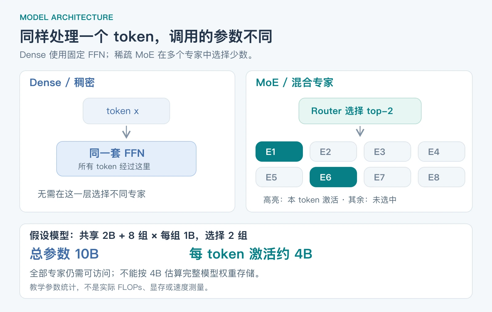
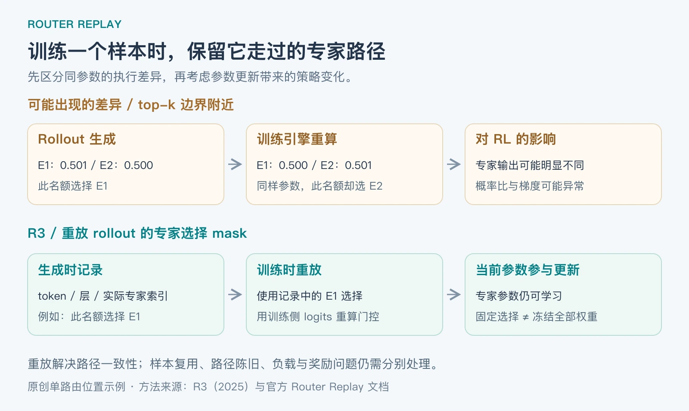

**MoE 的吸引力在于：让模型拥有很多参数，但每个 token 只使用其中一部分。它在强化学习中的额外难点，是“选择哪些参数参与计算”本身也会变化。** 当生成答案和训练更新使用不同路径时，问题就不只是普通的优化器调参。

本文讨论的是大语言模型使用 PPO、GRPO 一类方法做 **RL 后训练**，不是所有游戏控制或机器人强化学习中的 MoE。对比对象是 Dense，即稠密模型。资料核对截至 **2026-09-14**；基础机制参考原始论文与官方实现，2026 年工作另列日期。教学数字与诊断顺序是本文的解释，不是统一基准实验结果。

## Table of contents

## 1 MoE 与 Dense，到底哪里不同

### 先看一个 Transformer 层

在常见 Dense Transformer 中，每个 token 都经过该层同一套前馈网络（FFN）。在常见稀疏 MoE Transformer 中，一些 FFN 被替换为多个专家网络：router 根据当前 token 的隐藏状态打分，选择 top-k 个专家，按门控权重合并结果。

“专家”通常就是一个神经网络模块，不是一个独立聊天机器人，也不必对应人工命名的“数学专家”“中文专家”。这里的 MoE 主要发生在 FFN；注意力、归一化等模块仍需计算，有些架构还有每个 token 都使用的共享专家。[DeepSeek-V3，§2.1](https://arxiv.org/html/2412.19437v2)

简化地写，一个 MoE 层的输出为：

$$
h(x)=\sum_{i\in S_k(x)}g_i(x)E_i(x)
$$

其中，E 是专家网络，S 是被选中的专家集合，g 是对应门控权重。具体模型的共享分支、归一化方式和门控公式会有所不同。

_图 1：原创示意。下方参数数字是假设模型的统计例子，不是图中某一层的实际尺寸，也不是 FLOPs 测量。_

### 总参数、激活参数和显存，必须分开

假设将一个模型的参数简化为：始终参与计算的部分 Pₛ，加上 E 组大小为 Pₑ 的路由专家，每个 token 选 k 组。那么：

$$
P_{\mathrm{total}}=P_s+EP_e,\qquad
P_{\mathrm{active}}\approx P_s+kP_e
$$

举一个原创教学例子：共享部分 2B，8 组专家每组 1B，每次选 2 组，则总参数是 **10B**，激活参数约 **4B**。

| 比较口径           | Dense                             | 上述 MoE                       | 能说明什么                          |
| ------------------ | --------------------------------- | ------------------------------ | ----------------------------------- |
| 同为 10B 总参数    | 大部分层权重参与每个 token 的计算 | 每个 token 约使用 4B 参数      | MoE 可以减少每 token 的专家计算     |
| 同为约 4B 激活参数 | 总参数约 4B                       | 总参数 10B                     | MoE 可以容纳更多模型参数            |
| 存储与部署         | 保存一套稠密权重                  | 仍要让全部专家权重可访问       | 不能只按 4B 估算 MoE 的模型权重显存 |
| 执行方式           | 计算路径规则，较易批处理          | 路由、分发、专家计算、结果聚合 | MoE 的通信和负载影响实际速度        |

激活参数只是计算规模的一种近似指标：注意力开销、序列长度、专家矩阵形状、硬件利用率都没有被这个数字完整表达。训练显存还包括梯度、优化器状态和激活；可以分片或卸载，但不能把这些成本视为消失。

因此，“MoE 比 Dense 好”必须带比较条件。**同总参数下，MoE 的优势偏向计算节约；同激活规模下，优势偏向参数容量。** 在相同延迟、显存或总训练预算下是否更好，需要实测，不能只比较模型名字里的 B 数。

## 2 为什么强化学习会放大路由问题

以语言模型 RL 为例，一轮训练大致是：

1. 旧策略生成若干答案，保存 token、生成概率和必要元数据。
2. 根据答案获得奖励，并计算优势等训练信号。
3. 训练引擎重新计算这些 token 的概率，用于更新当前策略。
4. 同步新权重，再生成下一批答案。

在实际系统里，生成可能由 vLLM 或 SGLang 负责，训练由另一套执行栈负责。即使加载同一份参数，精度、算子、并行规约与批处理方式也可能造成数值差异。Dense 同样会受到影响；MoE 还多了 **top-k 专家选择的离散变化**。[R3，§3](https://arxiv.org/html/2510.11370v2)

假设某层最后一个入选名额，在生成时两个专家的分数是 `0.501 / 0.500`，训练重算时变为 `0.500 / 0.501`。分数只变了一点，但入选专家换了；两个专家的输出却不一定相近。这个示例说明的是阈值附近的放大效应，不是每一次微小误差都必然导致模型崩溃。

### 把两种概率差异分开

记 μ_old 为生成引擎实际使用的旧策略概率，π_old 为训练引擎在同一旧参数下重算的概率，π_θ 为更新后的当前策略概率。对相同的 token y 和历史 h，有：

$$
\frac{\pi_\theta(y\mid h)}{\mu_{\mathrm{old}}(y\mid h)}
=
\underbrace{\frac{\pi_{\mathrm{old}}(y\mid h)}{\mu_{\mathrm{old}}(y\mid h)}}_{\text{同参数下的执行差异}}
\cdot
\underbrace{\frac{\pi_\theta(y\mid h)}{\pi_{\mathrm{old}}(y\mid h)}}_{\text{参数更新带来的策略变化}}
$$

这个分解帮助定位问题：第一项可能来自生成、训练路径不一致；第二项是 RL 更新本来就会带来的策略变化。PPO 类更新限制概率比，并不意味着执行引擎的误差会自动消失。实际算法还可能使用序列级比率、额外校正或裁剪。[Swift Router Replay 官方说明，v4.4](https://swift.readthedocs.io/en/v4.4/Instruction/GRPO/AdvancedResearch/router_replay.html)

这里的 π_old 也不要和“用于 KL 约束的 reference model”混淆：后者往往是另一份固定参考策略，职责不同。

## 3 四类问题，分别怎么处理

| 问题                 | 机制与表现                                                | 对应处理方向                                           |
| -------------------- | --------------------------------------------------------- | ------------------------------------------------------ |
| 生成与训练路由不一致 | 同一个样本重算时换了专家，log-prob 差异、概率比或梯度异常 | 对齐参数和执行配置，检查路由一致性，使用路由重放       |
| 专家使用失衡         | 少数专家收到大量 token 与任务梯度，其他专家利用不足       | 监控分层专家计数，采用适合模型的平衡机制，核验任务效果 |
| 路由探索不足或漂移   | 反复复用旧路径可能限制探索；更新后旧路径可能陈旧          | 控制样本复用，研究预测路由或受约束的专家探索           |
| 计算与通信失衡       | 长短答案混合、专家热点、跨卡通信让部分设备等待            | 联合做序列 packing、专家放置与并行调优                 |

这些问题不能用同一个开关解决。奖励设计、答案长度偏置、KL 设置与数据质量也可能导致训练失败，它们在 Dense RL 中同样存在。

### 3.1 路由不一致：重放“走过的专家”

R3 在生成时记录每个 token、每个相关层实际选择的专家，在训练该样本时使用相同的选择 mask。**记录的是路径，不是把旧专家参数全部复制回来。** 方法仍以训练侧当前 logits 重算门控权重；在相应 gating 定义下保留可微路径，固定 mask 不等于冻结 router 参数。[R3，§4](https://arxiv.org/html/2510.11370v2)

_图 2：原创流程图。示例只画一个 token 的一个路由位置；真实重放需要保证 token、层、策略版本及缓存对应正确。_

这里有两个容易混淆的名称：**R2** 重放训练引擎计算旧策略时得到的路由；**R3** 重放 rollout 引擎生成时得到的路由。若问题主要发生在生成与训练之间，路由数据来自哪一端就很重要。[Swift 的 R2/R3 区分](https://swift.readthedocs.io/en/v4.4/Instruction/GRPO/AdvancedResearch/router_replay.html)

工程上可从 [verl 的 router replay 示例](https://github.com/verl-project/verl/blob/main/examples/router_replay/README.md) 或上述 Swift 文档入手。需要推理后端返回专家索引、训练后端支持重放，并保证权重与缓存版本一致。具体参数和兼容版本应跟随所用后端文档。

重放也有边界：它增加记录与传输成本；限制的是该样本的专家选择，并没有消除当前专家权重的变化。固定旧选择还可能使训练偏离当前自由路由的行为。因此仍要控制更新幅度、样本复用和策略滞后，不能把 R3 说成“恢复了任意情况下完全无偏的当前策略梯度”。

### 3.2 专家失衡：区分学习问题与设备热点

一种失衡是模型越来越依赖少数专家，其他专家难以收到足够的任务梯度；另一种是逻辑使用分布尚可，但专家恰好集中在某些设备，形成通信或计算热点。前者涉及模型学习，后者更多涉及系统调度。

模型侧可采用辅助平衡损失、路由偏置或其他平衡设计，但不能盲目追求所有专家在每个小批次中完全均匀。任务自然有不同分布，过强的平衡约束可能干扰有用的专门化。例如 DeepSeek-V3 主要通过路由偏置做平衡，同时仍保留很小的序列级平衡辅助损失；这不是“完全没有任何辅助损失”。该设计来自其模型训练报告，迁移到特定 RL 任务仍需验证。[DeepSeek-V3，负载平衡策略](https://arxiv.org/html/2412.19437v2)

### 3.3 探索不足：答案多样，不代表专家路径多样

提高 token 采样温度，主要改变输出 token 的抽样；它不保证在同一隐藏状态下充分探索其他专家组合。反过来，无约束地随机换专家，也可能把模型送进不合适的计算路径。

因此需要区分两个目标：**生成新样本时可以探索；更新一个已生成样本时，应知道它实际走过什么路径。** 受控探索与路由重放可以出现在同一个方法里，并不矛盾。2026 年 ESRL 就采用了这一组合，见下一节。

### 3.4 系统瓶颈：少算参数不等于整轮 RL 更快

长答案会增加生成时间和训练注意力开销；不同 token 又可能涌向相同专家，造成 expert parallel 设备负载不均。仅按 token 数均分 batch，不能保证专家计算也均分。

因此应报告完整 RL 迭代时间，并分别观察生成、训练与通信耗时。只展示某个专家算子的 FLOPs，无法说明训练任务的实际成本。RoutePack 从序列与专家两个维度安排工作，就是对这一缺口的研究。

## 4 截至 2026 年 9 月，哪些新工作值得看

下表按论文首次公开时间列出。R3 是 2025 年基础工作；后三项是 2026 年预印本，本文不将单篇实验结果视为所有模型上的通用结论。

| 首次公开   | 工作                                          | 解决哪个问题                     | 关键思路与边界                                               |
| ---------- | --------------------------------------------- | -------------------------------- | ------------------------------------------------------------ |
| 2025-10-13 | [R3](https://arxiv.org/abs/2510.11370)        | 生成与训练路径不一致             | 重放 rollout 的专家选择；还要处理更新幅度与路径陈旧          |
| 2026-05-29 | [PR2](https://arxiv.org/abs/2606.00395)       | 只重放旧路径，可能跟不上路由演化 | 预测短期路由变化，生成与训练使用对应预测路径；增加预测机制   |
| 2026-08-12 | [RoutePack](https://arxiv.org/abs/2608.12146) | 注意力负载与专家负载同时不均     | 利用 rollout 路由信息安排专家放置与 microbatch packing       |
| 2026-09-11 | [ESRL](https://arxiv.org/abs/2609.13058)      | 专家空间探索不足                 | 保留可靠专家锚点、受限候选采样、熵自适应扰动，再重放实际路径 |

PR2 的重点是路由随训练更新而演化；它与前文 R2 不是同一个方法，也不只是名称增加一个字母。[PR2 摘要及版本记录](https://arxiv.org/abs/2606.00395)

RoutePack 的重要区分是：可以调整专家在设备上的**物理放置**，同时保持 token 选择哪些**逻辑专家**不变。它结合路由信息与序列组成安排 microbatch，改善系统效率；不是为了平均设备负载而擅自把 token 改派给另一位逻辑专家。[RoutePack，方法部分](https://arxiv.org/html/2608.12146v1)

ESRL 保留高置信专家作为锚点，在合理候选池内探索其余选择，并根据路由熵控制扰动。其目的不是让路径越随机越好，而是在保持可靠计算的同时扩大探索；训练时重放生成中实现的路径。[ESRL，方法部分](https://arxiv.org/html/2609.13058v1)

## 5 如果正在调一个 MoE RL 任务，先查什么

下面是基于前述机制整理的诊断顺序，不是某篇论文的完整训练配方。

1. **先锁定同一参数版本**：固定一小组 prompt 和已生成 token，对比两端 log-prob、专家索引及 mask 一致率。先排除 tokenizer、token 对齐、权重同步和缓存错误。
2. **再看误差出现在哪里**：按层统计专家切换率，检查差异是否集中在 top-k 边界；同时看概率比、裁剪比例、KL 与梯度范数。不同模型不应共用一个未经验证的告警阈值。
3. **检查专家使用分布**：分别统计每层每专家的 token 数、任务梯度和每设备负载。不要把模型专家失衡与 GPU 放置失衡混为一谈。
4. **做单因素消融**：固定模型、数据与采样预算，比较是否重放、样本复用次数、平衡强度等。路由重放与输出概率修正是否叠加有益，也应以消融判断。
5. **最后核对收益与成本**：同时看独立任务集上的奖励/正确率、输出多样性、完整迭代时间、峰值显存和通信开销。

冻结 router 可以作为定位问题的对照实验，但它限制适应能力，而且相同 router 参数的两端仍可能有执行数值差异。它不能替代逐样本的路由一致性核验。

## 6 为什么遇到这些问题，仍然选择 MoE

因为 RL 后训练通常是在一个已经表现良好的预训练模型上继续优化。MoE 提供的参数容量与稀疏计算优势仍然存在；要做的是让后训练流程适应它的路由和分布式执行方式，而不是仅因流程复杂就否定架构。

如果模型质量相近、硬件资源有限、服务批量小或工程维护能力有限，Dense 的执行规则性可能更有价值。如果已有高质量 MoE 基座、足够容纳专家的资源，以及成熟的分布式训练和推理栈，修复路由与调度问题可能更划算。这是工程取舍，不能推出“MoE 在强化学习中必然优于 Dense”。

最后，**MoE 是模型架构，LoRA 是参数高效微调方法**，它们不是互斥选项。可以给原生 MoE 的选定层加 LoRA，也可以在 Dense 基座上构造多组 LoRA 专家；两者都被叫作“MoE + LoRA”时，必须说清楚混合发生在哪里。ICLR 2026 的 [RO-GRPO](https://proceedings.iclr.cc/paper_files/paper/2026/hash/7f403d7240d8a5b5335e60635ea2e975-Abstract-Conference.html) 研究的是 LoRA-MoE，通过与路由机制相关的奖励改善专家利用，不能无条件推广为所有原生 MoE 的解决方案。

下一篇 [LoRA 的 A/B 矩阵、初始化与可运行实现](/posts/knowledge/llm-foundations/fine-tuning/lora-ab-matrices-initialization/) 会解释：当我们说“给专家加 LoRA”时，到底增加了哪些参数、怎样训练，以及如何合并回原权重。
