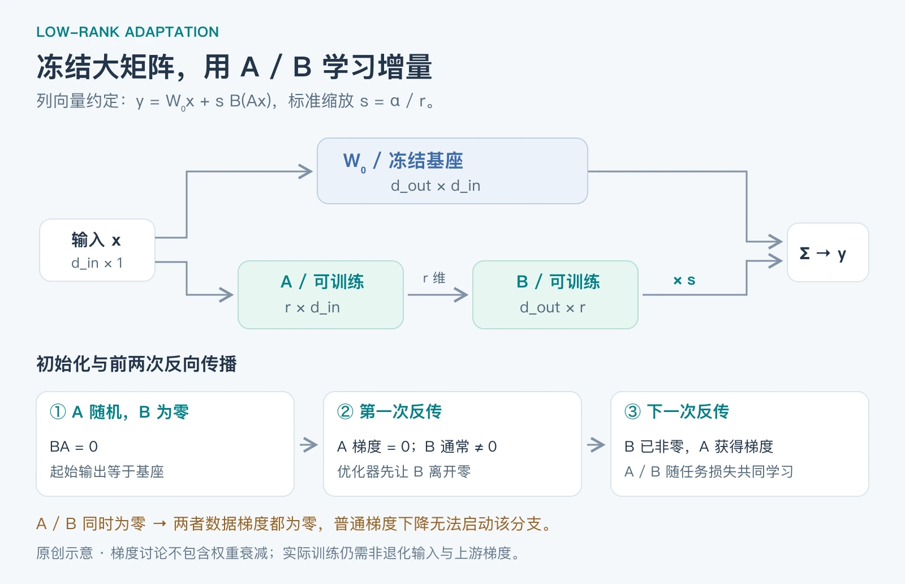

**LoRA 不直接更新原来的大权重矩阵，而是冻结它，训练两个较小的矩阵 A、B，用它们的乘积表达权重增量。** 理解这句话之后，最重要的三个问题是：A/B 各有多大？为什么通常 A 随机、B 为零？实际代码怎样把它们接到原模型上？

本文从一个线性层讲起，再连接到真实大模型。LoRA 原论文发表于 2021 年，不是 2026 年才出现的技术；实现资料核对截至 **2026-09-14**。数学推导与小程序为教学内容，程序已在 Python 3.12、PyTorch 2.14 的 CPU 环境实际运行；没有把这个小例子当作大模型效果实验。

## Table of contents

## 1 微调为什么可以只学一个低秩增量

假设原来的线性层是：

$$
y=W_0x,\qquad W_0\in\mathbb{R}^{d_{\mathrm{out}}\times d_{\mathrm{in}}}
$$

全参数微调直接更新 W₀。标准 LoRA 则保持 W₀ 不变，学习：

$$
W=W_0+\Delta W=W_0+sBA,\qquad s=\frac{\alpha}{r}
$$

其中 r 是设定的秩，α 是缩放超参数。A/B 是可训练参数，s 在普通实现中是固定缩放系数。把它代回前向传播：

$$
y=W_0x+sB(Ax)
$$

直观上，原模型继续完成原来的映射，新增分支学习“为了当前任务应该补上什么变化”。选择小 r，是对增量施加容量约束：它最多包含 r 个独立的线性变化方向。[LoRA 原论文，§4](https://arxiv.org/html/2106.09685v2)

这里有两个边界。第一，低秩的是 **ΔW**，不是说预训练权重 W₀ 本来就是低秩矩阵；普通 LoRA 也不是先对 W₀ 做 SVD 再截断。第二，这是一种有用的适配假设，不保证任何任务的最佳更新都能用很小的 r 表达。低秩可能减少训练成本，也可能限制任务适应能力。

## 2 A/B 形状怎样确定

本文始终使用列向量约定 y = Wx。A 先作用于输入，B 再把结果映射回输出空间：

$$
\underbrace{x}_{d_{\mathrm{in}}\times1}
\xrightarrow{\ A\in\mathbb{R}^{r\times d_{\mathrm{in}}}\ }
\underbrace{Ax}_{r\times1}
\xrightarrow{\ B\in\mathbb{R}^{d_{\mathrm{out}}\times r}\ }
\underbrace{BAx}_{d_{\mathrm{out}}\times1}
$$

| 对象 | 形状            | 作用                       |
| ---- | --------------- | -------------------------- |
| W₀   | `[d_out, d_in]` | 冻结的原始权重             |
| A    | `[r, d_in]`     | 将输入映射到 r 维中间表示  |
| B    | `[d_out, r]`    | 将中间表示映射到输出空间   |
| BA   | `[d_out, d_in]` | 和原始权重同形状的增量方向 |

注意乘法顺序是 **BA**，前向执行顺序是 **先 A、后 B**。有些资料采用行向量或者对调 A/B 命名，此时公式外观会不同。判断实现时先看维度能否相乘，不要只记字母。



_图 1：原创结构与梯度示意。梯度结论针对文中的非退化教学输入和数据损失；权重衰减等额外更新另行讨论。_

### 一个实际尺寸例子

当输入、输出都是 4096 维，取 r = 8：

$$
\begin{aligned}
\#W_0&=4096\times4096=16{,}777{,}216\\
\#(A,B)&=8\times4096+4096\times8=65{,}536
\end{aligned}
$$

新增可训练权重只有这个原矩阵的 **1/256，约 0.39%**。这个比例只针对一个线性层、不含 bias，不等于整个训练显存减少到 1/256。基座权重依然需要加载，训练还需要激活、反向传播与 adapter 的优化器状态。

实际大模型会在选定的多个层中分别创建 A/B；不是给整台模型共用一对矩阵。哪些层添加、每层的输入输出尺寸和 r，共同决定总可训练参数量。

## 3 为什么通常 A 随机初始化、B 初始化为零

### 先保证刚插入 adapter 时，模型输出不变

若 A 是随机矩阵，B 全零，那么：

$$
\Delta W_0=sB_0A_0=0,\qquad y_0=W_0x
$$

因此，接上 LoRA 后，模型起始行为与原基座相同。这里的“初始无作用”是指 **adapter 的增量为零**，不是把整个模型变成 y = x 的恒等映射。

原论文使用随机高斯 A、零 B；Microsoft 的 `loralib` 线性层实现使用 Kaiming uniform 初始化 A、零 B。两者都属于“一随机、一为零”，但不是同一种随机分布。[LoRA 原论文](https://arxiv.org/html/2106.09685v2)、[Microsoft 官方实现](https://github.com/microsoft/LoRA/blob/main/loralib/layers.py)

### B 为零，为什么还学得动

记 g 为损失对输出 y 的梯度。对单个输入列向量，链式法则给出：

$$
\frac{\partial L}{\partial B}=s\,g(Ax)^\top,\qquad
\frac{\partial L}{\partial A}=s\,B^\top g x^\top
$$

把初始 B = 0 代入，可以直接看出：

- **A 的首次数据梯度为零**，因为表达式中乘了 B。
- **B 的首次数据梯度通常非零**，因为随机 A 作用于输入后通常得到非零表示；仍要求输入和上游梯度不退化。
- 优化器更新 B 后，下一次反向传播中 A 就可能得到非零梯度，两者一起学习。

所以不必担心“A 第一轮没有梯度，LoRA 就完全学不动”。但应区分数据梯度和优化器的全部行为：即便 A 的数据梯度是零，带权重衰减等机制的优化器仍可能改变它。下面的教学代码使用无权重衰减的 SGD，便于观察机制。

### 四种初始化对照

| A 初始值 | B 初始值 | 初始增量 | 首次数据梯度       | 结论                           |
| -------- | -------- | -------- | ------------------ | ------------------------------ |
| 随机     | 零       | 零       | A 为零，B 通常非零 | 常见默认做法                   |
| 零       | 随机     | 零       | A 通常非零，B 为零 | 数学上可行，但训练动态未必相同 |
| 零       | 零       | 零       | A、B 都为零        | 普通梯度下降无法启动这个分支   |
| 随机     | 随机     | 通常非零 | 两者通常非零       | 能训练，但直接改变模型起始输出 |

**不能把 A、B 同时置零** 的原因是乘法分支中的梯度互相依赖，不只是泛泛的“神经网络要打破对称性”。两者都随机也不是数学错误，只是失去了普通 LoRA 的零增量起点；一些变体会用额外补偿保持初始函数不变。

## 4 在 PyTorch 里怎样实例化

`nn.Linear(in_features, out_features)` 的权重形状是 `[out_features, in_features]`。因此：

```python
A = nn.Linear(d_in, rank, bias=False)   # A.weight: [rank, d_in]
B = nn.Linear(rank, d_out, bias=False)  # B.weight: [d_out, rank]
```

批量输入通常按 `[batch, d_in]` 存储，PyTorch 实际计算 `x @ weight.T`。这与前文列向量数学约定完全兼容，代码里不需要把 A/B 的权重尺寸反过来。

下面是可以直接复制运行的完整示例，只依赖 PyTorch。它使用一个 4 → 6 的线性层、r = 2、α = 2，因此 s = 1。为了集中观察 A/B，省略 dropout、量化和分布式训练。生产库还需处理共享权重、混合精度与 adapter 管理等细节。

```python
import math
import torch
from torch import nn
from torch.nn import functional as F


class LoRALinear(nn.Module):
    def __init__(self, base: nn.Linear, rank=2, alpha=2):
        super().__init__()
        if not 1 <= rank <= min(base.in_features, base.out_features):
            raise ValueError("本例要求 rank 位于有效范围内")
        self.base = base
        self.base.requires_grad_(False)
        factory = {"device": base.weight.device, "dtype": base.weight.dtype}
        self.A = nn.Linear(base.in_features, rank, bias=False, **factory)
        self.B = nn.Linear(rank, base.out_features, bias=False, **factory)
        nn.init.kaiming_uniform_(self.A.weight, a=math.sqrt(5))
        nn.init.zeros_(self.B.weight)
        self.scale = alpha / rank

    def forward(self, x):
        return self.base(x) + self.scale * self.B(self.A(x))

    def merged_weight(self):
        return self.base.weight + self.scale * (self.B.weight @ self.A.weight)


torch.manual_seed(7)
layer = LoRALinear(nn.Linear(4, 6, bias=True).double(), rank=2, alpha=2)
x = torch.randn(3, 4, dtype=torch.float64)
target = torch.randn(3, 6, dtype=torch.float64)
base_before = layer.base.weight.detach().clone()
opt = torch.optim.SGD([p for p in layer.parameters() if p.requires_grad], lr=0.1)

torch.testing.assert_close(layer(x), layer.base(x), rtol=0, atol=0)
print("A/B 形状：", tuple(layer.A.weight.shape), tuple(layer.B.weight.shape))
print("初始输出等于基座：", True)

F.mse_loss(layer(x), target).backward()
assert layer.A.weight.grad.abs().sum().item() == 0
assert layer.B.weight.grad.abs().sum().item() > 0
assert layer.base.weight.grad is None
print("首次反传：A 梯度为零，B 梯度非零")
opt.step()
opt.zero_grad(set_to_none=True)

F.mse_loss(layer(x), target).backward()
assert layer.A.weight.grad.abs().sum().item() > 0
print("第二次反传：A 梯度非零")
opt.step()

with torch.no_grad():
    merged_output = F.linear(x, layer.merged_weight(), layer.base.bias)
    torch.testing.assert_close(layer(x), merged_output, rtol=1e-10, atol=1e-10)
    torch.testing.assert_close(layer.base.weight, base_before, rtol=0, atol=0)
print("合并前后输出一致，基座权重未改变")
```

运行结果：

```text
A/B 形状： (2, 4) (6, 2)
初始输出等于基座： True
首次反传：A 梯度为零，B 梯度非零
第二次反传：A 梯度非零
合并前后输出一致，基座权重未改变
```

代码里的 `requires_grad_(False)` 冻结的是基座参数；优化器只接收需要训练的参数。`merged_weight()` 只计算合并后的权重用于验证，没有修改原始基座。

不要为了“冻结基座”就把整个基座前向包进 `torch.no_grad()`：在多层网络里，梯度仍可能需要穿过冻结层，回到前面层的可训练 adapter。**参数不更新，不等于整条计算路径不需要反向传播。**

## 5 放到真实大模型上，流程是什么

一条基本流程是：加载基座 → 决定目标层 → 为每个目标层创建 A/B → 冻结其余参数 → 用任务损失训练 adapter → 保存 adapter 与对应基座信息。

下面是 PEFT 的配置片段，假定 `model` 已经加载，而且实际模块名中存在 `q_proj`、`v_proj`。它不是一个包含模型下载、数据准备和训练器的完整训练脚本；本文只实际运行了上一节的小模型验证。

```python
from peft import LoraConfig, get_peft_model

config = LoraConfig(
    r=8,
    lora_alpha=16,
    target_modules=["q_proj", "v_proj"],
    lora_dropout=0.05,
    bias="none",
    init_lora_weights=True,
    task_type="CAUSAL_LM",
)
model = get_peft_model(model, config)
model.print_trainable_parameters()
```

PEFT 默认初始化使用随机 A、零 B；`target_modules` 决定实际覆盖的模块。不同模型的命名与结构不同，必须检查最终可训练参数，不能看到配置没有报错就认定覆盖完整。[PEFT LoRA API，固定版本 v0.20.0](https://huggingface.co/docs/peft/v0.20.0/package_reference/lora)

几个参数可以这样理解：

| 参数                   | 改变什么                              | 选择时看什么                         |
| ---------------------- | ------------------------------------- | ------------------------------------ |
| r                      | 每个增量矩阵的最大秩、可训练参数量    | 太小可能适应不足；增大也需要验证收益 |
| α                      | 普通 LoRA 中通过 α/r 调节分支缩放     | 与学习率、r 共同影响更新幅度         |
| target_modules         | 哪些层能发生任务适配                  | 仅注意力投影、还是也覆盖 FFN 等      |
| dropout                | 训练中对 adapter 分支输入施加随机丢弃 | 依任务和数据规模验证，推理时关闭     |
| bias / modules_to_save | 是否还训练、保存额外参数              | 启用后就不再是“只训练 A/B”的最简设置 |

LoRA 自己并不规定数据和损失。监督微调可以用交叉熵；DPO 或强化学习后训练也可以只更新 adapter。**SFT、DPO、PPO/GRPO 描述训练目标与流程；LoRA 描述哪些参数可训练、怎样表示更新。**

## 6 训练完为什么能合并

在普通线性 LoRA、推理时关闭 dropout 的条件下，可以预先计算：

$$
W_{\mathrm{merge}}=W_0+sBA
$$

于是 `W0 x + s B(A x)` 变成一次 `W_merge x`。前面的程序在浮点误差容限内验证了两种输出一致。普通 LoRA 的 A/B 之间不插入非线性激活；如果加入 ReLU 等操作，就不能一般性地合并成同一个固定线性权重。

保存 adapter 和保存合并模型是两种交付：前者较小，但推理需要匹配的基座与配置；后者包含完整权重，使用方式接近普通模型。PEFT 的 `merge_and_unload()` 返回合并后的模型，应接收返回值，例如 `merged_model = model.merge_and_unload()`。[PEFT 合并接口](https://huggingface.co/docs/peft/v0.20.0/package_reference/lora)

“合并后没有额外 LoRA 分支开销”有适用条件：量化、特定变体和多 adapter 动态切换可能改变合并支持与数值行为。尤其是低比特权重重新量化时，不能要求与未合并路径逐位一致。合并也不意味着原模型权重变小了。

## 7 QLoRA、rsLoRA、PiSSA 分别改了什么

先把标准 LoRA 学透，再看变体，容易分清它们解决的是不同问题。

| 方法          | 主要变化                                       | 与 A/B 的关系                                         |
| ------------- | ---------------------------------------------- | ----------------------------------------------------- |
| 标准 LoRA     | 用低秩增量适配冻结基座                         | 通常 A 随机、B 为零，缩放 α/r                         |
| QLoRA（2023） | 基座采用低比特量化，降低存储与训练资源需求     | 仍训练 adapter；不意味着把 A/B 和所有计算都变成 4 bit |
| rsLoRA        | 将缩放改为 α/√r                                | 关注增大 r 时的缩放行为，不是另一套目标层命名         |
| PiSSA（2024） | 用原权重的主奇异分量初始化可训练部分，冻结残差 | A/B 可同时非零，通过残差分解保留初始映射              |

QLoRA 将梯度穿过冻结的量化基座，更新 LoRA 参数，并结合 NF4、双重量化和分页优化器等设计。量化权重存储格式与实际计算精度需要分开理解。[QLoRA 原论文](https://arxiv.org/abs/2305.14314)

rsLoRA 的缩放可以通过 PEFT 的 `use_rslora` 配置启用；它改变的是 adapter 缩放规则，不能仅凭 α 的数值与普通 LoRA 直接比较有效更新幅度。[PEFT 的 rsLoRA 参数](https://huggingface.co/docs/peft/v0.20.0/package_reference/lora)

PiSSA 则说明“两矩阵都非零”和“保持起始模型不变”并不冲突。沿用本文矩阵顺序，并将缩放吸收进初始化，可以写成：

$$
W_0=W_{\mathrm{res}}+B_0A_0
$$

它用主奇异分量构造 B₀A₀，其余部分成为冻结残差。之后训练的是这个可训练分支。关键是它**同时改变了冻结部分的表示**，不能在原封不动的 W₀ 上随便加两个非零矩阵，再声称初始输出不变。论文使用的 A/B 命名约定与本文不同，比较时应按形状对应。[PiSSA，§2](https://arxiv.org/html/2404.02948v3)

这些方法是扩展阅读，不是本文推荐的一套必须叠加的配置。显存不足、低秩容量不足和初始化效率不足，属于不同问题，应该先定位瓶颈。

## 8 LoRA 用在 MoE 上，还有什么不同

MoE 中可以给注意力投影、共享专家或路由专家的线性权重添加 LoRA，具体覆盖范围由实现决定。给多个专家分别添加 adapter，会带来多组 A/B，总可训练参数量仍需按实际覆盖计算。

有些 MoE 实现把多个专家权重打包成 `nn.Parameter`，而不是普通 `nn.Linear` 子模块。此时仅按常见模块名或普通 `all-linear` 匹配，不能保证覆盖这些专家；PEFT 提供了针对参数的适配入口，但应检查支持范围。router 是否训练也要独立确认。[PEFT 的 `target_parameters` 说明](https://huggingface.co/docs/peft/v0.20.0/package_reference/lora)

还有另一种做法是在 Dense 基座上放多组 LoRA adapter，再用 router 选择 adapter。这是混合 LoRA 专家，与“原生 MoE 基座上的 LoRA 微调”不同。若用于强化学习，还需要关注路径一致性和专家利用，可接着看 [MoE 的强化学习问题与 Dense 对比](/posts/knowledge/llm-foundations/architectures/moe-reinforcement-learning-vs-dense/)。

## 9 学完后，用五个问题自查

1. 为什么 ΔW 是 BA，而前向传播先执行 A？——从矩阵形状推导，不靠背顺序。
2. 为什么 B 为零时能启动训练，两者都为零却不行？——代入两条梯度公式检查。
3. 为什么 0.39% 的可训练参数不代表 0.39% 的训练显存？——区分基座存储、优化器状态与激活。
4. 为什么能合并，又为什么有些实现不能直接合并？——看分支是否保持线性，以及量化、dropout 和变体条件。
5. LoRA 能否用来做 RL？——能；它约束的是可训练参数，不替代奖励、采样与策略优化算法。

如果能解释这五点，再阅读真实模型里的 `lora_A`、`lora_B`、`scaling` 和 `target_modules`，就能把公式、代码和训练行为对应起来。
