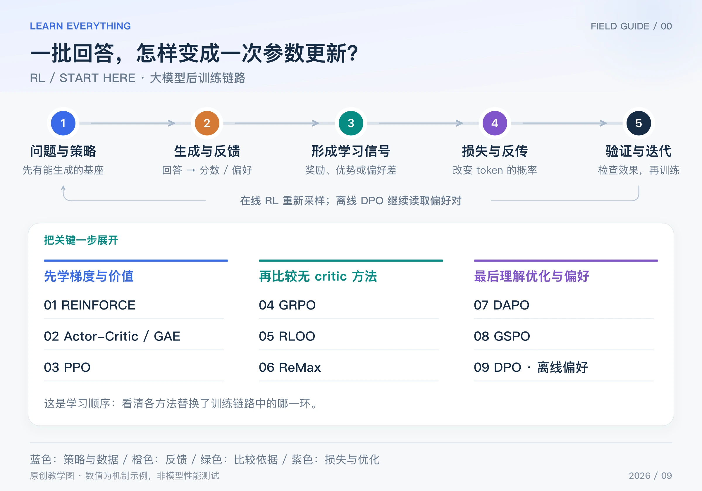

如果你知道模型能生成文字，却不清楚“给答案打一个分数，为什么能改变模型参数”，这个系列就从这里开始。先建立共同训练链路，再逐篇替换里面的一个环节，会比同时背九个缩写容易得多。

本系列聚焦**大模型后训练**：七种具体在线策略优化方法、一篇 Actor-Critic/GAE 基础，以及一篇 DPO 偏好优化。选题覆盖常见方法与有代表性的简化方案，不代表每一种都具有相同普及度，也不包含 DQN、SAC 等经典控制算法。**资料核对截至 2026-09-15；文中手算、代码和配图均为原创教学内容，不是大模型训练效果复现。**

## Table of contents

## 1 先把一句话讲清：模型怎样从反馈中学习

假设模型回答一道题，生成了四份不同答案。检查程序给出奖励 `[1, 1, 0, 0]`。训练程序不会直接执行“某个权重加 1”，而是先根据奖励构造学习信号，再重新计算这些回答的概率，形成可微分损失，通过反向传播更新参数。

也就是说，奖励提供方向，模型的概率计算提供梯度路径。奖励可以来自一个不能求导的单元测试，梯度仍然可以经过模型的 log-prob 计算出来。[REINFORCE 的原始研究](https://ccs.neu.edu/home/rjw/pubs.html)

_图：原创链路图。上方是共同链路，下方是学习次序，不表示严格历史继承关系。_

## 2 看懂在线训练循环中的六件事

| 环节       | 输入与输出                            | 初学者容易误解的地方                                 |
| ---------- | ------------------------------------- | ---------------------------------------------------- |
| 准备策略   | 一个已经能生成文字的模型              | 常从 SFT 模型开始，但 SFT 不是所有 RL 的强制前置步骤 |
| rollout    | 问题 → 模型自己生成的回答             | 不是把标准答案喂给模型模仿                           |
| 评分       | 问题、回答 → 奖励 R                   | reward 不一定是一个神经网络                          |
| 形成优势   | 奖励、基线等 → 优势 A-hat             | 正奖励不一定意味着正优势                             |
| 重算与更新 | 已生成 token → log-prob → loss → 梯度 | 重算一般沿用旧回答及其前缀，不是自由生成另一份回答   |
| 同步与评估 | 新权重 → 下一批 rollout               | 旧样本不能不加区分地无限复用                         |

“状态”可以理解为当前的问题加上已生成的前缀；“动作”是下一个 token；“策略”就是在这个前缀下输出各候选 token 的概率。完整回答称为一条轨迹，模型直到结束才得到的分数称为终局奖励。

有些方法以 token 为更新计算单位，有些把整份回答当作一个动作来估计梯度；两者最终都需要通过语言模型的 token 概率反传。

## 3 五种模型角色，先不要混在一起

| 角色                    | 要回答的问题                       | 在一次优化窗口中通常怎样处理       |
| ----------------------- | ---------------------------------- | ---------------------------------- |
| 当前策略 / actor        | 现在该怎样生成？                   | 被训练                             |
| old policy              | 这批旧回答当时怎样生成？           | 保留固定概率或快照，作为本批依据   |
| critic / value          | 从当前前缀继续，预计获得多少回报？ | 使用它的方法需要训练价值估计       |
| reference               | 当前策略比参考策略偏离了多少？     | 在相应窗口固定，用于约束或校准     |
| reward model / verifier | 回答质量或正确性是多少？           | 提供反馈，可能是冻结模型或规则程序 |

它们是**逻辑角色**，不意味着每个系统都必须完整加载五个独立大模型。例如 old policy 的作用可能由保存的旧 log-prob 承担；critic 可以是独立网络，也可能共享部分参数；规则验证器不需要大模型。

old policy 和 reference 尤其不同：前者记录这批样本的来源，后者提供参考行为。PPO 中常同时出现两者；DPO 通常有 reference，却不需要每批 rollout 的 old policy。[PPO 原论文](https://arxiv.org/abs/1707.06347)、[DPO 原论文](https://arxiv.org/abs/2305.18290)

## 4 几个数学词，用最小例子理解

### log-prob：把一串概率的乘积变成和

如果一条两 token 回答的条件概率分别为 0.5 和 0.2，那么整句概率是 0.1，整句 log-prob 是 `log(0.5) + log(0.2) = log(0.1)`。实践中使用自然对数，不是把概率先平均。

### 优势：这次表现比参照好多少

最容易理解的形式是：

$$
\widehat A=R-b
$$

R 是反馈，b 是参照。得到 0.7 分，如果基线是 0.5，就有正优势 0.2；如果基线是 0.9，则优势是 −0.2。critic、组内平均、留一平均和贪心回答，就是不同的基线来源。GRPO 还会除以组内标准差。

### 概率比：同一答案现在比以前更可能出现多少

$$
\rho=\frac{p_{\mathrm{current}}}{p_{\mathrm{old}}}
=\exp(\log p_{\mathrm{current}}-\log p_{\mathrm{old}})
$$

旧概率 0.2，新概率 0.3，比率为 1.5。这个数本身不说明该回答好不好：还要乘优势。PPO/GRPO 常看 token 比率，GSPO 使用长度归一化的序列比率，不能直接混用同一组阈值。

### loss、梯度与 KL：分别控制什么

loss 是优化器要降低的标量目标；梯度描述参数微小变化会怎样影响它。最简单的 SGD 更新是 `新参数 = 旧参数 - 学习率 × 梯度`。本系列用 SGD 做手算，真实训练常使用 AdamW 等优化器。

KL 散度用来衡量两个概率分布的差异。后训练里常将它作为相对 reference 偏离的代价；它与新旧策略的单个 token 概率比不是同一个量。后文的 log、exp 分别指自然对数及其逆运算。

## 5 每篇解决什么问题，怎样安排阅读

| 阅读顺序 | 独立文章                                                                                           | 核心问题                        |
| -------- | -------------------------------------------------------------------------------------------------- | ------------------------------- |
| 01       | [REINFORCE](/posts/knowledge/llm-foundations/reinforcement-learning/01-reinforce/)                 | 梯度到底从哪里来？              |
| 02       | [ACTOR–CRITIC / GAE](/posts/knowledge/llm-foundations/reinforcement-learning/02-actor-critic-gae/) | 如何判断每一步好于预期多少？    |
| 03       | [PPO](/posts/knowledge/llm-foundations/reinforcement-learning/03-ppo/)                             | 怎样限制一批旧样本带来的更新？  |
| 04       | [GRPO](/posts/knowledge/llm-foundations/reinforcement-learning/04-grpo/)                           | 没有 critic，如何比较一组答案？ |
| 05       | [RLOO](/posts/knowledge/llm-foundations/reinforcement-learning/05-rloo/)                           | 为什么基线要排除自己的奖励？    |
| 06       | [ReMax](/posts/knowledge/llm-foundations/reinforcement-learning/06-remax/)                         | 能否用自己的贪心回答当参照？    |
| 07       | [DAPO](/posts/knowledge/llm-foundations/reinforcement-learning/07-dapo/)                           | 长推理训练有哪些细节必须补齐？  |
| 08       | [GSPO](/posts/knowledge/llm-foundations/reinforcement-learning/08-gspo/)                           | 把裁剪单位改成整句会怎样？      |
| 09       | [DPO](/posts/knowledge/llm-foundations/reinforcement-learning/09-dpo/)                             | 只有偏好对，怎样直接学习？      |

第一次阅读建议走 **REINFORCE → Actor-Critic → PPO → GRPO**。这四篇建立“梯度从哪来、优势怎么估、更新怎么控、critic 能否去掉”的骨架。再比较 RLOO 与 ReMax，最后看 DAPO、GSPO 和 DPO。

如果你已经熟悉 SFT，手上只有偏好答案对，也可以先读 DPO，再回头比较在线 RL；但不要把 DPO 当作“取消 rollout 的 PPO”。

## 6 奖励来源、优化算法与微调参数是三条不同的轴

RLHF 常以人类偏好数据训练奖励模型；RLVR 则利用数学答案检查、代码测试等可验证反馈。它们主要描述**反馈如何获得**。PPO、GRPO 等主要描述**怎样利用反馈更新策略**。

LoRA 与全参数微调描述**哪些参数参与训练**。因此可以使用“规则奖励 + GRPO + LoRA”，也可以使用“奖励模型 + PPO + 全参数微调”。MoE 与 Dense 又属于模型架构层面。

理解这几个层次以后，可以接着读 [LoRA 的 A/B 矩阵](/posts/knowledge/llm-foundations/fine-tuning/lora-ab-matrices-initialization/) 与 [MoE 强化学习的路由问题](/posts/knowledge/llm-foundations/architectures/moe-reinforcement-learning-vs-dense/)。更换优化算法不自动解决错误奖励、数据泄漏、生成与训练不一致或硬件负载问题。

本系列的例子只验证机制和计算。真正训练时，至少同时观察独立验证集表现、奖励、KL、输出长度、熵、有效样本比例与实际运行成本。只看训练奖励越来越高，无法排除模型学会钻评分规则的空子。

[下一篇：REINFORCE](/posts/knowledge/llm-foundations/reinforcement-learning/01-reinforce/)
