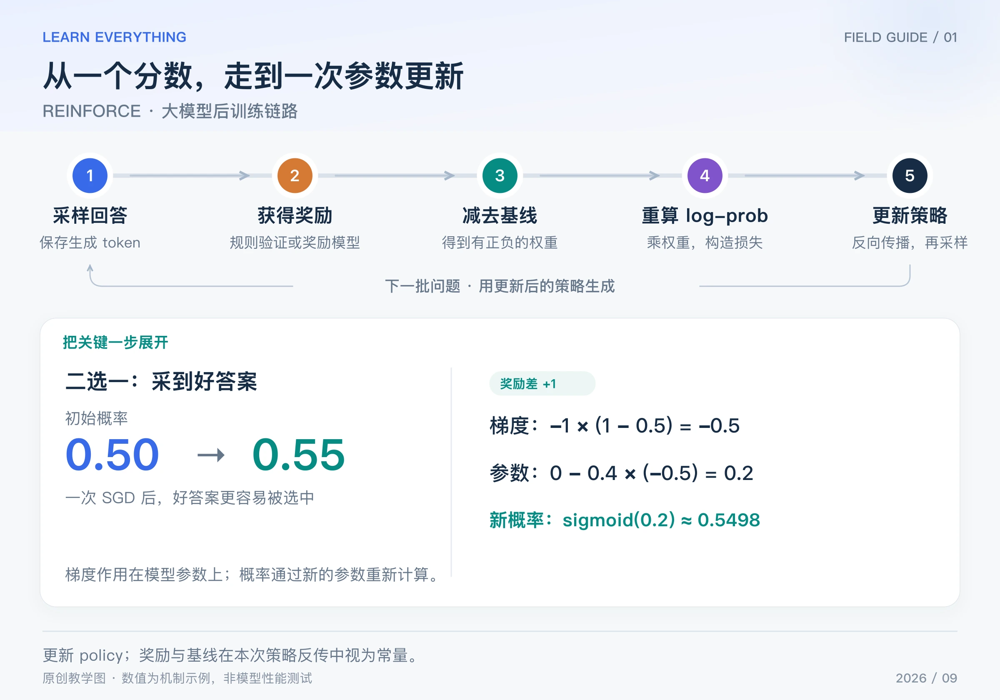

模型已经能生成答案，外部程序只能告诉它“这次得了几分”。REINFORCE 解决的基础问题是：**不用对评分程序求导，怎样让反馈改变模型的生成概率？**

先把它想成一种带权重的学习：采到的回答如果比基线好，就朝提高其概率的方向更新；如果更差，就朝降低概率的方向更新。这里说的是该样本提供的梯度方向，不保证共享参数模型中每个 token 的实际概率都单调变化。

本篇介绍 REINFORCE 的基本估计，再用一个二选一模型手算参数更新。算法源于 Williams 的 1992 年研究；下面的例子为原创教学计算。[作者的原始论文入口](https://ccs.neu.edu/home/rjw/pubs.html)

## Table of contents

## 1 从反馈走到参数，中间缺什么

普通监督微调已经给出了要模仿的答案。在线 RL 则先让模型自己回答，再获得反馈。即使奖励是“单元测试通过数量”，没有可微分表达式，也可以通过模型本身的概率建立学习目标。

对于问题 x 和生成回答 y，策略给出概率 πθ(y|x)。我们希望提高期望奖励：

$$
J(\theta)=\mathbb E_{y\sim\pi_\theta(\cdot\mid x)}[R(x,y)]
$$

REINFORCE 利用对数导数恒等式，把梯度写成“奖励乘以 log-prob 的梯度”：

$$
\nabla_\theta J
=\mathbb E[(R-b)\nabla_\theta\log\pi_\theta(y\mid x)]
$$

先把 b 看成只取决于问题的固定参照。它在本次策略更新中停止梯度，不随当前采到哪个回答改变。这样的基线不改变期望梯度，但会影响估计的方差；并非任意基线都保证比不加基线更稳定。

## 2 完整链路：到底重新计算什么



_图：原创链路图。右下方是标量参数 z 的更新；0.55 是 0.5498 的近似显示。_

1. 用当前策略随机生成回答，保存问题、回答 token、结束位置。
2. 评分器给出 R，计算参照 b，形成 `R - b`。
3. 将同一份回答送回模型，沿原来的前缀重算各 token 的 log-prob。
4. 将这些 log-prob 求和，乘以停止梯度的奖励差，再取负号作为最小化损失。
5. 反向传播更新策略，用新策略生成下一批回答。

对单个回答、只在结束时给奖励的最简情况：

$$
L=-(R-b)\sum_{t=1}^{T}\log\pi_\theta(y_t\mid x,y_{<t})
$$

T 是回答的有效 token 数。这个公式不包含 KL 正则、长度归一化或旧数据校正。使用它时应清楚这些简化，不能把已经更新多轮的旧样本继续当成当前策略的全新采样。

## 3 手算一次更新：概率怎样从 0.5 变成 0.55

为了只看核心机制，假设模型只有两个候选回答：“好答案”和“坏答案”，用一个标量参数 z 控制好答案的概率：

$$
p=\sigma(z)=\frac{1}{1+e^{-z}}
$$

初始 z = 0，所以 p = 0.5。这次恰好采到好答案，奖励差 `R - b = 1`，学习率 η = 0.4。于是：

$$
L=-\log p,\qquad
\frac{\partial L}{\partial z}=-(1-p)=-0.5
$$

SGD 更新参数，不是直接给概率加上梯度：

$$
z_{\mathrm{new}}=0-0.4(-0.5)=0.2,
\qquad p_{\mathrm{new}}=\sigma(0.2)\approx0.5498
$$

梯度为负，所以梯度下降把 z 往上推，进而提高好答案的概率。奖励差如果变为 −1，同一个采样动作的更新方向就相反。若奖励为 0、基线也为 0，这个样本没有奖励驱动的策略梯度；不是“错误答案必然被显式惩罚”。

下面的完整小程序只用 Python 标准库：

```python
from math import exp

z, learning_rate, advantage = 0.0, 0.4, 1.0
p = 1 / (1 + exp(-z))
gradient = -advantage * (1 - p)  # 本例采到了好答案
z -= learning_rate * gradient
print(round(z, 4), round(1 / (1 + exp(-z)), 4))
# 0.2 0.5498
```

## 4 一整句话怎样得到梯度

假设回答由三个 token 构成，只在回答结束时得到奖励差 +1。在最简终局奖励公式里，三个 token 的 log-prob 都乘同一个 +1，再求和。这是基于整条轨迹的学习信号，不代表算法已经知道“第二个 token 单独贡献了多少正确性”。

反向传播沿模型计算图，把信号传到 attention、FFN 等可训练参数。如果使用 LoRA，最终更新的是接入这些层的 A/B 参数；奖励公式不需要因此重写。

这里也能看出方差问题：一条回答可能因为最后一个关键 token 成功，但其余 token 也参与了整句梯度。一次偶然成功无法可靠区分所有因果贡献，需要多次采样与适当估计降低噪声。

## 5 为什么后面还要学其他算法

REINFORCE 的基本形式清楚、容易核验，但单次轨迹的反馈噪声可能很大。训练过程还要处理奖励尺度、策略漂移、样本成本与长序列归因。

| 进一步想解决的问题                   | 接下来的方法       |
| ------------------------------------ | ------------------ |
| 能否为每个前缀预测一个更合适的参照？ | Actor-Critic / GAE |
| 一批样本复用时，怎样减少过大的更新？ | PPO                |
| 不训练 critic，怎样构造参照？        | GRPO、RLOO、ReMax  |

RLOO 的 LLM 研究重新讨论了这些简单估计器的价值，但其特定实验不等于证明所有任务上 REINFORCE 都优于 PPO。[Back to Basics，ACL 2024](https://aclanthology.org/2024.acl-long.662/)

## 6 自查：这次更新到底改了什么

试着回答：奖励来自不可微的测试程序，为什么还能训练？因为求导经过 log-prob，而不是评分程序。为什么先更新 z，再重新算 p？因为优化器更新的是参数。为什么损失前面有负号？因为希望最大化奖励，却通常调用最小化损失的优化器。

实现时先核对有效回答 mask、奖励和 log-prob 是否对齐、基线是否停止梯度。最小例子算对以后，再加入 KL、批量采样与真实语言模型。

[系列导读](/posts/knowledge/llm-foundations/reinforcement-learning/00-llm-rl-roadmap/) · [下一篇：ACTOR–CRITIC / GAE](/posts/knowledge/llm-foundations/reinforcement-learning/02-actor-critic-gae/)
