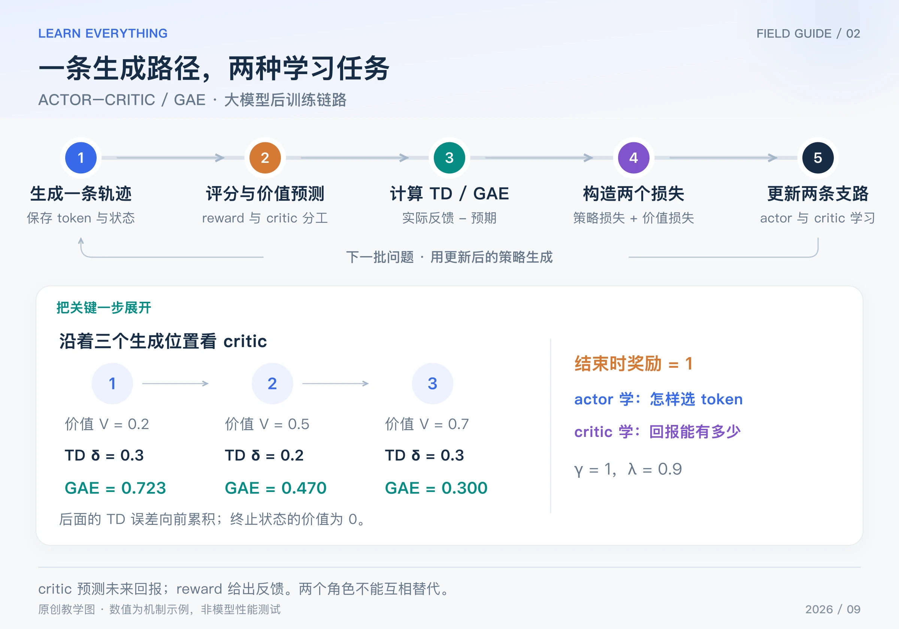

REINFORCE 可以拿整份回答的奖励做学习信号，但同样得到 1 分，在一个很容易的前缀和一个很难的前缀下，意义不一样。**Actor-Critic 增加一个价值估计：从这里继续生成，原本预计能得多少分？**

Actor-Critic 是一类方法框架，不是一个唯一的固定算法。本篇用最常见的状态价值 critic 和 GAE 说明它在语言模型里的用法。GAE 来自 2015 年公开、ICLR 2016 的研究。[GAE 原论文](https://arxiv.org/abs/1506.02438)

## Table of contents

## 1 actor、critic 和 reward 分别负责什么

actor 是生成模型：输入前缀，输出下一个 token 的概率。critic 输入当前前缀，预测在当前策略继续生成时，未来回报的期望，记作 V(s)。reward 则来自真正执行后的评分，例如答案检查或奖励模型。

一个直观例子是：critic 原本预测能得到 0.3，最后实际获得 1，这次比预期好；如果本来预测 0.99，最后同样得 1，超出预期的幅度就小很多。

critic 的目标是把回报估准，不能随意充当“答案是否正确”的裁判。没有真实反馈，单靠 critic 自己预测高分再奖励自己，容易形成循环错误。

## 2 完整链路：一条轨迹，两条参数更新支路



_图：原创链路图。终局奖励为 1，图中数值对应正文的 γ=1、λ=0.9。_

1. actor 生成一条回答，保存每个 token 之前的状态。
2. 得到实际奖励；critic 对各个状态预测价值。
3. 把奖励和价值预测组合成优势估计。
4. actor 使用优势加权 log-prob，学习如何行动。
5. critic 对回报目标做回归，学习如何估值。
6. 继续采样，两者随训练逐步调整。

reference 是另一个角色：如果需要 KL 约束，它负责提供参考概率。它不等于 critic；本篇数值例子先不加入 reference 和 KL。

## 3 TD 误差：这一步有没有超出预期

TD 表示 temporal difference，可以把 TD 误差读成“当前收到的奖励，加上对下一步的预测，再减去原先的预测”：

$$
\delta_t=r_t+\gamma V(s_{t+1})-V(s_t)
$$

γ 控制未来奖励的折扣。若真正结束，终止状态的 V 设为 0；如果只是达到截断长度，还需按算法区分截断与环境终止，不能机械地当作正常结束。

TD 的好处是不必只看最终回报，它利用下一步价值进行估计；代价是 critic 的误差会进入优势。所谓 bootstrap，就是把自己的下一步估值放进当前估计，不是凭空获得正确答案。

## 4 手算三步 GAE

假设回答有三个生成步骤，只在最后获得奖励 1，前两步奖励为 0。critic 对三个状态预测 `[0.2, 0.5, 0.7]`，终止状态为 0，取 γ = 1。

| 步骤 | 当前价值 | 当步奖励 | 下一状态价值 |             TD 误差 |
| ---- | -------: | -------: | -----------: | ------------------: |
| 1    |      0.2 |        0 |          0.5 | 0 + 0.5 − 0.2 = 0.3 |
| 2    |      0.5 |        0 |          0.7 | 0 + 0.7 − 0.5 = 0.2 |
| 3    |      0.7 |        1 |            0 |   1 + 0 − 0.7 = 0.3 |

GAE 不只取当前 δ，还把后面的 δ 按衰减系数加回来：

$$
\widehat A_t=\delta_t+\gamma\lambda\widehat A_{t+1}
$$

从结尾倒着算，取 λ = 0.9：

$$
\widehat A_3=0.3,\quad
\widehat A_2=0.2+0.9\times0.3=0.47,\quad
\widehat A_1=0.3+0.9\times0.47=0.723
$$

这三个值告诉 actor：在这个例子中，每个采样动作都比价值参照给出了更积极的信号，但大小不同。λ = 0 时只用当前 TD；有限完整轨迹上 λ = 1、γ = 1 时，式子会回到“最终回报减当前价值”。中间的 λ 在估计偏差与方差之间取舍。

可复制运行以下 Python 标准库代码：

```python
rewards = [0.0, 0.0, 1.0]
values = [0.2, 0.5, 0.7, 0.0]
gamma, lam = 1.0, 0.9
advantages = [0.0] * 3
carry = 0.0
for t in reversed(range(3)):
    delta = rewards[t] + gamma * values[t + 1] - values[t]
    carry = delta + gamma * lam * carry
    advantages[t] = carry
print([round(a, 3) for a in advantages])
# [0.723, 0.47, 0.3]
```

## 5 两种损失怎样让两个角色学习

最简 actor 损失是：

$$
L_{\mathrm{actor}}=-\sum_t\operatorname{stopgrad}(\widehat A_t)\log\pi_\theta(a_t\mid s_t)
$$

stopgrad 表示在 actor 更新中把优势当作固定权重，不让 actor 通过随意改变优势计算来降低这个损失。

critic 则可以对一个固定的回报估计目标做平方误差回归。例如该 GAE 窗口构造 `target = old_value + advantage`，得到 `[0.923, 0.97, 1.0]`；用它们拟合当前价值。目标来自整段反馈和旧估值，不是人为编造的“每一步正确标签”。具体实现也可以采用其他回报估计。

如果某个状态当前 V = 0.2、固定目标 = 0.923，使用半平方损失，导数就是 −0.723。一个把 V 直接当参数的教学 SGD 步骤、学习率 0.1，会把它更新到 0.2723；真实 critic 更新的是网络权重，再产生新价值。

## 6 与 PPO 的关系，以及会在哪里失败

Actor-Critic 提供“生成策略 + 价值估计”的框架；PPO 经常在这个框架里把普通策略损失替换为裁剪目标。因此，PPO 与 Actor-Critic 不是两种互斥模型结构。

常见问题包括 critic 估不准、奖励尺度突然变化、过长轨迹增加方差，以及价值模型带来的计算成本。后面的 GRPO、RLOO 和 ReMax 会研究能否从多份回答或贪心回答得到基线，省去训练 critic；它们也会付出额外采样或信号粗糙的代价。

读完后可以自查：reward 是事后反馈，V 是预期，优势是两者经估计后的差异；actor 学行动，critic 学预测。把这四句话对应到上面的表格，就能继续读 PPO。

[系列导读](/posts/knowledge/llm-foundations/reinforcement-learning/00-llm-rl-roadmap/) · [上一篇：REINFORCE](/posts/knowledge/llm-foundations/reinforcement-learning/01-reinforce/) · [下一篇：PPO](/posts/knowledge/llm-foundations/reinforcement-learning/03-ppo/)
