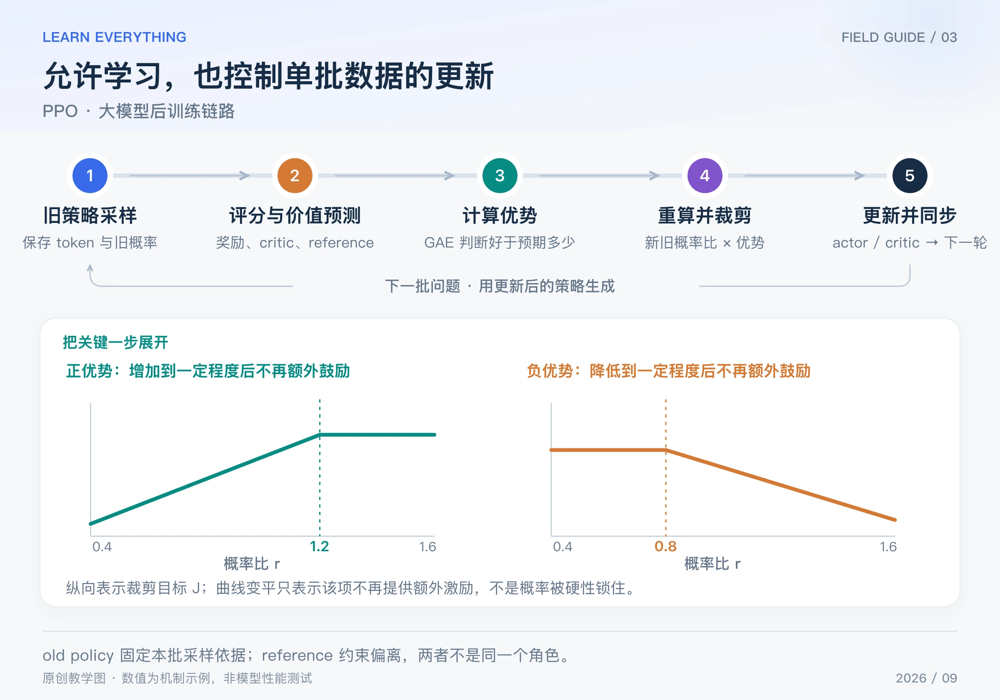

PPO（Proximal Policy Optimization，近端策略优化）要解决的一个问题是：模型生成一批回答后，我们希望多利用这批数据学习几次；但策略已经在变化，继续按旧数据猛推，可能让更新失控。

本篇讲最常见的 **PPO-Clip**：保存采样时的旧概率，重算当前概率，用概率比衡量变化，再用裁剪目标减少过度更新的收益。它是 2017 年提出的通用强化学习方法，后来被用于大模型后训练。[PPO 原论文](https://arxiv.org/abs/1707.06347)

## Table of contents

## 1 先认识四个容易混淆的角色

假设我们让模型回答“解释光合作用”，然后评价答案。一次典型的 PPO 式 RLHF 训练中，会看到：

| 角色           | 本轮做什么                   | 举例                                   |
| -------------- | ---------------------------- | -------------------------------------- |
| 当前策略 actor | 重算回答概率，并被更新       | 现在有多大概率生成这些 token？         |
| old policy     | 记录这批回答的采样依据       | 当时生成某个 token 的概率是 0.2        |
| critic         | 预测从某个前缀开始的未来回报 | 写到这一半，预计最终能得到多少回报？   |
| reference      | 提供行为约束的参照           | 相比参考模型，当前回答分布偏离了多少？ |

此外还需要奖励来源，可以是奖励模型，也可以是规则验证器。**critic 预测回报；奖励来源提供反馈。** 它们不能直接互换。

old policy 一般随新一轮采样刷新，而 reference 在对应训练窗口保持固定，更新节奏取决于方案。角色不等于独立物理模型：旧概率可以缓存，不一定始终保留一整套 old 模型。

## 2 完整训练链路：旧回答会被怎样使用



_图：原创链路图。曲线显示样本目标 J 随概率比变化；横轴比率不等于实际 token 概率。_

1. 用当前权重作为本轮 old policy，生成一批回答，保存 token、旧 log-prob 和有效长度。
2. 计算答案奖励。若有 KL 约束，按所用方案形成正则项或奖励惩罚。
3. critic 预测各前缀的价值，结合奖励，通过 GAE 等方法得到每个 token 的优势。
4. 把已经生成的回答送回当前 actor，沿原前缀重算 log-prob，计算 PPO 损失；critic 同时拟合价值目标。
5. 在有限的更新轮次内复用该批数据，然后用新策略生成下一批回答，并在独立验证集评估。

第 4 步常使用 teacher forcing，但目标不是普通 SFT 的“模仿所有 token”：优势决定推高还是压低其概率，概率比和裁剪决定这份信号如何参与更新。优势、旧概率和价值目标在本次策略反传中作为固定数据处理。

## 3 公式中的 min，到底裁剪了什么

对某个已经采到的 token，省略问题和前缀，定义：

$$
\rho_t=\frac{\pi_\theta(y_t\mid x,y_{<t})}{\pi_{\mathrm{old}}(y_t\mid x,y_{<t})}
$$

如果旧概率是 0.2、新概率是 0.3，那么比率为 1.5。注意，分子分母必须是**同一个 token、同一个前缀**下的概率。

PPO 最大化下面这个样本目标；用梯度下降实现时，对它取负号：

$$
J_t=\min\left(\rho_t\widehat A_t,\;
\operatorname{clip}(\rho_t,1-\epsilon,1+\epsilon)\widehat A_t\right),
\qquad L_{\mathrm{policy}}=-\operatorname{mean}_t J_t
$$

其中优势 A-hat 表示表现好于预期多少，ε 决定裁剪区间。`clip` 是把传入的比率数值截到区间内；外面的 `min` 再比较原始目标与裁剪目标。[原论文第 3 节](https://arxiv.org/pdf/1707.06347)

设 ε = 0.2，区间为 `[0.8, 1.2]`：

| 情况                      | 原始项 | 裁剪项 | 取 min 后 | 如何理解                                   |
| ------------------------- | ------ | ------ | --------- | ------------------------------------------ |
| 好 token，A = 2，ρ = 1.5  | 3      | 2.4    | 2.4       | 概率已经提高很多，额外提高不再增加这项收益 |
| 坏 token，A = −2，ρ = 0.5 | −1     | −1.6   | −1.6      | 概率已经降低很多，额外降低不再增加这项收益 |
| 坏 token，A = −2，ρ = 1.5 | −3     | −2.4   | −3        | 坏 token 反而变得更可能，保留纠正信号      |
| 好 token，A = 2，ρ = 0.5  | 1      | 1.6    | 1         | 好 token 反而变得更不可能，保留纠正信号    |

因此，PPO **没有把实际模型概率强制锁在某个区间内**。共享参数、其他样本、价值损失或 KL 项仍然可能改变概率。裁剪控制的是当前样本目标的形状，不是给所有权重加硬边界。

## 4 再往下走一步：它怎样产生梯度

用只有两个候选 token 的模型说明。令好 token 的概率 `p = sigmoid(z)`，旧概率固定为 0.5，优势固定为 1。起点 z = 0，所以 p = 0.5、ρ = 1，尚未触发裁剪。

在这个位置：

$$
\frac{\partial L}{\partial z}
=-\widehat A\,\rho(1-p)=-0.5
$$

取学习率 0.2，执行一次 SGD，z 从 0 变成 0.1，好 token 的概率变成约 0.525。继续增加时，如果它超过 0.6，ρ 就超过 1.2；这份正优势样本的裁剪项进入平坦区，其单独提供的局部梯度为 0。

下面代码同时计算目标和这次更新。它只验证单样本机制，没有训练一个语言模型：

```python
import math


def ppo_objective(ratio, advantage, epsilon=0.2):
    clipped = min(max(ratio, 1 - epsilon), 1 + epsilon)
    return min(ratio * advantage, clipped * advantage)


for ratio, advantage in [(1.5, 2), (0.5, -2), (1.5, -2), (0.5, 2)]:
    print(round(ppo_objective(ratio, advantage), 4))

z, old_p, advantage, lr = 0.0, 0.5, 1.0, 0.2
p = 1 / (1 + math.exp(-z))
ratio = p / old_p
# 当前位于未裁剪区；这不是所有位置通用的梯度公式。
grad_z = -advantage * ratio * (1 - p)
z -= lr * grad_z
print(round(z, 4), round(1 / (1 + math.exp(-z)), 4))
# 2.4, -1.6, -3.0, 1.0；最后一行：0.1 0.525
```

## 5 critic 和 KL 在哪里参与

策略损失只是完整训练目标的一部分。critic 通常最小化价值预测与固定目标的误差，例如平方误差；目标可以来自 GAE 对应的回报估计。GAE 的数值计算见[上一篇](/posts/knowledge/llm-foundations/reinforcement-learning/02-actor-critic-gae/)。

KL 则约束当前策略相对 reference 的偏离。一种常见做法是把 token 级 KL 代价加入奖励，再算优势；另一些实现把 KL 明确放进目标函数。具体实现必须确认，不能不检查就把两种路径都加上，造成重复惩罚。原始 PPO 不要求一定具有一个语言模型 reference，后者来自具体的后训练配置。

## 6 什么时候读懂了，什么时候还没读懂

如果你能回答“同一份旧答案现在的概率是多少、优势为什么是正或负、裁剪是否在这个方向生效”，就抓住了 PPO 的核心。

实际故障往往来自这些接口：生成与训练概率计算不一致；旧样本复用过多；critic 估计很差；奖励尺度或 KL 系数不合适；有效 token mask 错误。看到概率比异常，先检查模型版本、采样口径和数值实现，再判断是否应该改裁剪参数。

PPO 为 critic 留出了明确位置，也增加了价值估计与训练成本。下一篇 GRPO 换掉的主要环节，就是“优势由谁提供”。

[系列导读](/posts/knowledge/llm-foundations/reinforcement-learning/00-llm-rl-roadmap/) · [上一篇：ACTOR–CRITIC / GAE](/posts/knowledge/llm-foundations/reinforcement-learning/02-actor-critic-gae/) · [下一篇：GRPO](/posts/knowledge/llm-foundations/reinforcement-learning/04-grpo/)
