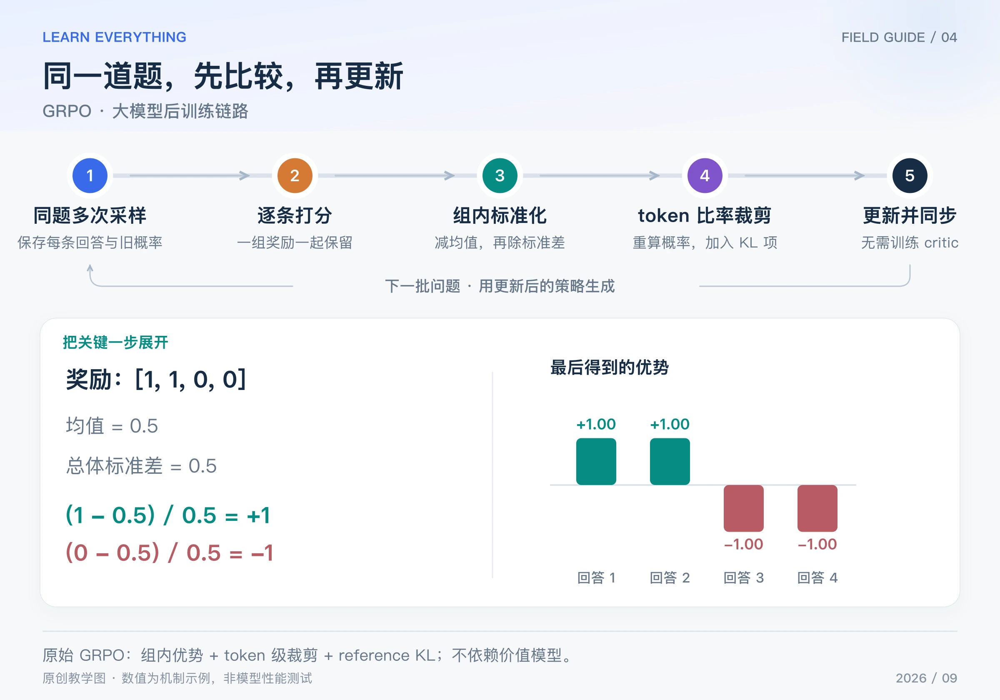

同一道题，让模型回答四次，奖励分别是 `[1, 1, 0, 0]`。即使没有一个 critic 预测“这道题应该得多少分”，我们也能直接比较：前两个比本组平均表现好，后两个更差。

这就是 GRPO（Group Relative Policy Optimization，组相对策略优化）的入门直觉：**用同题多份回答的相对表现构造优势，再用这些优势更新策略。** 本篇以 DeepSeekMath 中的原始 GRPO、终局奖励版本为准；后续框架中的同名配置可能修改归一化、损失聚合或 KL。[DeepSeekMath 原论文](https://arxiv.org/abs/2402.03300)

## Table of contents

## 1 GRPO 去掉了什么，又增加了什么

PPO 常通过 critic 估计各前缀的未来回报。GRPO 不训练这个价值模型，而是为每个问题随机采样一组回答，从组内奖励估计相对表现。

这节省了价值模型相关的资源，但并不表示训练“没有额外成本”：每道题需要多次生成，仍然要评分、保留旧概率、重算当前概率；原始目标还包含相对 reference 的 KL 项。

组必须按问题组织。不能把“简单题的 1 分”和“困难题的 0 分”随意放在一起求均值，然后声称这是同题相对优势。

## 2 从四份回答到一次参数更新



_图：原创链路图。奖励 [1,1,0,0] 按总体标准差归一化；四份回答都会进入对应的策略目标。_

1. 固定本批 old policy；对问题 x 采样 G 份回答，保存各自 token、旧 log-prob 和长度。
2. 验证器或奖励模型逐份打分，得到 `R1 … RG`。
3. 在同一组内减均值、除标准差，每份回答得到一个优势。
4. 当前模型沿每份旧回答重算概率，对每个 token 计算新旧概率比与裁剪项，并按选定配置计算 KL。
5. 聚合损失、反向传播、更新 actor；完成本批有限次更新后，刷新策略并采新数据。

注意：**不是只保留得分最高的回答去做 SFT。** 得分相对低的回答也会产生负优势，参与策略更新。

## 3 手算组内优势，先处理好分母

对 G 份回答，定义奖励均值 μ 和标准差 σ：

$$
\mu=\frac1G\sum_{j=1}^G R_j,\qquad
\widehat A_i=\frac{R_i-\mu}{\sigma+\eta}
$$

η 是防止分母为零的小常数，不能和 PPO 的裁剪参数 ε 混淆。本篇教学例子用总体标准差；有的实现使用样本标准差，数值会不同，应查看代码口径。

对于 `[1, 1, 0, 0]`：均值为 0.5，总体标准差为 0.5。忽略很小的 η，优势就是 `[1, 1, -1, -1]`。

| 回答 | 奖励 | 减均值 | 除以标准差后的优势 |
| ---- | ---- | ------ | ------------------ |
| 1    | 1    | 0.5    | 1                  |
| 2    | 1    | 0.5    | 1                  |
| 3    | 0    | −0.5   | −1                 |
| 4    | 0    | −0.5   | −1                 |

在终局奖励的这个版本里，同一份回答的各 token 共享该回答的优势。这不是说每一步都被独立验证过，而是把整份回答的相对结果作为这些动作的学习权重。

如果奖励全是 1，或者全是 0，分子全为零；加入 η 后，奖励对应的优势仍全为零。说明这组数据缺少相对区分信号，不意味着模型已经学会所有任务；若损失还有 KL，整体梯度也不一定为零。

## 4 原始目标中，哪些东西仍然像 PPO

对回答 i 的第 t 个 token，计算比率 ρᵢ,ₜ。原始 GRPO 的一个关键形式是先平均每份回答的 token 项，再平均回答：

$$
J=\frac1G\sum_{i=1}^{G}\frac1{T_i}\sum_{t=1}^{T_i}
\left[\min\left(\rho_{i,t}\widehat A_i,
\operatorname{clip}(\rho_{i,t},1-\epsilon,1+\epsilon)\widehat A_i\right)
-\beta D_{i,t}\right]
$$

Tᵢ 是回答的有效 token 数；Dᵢ,ₜ 是相对 reference 的 KL 估计项，β 是它的权重。训练时最小化 `L = -J`。公式强调原始版本，不能把“所有叫 GRPO 的实现都逐字相同”作为前提。[原论文第 4.1 节](https://arxiv.org/html/2402.03300v3)

例如第一份回答优势为 1，其中一个 token 旧概率 0.2，新概率 0.3，ρ = 1.5，ε = 0.2。该 token 的奖励目标是 `min(1.5, 1.2) = 1.2`。若第三份回答优势为 −1，同样的比率产生 `min(-1.5, -1.2) = -1.5`，会保留压低这个坏方向的信号。

共享优势不等于共享概率比。第一份回答的每个 token 都用 A = 1，但它们各自的 ρ、是否进入裁剪区、以及参数梯度都可能不同。

## 5 十几行代码验证关键计算

```python
import math

rewards = [1.0, 1.0, 0.0, 0.0]
mean = sum(rewards) / len(rewards)
std = math.sqrt(sum((r - mean) ** 2 for r in rewards) / len(rewards))
advantages = [(r - mean) / (std + 1e-8) for r in rewards]
print([round(a, 4) for a in advantages])
# [1.0, 1.0, -1.0, -1.0]


def token_objective(ratio, advantage, epsilon=0.2):
    clipped = min(max(ratio, 1 - epsilon), 1 + epsilon)
    return min(ratio * advantage, clipped * advantage)


print(round(token_objective(1.5, advantages[0]), 4))
print(round(token_objective(1.5, advantages[2]), 4))
# 1.2；-1.5。这里只计算奖励代理项，未加入 KL。
```

重算、反传之后，更新的是 actor 的可训练参数；如果选用 LoRA，梯度更新 LoRA 参数；如果全参数微调，则更新相应全量权重。GRPO 本身不规定必须使用哪一种参数化方式。

## 6 学到这里，还要知道三个边界

**组内相对表现不等于跨题绝对质量。** 同一奖励模式在很容易或很困难的问题上可能代表不同信息；除以标准差也会改变不同组的权重。当标准差很小而奖励带噪声时，需要关注归一化带来的放大。

**没有 critic 不代表信用分配问题消失。** 整句奖励共享给所有 token，仍然难以明确指出长推理中的哪一步真正导致成功或失败。过程奖励是另一个设计维度。

**更多采样不必然产生更多有效信号。** 一组答案完全一致或全部得同分，就没有组内比较方向。DAPO 会进一步讨论怎样筛选和补充这类数据；RLOO 则用另一种基线解释“比较其他回答”的思想。

[系列导读](/posts/knowledge/llm-foundations/reinforcement-learning/00-llm-rl-roadmap/) · [上一篇：PPO](/posts/knowledge/llm-foundations/reinforcement-learning/03-ppo/) · [下一篇：RLOO](/posts/knowledge/llm-foundations/reinforcement-learning/05-rloo/)
