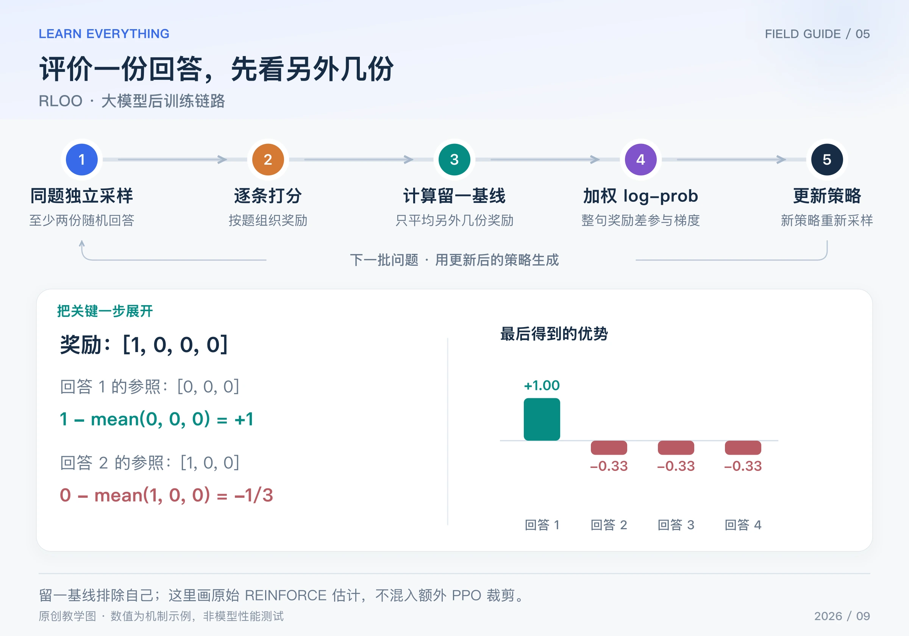

你写了一份答案，想知道它表现怎样。一个自然的参照是：“同一道题，另外几次回答平均得了多少分？”RLOO 就用这个思路构造 REINFORCE 的基线。

RLOO 是 REINFORCE Leave-One-Out。本篇依据 2024 年将该估计用于语言模型人类反馈训练的研究；leave-one-out 估计本身早于这篇论文。它是一种有代表性的无 critic 方法，不意味着所有后训练系统都在使用它。[ACL 2024 原论文](https://aclanthology.org/2024.acl-long.662/)

## Table of contents

## 1 先把“留一”理解成一句话

对同一道题独立随机采样 G 份回答，评价第 i 份时，**基线只平均另外 G−1 份的奖励，排除它自己**。

$$
b_i=\frac1{G-1}\sum_{j\ne i}R_j,\qquad
\widehat A_i=R_i-b_i,\qquad G\ge2
$$

为什么排除自己？在给定问题与当前采样策略、其他回答独立采样的前提下，其余样本的平均奖励不依赖第 i 份具体采到了什么。因此它能充当 REINFORCE 的动作无关基线，消掉参照而不改变该奖励目标的期望梯度。

这是一个有条件的性质。不能把相关性很强的任意候选答案池、beam search 结果直接替换进来，还默认同一推导无条件成立。基线在策略反传中也应停止梯度。

## 2 完整流程：整份回答怎样参与反传



_图：原创链路图。奖励为 [1,0,0,0]；第一份的基线为 0，其他三份的基线各为 1/3。_

1. 同一道题，使用同一策略独立随机生成至少两份回答。
2. 给每份回答计算奖励，按题组成奖励列表。
3. 对每份回答排除自己的奖励，计算留一均值，再用自己的奖励减它。
4. 重算每份回答的整句 log-prob，用留一优势加权，形成 REINFORCE 损失。
5. 反向传播、更新策略，重新收集新回答，再继续训练和评估。

本篇先省略 KL，以看清核心估计。原论文的 RLHF 设置可把相对 reference 的 KL 代价计入奖励；这会改变这里的 R，不能在实现时无意间遗漏或重复计算。

## 3 四份回答，逐项算一遍

假设奖励是 `[1, 0, 0, 0]`：只有第一份通过验证。

| 回答 | 自己的奖励 | 其他三份奖励 | 留一基线 | 优势 |
| ---- | ---------- | ------------ | -------- | ---- |
| 1    | 1          | 0、0、0      | 0        | 1    |
| 2    | 0          | 1、0、0      | 1/3      | −1/3 |
| 3    | 0          | 1、0、0      | 1/3      | −1/3 |
| 4    | 0          | 1、0、0      | 1/3      | −1/3 |

正优势回答提供提高概率的梯度方向，三个负优势回答分别提供相反方向。后面三份虽然原始奖励是零，仍然有非零学习信号：因为它们比其他回答的平均表现差。

若四个奖励都一样，留一优势全为零。这种情况与 GRPO 一样，缺少组内区分信息；额外正则项是否仍提供梯度，要另看总损失。

## 4 从优势变成损失，再走到梯度

RLOO 的核心序列级损失为：

$$
L=-\frac1G\sum_{i=1}^{G}\widehat A_i\log\pi_\theta(y_i\mid x),
\qquad
\log\pi_\theta(y_i\mid x)=\sum_{t=1}^{T_i}\log\pi_\theta(y_{i,t}\mid x,y_{i,<t})
$$

“序列级”表示整份回答作为一个动作来估计奖励梯度；它仍然通过每个 token 的条件概率反传。这里对 token 的 log-prob 求和，没有偷偷除以长度；改成长度平均会改变目标权重。

对于刚才四个优势，把整句 log-prob 暂记为 ℓᵢ，则：

$$
\frac{\partial L}{\partial\ell_i}=-\frac{\widehat A_i}{G}
\quad\Rightarrow\quad
[-0.25,\;1/12,\;1/12,\;1/12]
$$

这给出了每份回答对反向传播的权重。真实模型更新的是共享参数，并不能把四个 ℓ 当作独立旋钮任意加减；后续要继续乘上各自 log-prob 对参数的导数。

```python
rewards = [1.0, 0.0, 0.0, 0.0]
g = len(rewards)
assert g >= 2
baselines = [(sum(rewards) - r) / (g - 1) for r in rewards]
advantages = [r - b for r, b in zip(rewards, baselines)]
grad_logp = [-a / g for a in advantages]

print([round(b, 4) for b in baselines])
print([round(a, 4) for a in advantages])
print([round(v, 4) for v in grad_logp])
# 基线：[0.0, 0.3333, 0.3333, 0.3333]
# 优势：[1.0, -0.3333, -0.3333, -0.3333]
# 对整句 log-prob 的梯度：[-0.25, 0.0833, 0.0833, 0.0833]
```

## 5 它和 GRPO，不只是“都采多份回答”

令 μ 是包含自己的组均值。一个有用的恒等式是：

$$
R_i-b_i=\frac{G}{G-1}(R_i-\mu)
$$

所以，在**不除标准差、G 固定**时，留一优势与组内去均值优势只差一个公共缩放系数。但原始 GRPO 还除以组内标准差，并使用 token 概率比与裁剪，不能因此说完整算法相同。

| 对比项       | 本篇的 RLOO 核心      | 原始 GRPO               |
| ------------ | --------------------- | ----------------------- |
| 基线         | 另外 G−1 份的奖励均值 | 包含自己的 G 份奖励均值 |
| 标准差归一化 | 核心估计不要求        | 使用组内标准差          |
| 策略更新形式 | 序列级 REINFORCE      | token 级裁剪代理目标    |
| critic       | 不需要                | 不需要                  |

有些训练框架会在标为 RLOO 的方案中添加概率比、裁剪、额外归一化或样本复用。看到名称后，仍应核对实际 advantage estimator、loss 与 reduction，不能靠缩写推断代码行为。[原论文的估计与比较](https://aclanthology.org/2024.acl-long.662.pdf)

## 6 成本与适用边界

RLOO 让基线计算很简单，但需要同题多次生成；当输出很长时，rollout 的时间和显存管理仍可能成为主要成本。增加组大小能提供更多比较信息，也增加生成与评分工作，不应只看是否省掉 critic。

它还依赖奖励的可信度和样本的有效差异。原始 on-policy 推导使用当前采样策略的数据；拿旧回答无限重复训练，会偏离这个前提，需要额外校正或重新采样的设计。

下一篇 ReMax 继续简化基线来源：不平均一组其他随机回答，而是增加一份当前模型的贪心回答。

[系列导读](/posts/knowledge/llm-foundations/reinforcement-learning/00-llm-rl-roadmap/) · [上一篇：GRPO](/posts/knowledge/llm-foundations/reinforcement-learning/04-grpo/) · [下一篇：ReMax](/posts/knowledge/llm-foundations/reinforcement-learning/06-remax/)
