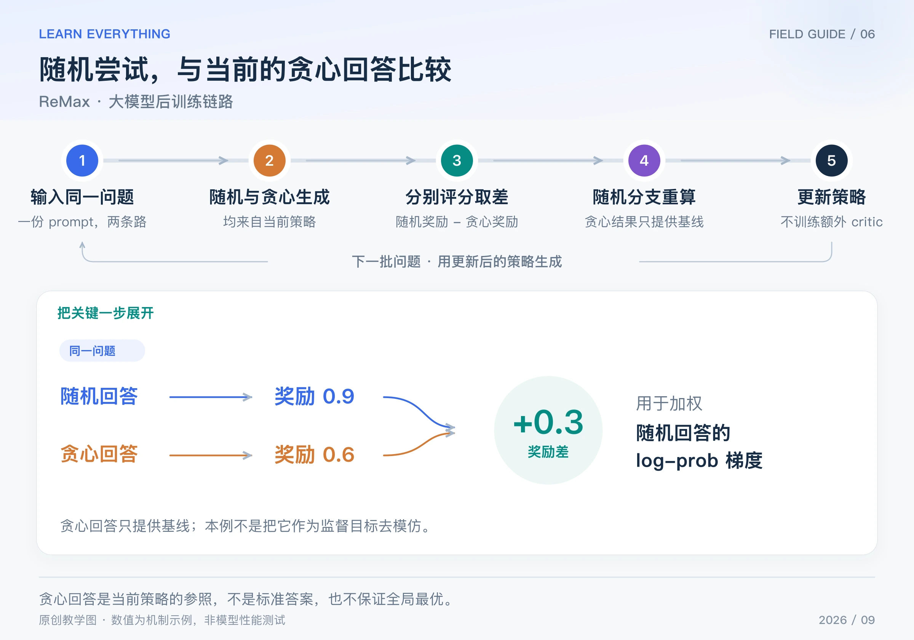

同一道题，模型随机尝试一次，又按自己当前最偏好的 token 贪心回答一次。随机回答比贪心回答好，就鼓励这次尝试；比它差，就反向调整。

ReMax 用这份**当前策略的贪心回答**提供基线，省去专门训练的 critic。它依然属于 REINFORCE 路线，不是让模型直接模仿贪心答案。本篇介绍 2023 年发布的 ReMax 研究中的核心做法。[ReMax 原论文](https://arxiv.org/abs/2310.10505)

## Table of contents

## 1 为什么要再生成一份贪心回答

REINFORCE 可以用 `奖励 - 基线` 加权 log-prob。困难是：这个基线从哪里来？

critic 用一个模型预测；RLOO 用同题其他随机回答的平均奖励；ReMax 则用当前策略贪心生成结果的奖励。它把“模型通常最倾向于怎么回答”变成一个针对当前问题的参照。

贪心生成是在每一步选择概率最大的 token。它**不保证整句联合概率最大，更不保证奖励最高或答案正确**。这里需要的是参照，不是标准答案。

## 2 两条生成支路，只有一条进入策略损失



_图：原创链路图。贪心支路提供停止梯度的参照；随机回答的 log-prob 进入策略损失。_

1. 输入一个问题，确定本轮采样策略。
2. 随机采样一份回答 y；同时从同一策略贪心生成一份回答 y-greedy。
3. 用相同的评分口径分别计算奖励 R 和 b。
4. 计算优势 `R - b`；只对随机回答重算可微分 log-prob，构造加权损失。
5. 反向传播更新策略，然后用新策略重新进行随机与贪心生成，并评估实际效果。

贪心分支提供基线，在这次策略反传中停止梯度。即使贪心输出随策略更新而变化，也不意味着要对 argmax 选择和基线奖励求导。[原论文第 4.2 节](https://arxiv.org/html/2310.10505v3)

## 3 手算一个正例和一个负例

假设同一个问题的贪心回答得分为 0.6：

| 随机回答得分 | 贪心回答得分 | 优势 | 这份样本提供的更新方向   |
| ------------ | ------------ | ---- | ------------------------ |
| 0.9          | 0.6          | 0.3  | 提高随机回答的概率       |
| 0.2          | 0.6          | −0.4 | 降低随机回答的概率       |
| 0.6          | 0.6          | 0    | 这份奖励差不提供策略梯度 |

第一行不是“奖励 0.9，就给参数加 0.9”。0.9 先减去参照得到 0.3，再乘 log-prob 的梯度。第二行虽然奖励大于零，但比参照更差，所以优势为负。

对单个问题，核心损失为：

$$
L=-\operatorname{stopgrad}(R-b)\log\pi_\theta(y\mid x)
=-(R-b)\sum_t\log\pi_\theta(y_t\mid x,y_{<t})
$$

如果随机回答只有两个 token，log-prob 分别为 −0.2、−0.8，优势是 0.3，则整句 log-prob 为 −1，损失为 0.3。对于这两个 log-prob，损失的偏导都为 −0.3，然后继续通过网络反传。

## 4 真正做一次参数更新

把语言模型缩小成二选一模型：采到的目标回答概率为 `p = sigmoid(z)`，初始 z = 0、p = 0.5。本轮优势固定为 0.3，则：

$$
\frac{\partial L}{\partial z}=-(R-b)(1-p)=-0.15
$$

学习率取 0.4，一次 SGD 后 z = 0.06，目标回答概率约为 0.515。若优势换成 −0.4，同一起点的梯度变成 0.2，z 更新为 −0.08，概率降到约 0.480。

```python
import math


def one_update(sample_reward, greedy_reward, lr=0.4):
    z = 0.0
    p = 1 / (1 + math.exp(-z))
    advantage = sample_reward - greedy_reward
    grad = -advantage * (1 - p)
    z -= lr * grad
    return advantage, grad, z, 1 / (1 + math.exp(-z))


for reward in [0.9, 0.2]:
    print([round(v, 4) for v in one_update(reward, 0.6)])
# [0.3, -0.15, 0.06, 0.515]
# [-0.4, 0.2, -0.08, 0.48]
```

例子把回答抽象成两个选项，用于验证梯度方向。真实模型的多个 token 共享参数，所以不能保证每个 token 的实际概率都单独按同样幅度变化。

## 5 基线明明来自模型，为什么可以不对它求导

在当前参数固定、问题固定时，贪心回答及其奖励就是一个确定参照。它不随这次随机采到的是回答甲还是回答乙而改变。于是：

$$
\mathbb E_{y\sim\pi_\theta}\left[b(x)\nabla_\theta\log\pi_\theta(y\mid x)\right]
=b(x)\nabla_\theta\sum_y\pi_\theta(y\mid x)=0
$$

这说明，在这些条件下，减去基线不改变 REINFORCE 期望梯度。这里只是在每次参数位置构造梯度估计，没有把 `期望奖励 - 可训练基线` 当成一个新目标去完整求导。

基线可以改变方差，但并非在每个任务、每个训练阶段都保证改善。贪心奖励波动很大、奖励本身不可靠时，也要通过实际实验验证。

## 6 与 RLOO、PPO 的关系，以及代价

| 方法         | 参照来自哪里               | 额外工作               |
| ------------ | -------------------------- | ---------------------- |
| PPO + critic | 学到的价值预测             | 价值估计及其训练       |
| RLOO         | 同题其他随机回答的奖励均值 | 多次随机生成与评分     |
| ReMax        | 当前策略的贪心回答奖励     | 额外一次贪心生成与评分 |

ReMax 去掉了价值模型，却没有去掉 rollout 和评分成本。贪心生成也要完整解码，不能直接当成零成本。若加入 reference KL 等额外设计，还要核对其具体位置；本篇的数字例子只计算基础奖励差。

它适合帮助你理解“基线可以来自当前模型本身”。长答案的信用分配、错误奖励、采样探索不足以及生成与训练的不一致，仍需要各自解决。

[系列导读](/posts/knowledge/llm-foundations/reinforcement-learning/00-llm-rl-roadmap/) · [上一篇：RLOO](/posts/knowledge/llm-foundations/reinforcement-learning/05-rloo/) · [下一篇：DAPO](/posts/knowledge/llm-foundations/reinforcement-learning/07-dapo/)
