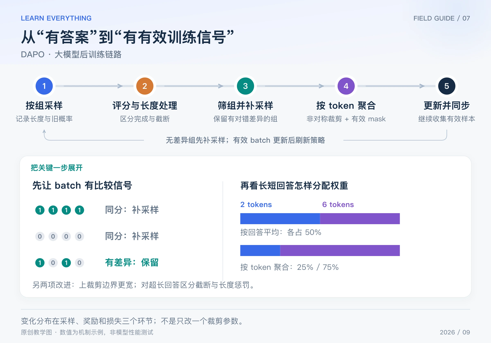

会写 GRPO 公式之后，长推理训练仍可能出现很多问题：答案越来越相似，采了一大批却全是零优势，长短回答贡献不均，截断答案得到的惩罚也不合理。

DAPO 是 2025 年公开的一套大模型强化学习方法，围绕这类问题调整采样、损失和长度奖励。理解它的重点，是看清每个调整落在训练链路的哪一环。[DAPO 原论文](https://arxiv.org/abs/2503.14476)、[官方项目页](https://dapo-sia.github.io/)

## Table of contents

## 1 先看整体：它不是只换一个公式



_图：原创链路图。下方分别展示无差异组的过滤，以及两条长短回答在两种聚合口径下的权重。_

1. 每道题采样一组回答，保存 token、旧概率、长度以及是否正常结束。
2. 计算正确性奖励，并按配置处理超长、截断样本及长度惩罚。
3. 按组内正确率筛选混合对错的组，并继续采样补齐有效 batch。
4. 计算组内优势，重算当前 token 概率，应用非对称裁剪；按照有效 token 总数聚合损失。
5. 反向传播、更新策略、刷新采样权重，并评估正确率、长度和实际生成成本。

下面四个部分对应论文的主要机制。文章数字缩小为方便手算的例子，不是完整复现论文训练配置。

## 2 Clip-Higher：向上与向下，不必用同一阈值

普通对称裁剪使用 `[1-ε, 1+ε]`。DAPO 把上下两个参数拆开：

$$
J_{i,t}=\min\left(\rho_{i,t}\widehat A_i,
\operatorname{clip}(\rho_{i,t},1-\epsilon_{\mathrm{low}},1+\epsilon_{\mathrm{high}})\widehat A_i\right)
$$

例如教学配置取下界参数 0.2、上界参数 0.3，区间就变成 `[0.8, 1.3]`。对于正优势 A = 1、比率 ρ = 1.25 的 token：

- 对称 `[0.8,1.2]` 的样本目标是 1.2，已经进入上侧平坦区。
- 非对称 `[0.8,1.3]` 的样本目标是 1.25，仍有继续提高目标的空间。

这给正优势动作向上调整留出更多余地，用于缓解探索受限。它不保证熵一定提高，也没有硬性把实际概率限制在区间内。原论文实验采用的上下参数是 0.2 和 0.28；这里使用 0.3 仅为了看清计算。

## 3 Dynamic Sampling：先保证这一批真的能提供比较信号

原论文按组内正确率筛选，保留正确率严格处于 0 和 1 之间的组。先看只有正确性奖励的例子：正确为 1、错误为 0，每道题采四份回答：

| 一组奖励    | 组内优势 | 动态采样怎样处理   |
| ----------- | -------- | ------------------ |
| `[1,1,1,1]` | 都为零   | 跳过该组，继续收集 |
| `[0,0,0,0]` | 都为零   | 跳过该组，继续收集 |
| `[1,0,1,0]` | 有正有负 | 可用于组内相对学习 |

假设目标是收集两组有效数据，第一轮采到三组，却只有一组混合对错，那么还要继续生成，直到达到有效 batch 目标或系统设置的采样上限。

这既不是“把所有错误答案删掉”，也不是“只保留正确答案”。**被保留的混合组里，错误回答仍提供负优势。** 过滤对象是没有有效比较信号的组。

如果总奖励还叠加长度等项，“正确率全相同”和“总奖励全相同”未必等价；实现时应明确用于过滤的是正确性字段还是总奖励，不能混用。

动态采样会增加生成工作，并改变实际参与训练的题目分布。如果几乎所有组都全错，不能只靠无限补采样；需要检查任务难度、初始模型和奖励验证是否合理。实现也要设置上限并记录有效组比例。

## 4 Token-Level Policy Gradient Loss：两条回答，怎样分配权重

这是最容易被术语掩盖的区别。设两条有效回答长度分别为 2 和 6，把每个 token 的策略目标记为 fᵢ,ₜ。

一种“每条回答先平均，再平均回答”的方式是：

$$
J_{\mathrm{answer}}=\frac12\left(\frac12\sum_{t=1}^{2}f_{1,t}
+\frac16\sum_{t=1}^{6}f_{2,t}\right)
$$

第一条每个 token 权重为 1/4，第二条每个 token 权重为 1/12。两条回答总权重各占一半。

DAPO 使用的关键聚合形式，是用所有有效 token 的总数作分母：

$$
J_{\mathrm{token}}=\frac1{2+6}\left(\sum_{t=1}^{2}f_{1,t}+\sum_{t=1}^{6}f_{2,t}\right)
$$

现在每个 token 权重都是 1/8；两条回答的总权重分别为 25% 和 75%。这里说的是**相对于 f 的聚合系数**，不是说最终参数梯度必然按这个比例，因为每个 token 的目标与网络导数还会不同。

再设短回答每个 f 都为 1，长回答每个 f 都为 3：回答平均结果是 2，token 平均结果是 2.5。它们对应不同权重，不能随意替换。

“token 级损失”不意味着给每一步新增了一个过程奖励。优势仍可以来自整份回答的组内奖励；改变的是这些 token 项在总损失里怎样汇总。[原论文第 3 节](https://arxiv.org/html/2503.14476v2)

## 5 Overlong Reward Shaping：截断与自然答错要区分

如果一份推理被长度上限截断，它没有完成答案。直接把它当作普通错误答案，可能给大量尚未完成的推理施加不准确的负面信号。论文讨论了屏蔽这类截断样本损失，以及进一步使用渐进的长度惩罚。

Soft Overlong Punishment 设置一个靠近最大长度的缓冲区。在本篇小例子中，令最大长度 Lmax = 100、缓冲区 Lcache = 20：

$$
R_{\mathrm{length}}(T)=
\begin{cases}
0,&T\le80\\
(80-T)/20,&80<T\le100\\
-1,&T>100
\end{cases}
$$

长度 70 不罚；90 罚 −0.5；100 罚 −1。把这个长度项加到正确性奖励上，再据此形成后续学习信号。实际达到生成上限时能否产生 `T > Lmax`，取决于停止配置；分段式写出完整定义，不表示系统一定会生成超限 token。

注意，Lmax 在这里是含惩罚缓冲区的上边界，开始惩罚的位置为 `Lmax - Lcache`。配置时还要分别记录结束原因和 mask，不能仅凭“答案长”就将它当作截断。

## 6 用代码核对两种关键计算

```python
short_terms = [1.0] * 2
long_terms = [3.0] * 6
answer_mean = (sum(short_terms) / 2 + sum(long_terms) / 6) / 2
token_mean = (sum(short_terms) + sum(long_terms)) / 8
print(answer_mean, token_mean)  # 2.0 2.5


def length_penalty(length, max_length=100, cache=20):
    assert 0 < cache <= max_length
    start = max_length - cache
    if length <= start:
        return 0.0
    if length <= max_length:
        return (start - length) / cache
    return -1.0


print([length_penalty(t) for t in [70, 80, 90, 100, 110]])
# [0.0, 0.0, -0.5, -1.0, -1.0]
```

## 7 把机制与适用范围一起记住

| 观察到的问题                     | 对应机制             | 仍需监测                            |
| -------------------------------- | -------------------- | ----------------------------------- |
| 正优势动作向上调整过早进入平坦区 | Clip-Higher          | 熵、KL、实际概率比和裁剪比例        |
| 一大批数据没有组内比较信号       | 动态采样             | 有效组比例、题目分布和额外生成成本  |
| 长短回答的 token 权重差异明显    | token 总数归一化     | 长度分布、有效 mask、梯度与任务表现 |
| 截断被当作普通失败               | 超长奖励与 mask 处理 | 截断率、完整答案正确率和长度变化    |

原论文在数学推理设置中移除了 KL 项，这不等于所有偏好、安全或通用对话训练都应该取消 reference 约束。四个改动也不能代替可靠奖励、正确数据和生成训练一致性检查。

理解 DAPO 后，再看 GSPO 会更清楚：DAPO 关注的变化分布在多个环节，而 GSPO 接下来重点改变概率比与裁剪的粒度。

[系列导读](/posts/knowledge/llm-foundations/reinforcement-learning/00-llm-rl-roadmap/) · [上一篇：ReMax](/posts/knowledge/llm-foundations/reinforcement-learning/06-remax/) · [下一篇：GSPO](/posts/knowledge/llm-foundations/reinforcement-learning/08-gspo/)
