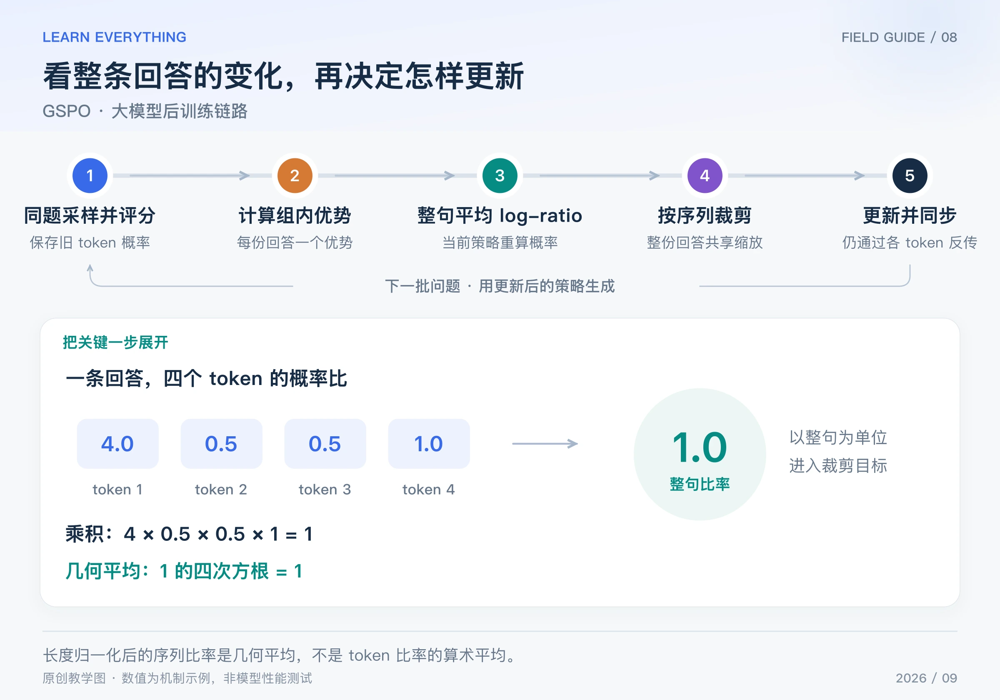

GRPO 通常逐个 token 计算新旧概率比，再逐个 token 决定裁剪。GSPO 换了一个观察单位：先看整份回答相对旧策略改变了多少，再对这份回答应用裁剪目标。

GSPO 全称 Group Sequence Policy Optimization，来自 2025 年的研究。它保留同题多回答的组内优势，但把关键的概率比定义和裁剪单位移到了序列层面。[GSPO 原论文](https://arxiv.org/abs/2507.18071)

## Table of contents

## 1 为什么 token 比率与整句变化不是一回事

一份回答里，某个 token 的概率可能增加，另一个可能降低。逐 token 看，会看到很多局部变化；整句看，则需要把这些条件概率联系起来。

这不是“哪一个 token 才重要”的判断，而是优化目标的设计选择。GSPO 希望让整句奖励对应一个整句级别的更新权重。它并没有取消 token 概率，也没有只对最后一个 token 反传。

## 2 完整链路：先算整句比率，再裁剪



_图：原创链路图。局部比率 [4,0.5,0.5,1] 合成 s=1；当前函数值为 1 不表示导数为零。_

1. 用本轮 old policy 对同一道题生成一组回答，保存各 token 的旧 log-prob 和有效长度。
2. 逐份评分，按同题奖励均值与标准差计算每份回答的优势。
3. 当前模型沿旧回答重算 token log-prob；与旧值相减后，在回答内部求平均，再取指数。
4. 得到每份回答一个长度归一化的序列比率，计算序列裁剪目标，并在 batch 内平均。
5. 反向传播到模型参数，有限次更新后刷新采样策略，继续生成、评估与训练。

组内优势、旧概率是本次更新的固定输入；当前 log-prob 必须保留梯度。有效长度只统计参与损失的回答 token，不能把 prompt 和 padding 混进去。

## 3 用四个 token 手算“几何平均”

设回答 i 长度为 Tᵢ，token 比率为 ρᵢ,ₜ。GSPO 定义：

$$
s_i=\exp\left(\frac1{T_i}\sum_{t=1}^{T_i}\log\rho_{i,t}\right)
=\left(\frac{\pi_\theta(y_i\mid x)}{\pi_{\mathrm{old}}(y_i\mid x)}\right)^{1/T_i}
$$

它是 token 比率的**几何平均**。真实实现一般先计算 log-prob 差值，避免先连乘大量小概率造成数值问题。[原论文第 4.1 节](https://arxiv.org/html/2507.18071v2)

用四个 token 的比率 `[4, 0.5, 0.5, 1]` 举例：

| 计算方式              | 算式                    | 结果 |
| --------------------- | ----------------------- | ---- |
| 未归一化的整句比率    | 4 × 0.5 × 0.5 × 1       | 1    |
| GSPO 的长度归一化比率 | 上述乘积的四次方根      | 1    |
| token 比率的算术平均  | (4 + 0.5 + 0.5 + 1) / 4 | 1.5  |

为什么这个例子有用？因为局部变化很大，整句归一化比率却可以刚好是 1。不能把四个比率直接算术平均，然后称为 GSPO。

再看 `[2,2,2,2]`：未归一化整句比率是 16，长度归一化后是 2。这一步缓和了序列长度对数值尺度的影响；但归一化后的 s 已经不是普通、未经修改的重要性采样权重，不能直接套用其无偏性结论。

## 4 序列级裁剪，梯度仍然经过每个 token

对一份回答的目标为：

$$
J_i=\min\left(s_i\widehat A_i,
\operatorname{clip}(s_i,1-\epsilon,1+\epsilon)\widehat A_i\right),
\qquad L=-\frac1G\sum_iJ_i
$$

外形与 PPO 很像，区别是送进裁剪的量变成 sᵢ。如果这份正优势回答的 s 超过上界，这份奖励代理项进入平坦区；如果变化方向有害，`min` 仍会保留纠正信号。裁剪不是不分方向地删除所有越界回答。

对**未裁剪的单份回答损失**，先忽略 batch 的 `1/G`，把第 t 个当前 log-prob 记为 ℓₜ：

$$
\frac{\partial L_i}{\partial\ell_t}=-\widehat A_i\frac{s_i}{T_i}
$$

在刚才四 token 的例子中，s = 1、优势设为 1、长度为 4，所以对每个 ℓₜ 的偏导都是 −0.25。这只是共享缩放系数；各 token 对参数的导数不同，最终参数梯度仍是这些路径的加总。

还有一个常见疑问：**比率等于 1，为什么梯度不等于零？** 因为“函数在当前位置的值是 1”和“函数恒等于常数 1”不同。当前 log-prob 改变时，s 会随之改变；只有把它错误地 detach 或直接替换成常数，才会切断这条梯度路径。

## 5 代码验证比率和一条梯度

```python
import math

ratios = [4.0, 0.5, 0.5, 1.0]
log_ratios = [math.log(r) for r in ratios]
length = len(ratios)
s = math.exp(sum(log_ratios) / length)
print(round(s, 6), sum(ratios) / length)  # 1.0 1.5

# 单份回答，优势为 1，当前位置未裁剪；忽略 batch 平均。
analytic_grad = -s / length
h = 1e-5


def loss_with_first_logp_shift(delta):
    return -math.exp((sum(log_ratios) + delta) / length)


numeric_grad = (
    loss_with_first_logp_shift(h) - loss_with_first_logp_shift(-h)
) / (2 * h)
print(round(analytic_grad, 6), round(numeric_grad, 6))
# -0.25 -0.25
```

代码用中心差分检查一个 log-prob 方向的局部导数，没有把这些 log-prob 当成可独立训练的真实模型参数，也没有复现大模型训练效果。

## 6 与 GRPO、DAPO、MoE 路由问题怎样对应

| 方法      | 本篇关注的核心单位                                  | 不应混淆的地方                         |
| --------- | --------------------------------------------------- | -------------------------------------- |
| 原始 GRPO | 每个 token 的概率比与裁剪                           | 回答共享优势，但不共享 token 比率      |
| DAPO      | token 目标及有效 token 总数聚合，配合采样和奖励调整 | 全 batch 的 token 平均不是序列几何平均 |
| GSPO      | 长度归一化序列比率与裁剪                            | 序列级决策仍会反传到所有有效 token     |

这些比率尺度不同，裁剪阈值不能照搬。原论文也明确指出 GSPO 与 token 级方法的适用裁剪范围存在量级差异；具体值需要结合训练方案核验。

在 MoE 场景中，论文报告了其设置下的稳定性改善。但“整句聚合局部波动”和“确保同一 token 使用同一路由”解决的是不同环节的问题。GSPO 不能保证生成与训练的专家选择一致，也不能替代模型版本、执行配置和路由一致性检查。需要时仍应评估[路由重放等机制](/posts/knowledge/llm-foundations/architectures/moe-reinforcement-learning-vs-dense/)。

最后，序列聚合会把局部上升和下降合到一个数里；例子中的抵消恰好说明了这一点。它改变了目标与噪声处理方式，是否适合某个任务，还要看独立评估、长度变化、KL、熵和运行成本。

[系列导读](/posts/knowledge/llm-foundations/reinforcement-learning/00-llm-rl-roadmap/) · [上一篇：DAPO](/posts/knowledge/llm-foundations/reinforcement-learning/07-dapo/) · [下一篇：DPO](/posts/knowledge/llm-foundations/reinforcement-learning/09-dpo/)
