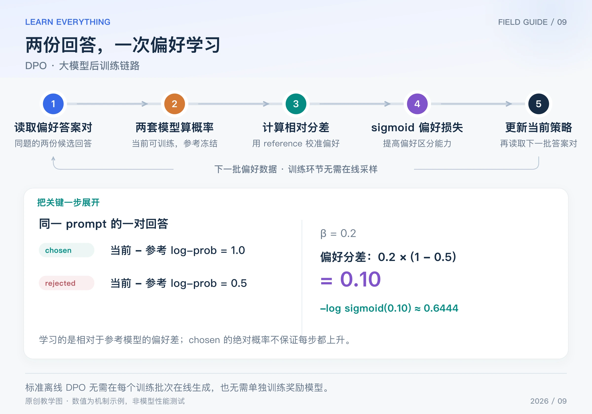

假设你已经有很多“同一个问题，两份回答，哪份更好”的数据。DPO 可以直接利用这些偏好答案对训练模型，不必在每个训练 batch 都在线生成答案、调用奖励模型，再计算 PPO 优势。

DPO 全称 Direct Preference Optimization，发表于 2023 年。它与带 KL 约束的奖励最大化有推导联系，但标准离线 DPO 的训练链路是偏好对学习。因此本系列单独介绍它，避免把它直接说成另一种在线 rollout 算法。[DPO 原论文](https://arxiv.org/abs/2305.18290)

## Table of contents

## 1 三样输入，先弄清各自职责

| 输入           | 含义               | 举例                     |
| -------------- | ------------------ | ------------------------ |
| prompt         | 同一个问题         | “解释什么是梯度下降”     |
| chosen / y-w   | 标注偏好更高的回答 | 清楚、正确，符合偏好标准 |
| rejected / y-l | 相对偏好较低的回答 | 同题下较差的另一份回答   |

chosen 和 rejected 是**相对偏好标签**。chosen 不必完美，rejected 也不一定每句话都错误。标签质量、偏好标准一致性和数据分布，都会影响训练效果。

还需要两种模型角色：可训练的当前策略，以及固定的 reference。reference 提供比较基准，不是 PPO 中记录本批在线采样来源的 old policy；标准离线 DPO 不需要每批刷新一个 old policy。

## 2 完整链路：训练时读一对答案，算四个概率



_图：原创链路图。数值展示 reference 校准后的分差 0.1 与损失约 0.6444；只有当前策略参与更新。_

1. 读取一批 `prompt / chosen / rejected` 数据。
2. 当前策略分别计算 chosen 与 rejected 的整句 log-prob，保留梯度。
3. 固定 reference 计算同样两个 log-prob；参考不变且预处理口径一致时，可以预先缓存。
4. 用当前与参考之间的相对变化，计算偏好分差，再送入 sigmoid 损失。
5. 只更新当前策略，读取下一批偏好对；另行验证偏好表现、任务能力与生成质量。

概率计算沿用数据中的回答及其前缀，不是训练时重新自由生成。通常只累计 completion 的有效 token，mask 掉 prompt 和 padding；若把求和改为长度平均，就改变了原始 DPO 的具体目标。

“训练时无需在线采样”不等于“数据从天上来”。偏好对可能先由模型生成，再经过人工或其他标注方式比较，这部分采集和审核仍然有成本。

## 3 一步一步组成 DPO 损失

先分别计算 chosen 和 rejected 相对 reference 的 log-prob 变化：

$$
d_w=\log\pi_\theta(y_w\mid x)-\log\pi_{\mathrm{ref}}(y_w\mid x),\qquad
d_l=\log\pi_\theta(y_l\mid x)-\log\pi_{\mathrm{ref}}(y_l\mid x)
$$

再形成偏好分差 m，取负的 log-sigmoid：

$$
m=\beta(d_w-d_l),\qquad
L_{\mathrm{DPO}}=-\log\sigma(m),\qquad
\sigma(m)=\frac1{1+e^{-m}}
$$

β 为正，是目标里的缩放参数，并与原始 KL 正则化推导相关。它不是 PPO 的裁剪范围；改变 β 会同时改变分差尺度和梯度行为，不能用一句“越大更新就一定越大”概括所有状态。[原论文第 4 节](https://arxiv.org/html/2305.18290v3)

用一组方便手算的整句 log-prob：

| 回答     | 当前策略 | reference | 当前减参考 |
| -------- | -------- | --------- | ---------- |
| chosen   | −2.0     | −3.0      | 1.0        |
| rejected | −2.5     | −3.0      | 0.5        |

取 β = 0.2，有 `m = 0.2 × (1 - 0.5) = 0.1`；sigmoid 约为 0.525，损失约为 0.6444。

这里 sigmoid 表示模型目标中对该偏好顺序的拟合概率，不是 chosen 的生成概率；后者由语言模型自身的 token 概率决定。

## 4 算出梯度，看看两个回答怎样参与学习

对 m 求导：

$$
\frac{\partial L}{\partial m}=\sigma(m)-1
$$

对当前策略的两项整句 log-prob 求导，则有：

$$
\frac{\partial L}{\partial\log\pi_\theta(y_w\mid x)}
=\beta(\sigma(m)-1),\qquad
\frac{\partial L}{\partial\log\pi_\theta(y_l\mid x)}
=-\beta(\sigma(m)-1)
$$

刚才 m = 0.1、β = 0.2，两个偏导约为 **−0.0950 和 +0.0950**。梯度下降因此倾向于扩大 chosen 相对 rejected 的参考校准优势。

但模型更新的是共享参数，不是两个互不相关的 log-prob。不能保证 chosen 的绝对生成概率每步都上升；DPO 的直接目标是偏好差。如果两者都下降，但 rejected 下降得更多，偏好差也可能改善。

另一个细节：初始化时如果当前策略等于 reference，那么 d-w = d-l = 0、m = 0、loss = log(2)。这**不表示没有梯度**：两项当前 log-prob 的偏导分别为 `-β/2` 与 `+β/2`。

```python
import math

beta = 0.2
current_w, current_l = -2.0, -2.5
reference_w, reference_l = -3.0, -3.0
margin = beta * (
    (current_w - reference_w) - (current_l - reference_l)
)
prob_preference = 1 / (1 + math.exp(-margin))
# log(1 + exp(-margin)) 的数值稳定写法。
loss = max(0.0, -margin) + math.log1p(math.exp(-abs(margin)))
grad_w = beta * (prob_preference - 1)
grad_l = -grad_w
print(round(margin, 4), round(loss, 4))
print(round(grad_w, 4), round(grad_l, 4))
# 0.1 0.6444
# -0.095 0.095
```

## 5 不显式训练奖励模型，为什么还和 RL 有关系

论文从带参考策略 KL 正则的奖励最大化出发，在相应假设下，最优策略与奖励存在如下对应：

$$
r(x,y)=\beta\log\frac{\pi^*(y\mid x)}{\pi_{\mathrm{ref}}(y\mid x)}
+\beta\log Z(x)
$$

Z(x) 是只依赖问题的归一化项。比较同一个问题的两个回答时，这个公共项相减抵消。将这种关系代入偏好概率模型，就能用策略的相对 log-prob 直接构造偏好损失。

对初学者最有用的理解是：原来“先拟合一个奖励模型，再用它优化策略”的关系，被改写成了一个直接关于策略的偏好学习目标。这依赖推导假设，不表示“任何 RL 问题都能直接替换为 DPO”，也不表示奖励概念消失了。

## 6 与 SFT、PPO 的区别放在同一张表里

| 对比项                    | SFT             | PPO 式在线 RL            | 标准离线 DPO       |
| ------------------------- | --------------- | ------------------------ | ------------------ |
| 核心数据                  | 期望模仿的回答  | 当前策略采样的回答及反馈 | 同题偏好答案对     |
| 主要信号                  | 目标 token      | 奖励、优势               | 参考校准后的偏好差 |
| rejected 是否进入核心损失 | 通常不进入      | 不以固定偏好对为必要输入 | 进入               |
| 每批是否需要在线 rollout  | 不需要          | 通常需要                 | 不需要             |
| 是否需要 critic           | 不需要          | 常见 PPO 配置需要        | 不需要             |
| 是否需要 reference        | 普通 SFT 不需要 | RLHF 配置常用            | 标准 DPO 使用      |

DPO 并不是“只训练 chosen 的 SFT”，也不是“把 PPO 的奖励改成 0 和 1”。它的损失同时依赖两份回答以及 reference。

## 7 什么时候偏好数据本身成了限制

固定数据集不能自动提供当前策略的新探索。模型更新之后可能生成数据中未覆盖的行为，而离线损失没有自动为这些行为获取新标签。偏好噪声、长度偏差、分布偏移和样本重复也需要单独检查。

可以在外部增加“生成新答案 → 比较 → 更新偏好数据”的迭代环节，但应明确区分这套数据循环与标准 DPO 内部的单批训练流程。选算法前，先判断你手上有什么反馈、能否在线验证、以及是否有必要训练中持续探索。

[系列导读](/posts/knowledge/llm-foundations/reinforcement-learning/00-llm-rl-roadmap/) · [上一篇：GSPO](/posts/knowledge/llm-foundations/reinforcement-learning/08-gspo/)
