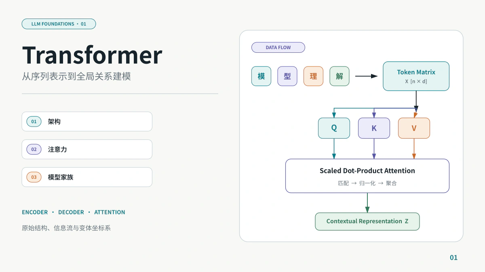
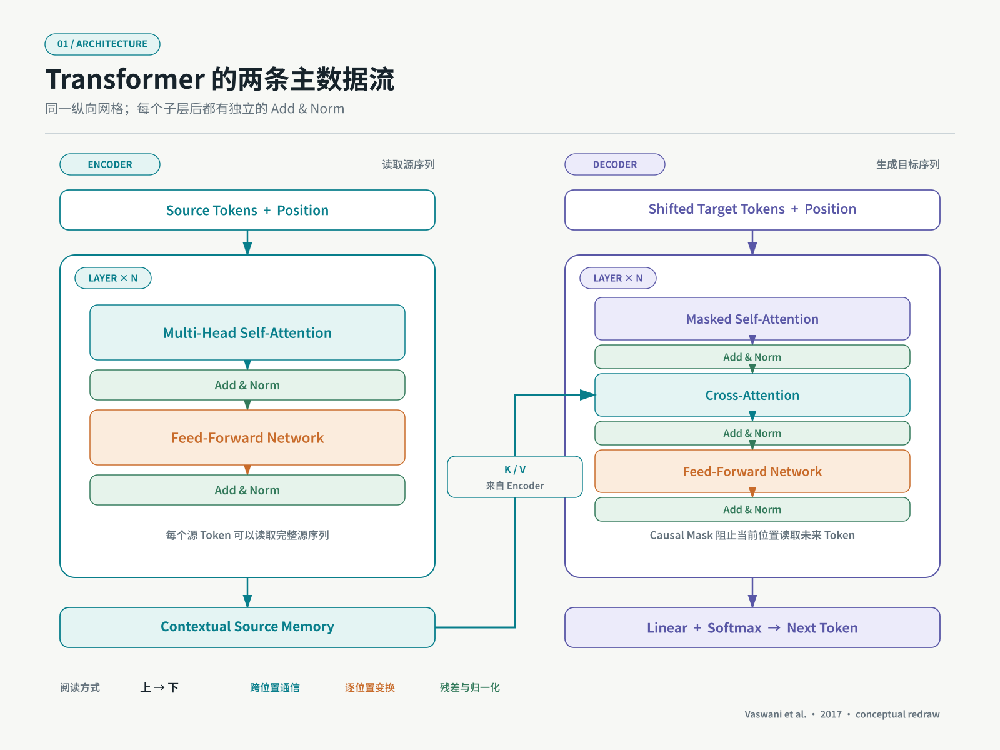
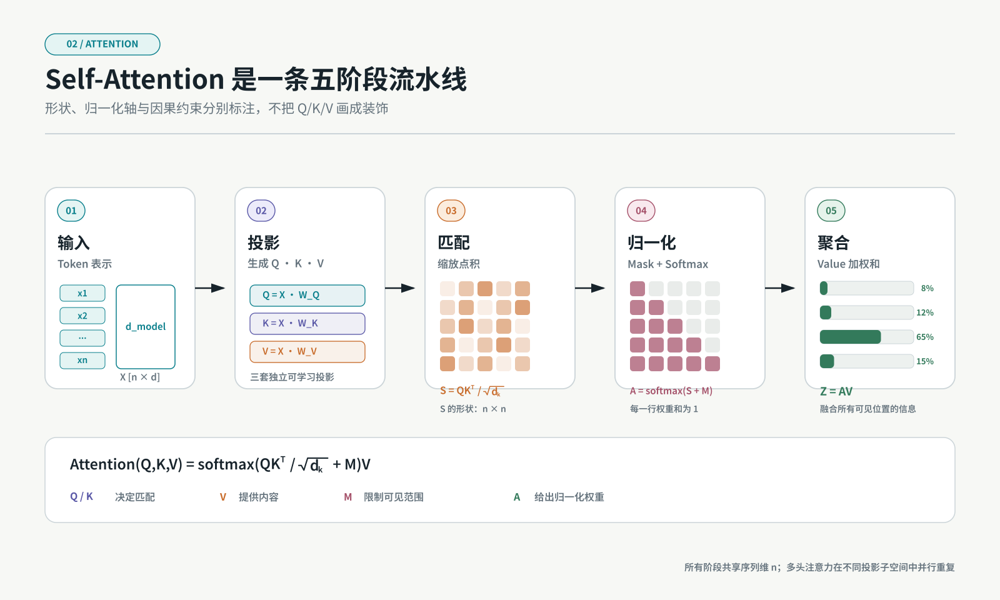
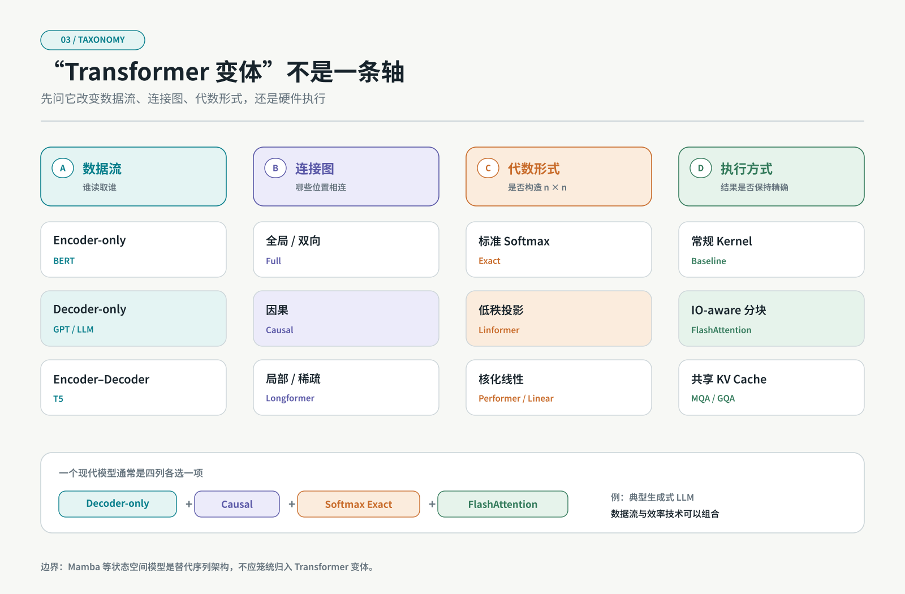

2017 年的论文 [Attention Is All You Need](https://arxiv.org/abs/1706.03762) 并不是第一次提出 Attention，也不是今天大语言模型的完整设计图。它真正关键的改变是：**把序列内部的依赖建模，从必须按时间步递推的主干中解放出来，改成可以并行计算的注意力与逐位置变换。**

这句话看起来简单，却同时改变了模型的训练方式、扩展方式和硬件效率。后来出现的 BERT、GPT、T5、ViT、Longformer、Performer 和许多现代 LLM，都可以放在这张设计地图中理解。

本文先回答五个基础问题：

1. Transformer 试图解决什么结构性问题？
2. 一组 Token 怎样穿过原始 Encoder–Decoder？
3. Self-Attention 为什么需要 Query、Key 和 Value？
4. Encoder-only、Decoder-only 与 Encoder–Decoder 有什么本质差异？
5. Linear Transformer、Sparse Attention 和 FlashAttention 分别在改变什么？

> **阅读边界**：本文负责建立整体坐标。Self-Attention 的逐步推导、RoPE、现代 Decoder 积木和 Linear Transformer 会在后续文章中分别展开。

## 一、Transformer 之前，序列为什么难处理

假设输入是一句话：

```text
模型 需要 理解 很远 的 上下文
```

序列模型至少需要解决三件事：

- 每个词如何表示；
- 一个位置怎样获取其他位置的信息；
- 模型怎样知道顺序和距离。

早期 RNN、LSTM 和 GRU 的主干计算沿时间展开：

```text
x₁ → h₁ → h₂ → h₃ → … → hₙ
           ↑
          x₂、x₃……依次进入
```

这类结构并不是“不能理解长距离”，LSTM 正是为改善长期依赖而设计；问题在于，隐藏状态 `hₜ` 依赖 `hₜ₋₁`，训练中的时间步主链很难完全并行。两个相距很远的 Token 之间，也需要经过较长的状态传播路径。

卷积序列模型可以并行，但固定大小的卷积核通常要堆叠多层，才能扩大感受野。

Transformer 采取另一种方案：

```text
任意位置 i
   ↓
直接计算它与所有位置 j 的相关性
   ↓
按相关性聚合全序列的信息
```

这就是 Self-Attention 的核心价值：在单层中，任意两个位置之间都可以建立直接信息通道。

| 结构                | 同层内的信息传播   | 时间维训练并行 | 主要代价                     |
| ------------------- | ------------------ | -------------- | ---------------------------- |
| RNN/LSTM            | 沿隐藏状态逐步传递 | 受递归依赖限制 | 长路径与串行主链             |
| 一维卷积            | 在局部窗口内传播   | 可以并行       | 需要层数扩大感受野           |
| 全局 Self-Attention | 任意位置直接交互   | 可以并行       | 注意力矩阵随序列长度二次增长 |

> Transformer 没有让“序列问题”消失。它用全局交互和并行性，换来了 `n × n` 注意力矩阵的计算与存储压力。

## 二、原始 Transformer 是一台怎样的机器

原论文解决的是机器翻译，因此完整结构包含两部分：

- **Encoder**：读取源语言，产生上下文化表示；
- **Decoder**：读取已经生成的目标 Token，并通过 Cross-Attention 查询 Encoder 输出。

下图是依据原论文结构重新设计的概念图，不是论文原图复制。阅读时沿着左、右两条数据流由上至下看，横向的 K/V 路径表示 Encoder 输出进入 Decoder 的 Cross-Attention。



_图 1：原始 Transformer 的概念重绘。左侧 Encoder 建立源序列表示；右侧 Decoder 使用因果 Self-Attention 和 Cross-Attention 逐步生成目标序列。依据 [Vaswani et al., 2017](https://arxiv.org/abs/1706.03762)。_

### 1. 输入不直接是文字

文本先被拆成 Token，并映射成向量：

```text
Token IDs
   ↓ Embedding
Token Vectors
   +
Positional Encoding
```

如果嵌入维度为 `d_model`，长度为 `n`，输入张量可以写成：

```text
X ∈ ℝⁿˣᵈ
```

原版 Transformer 使用正弦和余弦位置编码，将顺序信息加到 Token Embedding 上。原因很直接：Self-Attention 本身只看向量关系，如果不额外加入位置信息，打乱 Token 顺序不会像自然语言那样产生足够明确的结构差异。

### 2. Encoder Layer 做两类计算

每个 Encoder Layer 包含：

```text
Multi-Head Self-Attention
          ↓
Position-wise Feed-Forward Network
```

两者外面都有残差连接和 LayerNorm。

原论文使用的是后来常被称为 **Post-Norm** 的形式：

```text
LayerNorm(x + Sublayer(x))
```

现代大模型常改为 Pre-Norm 或 RMSNorm，但那不是 2017 原版架构。区分“原始 Transformer”和“现代 LLM Transformer”非常重要。

### 3. Decoder 多了两个约束

Decoder Layer 与 Encoder 不完全相同：

1. Self-Attention 使用 Causal Mask，当前位置不能看到未来 Token；
2. 增加 Cross-Attention，用 Decoder 状态查询 Encoder 输出。

因此 Decoder Layer 的主干是：

```text
Masked Self-Attention
          ↓
Cross-Attention over Encoder Output
          ↓
Feed-Forward Network
```

最后通过线性投影和 Softmax，得到下一个 Token 的概率分布。

## 三、Self-Attention 实际在做什么

Self-Attention 可以理解为一次“基于当前需求，从所有位置取回信息”的过程。

对于每个 Token 表示 `xᵢ`，模型通过三个不同的线性投影得到：

```text
Query：我正在寻找什么
Key：我可以用什么特征被匹配
Value：如果被选中，我实际提供什么信息
```

矩阵形式为：

```text
Q = XWQ
K = XWK
V = XWV
```

Scaled Dot-Product Attention 为：

```text
Attention(Q, K, V) = softmax(QKᵀ / √dₖ)V
```



_图 2：一次注意力计算的可视化。权重仅用于解释流程，不是训练实验结果。真正模型会在多个 Head、多个 Layer 中学习不同关系。_

这条公式可以拆成四步。

### 第一步：计算相关性

```text
QKᵀ
```

第 `i` 个 Query 与第 `j` 个 Key 的点积，表示位置 `i` 对位置 `j` 的匹配分数。

### 第二步：缩放

```text
QKᵀ / √dₖ
```

当 Key 维度增大时，点积的幅度也容易增大，使 Softmax 进入梯度很小的饱和区域。除以 `√dₖ` 用于控制分数尺度。

### 第三步：归一化

```text
softmax(...)
```

每个 Query 对所有 Key 得到一组和为 1 的权重。

### 第四步：聚合 Value

```text
Attention Weights × V
```

输出不是复制某一个 Token，而是所有 Value 的加权组合。

> Q 和 K 决定“向哪里取信息”，V 决定“取回什么信息”。把三者分开，允许模型学习匹配空间与内容空间的不同投影。

## 四、为什么还要 Multi-Head

一次 Attention 只有一套投影空间。Multi-Head Attention 将特征拆到多个子空间中分别计算：

```text
headᵢ = Attention(QWᵢQ, KWᵢK, VWᵢV)

MultiHead(Q,K,V) = Concat(head₁, …, headₕ)WO
```

直觉上，不同 Head 可以学习不同类型的关系，例如局部搭配、指代关系、结构边界或位置模式。但不能简单断言“某个 Head 永远等于某种语法关系”：Head 的功能是训练得到的，可能混合、冗余，也可能随层次变化。

原论文的 Base 模型使用：

```text
d_model = 512
h = 8
每个 Head 的 dₖ = dᵥ = 64
```

拼接 8 个 Head 后，维度重新回到 512。

## 五、Attention 之后为什么还要 FFN

Attention 的任务是**跨位置混合信息**。Feed-Forward Network 则对每个位置独立地做非线性特征变换：

```text
FFN(x) = max(0, xW₁ + b₁)W₂ + b₂
```

原版使用 ReLU，内部维度从 `512` 扩展到 `2048` 再投影回来。

可以用一句话区分：

```text
Attention：Token 与 Token 之间交换信息
FFN：每个 Token 内部变换和提炼特征
```

现代 LLM 中，FFN 往往占据大量参数，并常被 SwiGLU 等门控结构替代。MoE 则进一步把单个 FFN 替换成多个专家，并让每个 Token 只路由到少数专家。

## 六、残差、归一化与位置编码不是配角

只记住 Attention，容易漏掉 Transformer 能够堆深的另外几条路径。

### 残差连接

```text
x + Sublayer(x)
```

它为信息和梯度提供直接通道，使子层不必每次重写完整表示。

### 归一化

LayerNorm 控制单个样本特征维度上的统计尺度。原始 Transformer 使用 Post-Norm；许多现代 LLM 使用 Pre-Norm 或 RMSNorm，以改善深层训练稳定性和工程效率。

### 位置表示

没有位置机制时，Attention 更接近对集合的处理。常见路线包括：

- 原始正弦位置编码；
- 可学习绝对位置嵌入；
- 相对位置表示；
- RoPE 旋转位置编码；
- ALiBi 位置偏置。

它们不仅决定模型“知不知道顺序”，也会影响长度外推和长上下文行为。

## 七、从原始 Transformer 到三大模型家族

今天说“一个 Transformer 模型”时，可能指完全不同的数据流。最常见的第一层分类是：Encoder-only、Decoder-only 和 Encoder–Decoder。



_图 3：四列分别描述数据流、连接图、代数形式和执行方式。它们是可以组合的正交维度：一个 Decoder-only 模型也可以同时采用因果注意力、GQA 和 FlashAttention。_

### 1. Encoder-only

代表路线：BERT。

```text
完整输入
  ↓ 双向 Self-Attention
每个位置的上下文化表示
```

适合需要理解完整输入的表示学习、分类、抽取和编码任务。BERT 的经典预训练目标包含 Masked Language Modeling。

### 2. Decoder-only

代表路线：GPT 以及多数生成式大语言模型。

```text
已有 Token
  ↓ Causal Self-Attention
预测下一个 Token
```

每个位置只能看到它左侧和当前位置。统一的 Next-token Prediction 可以自然支持开放式生成，也方便把任务表示成文本续写。

### 3. Encoder–Decoder

代表路线：原始 Transformer、T5。

```text
Encoder：理解输入
Decoder：条件生成输出
```

它天然适合翻译、摘要和“输入序列到输出序列”的任务。Decoder 通过 Cross-Attention 读取 Encoder 表示。

这三种结构回答的是：

> 模型允许哪些 Token 互相看到，以及输入和输出通过怎样的数据流连接。

它们不是 Attention 优化方法。

## 八、所谓“Transformer 变体”至少有五条路线

把所有后续工作都称为“改进 Transformer”，很容易失去坐标。更清楚的做法是按它们改变的对象分类。

### 路线 1：改变可见范围

例如局部和稀疏 Attention：

```text
全局：每个 Token 看所有 Token
局部：只看相邻窗口
稀疏：局部窗口 + 少量全局连接
```

Longformer 是这一方向的代表之一。它通过局部窗口与任务相关的全局 Attention，面向长文档降低全局注意力成本。

### 路线 2：改变跨段记忆

Transformer-XL 引入 segment-level recurrence，让后一个片段复用前一个片段的隐藏状态，并结合相对位置编码处理跨段依赖。

这不是简单扩大单次 Attention 矩阵，而是在片段之间传递可复用记忆。

### 路线 3：近似或重写 Attention

这一类包括：

- Linformer：沿序列维进行低秩投影；
- Reformer：使用局部敏感哈希等机制；
- Performer：使用随机特征近似 Softmax Attention；
- Linear Transformer：使用核特征映射并改变矩阵乘法顺序。

它们试图避免显式构造完整的 `n × n` 注意力矩阵，但近似假设、数值稳定性、因果计算方式和实际硬件效率各不相同。

### 路线 4：不改变数学结果，优化执行

FlashAttention 是最容易被误分类的例子。

它属于 IO-aware 的精确 Attention 算法：通过分块计算和减少高带宽显存读写，提高速度、降低内存占用。它通常仍然计算标准 Attention，而不是 Linear Attention 的核近似。

因此：

```text
Linear Attention：改变计算形式或近似族
FlashAttention：主要改变标准 Attention 的执行方式
```

### 路线 5：改变 Transformer Block 的其他组件

现代 LLM 的常见变化还包括：

```text
Post-Norm → Pre-Norm / RMSNorm
正弦位置 → RoPE
ReLU FFN → GELU / SwiGLU
Multi-Head Attention → MQA / GQA
Dense FFN → Mixture of Experts
```

这些变化未必减少 Attention 的序列复杂度，却深刻影响训练稳定性、模型质量、KV Cache 大小和推理吞吐。

## 九、Linear Transformer 到底“线性”在哪里

标准 Attention 的核心中间量是：

```text
QKᵀ ∈ ℝⁿˣⁿ
```

序列长度为 `n` 时，它显式描述每对 Token 的关系，因此时间和显存通常包含关于 `n²` 的项。

Linear Attention 的一类典型思路是，把相似度写成可分解的核形式：

```text
sim(q, k) ≈ φ(q)ᵀφ(k)
```

忽略归一化项时，可以利用乘法结合律，将：

```text
(φ(Q)φ(K)ᵀ)V
```

改写为：

```text
φ(Q)(φ(K)ᵀV)
```

完整的归一化输出可以按位置写成：

```text
                φ(qᵢ)ᵀ Σⱼ φ(kⱼ)vⱼᵀ
Attentionᵢ = ───────────────────────
                   φ(qᵢ)ᵀ Σⱼ φ(kⱼ)
```

其中分子维护 Key–Value 的聚合状态，分母维护归一化状态；因果场景则只累计 `j ≤ i` 的前缀。这样就不必显式生成完整的 `n × n` Attention Matrix。在特征维度固定的分析下，计算可以随序列长度近似线性增长。

但“线性”不代表无条件更好：

- 它可能不再与标准 Softmax Attention 完全等价；
- 性能受特征映射维度影响；
- 因果场景需要前缀累计状态；
- 短序列和现代 GPU 上，理论复杂度不直接等于实际更快；
- 全局精确检索能力可能受到近似或状态压缩约束。

后续的 Linear Transformer 专文会把标准 Attention 与核化 Attention 放到相同张量形状下推导，并实现一个可运行的因果前缀版本。

## 十、为什么 Transformer 能扩展成大模型

Transformer 的成功不能只归因于 Attention。至少有五个因素共同作用：

1. **训练并行性**：同一层的序列位置可以批量计算；
2. **短信息路径**：全局 Attention 允许位置间直接交互；
3. **统一积木**：Attention、FFN、残差和归一化可以规则堆叠；
4. **硬件匹配**：主要计算可以转化为大规模矩阵乘法；
5. **目标统一**：Decoder-only 模型可以通过下一 Token 预测吸收大规模无标注文本。

但它同样留下了今天仍在解决的问题：

- 长上下文中的二次成本；
- KV Cache 对显存的占用；
- 长距离信息能否被有效利用，而不仅是“放得进去”；
- 训练数据质量、对齐与事实可靠性；
- 参数规模、激活内存和通信成本。

## 十一、四个常见误区

### 误区 1：Transformer 就是 Attention

不是。完整 Block 还包括 FFN、残差、归一化和位置机制。现代 LLM 中 FFN 往往占据非常大的参数比例。

### 误区 2：所有 Transformer 都有 Encoder 和 Decoder

不是。多数生成式 LLM 使用 Decoder-only 架构，不包含原始翻译模型中的独立 Encoder 和 Cross-Attention。

### 误区 3：Linear Transformer 就是把层换成线性层

不是。“Linear”通常指序列长度维度的计算或内存复杂度接近线性，核心往往是避免显式构造 `n × n` 注意力矩阵。

### 误区 4：FlashAttention 是一种近似 Attention

不是。FlashAttention 的核心贡献是 IO-aware 的精确计算，在有限片上存储中分块完成标准 Attention，避免物化完整中间矩阵。

## 十二、建立一张长期有用的判断表

遇到一个新的 Transformer 论文或模型时，可以依次问：

| 问题                     | 可能答案                                      |
| ------------------------ | --------------------------------------------- |
| 它属于哪种数据流？       | Encoder-only / Decoder-only / Encoder–Decoder |
| Token 能看到哪些位置？   | 双向 / 因果 / 局部 / 稀疏 / 全局              |
| 位置怎样表示？           | 绝对位置 / 相对位置 / RoPE / Bias             |
| Attention 是否保持精确？ | 标准精确 / 低秩 / 核近似 / 哈希或稀疏         |
| 优化的是复杂度还是 IO？  | 算法复杂度 / 显存 / 带宽 / Kernel 融合        |
| FFN 怎样实现？           | Dense / Gated / MoE                           |
| 推理状态是什么？         | KV Cache / 递归 Memory / 线性前缀状态         |

如果这七个问题能够回答，大多数“新 Transformer”就不再是一串陌生名称，而是坐标系中的具体选择。

## 十三、小结

Transformer 的核心不是一句“Attention Is All You Need”，而是一组配合工作的结构决策：

```text
Token Embedding + Position
          ↓
Attention 负责跨位置通信
          ↓
FFN 负责逐位置非线性变换
          ↓
Residual + Normalization 支撑深层训练
          ↓
Mask 与 Cross-Attention 决定数据流
```

原始 Encoder–Decoder 只是起点。后来的模型沿着数据流、位置表示、Attention 复杂度、Block 组件和专家路由等方向不断演化。

下一篇将只聚焦一个问题：

> `QKᵀ / √dₖ` 为什么能够表示相关性，Mask、Softmax 和 Multi-Head 又分别改变了什么？

我们会用一个可以手算的小矩阵，从输入向量开始完整走完一次 Self-Attention。

## 参考资料

1. Vaswani et al., [Attention Is All You Need](https://arxiv.org/abs/1706.03762), 2017.
2. Rush, [The Annotated Transformer](https://nlp.seas.harvard.edu/annotated-transformer/), Harvard NLP.
3. Devlin et al., [BERT: Pre-training of Deep Bidirectional Transformers for Language Understanding](https://arxiv.org/abs/1810.04805), 2018.
4. Raffel et al., [Exploring the Limits of Transfer Learning with a Unified Text-to-Text Transformer](https://arxiv.org/abs/1910.10683), 2019.
5. Dai et al., [Transformer-XL: Attentive Language Models Beyond a Fixed-Length Context](https://arxiv.org/abs/1901.02860), 2019.
6. Beltagy et al., [Longformer: The Long-Document Transformer](https://arxiv.org/abs/2004.05150), 2020.
7. Katharopoulos et al., [Transformers are RNNs: Fast Autoregressive Transformers with Linear Attention](https://arxiv.org/abs/2006.16236), 2020.
8. Choromanski et al., [Rethinking Attention with Performers](https://arxiv.org/abs/2009.14794), 2020.
9. Wang et al., [Linformer: Self-Attention with Linear Complexity](https://arxiv.org/abs/2006.04768), 2020.
10. Kitaev et al., [Reformer: The Efficient Transformer](https://arxiv.org/abs/2001.04451), 2020.
11. Dao et al., [FlashAttention: Fast and Memory-Efficient Exact Attention with IO-Awareness](https://arxiv.org/abs/2205.14135), 2022.
