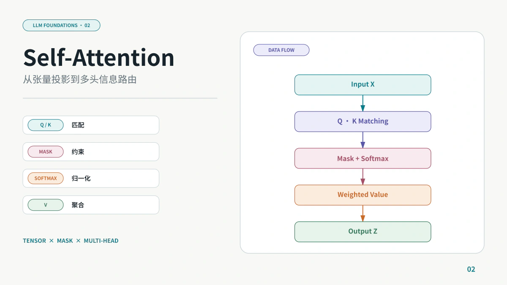
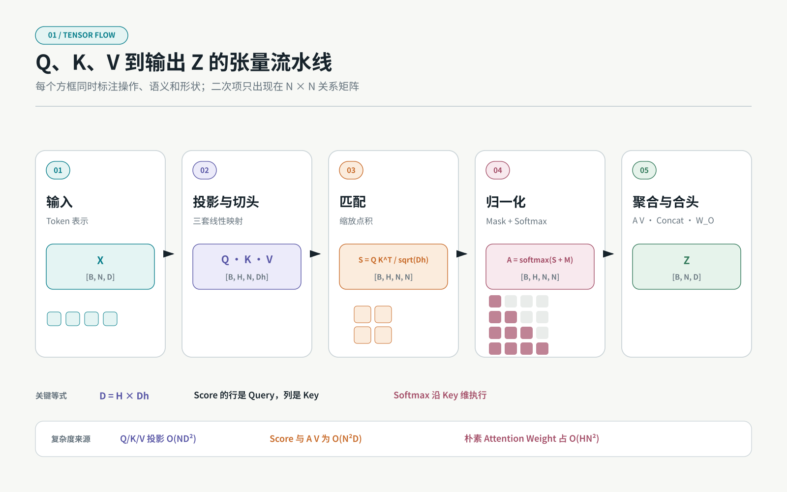
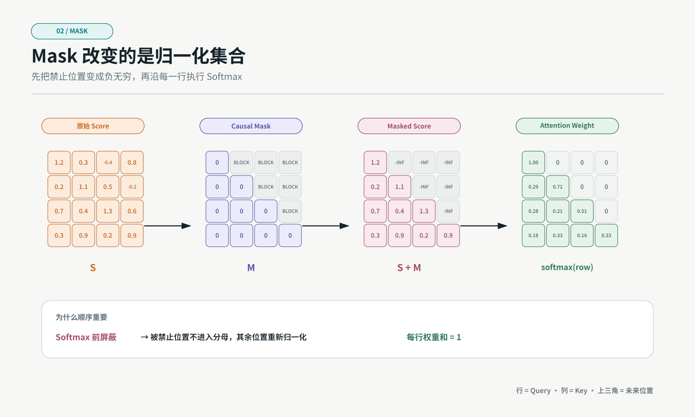
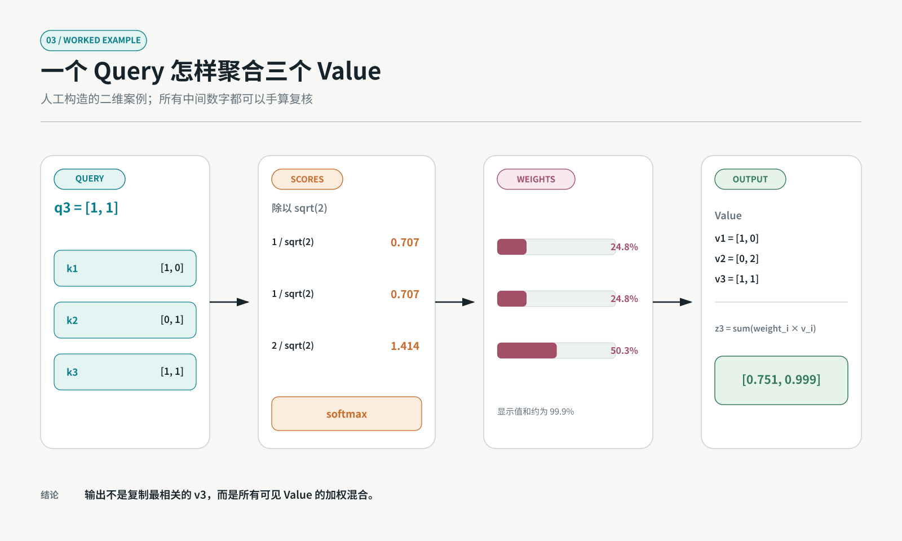
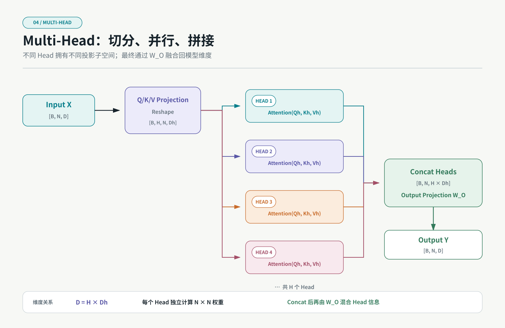

上一篇建立了 Transformer 的整体坐标，这一篇只深入一件事：**一组 Token 表示进入 Attention 后，究竟经历了哪些张量变换？**

Attention 经常被解释成“给重要的词更高权重”，但这句话隐藏了很多关键细节：

- “重要”是相对于哪个 Query 而言？
- Q、K、V 为什么不能直接使用同一个向量？
- Softmax 沿哪一维计算？
- Causal Mask 应该在 Softmax 前还是后加入？
- Multi-Head 是复制多份 Attention，还是切分特征维度？
- 训练时一次处理完整序列，为什么推理时还需要 KV Cache？

本文会从张量形状开始，完整走过一次 Scaled Dot-Product Attention，再扩展到 Multi-Head、Cross-Attention 与自回归推理。

> **符号约定**：`B` 表示 Batch Size，`N` 表示序列长度，`D` 表示模型维度，`H` 表示 Head 数量，`Dh = D / H` 表示每个 Head 的维度。

## 一、Attention 不是一个分数，而是一条数据流水线

一次标准 Self-Attention 可以写成：

```text
Q = X W_Q
K = X W_K
V = X W_V

S = Q K^T / sqrt(Dh)
A = softmax(S + M)
Z = A V
```

其中：

- `X` 是输入 Token 表示；
- `S` 是每个 Query 与每个 Key 的匹配分数；
- `M` 是可选 Mask；
- `A` 是归一化后的注意力权重；
- `Z` 是聚合 Value 后的上下文表示。



_图 1：单个 Attention Head 的完整数据流。矩阵形状明确说明了二次项产生在 `N × N` 的 Score 和 Weight，而不是所有步骤都具有二次复杂度。_

这条流水线可以分成三个问题：

1. 用什么空间描述“我要找什么”和“我有什么”？
2. 怎样把匹配分数变成合法权重？
3. 怎样根据权重取回真正的信息？

Q、K、V 分别回答这三个问题。

## 二、为什么需要 Query、Key 和 Value

假设 Token `x_i` 同时包含词义、位置、句法和上下文特征。如果直接用 `x_i · x_j` 计算相似度，匹配条件与被取回内容会被绑定在同一个空间里。

Transformer 使用三套可学习投影：

```text
q_i = x_i W_Q
k_i = x_i W_K
v_i = x_i W_V
```

可以用检索系统类比：

| 名称  | 检索类比 | 在 Attention 中的职责     |
| ----- | -------- | ------------------------- |
| Query | 搜索条件 | 当前 Token 想寻找什么     |
| Key   | 索引字段 | 当前 Token 可以怎样被匹配 |
| Value | 文档内容 | 被匹配后真正返回什么      |

关键在于：**匹配空间与内容空间被解耦。**

两个 Token 可以在 Q/K 空间中高度匹配，但返回的 V 不必等于用于匹配的 K。这让模型能够学习类似“用代词特征寻找名词，但取回名词的语义表示”这样的变换。

### Self-Attention 的“Self”是什么意思

Self-Attention 中三者来自同一个输入：

```text
Q = X W_Q
K = X W_K
V = X W_V
```

“Self”不是说某个 Token 只关注自己，而是说 Query、Key 和 Value 都来自同一组序列表示。

### Cross-Attention 有什么不同

在 Encoder–Decoder Transformer 中：

```text
Q = Y W_Q          # Decoder 当前状态
K = X_enc W_K      # Encoder 输出
V = X_enc W_V      # Encoder 输出
```

Decoder 用自己的状态提出 Query，到 Encoder Memory 中匹配 Key 并取回 Value。

因此 Self-Attention 和 Cross-Attention 使用同一个计算公式，区别在于 Q、K、V 的来源。

## 三、从输入 X 到 Q、K、V 的张量形状

先忽略 Batch 和 Multi-Head，假设：

```text
X:   [N, D]
W_Q: [D, Dh]
W_K: [D, Dh]
W_V: [D, Dv]
```

投影后：

```text
Q: [N, Dh]
K: [N, Dh]
V: [N, Dv]
```

计算：

```text
Q K^T: [N, Dh] × [Dh, N] = [N, N]
```

Score Matrix 的含义是：

```text
行 i：第 i 个 Query
列 j：第 j 个 Key
S[i,j]：位置 i 对位置 j 的匹配分数
```

这也是理解 Softmax 轴的关键：对每一个 Query，应该在它可以访问的所有 Key 上归一化，所以 Softmax 沿最后一个维度，也就是 Key 维度执行。

```python
weights = torch.softmax(scores, dim=-1)
```

每一行满足：

```text
sum_j A[i,j] = 1
```

但不同 Query 的两行之间不需要归一化，也不要求注意力矩阵对称。

> 即使 `Q = K`，Softmax 的逐行归一化也可能让最终 Attention Weight 不对称；实际模型通常还有不同的 Q、K 投影。

## 四、为什么除以 sqrt(Dh)

如果 Query 和 Key 每个分量近似独立、均值为 0、方差为 1，那么点积：

```text
q · k = sum_{r=1}^{Dh} q_r k_r
```

由 `Dh` 个项相加，方差会随 `Dh` 增长到约 `Dh`，标准差约为 `sqrt(Dh)`。

维度越大，未经缩放的点积绝对值越容易变大。大幅度 Logit 进入 Softmax 后，输出会非常接近 one-hot：

```text
softmax([0.2, 0.5, 0.8])     → 相对平滑
softmax([2, 5, 8])           → 高度尖锐
softmax([20, 50, 80])        → 接近完全饱和
```

Softmax 进入饱和区域后，除最大项外的梯度会很小。

因此标准 Attention 使用：

```text
S = Q K^T / sqrt(Dh)
```

缩放的目标不是改变哪个 Key 最大，而是让分数尺度在不同 Head Dimension 下更稳定。

## 五、Mask 必须在 Softmax 之前应用

Mask 的作用不是把输出权重“看起来变成零”，而是让被禁止位置不参与概率归一化。

通常做法是：

```text
scores[masked_position] = -infinity
weights = softmax(scores)
```

因为：

```text
exp(-infinity) = 0
```

所以被屏蔽位置的权重严格为零，其余合法位置重新归一化。



_图 2：Causal Mask 在 Softmax 前加入。每一行代表一个 Query，每一列代表一个 Key；上三角位置属于未来 Token，因此不参与当前行归一化。_

### Causal Mask

自回归生成中，第 `i` 个位置只能看到：

```text
j <= i
```

四个 Token 的可见性为：

```text
      Key 1  Key 2  Key 3  Key 4
Q1      ✓      ×      ×      ×
Q2      ✓      ✓      ×      ×
Q3      ✓      ✓      ✓      ×
Q4      ✓      ✓      ✓      ✓
```

### Padding Mask

Batch 中句子长度不同时，短句通常会补 Padding。Padding Key 不应被任何 Query 读取，因此需要在对应列上屏蔽。

### 两种 Mask 可以叠加

Decoder 训练时经常同时使用：

```text
Final Mask = Causal Mask OR Padding Mask
```

### 为什么不能在 Softmax 后直接乘零

假设原权重是：

```text
[0.2, 0.3, 0.5]
```

Softmax 后再把第三项乘零：

```text
[0.2, 0.3, 0.0]
```

剩余权重和只有 `0.5`，不再是合法归一化分布。虽然可以再次除以总和，但这等价于重新归一化，也更容易在数值和实现上出错。

## 六、Softmax 后为什么乘 V

对于第 `i` 个 Query，输出是：

```text
z_i = sum_j A[i,j] v_j
```

这表示 `z_i` 是所有可见 Value 的加权和。

需要特别注意：

- Attention Weight 是标量；
- Value 是向量；
- 输出仍然是向量；
- 每一个 Query 都得到自己的输出向量。

矩阵形式：

```text
A: [N, N]
V: [N, Dv]
Z: [N, Dv]
```

因此：

```text
Z = A V
```

Attention Matrix 决定跨位置的信息路由，Value Matrix 提供真正被路由的内容。

## 七、用一个可手算案例走完整流程

设序列只有三个 Token，每个 Head 的维度为 2。为了集中观察聚合过程，取：

```text
Q = [[1,0],
     [0,1],
     [1,1]]

K = [[1,0],
     [0,1],
     [1,1]]

V = [[1,0],
     [0,2],
     [1,1]]
```

现在只计算第三个 Query：

```text
q_3 = [1,1]
```

### 1. 与三个 Key 点积

```text
q_3 · k_1 = 1
q_3 · k_2 = 1
q_3 · k_3 = 2
```

### 2. 除以 sqrt(2)

```text
scores ≈ [0.707, 0.707, 1.414]
```

### 3. 计算 Softmax

```text
weights ≈ [0.248, 0.248, 0.503]
```

由于四舍五入，三项显示值之和约为 `0.999`；使用完整精度时总和为 1。

### 4. 聚合 Value

```text
z_3
= 0.248 × [1,0]
+ 0.248 × [0,2]
+ 0.503 × [1,1]

≈ [0.751, 0.999]
```



_图 3：这是人工构造的教学案例，不是模型训练得到的权重。它展示了一个 Query 如何通过三个标量权重聚合三个 Value Vector。_

这个案例说明，第三个 Query 最关注第三个 Token，但输出并不是复制 `v_3`，而是三个 Value 的混合。

## 八、Multi-Head Attention 怎样组织张量

真实 Transformer 不只运行一个 Head。

输入：

```text
X: [B, N, D]
```

经过一次大的线性投影，或者三次独立投影后，通常会 reshape 为：

```text
Q: [B, H, N, Dh]
K: [B, H, N, Dh]
V: [B, H, N, Dh]
```

其中：

```text
D = H × Dh
```

每个 Head 独立计算：

```text
A_h = softmax(Q_h K_h^T / sqrt(Dh) + M)
Z_h = A_h V_h
```

随后：

```text
Concat(Z_1, Z_2, ..., Z_H): [B, N, D]
```

最后经过输出投影：

```text
Y = Concat(Z_1, ..., Z_H) W_O
```



_图 4：Multi-Head 不是把完整维度无代价复制 H 次，而是通常把模型维度切分到 H 个 Head，再并行计算、拼接并经过输出投影。_

### 为什么多头可能比单头更有表达力

不同 Head 拥有不同的投影参数：

```text
W_Q^h, W_K^h, W_V^h
```

因此它们可以在不同表示子空间中建立路由关系。一个 Head 的高权重位置，不要求与另一个 Head 相同。

但需要避免过度解释：

- Head 不一定稳定对应“语法”“指代”等人类概念；
- 不同 Head 可能冗余；
- 某些 Head 可以被裁剪而质量变化很小；
- 可视化 Attention Weight 不等于完整解释模型决策。

## 九、MHA、MQA 和 GQA 有什么区别

标准 Multi-Head Attention（MHA）中，每个 Query Head 都有自己的 K 和 V Head：

```text
Query Heads: H
Key Heads:   H
Value Heads: H
```

Multi-Query Attention（MQA）让多个 Query Head 共享一组 K/V：

```text
Query Heads: H
Key Heads:   1
Value Heads: 1
```

Grouped-Query Attention（GQA）位于两者之间：

```text
Query Heads: H
Key/Value Groups: G，且 1 < G < H
```

主要收益出现在自回归推理：K/V Head 更少意味着 KV Cache 更小、读取带宽更低。代价是共享程度增加可能影响模型质量，因此 GQA 常被用作质量与推理效率之间的折中。

> MQA/GQA 改变的是 Q Head 与 KV Head 的组织方式，不改变 Scaled Dot-Product Attention 的基本语义。

## 十、训练和推理为什么不一样

### 训练：一次计算整段序列

Teacher Forcing 下，完整目标序列已知，只需用 Causal Mask 阻止未来信息泄漏。

因此一层可以并行计算：

```text
Q, K, V: [B, H, N, Dh]
Scores:  [B, H, N, N]
```

虽然具有因果约束，但不是必须像 RNN 那样按 Token 逐步训练。

### 推理：一次通常只产生一个新 Token

已经生成 `N` 个 Token 后，下一个 Decode Step 只产生一条新 Query、Key 和 Value：

```text
q_new: [B, H, 1, Dh]
k_new: [B, Hkv, 1, Dh]
v_new: [B, Hkv, 1, Dh]
```

历史 Token 的 K/V 不需要重复计算，因此保存为 KV Cache：

```text
K_cache: [B, Hkv, N, Dh]
V_cache: [B, Hkv, N, Dh]
```

新 Query 与整个 `K_cache` 匹配，再从 `V_cache` 聚合信息。

这带来两个事实：

1. KV Cache 避免重复计算历史 K/V；
2. Cache 会随序列长度线性增长，并在长上下文推理中占据大量显存和内存带宽。

因此 MQA、GQA、PagedAttention 和 KV Cache 量化主要属于推理系统优化，而不是重新定义 Attention 的基本公式。

## 十一、Attention 的复杂度应该怎样看

一句“Attention 是 O(N²)”并不完整。设模型维度为 `D`：

| 步骤       | 主要时间复杂度 | 主要中间形状 |
| ---------- | -------------- | ------------ |
| Q/K/V 投影 | `O(ND²)`       | `[N,D]`      |
| Score 计算 | `O(N²D)`       | `[H,N,N]`    |
| Softmax    | `O(HN²)`       | `[H,N,N]`    |
| Value 聚合 | `O(N²D)`       | `[H,N,Dh]`   |
| 输出投影   | `O(ND²)`       | `[N,D]`      |

当 `N` 较短、`D` 很大时，线性投影和 FFN 也可能占据大量计算；当上下文很长时，`N²` 项会越来越突出。

还要区分：

- **计算复杂度**：做多少乘加；
- **激活内存**：是否物化 `N × N` 中间矩阵；
- **显存 IO**：数据在 HBM 与片上存储之间搬运多少次；
- **推理 KV Cache**：长期保存多少 K/V 状态。

FlashAttention 主要优化显存 IO 与中间激活存储，并保持标准 Attention 结果；Linear Attention 则通过改变代数形式避免显式 `N × N` 关系矩阵。两者不能只因为“都更快”而归为一类。

## 十二、一个最小但正确的实现

下面的 PyTorch 风格函数展示单次 Scaled Dot-Product Attention：

```python
import math
import torch


def scaled_dot_product_attention(q, k, v, allowed=None):
    """
    q: [B, H, Nq, Dh]
    k: [B, H, Nk, Dh]
    v: [B, H, Nk, Dv]
    allowed: 可广播到 [B, H, Nq, Nk] 的布尔张量
             True 表示允许读取，False 表示屏蔽
    """
    scores = q @ k.transpose(-2, -1)
    scores = scores / math.sqrt(q.size(-1))

    if allowed is not None:
        scores = scores.masked_fill(~allowed, float("-inf"))

    weights = torch.softmax(scores, dim=-1)
    output = weights @ v
    return output, weights
```

生产实现还需要处理：

- Attention Dropout；
- 混合精度；
- 全行被 Mask 时的 NaN；
- Fused Kernel；
- KV Head 与 Query Head 的广播；
- 分布式并行；
- 不同设备后端。

实际项目应优先使用框架提供的优化实现，例如 PyTorch 的 [`scaled_dot_product_attention`](https://docs.pytorch.org/docs/stable/generated/torch.nn.functional.scaled_dot_product_attention.html)，让运行时根据设备和输入选择可用 Kernel。

## 十三、数值稳定性容易出错的地方

### 1. Softmax 前减去最大值

稳定实现会使用：

```text
softmax(x) = exp(x - max(x)) / sum(exp(x - max(x)))
```

减去同一个常数不改变 Softmax 结果，却能降低指数溢出风险。

### 2. Mask 的负数必须足够小

概念上使用 `-infinity`。实际低精度 Kernel 可能使用数据类型可表示的极小值，但必须确保被屏蔽位置的指数贡献为零。

### 3. 避免整行全部被屏蔽

如果一整行都是 `-infinity`，Softmax 会出现未定义的 `0/0`，可能产生 NaN。Padding、序列切分和特殊 Token 逻辑需要保证每个有效 Query 至少存在一个可见 Key，或者对全 Mask 行单独处理。

### 4. 不要把 Attention Weight 当概率预测

每行权重和为 1，只说明它是 Value 聚合系数。它不是词表概率，也不直接等于模型对事实的置信度。

## 十四、怎样阅读一个新的 Attention 变体

遇到新方法时，可以按下面顺序检查：

1. Q、K、V 来自哪里？
2. 每个 Query 可以读取哪些 Key？
3. 是否仍显式构造 `N × N` Score？
4. 相似度仍是 Softmax Dot-Product 吗？
5. 归一化是否改变？
6. 因果场景怎样维护历史状态？
7. 优化的是 FLOPs、激活内存、KV Cache，还是显存 IO？
8. 结果是精确等价、受控近似，还是新的 Attention 定义？

这组问题可以区分很多容易混淆的名称：

```text
Sparse Attention：改变连接图
Linear Attention：改变代数形式或相似度族
FlashAttention：改变精确 Attention 的执行方式
MQA / GQA：改变 Query Head 与 KV Head 的组织
Cross-Attention：改变 Q 与 K/V 的来源
```

## 十五、小结

Self-Attention 的完整逻辑可以压缩成一句话：

> 每个 Query 先与允许访问的 Key 计算缩放匹配分数，再经过 Mask 和逐行 Softmax 得到权重，最后用这些权重聚合 Value。

真正需要记住的不是一条孤立公式，而是它的张量语义：

```text
X [B,N,D]
  ↓ 可学习投影与多头 reshape
Q/K/V [B,H,N,Dh]
  ↓ Query–Key 匹配
Scores [B,H,N,N]
  ↓ Mask + row-wise Softmax
Weights [B,H,N,N]
  ↓ 加权聚合 Value
Heads [B,H,N,Dh]
  ↓ Concat + W_O
Output [B,N,D]
```

下一篇将继续回答：没有递归和卷积时，Transformer 怎样通过正弦位置编码、相对位置、RoPE 与 ALiBi 表示顺序和距离？

## 参考资料

1. Vaswani et al., [Attention Is All You Need](https://arxiv.org/abs/1706.03762), 2017.
2. Rush, [The Annotated Transformer](https://nlp.seas.harvard.edu/annotated-transformer/), Harvard NLP.
3. PyTorch, [`torch.nn.functional.scaled_dot_product_attention`](https://docs.pytorch.org/docs/stable/generated/torch.nn.functional.scaled_dot_product_attention.html).
4. Shazeer, [Fast Transformer Decoding: One Write-Head is All You Need](https://arxiv.org/abs/1911.02150), 2019.
5. Ainslie et al., [GQA: Training Generalized Multi-Query Transformer Models from Multi-Head Checkpoints](https://arxiv.org/abs/2305.13245), 2023.
6. Dao et al., [FlashAttention: Fast and Memory-Efficient Exact Attention with IO-Awareness](https://arxiv.org/abs/2205.14135), 2022.
7. Jain and Wallace, [Attention is not Explanation](https://arxiv.org/abs/1902.10186), 2019.
