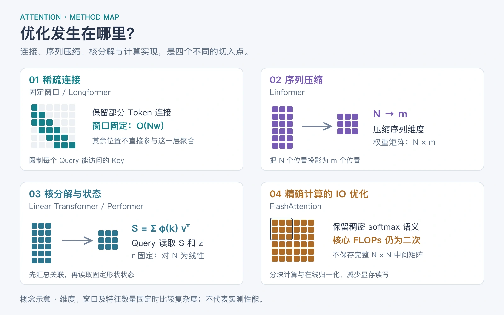
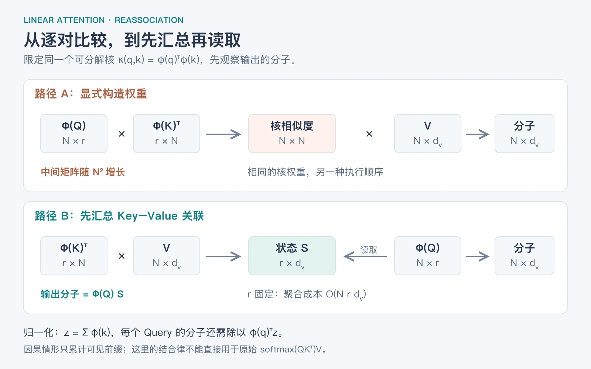

## 1 从标准 Attention 的代价出发

在[上一篇 Self-Attention 详解](https://bailixisu.com/posts/knowledge/llm-foundations/transformer/02-self-attention-deep-dive)中，我们已经走过了 Q、K、V 的完整数据流。这一篇继续往下走：假设你已经理解 Q、K、V 和 causal mask，现在要回答的是——当序列越来越长，模型还能怎样交换信息？重点放在线性注意力，并用稀疏、低秩和 FlashAttention 建立对照。它是一条代表方法的学习路线，不是按发布时间排列的论文大全。

先忽略 batch 和多头。令序列长度为 N，Query/Key 维度为 d，Value 维度为 dᵥ。Q、K 的形状是 N×d，V 是 N×dᵥ。标准注意力为：

$$
O=\operatorname{softmax}\!\left(\frac{QK^\top}{\sqrt d}+M\right)V
$$

每个 Query 都要和可见的 Key 比较。稠密注意力的两个矩阵乘法共需要 O(N²d + N²dᵥ) 的计算；朴素实现还会存下 N×N 的分数或权重矩阵。因果遮罩只省掉约一半连接，并没有改变二次增长的量级。这里仅核算注意力核心，不包括 Q/K/V 投影和 MLP。

还要区分两个时刻：prefill 是处理输入的整段上下文；decode 是接着生成一个 Token。使用 KV cache 的标准注意力在第 t 步仍需读取此前的 K/V，单步核心计算为 O(t(d+dᵥ))，缓存随历史长度增长。线性注意力最有吸引力的变化，正是把这种历史读取变成固定形状状态的读取。

用一个容量算例建立直觉：N=32768、d=dᵥ=64、单层单头、所有被比较数组均按 FP16 存储。一个 N×N 矩阵约占 2 GiB；完整 K/V 约占 8 MiB；r=64 时，后文的线性状态 S 加归一化向量 z 仅约 8.1 KiB。这三个数字对应不同对象，不能拿来宣称整模型显存缩小了同样倍数；实际状态累加也常用更高精度。

[背景与精确注意力的显存优化：FlashAttention（2022）](https://arxiv.org/abs/2205.14135)

## 2 先用一张地图区分优化路线

| 路线               | 改变了什么                     | 代表方法                              | 需要付出的代价                         |
| ------------------ | ------------------------------ | ------------------------------------- | -------------------------------------- |
| 稀疏连接           | 每个 Query 只访问部分 Token    | Sliding Window、Longformer、BigBird   | 部分直接连接消失，依赖连接图和层数传播 |
| 序列压缩 / 低秩    | 把 N 个 K/V 压缩到 m 个位置    | Linformer                             | 压缩误差；位置投影还要处理长度和因果性 |
| 核线性注意力       | 把相似度分解成有限维特征的内积 | Linear Transformer、Performer         | 改变核或近似核；有限状态存在容量限制   |
| 递推记忆的改进     | 给状态增加衰减、门控或纠错写入 | RetNet、GLA、DeltaNet、Gated DeltaNet | 表达能力、稳定性与硬件实现更复杂       |
| 精确算子的 IO 优化 | 重排分块计算，减少中间结果读写 | FlashAttention                        | 仍计算稠密连接，核心 FLOPs 仍为二次    |

这些路线并不处在完全相同的层面。稀疏方法规定谁能看谁；线性方法改变怎样聚合历史；FlashAttention 改变相同结果怎样在 GPU 上算得更高效。因此它们可以组合，例如用高效内核计算窗口注意力，或让模型交替使用递推层与局部注意力层。



_图 1：原创概念图。分别观察连接范围、序列维度、聚合顺序和计算实现；相同的线性复杂度不意味着相同的机制。依据 Longformer、Linformer、Linear Transformer 和 FlashAttention 原论文重绘。_

## 3 稀疏与低秩：两条容易和线性注意力混淆的路线

### 3.1 稀疏注意力：让每个 Token 少看一些位置

Sliding Window Attention 为每个 Query 保留一个固定窗口。若每个位置最多访问 w 个 Key，核心计算由 O(N²(d+dᵥ)) 变为 O(Nw(d+dᵥ))。当 w 固定时，它也对 N 呈线性增长，但仍是在可见位置上计算 softmax，并不是通常所说的核线性注意力。

窗口外的 Token 不能在这一层直接通信。不过信息可以跨层传播：在简单的堆叠因果窗口结构中，更深的层拥有更大的有效感受野。它类似逐层传递消息，而不是保证远处原始信息已经被完整保留。

Longformer 将滑动窗口与少量任务相关的全局位置结合；BigBird 使用局部、随机和全局连接来改善稀疏连接图。全局位置数量、每个位置的随机连接数等保持固定或受控时，才有相应的线性复杂度。原始 Longformer 常用于双向编码任务，迁移到自回归生成时必须重新保证所有连接遵守因果性。

[Longformer（2020）：局部窗口与全局注意力](https://arxiv.org/abs/2004.05150)

[BigBird（2020）：稀疏连接的组合](https://arxiv.org/abs/2007.14062)

### 3.2 Linformer：先压缩序列，再做注意力

Linformer 的核心是在序列这一维压缩 K 和 V。下面用 E、F 表示 m×N 的投影矩阵，且 m 远小于 N：

$$
\widetilde K=EK,\quad \widetilde V=FV,\quad O=\operatorname{softmax}\!\left(\frac{Q\widetilde K^\top}{\sqrt d}\right)\widetilde V
$$

此时注意力权重矩阵是 N×m。直觉上，相当于先生成 m 个压缩后的信息槽，再由每个 Query 读取这些槽。m 控制容量与成本，但不能保证任意任务的信息都能无损压缩。直接让 E、F 混合整段序列，会让压缩结果含有未来信息，因此这条公式不能不加处理就用于因果解码。

[Linformer（2020）：沿序列维度的低秩投影](https://arxiv.org/abs/2006.04768)

## 4 线性注意力：关键在于可分解的相似度

对第 i 个 Query，softmax attention 可以写成“相似度加权的 Value 总和，再除以相似度总和”：

$$
o_i^\top=\frac{\sum_j\exp(q_i^\top k_j/\sqrt d)\,v_j^\top}{\sum_j\exp(q_i^\top k_j/\sqrt d)}
$$

这一节将单个 q、k、v 视为列向量，因此输出行写为 oᵢᵀ。设一个特征映射 φ 将 d 维向量变为 r 维向量。如果使用如下可分解、非负的相似度，就能重新安排计算顺序：

$$
\kappa(q,k)=\phi(q)^\top\phi(k),\qquad \phi:\mathbb R^d\to\mathbb R^r
$$

$$
o_i^\top=\frac{\phi(q_i)^\top\left[\sum_j\phi(k_j)v_j^\top\right]}{\phi(q_i)^\top\left[\sum_j\phi(k_j)\right]}
$$

定义 S=Σⱼφ(kⱼ)vⱼᵀ，形状为 r×dᵥ；z=Σⱼφ(kⱼ)，形状为 r。S 汇总了 Key 特征与 Value 的关联，z 记录各特征累计了多少权重。每个 Query 只要读取 S 和 z，就能得到输出。这个等式是对所选核的精确重排，前提是分母为正。

从矩阵形状看，原来先计算 (N×r)(r×N)，得到 N×N；现在先计算 (r×N)(N×dᵥ)，得到 r×dᵥ，再让 N 个 Query 读取它。核心聚合成本约为 O(Nrdᵥ)，另加特征映射成本；当 r、dᵥ 不随 N 增长时，才称为对序列长度线性。



_图 2：对同一个可分解核，两条路径在数学上等价。图中先看分子，输出还必须除以各自的权重总和；这不是把 softmax 穿过矩阵乘法。依据 Linear Transformer 的核分解公式重绘。_

最容易犯的错误是直接写 softmax(QKᵀ)V = Q(KᵀV)。矩阵结合律只能穿过矩阵乘法，不能穿过 softmax。要想重排，必须先改变相似度函数，或为原相似度构造可分解近似。

经典 Linear Transformer 采用 φ(x)=ELU(x)+1 作为一种正值特征映射。它得到的是另一种注意力核，并不等于原 softmax 注意力。“线性”描述的是对 N 的成本，不表示整个网络是线性函数；特征映射、归一化和其他层仍可包含非线性。

[Linear Transformer（ICML 2020）：核分解、结合律与因果递推](https://proceedings.mlr.press/v119/katharopoulos20a.html)

## 5 因果线性注意力：把历史变成递推状态

上一节的全序列 S 可以用于双向注意力，但生成第 t 个位置的表示时，只能累计 j≤t 的输入。把总和改成前缀和即可：

$$
S_t=S_{t-1}+\phi(k_t)v_t^\top,\qquad z_t=z_{t-1}+\phi(k_t)
$$

$$
o_t^\top=\frac{\phi(q_t)^\top S_t}{\phi(q_t)^\top z_t},\qquad S_0=0,\ z_0=0
$$

每一步先写入当前 Key/Value，再读取当前 Query，因此这里允许当前位置关注自身，与常见的 j≤t causal mask 一致。做 next-token prediction 时，当前位置的输出用于预测下一个 Token，并不因此泄露下一 Token。

过去的 K/V 不必逐条保留，而是压进 Sₜ 和 zₜ。纯递推层的推理历史状态规模为 O(rdᵥ+r)，对 t 不增长；单步更新与读取约为 O(rdᵥ)。这是推理状态的结论，不是整个模型训练显存恒定的结论。

### 5.1 一个可以手算的例子

以下直接给出非负特征，方便观察聚合过程；它们不是上一节 ELU+1 映射的具体输入输出。设 Value 为二维，第三个 Query 的特征为 φ(q₃)=[1,2]ᵀ。

| 位置 | φ(kⱼ)  | vⱼ     |
| ---- | ------ | ------ |
| 1    | [1,0]ᵀ | [1,0]ᵀ |
| 2    | [0,1]ᵀ | [0,2]ᵀ |
| 3    | [1,1]ᵀ | [3,1]ᵀ |

$$
S_3=\begin{bmatrix}4&1\\3&3\end{bmatrix},\quad z_3=\begin{bmatrix}2\\2\end{bmatrix}
$$

$$
o_3^\top=\frac{[1,2]S_3}{[1,2]z_3}=\frac{[10,7]}{6}
$$

换成逐个 Token 比较，三个相似度恰好是 1、2、3，归一化权重为 1/6、2/6、3/6。对三个 Value 加权，同样得到 [10/6,7/6]。两条路径结果相同：一个显式计算权重，另一个读取累积状态。

### 5.2 有历史影响，不代表保留了全部历史细节

状态可以接收任意长的输入，但有限精度、固定大小的矩阵不可能无损保存任意多条独立事实。在线性状态中，多条记录会叠加；如果 Key 特征相近，读取时就容易互相干扰。这里可以推断：越依赖逐条精确检索的任务，越需要关注状态容量、覆盖方式与实际召回测试，而不能只看支持的最大长度。

[Fast Weight 视角与有限记忆容量：Schlag 等（ICML 2021）](https://proceedings.mlr.press/v139/schlag21a.html)

## 6 Performer：保留 softmax 目标，用随机特征近似

Linear Transformer 可以直接选择一个新的核；Performer 的代表目标则是近似 softmax 使用的指数核。先记 $x=q/d^{1/4}$、$y=k/d^{1/4}$，于是 $x^\top y=q^\top k/\sqrt d$。对标准高斯随机向量 ω，有：

$$
e^{x^\top y}=\mathbb E_{\omega\sim\mathcal N(0,I)}\!\left[e^{\omega^\top x-\|x\|^2/2}e^{\omega^\top y-\|y\|^2/2}\right]
$$

用有限个随机特征估计这个期望，就得到可以分解的近似核，再使用前面的 S、z 聚合。Performer 的 FAVOR+ 进一步利用正交随机特征改善估计表现。r 越大，状态和计算通常越贵；近似质量还受输入分布、随机性与数值稳定性影响。

要区分两种“相等”：对给定随机特征，显式核矩阵与重排后的状态公式在数学上等价；这个有限特征核与真实指数核之间仍有近似误差。即便一个核估计量无偏，也不能直接推出分子除以随机分母后的最终输出无偏。

[Performer（ICLR 2021）：正随机特征与 FAVOR+](https://arxiv.org/abs/2009.14794)

## 7 现代线性变体：从只累加到遗忘和纠错

普通线性状态只会不断加上新的 Key–Value 关联。接下来的方法改变的是状态更新规则。为便于比较，本节统一使用列向量 $q_t,k_t\in\mathbb{R}^d$、$v_t\in\mathbb{R}^{d_v}$，以及 $S_t\in\mathbb{R}^{d\times d_v}$。这些是省略输出归一化、位置处理等组件后的核心递推式，不能当作完整模型。它们也不一定使用前文非负核的 zₜ 分母。

### 7.1 RetNet：按照距离衰减旧记忆

$$
S_t=\gamma S_{t-1}+k_tv_t^\top,\qquad o_t^\top=q_t^\top S_t
$$

展开后，第 j 条记录会乘上 $\gamma^{t-j}$，因此越旧的关联贡献越小。RetNet 的不同头采用不同的固定衰减率，形成不同时间尺度；完整模型还包含位置处理、归一化与输出门。比如 γ=0.99 时，相隔 100 步的贡献系数约为 0.366，这是由递推式计算出的示意值。

[RetNet（2023）：并行、递推与分块三种表示](https://arxiv.org/abs/2307.08621)

### 7.2 GLA：根据当前内容决定各通道保留多少

$$
S_t=\operatorname{diag}(\alpha_t)S_{t-1}+k_tv_t^\top,\qquad \alpha_t\in(0,1)^d
$$

这里写的是 GLA 常用的按 Key 通道门控形式：αₜ 的每一项控制状态对应行保留多少，并沿 Value 维广播。它由输入决定，可以在不同位置、不同通道采用不同遗忘程度。相比固定 γ，模型能够学习哪些情境应延续旧关联，哪些情境应快速更新。但遗忘也会削弱远处信息，门控本身不等于完美记忆。

[GLA（ICML 2024）：数据相关的门控与硬件高效训练](https://arxiv.org/abs/2312.06635)

### 7.3 DeltaNet：先读旧值，再只写入误差

$$
\widehat v_t=S_{t-1}^\top k_t,\qquad S_t=S_{t-1}+\beta_t k_t(v_t-\widehat v_t)^\top
$$

把 S 看成一张关联记忆：用 kₜ 查到旧预测 v̂ₜ，然后用真实 vₜ 与旧预测之间的差来更新。βₜ 控制更新幅度。这可以理解为针对当前 Key 的纠错写入，而不只是把新 Value 继续叠上去。其规则也可由对 ½‖Sᵀkₜ−vₜ‖² 做一步梯度下降得到。

再看一个简单对照：同一单位 Key 先写入数值 2，再写入 5。简单加法状态的未归一化读数变成 7；若同时做前文的归一化，读数会变成平均值 3.5；Delta 更新在 β=1 时则把这个 Key 对应的读数改成 5。最后一个结论依赖 Key 的单位范数，不能省略条件。对与该 Key 正交的方向，这次更新不产生影响；相近 Key 仍可能互相干扰。

[Delta 更新与 Fast Weight 解释：Schlag 等（ICML 2021）](https://proceedings.mlr.press/v139/schlag21a.html)

### 7.4 Gated DeltaNet：先衰减，再沿 Key 纠错

$$
\overline S_t=\alpha_t S_{t-1}
$$

$$
S_t=\overline S_t+\beta_t k_t\left(v_t-\overline S_t^\top k_t\right)^\top
$$

门控 αₜ 管理旧状态保留多少，Delta 规则管理当前关联应该怎样改。把两式合并，可得 αₜ(I−βₜkₜkₜᵀ)Sₜ₋₁+βₜkₜvₜᵀ。注意误差是在衰减后的状态上计算；若漏掉其中的 αₜ，就不再是同一条更新规则。这里 αₜ 为标量，βₜ 为写入步长。论文采用转置的状态存储方向，阅读原式时要先对齐形状。

这条路线说明，现代线性注意力研究已经从“怎样避免 N×N 矩阵”推进到“怎样管理有限记忆”。论文也研究了与滑动窗口注意力组合的模型。相关结果应放回各自训练规模与评测条件下理解，不能概括成线性模型已经在所有任务上替代标准注意力。

[Gated DeltaNet（ICLR 2025）：门控与 Delta 更新的结合](https://arxiv.org/abs/2412.06464)

## 8 为什么线性复杂度不保证实际更快

一次 Token 一次 Token 地运行 Python 循环，虽然算术量对 N 线性，却很难充分使用 GPU。相反，稠密矩阵乘法能利用成熟内核和 Tensor Core。实际速度还取决于序列长度、维度、batch、显存读写、kernel 启动以及反向传播。复杂度比较必须和硬件测量分开。

常见的高效线性实现采用 chunkwise 计算：把序列分成固定长度的块；块内用并行计算，块间通过状态或扫描传递历史信息。它既保留了递推状态，也能增加 GPU 并行度。因果线性层如果在训练时仍显式构造整张下三角 N×N 权重矩阵，就没有兑现训练时的线性成本。

FlashAttention 的核心则是分块处理精确 softmax 注意力，通过在线维护归一化统计量来避免把完整分数和权重矩阵反复写入显存。这里的“精确”指不做稀疏或核近似；浮点执行顺序不同仍可能带来小数值差异。它降低中间显存和 IO，但稠密注意力核心的二次 FLOPs 仍在。

[FlashAttention 原论文：IO 感知的精确算法](https://arxiv.org/abs/2205.14135)

[GLA 第 2–4 节：递推、并行和分块实现的硬件权衡](https://arxiv.org/html/2312.06635v6)

## 9 用同一口径比较复杂度与能力

下表忽略 batch、头数、Q/K/V 投影和 MLP，只比较注意力核心。w 为每个 Query 的窗口或有界连接数，m 为压缩位置数，r 为核特征维度。线性核一行假设特征已经算好；Performer 等映射还可能增加 O(Ndr) 成本。

| 方法                              | 整段前向核心计算          | 因果解码的历史状态            | 主要边界                                      |
| --------------------------------- | ------------------------- | ----------------------------- | --------------------------------------------- |
| 稠密 softmax                      | O(N²(d+dᵥ))               | O(N(d+dᵥ))                    | 保存逐 Token 的 K/V；朴素实现还有二次中间矩阵 |
| 稠密 FlashAttention               | O(N²(d+dᵥ))               | 标准 KV cache 仍为 O(N(d+dᵥ)) | 去掉二次中间存储，不改变稠密语义              |
| 固定因果窗口                      | O(Nw(d+dᵥ))               | 可采用 O(w(d+dᵥ)) 滚动缓存    | 仅指固定窗口；含全局/随机连接的变体需另算     |
| Linformer                         | O(Nm(d+dᵥ))               | 依赖因果化方案                | 不能直接把全序列压缩结果当作流式缓存          |
| 核线性注意力                      | O(Nrdᵥ)，另加映射与归一化 | O(rdᵥ+r)                      | 有限核特征；相同核的重排才是等价的            |
| RetNet / GLA / Delta 系列核心递推 | 朴素递推 O(Nddᵥ)          | O(ddᵥ)，另有局部组件状态      | 高速分块内核有额外常数；状态管理规则不同      |

这些都是单层算子级估算。比如混合模型只要仍包含若干全局稠密注意力层，就仍会保留对应层随 N 增长的 KV cache；不能因为其余层是线性的，就说整个模型历史状态为常数。

选型时可以先提出具体目标：需要保留现有注意力语义，关注精确内核；依赖局部结构，关注窗口与稀疏连接；需要长时间流式处理且能接受状态压缩，关注线性递推；需要较强关联更新能力，进一步研究 GLA 与 Delta 系列。遇到精确检索任务，应专门测试键值召回、多条事实冲突和长距离检索，而不是只测吞吐。这里是根据机制做出的学习与实验建议，不是跨任务性能排名。

## 10 动手验证：显式权重与递推状态是否一致

下面是可以独立运行的 NumPy 教学代码，覆盖非负核的显式计算、因果递推、未来信息隔离以及非因果矩阵重排。输入是 N×d 的 Q/K 和 N×dᵥ 的 V；使用默认 float64 小数值输入便于检查等价性。运行前只需环境中有 NumPy；可将代码保存为 `verify_linear_attention.py`，然后执行 `python verify_linear_attention.py`。

```python
"""Teaching example: dense kernel attention and recurrent evaluation agree."""
import numpy as np


def phi(x):
    # ELU(x) + 1, with alpha=1. No large positive exponent is evaluated.
    return np.maximum(x, 0) + np.exp(np.minimum(x, 0))


def dense_kernel_attention(q, k, v, causal=True):
    a = phi(q) @ phi(k).T
    if causal:
        a = np.tril(a)
    return (a @ v) / a.sum(axis=-1, keepdims=True)


def recurrent_kernel_attention(q, k, v):
    fq, fk = phi(q), phi(k)
    n, r = fq.shape
    state = np.zeros((r, v.shape[-1]), dtype=q.dtype)
    normalizer = np.zeros(r, dtype=q.dtype)
    out = np.empty_like(v)
    for t in range(n):
        state += np.outer(fk[t], v[t])
        normalizer += fk[t]
        out[t] = (fq[t] @ state) / (fq[t] @ normalizer)
    return out


if __name__ == "__main__":
    rng = np.random.default_rng(42)
    q = rng.normal(size=(17, 4))
    k = rng.normal(size=(17, 4))
    v = rng.normal(size=(17, 3))
    dense = dense_kernel_attention(q, k, v)
    recurrent = recurrent_kernel_attention(q, k, v)
    np.testing.assert_allclose(dense, recurrent, rtol=1e-12, atol=1e-12)
    print("causal equivalence: PASS")
    print("max absolute error:", np.max(np.abs(dense - recurrent)))

    # Changing tokens 8 onward must not affect the first eight outputs.
    k2, v2 = k.copy(), v.copy()
    k2[8:] += 5
    v2[8:] -= 7
    out2 = recurrent_kernel_attention(q, k2, v2)
    np.testing.assert_allclose(recurrent[:8], out2[:8], atol=1e-12)
    print("no future leakage: PASS")

    # A separate non-causal matrix reassociation check.
    fq, fk = phi(q), phi(k)
    reassociated = (fq @ (fk.T @ v)) / (fq @ fk.sum(axis=0))[:, None]
    np.testing.assert_allclose(
        dense_kernel_attention(q, k, v, causal=False), reassociated,
        rtol=1e-12, atol=1e-12,
    )
    print("non-causal reassociation: PASS")

```

本文代码已实际运行，三个检查均通过，最大绝对误差为 `4.44e-16`：

```text
causal equivalence: PASS
max absolute error: 4.440892098500626e-16
no future leakage: PASS
non-causal reassociation: PASS
```

最大误差处于本例 float64 计算的舍入量级。代码比较的是同一个 ELU+1 核的两种算法，不是比较线性核与 softmax 是否相等。显式权重函数是 O(N²) 的小规模参考实现，递推函数中的 Python 循环也不用于证明 GPU 性能。

示例省略了 batch、多头、padding、dropout、位置编码和反向传播。真实实现还需处理分母过小、累积精度、状态重置和分块边界。小样本的数值一致性只能验证这里的代数与因果性，不能验证模型质量。

## 11 建议的学习顺序与自测

第一遍先读第 1–3 节，建立不同优化路线的区别；第二遍把第 4–5 节的 S 和 z 手算一遍，再运行第 10 节代码；第三遍读 Performer，分清换核和近似核；最后阅读 RetNet → GLA → DeltaNet → Gated DeltaNet，观察状态更新怎样逐步获得衰减、选择和纠错能力。第 9 节可留作随时查阅的对照表。

| 自测问题                                              | 参考答案要点                                                           |
| ----------------------------------------------------- | ---------------------------------------------------------------------- |
| 固定窗口注意力也是 O(N)，为什么不直接叫核线性注意力？ | 前者限制连接，后者分解相似度并重排聚合；成本阶数相同不代表机制相同。   |
| 为什么不能把 softmax(QKᵀ)V 改成 Q(KᵀV)？              | softmax 位于两次乘法之间；结合律不能穿过它。                           |
| S 和 z 分别保存什么？                                 | S 保存 Key 特征与 Value 的累积关联，z 保存核权重归一化所需的特征总和。 |
| 状态固定，是否意味着能准确记住无限文本？              | 不能。固定状态有容量和有限精度约束；能持续更新不等于无损保存。         |
| GLA 的遗忘与 Delta 的纠错有何区别？                   | 前者缩放旧状态，后者按照当前 Key 的预测误差更新关联。                  |
| 怎样检查自己的 causal 实现？                          | 只改变未来 K/V，过去输出应保持不变；再与显式下三角核计算比较。         |

继续实验时，可以把相同 Key 对应的 Value 按时间修改，观察加法状态、归一化状态和 Delta 更新的差异；再逐步增加互相相似的 Key，检查记忆干扰。这会比单纯背诵方法名称更直接地解释各变体为什么出现。

## 12 原始论文与阅读定位

以下均为原论文入口。本文的手算、容量换算和 NumPy 验证程序为教学示例，不是论文实验结果。资料核对日期：2026-09-14。

[Transformers are RNNs: Fast Autoregressive Transformers with Linear Attention — Katharopoulos 等，ICML 2020。重点读核分解与 causal masking。](https://proceedings.mlr.press/v119/katharopoulos20a.html)

[Rethinking Attention with Performers — Choromanski 等，ICLR 2021。重点读正随机特征与 FAVOR+。](https://arxiv.org/abs/2009.14794)

[Longformer: The Long-Document Transformer — Beltagy 等，2020。重点读局部、扩张与全局连接。](https://arxiv.org/abs/2004.05150)

[Big Bird: Transformers for Longer Sequences — Zaheer 等，NeurIPS 2020。重点读稀疏模式与成立条件。](https://arxiv.org/abs/2007.14062)

[Linformer: Self-Attention with Linear Complexity — Wang 等，2020。重点读序列投影与低秩近似。](https://arxiv.org/abs/2006.04768)

[Retentive Network: A Successor to Transformer for Large Language Models — Sun 等，2023。重点读三种计算形式；标题中的判断属于论文命名。](https://arxiv.org/abs/2307.08621)

[Gated Linear Attention Transformers with Hardware-Efficient Training — Yang 等，ICML 2024。重点读第 2–4 节。](https://arxiv.org/abs/2312.06635)

[Linear Transformers Are Secretly Fast Weight Programmers — Schlag、Irie、Schmidhuber，ICML 2021。重点读关联记忆与 Delta 更新。](https://proceedings.mlr.press/v139/schlag21a.html)

[Gated Delta Networks: Improving Mamba2 with Delta Rule — Yang、Kautz、Hatamizadeh，ICLR 2025。重点读第 2–3 节。](https://arxiv.org/abs/2412.06464)

[FlashAttention: Fast and Memory-Efficient Exact Attention with IO-Awareness — Dao 等，NeurIPS 2022。重点读分块和在线 softmax。](https://arxiv.org/abs/2205.14135)
