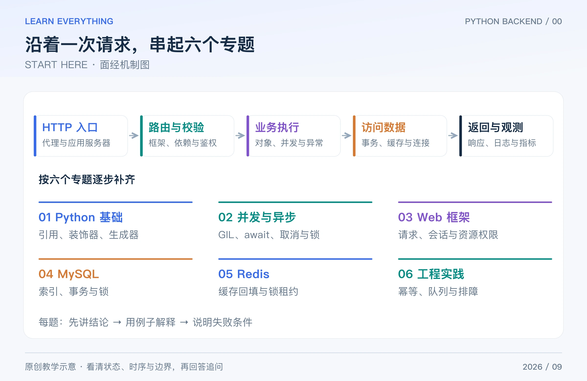

Python 后端面试不只是问语法。面试官常沿着一条业务链继续追问：接口收到什么、代码怎样执行、数据如何保存、并发时会不会错、线上变慢如何定位。

这个系列面向实习、初级和初中级 Python Web 后端，整理 **6 篇专题、48 组常见问答**。它是通用复习材料，不是某家公司的真实面试记录或题目频率统计。每题先给可口述的短答，再给解释、例子与追问。

## Table of contents

## 1 先看全景：问题藏在请求的哪一段

_图：原创教学图。上方沿请求处理顺序展开，下方按学习主题分组。_

比如“查询订单”这个接口：Python 对象承载数据，Web 框架解析请求，异步或线程处理等待，MySQL 保存订单，Redis 缓存结果，工程机制处理超时与重试。这六个专题不是六份互不相关的八股文。

## 2 六篇面经，分别解决什么

| 篇目                                                                                                                    | 重点问题                                                     |
| ----------------------------------------------------------------------------------------------------------------------- | ------------------------------------------------------------ |
| [Python 基础面经：对象、拷贝、装饰器与生成器怎么回答](/posts/knowledge/python-backend/interviews/01-python-core/)       | 容器与引用、默认参数、闭包、装饰器、生成器、GC、类与类型     |
| [Python 并发面经：GIL、线程、进程与 asyncio 怎么选](/posts/knowledge/python-backend/interviews/02-concurrency-asyncio/) | 并发、GIL、await、TaskGroup、阻塞、锁、取消、背压            |
| [Python Web 面经：FastAPI、Django、请求链路与鉴权](/posts/knowledge/python-backend/interviews/03-web-frameworks/)       | 框架分工、请求链路、校验、依赖、会话、N+1、鉴权、跨域        |
| [MySQL 面经：索引、事务、锁与慢查询怎么讲清楚](/posts/knowledge/python-backend/interviews/04-mysql-transactions/)       | B+ 树、联合索引、慢查询、隔离级别、锁、库存、死锁、分页      |
| [Redis 面经：缓存一致性、分布式锁与持久化](/posts/knowledge/python-backend/interviews/05-redis-caching/)                | 类型、缓存链路、三类失效问题、一致性、锁、淘汰、持久化、事务 |
| [后端工程面经：幂等、消息队列、接口排障与部署](/posts/knowledge/python-backend/interviews/06-api-reliability/)          | 幂等、重试、队列、连接池、排障、部署、测试、项目表达         |

Python 标准库示例以 3.11+ 为适用范围，本系列实际运行环境为 CPython 3.13.5。GIL 另行区分默认构建与可选 free-threaded 构建；数据库示例以 MySQL 8.4 InnoDB 为口径；Django 的异步限制注明 5.2 文档范围。框架与产品行为依据截至 2026-09-15 核对的官方资料，不把版本差异写成永久结论。

## 3 一道题，分三层回答

先用 20～30 秒讲结论，然后用一个例子解释机制，最后补充适用条件。时间只是练习节奏，不是实际面试的硬性要求。

例如问“async 就一定更快吗”：

> 不一定。async 主要让等待 I/O 的时间重叠；如果在事件循环中执行阻塞调用或大量 CPU 计算，其他协程仍会被拖住。我要先确认瓶颈和依赖库是否异步，再决定用协程、线程还是进程。

接下来举一个“两个下游请求并发等待”的例子，再补充超时与并发限制，就比只说“协程很轻量”更完整。

## 4 怎样复习，才能发现自己没有理解的地方

| 轮次   | 做什么           | 通过标准                           |
| ------ | ---------------- | ---------------------------------- |
| 第一轮 | 每篇先读短答和图 | 能说出术语描述的是哪个环节         |
| 第二轮 | 手算或运行例子   | 能预测输出，并解释为什么           |
| 第三轮 | 遮住答案回答追问 | 能说出失败条件和方案边界           |
| 第四轮 | 串成订单接口案例 | 能把数据库、缓存、重试与鉴权连起来 |

每道题可以自己记 0～2 分：0 分是没有概念；1 分是能解释定义；2 分是还能举例并说出限制。这个分数只用于找薄弱项，不预测录用结果。

如果时间有限，先抓住对象引用、GIL 与 async、请求链路、索引与事务、缓存一致性、幂等与排障。装饰器、框架生命周期和队列细节再逐步补齐。

## 5 贯穿全系列的一道综合题

“做一个创建订单接口，客户端可能重复点击，库存不能变成负数，成功后要异步生成一份导出文件。”

你应能逐步说明：输入校验与用户权限怎样做；幂等键怎样绑定请求；库存更新怎样放进数据库事务；缓存如何失效；消息发布失败怎样补偿；worker 收到重复消息如何处理；接口慢时看哪些指标。

本系列的 SQL、Redis 命令和工程流程是教学方案，具体表结构、客户端参数、部署配置应按项目补齐。Python 代码块提供可运行机制例子；没有把伪代码、示例时长或故障场景冒充真实压测结果。

[下一篇：PYTHON CORE](/posts/knowledge/python-backend/interviews/01-python-core/)
