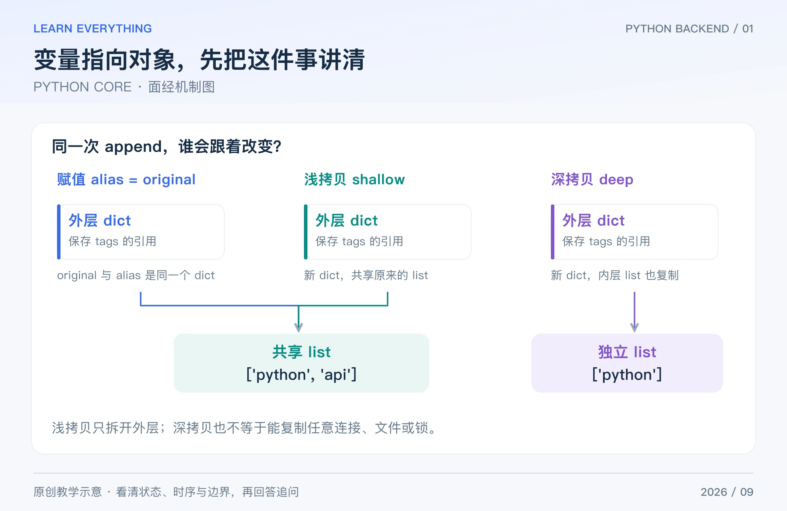

这一篇先解决语言层面的八组问题。回答时不要只背“浅拷贝、深拷贝”这些词，要能画出哪个变量指向哪个对象，并预测一次修改会影响谁。

## Table of contents

## 1 list、tuple、dict、set 怎么选？

**短答：** list 适合有顺序且需要修改的序列；tuple 适合结构相对固定的记录；dict 做键到值的映射；set 表达去重与集合关系。选择首先看业务语义，再看操作成本。

dict 和 set 依赖哈希；键或成员必须可哈希。字符串、整数常可用，list 不可哈希；tuple 是否可哈希取决于内部元素，例如含 list 的 tuple 仍不能作为字典键。dict 在现代 Python 中保留插入顺序，set 不承诺这种顺序。

不要说“tuple 里面所有东西都不能变”。tuple 的槽位绑定不能变，但其中引用的 list 仍可能被修改。[Python 标准类型](https://docs.python.org/3/library/stdtypes.html)

**追问：** dict 查询一定 O(1) 吗？通常讨论的是平均情况；哈希碰撞、对象的哈希与比较成本等会影响表现，不是任何数据下的固定耗时保证。

## 2 `is`、`==`、赋值与拷贝有什么区别？

**短答：** `is` 比较对象身份，`==` 比较相等关系；赋值建立引用，不自动复制对象。浅拷贝新建外层容器，内层对象仍可共享；深拷贝通常递归复制，并用 memo 处理重复引用和循环结构。



_图：原创教学图。外层是否新建、内层是否共享，要分别判断。_

```python
import copy

original = {"tags": ["python"]}
alias = original
shallow = copy.copy(original)
deep = copy.deepcopy(original)
original["tags"].append("api")

print(alias is original, shallow is original)
print(shallow["tags"] is original["tags"])
print(deep["tags"])
# True False
# True
# ['python']
```

比较是否为 None，通常写 `value is None`。不要依靠整数缓存或字符串驻留的偶然现象，用 `is` 代替数值或字符串相等判断。

**追问：** 深拷贝能复制数据库连接吗？不能把它当作任意资源的复制方案。连接、锁等对象有资源与生命周期语义，应该显式创建或管理。[copy 官方说明](https://docs.python.org/3/library/copy.html)

## 3 默认参数和闭包，为什么经常出现“共享值”？

**短答：** 默认参数表达式在函数定义执行时求值；可变默认对象会跨调用复用。闭包引用外层变量，很多情况下在函数调用时才取它的当前值，不自动保存每轮循环的值。

```python
def append_bad(value, items=[]):
    items.append(value)
    return items


def append_good(value, items=None):
    if items is None:
        items = []
    items.append(value)
    return items


print(append_bad(1), append_bad(2))
print(append_good(1), append_good(2))
late = [lambda: i for i in range(3)]
fixed = [lambda i=i: i for i in range(3)]
print([f() for f in late], [f() for f in fixed])
# [1, 2] [1, 2]：print 收到的两个引用指向同一个列表。
# [1] [2]
# [2, 2, 2] [0, 1, 2]
```

`i=i` 利用了定义时求值，把该次循环的整数保存为默认参数。它没有把 Python 的闭包规则改掉。

**追问：** 如果默认值保存的是一个 list 呢？保存的仍是对象引用，之后修改该 list 还可能影响结果；不要把“提前绑定”误说成“自动深拷贝”。[Python 编程 FAQ](https://docs.python.org/3/faq/programming.html)

## 4 装饰器在什么时候执行？为什么用 `wraps`？

**短答：** 装饰器接收函数等可调用对象，并返回替代对象。装饰动作发生在定义执行时；包装函数里的代码一般在调用被包装函数时运行。`functools.wraps` 保留名称、文档等元信息，并提供 `__wrapped__`。

```python
from functools import wraps


def label_call(func):
    @wraps(func)
    def wrapped(*args, **kwargs):
        return "result=" + str(func(*args, **kwargs))
    return wrapped


@label_call
def add(a, b):
    return a + b


print(add(2, 3), add.__name__)
# result=5 add
```

`@outer` 写在 `@inner` 上面时，定义结果等价于 `f = outer(inner(f))`。调用时外层包装先进入，然后调用内层；具体返回顺序还要看包装实现。

**追问：** 同步装饰器直接包装 async 函数行不行？如果它只拿到 coroutine 对象就记录“请求结束”，统计会错。应按需求提供 `async def` 包装并 `await` 原函数。[functools 文档](https://docs.python.org/3/library/functools.html#functools.wraps)

## 5 迭代器、生成器和列表推导式有什么区别？

**短答：** 可迭代对象能交给 `iter()`；迭代器通过 `next()` 逐个产生值；含 `yield` 的生成器函数被调用时返回生成器，迭代到某一步才继续执行函数体。列表推导式通常立即构造列表，生成器表达式按需产生元素。

```python
def positive_numbers(values):
    for value in values:
        if value > 0:
            yield value


g = positive_numbers([-2, 3, 5])
print(next(g))
print(list(g))
print(list(g))
# 3
# [5]
# []
```

**追问：** 生成器一定省内存吗？它可以避免一次性保存全部输出，但如果输入早已是一个大列表、内部缓存很多数据，或者调用方又 `list(g)`，整体内存仍可能很大。它也不是默认可重复遍历的容器。[迭代器协议](https://docs.python.org/3/library/stdtypes.html#iterator-types)

## 6 Python 怎样管理内存？为什么还要用 `with`？

**短答：** 在 CPython 中，引用计数与循环垃圾回收配合管理对象；其他解释器与不同构建的细节可能不同。`del name` 主要删除一个绑定，不意味着立刻强制销毁该对象或把内存还给操作系统。

对象仍被全局列表、缓存、闭包或其他对象引用时，即使不再业务使用，也可能继续存活。排查内存持续增长，要区分“仍可达的对象越来越多”和“分配器保留空间导致 RSS 没立即下降”。

文件、连接和锁则应该显式管理生命周期。`with` 在正常结束和异常离开时执行退出逻辑，比期待垃圾回收恰好替你释放资源可靠。[gc 文档](https://docs.python.org/3/library/gc.html)、[with 语句](https://docs.python.org/3/reference/compound_stmts.html#the-with-statement)

**追问：** `finally` 和 `__exit__` 能处理一切中断吗？不能把进程被强杀、机器断电等情况也当成正常异常退出；关键业务持久性还要靠事务与恢复设计。

## 7 实例方法、类方法、静态方法怎么区分？

**短答：** 实例方法通常接收 `self`，使用某个对象的状态；`classmethod` 接收 `cls`，常用于与具体类绑定的替代构造方式；`staticmethod` 不自动接收实例或类，适合归属该命名空间的工具逻辑。

如果做 `User.from_dict(data)`，类方法返回 `cls(...)` 可以保留子类构造语义。若函数完全不依赖类相关概念，也可以直接写模块级函数，不必为了“面向对象”而加静态方法。

类属性由实例经属性查找共享；给 `self.items` 赋新值与修改类属性里已有的 list，不是同一件事。

**追问：** `super()` 就是调用某一个父类吗？更准确地说，它沿方法解析顺序 MRO 查找后续实现；多继承时不能简单理解成“固定调用左边父类”。[类教程](https://docs.python.org/3/tutorial/classes.html)

## 8 类型标注会自动校验参数吗？异常应该怎么处理？

**短答：** 普通 Python 类型标注本身不强制运行时校验；静态检查器或 FastAPI/Pydantic 等框架可以利用它。异常应在能处理或补充上下文的边界捕获，不要吞掉未知错误，再返回看似成功的结果。

```python
def echo(value: int) -> int:
    return value


print(echo("not-an-int"))
# not-an-int：这个普通函数不会因标注自动拒绝字符串。
```

业务层可以定义明确的“资源不存在”“库存不足”等异常，接口层再映射成合适响应。日志记录故障上下文，但不把密码、token 或完整敏感请求体直接输出。

**追问：** `except Exception` 能接住一切吗？不能，例如 `KeyboardInterrupt`、`SystemExit` 不继承 Exception；异步取消也有专门语义，不应随便吞掉。捕获范围越大，越需要解释恢复策略。[typing 文档](https://docs.python.org/3/library/typing.html)、[异常层级](https://docs.python.org/3/library/exceptions.html)

[系列导读](/posts/knowledge/python-backend/interviews/00-interview-roadmap/) · [下一篇：CONCURRENCY](/posts/knowledge/python-backend/interviews/02-concurrency-asyncio/)
