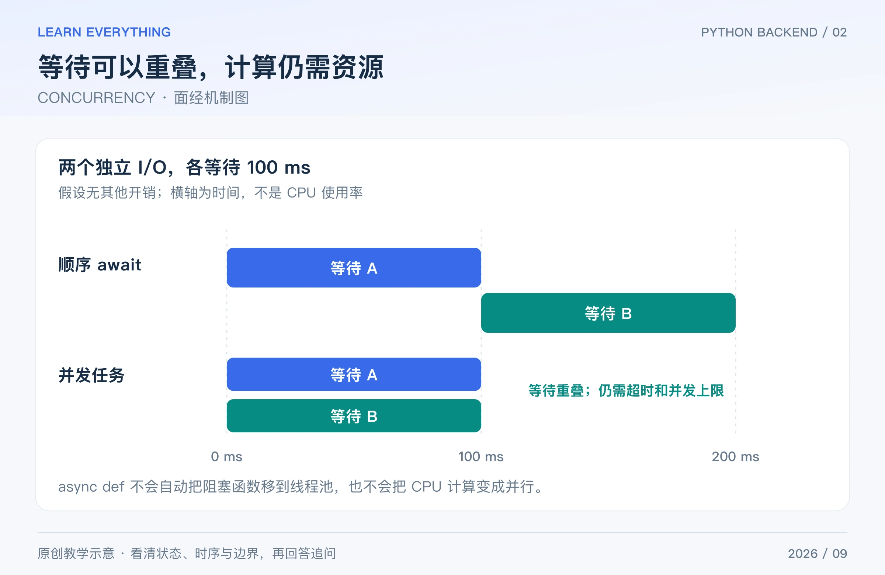

并发题最重要的是先分清：程序在等待什么、哪段代码占着执行线程、共享状态会不会被交错修改。不要把“协程轻量”“线程有 GIL”当成选型的全部理由。

## Table of contents

## 1 并发和并行有什么区别？线程、进程、协程怎么选？

**短答：** 并发是多个任务在一段时间内交错推进；并行是多个任务在同一时刻执行。进程隔离地址空间，线程共享进程内存；asyncio 协程通常在事件循环中协作式调度。

| 工作                      | 常见考虑方向         | 代价或前提                     |
| ------------------------- | -------------------- | ------------------------------ |
| 大量异步网络等待          | asyncio 与异步客户端 | 整条调用链不能随意阻塞事件循环 |
| 只有同步接口的 I/O 库     | 有界线程池           | 线程、连接数和排队仍有限       |
| 大量纯 Python CPU 计算    | 多进程或独立计算服务 | 序列化、进程内存和调度有成本   |
| 可释放 GIL 的本地扩展计算 | 结合扩展行为评估线程 | 不能只看外面是不是 Python 调用 |

**追问：** 进程越多一定越快吗？不一定。CPU、内存、数据库连接和进程间通信可能先达到瓶颈，需要测实际工作负载。

## 2 GIL 是什么？2026 年还能说“Python 线程不能并行”吗？

**短答：** 在默认带 GIL 的 CPython 构建中，同一时刻通常只有一个线程执行受 GIL 保护的 Python 字节码；I/O 和一些本地扩展可以释放它。但 CPython 自 3.13 起已有可选 free-threaded 构建，不能把默认构建的限制推广到所有 Python 环境。

回答时应先说解释器、版本、是否启用 GIL、依赖扩展是否兼容。可选 free-threaded 也不意味着任意程序自动线性加速。[threading 文档](https://docs.python.org/3/library/threading.html)、[free-threading 官方说明](https://docs.python.org/3/howto/free-threading-python.html)

**追问：** 有 GIL 就不需要锁吗？仍然需要。比如“检查库存大于零，再扣减”是复合业务操作；GIL 不会把你的整个业务判断自动变成事务。在无 GIL 构建中，也不应该把容器内部同步当成复合业务一致性的保证。

## 3 写了 `async def` 和 `await`，为什么仍可能是串行？

**短答：** 调用 async 函数先得到协程对象；需要 await 或安排为任务才会执行。顺序执行 `await a()`、`await b()`，仍然是先等 a 完成，再启动 b。想让两段独立等待重叠，需要创建并发任务。



_图：原创教学图。示例假定每次等待 100 ms，省略调度及计算开销；展示的是机制，不是性能承诺。_

```python
import asyncio


async def fetch_piece(name):
    await asyncio.sleep(0.01)  # 模拟可让出执行权的等待
    return name


async def main():
    sequential = [await fetch_piece("A"), await fetch_piece("B")]
    async with asyncio.TaskGroup() as group:
        a = group.create_task(fetch_piece("A"))
        b = group.create_task(fetch_piece("B"))
    print(sequential, [a.result(), b.result()])


asyncio.run(main())
# ['A', 'B'] ['A', 'B']：结果相同，等待安排不同。
```

图中的 100 ms 是为解释时序设定的理想化数值，不是上面代码的压测结果。另一个细节是：`await` 不保证每次都实际切换任务；被等待操作若已就绪，可能直接继续。

**追问：** 可以在运行中的事件循环内再调用 `asyncio.run()` 吗？通常不可以；在异步调用链里应继续 await，由最外层入口负责启动事件循环。

## 4 `gather` 和 `TaskGroup` 有什么区别？

**短答：** 两者都能组织多个异步任务，但失败传播和生命周期管理不同。Python 3.11+ 的 TaskGroup 在上下文退出前等待组内任务；一个任务出现普通异常时，会取消其他未完成任务，再按规则传播异常，通常体现为异常组。

`gather()` 默认传播首个异常，但不会仅因此自动取消其他已安排的任务；若 `gather` 自身被取消，又是另一种情况。`return_exceptions=True` 会把异常作为结果返回，调用方必须检查，不能当成成功数据。[asyncio 任务文档](https://docs.python.org/3/library/asyncio-task.html)

**追问：** TaskGroup 会回滚已经完成的业务操作吗？不会。取消协程不是数据库回滚，更不是撤销已经发送给下游的请求。

## 5 在 async 函数里调用 `requests` 或 `time.sleep` 会怎样？

**短答：** 普通阻塞调用会占住当前事件循环线程，让同循环里的其他任务难以推进。优先使用真正的异步客户端；必须调用同步 I/O 时，可以用有界线程池，或在合适场景使用 `asyncio.to_thread()`。

```python
import asyncio
import time


def legacy_read():
    time.sleep(0.01)
    return "done"


async def main():
    result = await asyncio.to_thread(legacy_read)
    print(result)


asyncio.run(main())
# done
```

这只是把同步工作移到线程里，不会让它本身变成非阻塞，也不会自动限制所有请求的资源需求。

**追问：** 协程超时后，线程里的函数就停止了吗？不能这样保证。取消等待它的任务不等于强制终止已经运行的线程函数；下游操作仍应有自己的超时与幂等设计。

## 6 单线程协程也会有竞态吗？

**短答：** 会。如果“读旧值 → 等待 → 写新值”之间让出执行权，其他协程可能读取同一个旧值，再互相覆盖结果。协程锁保护同一事件循环中的临界区；它不等于跨进程或分布式锁。

```python
import asyncio


async def main():
    state = {"count": 0}

    async def unsafe_add():
        old = state["count"]
        await asyncio.sleep(0)
        state["count"] = old + 1

    await asyncio.gather(unsafe_add(), unsafe_add())
    print(state["count"])  # 1：两次都读取了 0。

    state["count"] = 0
    lock = asyncio.Lock()

    async def safe_add():
        async with lock:
            old = state["count"]
            await asyncio.sleep(0)
            state["count"] = old + 1

    await asyncio.gather(safe_add(), safe_add())
    print(state["count"])  # 2


asyncio.run(main())
```

**追问：** `threading.Lock` 能否直接替代 asyncio.Lock？不要把会阻塞线程的等待随意放进事件循环；锁的作用域和调度模型不同。真实共享库存通常还应由数据库约束和事务保证。[asyncio 同步原语](https://docs.python.org/3/library/asyncio-sync.html)

## 7 超时和取消怎样写，才不会漏资源？

**短答：** 为操作设置明确的时间预算，用 `try/finally` 或异步上下文管理器清理资源。取消是在可响应的时机抛出取消异常，不是操作系统强制打断任何指令。

Python 3.11+ 可用 `asyncio.timeout()` 管理范围超时。底层驱动还需要连接、读取等超时；上层等待结束不代表数据库或远端副作用一定被撤销。

**追问：** 可以捕获取消异常后忽略吗？通常应在清理后继续传播。吞掉取消可能破坏 TaskGroup 或 timeout 的语义。正确做法是明确哪些工作可取消、哪些需要查询结果或补偿，而不是统一“超时重试”。

## 8 一口气创建十万个 task，为什么可能更慢？

**短答：** task、连接池、下游额度和内存都有限。并发不受控会把等待转移到队列，甚至压垮依赖。应该限制同时进行的 I/O，并对待处理任务数量做背压。

例如只允许 20 个下载同时执行，可以用 Semaphore 控制临界段；但如果先创建十万个 task，再让它们等待 semaphore，task 本身的内存仍存在。更完整的方案是有界队列配合固定数量 worker，生产者在队列满时等待或拒绝任务。

**追问：** 该把并发设置成多少？看连接池、CPU、延迟、超时率与下游限额，通过负载测试选范围。不能把“CPU 核数乘几”当成所有 I/O 服务的通用答案。[asyncio 队列](https://docs.python.org/3/library/asyncio-queue.html)

[系列导读](/posts/knowledge/python-backend/interviews/00-interview-roadmap/) · [上一篇：PYTHON CORE](/posts/knowledge/python-backend/interviews/01-python-core/) · [下一篇：WEB FRAMEWORKS](/posts/knowledge/python-backend/interviews/03-web-frameworks/)
