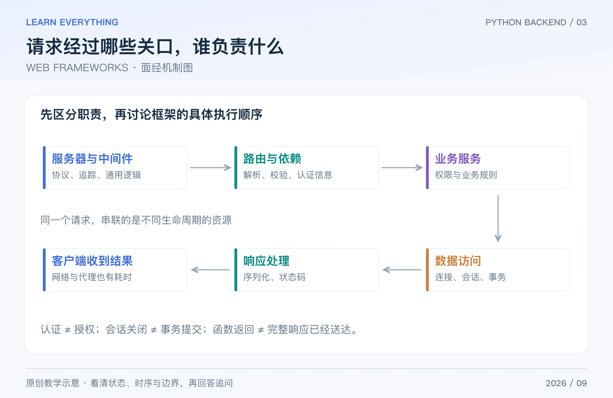

Web 面经可以沿“请求进入 → 校验和鉴权 → 业务执行 → 数据访问 → 返回响应”的路线回答。本篇以 FastAPI 举例，同时说明 Django、Flask 与 WSGI/ASGI 的边界。

## Table of contents

## 1 Django、Flask、FastAPI 怎么选？WSGI 和 ASGI 是什么？

**短答：** Django 提供较完整的 ORM、管理后台等能力；Flask 的核心较轻，扩展由项目组合；FastAPI 围绕类型声明、校验、依赖注入和 OpenAPI 构建 API。选型看团队、生态与业务，不仅看宣传中的速度。

WSGI 和 ASGI 是服务器与 Python 应用之间的接口规范；它们不是数据库协议。ASGI 为异步事件和 WebSocket 等交互提供接口，但应用能否高效并发，仍取决于框架、中间件和底层客户端。

**追问：** Flask 写 async 视图就是完整 ASGI 服务吗？不能直接等同。Flask 的 WSGI 部署有自己的执行边界；Django 也要区分同步与异步调用链。Django 5.2 文档中，事务部分仍建议放在同步函数中，再通过合适适配调用。[Flask 异步说明](https://flask.palletsprojects.com/en/stable/async-await/)、[Django 5.2 异步说明](https://docs.djangoproject.com/en/5.2/topics/async/)

## 2 一次请求如何经过框架？中间件做什么？

**短答：** HTTP 服务器把请求交给应用，中间件处理通用逻辑，路由选择处理函数；框架解析参数、执行依赖与校验，业务层访问数据，最后序列化响应。不同框架的具体次序应以实际实现为准。



_图：原创教学图。这是职责划分图，具体执行顺序与资源清理时机要按框架和版本核对。_

中间件适合请求追踪、通用日志、部分认证和统一响应处理；复杂业务规则更适合服务层。异常响应、流式响应、客户端断开等路径也要考虑，不能只测试正常返回。

**追问：** 测量中间件中的函数返回时间，就是用户接收完整响应的时间吗？不一定。流式发送、网络传输和代理等待可能发生在其他阶段，要先定义测量区间。

## 3 参数校验、类型标注和 HTTP 状态码怎样对应？

**短答：** Python 标注本身不强制校验，FastAPI 可利用 Pydantic 等组件解析、转换并验证输入。校验成功不等于业务合法：数量是整数且大于零，仍可能超过库存。

下面是独立可运行的最小示例，需要安装 `fastapi` 和 `httpx2`；只检查输入，不创建真实订单。本文用 FastAPI 0.141.1、Pydantic 2.13.5 核验。当前 Starlette 推荐 HTTPX2 作为 TestClient 后端，旧 HTTPX 路径仍可用但已弃用。[TestClient 文档](https://www.starlette.io/testclient/)

```python
from fastapi import FastAPI
from fastapi.testclient import TestClient
from pydantic import BaseModel, Field

app = FastAPI()


class OrderInput(BaseModel):
    sku: str = Field(min_length=1)
    quantity: int = Field(gt=0, le=20)


@app.post("/order-preview")
def preview_order(order: OrderInput):
    return {"sku": order.sku, "quantity": order.quantity}


with TestClient(app) as client:
    good = client.post("/order-preview", json={"sku": "book", "quantity": 2})
    bad = client.post("/order-preview", json={"sku": "book", "quantity": 0})
    print(good.status_code, good.json())
    print(bad.status_code)
# 200 {'sku': 'book', 'quantity': 2}
# 422：FastAPI 默认请求校验错误响应。
```

常见区分：401 表示缺少有效认证凭据；403 表示服务器理解请求但拒绝执行；404 表示资源未找到或不愿披露；409 表示与当前资源状态冲突；5xx 表示服务器侧处理失败。不能把所有失败都返回 200，再只靠字符串描述错误。[HTTP 语义](https://www.rfc-editor.org/rfc/rfc9110.html)

**追问：** Pydantic 一定原样拒绝字符串形式的数字吗？未必，取决于类型和严格模式等配置。要区分类型转换与严格校验。[Pydantic 模型说明](https://docs.pydantic.dev/latest/concepts/models/)

## 4 FastAPI 的 `def`、`async def` 与 `Depends` 怎么配合？

**短答：** FastAPI 调用普通 def 路由或普通 def 依赖时，会在外部线程池运行；async 路由与依赖由异步调用链执行。但在 async 路由中直接调用一个普通工具函数，不会自动把它送进线程池。

Depends 适合表达认证信息、数据库会话等公共依赖。`yield` 依赖可在进入时创建资源、退出时清理；清理时机和 scope、框架版本及响应方式有关，不应把它概括成任何版本都“刚返回函数就关闭”。[FastAPI 并发规则](https://fastapi.tiangolo.com/async/)、[yield 依赖](https://fastapi.tiangolo.com/tutorial/dependencies/dependencies-with-yield/)

**追问：** yield 依赖自动帮我提交事务吗？不会替你定义业务事务边界。关闭会话、提交事务、异常回滚是不同动作，应显式约定。

## 5 数据库连接、连接池、Session 是同一个东西吗？

**短答：** 连接是与数据库通信的资源；连接池负责复用与限制连接；ORM Session 管理一次工作过程中的对象状态和事务交互。会话不能简单当作全局共享连接来用。

SQLAlchemy 2.0 的并发原则是每个线程使用自己的 Session、每个并发 task 使用自己的 AsyncSession。一个请求内部若并发启动多个数据库任务，也不能因为“同一请求”就随意共用一个 AsyncSession。[SQLAlchemy 会话说明](https://docs.sqlalchemy.org/en/20/orm/session_basics.html)

**追问：** 请求结束会话关闭，就说明事务成功了吗？不是。是否 commit、是否 rollback 必须由明确的业务边界决定；返回成功通常要在所需提交已经成功之后。

## 6 什么是 N+1 查询？ORM 一定慢吗？

**短答：** 先查出 N 条主记录，再逐条懒加载关联数据，可能形成 1+N 次查询。问题来自访问模式，不是“用了 ORM 就必然慢”。

例如查 20 个订单，再循环访问每个订单的用户，可能触发多次 SQL。可根据关系形状使用预加载、批量查询或合适 JOIN；同时记录实际 SQL 数量，检查重复查询、回表、返回行数与连接等待。

**追问：** 全部 JOIN 一次就一定更快吗？一对多 JOIN 可能放大结果集，增加重复行和传输成本。应按关联关系、分页需求和执行计划选择，而不是机械追求“只有一条 SQL”。[SQLAlchemy 关系加载](https://docs.sqlalchemy.org/en/20/orm/queryguide/relationships.html)

## 7 登录、JWT 与权限校验，最容易漏掉什么？

**短答：** 认证确认“你是谁”，授权确认“你能操作什么”。登录成功不代表能访问任意订单；即使 URL 中的订单 ID 存在，也要在服务端检查资源归属和操作权限。

Session 常把状态保存在服务端，由 cookie 等携带标识；JWT 是 token 格式，签名 token 的载荷通常可读，不能当作加密容器。验证时要限制允许算法，检查签名、有效期和预期的签发者、受众等；撤销策略需要另外设计。

密码使用成熟的密码哈希方案和库，例如适合配置的 Argon2id，不用明文存储或自己拼一个普通 SHA-256 代替。每个账户的盐和工作参数也应由成熟方案管理。[OWASP 授权指南](https://cheatsheetseries.owasp.org/cheatsheets/Authorization_Cheat_Sheet.html)、[密码存储指南](https://cheatsheetseries.owasp.org/cheatsheets/Password_Storage_Cheat_Sheet.html)

**追问：** 前端隐藏按钮是不是权限控制？不是。客户端界面可被绕过，真正的资源权限必须在服务端判断。

## 8 CORS 与 CSRF 有什么区别？

**短答：** CORS 是浏览器的跨源资源共享规则，控制跨源脚本读取响应等行为；它不是身份认证，也不是服务端防火墙。CSRF 则是攻击者利用浏览器自动携带的身份凭据，让用户在不知情时发起有副作用的请求。

使用 cookie 认证时，要结合 CSRF token、SameSite、Origin 等机制，按框架建议保护写操作；允许某个跨域来源，不代表已经解决 CSRF。跨源定义还包含协议、主机和端口，不能只比较域名字符串。[FastAPI CORS](https://fastapi.tiangolo.com/tutorial/cors/)、[OWASP CSRF 指南](https://cheatsheetseries.owasp.org/cheatsheets/Cross-Site_Request_Forgery_Prevention_Cheat_Sheet.html)

**追问：** token 放 Authorization 头就没有任何风险了吗？仍需要防止 XSS、token 泄露和服务端权限错误。浏览器是否自动携带凭据，只解释一部分威胁模型。

[系列导读](/posts/knowledge/python-backend/interviews/00-interview-roadmap/) · [上一篇：CONCURRENCY](/posts/knowledge/python-backend/interviews/02-concurrency-asyncio/) · [下一篇：MYSQL / INNODB](/posts/knowledge/python-backend/interviews/04-mysql-transactions/)
