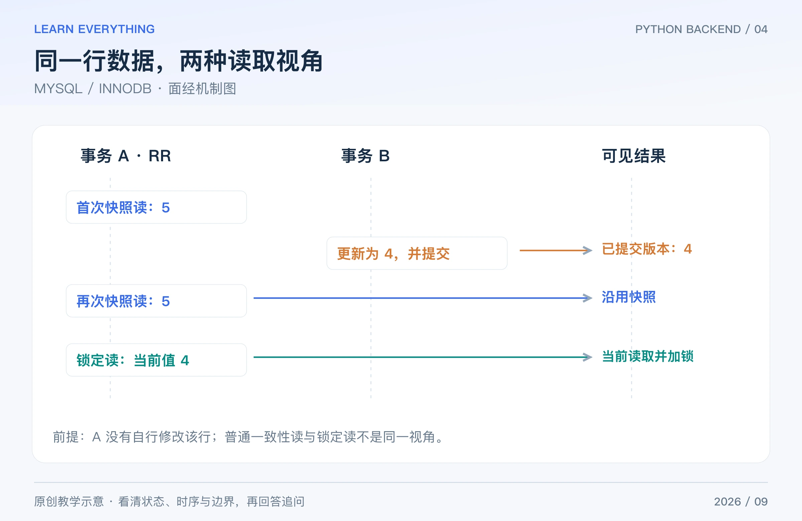

数据库题要同时回答“查得快不快”和“并发下对不对”。本篇以 **MySQL 8.4、InnoDB** 为口径；不要把某个隔离级别、引擎或执行计划的行为直接推广到所有数据库。

下面 SQL 是针对示例表的教学语句，解释其逻辑与索引设计；没有将它们在真实业务库上的耗时或执行计划冒充实测结果。

## Table of contents

## 1 为什么常说 InnoDB 使用 B+ 树索引？什么叫回表？

**短答：** 常见 InnoDB 索引使用 B+ 树结构组织有序键，适合按键定位和范围扫描。聚簇索引的叶子包含行数据；二级索引记录包含对应主键，可能需要再按主键到聚簇索引查其他字段，这通常叫回表。

如果查询需要的列都能从所用索引中取得，就可能采用覆盖索引访问，减少额外读取。但索引也占空间，并增加插入、更新和维护成本，不是越多越好。[InnoDB 聚簇与二级索引](https://dev.mysql.com/doc/refman/8.4/en/innodb-index-types.html)

**追问：** UUID 主键和递增整数主键完全一样吗？键宽度、写入局部性和业务生成方式会影响索引体积与维护成本；应根据具体 UUID 类型、数据量和分布评估，而不是只背“UUID 一定不能用”。

## 2 联合索引的最左前缀是什么？

**短答：** 联合索引按列顺序组织，例如 `(user_id, created_at, id)`。常规高效定位通常利用前面的连续列；前列等值、后列范围和排序可以共同决定扫描区间。应该结合查询模式设计列顺序。

```sql
CREATE TABLE orders (
    id BIGINT PRIMARY KEY AUTO_INCREMENT,
    user_id BIGINT NOT NULL,
    created_at DATETIME(6) NOT NULL,
    amount_cent BIGINT NOT NULL,
    KEY idx_user_created_id (user_id, created_at, id)
) ENGINE=InnoDB;

EXPLAIN
SELECT id, created_at
FROM orders
WHERE user_id = 42 AND created_at >= '2026-09-01'
ORDER BY created_at, id
LIMIT 20;
```

这条查询让 user_id 做等值定位，再按时间和 id 取有序结果。实际优化器是否选择该索引、扫描多少行，必须看数据分布和执行计划。

**追问：** 不满足最左前缀就绝不可能使用索引吗？不能这样绝对化。优化器可能选择索引全扫描、skip scan 等路径；“使用了某个索引”也不意味着扫描代价很低。对索引列使用函数、隐式转换或前导通配符，也要结合具体索引与优化方式分析。[联合索引](https://dev.mysql.com/doc/refman/8.4/en/multiple-column-indexes.html)、[范围与 skip scan](https://dev.mysql.com/doc/refman/8.4/en/range-optimization.html)

## 3 SQL 变慢了，`EXPLAIN` 应该看什么？

**短答：** 先确认慢的是哪条 SQL、参数是什么、执行次数与返回行数，再看访问路径、实际选用索引、估计扫描行数、连接顺序和排序等。还要排除连接池等待、锁等待及网络传输。

| 观察                       | 继续问什么                                 |
| -------------------------- | ------------------------------------------ |
| 扫描很多行、只返回很少数据 | 索引能否缩小扫描范围？统计信息是否合适？   |
| 单条不慢、同接口调用很多次 | 是否有 N+1、循环查询或重试？               |
| SQL 计算很轻但耗时很长     | 是否在等待锁、连接、磁盘或网络？           |
| 有排序或临时结果           | 排序是否必要、数据规模多大、索引能否帮助？ |

`EXPLAIN` 主要展示计划；`EXPLAIN ANALYZE` 会实际执行支持的语句并给出运行信息，不能把它当成完全不执行查询的只读解释工具。在线使用应评估语句本身的影响。[EXPLAIN 官方说明](https://dev.mysql.com/doc/refman/8.4/en/explain.html)

**追问：** 出现 filesort 就一定很差吗？不是。需要看排序数量、内存和延迟；它也不等于一定把所有内容写到磁盘。

## 4 事务的 ACID 和四种隔离级别怎样回答？

**短答：** 原子性描述一组修改的整体提交或回滚；一致性要求维护定义好的约束；隔离性控制并发事务之间的可见性与干扰；持久性描述提交后的保存保障。数据库不能自动知道所有业务规则，应用仍要正确定义事务和约束。

InnoDB 提供 RU、RC、RR、Serializable，默认 RR。RC 下每次一致性读通常取得新的快照；RR 下通常复用该事务第一次一致性读建立的快照；显式建立快照和自身写入等情况需另看语义。

不要只背“RR 消除不可重复读，没消除幻读”的通用表，就忽略 InnoDB 的实现：普通快照读与锁定范围读使用不同机制，后者在相应条件下会用间隙锁等限制插入。[InnoDB 隔离级别](https://dev.mysql.com/doc/refman/8.4/en/innodb-transaction-isolation-levels.html)

**追问：** 隔离级别越高越好吗？提高隔离可能增加阻塞或失败重试；应以业务正确性要求为前提，再评估成本。

## 5 快照读和 `SELECT ... FOR UPDATE` 有什么区别？

**短答：** 普通一致性 SELECT 可以通过 MVCC 读取符合快照可见性规则的版本，减少读写互相阻塞；`FOR UPDATE` 是锁定读，读取并锁住用于后续修改的记录，不能当成同一个旧快照视角。



_图：原创教学图。假设 A 尚未自己修改该行，B 的更新已提交；只演示该情形下的读取视角。_

例如事务 A 在 RR 下第一次普通 SELECT 看见库存 5；B 更新到 4 并提交；A 再次普通 SELECT 仍可能看见 5，而 A 的锁定读通常依据当前记录进行读取与加锁。自身已执行的修改也会影响可见结果，不能把一个事务里的所有读都理解成静态照片。

唯一索引精确命中已有记录时通常只需要记录锁；范围条件在 RR 下可能涉及 next-key/gap 锁。没有合适索引时，扫描和锁定范围可能很大，不能简单说“有 WHERE 就只锁一行”或“没走索引就自动变成表锁”。[锁定读](https://dev.mysql.com/doc/refman/8.4/en/innodb-locking-reads.html)、[InnoDB 锁](https://dev.mysql.com/doc/refman/8.4/en/innodb-locking.html)

**追问：** MVCC 是完全不加锁吗？不是。快照读减少某些读写冲突，但写操作仍涉及锁，事务、约束和锁定读也有其他同步需要。

## 6 怎样扣库存，避免两个请求都买到最后一件？

**短答：** 不要仅在应用里先查库存、再无条件减一。可以在数据库中把条件判断和修改合成一个 UPDATE，检查影响行数，并把订单写入与库存修改放进合适事务。

假设 `inventory` 的 sku 是唯一键，stock 是非空整数，购买数量已校验为正数：

```sql
START TRANSACTION;
UPDATE inventory
SET stock = stock - 1
WHERE sku = 'book' AND stock >= 1;
-- 应用立刻检查本次 UPDATE 的影响行数。
-- 为 1：继续写订单；为 0：回滚并返回库存不足或资源不存在。
-- INSERT 订单语句在同一事务内执行，成功后 COMMIT；失败则 ROLLBACK。
```

这是事务逻辑片段，注释中的判断必须由应用实现，不应复制后不检查结果就继续提交。数据库唯一约束还可用于业务请求去重。

**追问：** 原子扣库存能防止同一请求重复扣两次吗？不能。库存非负与请求幂等是两种约束，后者还需要幂等键或业务唯一性设计。

## 7 为什么会死锁？怎么处理？

**短答：** 当 A 持有资源 1 等待资源 2，B 持有资源 2 等待资源 1，就形成等待环。InnoDB 可检测死锁并选择事务回滚；应用需要准备合理的整事务重试。

降低风险的方法包括：统一加锁顺序、缩短事务、补合适索引、避免在持锁事务中等待很慢的远程调用。发生后先看死锁记录和相关 SQL，不要一律通过增加超时掩盖问题。

**追问：** 死锁与锁等待超时是一样的吗？不是。触发原因和回滚范围可能不同，处理时应核对错误码和事务状态；重试也必须有次数、退避和幂等边界。[死锁处理](https://dev.mysql.com/doc/refman/8.4/en/innodb-deadlocks-handling.html)

## 8 深分页为什么慢？游标分页有什么限制？

**短答：** 大 OFFSET 可能要求扫描并跳过大量记录。按稳定有序键记录上次位置，再从该位置继续查，通常更适合连续翻页；需要合适索引，并处理排序值相同的情况。

沿用第 2 题的 orders 表，某次分页返回的最后一行是 `(created_at='2026-09-15 10:00:00', id=100)`：

```sql
SELECT id, created_at
FROM orders
WHERE user_id = 42
  AND (created_at > '2026-09-15 10:00:00'
       OR (created_at = '2026-09-15 10:00:00' AND id > 100))
ORDER BY created_at, id
LIMIT 20;
```

id 作为时间相同情况下的稳定次序。这个方案适合向后翻页，不天然支持任意跳到第 500 页；如果排序字段可被修改，还要考虑重复、遗漏或快照边界。

**追问：** COUNT 总数怎么处理？精确计数有额外成本，可以按业务选择单独查询、缓存或不提供精确总数；不能为了性能擅自把近似数伪装成精确数。[LIMIT 优化](https://dev.mysql.com/doc/refman/8.4/en/limit-optimization.html)

[系列导读](/posts/knowledge/python-backend/interviews/00-interview-roadmap/) · [上一篇：WEB FRAMEWORKS](/posts/knowledge/python-backend/interviews/03-web-frameworks/) · [下一篇：REDIS / CACHE](/posts/knowledge/python-backend/interviews/05-redis-caching/)
