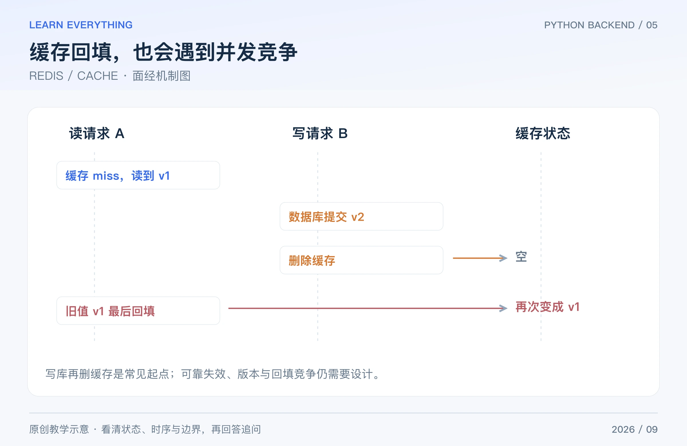

Redis 面试最容易答成名词清单。更好的路线是：先说明缓存放在哪，再讨论读写时序、失败条件和资源限制。缓存解决性能问题，也会引入新的数据生命周期与一致性问题。

## Table of contents

## 1 常见数据类型有什么用途？Redis 为什么快？

**短答：** String 可保存计数或序列化结果，Hash 适合字段集合，List 可表达有序列表，Set 做去重与集合运算，Sorted Set 用分值排序，Stream 则提供日志式消息结构及消费机制。

性能来自内存访问、数据结构与实现等多方面，但命令复杂度、网络往返、大键和持久化操作仍会影响延迟。“Redis 是单线程，所以不用考虑阻塞”是错误结论；不同版本还涉及 I/O 和后台线程，复杂命令仍可能拖慢命令处理。[Redis 数据类型](https://redis.io/docs/latest/develop/data-types/)

**追问：** 排行榜用 ZSet 就没有问题了吗？还要定义同分排序、更新频率、分页范围、成员数量及过期策略，不能只报一个类型名。

## 2 常见的 Cache-Aside 读写链路是什么？

**短答：** 读请求先查缓存，命中返回；未命中则查数据库，并按策略回填缓存。写请求通常先提交数据库修改，再删除相关缓存，让后续读取重新加载。

这里数据库是业务事实来源，缓存保存允许短期滞后的读模型。缓存失败时是否回源，需要结合数据库容量决定；不能在 Redis 故障时让所有请求毫无限制地压向数据库。

**追问：** 为什么不先删缓存再更新数据库？两步之间可能有读请求把旧数据读回缓存。先写库再删缓存也有其他竞态，所以它是常用起点，不是强一致性证明。

## 3 缓存穿透、击穿和雪崩分别是什么？

**短答：** 三个词描述不同的流量与失效形态，解决方法也不同。

| 问题 | 典型场景                              | 常见措施                                       |
| ---- | ------------------------------------- | ---------------------------------------------- |
| 穿透 | 反复查询数据库也不存在的 key          | 输入校验、限流、短期空值缓存、合适的布隆过滤器 |
| 击穿 | 一个热门 key 失效，很多请求同时回源   | 同 key 合并加载、互斥重建、允许旧值时异步刷新  |
| 雪崩 | 大量 key 同时过期，或缓存服务整体故障 | TTL 分散、容量预案、限流与降级、故障隔离       |

**追问：** 布隆过滤器说“可能存在”，就一定存在吗？不是，可能误判；它也需要正确维护新增数据，删除通常不能直接套用普通布隆结构。空值缓存的 TTL 则要权衡新增数据何时可见。

## 4 先更新数据库再删缓存，为什么仍可能读到旧值？

**短答：** 因为读请求的回填可能晚于写请求的删除。两种操作跨数据库和缓存执行，没有天然组成一个原子事务。



_图：原创教学图。即使采用先写数据库再删缓存，仍可能出现这个回填窗口。_

一个最小竞态是：A 发现缓存未命中，先从数据库拿到旧值 v1；B 把数据库改为 v2 并提交，删除缓存；A 最后才把 v1 回填。于是数据库是 v2，缓存又出现了 v1。

应根据可接受滞后选择 TTL、可靠失效重试、变更事件/CDC、版本校验或合并加载等机制。延迟双删只能在某些时序下降低风险，固定等待时间不是强一致性保证。需要严格正确性的决策，应在可靠的数据源和事务边界内完成。

**追问：** 删除缓存失败怎么办？需要可重试的记录、监控和补偿；若使用事件驱动失效，还要考虑事件顺序、重复投递和消费延迟。单独写一句“失败就重试”没有解释进程重启后由谁继续重试。

## 5 Redis 分布式锁为什么要 owner token 和过期时间？

**短答：** `SET key value NX PX ...` 可以把“仅不存在时获取”和设置租约合成一条命令。value 应是每次获取唯一的持有者标识；释放时需要原子地检查标识再删除，防止误删别人的锁。

下面命令只是机制示意，`unique-owner-token` 必须在实际获取时生成，不能所有请求固定共用：

```text
SET lock:rebuild:order:42 unique-owner-token NX PX 30000
```

兼容多种 Redis 版本的释放方式可用短 Lua 脚本；通过客户端传入同一个 key 与本次 owner token：

```lua
if redis.call('GET', KEYS[1]) == ARGV[1] then
    return redis.call('DEL', KEYS[1])
end
return 0
```

**追问：** 加了过期时间就万无一失吗？不是。A 暂停太久，租约过期，B 获取新锁后，A 仍可能恢复并继续修改资源。高正确性场景要考虑数据库条件更新、版本号或由资源端检查的 fencing token，以及故障切换模型。续租降低风险，但不是暂停与网络异常的万能解法。[Redis 锁说明](https://redis.io/docs/latest/develop/clients/patterns/distributed-locks/)

## 6 过期删除和内存淘汰是同一回事吗？

**短答：** 过期针对 TTL 到期的 key；淘汰针对内存压力下选择哪些 key 移除。没有到期的 key，也可能因为淘汰策略被移除。

常见策略包括近似 LRU、LFU、随机选择及 noeviction；还要区分 allkeys 与只针对设置过期时间的 volatile 范围。noeviction 不是内存无限增长，而是在达到限制时让需要额外分配内存的部分写操作失败。

**追问：** 配了 LRU 就是精确淘汰最久没用的 key 吗？Redis 常用的是近似策略，应按所用版本和配置理解。缓存客户端必须把被提前淘汰当成正常未命中处理。[Key eviction](https://redis.io/docs/latest/develop/reference/eviction/)

## 7 RDB、AOF、主从复制各解决什么？

**短答：** RDB 保存时点快照；AOF 记录用于恢复的数据修改命令，具体丢失窗口和开销受刷盘策略影响；复制把数据变化传播到副本，帮助扩展与故障恢复，但复制不等于备份，也不自动保证零丢失。

需要比较恢复时间、允许丢失的数据窗口、磁盘开销、重写与 fork 等影响。删除或错误写入也可能复制到副本，所以仍要有可恢复的备份及恢复演练。[Redis 持久化](https://redis.io/docs/latest/operate/oss_and_stack/management/persistence/)、[复制说明](https://redis.io/docs/latest/operate/oss_and_stack/management/replication/)

**追问：** AOF 每秒刷盘就保证最多只丢精确的一秒数据吗？不要脱离操作系统、存储和故障条件做绝对承诺；应把它作为配置目标与风险窗口来解释。

## 8 Pipeline、MULTI/EXEC 和 Lua 怎么区分？

**短答：** Pipeline 主要减少多次网络往返，本身不提供事务原子性。MULTI/EXEC 把一组命令安排为连续执行，但不提供关系数据库式的通用回滚。Lua 可在服务端原子执行短逻辑，但长脚本会占住处理资源。

WATCH 可检测被监视键在提交前是否改变，配合 EXEC 实现乐观并发控制；冲突时调用方需要重新读取并重试。不要把“事务里某条命令运行时报错”理解成先前成功命令一定全部撤销。

**追问：** 客户端的 pipeline 方法是否一定不带事务？不同客户端参数与默认值可能不同。面试中应区分协议层 pipeline 概念和某个客户端 API 的具体行为。[Redis 事务](https://redis.io/docs/latest/develop/using-commands/transactions/)、[Pipeline](https://redis.io/docs/latest/develop/using-commands/pipelining/)

[系列导读](/posts/knowledge/python-backend/interviews/00-interview-roadmap/) · [上一篇：MYSQL / INNODB](/posts/knowledge/python-backend/interviews/04-mysql-transactions/) · [下一篇：BACKEND ENGINEERING](/posts/knowledge/python-backend/interviews/06-api-reliability/)
