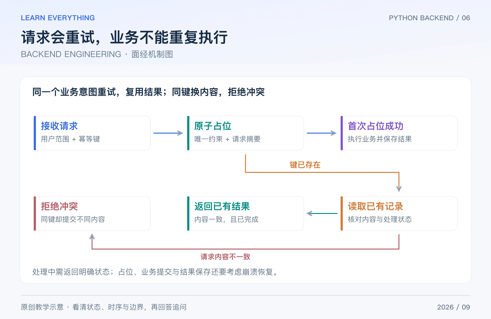

工程题通常没有一句放之四海而皆准的答案。回答时先确认业务效果和故障模型，再说明约束、数据流、恢复方式以及验证方法。本篇用重复请求和接口变慢等常见场景组织八组问答。

## Table of contents

## 1 什么是接口幂等？POST 能做幂等吗？

**短答：** 幂等关心同一个意图重复执行后，预期业务效果是否与执行一次相同，不要求每次返回状态码或响应体完全一样。HTTP 规范把 PUT、DELETE 等定义为幂等方法语义，POST 也可以通过业务设计实现重复提交保护。

例如删除一个已不存在的资源，第一次返回 204、后续返回 404，不一定违背幂等；但“给余额加 10”重复执行两次通常不是幂等。[HTTP 幂等语义](https://www.rfc-editor.org/rfc/rfc9110.html#section-9.2.2)

_图：原创教学图。幂等键要绑定同一业务意图；重复请求与相同键的冲突内容需要区分处理。_

创建订单时，客户端为同一意图携带幂等键；服务端把租户或用户、操作范围、幂等键与规范化请求摘要关联起来，通过数据库唯一约束等方式原子占位。相同键与相同内容可返回已记录结果或明确处理中状态；相同键却换了内容，应拒绝冲突。

**追问：** 先 GET Redis，没有记录再执行，是不是就实现了幂等？不是。两个请求可能同时发现不存在。占位、业务提交与结果保存之间的故障窗口也要处理；关键订单约束应有数据库层保障。

## 2 超时、重试、限流与熔断有什么区别？

**短答：** 超时限制等待；重试在合适失败条件下重新尝试；限流控制进入系统的速率或数量；熔断在下游持续异常时暂时减少调用。这些机制相互配合，但不能互相替代。

重试需要次数、总时间预算、退避和随机抖动。参数错误通常不值得原样重试；网络超时则可能意味着“结果未知”，不是“服务端一定没做”。有副作用的调用应先有幂等或结果查询设计。

**追问：** 每一层各重试 3 次有什么问题？最坏情况下会相乘。三层各最多尝试 3 次，最下游可能收到 27 次尝试；这会把故障放大。应该明确哪一层负责重试，并传播时间预算。

## 3 为什么用了消息队列，任务还会丢失或重复？

**短答：** 要分别考虑业务提交、消息发布、broker 保存、消费者执行和确认。任一步失败都可能留下窗口；“至少一次”投递意味着必须允许重复消费，不是“业务恰好执行一次”。

订单事务提交成功，但消息还没发出去进程就崩溃，是常见窗口。事务 outbox 可以把待发事件和业务数据在同一数据库事务内保存，再由后台发布并重试；发布成功但标记失败可能重复，因此消费者仍要按事件 ID 等去重。

消费者可能完成任务后还没 ACK 就重启，于是再次收到消息。消费去重记录与数据库副作用应尽量处于同一个事务；如果副作用在外部服务，还需要那个服务支持幂等或可核验结果。

Celery 的确认时机和异常重试可以配置，不能只写一个 `acks_late=True` 就声称所有崩溃场景都安全。[Celery 任务说明](https://docs.celeryq.dev/en/stable/userguide/tasks.html)

**追问：** FastAPI BackgroundTasks 能替代可靠队列吗？它适合进程内的响应后工作，但不自带持久化投递与跨进程恢复。重要长任务应考虑独立 worker 与可靠消息机制。[FastAPI 后台任务](https://fastapi.tiangolo.com/tutorial/background-tasks/)

## 4 连接池为什么会耗尽？池开大就能解决吗？

**短答：** 连接可能被慢查询、长事务、未归还的会话或大量并发占住。应先检查等待连接时间、连接使用时长、活跃事务和异常路径，再判断是否扩容。

可以用一个量级估计辅助理解：稳定条件下，平均占用连接数量约等于每秒需要连接的请求数，乘以平均占用时长。每秒 100 个这样的请求、平均持有 0.1 秒，平均占用约 10 个；它不是峰值容量结论，也没有包含长尾和突发。

多进程部署还会放大池大小。例如 4 个 worker 各配置基础池 10，加上各自溢出额度，数据库可能面对超过 40 个连接；不能只看单个进程配置。

**追问：** 超时改长一点为什么更糟？请求在池外排队更久，可能积累更多内存和超时重试。池参数应与数据库容量、事务时长和入口并发一起调整。[SQLAlchemy 连接池](https://docs.sqlalchemy.org/en/20/core/pooling.html)

## 5 一个接口从 100 ms 变成 2 秒，如何排查？

**短答：** 先确定影响范围与开始时间，再把总延迟拆成代理排队、应用执行、连接等待、SQL、缓存和下游调用。用指标找范围，用 trace 看链路，用日志定位具体事件，不先猜“肯定缺索引”。

| 证据                             | 下一步                             |
| -------------------------------- | ---------------------------------- |
| 发布后某一路由变慢               | 对比变更、请求参数与依赖版本       |
| CPU 很高                         | 看热点、序列化、循环或事件循环阻塞 |
| CPU 不高，但连接等待明显         | 看池占用、慢事务、锁与下游延迟     |
| 平均值正常，p99 很差             | 查少量慢请求、重试、热点与排队     |
| Redis 命中率下降且数据库压力上升 | 查失效模式、缓存键变化与回源限制   |

先记录证据，再做一次可归因的改动，最后用相同口径比较。trace ID 应贯穿日志与请求，避免日志里只有“执行失败”四个字。[OpenTelemetry 可观测性信号](https://opentelemetry.io/docs/concepts/signals/)

**追问：** p99 是“最慢那一次”吗？不是，它描述分位位置；单次最大值与分位数不同，统计窗口和样本量也会影响解释。

## 6 Python Web 服务如何部署？为什么不直接用开发服务器？

**短答：** 使用适配框架的生产 WSGI/ASGI 服务器，结合代理、进程管理或容器平台，配置健康检查、日志、资源限制和优雅退出。开发 reload 模式主要为开发便利，不是生产运维方案。

worker 数量要结合 CPU、内存、请求类型和连接池配置。多进程之间不自动共享 Python 全局字典，因此登录状态、分布式限流或关键幂等状态不能只放在某个 worker 的内存里。

发布时应考虑旧版与新版并存、数据库迁移的兼容顺序、请求排空和后台任务退出。回滚应用镜像不一定能撤销已经执行的数据迁移。[FastAPI 部署概念](https://fastapi.tiangolo.com/deployment/concepts/)

**追问：** liveness 和 readiness 有什么区别？存活检查决定是否需要重启；就绪检查决定是否接收流量。把所有下游短暂失败都变成重启条件，可能导致级联重启。[Kubernetes 探针](https://kubernetes.io/docs/concepts/configuration/liveness-readiness-startup-probes/)

## 7 单元测试、集成测试、压测分别验证什么？

**短答：** 单元测试验证局部规则；集成测试验证组件之间的真实交互；端到端测试覆盖关键用户流程；压测关注特定负载模型下的延迟、吞吐、错误和资源表现。

针对创建订单，值得测的边界包括：非法数量、越权访问、库存不足、相同幂等键重复提交、同键不同请求体、并发扣库存、提交后发布消息失败、重复消费以及超时结果未知。

可以 mock 下游以覆盖错误路径，但纯 mock 不能证明真实 SQL、事务隔离和网络协议正确。测试专用数据库或容器可以补集成证据；不同存储引擎不能因为 SQL 看起来相同就互相替代验证。

**追问：** 覆盖率 100% 就证明没问题吗？不是。执行过代码不等于验证了业务约束；并发时序、断言质量和真实依赖行为同样重要。[pytest 测试说明](https://docs.pytest.org/en/stable/explanation/goodpractices.html)

## 8 被问“讲一个后端项目”，如何避免只报技术栈？

**短答：** 按“业务目标 → 一个具体难点 → 我的实现 → 验证证据 → 剩余限制”组织。先说系统为什么存在，再挑一条真实请求链解释，而不是罗列 FastAPI、Redis、MySQL。

可以使用下面的填空结构，但只能填自己实际做过、能够说明证据的内容：

> 系统服务于【具体用户与场景】。我负责【明确模块】。在【触发条件】下出现【实际问题】，通过【日志、测试或测量】定位到【原因】。我做了【具体改动】，并用【相同口径的验证】检查效果。目前仍有【已知限制】。

没有真实压测就说没有测，不编 QPS、用户量或“提升百分比”。如果只有课程或个人项目，可以重点讲正确性、代码组织和你亲自验证过的边界。

**追问：** 最容易被继续追问什么？你为什么选这个方案、替代方案的代价是什么、故障时怎样恢复、哪些代码是你实现的、如果数据量增加会先卡在哪里。用本系列的前七组问题，就能把一段项目介绍逐步展开。

[系列导读](/posts/knowledge/python-backend/interviews/00-interview-roadmap/) · [上一篇：REDIS / CACHE](/posts/knowledge/python-backend/interviews/05-redis-caching/)
