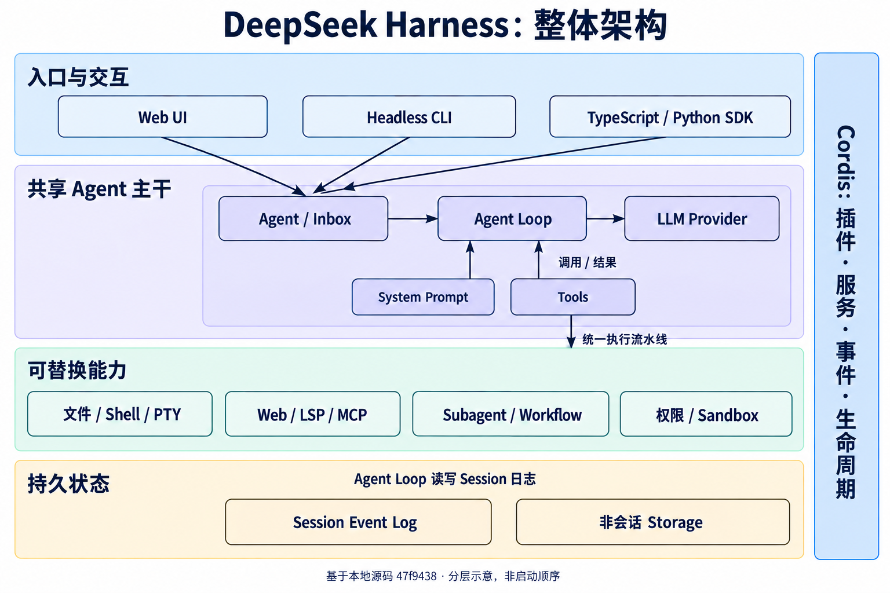

DeepSeek Harness（命令名 `dsh`）解决的是：**怎样把一个会调用工具的大模型，组织成可交互、可恢复、可扩展的编程 Agent 系统。** 模型产生文本或工具调用，Harness 负责输入排队、上下文构造、实际执行、权限检查、状态记录和界面反馈。

它的核心设计是“一切皆插件”：模型适配器、文件工具、审批、持久化、Web UI，甚至默认 Agent 循环本身，都通过 Cordis 组合起来。理解项目时，应同时看清两个方面：一次任务怎样流动，以及每项能力由谁提供、谁消费。

## 阅读范围与版本

本系列检查的是本机 `deepseek-harness` 源码快照，时间为 **2026-09-16**。

| 项目                 | 本次核验结果                                                             |
| -------------------- | ------------------------------------------------------------------------ |
| 本地目录             | `coding-agent-harness/deepseek-harness`                                  |
| 完整提交             | `47f943859bef60e4160492346772ded9b24f765a`                               |
| 提交日期             | 2026-08-13                                                               |
| 根 package.json 版本 | `0.1.0-rc.5`                                                             |
| 源码工作区           | 检查时无未提交改动                                                       |
| 产品阶段             | 当前 README 标为开发者预览，存在破坏性变更预期                           |
| 模块规模             | `packages/*/*/package.json` 共 **219** 个，分属 **49** 个目录组          |
| 主要实现             | TypeScript / ESM、Cordis、React、Node.js；另有 Python SDK 和原生沙箱组件 |

这里的“219 个包”不包含 `vendor`、`apps`、`native`、`website` 和 Python 分发包，也不表示启动后会同时加载 219 个包。本文介绍本地版本，未将它等同于远端最新版本。本次进行源码与配置静态核验，没有调用真实模型 API，也没有替项目执行完整测试套件。

## 系列导航

按“全景 → 主链 → 能力 → 产品与目录”阅读最容易建立完整认识。

| 篇目                                                                                                 | 要回答的问题                                                     |
| ---------------------------------------------------------------------------------------------------- | ---------------------------------------------------------------- |
| **本文：整体架构与模块地图**                                                                         | 项目做什么，49 个模块组怎样分类？                                |
| [第二篇：运行主链、会话与上下文](/posts/projects/deepseek-harness/runtime-and-state)                 | 一次用户输入怎样变成多步工具执行？为什么日志是中心？             |
| [第三篇：工具、权限与任务编排](/posts/projects/deepseek-harness/tools-and-orchestration)             | Agent 怎样读写文件、执行命令、上网、调用子 Agent？               |
| [第四篇：应用入口、Web UI 与完整包索引](/posts/projects/deepseek-harness/platform-and-package-index) | 插件怎样启动、界面怎样工作、SDK 怎样接入？219 个包分别负责什么？ |

图中省略部分中间适配器，以展示模块关系；精确行为以正文和固定版本的源码链接为准。

## 1. 整体架构



图 1：上层入口共享 Agent 服务；工具经统一流水线调用能力。Cordis 管理这些插件的服务依赖与生命周期。非会话 Storage 和 Session Event Log 分别保存不同性质的数据。

把这张图展开，可以得到五个相互配合的部分。

1. **应用入口**：Web UI 接收人的输入，Headless 执行一次任务，SDK/ACP 接收其他程序的请求。
2. **Agent 主干**：管理活跃 Agent 和 Inbox，组装请求，驱动模型与工具交替执行。
3. **能力插件**：实现文件、Shell、终端、搜索、LSP、MCP、子 Agent 等操作。
4. **状态与策略**：保存会话事件，限制执行权限，管理上下文、目标、审批和恢复。
5. **产品界面与工程支持**：把事件投影到浏览器，提供配置编辑、构建、测试与发布基础设施。

这些是便于理解的职责分类，并非五个各自独立的进程。例如 JSONL 持久化和 Web Host 通常运行在 Harness 的 Node.js 进程里；Python SDK 则在另一个进程中通过 stdio 与它通信。

## 2. Cordis 为什么是项目的基础

### 2.1 Context：获取服务的入口

插件通常通过 `ctx` 使用能力，例如：

```text
ctx.agents          创建、查找、恢复活跃 Agent
ctx.sessions        维护内存中的 Session 事件流
ctx.systemPrompt    组装提示词片段和工具定义
ctx.tools           注册与执行工具
ctx.llm             选择模型适配器并处理流式响应
ctx.fs              文件系统能力
ctx.subprocess      子进程与 PTY 基础能力
```

其中 `ctx.agents` 定义公开接口，`agent-loop` 提供默认实现。UI 和扩展插件可以依赖前者，不需要知道默认循环的内部类。这为替换驱动器保留了空间。

### 2.2 Plugin：把功能与清理放在同一个生命周期

一个插件可以注册服务、工具、提示词片段或事件监听器。注册通过 `ctx.effect()`、`ctx.on()` 等机制绑定到插件生命周期；卸载插件时，相应资源需要撤销。

这直接影响实际行为：重新加载插件不能留下重复的工具、旧监听器或无人管理的进程。`subprocess`、Agent 工厂和后台任务因此都有明确的停止、等待结束和清理逻辑。

### 2.3 Event：插件参与运行流程的位置

| 事件类别       | 含义                     | 示例                                      |
| -------------- | ------------------------ | ----------------------------------------- |
| 持久会话事件   | 已发生且需要恢复的事实   | `user/message`、`tool/result`、`turn/end` |
| Agent 运行事件 | 观察、修改或拦截当前执行 | `agent/pre-step`、`agent/request`         |
| 能力事件       | 在具体能力上增加策略     | `tools/pre-execute`、`fs/write-intent`    |

`session/event` 是“日志已追加”的通知，和被记录的 `tool/result` 事件不是同一层概念。部分运行事件采用 waterfall：监听器调用 `next()` 才会继续传给后续监听器；没有调用可能意味着它接管或终止了这条处理链。

### 2.4 Scope：不同 Agent 看见不同能力

工具和提示词可以按作用域注册。当前 preset 实现的查找关系是：

```text
Agent 自身作用域 → Preset 的常驻作用域 → 全局作用域
                  越近的同名贡献优先
```

**当前实现中，同一个 preset 在一个进程里只挂载一次**，多个会话通过作用域父链加入该组合；插件内部仍需按 Session/Agent 区分状态。不能把它理解成“每创建一个会话，就复制并启动一整棵 preset 插件树”。

服务的 Cordis `isolate` realm 与上述注册作用域也不是同一个概念：前者隔离服务实例，后者控制某个 Agent 可见的贡献。两者配合，避免一个 preset 的服务意外成为全局单例。

依据：[架构文档](https://github.com/deepseek-ai/deepseek-harness/blob/47f943859bef60e4160492346772ded9b24f765a/docs/architecture.md)、[当前 preset 实现](https://github.com/deepseek-ai/deepseek-harness/blob/47f943859bef60e4160492346772ded9b24f765a/packages/preset/agent-presets/src/index.ts)。

## 3. 看懂一个能力模块：定义、实现、消费方

项目常用 capability seam 表示“可替换能力的接口及其实现关系”。以执行命令为例：

| 角色               | 对应模块                                                   | 负责的问题                          |
| ------------------ | ---------------------------------------------------------- | ----------------------------------- |
| Service Definition | `shell/shell`                                              | 一次 Shell 请求、结果和错误是什么？ |
| Service Provider   | `bash-local`、`bash-sandbox`、`pwsh-local`、`pwsh-sandbox` | 实际怎样执行命令？                  |
| Consumer           | `tool-bash`、`tool-pwsh`、hook 桥接                        | 怎样把命令能力交给模型或钩子？      |

因此，“模型看见的 Bash 工具”和“执行 Bash 的后端”属于不同职责。换用沙箱后端时，通常不需要重写工具的模型接口。

同样的分工出现在 `llm`、`fs`、`subprocess`、`web`、`lsp`、`subagent`、`compaction` 和 `session-persistence`。但不是每组包都必须拆成三层：Todo 只是某个会话的一份列表，没有必要凭空创造多个后端接口。

## 4. 仓库顶层目录

```text
deepseek-harness/
├── apps/cli/       dsh 命令、profile 启动与内置 agent presets
├── apps/web/       浏览器应用的 Vite 入口
├── packages/       49 个模块组、219 个可组合包
├── vendor/         固定版本的 Cordis 等框架源码
├── python/         Python SDK、配套运行时分发与开发说明
├── native/         Landlock 原生启动器及平台分发
├── examples/       可运行的 cordis.yml 示例与回放用例
├── docs/           架构、子系统、用户指南和生成的目录
├── website/        VitePress 文档站
└── scripts/        构建、类型图、文档目录、质量与发布门禁
```

`packages/examples` 提供可复用的示例组合包；根目录 `examples/` 放加载这些组合的可运行配置，两者层次不同。`apps/web` 也不是所有 UI 代码的所在地，大部分功能在 `packages/client`。

## 5. 49 个模块组的完整地图

以下按职责归类，括号数字是实际包数。第四篇逐包列出 219 个包的职责。

| 职责               | 模块组                                                                                              | 主要问题                                   |
| ------------------ | --------------------------------------------------------------------------------------------------- | ------------------------------------------ |
| 运行主干           | `core`（8）                                                                                         | 会话、输入、提示词、工具与循环             |
| 模型能力           | `llm`（5）                                                                                          | 适配器、流式消息、重试、token 计量         |
| 历史与上下文       | `session`（13）、`compaction`（4）、`context`（4）、`session-query`（4）                            | 保存、恢复、压缩、引用与检索               |
| 文件与进程         | `fs`（7）、`subprocess`（2）、`shell`（9）、`terminal`（3）、`lsp`（3）                             | 读写代码、搜索、执行命令、语义导航         |
| 执行限制与远端环境 | `sandbox`（4）、`e2b`（3）                                                                          | 本地进程限制、共享远端文件和进程世界       |
| 外部知识与工具     | `web`（6）、`skill`（4）、`mcp`（1）                                                                | 搜索抓取、技能发现、MCP 工具接入           |
| 编排与持续任务     | `subagent`（11）、`workflow`（4）、`jobs`（3）、`goal`（4）、`schedule`（1）、`todo`（1）           | 子 Agent、流程、后台任务、目标、提醒、进度 |
| 人机协作与策略     | `interaction`（5）、`plan`（1）、`guard`（2）、`hooks`（3）                                         | 提问审批、计划、超时和钩子                 |
| 可编程执行与扩展   | `code-runtime`（2）、`extensions`（4）                                                              | Code Mode、运行时插件检查与挂载            |
| 应用配置与组合     | `boot`（2）、`bundle`（3）、`preset`（2）、`settings`（2）、`credentials`（2）                      | 启动、组合、角色、设置、凭据               |
| Web 与 API         | `host`（8）、`client`（39）、`api`（2）、`typert`（4）                                              | 浏览器、Host、RPC 和类型元数据             |
| 程序接入           | `sdk`（3）、`acp`（1）                                                                              | 外部程序驱动 Agent                         |
| 其他持久数据       | `storage`（4）、`workspace`（1）、`attachment`（2）、`spill`（3）、`feedback`（2）、`identity`（1） | 工作区、图片、长输出、反馈和匿名标识       |
| 质量与辅助         | `runtime-diagnostics`（1）、`test-support`（6）、`examples`（3）、`util`（7）                       | 运行不变量、测试支持、示例和底层工具       |

## 6. 用一个任务串起所有层

假设用户输入：“修复这个项目的登录错误，运行测试，然后说明改动。”下面是解释性示例，并非本次实际执行记录。

1. Web UI 把输入发送给 Host，Host 找到对应 Workspace、Session 和 Agent。
2. 输入以带标识的消息进入 Inbox；Agent 循环准备新轮次。
3. `system-prompt` 组装工具与提示词；`agent-instructions` 提供工作区指令，历史从 Session 日志派生。
4. LLM 适配器发送请求，把响应转换成统一的流式块。
5. 模型要求 `grep`、`read` 或 `lsp`；工具注册表检查策略，消费具体能力服务。
6. 修改文件前，文件观察策略检查读过的版本，沙箱检查允许写入的位置；需要人工决定时进入审批流程。
7. `bash` 通过 Shell 和 Subprocess 运行测试；长任务可能由 Jobs 管理。
8. 每步的消息和工具结果进入日志，再成为下一次请求的历史。上下文过大时，压缩插件参与下一次请求准备。
9. 模型给出结果；没有进一步工具工作或输入时关闭轮次。
10. UI 消费事件和投影，展示回复、工具卡片、状态及产物；持久化插件负责相应落盘。

如果用户只要求查看代码，并不需要启动所有这些模块；图和示例用于解释它们怎样协作。

## 7. 当前版本最值得注意的边界

| 容易产生的印象                             | 当前实现的准确含义                                                     |
| ------------------------------------------ | ---------------------------------------------------------------------- |
| 名字含 DeepSeek，因此只能调用 DeepSeek     | 有直接 DeepSeek 适配器，也有 `llm-pi-ai` 多提供方适配器                |
| 每个目录都是默认启用的功能                 | 启用情况取决于 profile、bundle、preset 和 patch                        |
| Web 事件下行使用 SSE                       | 当前浏览器业务事件使用两条 WebSocket 下行；部分旧配置注释仍写 SSE      |
| 会话压缩会删除原始日志                     | 原始事件保留，通过追加摘要与替换事件改变模型视图                       |
| Worker 就是安全沙箱                        | Code Runtime/Workflow 的 worker 用于执行隔离和终止管理，不承诺安全隔离 |
| Schedule 能在进程关闭后主动发通知          | 当前是会话内提醒；冷会话恢复为活跃后处理逾期任务                       |
| Goal 或 Ralph 的 complete 代表独立验证通过 | 当前没有独立评估器，完成仍需结合工具证据审视                           |
| Attachment 已支持任意文件                  | 当前持久附件接口只接收 PNG、JPEG、WebP、GIF 图片                       |

这些边界来自对应实现和包说明，详细出处在后续各篇。尤其不要把旧概览里“每会话挂载 preset”“步骤后压缩”等简化说法直接当成当前函数调用顺序。

## 8. 推荐的源码阅读路线

| 顺序 | 先读哪里                                                                       | 读完应能回答什么                 |
| ---- | ------------------------------------------------------------------------------ | -------------------------------- |
| 1    | `docs/architecture.md` 与 `packages/README.md`                                 | 插件、事件、能力服务分别是什么？ |
| 2    | `apps/cli/src/bin.ts`、`profile-boot.ts`、`packages/bundle/*/cordis.patch.yml` | 一个运行实例怎样装配？           |
| 3    | `packages/core/agent/src/types.ts`、`agent-loop/src/agent.ts`                  | 输入怎样排队，轮次怎样结束？     |
| 4    | `packages/core/session/src/index.ts`、`surface.ts`                             | 为什么模型历史能从日志重建？     |
| 5    | `packages/core/tools/src/index.ts`、`agent-loop/src/tool-calls.ts`             | 策略、并发与结果顺序怎样配合？   |
| 6    | `packages/fs/tool-fs`、`packages/shell/tool-bash`                              | 一个真实工具怎样落到能力后端？   |
| 7    | `packages/client/connection`、`runtime`、`ui-conversation`                     | 同一个会话怎样出现在浏览器？     |
| 8    | 自己关心的 `subagent`、`compaction`、`sdk` 等模块                              | 怎样在已有扩展点上添加功能？     |

固定版本入口：[源码树](https://github.com/deepseek-ai/deepseek-harness/tree/47f943859bef60e4160492346772ded9b24f765a)、[包目录](https://github.com/deepseek-ai/deepseek-harness/blob/47f943859bef60e4160492346772ded9b24f765a/packages/README.md)、[CLI 入口](https://github.com/deepseek-ai/deepseek-harness/blob/47f943859bef60e4160492346772ded9b24f765a/apps/cli/src/bin.ts)。这些链接由本地已读取文件与提交号建立，不代表另外核验了远端运行状态。
