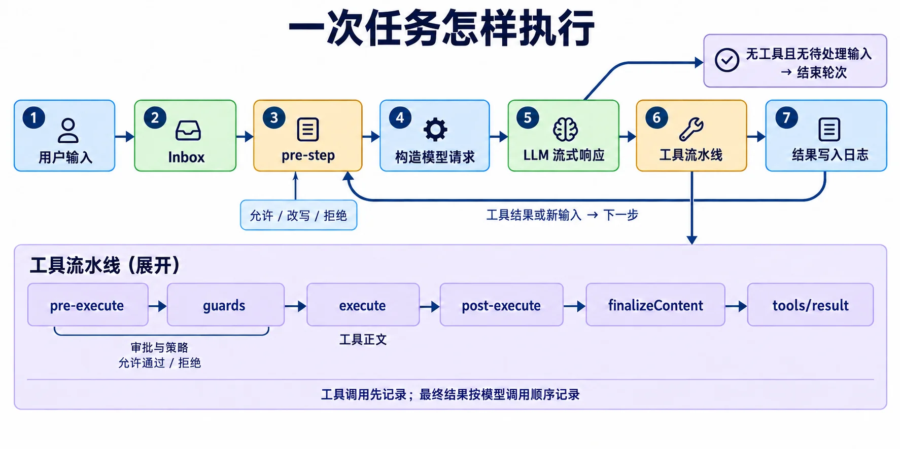
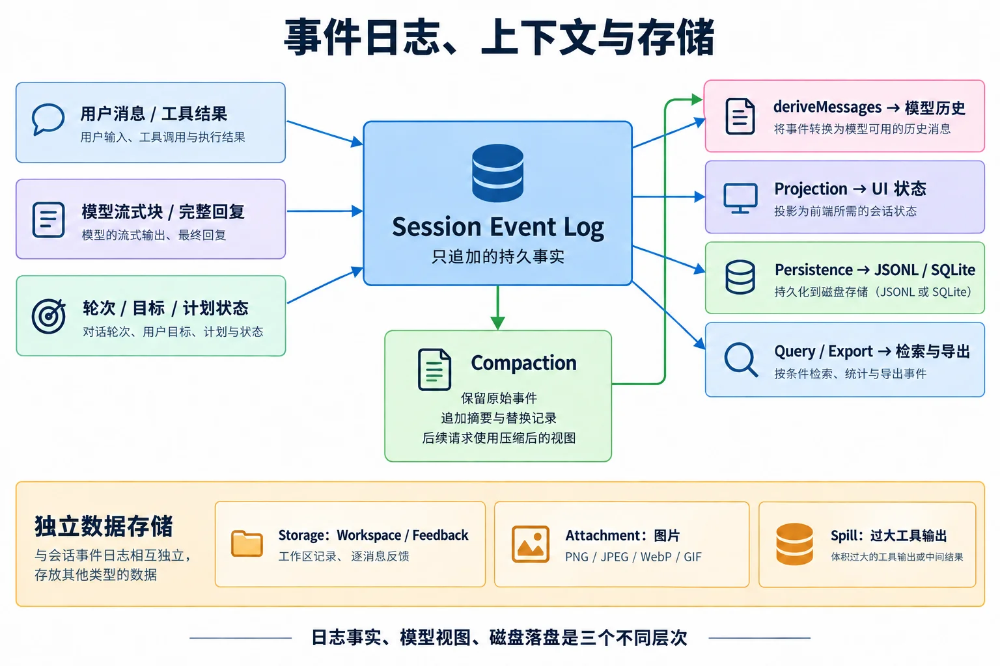

本篇回答项目最核心的问题：**用户输入怎样经过 Agent、模型和工具，成为一段可以重建的会话历史？** 基于本地提交 `47f943859bef60e4160492346772ded9b24f765a`，核验范围与总目录见[第一篇](/posts/projects/deepseek-harness/project-overview)。

## 1. 先分清 Agent、Session、Turn 和 Step

| 概念                 | 负责什么                                               | 不能混同的对象                               |
| -------------------- | ------------------------------------------------------ | -------------------------------------------- |
| Agent                | 当前活跃的执行对象，持有 Inbox、状态、上下文和取消能力 | 不是磁盘上的聊天文件                         |
| Session              | 带身份和元数据的事件日志，是会话事实来源               | 不等于只含 user/assistant 的消息数组         |
| Turn                 | 从准备领取输入到不再欠下工作的一轮活动                 | 不保证只调用一次模型                         |
| Step                 | 一次步骤中的请求处理及对应工具执行                     | 内部错误恢复可能重试模型请求                 |
| Provider             | 实现一个能力接口的后端                                 | 不一定都是模型厂商，也可能是文件或子进程后端 |
| Projection / Surface | 从事件折叠出来的使用视图                               | 不替代原始日志的事实地位                     |

同一个 Turn 可以是“搜索 → 读文件 → 修改 → 测试 → 回复”的多个 Step。一个没有被允许进入的输入尝试，也可能记录 `turn/start` 和 `turn/end`，但没有任何 Step 或模型调用。

## 2. core 的八个包怎样分工

| 包目录（均在 `packages/core/`） | 职责                                                         | 关键落点                            |
| ------------------------------- | ------------------------------------------------------------ | ----------------------------------- |
| `agent`                         | 公开 Agent 接口、活跃注册表、创建/恢复工厂、Inbox 与运行事件 | `src/types.ts`、`src/index.ts`      |
| `agent-loop`                    | 默认 `ReactLoopAgent`，推进轮次、调用模型、调度工具          | `src/agent.ts`、`src/tool-calls.ts` |
| `session`                       | Session 数据结构、只追加日志、历史投影、fork 与修复辅助      | `src/index.ts`、`src/surface.ts`    |
| `system-prompt`                 | 收集作用域内的提示词片段和工具 schema，生成请求前缀          | `src/index.ts`                      |
| `tools`                         | 工具注册、参数/结果处理、策略流水线、Native/Code Mode        | `src/index.ts`、`src/code-mode.ts`  |
| `scope`                         | Agent/preset/global 注册查找与作用域关系                     | `src/index.ts`                      |
| `agent-default-model`           | 入口共享的默认 provider/model 选择                           | `src/index.ts`                      |
| `agent-tool-presentation`       | 按 Agent/preset 选择 native、code 或 both 工具呈现           | `src/index.ts`                      |

这里的 `ReactLoopAgent` 是推理与行动循环的类名，不表示这个类在执行 React 浏览器渲染。

`agent-loop/src/index.ts` 还负责工厂所有权：创建尚未发布的 Agent/Session，执行 `setup`，成功后发布；失败时回滚。拥有 `AgentHandle.dispose()` 的调用方能够停止驱动器、等待退出、撤销注册并清理作用域。单纯通过注册表获得 Agent 的消费方，不自动获得这份销毁所有权。

依据：[Agent 接口](https://github.com/deepseek-ai/deepseek-harness/blob/47f943859bef60e4160492346772ded9b24f765a/packages/core/agent/src/types.ts)、[Agent 工厂](https://github.com/deepseek-ai/deepseek-harness/blob/47f943859bef60e4160492346772ded9b24f765a/packages/core/agent-loop/src/index.ts)。

## 3. 一次输入的实际调用链



图 2：展示正常路径。图中省略请求错误恢复、`agent/turn-stopping` 和取消分支；正文补充这些细节。

### 3.1 输入进入 Inbox：三个方法代表三种时机

在 `agent-loop/src/agent.ts` 中，这三个公开方法最终都调用 `send()`：

```ts
followup(input) → send(input, "next-turn", true)
steer(input)    → send(input, "next-step", true)
inject(input)   → send(input, "next-step", false)
```

这是从源码提炼的调用关系，省略了 TypeScript 类型和方法体格式。

| 方法       | 目标位置           | 是否唤醒空闲 Agent | 典型用途                         |
| ---------- | ------------------ | ------------------ | -------------------------------- |
| `followup` | 下一轮             | 是                 | 用户发出普通后续请求             |
| `steer`    | 最近可进入的下一步 | 是                 | 运行中补充要求或修正方向         |
| `inject`   | 最近可进入的下一步 | 否                 | 插件增加上下文，等待其他输入唤醒 |

Inbox 的变化也通过 `agent/inbox/spliced` 等持久事实重建。`MessageId` 标识消息的插入、领取与丢弃，但不能直接当作“对应某条最终回复”的结果 ID。

取消正在收敛时，新唤醒输入会被安排到下一轮，避免把新任务塞进已经取消的活动。`whenIdle()` 等待的是整个 Agent 当前活动及其衔接工作静止，不能天然证明某一条消息独立执行完毕。

### 3.2 打开轮次，再准备第一步

主调用关系为：

```text
followup / steer
  → send
  → wakeDriver
  → kick
  → turn
  → preStep
  → step
  → buildRequest
```

`turn()` 先追加 `turn/start`，随后 `preStep()`：

1. 从 Inbox 领取消息；第一步可以领取一条 `next-turn` 和当前 `next-step` 输入。
2. 调用 `systemPrompt.assemble()`，收集该 Agent 可见的提示词和工具。
3. 投影当前运行上下文。
4. 进入 `agent/pre-step` waterfall，由插件允许、改写或拒绝消息。
5. 获准进入后，记录 `step/start`，再记录本步实际进入的 `user/message`。

如果首批输入被拒绝，轮次以 blocked 结束；初次进入被改写为空时，可以不花费模型调用就结束。这样“输入到达过”和“模型真的看见过”有各自的证据。

### 3.3 构造请求：历史来自日志，配置也要可重建

`step()` 渲染组装结果，然后把 `session.deriveMessages()` 交给 `buildRequest()`。后者会：

- 从 Agent 选项与已记录请求头构造配置提案；
- 经过 `agent/request`，允许插件修改 provider/model 等请求配置；
- 通过 `llm.prepareCall()` 解析适配器的精确模型默认值；
- 建立规范化请求头，记录请求前缀、工具与配置所需的事实；
- 将最终请求绑定到选中的模型适配器。

因此，历史不会依靠另一个无人维护的 `messages.push(...)` 数组。项目明确要求“模型可见即已记录”，运行不变量会核查模型请求与日志的可重建关系。

### 3.4 流式响应：原始块与完整消息各有用途

LLM 返回统一 `StreamChunk`。循环逐块追加 `assistant/chunk`，同时交给 `BlockAssembler`。流结束后形成 `assistant/message`，并关联来源 chunk 的序号。

原始 chunk 能保存流式展示细节；完整 message 适合形成后续模型历史。两者同时记录并不是让后续请求把同一段回复重复发送两遍。

如果流结束为错误或中断，循环进入 `agent/request-error`。某个插件明确返回 `{ kind: "retry" }`，才能重建请求并重试；否则错误继续传播。当前代码的这一恢复发生在 `step()` 的内部循环中，不能笼统画成“每次失败都新建一个 Step”。

### 3.5 工具执行完成后决定继续还是结束

完整 Assistant 消息里有工具调用时，`executeToolCalls()` 负责执行。正常工具结果通常意味着模型还欠一次解释或后续决策，因此进入下一 Step。

当模型没有工具调用，或工具结果带有 `concludesTurn` 时，循环开始检查结束条件。但是同一步新增上下文和已经到达的 steering 仍会被处理。`agent/turn-stopping` 监听器还可以通过新的 steering 让轮次继续。

最后写入 `step/end` 和 `turn/end`。终止原因能区分 completed、blocked、max-tokens、aborted、error 等；“用户收到一段文字”不等于整个 Turn 已经完成。

源码主证据：[ReactLoopAgent](https://github.com/deepseek-ai/deepseek-harness/blob/47f943859bef60e4160492346772ded9b24f765a/packages/core/agent-loop/src/agent.ts)。

## 4. tools：统一执行流水线与并发调度

### 4.1 单次工具执行经过哪些关口

```text
日志 tool/call
  → tools/pre-execute：前置策略，允许 / 拒绝 / 请求审批
  → monotonic guards：最终约束，只能拒绝或不反对
  → tools/execute：环绕实际工具正文，例如超时控制
  → tools/post-execute：处理结果，例如替换内容、溢出落盘
  → 结果快照与规范化
  → finalizeContent：工具自己维护最终内容约束
  → tools/result：观察冻结后的权威结果
  → 日志 tool/result
```

Waterfall 中发生的拒绝或异常不会简单等同于“没有结果”；注册表会按其规则生成错误结果或规范化处理。请求审批时，如果没有能够回答的提供方，执行不会默认获得许可。

`tools/result` 是执行流水线的实时通知，`tool/result` 是 Session 日志事件。名称只差一个 `s`，但两者职责不同。

### 4.2 并行的是执行，不是无序提交

工具定义可以声明并行或独占执行模式。`tool-calls.ts` 使用有上限的滚动并发池；独占调用形成屏障，后续任务在开始前还会重新检查实时注册表中的执行模式。

举例：模型依次要求读取 A、B、C，B 最先返回，并不意味着历史先记录 B 的最终结果。调度器按模型调用顺序提交结果和附加上下文，维持可预测的日志顺序。

普通取消会停止启动新调用，等待已经开始的调用收敛，并为未执行的调用记录合成的取消结果，保持回放中的调用/结果关系。内部调度器失败另有路径：收敛已启动工作，但不会编造成功结果填补缺口。

源码：[工具注册表](https://github.com/deepseek-ai/deepseek-harness/blob/47f943859bef60e4160492346772ded9b24f765a/packages/core/tools/src/index.ts)、[调度器](https://github.com/deepseek-ai/deepseek-harness/blob/47f943859bef60e4160492346772ded9b24f765a/packages/core/agent-loop/src/tool-calls.ts)。

## 5. llm：统一消息协议与可替换模型后端

| 包             | 作用                                                      | 与主循环的连接                |
| -------------- | --------------------------------------------------------- | ----------------------------- |
| `llm`          | 请求、消息块、流式块、错误、适配器注册与 `BlockAssembler` | 提供 `ctx.llm`                |
| `llm-deepseek` | 直接 DeepSeek Chat Completions 适配                       | 将提供方流转换为项目统一协议  |
| `llm-pi-ai`    | 使用 pi-ai 的多提供方能力                                 | 在同一 `ctx.llm` 下注册适配器 |
| `llm-retry`    | 根据 provider 路由管理重试策略                            | 监听 `agent/request-error`    |
| `token-meter`  | 根据日志和可复用 usage 估计请求/历史 token                | 被压缩与界面计量消费          |

`provider` 选择已注册的适配器路由，`model` 才是该适配器中的模型标识。两者都要正确，单纯填一个模型名称不能自动创建后端。

消息协议还区分文本、推理、工具调用、工具结果与图片等内容。适配器承担的工作远多于发送一个 HTTP 请求：它需要处理流语法、错误归类、模型参数、图片引用、usage 与 replay 信息。

Token 计量也不总是精确 tokenizer：缺少可复用的提供方 usage 时，会使用启发式估算，因此文章不把上下文比例当作精确计费值。

来源：[LLM 模块](https://github.com/deepseek-ai/deepseek-harness/blob/47f943859bef60e4160492346772ded9b24f765a/packages/llm/README.md)、[流式组装器](https://github.com/deepseek-ai/deepseek-harness/blob/47f943859bef60e4160492346772ded9b24f765a/packages/llm/llm/src/assembler.ts)。

## 6. Session：事实日志、模型视图、磁盘持久化



图 3：箭头表示派生或消费关系。Attachment 和 Spill 的实体另行保存，日志可以携带它们的引用；独立存储并不表示业务上毫无关联。

### 6.1 核心日志保存什么

`SessionEvent` 具有递增 `seq`、时间、事件类型及数据。有些表面事件还携带 `sourceEventSeqs` 与 `surfaceOp`，说明它从哪些早先事实派生，以及怎样影响当前视图。

`Session.append()` 会对候选数据做无损 JSON 快照与相关校验，然后冻结已提交记录。`deriveMessages()` 从当前 surface 派生模型历史；`requestHeader()` 折叠请求配置与前缀。fork 则从允许的历史边界建立带血缘的子会话。

“只追加”约束针对权威事实流。当前模型视图可以通过新追加的 replacement 事件替换早先可见内容，历史事实本身仍在日志里。

### 6.2 内存中记录，不代表已经同步落盘

`core/session` 管内存 Session；`session/session-persistence` 管磁盘接口和写入协调。这两个层次有不同的失败与完成时机。

- `session/event` 是提交后的追加通知，观察方失败不能倒过来取消已经提交的内存事实。
- `session/flush` 是需要等待的持久化检查点，调用方等所有相关处理完成。
- `session-checkpoint-policy` 在指定语义位置安排检查点。
- JSONL 或 SQLite 后端负责真正保存会话元数据与事件。

这意味着恢复能力需要“日志格式 + 写入协调 + 检查点策略 + 后端”一起成立，而不是只要文件名以 `.jsonl` 结束就自动可靠。

### 6.3 恢复时怎样处理半途崩溃

`load()` 的冷恢复会保留已经提交的事实，并为未闭合的轮次补入相应结束记录或未知/未执行工具结果。只允许处理受支持的尾部残片；已提交内容损坏、格式不受支持或不认识的必需事件会明确拒绝。

`inspect()` 可先给出经过验证的只读逻辑视图，不提交修复；`prepare()` 为后续真正恢复保留尚未发布的 Session；`readFrom()` 面向需要事件后缀的消费方。这些接口分开，能避免一次查看历史就无意触发相同的恢复副作用。

事件恢复不等于文件、网络或命令副作用的事务性回滚。某个工具已改变外部环境但结果未落盘时，系统需要如实表达未知，而不能据此宣称具备通用 exactly-once 执行保证。

依据：[Session 实现](https://github.com/deepseek-ai/deepseek-harness/blob/47f943859bef60e4160492346772ded9b24f765a/packages/core/session/src/index.ts)、[持久化接口](https://github.com/deepseek-ai/deepseek-harness/blob/47f943859bef60e4160492346772ded9b24f765a/packages/session/session-persistence/README.md)、[修复辅助](https://github.com/deepseek-ai/deepseek-harness/blob/47f943859bef60e4160492346772ded9b24f765a/packages/core/session/src/repair.ts)。

## 7. session 组的其余职责

| 子系统 | 包                                                                                                            | 作用                                                   |
| ------ | ------------------------------------------------------------------------------------------------------------- | ------------------------------------------------------ |
| 持久化 | `session-persistence`、`session-persistence-jsonl`、`session-persistence-sqlite`、`session-checkpoint-policy` | 保存与恢复日志，安排检查点                             |
| 投影   | `session-projection`、`session-projection-cache`、`session-stats`                                             | 从事件形成 UI 领域状态，保存投影检查点，统计轮次与时间 |
| 标题   | `session-title`、`session-title-llm`、`session-title-first-prompt-llm`、`session-title-all-prompts-llm`       | 确定性回退标题，以及可选的模型标题生成                 |
| 遥测   | `session-telemetry`、`session-telemetry-otel`                                                                 | 捕获、可配置脱敏扩展及 OpenTelemetry 交付              |

投影缓存保存“已经折叠到哪里及其状态”，配合后缀事件读取，避免每次列表访问都重放完整长会话。它是可派生数据，不能替代原始 Session 日志。

模型标题提供方一次只允许一个；即使没有模型标题服务，也保留确定性回退。遥测提供脱敏 waterfall，但不自带脱敏规则，是否脱敏取决于部署加载的监听器。遥测支持 `FULL`、`FEEDBACK_ONLY`、`DISABLED` 等模式，其作用是可观测性，不是模型记忆。

## 8. compaction：在有限上下文里继续工作

四个包分别是接口 `compaction`、默认摘要实现 `compaction-basic`、无需模型的工具结果裁剪器 `compaction-tool-result-pruner`，以及面向人的 `command-compact`。

当前实现的自动压力检查挂在 **`agent/pre-step`**，位于请求历史正式派生之前；提供方明确报上下文溢出时，还会走 `agent/request-error` 恢复分支。

主要过程是：

1. `token-meter` 估计当前规范请求与历史的压力。
2. 按实际 provider/model 的容量与配置确定预算。
3. 如果挂载了裁剪器，先缩减过大的工具文本结果，再重新计量。
4. 仍然超限时，选择较老且工具调用/结果成对的完整区域，保留近期尾部。
5. 直接调用 `ctx.llm.stream()` 生成摘要；这次辅助请求不经过 loop 专属的 `agent/request`。
6. 追加压缩开始、摘要、视图替换和结束事实；下次模型历史使用替换后的 surface。

包级默认策略包括 `thresholdRatio: 0.8`、`retainRatio: 0.16`，但具体部署可以覆盖，不能据此推断用户当前启动实例一定使用这些值。摘要要确实缩短选定历史；失败、取消、区域变化和不可拆分的大内容有各自限制。

需要区别三种减少输出体积的方法：

| 方法               | 发生位置                                           | 是否额外调用模型 |
| ------------------ | -------------------------------------------------- | ---------------- |
| Spill              | 工具输出返回时，正文保存为文件并给出预览和定位信息 | 否               |
| Tool Result Pruner | 对已记录的过大工具结果做模型视图替换               | 否               |
| Compaction 摘要    | 对更长历史区域生成摘要并替换模型视图               | 通常是           |

来源：[压缩实现](https://github.com/deepseek-ai/deepseek-harness/blob/47f943859bef60e4160492346772ded9b24f765a/packages/compaction/compaction-basic/src/index.ts)、[压缩策略说明](https://github.com/deepseek-ai/deepseek-harness/blob/47f943859bef60e4160492346772ded9b24f765a/packages/compaction/compaction-basic/README.md)。

## 9. context 与 session-query：上下文从哪里来

| 模块                   | 输入                    | 输出与作用                           |
| ---------------------- | ----------------------- | ------------------------------------ |
| `agent-instructions`   | 工作区指令文件          | 会话范围的模型上下文                 |
| `time-context`         | 当前时间、经过时间      | 时效相关的请求上下文                 |
| `tmux-context`         | tmux 所在位置等运行信息 | 可选终端环境上下文                   |
| `session-reference`    | 其他会话的有界快照      | 带来源、按不可信内容处理的引用上下文 |
| `session-query`        | 活跃或持久会话          | 精确读取、过滤、关系和追踪接口       |
| `session-query-sqlite` | 派生检索数据            | SQLite 全文搜索、排序和结果片段      |
| `tool-session-query`   | 模型查询请求            | 带工作区访问约束的检索工具           |
| `session-log-export`   | 会话导出请求            | Web `/export` 与下载界面             |

检索与压缩是独立功能：压缩帮助当前请求装进窗口，检索帮助找回需要的历史。检索索引可以重建，并且不能和权威会话 SQLite 数据库指向同一个文件。

当前 base/web 配置中的检索后端使用 `openAt: never`，所以**全文搜索默认关闭**；这不影响接口中仍可用的精确读取、过滤和追踪。只有对应配置启用后，全文索引才会打开。

## 10. 会话之外的数据

`storage` 是非会话数据的通用存储中心，配有 `storage-json`、`storage-sqlite` 和类型化的 `storage-domain`。Workspace 记录和逐条消息反馈通过这套数据域保存。

`workspace` 保存目录的规范身份、标题与有序 session 成员关系；它不是把项目源码全文存进数据库。

`attachment` 定义不可变图片引用、校验和存储接口，`attachment-local` 在 Harness home 中进行内容寻址保存。提交图片后，日志持有可序列化引用；未发送的浏览器草稿仍由浏览器管理。当前接口只支持 PNG/JPEG/WebP/GIF，通用文件、音频和视频持久附件尚未覆盖。

`spill` 定义长文本落盘，`spill-local` 提供本地实现，`spill-policy` 在工具后处理阶段判断是否需要保存并返回有界预览。

`feedback` 中的 `message-feedback` 管逐 Assistant 消息的本地反馈及校验，`command-feedback` 提供用户反馈命令，将 `feedback/record` 写入日志但不加入模型历史；在 FEEDBACK_ONLY 遥测模式下，这类明确反馈可触发日志前缀交付。逐消息反馈本身不进入模型 Session 历史，也不要把它与 `FEEDBACK_ONLY` 遥测交付策略直接画成同一份数据。

`identity/anonymous-user-id` 提供共享匿名标识。它是产品识别信息，不是用户登录认证系统。

来源：[存储组](https://github.com/deepseek-ai/deepseek-harness/blob/47f943859bef60e4160492346772ded9b24f765a/packages/storage/README.md)、[图片附件边界](https://github.com/deepseek-ai/deepseek-harness/blob/47f943859bef60e4160492346772ded9b24f765a/packages/attachment/attachment/README.md)、[查询后端](https://github.com/deepseek-ai/deepseek-harness/blob/47f943859bef60e4160492346772ded9b24f765a/packages/session-query/session-query-sqlite/README.md)。

接下来阅读[工具、权限与任务编排](/posts/projects/deepseek-harness/tools-and-orchestration)，可以把本篇的“工具正文”继续追到真正的文件、进程与子 Agent。
